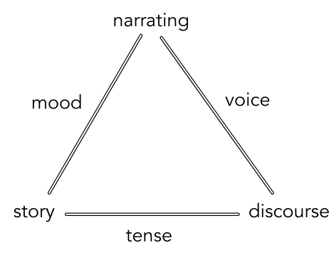
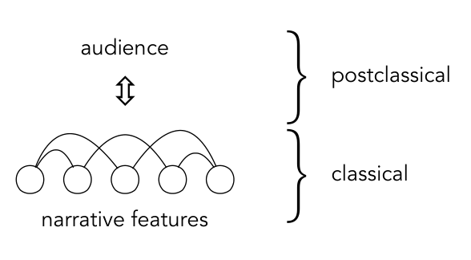

# Narrative Theory for Computational Narrative Understanding

## 阅读定位与中心论点

这是一篇 **position paper／理论与研究议程论文**。作者把叙事学中的核心概念映射到 NLP 研究，主张用统一的理论框架连接人物识别、事件、时间、地点、叙述视角与社会层面的叙事现象。它不提出训练算法、损失函数或新 benchmark，也没有可供报告的模型性能主表。

本笔记依据本地 PDF，完整覆盖正文 §1–4：PDF pp.1–9，对应论文印刷页 298–306。原文两张图均已嵌入对应讨论。文中的计算任务和论文举例属于作者对既有工作的梳理；后面的项目应用是阅读推论，不是作者已经验证的系统设计。

核心观点可以归纳为：**叙事理解既要表示故事世界中的行动，也要表示这些行动被谁选择、怎样讲述、在什么情境下被谁接收。**进一步的目标是解释叙事怎样在社会中传播、怎样引起读者反应、怎样成为人理解世界的组织方式。把文章缩成 `event → scene → plotline` 会遗漏一大半论证。

## 1 Introduction：为什么 NLP 需要叙事理论

过去的 NLP 已发展出摘要、常识推断、事件检测等处理故事的能力，但这些工作使用的叙事概念往往来自不同传统，彼此缺乏对齐。作者认为，计算研究带来了重要的实证方法，却常与人文、社会科学、认知科学中的叙事理论脱节。问题不只是术语不统一：如果没有共同框架，研究者可能在看似相同的任务上测量不同现象，也可能看不到两个任务其实处于同一个解释链条中。（§1，PDF p.1／印刷 p.298）

叙事又不局限于小说。作者列举经济、气候行动、政治极化、心理健康等领域，说明故事参与人们理解世界、赋予经验意义、形成行动动机和建立共同体的过程。因此，计算叙事学的应用范围包括文学分析，也包括社会行为和公共传播。

论文的组织有明确层次：先讨论“何为叙事性”，再拆分基本要素，并对应已有 NLP 能力与研究缺口，最后讨论把这些要素组合起来之后可以研究的高层社会问题。作者希望提供协调研究的起点，而不是声称已经完成统一理论或验证了唯一表示方式。

## 2 The elements of narrativity

### 2.1 Towards a working definition of narrativity：从事件变化到讲述情境

**叙事性没有一个公认的最小定义。**作者先介绍强调时间、过程和状态变化的传统：叙事组织行动者与环境的持续互动，表现失衡、尝试和结果等变化。这一传统关注 story-level，也就是故事世界中发生了什么。问题在于，即使世界事件相同，叙述者选择哪些事件、如何排序、何时透露信息，也会产生不同叙事。（§2.1，PDF pp.2–3／印刷 pp.299–300）

*原文 Figure 1，PDF p.2。三个顶点分别对应事件、事件的叙述组织、讲述行为；三条边标记 tense、mood、voice。*

图 1 引入三个互相关联的对象：

| 对象 | 本文中的含义 | 计算上需要区分的内容 |
|---|---|---|
| Story | 被讲述的事件及故事世界 | 谁做了什么，世界中事件怎样发生 |
| Discourse | 这些事件被呈现的顺序与详略安排 | 哪些事件被省略、先讲或后讲，哪些被展开 |
| Narrating | 叙述者塑造信息的讲述行为 | 谁在说，以什么位置和视角组织材料 |

作者借用 Genette 的 tense、mood、voice 来讨论时间与事件次序、事件性与描述的关系，以及视角、对话、聚焦等问题。这些词来自语法，但在叙事学中指向更广的关系，不能直接等同于 NLP 中的时态、语气、语态标签。

**后经典叙事学把 audience 和 situatedness 加入分析。**叙事既是文本属性，也是认知过程；同样的内容置于不同媒介、平台、社群或交流场合，会产生不同的讲述和理解。例如社交平台上的一串状态更新可以随时间共同构成故事，不必有一篇边界清晰的完整文档。作者援引 small stories，强调讲故事的互动性。

*原文 Figure 2，PDF p.3。下层连接 narrative features，上层加入 audience 与这些关系的互动。图中上下层是分析层次，不是神经网络结构。*

因此 narrativity 可以是一种程度，而非“故事/非故事”的二分类。作者提出一个最小描述框架：某人在某种情境中，以某种方式向某人讲述，某个行动者在某时某地出于某种原因做了什么，可能作用于另一个对象。原文用 A–J 标示：

| 标签 | 原文要素 | 中文理解 |
|---|---|---|
| A | Teller | 讲述者 |
| B | Mode of telling | 讲述方式 |
| C | Recipient | 接收者 |
| D | Situation | 讲述所处的情境 |
| E | Agent | 故事中的行动者 |
| F | One or more sequential actions | 一个或多个有次序的行动 |
| G | Potential object | 行动可能指向的对象 |
| H | Spatial location | 故事中的空间位置 |
| I | Temporal specification | 时间限定 |
| J | Rationale | 行动缘由 |

这些变量不必全部在文本中显式表达。作者认为它们可以隐含存在，并提出显式程度可能影响受众感知到的叙事性。这里是理论假设，并无本文实验验证。原文紧随表后的文字写成“eight features”，但实际列出 A–J 十项；笔记按实际列表保留，不替作者删去变量。

这个框架的重要作用是划分两个层面：A–D 涉及讲述活动及其情境，E–J 涉及被讲述的世界。后文只对其中若干组集中展开，不应把目录没有单独标题的 rationale 等要素视为被否定或无关。

### 2.2 Agents (E, G)：人物不仅是一个命名实体

后经典理论强调作为体验主体的 characters/agents。作者引用 experientiality 的观点：有些叙事可以没有典型情节，却仍需要某种人类或拟人体验者。由此，人物识别是叙事理解的基础，但“识别人名”远不足以完整表示行动者。（§2.2，PDF pp.3–4／印刷 pp.300–301）

**Agent detection。**故事中的“马车夫”“青蛙”等可以是行动者，却未必是标准 NER 的人名实体。计算任务需要区分角色与其他被命名对象，处理有生性、文学领域的实体识别和跨表述身份。进一步的问题是人物属性：Propp 的功能角色、Forster 的圆形/扁平人物，以及情绪、欲望、权力、性别和宗教等研究视角。

作者特别指出 character attribute inference 仍有很大空间。模型需要估计叙事文本中如何呈现人物，而不能把模型自身或外部社会的刻板印象灌进去。这样的表示可以用于分析谁被忽略、谁被定型描写，也就是 representation harms。这一目标要求把“文本证据支持的刻画”与“模型先验猜测”分开。

**Relation detection。**人物关系图也不是把共现人物直接连边就完成了。两个人交谈、互相看见、一人想起另一人、在街上擦肩而过，代表不同的互动。已有方法包括引语关联、固定关系标签的监督学习，以及从语料中学习关系描述。作者认为关系定义本身就是重要问题：抽取算法会把一种“何谓互动”的理论假设带入网络。

亲属关系预测是一个具体挑战。兄弟姐妹或亲子关系可能只通过一句话甚至隐含常识表达，却对家庭结构分析非常关键。更可靠的关系识别可以研究家庭规模、代际权力、冲突以及儿童行动能力随时代的变化。这里从底层抽取连接到文化研究的问题链条，是本节的主要价值。

### 2.3 Events (F)：序列关系与层级结构是两类任务

作者把事件问题分成两类：一类是理解事件顺序，以及 story 与 discourse 的偏离；另一类是把事件组织为更高层的功能单元。前者不等于按文本顺序排列表，后者也不等于每几句做一次摘要。（§2.3，PDF pp.4–5／印刷 pp.301–302）

**Narrative sequence。**叙述者从可能报告的事件中选择一部分，再按某种顺序呈现。已有 NLP 从单个事件检测，发展到 narrative event chains、概率框架和 schemas，试图学习典型事件及参与者关系。scripts 反映经验上常共同出现的事件序列，可以辅助推断未明说的环节和后续预期。

作者将这些工作连接到 eventfulness、pacing 和 suspense：事件密度、相对于描述的行动比例、预期事件是否出现，都可能影响阅读节奏和悬念。另一条连接是因果：知道事件先后并不足以知道为什么发生，但建立可靠顺序是因果理解的重要基础。本文没有提出一个从事件链直接计算悬念的统一公式，而是指出这些任务值得联合研究。

**Narrative structure：段落/篇章局部层面。**原文明确区分三种边界和聚合问题：

| 单元 | 主要关心什么 | 为什么不能混为一谈 |
|---|---|---|
| Scene | 时间、地点、行动者变化构成的局部场景边界 | 这是故事片段之间的横向切分 |
| Narrative level | 故事中嵌套另一层故事，如《一千零一夜》 | 这是叙述嵌套的纵向关系，并关联讲述视角 |
| Plotline | 跨场景、跨层级，由相关行动者贯穿的更大叙事单元 | 可跨时间与空间，不能只看相邻段落 |

作者给出层级记号 `event–scene–level–plotline–plot`。这是一种研究组织方案；相邻概念的关系并不都等于普通数据库里严格的包含关系。尤其 narrative level 是嵌套维度，如果实现成“所有 scene 先归一个中间层，再唯一归一个 plotline”，可能歪曲原文强调的横向/纵向区分。

**Narrative structure：文档整体层面。**作者讨论用 Labov 和 Waletzky 框架识别最值得讲述的事件（most reportable event, MRE），但指出它对短故事有用，对长篇复杂叙事并不充分。更广的方向包括失衡与状态变化、转折点、情节中的命运起伏。情感曲线是已有一种近似方法，但 sentiment valence 不等于完整的情节结构，仍需研究这些转折的形式与认知条件。

本节最后明确反对单一方案普适化：没有一种结构分析适合所有叙事类型，理论定义、任务设定和经验验证需要共同推进。因此不能把其层级记号包装成作者已证明最优的事件聚合算法。

### 2.4 Temporality (I)：先区分“讲了多久”与“故事过了多久”

第一组时间问题是 **narrative time 与 narrated time** 的关系。后者是故事世界经过的时间，前者是叙述展开的时间/篇幅。一段很短的现实时间可以被写成几百页，一串跨越多代人的事件也可以几句话讲完。两者的关系直接影响节奏。（§2.4，PDF pp.5–6／印刷 pp.302–303）

作者举出对固定 250 词片段标注其故事时间跨度的研究，说明可以把理论问题转成可观察的任务：相同叙述长度覆盖多少故事时间？这类建模能进一步研究悬念、阅读反应及历史上的叙事风格变化。它与给句子贴一个绝对日期不同，关注的是讲述速度及时间压缩。

第二组问题是 **anachrony**：文本呈现顺序与故事发生顺序不一致，包括倒叙（analepsis）和预叙（prolepsis）。计算上需要建立事件间相对时序，并标记文本何时跳回过去、何时提前讲到未来。作者指出 TempEval 等工作为事件排序提供基础，但典型文档的时间尺度与跨越多年、数十年的小说不同，长文档仍有明显缺口。

本节还强调时间排序的用途：它支撑 plot 表示与因果理解，也可能成为文化分析的变量，例如某类文本频繁回望过去的叙述习惯。这里不能把“回忆频率与某种文化倾向有关”的研究议程写成个体心理诊断规则；本文并未建立这种推断的可靠性。

### 2.5 Setting (H)：地点实体之外还有空间关系与行动可能性

Setting 是情节展开的物理世界，可以有真实地理参照，也可以完全虚构。作者用厨房与烹饪的例子说明行动与场景相互规定：地点影响可发生的活动，活动又帮助读者理解这个地点。因而 setting 与 agent/action 的表示不能彼此孤立。（§2.5，PDF pp.6–7／印刷 pp.303–304）

已有任务包括地点识别、地名消歧，以及识别设施、地缘实体和“厨房”“村庄”等普通名词地点。这类工具已支持文化分析，例如文学地理关注范围是否符合传统理论的判断。但作者认为仅统计地名仍不够，需要区分 **place** 与 **space**：前者指具体地点，后者强调经验、关系、可通达性和可理解性。

例如故事地点是围绕单一中心集中，还是分散在多个节点？角色能否从一个地方到另一个地方？某种官僚空间为什么呈现迷宫般的体验？这些都涉及空间结构和行动约束。地点列表没有表达这些关系，单纯 NER 也不能恢复行走路线。

《指环王》中从夏尔到末日火山的旅程说明 plotline 需要把行动绑定到位置。普通地点的长距离共指尤其困难：“房子”“房间”在不同段落中是否指同一处，会直接影响场景结构。进一步估计人物的移动范围，还可以连接到权力与行动能力问题，例如不同群体被允许走到哪里。论文在这里提出的是可计算研究方向，并没有给出完整地图重建算法。

### 2.6 Perspective (A, B, C)：讲述者、体验者和说话者必须区分

前面大部分讨论位于故事世界内部；本节回到 narrating，即语言由什么意识与位置组织。作者依次讨论 point of view、focalization 与 dialogue，它们相关但解决不同问题。（§2.6，PDF p.7／印刷 p.304）

**Point of view。**最基本的问题是叙述者位于故事世界外部，还是故事中的人物。作者讨论 external narrator 与 character-bound narrator；代词使用可为一些简单分类提供线索，但更复杂的嵌套叙述需要识别叙述者参与程度及层级关系。不能仅由“出现第一人称”断言整个文本只有一个稳定视角。

**Focalization。**它关心故事是否通过某个人物的所见、所感、所思被呈现。叙述者可以是外部叙述者，而一段内容却沿着人物的体验组织。因此“谁在讲”与“谁在体验”不是同一个变量。自由间接引语尤其困难：读者可能无法明确区分叙述者声音和人物意识，模型同样难以确定边界。作者将聚焦识别视为仍具挑战的任务，并提出可与人物属性识别相联系。

**Dialogue。**对话显式把某种观点归给人物，但仍需要解决说话人归属。更进一步，人物的台词构成其局部子叙事：他如何理解发生的事、有哪些态度和偏向。作者指出研究不应止步于 speaker attribution，而应结合从对话推断人物对叙述世界的态度，重建该视角相对于整个故事的片面性。

从这三层可以引出一个实际表示原则：叙述文本出现的命题、角色说出的命题、角色体验到的命题，不能无条件合并为全局事实。不过“建立 W/B/D 等数据库结构”属于后续设计推论，并非这篇论文给出的具体架构。

## 3 Scaling up narrative understanding

本节把前面的人物、事件、时间、空间、视角整合起来，提出三个关于社会影响的高层方向。原文标题是 **Scaling up narrative understanding**，不是旧笔记所写的泛化标题 “Higher-level issues”。“Scaling up” 在这里主要指问题尺度扩大到文化、受众与群体行为，不是扩大模型参数。（§3，PDF pp.7–9／印刷 pp.304–306）

### 3.1 Narrative economies：叙事类型怎样在社会中生产与流通

这里的 economies 讨论的是既有叙事结构、社会情境以及信息传播环境如何影响故事的产生与流通。**它不是“用有限篇幅安排信息”的叙事经济性。**作者认为，要研究故事之间的影响和文化变化，首先需要更可靠的叙事类型分类。（§3.1，PDF pp.7–8）

作者举出民俗学的 Motif-Index、Aarne–Thompson–Uther Tale Index，以及叙事心理学中与生活满意度有关的生命叙事分类。这些人工构建的类型体系展示了潜在方向，但把它们大规模计算化、跨学科应用仍是重大挑战。

一旦有了可靠类型和结构表示，便可问：战争、疫情等现实事件如何改变人们讲故事的方式？哪些历史条件下出现新叙事形式？社交媒体怎样塑造新闻叙事的实时传播？更好的叙事理解能否帮助研究阴谋论和错误信息？这些问题要求在大量故事之间建模联系，不能仅凭一篇文本的事件密度回答。

### 3.2 Narrative responses：什么样的叙事引起什么反应

作者从叙事的说服效果、信任建立和新闻 framing 出发。媒体选择强调或排除事件的某些方面，会影响公众注意力与政策讨论。计算叙事分析的机会在于，不再只比较“事实式表达”和“故事式表达”两个粗类别，而是把具体叙事特征的组合与受众反应联系起来。（§3.2，PDF p.8）

例如，人物构成、观点分配、事件展开和重点安排共同作用于读者的理解和反应。研究目标是识别哪些叙事类型、哪些结构特征驱动不同反应，进而建立多维解释。本文没有报告“某种视角必然提高共情”或“某种结构必然更有说服力”的新实验结果。

作者还指出，社交媒体上的自然反应为走出实验室提供了数据机会：电影、书籍、广告及其受众回应可以联合研究。阅读时应保留研究边界：自然数据中的相关关系会受受众构成、平台和曝光条件影响；因果识别需要额外设计，这不是单纯训练文本情绪分类器就能解决的问题。

### 3.3 Narrative beliefs：作为世界观的 deep stories

前面的工作通常假定叙事特征是显式的，并被一篇或一组文档包围。本节挑战这两个假设：叙事也可以是人类推理中隐含的组织原则。作者借用 ontological narratives 和 deep stories，指人们据以理解自身在世界中的位置、解释事件和作决定的更高层故事。（§3.3，PDF pp.8–9）

因此这里的 belief **不是某个小说人物“知道或不知道钥匙在哪”这样的局部信念状态**。它可能跨越多次言说、多个文档，以不同表达反复出现。单个句子未必完整说出这套故事，但多个事件会被放进同一个解释模式。

原文以某些群体中的“大替代”叙事为例，说明错误、排外的群体世界观也可以具有可辨认的叙事结构；这是作者的分析对象，不是事实认定。研究关注的是这种组织模式如何塑造共同体与政治行为，以及能否更好地理解、缓解社会危机。

作者另借 Shiller 的叙事经济学讨论：社会中某些故事的生动性和传播可能影响经济行为，替代性叙事可能成为政策沟通的一部分。此处仍是研究议程和跨领域理论连接。把它误写成“维护一个角色信念数据库”，会失去本文从文本理解走向社会解释的最后一层目标。

## 4 Conclusion：本文实际完成了什么

结论强调叙事是跨越人类经验的普遍现象。随着 NLP 越来越多地处理故事，叙事理论可以提供组织框架，使不同研究共享术语、看清方法联系，并提出新的经验问题。（§4，PDF p.9／印刷 p.306）

本文完成的是理论与任务的对接：把故事内部的结构、讲述的方式、受众与社会情境放在同一个研究地图上。它没有声称这些问题已经被一个模型解决，也没有将某一种结构层级指定为唯一标准。阅读它的正确产出应是更清楚的问题定义、表示边界和评估目标，而不是虚构一张性能表。

## 综合理解：各层表示应回答不同问题

| 分析层面 | 可以对应的计算任务 | 不能据此直接推出什么 |
|---|---|---|
| 人物与关系 | 角色识别、属性推断、关系及亲属结构 | 共现不等于互动，模型刻板印象不等于文本属性 |
| 事件与结构 | 事件链、场景切分、嵌套层级、情节线 | 文本顺序不等于事件顺序，摘要不等于 plotline |
| 时间与空间 | 持续时间、倒叙、地点共指、移动路径 | 地点表不等于空间结构，时间先后不等于因果 |
| 视角 | 叙述者、聚焦、对话归属和态度 | 人物说法不自动等于世界事实 |
| 受众与社会 | 类型流通、反应分析、深层叙事模式 | 文本相关性不等于对社会行为的因果解释 |

本篇没有需要渲染的数学推导或正文实验表；两张概念图和 A–J 要素表才是论证的关键载体。它引用了大量已有实证研究，但这些研究的任务、语料和年代各异，不能合并成本文自己的统一实验结论。

## 局限与对当前项目的启发（阅读推论）

作为研究议程，本文的广度大于可执行细节。scene 的边界、plotline 的重叠、视角标注、deep story 的识别都还需要任务特定的操作定义；作者没有提供统一标注规范或评测集。概念映射有助于避免混淆，但能否提高问答、写作或检索能力，要靠后续实验验证。

对长程记忆或叙事世界模型，一个有根据的方向是：在原子事件之上增加有证据回指的场景与情节线表示，同时单独保存故事时间、叙述顺序和叙述/体验来源。场景可以描述局部连续情境，情节线可以跨场景连接人物的发展；两者不应仅由窗口大小定义。嵌套叙述层级也应单独表示，避免把故事中人物讲的故事并入同一个世界事实层。

旧笔记提到的 `event_bundle`、`cross_event_bundle`、`scene_bundle` 与 W/B/D 是项目自身术语；本文没有这些类型，也没有检查当前代码。若某个 bundle 只是检索时拼接的证据集合，它与论文意义上的离线 scene 是否一致，需要回到成员、时间空间边界、人物连续性及来源证据逐项确认。这里保留的是概念辨析，不把未经本轮检查的代码状态写成事实。

对 LoCoMo 等多跳任务，可以提出待验证假设：相关事件虽然能分别召回，但缺少跨事件中间结构，可能使关系整合困难。测试时应固定原子证据与检索预算，比较加入 scene/plotline 导航后是否改善证据覆盖和答案正确率，并检查它是否引入无来源的因果或人物关系。**这是假设与实验建议，本文并未在 LoCoMo 上做实验。**

## 原文定位

| 内容 | PDF 页码（印刷页） |
|---|---|
| 引言、理论与 NLP 的关系 | 1（298） |
| 叙事定义、Figure 1–2、A–J 要素 | 2–3（299–300） |
| Agents：检测、属性和关系 | 3–4（300–301） |
| Events：序列、结构、层级 | 4–5（301–302） |
| Temporality | 5–6（302–303） |
| Setting | 6–7（303–304） |
| Perspective | 7（304） |
| 三项高层研究议程 | 7–9（304–306） |
| Conclusion | 9（306） |

正文已解读至 Conclusion；参考文献未逐条扩展。原图的页码与裁取坐标保存在资产目录 `figure_provenance.json`。
