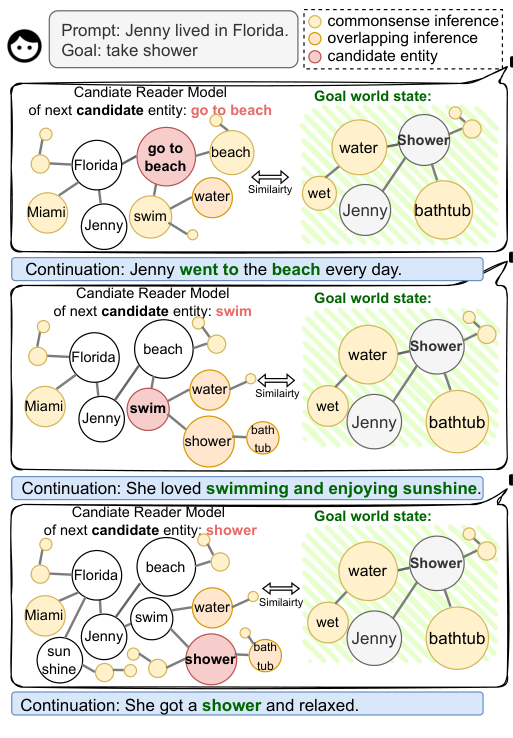
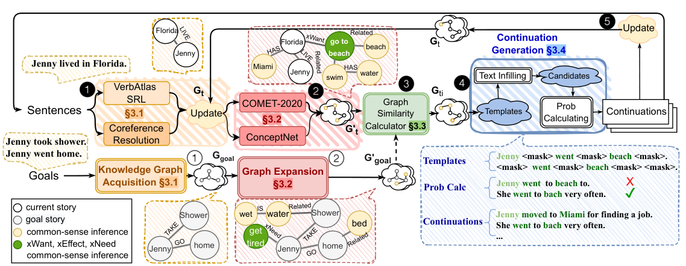
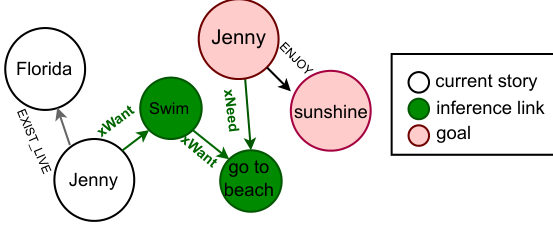

# Guiding Neural Story Generation with Reader Models

> **阅读范围与来源**：本笔记依据本地 PDF 正文第 1–9 页，覆盖 §1–§5 Conclusions，并补充 §6 Broader Impact；关键抽取检查来自 Appendix C，并补充 Appendix G 的超参数实验。页码均指 PDF 页序。正文三幅图均从原论文裁切，表格数据按原表转录。这里的 reader model 是对“读者可能从故事推断出的世界知识”的近似，不是经过真人认知实验验证的读者模型。

## 论文要解决什么问题

StoRM（Story generation with Reader Models）试图同时解决神经故事生成的两件事：每一步续写应当与前文存在可理解的联系，而且整个故事应当朝指定结局推进。例如，开头是“Jenny 住在 Florida”，目标是“Jenny 洗了澡”。直接把开头交给语言模型，能得到流畅文本，却不能保证它最终写到洗澡；直接把“洗澡”硬插入末尾，则可能缺少中间事件的铺垫。作者希望利用读者理解故事时会补出的常识，把开头和结局之间的空白变成可搜索的中间概念。（§1，PDF pp.1–3）

方法的核心是持续维护一个知识图。图中既有文本明说的实体和关系，也有 ConceptNet、COMET 补出的可能概念。系统先选择哪些实体或事件值得写入下一句，再让语言模型实现这句话。选择依据是候选图与目标图的重叠程度。因此，“图”承担跨句状态和目标引导，“语言模型”承担表面文本生成；它不是先自由续写整篇，再在末尾做一次评分。

**原图 1，PDF p.1；中文图注与读图**：从 Florida 推出 beach，从 beach 和 swim 联想到 water，再逐步接近 shower。红色等扩展部分表示常识推断，绿色表示候选概念，目标侧也做同类扩展。图中“相似”表示概念重叠带来的启发式相关性；Florida 并不逻辑蕴含 Jenny 必须去海滩，更不蕴含她一定洗澡。区分“已发生事实”与“可用于续写的推断”，是正确理解这套系统的前提。

## 1 Introduction：为什么引入读者视角

早期符号规划系统把故事当作状态空间中的行动序列，能检查行动前提并使最终状态满足目标，但需要手工编写世界规则，也未必能自然地产生完整语言文本。神经模型降低了知识工程负担，提高了流畅性和开放性；其训练目标却主要是预测下一个词，没有天然机制保证任意长度之后达到指定世界状态。（§1，pp.1–3）

作者引用叙事理解研究中的想法：读者会追踪实体、事件及其联系，故事的可理解性与这些联系的连通程度有关。因此，生成器可以维护一个显式结构，近似读者已经知道或能够合理推断的内容，使下一步围绕这些内容展开。这里的“连贯”被操作化为读者能否在不同事件和实体之间找到联系；并没有把文学价值、人物复杂性或主题深度全部纳入该定义。

目标同样由自然语言变为知识图。它规定希望最终出现的实体与关系，而不预先指定每一个中间情节及严格顺序。这样做保留了一部分生成自由度，也意味着目标达成判据比符号规划的形式化后置条件更宽松。论文的两项贡献就是这种 reader graph 引导框架，以及在三个故事数据集上对连贯性和目标控制的比较实验。

## 2 Related Work and Background：它与已有规划和常识方法的关系

一类相关方法先生成情节，再把情节实现成故事，例如 Goldfarb-Tarrant 等人的内容规划系统；另一类接受无序提纲或概念，让模型尽量覆盖这些输入。它们提供了全局输入约束，但不一定持续更新一个明确的读者知识状态。StoRM 的重点是每次续写前重新计算候选概念与当前、目标世界之间的关系。（§2，PDF p.3）

常识方面，COMET 从 ATOMIC 等知识库学习生成事件的前提、意图和后果。例如 xNeed 表示某事件此前通常需要什么，xWant 表示行动者随后可能想做什么。C2PO 使用其中一部分关系，在起点和终点之间进行双向搜索；它的文本实现受到模板限制。StoRM 扩大了可用常识关系，并把实体层面的 ConceptNet 与事件层面的 COMET 结合起来。

因此，论文并非首次使用常识，也并非首次进行目标导向的故事规划。其组合创新是：用随故事更新的显式知识图保持联系，用目标图计算候选价值，再用可训练的填空式语言生成补足表达。原文的具体图抽取管线是 **VerbAtlas 语义角色标注加指代消解**；不能笼统写成一个没有出处的 OpenIE 系统。

## 3 Story Generation with Reader Models：完整生成闭环

**原图 2，PDF p.4；中文图注**：输入开头与目标，经语义角色标注和指代消解变为知识图；ConceptNet/COMET 扩展候选；图相似性模块保留高分候选；文本填空生成多个表述，再以语言模型概率选择续写；续写中的新信息回写图。应沿着最上方的 Update 回路理解它：下一轮不是重复使用最初开头的静态图，而是使用已经发生的故事。

### 3.1 Knowledge Graph Acquisition：把故事转换为持久状态

图以三元组表示知识，例如 `〈Jenny, LIVE, Florida〉`；实体是节点，VerbAtlas 提供的语义框架作为边。作者在 VerbAtlas 上训练语义角色标注模型，以识别谁做了什么、作用于什么对象，再把结果转成三元组。指代消解把 Jenny、she 等同一实体的不同表述合并，避免图中同一个人被重复建点。（§3.1，PDF p.4）

系统有初始故事图 $G_1$ 和目标图 $G_{\mathrm{goal}}$。在第 $t$ 句后得到当前图 $G_t$，加入候选续写后更新到 $G_{t+1}$。由于并行维护多个故事候选，准确地说每一步保留的是一组图 $\{G_{t1},\ldots,G_{tK}\}$，$K$ 为 beam 宽度。图在此充当显式持久记忆，但其内容依赖抽取正确性，不能当作无误的世界真相。

附录 C 对 255 个三元组进行人工检查，报告 precision 81.96%、recall 72.89%。这支持“抽取能保留较多有用信息”，同时表明错误和遗漏不小。如果前文中的否定、关系或指代被错读，后续搜索也会受到影响。正文没有通过完美标注图的对照实验完整量化这类误差传播。

### 3.2 Graph Expansion：让图提供“下一步可以写什么”

物理实体和社会事件分别扩展。对于 Florida、beach 等实体，ConceptNet 提供相关概念；对于“Jenny 住在 Florida”这样的事件，COMET-ATOMIC2020 生成社会常识关系，如意图、需求和后果。扩展不是为了宣布这些事情已经发生，而是为生成器提供可选择的潜在续写方向。（§3.2，PDF pp.4–5）

对某个当前故事图 $G_{ti}$，系统得到实体候选集合和事件候选集合。每个候选 $e_{ti}^{k}$ 再扩展至深度 $m_1$，得到推断集合 $\widetilde E_{ti}^{k}$，从而构成候选扩展图。目标侧也使用 ConceptNet 和 COMET，以深度 $m_2$ 扩展为 $G'_{\mathrm{goal}}$。目标侧的扩展十分关键：当前事件可能还没有出现“洗澡”这个词，却已经出现 water 等与目标有关的概念。

这相当于把“直接写到结局”放宽成“先进入与结局有常识联系的区域”。代价是搜索分支增长，而且通用常识容易把故事拉回常见套路。论文并未建立事实、推测、角色信念之间的严格类型区分，也没有建模角色是否亲眼观察到某件事；reader graph 的语义范围不应被扩展解释为角色心智图。

### 3.3 Graph Similarity：目标引导的评分与搜索

原文式 (1) 把两类重叠结合起来。为避免 PDF 上标拥挤，下面保留含义并统一排版：

$$
R(G_{ti}^{k})=\alpha\,r_1(G_{ti}^{k},G_{\mathrm{goal}})
 +(1-\alpha)\,r_2(\widetilde E_{ti}^{k},G'_{\mathrm{goal}}).
$$

其中 $r_1$ 衡量候选故事图与**未扩展目标图**之间的实体重叠，$r_2$ 衡量候选的常识推断集合与**扩展目标图**之间的重叠；$\alpha$ 控制直接命中目标与间接常识关联的权重。原文式 (2)、(3) 按目标图规模归一化，核心形式是：

$$
r_1=\frac{\sum_{j,l}\mathbf{1}[e_{j,G_{ti}^{k}}=e_{l,G_{\mathrm{goal}}}]}{|G_{\mathrm{goal}}|},\qquad
r_2=\frac{\sum_{j,l}\mathbf{1}[\hat e_{j,\widetilde E_{ti}^{k}}=e_{l,G'_{\mathrm{goal}}}]}{|G'_{\mathrm{goal}}|}.
$$

$\mathbf{1}[\cdot]$ 是指示函数；分子统计节点匹配。这里虽然称为 graph similarity，主要评分依据实际是实体重叠，而不是一般意义上比较边、路径、因果方向的图同构或图编辑距离。目标关系在图构建和推断中起作用，不应据此声称评分验证了完整的逻辑一致性。（§3.3，PDF p.5）

**原图 3，PDF p.6；中文图注与解释**：从当前侧推导“住在 Florida → 想游泳 → 去海滩”，从目标“享受阳光”的 xNeed 关系得到“去海滩”。两侧在语义上接近的事件构成衔接点。这是启发式常识桥梁，并不是经过环境执行验证的因果链。

除实体重叠外，系统用 Sentence-BERT 比较两侧推断事件。最大语义相似度超过阈值时，认定找到了推断连接，令该候选奖励为 1；本文阈值取 0.8。系统保留得分最高的 $K$ 个候选图，形成 beam search。通过保留多个候选降低过早固定单一路径的风险，但没有完备性或必达目标的形式保证。

### 3.4 Continuation Candidate Generation：从候选概念到句子

选定候选实体或事件后，系统构造含该概念的模板，例如围绕 swim 构造 `[subject] <mask> <mask> swim <mask>`。主语可以沿用上一句主语、留空由模型补全，或从既有角色中选择。这样，图决定了下一句应该涉及什么，模板仍允许多个表达。（§3.4，PDF pp.6–7）

在故事数据上微调的 RoBERTa 填充模板空位，得到多个候选句；另一个在对应数据集上微调的 GPT-2 计算句子条件概率：

$$
P(s)=\prod_{j=1}^{n}P(X_j\mid X_1,\ldots,X_{j-1}).
$$

$X_j$ 为句子第 $j$ 个词元，$n$ 为句长。每个候选概念保留概率最高的句子，将它加入对应故事，再从实际生成句中抽取新信息更新图。这里有两个不同排序层面：图评分选择值得推进的内容，语言概率选择相对自然的表达。仅依靠后者无法替代前者的目标引导。

## 4 Experiments：数据、对照和评价究竟测什么

实验包含 ROCStories、Writing Prompts 和 Fairy Tales。ROCStories 有 98,159 个五句故事，首句作开头、末句作目标；Writing Prompts 平均 59.35 句；作者收集的 695 篇童话平均 24.80 句。后两类抽取高层情节点，并以相邻情节点作为分段生成的起止约束。不能把这些数据集总规模误写成人评测试规模：每个数据集用于比较的故事随机抽取 **15 篇**。（§4，PDF pp.6–7）

对照包含 C2PO 和 Goldfarb-Tarrant 等人的内容规划模型（表中 CP）。C2PO 在 ROCStories、童话上比较；CP 在 Writing Prompts 上比较。为尽量一致，作者让不同方法接收相同开头、目标，并都按情节点分段生成。此处并未评估现代指令大模型，也没有宣称较高质量的大模型加一个简单提示词就一定不如 StoRM。

### 4.1 Story Coherence Evaluation：连贯性、人类偏好与多样性

人评为成对比较，问哪篇故事的前后句更有逻辑、读起来更有趣、语言更流畅。下表按原表 2.A 转录，均为 StoRM 胜 / 负 / 平的百分比；`**` 表示原文在胜负对上做 Wilcoxon 检验达到 $p<0.01$。（PDF pp.7–8）

| 比较与数据集 | 逻辑合理性 | 趣味性 | 流畅性 |
|---|---:|---:|---:|
| StoRM vs CP，WP | 72.0 / 18.7 / 9.3 ** | 52.0 / 40.0 / 8.0 | 74.7 / 18.7 / 6.7 ** |
| StoRM vs C2PO，ROC | 72.9 / 17.1 / 10.0 ** | 71.4 / 21.4 / 7.1 ** | 62.9 / 24.3 / 12.9 ** |
| StoRM vs C2PO，FT | 58.7 / 22.7 / 18.7 ** | 60.0 / 22.7 / 17.3 ** | 53.3 / 21.3 / 25.3 ** |

最清楚的证据是三个比较中的逻辑合理性偏好均支持 StoRM。CP 同样使用较强的语言生成器，因此趣味性接近，StoRM 在这一项没有显著优势。C2PO 的模板化表达较受限，StoRM 的流畅性和趣味性收益部分可能来自文本实现方式；不能把全部提升归因于 reader graph 单一模块。

作者还计算故事内部各句之间的 Self-BLEU，值越低意味着重复越少。WP 的 Self-BLEU-2 为 StoRM 0.137、CP 0.103，Self-BLEU-3 为 0.098、0.070，StoRM 并没有数值优势。ROC 上相应为 0.045 对 0.261、0.035 对 0.169；FT 为 0.095 对 0.249、0.072 对 0.155，StoRM 显著优于 C2PO。结论应是“对模板化基线明显降低重复，对同类神经生成器大致可比”，不能写成所有多样性指标均领先。

### 4.2 Controllability Evaluation：达到目标是否还像一个故事

这一节复用上一节生成样本，让评价者判断故事是否沿同一主题达到目标，以及达到目标的整体质量。表 2.B 中 `*` 表示 $p<0.05$，`**` 表示 $p<0.01$。（PDF p.8）

| 比较与数据集 | 目标导向：胜 / 负 / 平 % | 达成目标的质量：胜 / 负 / 平 % |
|---|---:|---:|
| StoRM vs CP，WP | 57.1 / 31.4 / 11.4 * | 54.3 / 38.6 / 7.1 |
| StoRM vs C2PO，ROC | 73.3 / 16.0 / 10.7 ** | 74.7 / 20.0 / 5.3 ** |
| StoRM vs C2PO，FT | 56.0 / 33.3 / 10.7 * | 61.3 / 26.7 / 12.0 ** |

人评支持更强目标导向，但 WP 上整体质量优势没有显著性。作者还使用 BLEU、ROUGE-L、Sentence Mover's Similarity 与原故事比较，这些是参考文本覆盖或语义相似度的间接指标；它们不是“目标是否真正实现”的严格自动验证器。

| 数据集 / 对照 | BLEU-2：StoRM / 对照 | BLEU-3 | ROUGE-L | S-M |
|---|---:|---:|---:|---:|
| WP / CP | 0.204 / 0.099 | 0.169 / 0.070 | 0.315 / 0.244 | 0.065 / 0.046 |
| ROC / C2PO | 0.334 / 0.361 | 0.290 / 0.329 | 0.428 / 0.426 | 0.121 / 0.119 |
| FT / C2PO | 0.110 / 0.089 | 0.079 / 0.065 | 0.198 / 0.182 | 0.044 / 0.058 |

WP 的前面三项在原表标为显著改善，其他比较没有同样普遍的优势。合理解释是：相同开头、结局可以有多种中间故事，达到目标不要求复现参考故事。因此，人评与参考文本相似度测的并非同一件事。表 1 的例子也提醒我们，模型仍会写出“死后自己埋葬自己”等不合理内容；平均偏好改善不等于每篇故事都通过常识验证。

## 5 Conclusions：能成立的贡献及不能扩大的结论

论文结论是，显式近似读者的实体和事件知识，有助于选择与前文有关、又朝目标推进的续写，在三个数据集和两个当时较强基线上改善了人类对连贯性与目标导向的评价。（§5，PDF pp.8–9）完整论证链是：建立持久图 → 用常识生成衔接概念 → 按目标相关性搜索 → 将概念实现为文本 → 人评检查叙事结果。单纯“增加一个知识图”并不能概括这条链。

实验仍不足以回答 reader graph 是否优于同预算的其他规划表示、推断深度和 $\alpha$ 如何影响长篇故事、图抽取错误如何累积，以及现代长上下文模型是否还需要同样的外部结构。正文没有逐个移除图抽取、常识扩展或语言实现模块的完整消融；附录 G 提供的是下面的权重超参数比较。15 篇 / 数据集的人评规模，也限制了对体裁和长篇稳定性的外推。

### 补充：Appendix G 的超参数实验

作者另从 ROCStories 随机选 30 个故事，以末句建立目标图，持续生成直到评分达到 0.8 或目标实体完全命中（$r_1=1$），最多生成 10 句；用达到停止条件所需的平均句数衡量目标推进的直接程度。Table 11（PDF p.24）报告：

| $\alpha$ | 平均句数 ↓ |
|---|---:|
| 0.50 | $6.92\pm1.21$ |
| 0.90 | $9.27\pm1.50$ |
| 0.25 | $8.32\pm0.94$ |

这支持本文设置下 $\alpha=0.5$ 更快达到启发式目标条件，不代表生成故事的文学质量或完整逻辑一定最好。还需注意原文内部不一致：正文式 (1) 将 $\alpha$ 乘在直接目标重叠 $r_1$ 上，而附录末句把较大 $\alpha$ 描述成更偏重推断节点；二者相反。本笔记按公式解释权重，并保留这个文字冲突，避免悄悄替作者改义。

## 6 Broader Impact 与阅读边界

作者指出训练数据中的偏见可能进入生成结果，虚构叙事若被呈现为事实也可能用于误导。ConceptNet 和 COMET 的知识范围又会使系统更适合简单、常见的故事。作者提到可以把现实事实注入类似的图中，但本文没有验证新闻写作或事实可信度任务。（§6，PDF p.9）

## 对当前叙事研究的启发（阅读者推论）

StoRM 提供了一个可以复用的设计分解：持久状态负责保留已写内容，常识扩展负责提出可写候选，目标评分负责方向，语言模型负责表达。如果要在当前项目中比较 graph-guided generation，应匹配基础模型、输入信息、候选数及调用预算，并把实际抽取图和人工正确状态图区分开。

但它不能直接作为角色心智、叙事授权或分支世界模型的证据。图中谁有权知道某件事、消息来源是否可靠、何时向读者揭露、互斥分支如何隔离，都不是本文建模对象。迁移时应保留 extracted 与 inferred 的区别，并另行评估推断事实是否被错误写成既定事实。这些是从论文暴露出的表示边界得到的研究问题，不是原文已经实现的功能。
