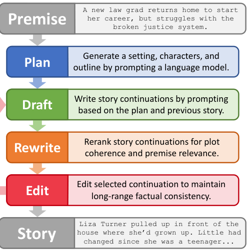
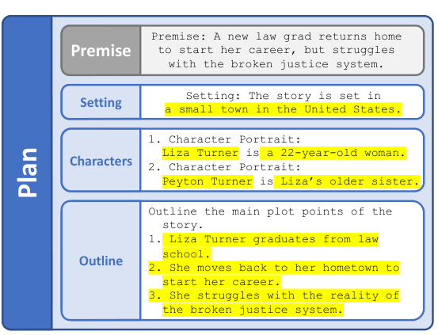
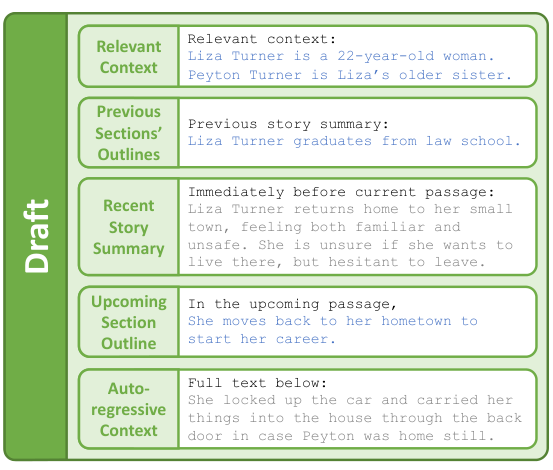
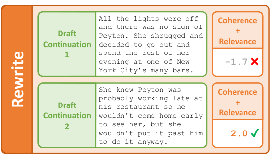
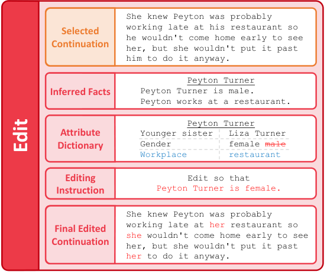

# Re³: Generating Longer Stories With Recursive Reprompting and Revision

> **来源与范围**：依据本地 PDF 正文 pp.1–9，完整覆盖 §1 Introduction 至 §6 Discussion，并保留 Limitations 的关键约束。原文没有独立的 Conclusion 标题，§6 是正文收束。附录长篇样例不逐篇复述。五幅正文图均内嵌，主要实验与消融按 Tables 1、4、5 核对。

## 一句话理解与核心判断

Re³ 将长故事写作拆成 **Plan → Draft → Rewrite → Edit**：先生成设定、人物和提纲；每一段重新组织“远处的大纲、近期摘要、紧邻原文、当前写作目标”；用判别模型选择候选段落；再以人物属性字典检查局部事实矛盾。贡献主要是让有限上下文中的生成持续受到完整故事计划约束。（Abstract；§1）

在人评中，它相对相同 GPT-3 生成器的滚动窗口基线，将被认为情节连贯的比例从 45.7% 提升至 60.0%，忠实于初始设定的比例从 44.0% 提升至 64.0%。但 **Edit 模块没有改善主要指标**。这两点需要一起记住：规划、动态提示和候选重排有正面证据，结构化事实编辑在此实现中仍是薄弱环节。

**原图 1，PDF p.1；中文图注**：Premise 指用户提供的故事前提；Plan 补齐设定和剧情轮廓；Draft 按计划写候选；Rewrite 按连贯性和相关性重排；Edit 修正细节。图中的“Rewrite”不是让模型再次完整改写全文，而是从多份候选中选择较好版本；这一实现区别直接影响成本和消融解释。

## 1 Introduction：为什么长故事需要反复重建上下文

论文的正式实验生成 2,000–2,500 个英文单词，约 3,000 tokens。它相对当时常见的五句或一两段故事明显更长，但在人类文学体裁中仍属于短篇。作者强调的难点是跨数千词保持总体情节、初始前提、叙述风格和事实连续性，而不仅是下一段语法正确。（PDF pp.1–2）

滚动窗口只能看见最近文本。前文人物和目标逐渐被截断后，即使每一段局部自然，整篇也会缓慢偏题。人类写作者则通常会保存提纲、写草稿、推倒重写部分段落、修正细节。Re³ 将这套过程做成自动化管线，不依赖人类在每轮纠错。

“Recursive reprompting”指模型生成的计划、摘要和事实又成为后续提示词的一部分，系统反复调用提示过程并动态重组其内容；它不是单纯把同一个 prompt 连续发送，也不是模型权重的递归更新。Plan 和 Draft 本身不需要在故事数据上训练；不过整个系统并非完全零训练，Rewrite 的两个判别器使用了 WritingPrompts 数据。

## 2 Related Work：从短篇规划到长篇过程控制

已有故事生成研究用提纲、关键词、潜变量、结构化槽位或控制码保持方向；另一些使用重排或迭代编辑。Re³ 的贡献不是发明其中每一个组件，而是在相同流程中组合这些能力，并使它们服务于数千词的生成。（PDF pp.2–3）

它也与人机共写系统不同：本文主要实验里没有作者在中途决定下一情节。尽管自然语言计划便于人工介入，这只是框架可扩展性，不能将系统的人评质量视为有专业编辑持续指导的结果。与短回答的 prompting 研究相比，它把 prompt 构造提升为整篇写作过程中重复执行的子程序。

作者认为把此前面向短故事的方法直接运行到数千词并非公平的即插即用对比。因此主实验采用同一 GPT-3 基础生成器的滚动窗口对照。这个选择有助于控制生成模型能力，但也把结论限定为本文基线设置；没有证明它优于所有可能的长上下文、检索或规划系统。

## 3 Recursive Reprompting and Revision：四个模块的具体实现

### 3.1 Plan Module：把简短前提变成可反复使用的计划

输入 premise 后，GPT3-Instruct-175B 先补写一句场景设定，再产生最多三个人物名字及其描述，最后产生编号式剧情提纲。人物名和提纲用简单规则检查格式，不合格就重新采样。正式实验要求提纲恰好三点，是为了控制最终长度，不是理论上只能有三个情节。（PDF p.3）

**原图 2，PDF p.3；中文图注与读图**：示例从“法学院毕业生回乡，面对破碎司法体系”扩展到小镇场景、Liza 及其姐姐 Peyton，再列出毕业、返乡执业、面对现实三个节点。生成计划提供了后续片段的全局锚点；但它也可能几乎只是重述前提，或者遗漏前提中的约束，不能默认计划天然完整。

计划是自然语言而非执行语义严格的程序。因此，人物描述可以被检索，提纲可以被放入提示词，成本较低；相应地，系统没有验证每个提纲节点是否真被完成，也没有形式化检查人物关系与事件前置条件。这些缺口在错误样例中会显现。

### 3.2 Draft Module：远处用概括，近处保留细节

每一条提纲下生成多个段落。每次生成前，系统重建五部分提示词：相关背景、此前已写章节的提纲、近期故事摘要、下一段应推进的当前提纲、紧邻上一段原文。它们既提供远距离方向，又保留局部语言衔接。（PDF pp.3–4）

**原图 3，PDF p.3；中文图注**：蓝色信息来自高层计划，灰色信息来自已生成故事。最远的内容以提纲压缩，稍近的内容由 GPT3-Instruct-13B 摘要，最近段落直接保留为自回归上下文。观察顺序可以理解为什么它比仅保留最近若干词更有机会维持原定目标。

“Relevant Context”最初包含 premise、设定和全部人物。故事继续后，Flair NER 找到新实体，GPT3-Instruct-175B 写出新人物描述；再用预训练 DPR 根据最近段落挑选相关信息。由此，角色列表可增长，提示词却不需要无限增长。该检索根据相关性选内容，未单独处理来源可信度或人物知识权限。

真正生成故事段落的是普通 GPT3-175B，作者没有在该步使用指令版，因为预实验发现当时的指令版容易重复提示词。摘要使用 13B 版本以降低开销。这些是论文当时实现选择，不能推导出现代某个指令模型也会表现相同。核心可迁移之处是上下文信息的层次和动态刷新，而非特定 API 名称。

### 3.3 Rewrite Module：用训练出来的判别器选择续写

Draft 的首个输出往往不够好，因此系统采样多个完整候选并重排。一个 coherence 模型判断候选与前文是否连贯，另一个 relevance 模型判断它是否对应当前提纲。两者均基于 Longformer-Base 微调；这是整个框架中明确使用先前故事训练数据的部分。（PDF p.4）

Coherence 训练把 WritingPrompts 故事切成至多 1,000 tokens 的片段，以末尾至多 200 tokens 为真实续写。负例来自同一故事的其他位置，或其他故事中的续写。这样既有容易的跨故事负例，也有同人物、同主题却放错位置的难例。训练目标是识别真实接续关系，而不直接优化文学评分。

Relevance 训练集包含 2,000 个 200-token 故事片段及其 GPT3-Instruct-13B 摘要；替换成其他片段摘要得到负例。训练时的“摘要—片段相关性”在生成时用作“提纲—候选相关性”的近似，这里存在任务迁移，而非对提纲覆盖率的完美判定。

**原图 4，PDF p.4；中文图注与读图**：一个候选突然跳去纽约酒吧，另一个继续围绕 Peyton 展开。重排偏好后者，但后者把先前设定为女性的人物写成男性。这一例子刻意说明：情节方向正确和人物事实正确是两个层面，所以还需要下一模块检查细节。

此外，作者用规则过滤复制提示词的重复文本，并过滤第一人称续写以维持第三人称叙述。此类规则提高了本文任务的稳定性，也约束了叙事形式；实验不能说明框架已支持任意视角变化或复杂多叙述者结构。

### 3.4 Edit Module：属性字典如何检测和修正矛盾

如果把所有历史句子两两做矛盾判断，比较数随文本长度近似二次增长，单次很低的误报率也会累积出大量误报。作者因此缩小问题，只重点检查人物属性，例如年龄、职业、与其他角色的关系；每个人物维护一个紧凑的属性—值字典。（PDF pp.4–5）

**原图 5，PDF p.5；中文图注**：新片段推断 Peyton 为 male，而字典记录为 female，因此要求编辑器纠正相关代词；新出现的 workplace=restaurant 则加入字典。蓝色为新信息，红色为冲突。这里的“旧值优先”适合静态属性，但若某属性随剧情真实变化，也可能产生误报。

实现先由 GPT3-Instruct-175B 列出有关该人物的自然语言事实，再由 13B 指令模型抽取属性键和值。对于容易幻觉的步骤，生成三次，保留重复出现、或由 MNLI 训练的 BART-Large 蕴含模型支持的结果。新旧值在同一键下比较，检测到矛盾后，把原事实变成局部修改指令，交给当时的 GPT-3 Edit API。

这个模块至少有三个误差源：属性抽取遗漏或错读、蕴含模型误判、编辑器修改过多或修改不充分。它不会自然检查场景位置、跨事件因果、遗漏情节点等所有连续性问题。论文清楚报告了此范围限制；把它概括为“保证长程一致性”会超过证据。

## 4 Evaluation：2,000–2,500 词故事的正式比较

作者通过高温度采样得到 100 个多样化英文 premise。每个三点提纲下生成四段，每段 256 tokens，之后用 Insert API 接到 “The End.” 作为结尾。主要生成长度约 3,072 tokens，最终为 2,000–2,500 词。附录确有约 7,500 词示例，但没有同规模正式评测，不能拿它代替主要实验的结论。（PDF pp.5–7）

ROLLING 每次生成 256 tokens，用 premise 加已有故事作上下文，超过 768 tokens 时左截断；加输出后总上下文上限为 1,024，与 RE³ 使用的最大窗口一致。ROLLING-FT 使用同样流程，但先以 WritingPrompts 中较长故事的数百个片段微调 GPT-3。这控制了窗口和主要基础模型，却没有把 RE³ 的额外规划、摘要和重排调用全部换算成相同计算预算。

每一对故事由三位 AMT 评价者判断。趣味性、连贯性、前提相关性可以选 A、B、两者都好或都不好；“像人写的”及具体写作问题逐篇标注。表格因此报告的是被判为满足某特征的比例，**不是成对胜率**。不同基线比较使用不同评价者群，RE³ 在两组中的绝对值不能混在一起平均后再与某个基线相减。

| 比较组 / 方法 | 有趣 % | 情节连贯 % | 忠于前提 % | 被认为人写 % | 写作问题均数 ↓ |
|---|---:|---:|---:|---:|---:|
| ROLLING | 45.0 | 45.7 | 44.0 | 74.0 | 1.20 |
| RE³（同组） | 54.3 | 60.0 | 64.0 | 83.3 | 1.07 |
| ROLLING-FT | 52.7 | 48.7 | 49.3 | 74.7 | 1.48 |
| RE³（同组） | 53.7 | 60.0 | 65.3 | 80.0 | 1.35 |

**来源：Table 1，PDF p.6。** 原文使用配对 t 检验，报告连贯性、相关性及写作问题方面的显著改善。相对 ROLLING，连贯性提升 14.3 个百分点、相关性提升 20.0 个百分点；相对 ROLLING-FT，分别提升 11.3 和 16.0 个百分点。不能把百分点写成相对百分比，也不能把 83.3% 解读为“达到人类文学质量”的客观标准。

写作问题包含叙述/风格突然变化、事实不一致或奇怪细节、难以理解、重复、语法不流畅五种二元标签，其和构成 Misc. Problems。一篇故事可以同时有多种问题。该指标改善不等于每类错误都同样下降；单类细分在附录中，正文不支持对每类逐一作强结论。

表 2 的富有继承人故事较好保持了原定主线；表 3 的时间穿越故事则一开始漏写前提部分，并把 Jaxon 的恋爱对象写错，后面又回到提纲。作者把这称为一定程度的“自我纠回”：持续注入计划能够让后续重新回到主线，但它不会自动删除已写进前文的矛盾。因此，“重新跟随计划”和“全文一致”应分开评估。

## 5 Analysis：究竟是谁带来收益

### 5.1 Ablation Study：Plan 和 Rewrite 重要，Edit 未见主指标收益

去掉 Plan 时也移除 Draft 中的递归提示，变成滚动生成后再重排、编辑；去掉 Rewrite 就不做候选重排；去掉 Edit 则保留前面三个模块。每个消融与完整版独立成对比较，所以不能横向把不同组的 RE³ 数值当作同一测量。（PDF p.8）

| 消融组 | 情节连贯 %：消融 / 完整 | 忠于前提 %：消融 / 完整 | 有趣 %：消融 / 完整 | 问题均数：消融 / 完整 |
|---|---:|---:|---:|---:|
| 去 Plan（连同递归提示） | 46.7 / 63.3 | 50.7 / 63.7 | 50.3 / 59.7 | 1.33 / 1.25 |
| 去 Rewrite | 42.3 / 56.0 | 42.7 / 63.3 | 46.3 / 56.7 | 1.48 / 1.17 |
| 去 Edit | 60.3 / 57.3 | 59.3 / 59.3 | 55.0 / 57.0 | 1.10 / 1.12 |

**来源：Table 4，PDF p.8。** 前两组支持规划/提示组合和候选重排的重要性。第一组并不能完全分离“有提纲”与“怎样把提纲注入提示”的各自效果，因为它们同时被删除。第三组显示 Edit 未带来整体收益，某些数值甚至更差；没有显著收益不等于证明所有结构化编辑方法都无效，只能说明本文具体实现尚未解决问题。

### 5.2 Further Analysis of Edit Module：单独测检测能力仍然有限

作者构造受控数据：先生成设定 $s$，再人工确认一个人物描述被改成矛盾设定 $s'$；分别生成会提及该属性的故事 $t$、$t'$。同源配对 $(s,t)$、$(s',t')$ 一致，交叉配对 $(s,t')$、$(s',t)$ 矛盾。50 组四元组构成 200 个二分类输入，规避了长故事里矛盾是否真的存在的标注不确定性。（PDF pp.8–9）

| 检测器 | 做法 | ROC-AUC ↑ |
|---|---|---:|
| ENTAILMENT | 所有设定句与故事句配对，取最大矛盾概率 | 0.528 |
| ENTAILMENT-DPR | 为故事句先检索最相关设定句再判断 | 0.610 |
| STRUCTURED-DETECT | 人物属性抽取、同键比对 | 0.684 |

**来源：Table 5，PDF p.8。** 结构化方法优于两个使用相同 BART 蕴含模型的对照，说明减少无关比较确有作用；但 0.684 的绝对表现仍不高。该受控实验只验证“检测”，没有隔离评估 Edit API 的最终修复正确率，也不是全文主指标提升的替代证据。

错误包括非人物事实、随时间合理改变的属性、遗漏剧情节点，以及编辑器引入多余变化。作者定性观察编辑器通常能改孤立细节，却难以处理更大范围的调整。检测与编辑误差串联，解释了为什么一个看起来合理的字典机制未在长故事人评中取得预期收益。

## 6 Discussion：正文结论与下一步方向

论文认为，长文本可以通过反复注入相关上下文、保持高层计划和选择候选来改善。自然语言形式的计划与修订指令也容易转为交互式写作接口，但本文主要证据仍来自完全自动故事生成。（PDF p.9）

更长作品需要更细致的多层提纲，附录 7,500 词样例展示了可能性。作者同时强调评测是瓶颈：读完长故事的人类评价昂贵、噪声较大，使开发阶段无法充分调参或做大量消融。API 生成费用在本文场景下反而低于人工评价成本。

事实连续性只是长篇质量的一部分。场景、节奏、主题和伏笔同样需要跨长距离保持和发展；Re³ 没有完整表示这些维度。作者提出更好的自动指标应能发现“前面相关、后来慢慢偏题”，或者“词汇相关但语义不通”的情况。这比检查关键词是否覆盖更严格。

## Limitations：复现和外推时要保留的条件

提示词、每段长度、矛盾阈值和重排启发式有不少人工选择，没有经过全面验证集搜索。正式评测只覆盖约 2,000–2,500 词英文故事，未正式评测附录更长示例。人物属性字典和第三人称规则是故事任务专门设计，迁移到其他文体需要重新设计。Edit 的不足也被作者明确列为限制。（PDF p.10）

本文使用的 API、模型版本和 1,024-token 窗口是历史实验设置。现代长上下文模型能否降低压缩与检索必要性，需要重新实验；仍可能保留价值的是将计划、长期事实和局部上下文分开管理，而不是原封不动照搬当年的模型组合。

## 对当前项目的启发（阅读者推论）

最可借鉴的是把“情节方向正确”“局部续接合理”“事实连续”拆成不同目标，分别保留中间产物和评价结果。Re³ 的消融展示了一个关键经验：给系统加上看似合理的记忆或编辑模块，并不自动产生可测的质量收益，必须验证错误检测、纠正和最终作品三个层次。

若用作长篇叙事基线，应至少记录提纲完成情况、每轮取回的信息、候选及其分数、字典变化、编辑前后文本和总模型调用开销。可以把静态属性与可变化状态分开，避免把人物成长或职位变化判作矛盾；也应把作者知道的全局事实和角色知道的局部事实区分开。后两项是本文尚未解决、由其限制启发的设计方向。
