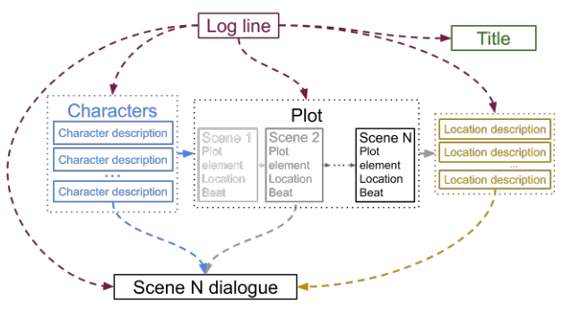
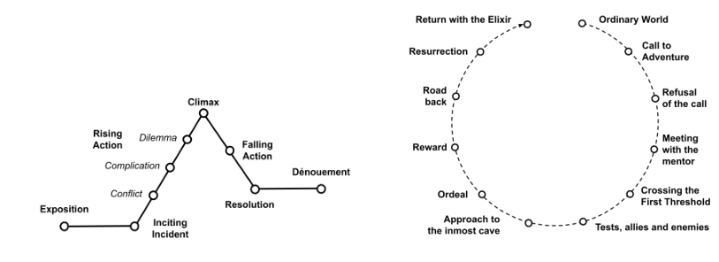
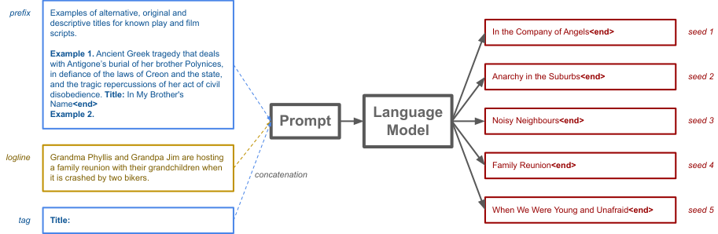
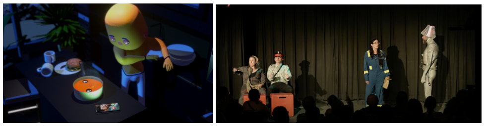
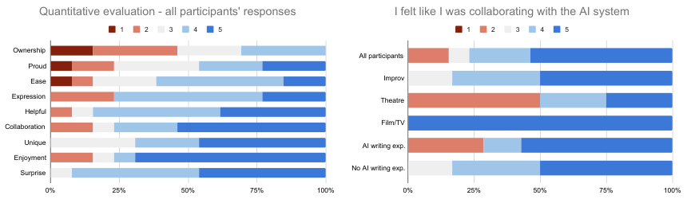
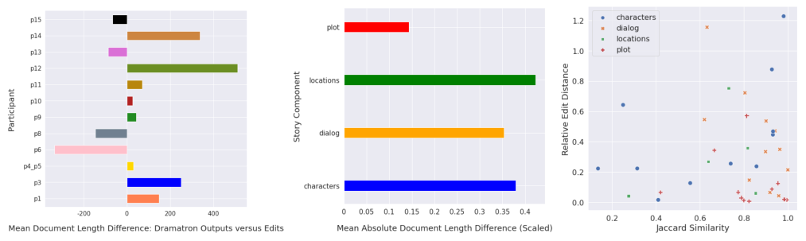

# Co-Writing Screenplays and Theatre Scripts with Language Models

## An Evaluation by Industry Professionals（Dramatron）

> **阅读依据**：本地 PDF 为 arXiv:2209.14958v1（2022-09-29），档案按 2023 年论文条目保存。本笔记覆盖该版本正文 PDF pp.1–18、§1–§8 Conclusions；六幅正文原图全部内嵌。后面的原始剧本、编辑剧本及详细提示词是附录材料，未逐篇翻译。它是一项系统设计与专业创作者用户研究，不能按自动生成基准排行榜来解读。

## 论文的核心贡献与证据类型

Dramatron 把一句概括核心戏剧冲突的 log line，分层扩展成标题、人物、场景提纲、地点描述和逐场对白。每一层都可以重新生成、续写或由作者手动修改。这样，长剧本的全局结构以简短中间表示保留在上下文里，而不是一直向越来越长的对白末尾追加文本。（Abstract；§1）

论文真正的评价重点是 **专业作者怎样使用、修改、接受或拒绝这种协作方式**。15 位戏剧和影视从业者参加约两小时共写与访谈，13 位完成问卷，另有共写剧本经过人类编辑、演员演绎并公开演出。研究发现它适合激发想法、提供备选材料和组织情节，但人物动机、潜台词、跨场对白一致性及作品所有感仍有明显问题。作者并没有以随机对照实验给出“写作效率提升多少”或“无人干预文学质量达到何种水平”。

**原图 1，PDF p.2；中文图注与读图**：箭头表示已生成内容会被拼接到后续提示词。角色描述用于剧情提纲；提纲包含场景位置和 narrative beat；每个地点再补描述；最后每场结合全局设定与当前场景信息生成对白。这里的结构帮助整篇围绕同一主线展开，却不保证所有事实、情绪变化和因果关系都正确。

## 1 Introduction：从一段流畅文本到可以共写的剧本

剧本需要数页之前的信息在后面被重新利用，人物关系和戏剧冲突也必须逐步发展。论文讨论的当时模型通常只有约 2,048-token 窗口，无法把整部剧本一直作为原始文本保留。Dramatron 因此把完整剧情压缩成中间层，让生成任何一场对白时仍能看到其在全局中的位置。（PDF pp.1–2）

系统可以从一条 log line 自动走完全流程，产生很长的剧本；但研究设计鼓励作者在任何层介入，而不是把自动输出视为最终作品。交互式修改既可以完善本层内容，也会影响下层生成。例如先删掉一个不必要人物，再生成提纲，比写完所有对白后逐处删人更容易控制。

用户研究采取参与式设计：从业者的反馈会在研究过程中用于修改提示词和工具。优点是能暴露真实创作需求并快速改进；代价是不同参与者接触的系统版本并不完全相同。后面的问卷结果应作为这套设计过程的描述性证据，不能当作严格控制版本的性能实验。

## 2 Storytelling, the Shape of Stories, and Log Lines

作者把 plot 理解为构成故事的行动序列，每个情节点应与前面的发展有联系。研究借用 Freytag 金字塔的铺垫、引发事件、上升行动、高潮、下降行动与结局等结构，也展示 Hero’s Journey 的另一种组织方式。它们为生成提纲提供可执行的提示格式，而不是声称所有故事必须遵守同一曲线。（PDF p.3）

**原图 2，PDF p.3；中文图注**：左为 Freytag 金字塔，右为 Vogler 版本的英雄之旅。作者明确指出这类结构带有西方戏剧传统，不能当作跨文化普适定律。图的作用是解释系统为何先分配情节点位置，再生成场景细节。

Log line 是几句话以内的戏剧种子，通常包含场景、主角、对抗力量、冲突或目标，有时包括引发事件。它回答谁、做什么、何时何地、如何、为什么，因此足以启动层次展开。但研究中一些剧作家认为真正想表达的主题往往在写作过程中才浮现，无法一开始就压缩成准确 log line；这成为系统和创作实践之间的重要张力。

## 3 The Use of Large Language Models for Creative Text Generation

### 3.1 Language Models：基础模型与采样

研究使用 Chinchilla 70B，训练量为 1.4T tokens，训练语料来自 MassiveText。语言模型根据已有文本预测后续 token，随机采样可产生不同候选。系统原则上可以接入其他能按 prompt 续写的模型；本文观察和用户反馈针对实际使用版本，不是对所有语言模型的恒定判断。（PDF pp.3–4）

**原图 3，PDF p.4；中文图注**：以标题生成为例，前缀给出指令和示例，后接当前 log line 与 `Title:` 标签；更换随机种子产生不同标题。`<end>` 标记终止。这个图也展示了用户“再给一个候选”的具体含义：同样的条件下再次采样，不一定是针对上一候选的定向改写。

### 3.2 Hierarchical Language Generation：三个层次如何绕过窗口限制

最高层是 log line；中间层是人物描述、含地点和 beat 的场景序列、地点细节；最低层是对白。因为中间层很紧凑，完整情节可装入当时较小的上下文窗口，再按场景展开成远长于窗口的作品。（PDF pp.4–5）

生成顺序为人物 → 剧情 → 地点描述 → 各场对白，标题也由 log line 生成。剧情既依赖 log line，也依赖角色设定；对白依赖当前场景及有关背景。所谓层次 coherence，作者在正文中特意定义为“各部分构成统一整体”，并**不预设常识、逻辑或情绪一致性**。如果笔记直接写“分层保证因果一致”，就把作者明确排除的性质添了进去。

这一方法允许结尾在高层计划上呼应开头，但不同场次的对白并不自动共享全部历史对白细节。用户后来指出的跨场矛盾正是这一压缩选择的代价：计划一致和已写文本一致是两件事。

### 3.3 The Importance of Prompt Engineering：五类提示词

作者主要使用基于《美狄亚》和科幻电影的两套示例前缀，每套含标题、人物、剧情、地点和对白五类 prompt。它们通过 1–4 个例子指定输出格式和风格，再把上游生成结果串入下游，形成 prompt chaining。（PDF pp.5–6）

标题提示从 log line 产生相关但应尽量独创的名字；人物提示给出名字和简介；剧情提示将核心冲突分成多个场景。每个场景被明确表示成“地点名 + 在叙事弧中的位置 + beat”，这既是便于生成的结构，也是一项强表示约束。地点提示把简单名称扩展为布景/环境描述。对白提示读取 log line、角色、地点和当前 beat，并使用当前与前一场的场景信息。

要注意“前一场信息”主要是 beat 摘要，不等于直接读到此前所有对白。研究过程中确实新增了对前一场 beat 的依赖，这是回应专业作者对衔接问题的反馈；本文没有因此彻底解决前场已经说过什么、角色何时得知某信息的问题。

### 3.4 Interactive Writing with Dramatron：作者可以在哪些位置介入

每一层支持重新采样、从末尾续写、手动编辑。作者可以向前推进，也可以回到上层：先试标题、改人物、删一段剧情、继续提纲，甚至回头改 log line。最终仍可在系统外进一步编辑和格式化剧本。（PDF p.6）

这种控制把作者的劳动从只改最后文本，扩展为选择世界、人物和情节的生成条件。访谈中有人希望全自动生成后再挑选，也有人边生成边编辑，还有人从三四份候选中拼出自己想要的版本。论文没有把其中一种流程当作所有作者的唯一正确方法。

### 3.5 Implementation Details：实际可复现的控制

系统用 Python 实现，交互界面为 Google Colab 文本组件。每次最多采样 511 tokens，nucleus sampling 的概率质量阈值为 0.9，温度 1.0；`<end>` 标记整段序列结束，`<stop>` 标记一行结束。针对对白循环，按双空行切块，某块出现超过阈值（例为三次）后，换随机种子重新生成。（PDF p.6）

重复检测解决的是表面文本循环，不是场景停滞、反复表达同一情绪或未推进冲突等更深层问题。本文没有训练专门的叙事世界模型，也没有用知识图或规则执行器验证情节；主要工程机制是层次表示、提示串联、交互编辑和采样控制。

## 4 Evaluating Text Generated by Large Language Models：为什么请专业作者

长剧本没有唯一参考答案，BLEU 等与参考文本相似度指标很难代表戏剧价值；非专业众包评价者也未必仔细阅读完整作品，或了解对白是否适合表演。因此作者请 15 位影视、戏剧行业专家参与约两小时共写和开放访谈，报酬为每小时 100 英镑。（PDF pp.6–7）

研究关注协作过程和生成材料的用途：是否带来新想法、能否表达创作目标、需要怎样编辑。访谈后使用五点 Likert 问卷，并记录修改前后的字数、编辑距离、词汇 Jaccard 相似度。语法正确性不是主要评测对象，因为少量表面错误容易由共同作者修正。

这个设计的强项是贴近真实创作实践，弱项是样本小、选择性强、缺少对照、作者和系统持续相互适应。专业访谈能够说明“为何有用或为何不合适”，却不能单独估计所有编剧使用后的平均效率提升或商业成功概率。

## 5 Participant Interviews：七类主题与后续实践

### 5.1 Positive Comments：可见的结构和可控制的介入

除两位偏好非线性写法的参与者外，多数肯定层次展开：看见提纲后，更容易把握作品形状，决定在哪一层投入人的判断。有人认为一条种子经过展开就有了可加工的材料，也有人更喜欢先得到整稿再挑选有价值的部分。（PDF pp.8–9）

对“可上演”的判断普遍附带编辑条件：输出是粗稿，需要整理、拼接和修辞加工。这不是无人工处理的自动剧本成功案例。多个候选提供更多解释和选择自由，也增加整理材料、统一语气的工作量。

### 5.2 Potential Uses：灵感、世界构建、学习、材料及编剧室

所有参与者都看到激发灵感的用途：有时模型直接给出可用台词，有时只是一个意外输出触发作者自己的新想法。有人专门挑与自己原先想法距离更远的候选，以探索新的角色、关系或世界细节。（PDF p.9）

作者也把工具看作学习和分析媒介：尝试不同风格，思考怎样将某段文本变得可演，或设想让模型学习自己的写作材料。后者是参与者期待，并非本研究已经部署的个人风格训练功能。对于内容生产，有人认为它能帮助把第一批文字放到页面上，或为长期电视系列的编剧室生成备选；也有人明确不愿用它写常规舞台剧。

### 5.3 Stereotypes：字面化表达与社会偏见

一类批评是输出过于直白、可预测：人物名字像双关提示，动机直接说出来，标题几乎重复故事内容。某些类型片套路因此更容易形成，戏剧中的含蓄、复杂性和导演诠释空间却被压缩。（PDF p.10）

另一类是性别和年龄刻板印象：男性主角承担目标和行动，女性配角更多以与他人的关系定义。参与者因此追问训练文本来自哪些文化，担心被模型引向并不属于创作者生活经验的题材。论文没有通过系统的群体公平基准量化偏见，此处证据是专业参与者的具体观察。

### 5.4 Glitches：失败有时也能成为素材

意外、荒诞和“机器味”会让作者觉得新鲜，尤其在即兴表演语境中，错误可以被演员转化为包袱。但所有参与者也注意到循环和重复，很多段落需要删减。（PDF p.10）

这说明评价不能简单等同于“越少异常越好”：某些风格故障具有创作用途。不过，愿意把故障当作灵感并不意味着系统已达到稳定叙事控制。对于需要准确剧情和人物动机的剧种，相同故障会成为障碍。

### 5.5 Fundamental Limitations：四个层次的不足

首先是逻辑和长期一致性：人物声音不稳定，beat 之间缺少缝合，故事虽然大体跟随提纲，细节却混乱。其次是常识和具身限制：模型不了解真实舞台可做什么，例如安排难以呈现的动物或动作。（PDF pp.10–11）

第三是细腻性与潜台词：对白不断把故事要点说出口，未能表现人物为什么不直说、表面话语与真实意图为何不同。第四是动机和人物弧：角色需要什么、欲望受何阻碍、情绪为何变化，经常没有足够的背景支撑，演员也难从文本中找到可表演的行动目标。这些批评比泛泛的“有幻觉”更具体，直接揭示结构化提纲尚未捕获的戏剧信息。

### 5.6 Structural Problems：log line 和并行对白的代价

要求一开始写出精炼、有冲突的 log line，对部分作者本身就是难点；另一些作者从主题、调查或角色障碍出发，写到后来才知道作品在谈什么。因此，固定从 log line 向下展开可能把一种行业惯例误当作普遍创作流程。（PDF p.11）

对白按场景生成而没有充分读取前场对白，还会导致已经说过的话、关系变化和场景起点错位。即使当前和前一场 beat 连续，低层文本中新产生的细节仍可能丢失。专业作者提出“让它读到上一场实际对白”，正是对这一信息损失的回应。

### 5.7 Suggested Improvements：作者真正想增加的控制

建议集中于人物关系图、社会地位、角色背景和完整人物弧；也有人希望每一场内部再有开始—中间—结束的弧线。另一些希望能像给共同作者写 notes 一样与系统讨论、问世界背景问题、按风格重写。（PDF p.12）

参与者还建议引入不同文化与非传统叙事结构，而不是把生成模型固定在一种西方戏剧模板中。这里的关系图、场内弧和自然语言反馈是建议，不能写成 Dramatron 已经具备的功能。

### 5.8 Incremental Tool Improvement：哪些建议实际进入系统

Table 1 记录研究过程中的修改：允许每场后暂停审阅、简化剧情前缀、用编辑过的《The Cave》作示例、支持对白编辑/续写、改标题提示以减少复制风险、让对白依赖当前和前场 beat、提供多个标题种子、检测循环后重采样、加入科幻前缀。（PDF pp.12–13）

| 实际改动 | 直接回应的需求 |
|---|---|
| 每场生成后暂停，允许编辑与续写 | 作者逐步审阅和保留控制 |
| 当前与前场 beat 共同进入对白条件 | 加强场景衔接 |
| 标题多种子、重写标题示例 | 提供选择并减少过度模仿 |
| 重复块检测后重采样 | 减少对白循环 |
| 改变示例作品与加入科幻前缀 | 探索体裁和提示对结果的影响 |

这张表是设计迭代记录，**不是 ablation 表**。没有在固定参与者、同一输入和同一评价协议下逐项量化收益，因而不能据此声称每项改动显著改善质量。

### 5.9 Staging and Evaluating Productions：舞台验证包含多少人类贡献

五部共写剧本在 2022 年 Edmonton International Fringe 的 “Plays By Bots” 中上演，两周共七场。每场由 4–6 位有经验的演员/即兴表演者演绎；演员开场才拆封前半部剧本，读完后根据前文即兴续写结尾。导演向观众说明作品经 Dramatron 共写和人类编辑。（PDF pp.12–14）

**原图 4，PDF p.14；中文图注**：左为参与者的虚拟演员叙事实验概念图，右为人类演员表演共写剧本。它证明作品进入了创作实践，而不是证明机器自动生成了整场演出的最终艺术效果。

两位专业评论者给出积极反馈，同时赞扬演员把机器式对白转成幽默、并在脱稿即兴时延续其风格。创作团队也认为故障风格、重复和出人意料的句子很有趣。演出成功由生成材料、人类剪辑、演员诠释、即兴结尾共同构成，归因时必须保留这些环节。

## 6 Participant Surveys：数字如何支持或限制访谈结论

### 6.1 Qualitative and Quantitative Results

15 位参与者中 13 位填写五点问卷。问题包括有用、协作感、容易写、享受过程、表达创作目标、独特、所有感、意外感、自豪等。以下“同意”包含 4 和 5 分，“强烈同意”只计 5 分；百分比经过四舍五入，样本很小。（PDF pp.14–15）

**原图 5，PDF p.15；中文图注**：左侧九项态度的五级分布，右侧按即兴、舞台、影视及 AI 写作经验分组。比较时先看分布而非单一均值。子组人数更小，不宜把视觉差别当作经过统计检验的行业普遍差异。

| 问卷条目 | 同意 % | 其中强烈同意 % |
|---|---:|---:|
| 感到意外 / 惊喜 | 92 | 46 |
| 享受写作过程 | 77 | 69 |
| 作品感觉独特 | 69 | 46 |
| 有协作感 | 77 | 54 |
| 工具有帮助 | 84 | 38 |
| 能表达自己的创作目标 | 77 | 23 |
| 容易使用 | 61 | 正文未单列 |
| 对输出感到自豪 | 46 | 正文未单列 |

这些数值说明过程往往愉快、有启发，但最终作品认同弱于过程满意度。超过一半的受访者并不觉得自己拥有最终成果；“我喜欢和它写”并不自动转化为“这是我的作品”。论文将其理解为系统更像练习、灵感或挑衅式素材的来源。

影视背景者在多数条目上更积极，舞台剧背景者更保留，与访谈中对 log line 和线性层次的批评相呼应。易用与自豪评分的相关系数约 $r=0.9$，但这是小样本相关，不能说明易用性因果导致作品自豪，更不能用它替代作品质量评价。

### 6.2 Quantitative Observations：作者选什么、改什么

Jaccard 统计比较词形还原后的词汇集合：

$$
J(A,B)=\frac{|A\cap B|}{|A\cup B|}.
$$

这里 $A,B$ 可分别为 log line 和候选 beat 的词集合。作者发现被选候选并不比未选候选更接近 log line：单侧 Wilcoxon 检验 $W=28,p=0.926$，趋势甚至相反。这提示作者可能喜欢引入新细节的候选，词汇重叠不是创作选择的好代理。（PDF p.16）

对白重复分数分析只涉及产生多个对白候选但选其中一个的情形（正文标 $n=3$），被选与未选候选差异不显著，$W=57,p=0.467$。这个很有限的数据不能证明重复无关紧要；访谈表明作者常常先选择有用内容，再手动删去循环。

**原图 6，PDF p.16；中文图注**：左是各参与者最终稿相对原输出的平均长度变化；中是各组件归一化绝对长度变化；右为相对 Levenshtein 距离与 Jaccard 的关系。它们描述作者如何加工材料，不直接等于质量提升幅度。

四位参与者倾向增加内容，八位倾向删减和策展；剧情提纲总体修改最少，较长地点描述和循环对白常被删掉，人物描述常被重写。长度差不能区分删掉坏内容与删掉好内容，也不能看出少量关键改动的重要性，因此作者把这些量主要看作参与和协作方式的指标。

## 7 Discussion and Future Work：技术设计与创作实践如何相互约束

### 7.1 Toward Coherent Story Generation

未来方向包括完整人物弧、场景内部更细的层次、对白的满足性收束，以及体裁和风格一致性。作者强调可给每场对白再生成开始、中间和结尾 beat，以减少场景停滞。它们是后续建议；本文没有对应的定量消融验证。（PDF pp.16–17）

### 7.2 Film vs Theatre：为什么同一结构对不同作者不一样

影视项目往往有较明确的 log line、类型和交付约束，因而更适合自上而下展开；一些舞台作者从主题、形式探索或排练开始，角色和故事最后才出现。把工具做成固定顺序，会把其便利建立在一种创作哲学上。允许跨层回退缓解了问题，但未完全支持从任何元素开始的非线性创作。（PDF p.17）

### 7.3 Ethical Questions and Risks

论文讨论训练数据偏见、创意劳动机会、以及复制训练材料造成的归属问题；参与者也主动提出这些担忧。作者采取让人类持续参与、说明生成来源等措施，并建议将文本检索或抄袭检测加入流程。这里是论文当时的设计讨论，不是对今日版权法律的结论。模型生成的材料经人类使用，并不会自动解决来源、偏见和作者贡献问题。（PDF pp.17–18）

### 7.4 Tool or Co-Creative System?

低所有感使“工具”与“共同创作者”的关系成为实质设计问题。不同作者可能期待它像助手、素材库、分包者、对手或共同作者；这些期望会改变可接受的介入程度、输出形式和署名方式。研究主张让行业专家参与设计，使系统适配这些真实协作期待，而不是只追求模型自动生成长度。（PDF p.18）

## 8 Conclusions：完整解读后的判断

Dramatron 展示了自然语言中间层和 prompt chaining 如何支持长剧本的交互式共写，专业作者研究提供了丰富的用途、限制与流程反馈。证据最强的是它可以成为灵感和可编辑材料的来源，以及可见的层次结构使部分作者更容易控制剧情；证据不足的是自动剧本艺术质量、跨场逻辑保障、普遍效率收益及所有作者的接受度。（PDF p.18）

对当前叙事系统的启发是，把生成表示与人的写作流程一起设计。人物关系、动机、已说过的话、舞台可执行性和潜台词，都是简单“角色简介 + 场景 beat”容易丢掉的状态。若发展更完整的叙事记忆，应保留这些低层生成后新增的信息，并支持回写上层计划；同时给非线性创作、从人物或主题出发的流程留接口。这些是由本文失败案例导出的设计方向，不是 Dramatron 已经验证的能力。
