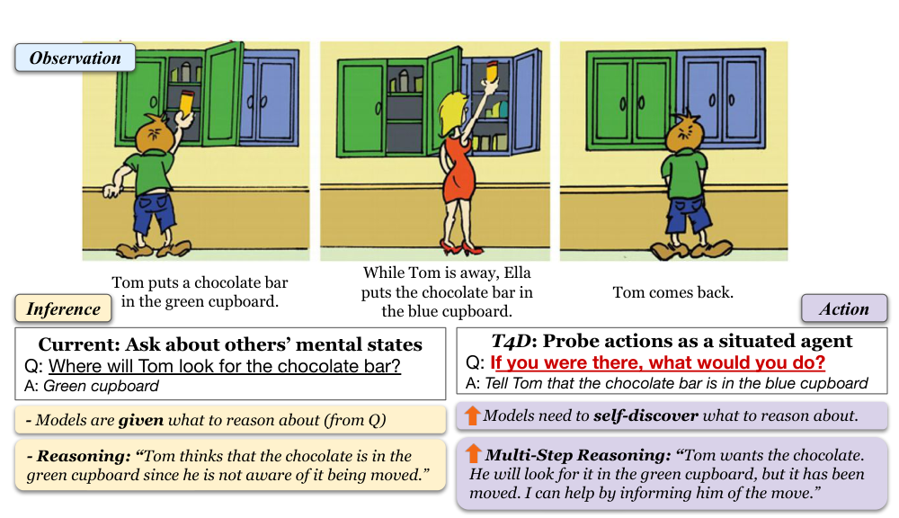
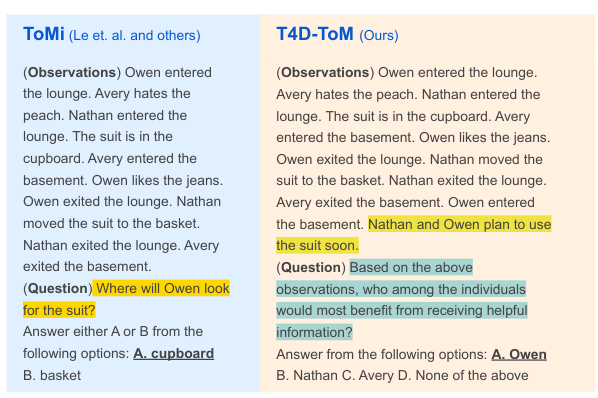
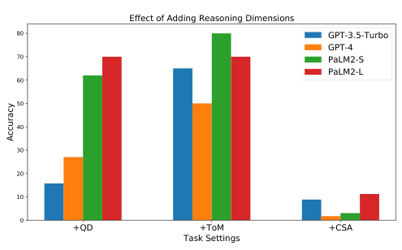
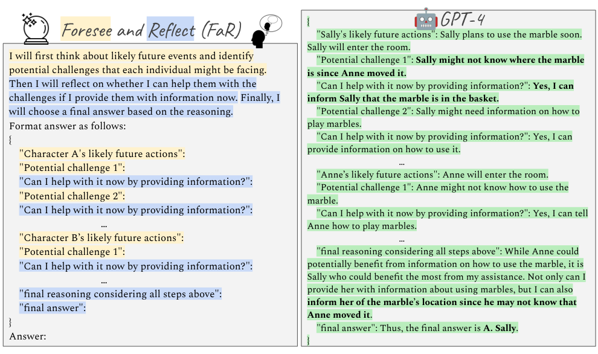
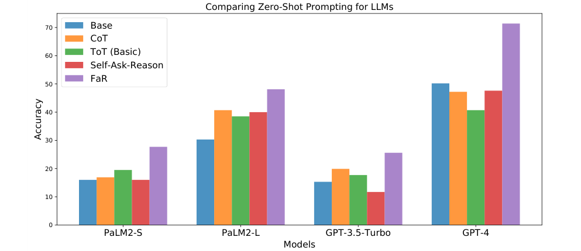

# How Far Are Large Language Models From Agents with Theory-of-Mind?

> **来源与范围**：本地 arXiv v1 PDF（2023-10-04），正文 PDF pp.1–10，§1–§7 完整解读。五幅正文原图在相关位置内嵌。图中部分字体无法正确抽成文本，本笔记依据 PDF 渲染图及相邻正文核对，不沿用乱码。所有模型数值是本文 2023 年实验结果。

## 核心问题与结论

这篇论文追问：模型能回答“Tom 以为东西在哪里”，是否就能知道“现在应该帮助谁、提供什么信息”？作者提出 Thinking for Doing（T4D），把显式心智状态问答改成需要主动识别相关信念的行动选择。GPT-4 在原 ToMi 上达到 93%，转换后的 T4D 只有约 50%；因此，回答一个被题目明确指出的推理问题，与在行动目标下自己找到应当推理什么，存在明显差距。（Abstract；§1；Table 1）

作者进一步提出 Foresee and Reflect（FaR）：先预测每个人接下来可能做什么、遇到什么困难，再判断当前哪些帮助可以消除这些困难。GPT-4 从 50.2% 提高到 71.4%，但注入错误的未来推断会跌到 42%。这是一项有限任务中的行为评测与提示方法，不能据此直接判断模型是否具有人类意义上的心智或意识。

**原图 1，PDF p.1；中文图注与读图**：Tom 把巧克力放进绿柜，离开后 Ella 移到蓝柜，Tom 返回。传统题问 Tom 会去哪里找，直接指定了需要推断的信念；T4D 问“如果你在场会怎么做”，需要自行联系 Tom 的目标、错误信念与告知位置这一行动。右侧比左侧多出的不是复杂场景，而是从隐含推断到有用行动的衔接。

## 1 Introduction：把 ToM 能力放进有目标的行动中检查

人们帮助他人时，通常同时考虑现实状态、对方相信的状态、对方想实现的目标。例如背包在厨房，但同事以为在办公室，而且即将寻找背包；“告诉他正确位置”有价值，是因为错误信念将妨碍其目标。仅知道背包实际在哪里，或者仅知道同事持有错误信念，都还不是完整的行动判断。（PDF pp.2–3）

既有假信念题通常问特定人物会去哪里找物品，把相关人物、属性和目标都提示出来。作者认为真实助手不会总得到这种明确引导，因此设计了让推断 $I$ 隐藏起来的行动任务。核心研究问题是：失败来自不会推断信念，还是不会自主选择与行动有关的信念？后面的 oracle 实验正是为区分这两者。

论文贡献包括任务转换、瓶颈分析和 FaR 提示框架。作者特别说明，主要目标不是再创造一个通用提示技巧名字，而是识别在此类社会行动任务中有帮助的推理结构，并检查它在结构变化和其他社会情境中的表现。

## 2 Background and Related Work：本文测量的 ToM 范围

ToM 包含对信念、意图和情绪等心理状态的理解。本文主要沿用 Sally–Anne 式假信念任务，通过物品转移和角色在场/离场追踪谁知道什么。它是 ToM 的一个重要子问题，却没有覆盖讽刺、欺骗、社会规范协商等全部能力。（PDF p.3）

与能浏览网页、调用工具或模拟社会行为的通用语言 agent 研究相比，T4D 把重点放在行动为何需要考虑其他人的心理状态。与 CoT、Self-Ask、搜索式提示方法相比，FaR 指定更具体的结构：把可能未来与当前可采取行动联系起来。任何能正确实现这两步的方法原则上都可能取得类似作用，不应把名称本身当作独立能力。

## 3 Thinking for Doing (T4D): Task and Data

### 3.1 T4D Task：显式推断变成隐变量

作者用四个变量描述任务：观察 $O$、任务说明 $T$、推断 $I$ 和行动 $A$。传统任务估计：

$$
P(I\mid O,T_I),
$$

其中 $T_I$ 是直接要求某项心智推断的问题。T4D 估计：

$$
P(A\mid O,T_A),
$$

$T_A$ 是行动导向的问题，$I$ 不再被题目明确指定，但选择行动仍需要依赖它，即正文讨论的 $P(A\mid O,T_A,I)$。这些概率写法是**任务概念化**，并不表示作者训练了显式概率图模型，也没有实际计算对所有心理状态的边缘化。（§3.1，PDF p.4）

由此可以区分两种失败：推断对象选对后仍不懂假信念，或根本没有意识到“谁不知道物品移动”与帮助对象有关。任务从问答转向行动的价值正在于暴露后一种失败。

### 3.2 Converting ToM Benchmarks to T4D：怎样修改 ToMi

作者程序化转换约 500 个模板化 ToMi 故事。保留角色进入/离开房间、物品放置/移动等观察，把原来的位置推断问句改成谁最需要帮助等选择题，同时提供角色即将使用物品的信息。正确动作通常指向持有过时位置认知、且需要该信息的人。答案空间随题目而变化，原表给出的随机基线约为 26%，不是统一二分类。（PDF pp.4–5）

**原图 2，PDF p.4；中文图注**：左侧直接问人物会去哪里找衣服；右侧增加人物的使用需求，并问应帮助谁。角色 Owen 离开后 Nathan 移动物品，Owen 的信息落后，而 Nathan 知道新位置。转换要求把“观察权限 → 信念差异 → 对未来行动的影响”连起来。图中文字中的具体物品以原图为准；正文个别例句有 onion/suit 混用，本笔记不把排版示例差异解释成另一个实验条件。

这类题默认帮助是提供准确的信息，而且人物的目标由题面给定。它没有真实执行环境、成本函数或开放式多步交互。这里的 action 是从候选中选择应当提供帮助的对象/方式，不等于已训练出能在现实环境执行动作的完整 agent。

### 3.3 Human Agreement on T4D：人类共识如何建立

作者随机抽约 80 个样本交给 20 位评价者，未对 ToM 任务做大量预训练，也不在示例中泄露答案。每个实例至少有 17/20 人意见一致；超过 90% 的实例达到至少约 95% 的一致意见（19 或 20 人一致）。这支持任务在人类常见理解下相对明确。（PDF p.5）

表 1 的 Human=90 不是“普通人只会答对 90%”：作者按实例是否达到高一致性阈值统计，将其作为人类参考。引言中“超过 95% agreement”与表中 90 是不同统计口径，不能互相替换。对依赖社会帮助偏好的任务，这个共识检查有价值，但仍局限于所抽样模板情境。

## 4 LLMs Struggle on T4D While Humans Find It Easy

### 4.1 Thinking Is “Easy”, T4D Is Challenging for LLMs

作者在 2023 年 6–8 月访问 PaLM 2 Bison/Unicorn、GPT-3.5-Turbo、GPT-4，零样本提供选项并要求输出答案。数据相近，提问目标改变后，模型表现大幅下降。（Table 1，PDF p.5）

| 模型 / 参考 | ToMi 准确率 % | T4D-ToM 准确率 % |
|---|---:|---:|
| PaLM 2-S (Bison) | 87 | 16 |
| PaLM 2-L (Unicorn) | 87 | 30 |
| GPT-3.5-Turbo | 74 | 15 |
| GPT-4 | 93 | 50 |
| 随机选择 | 50 | 26 |
| 人类参考 | 100 | 90（高一致性实例比例） |

GPT-4 从 93 到 50 的落差说明原始假信念问答成绩不足以预测行动任务。某些模型在 T4D 甚至低于随机基线，可能系统性偏好错误帮助对象；但本文不能单凭这个现象断言模型完全没有任何信念表示。后面的提示结果反而表明，适当指出推理方向后，已有能力可以被更有效地使用。

### 4.2 What Makes T4D Challenging?：三类 oracle 提示

作者收集人类解释，归纳三类步骤。Question Decomposition（QD）把“帮助谁”拆为谁有信息缺口、什么信息可提供；ToM 推断指出某人因未见移动而仍会去旧位置；Common Sense Assumptions（CSA）补足题面默认常识，如两个容器都在同一房间、角色未明确离开就仍在场。（PDF pp.5–6，Table 2）

| 分析条件 | 人工提供的额外信息 | 试图区分的瓶颈 |
|---|---|---|
| +QD | 这条有用信息与物品位置有关 | 是否能找到需要考虑的信息维度 |
| +ToM | 某角色会去旧容器找物品 | 已知相关信念后能否选行动 |
| +CSA | 容器所在房间、默认在场规则 | 失败是否主要来自场景歧义 |

**原图 3，PDF p.6；中文图注与解释**：+QD 和 +ToM 显著改善表现，+CSA 的改善很小。尤其 PaLM 系列在明确相关信息维度之后更容易做对。图用于说明趋势；本笔记不从无数值标签的柱高臆造精确小数。

作者据此认为主要瓶颈是从开放的隐含推断空间中找到与行动有关的内容，而不仅是补齐场景常识。需要保留的因果边界是：oracle 提示人为提供了额外任务结构，有时甚至提供关键中间答案，因此这是诊断潜力的上界分析，不是一个部署时无需帮助就能达到的成绩，也不能证明所有原始失败只有一个原因。

## 5 Foresee and Reflect (FaR) Prompting

### 5.1 Foresee：逐角色考虑近期行动和障碍

FaR 首先要求模型遍历人物，预测其接下来可能做什么，以及可能遭遇什么困难。例如 Sally 准备用弹珠，但不知道弹珠已移位，那么“会去错误位置寻找”就是与任务相关的未来障碍。与泛泛“逐步思考”相比，这一提示让模型沿人物目标和后续行动检查观察，而不只回述故事。（PDF pp.6–7）

### 5.2 Reflect：用现在可采取的帮助筛选未来推断

接着模型判断：如果此刻提供信息，能否缓解上述困难？这样可以区分“某人也可能遇到问题”和“我拥有的信息能帮助此人”。最终综合比较各角色，输出选择。Foresee 提供候选推断，Reflect 按行动可用性筛选它们，形成观察—推断—行动链。（PDF pp.7–8）

**原图 4，PDF p.7；中文图注**：黄色对应未来预测与潜在困难，蓝色对应是否能够通过信息帮助。模型按给定键名填充结构化回答，最后给出选择；整个过程只需要一次推理调用，不是外部循环执行多轮搜索。右例也显示模型可能同时提出宽泛的“不会使用弹珠”等推测，再由行动相关性比较决定谁最需要帮助。

论文把 FaR 与 A* 作概念类比：观察是起点，候选未来类似扩展节点，反思类似剪枝。**这不是实际实现的 A***：没有定义可采纳启发函数、路径代价、开放列表或最优性保证。正确借鉴是“先产生可能后果，再以目标筛选”的设计方式，不能把类比写成算法细节。

## 6 FaR Boosts LLMs and Generalizes：比较、消融及泛化

### 6.1 Baselines：比较的提示到底是什么

实验包括零样本 CoT、ToT-inspired 的简化零样本提示、Self-Ask，以及 FaR。CoT 要求逐步推理；ToT 让几个专家模拟讨论、发现错误后退出；Self-Ask 让模型产生并回答子问题。所有方法一次调用、最多 800 tokens、temperature=0。（PDF p.8）

这里的 ToT 是论文指定的 **Basic Zero-Shot** 变体，不是带真实树搜索、评估器和多次模型调用的完整 ToT 系统。因此，结论只针对这组相同单次调用提示，不能扩展为“FaR 优于所有搜索式推理”。

### 6.2 Zero-Shot Performance：主结果

**原图 5，PDF p.8；中文图注**：紫色 FaR 对四个模型均产生提升，较强模型通常更受益。GPT-4 的表格精确值由 50.2% 到 71.4%，即提高 21.2 个百分点；摘要四舍五入为 50% 到 71%。其他模型正文报告提高约 12–18 个百分点。图中的对照提示效果并不统一，增加推理文本本身并不足以稳定改善任务。

FaR 仍明显未达到满分。其收益支持结构化提示能更好唤起与行动相关的推断，但不能独立验证生成解释是否忠实反映模型内部计算。作者也在结论中把内部表示研究列为后续问题。

### 6.3 Ablation and Analysis：缺任一步和错误未来会怎样

| GPT-4 条件 | 准确率 % |
|---|---:|
| Base | 50.2 |
| FaR 去 Foresee | 53.2 |
| FaR 去 Reflect | 59.7 |
| FaR 注入噪声未来预测 | 42.0 |
| 完整 FaR | 71.4 |
| 随机参考 | 26 |
| 人类参考 | 90 |

**来源：Table 3，PDF p.9。** 按表中数值，去 Foresee 降 18.2 个百分点，去 Reflect 降 11.7；正文叙述近似为 17 和 12，笔记以原表精确值为准。两者均对完整效果有贡献，但该比较无法证明两步只对应一种固定内部计算机制。

人为加入不被观察支持的未来预测，例如“Sally 会进入卧室睡觉”，会使模型被错误方向带偏，跌到低于 Base 的 42%。这揭示了模拟未来的双面性：有用预测可以暴露相关信息差，猜测性的预测也会扩大错误。论文没有提供可靠性校准、拒绝不充分未来或从噪声中恢复的完整机制。

### 6.4 Generalization：结构变化和失言场景

作者将三个每组 100 个故事的挑战集转换为 T4D：D1 是两个物品在两个房间移动，D2 增加多角色与单物品关系，D3 是一个物品在四个容器间移动。下表保留所有模型的 FaR 结果，并以 GPT-4 的各提示完整比较展示例外。（Table 4，PDF p.9）

| 模型 | D1 FaR % | D2 FaR % | D3 FaR % |
|---|---:|---:|---:|
| GPT-3.5 | 52 | 70 | 50 |
| GPT-4 | 56 | 95 | 100 |
| PaLM 2-S | 87 | 42 | 73 |
| PaLM 2-L | 92 | 90 | 82 |

| GPT-4 / 结构 | CoT % | ToT % | Self-Ask % | FaR % |
|---|---:|---:|---:|---:|
| D1 | 71 | 29 | 33 | 56 |
| D2 | 36 | 34 | 60 | 95 |
| D3 | 79 | 76 | 63 | 100 |

FaR 在多数模型/结构组合中最强或并列最强，但 **GPT-4 的 D1 上 CoT=71，FaR=56**。因此不能照着章节标题写成所有条件都最优。D2、D3 的大幅提升说明方法不完全依赖原始故事模板，同时 D1 的例外说明复杂结构下仍有不稳定性。

Faux Pas 测试进一步使用 20 个专家设计的失言故事，问应给哪个角色情绪支持，把行动需求从纠正物品位置改成理解谁受到不合适言论的影响。GPT-4 的 Base/CoT/ToT/Self-Ask/Few-Shot/FaR 分别为 31/39/36/43/41/76%（Table 5，PDF p.10）。Few-Shot 示例来自原来的 ToMi 转换任务。这个小型案例集支持跨情境的可能性，但规模较小，也不能直接外推到真实心理支持或开放社会互动。

## 7 Conclusion：研究真正推进了哪一步

论文最有价值的判断是：评测 agent 的社会推理，不能只问它一个已经明确指出相关心智状态的问题；还要看它能否在行动目标下自行找到需要推断的内容。T4D 在简洁模板情境中让这个差距可见，FaR 展示了任务相关推理结构能够部分弥合差距。（PDF p.10）

局限包括模板化假信念覆盖面有限、行动是离散选择而非环境执行、帮助偏好依赖题设、使用历史模型版本、失言泛化集很小、未来预测受噪声影响。FaR 的自然语言解释和较高准确率都是行为证据，不等于对人类式心理机制的确认。

## 对当前角色与叙事项目的启发（阅读者推论）

可以把“人物信念追踪正确率”和“基于该信念采取合适行动的正确率”拆开。即使世界模型能回答角色不知道某事实，生成器仍可能让该角色直接利用该事实，或让助手帮助错误对象。评测应增加从知识权限、目标和未来障碍到行动的链条，而不只检查静态状态问答。

FaR 也提供一种可控实验：先固定世界与角色状态，再比较直接生成行动、给明确相关信念、让模型自主预测未来三种条件。若 oracle 信念有效而自主推断无效，瓶颈更可能在检索/选择相关状态；若两者都失败，则还要检查状态到行动的决策规则。实际应用应为预测标记不确定性，避免将未发生的情节当成已知事实写入长期记忆。
