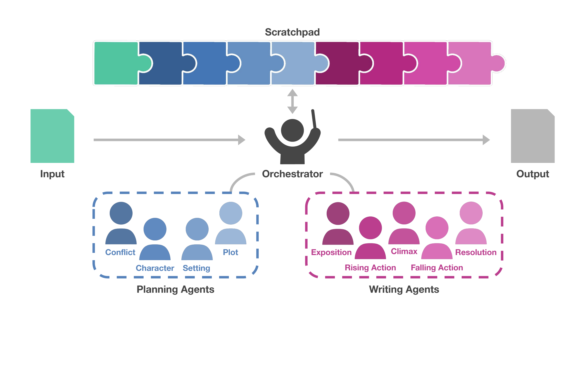
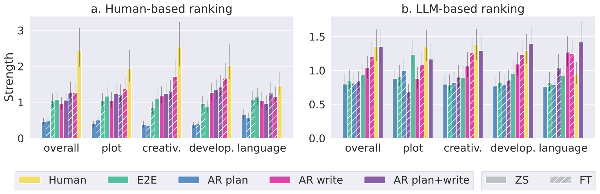

# Agents' Room: Narrative Generation through Multi-step Collaboration

## 一句话总结

本文提出 Agents' Room，把长篇故事生成拆成多个专门化的规划代理和写作代理，通过共享 scratchpad 协作完成叙事生成；在新构建的 Tell Me a Story 长篇故事数据集上，该框架相较端到端基线更受人工评估者偏好。

## 研究问题

论文关注的是 LLM 在长篇虚构叙事生成中的结构性困难：单次生成往往难以同时保持情节连贯、角色一致、语言有变化，并且输出长度和叙事结构也不稳定。作者希望回答的问题是，能否把故事写作拆解为更接近人类写作流程的多个子任务，让不同代理分别负责冲突、人物、设定、情节和叙事阶段，从而提升长篇故事质量；同时，长篇故事该如何通过人类和 LLM 评估器进行更可靠的多维评价。

## 核心方法

Agents' Room 将写作任务形式化为多代理协作过程。系统维护一个共享 scratchpad，orchestrator 按固定顺序调用代理；规划代理只向 scratchpad 写入中间内容，包括 central conflict、character、setting 和 plot，写作代理则根据 scratchpad 分别生成 exposition、rising action、climax、falling action 和 resolution，并把这些片段拼接为最终故事。为了训练专门化代理，作者使用较强教师模型从已有 prompt-story 样本中反向生成规划内容，并把完整故事切分为不同叙事阶段，形成合成监督数据；实验中比较 zero-shot 和 LoRA fine-tuned 版本，并用人工 pairwise preference、表层指标、参考指标和 LLM-based side-by-side evaluator 评估故事质量。

## 分章节阅读笔记

### 1 Introduction

引言的核心作用是把长篇叙事生成从“让一个 LLM 一次性写完故事”重新定位为“一个需要规划、分工和协作的复杂写作过程”。作者没有一开始就进入模型细节，而是先用人类长篇写作的常识建立问题背景：长篇内容通常需要研究、提前规划、人物和情节设计，以及有吸引力的语言风格。Harry Potter 的例子在这里不是为了讨论文学史，而是为了说明高质量长篇叙事往往不是即时生成出来的，而是依赖全局规划、角色发展和关键情节节点。

这一节随后把叙事理论中的结构拆分引入机器生成任务。作者强调，较长故事通常可以分解为 exposition、rising action、climax、falling action 和 resolution 等阶段；编剧指南也常把故事拆成 setup、new situation、progress、complications、final push 和 aftermath 等功能段落。这一铺垫为后文的写作代理设计服务：如果人类叙事本身就有可分解结构，那么让不同代理分别处理故事规划和不同叙事阶段，就不是任意工程设计，而是有叙事理论依据的任务分解。

Figure 1 对应引言中的方法总览：系统有一个中央 orchestrator，按顺序调用不同 agent；每个 agent 的输出会被写入共享 scratchpad，后续 agent 可以读取这些中间内容。图中不同颜色表示 scratchpad 中来自不同代理的贡献，这使得作者想强调的协作机制更直观：代理之间不是彼此隔离地生成文本，而是通过共享工作区逐步积累规划信息和写作内容。

作者接着指出当前 LLM 虽然已经具备较强写作能力，但长篇内容生成仍有几个稳定难点。第一，长文本中叙事、语气和事实一致性难以维持；第二，生成内容容易缺乏鲜明声音、幽默感和原创表达；第三，模型常复用训练数据中的常见模式，导致情节和措辞趋于套路化；第四，长篇写作本身缺少合适的数据集、benchmark 和标准化评价准则，尤其是创意写作很难只靠传统自动指标评价。这些问题共同构成本文的方法动机：长篇故事生成的问题不只是“模型不够大”或“prompt 不够细”，而是任务本身需要更结构化的生成流程和更合适的评价体系。

引言对已有方法的定位也很清楚。已有工作常用 detailed prompting、prompt chaining 和 planning strategies，把复杂写作拆成更容易处理的步骤。但作者认为，很多方法仍是在单个 agent 内部完成任务分解，即让同一个模型既规划又写作。本文的关键转向是把长篇写作概念化为 multi-agent collaboration problem：不同 agent 拥有不同专长，通过协作完成整体写作任务。这里的“multi-agent”并不是为了增加复杂度，而是为了让任务分工显式化，使每个代理承担更窄、更清楚的写作功能。

Agents' Room 在引言中被定义为一个由两类代理组成的生成范式。Planning agents 负责充实内容的关键组成部分，例如人物、情节、中心冲突等，但它们不直接写最终故事；writing agents 负责生成最终文本的不同部分，也可以按叙事阶段专门化。两类代理通过 scratchpad 共享信息，orchestrator 则决定调用顺序。这个设计对应了作者对单代理方法的批评：单个 LLM 往往需要冗长且不完全明确的指令，而多代理结构可以把复杂指令拆成多个精确子任务。

作者在引言中列出的多代理优势有四点。其一，LLM 可以被专门化为不同代理，可以是 zero-shot prompted，也可以是 fine-tuned，从而更精确地完成单一功能。其二，系统能避免把所有要求都塞进一个冗长 prompt 中，减少指令不清和上下文构建困难。其三，多代理框架适用于解空间很大、输出很长、答案事先未知的问题，例如写一本书。其四，这种结构天然支持 human-in-the-loop：某些机器代理可以被人类替换或编辑，使系统不必局限于全自动生成。

引言最后给出本文的贡献边界：作者把 Agents' Room 形式化为一般写作框架，并在长篇故事生成上实例化，目标故事长度为 1,000-2,000 tokens；他们依据叙事理论设计专门化代理；同时提出 Tell Me a Story 数据集，包含人工创建的 writing prompts 和 fiction stories；还设计了面向长篇故事多个质量维度的评价框架。实验结论在引言中被压缩为一句：Agents' Room 生成的故事相比不使用协作和专门化的基线系统，更受人类和自动评价偏好。

这一节在整篇论文中的作用是建立三层逻辑：长篇写作天然需要结构化规划，现有 LLM 长篇生成在一致性、原创性和评价上仍不足，因此把写作拆给多个专门化代理协作完成是一个合理方向。后续第 3 节会把这个想法形式化为 Agents' Room 框架，第 4 节则把它具体落到故事生成任务中。

### 2 Related Work

这一节的作用是把 Agents' Room 放进三个相邻研究脉络中：故事生成、LLM 多代理系统、故事评价。作者的写法比较紧凑，不是展开完整综述，而是为本文的三个关键主张铺路：故事生成需要拆解，复杂任务可以由多代理协作完成，长篇故事质量需要比传统自动指标更合适的评价方式。

**Story Generation**

在故事生成这条线上，作者首先承认大规模预训练语言模型已经能生成表面流畅的故事，但核心问题仍是 coherence 和 plausibility，也就是故事内部是否连贯、事件是否可信。相关工作通常会把故事生成拆成“先规划、再扩写”的过程：先产生实体及动作序列、outline、plot structure，或者更丰富的 setting、character、main plot points，然后再据此生成具体文本。这说明故事生成领域已经形成一个共识：单步生成很难稳定得到高质量故事，中间计划或结构约束是必要的。

作者还提到另一类干预方式，包括用 commonsense knowledge 约束人物互动、用 ensemble-based models 提升事件序列可信度、用 stylistic constraints 控制风格，以及通过 constrained decoding 生成情节转折。这些工作虽然技术路线不同，但共同指向同一个结论：故事质量通常不是靠一次端到端生成自然出现的，而需要外部结构、约束或中间表示来引导。

本文与这些工作的连接点在于“拆解故事生成任务”，但差异在于拆解后的执行单位。已有方法多是让同一个模型利用计划或约束来生成故事；Agents' Room 则把不同子任务交给不同 agents，让它们协作完成规划和写作。作者还特别提到 collaborative writing：在人类学术或专业写作中，协作能利用不同贡献者的优势和视角，也可能增强创造力。这个类比为 multi-agent writing 提供了一个人类写作流程上的合理性。

作者也把本文和 human-AI writing assistance 区分开来。LLM 辅助人类写故事是活跃方向，但本文实验中故事完全由模型生成，没有人类参与实际写作。不过框架本身保留 human-machine collaboration 的可能性，因为某些代理或某些中间阶段可以由人类替换、审阅或编辑。

**Multi-agent Systems**

在多代理系统这条线上，作者先从一般 LLM agents 说起：LLM-based agents 已经在推理、规划等任务中表现出能力，而 multi-agent systems 的基本思想是让多个独立 LLM 共同解决单个 agent 难以完成的复杂任务。每个 agent 通常有不同角色或专长，因此系统可以以更 coordinated、distributed、modular 的方式处理问题。

相关工作已经把 LLM 多代理用于软件开发、机器人运动规划、人类行为模拟、游戏环境创建、推荐系统、金融交易模拟、政策制定等任务。作者借这些例子说明，多代理协作已经是一种通用复杂任务求解范式。但他们同时强调，自己并不知道已有面向 long-form writing 的多代理框架。这句话就是本文在相关工作中的空位声明：多代理已经被用于许多复杂任务，故事写作也明显复杂且可拆解，但长篇写作上的系统化 multi-agent framework 仍缺位。

Agents' Room 从多代理协作求解中吸收的核心思想，是 specialized roles 和 shared memory/scratchpad。每个 agent 负责一个特定写作子任务，并通过共享 scratchpad 交流上下文相关信息。这里的 scratchpad 和引言中的定位一致：它既是跨代理通信机制，也是防止后续代理丢失前面规划内容的共享记忆。作者同时说明，本文实验中 agent 的数量和类型是预先定义的，而不是根据故事内容动态生成。这一点很重要：本文选择的是一个结构清晰、可控的多代理写作流水线，而不是开放式 agent spawning。

**Evaluation**

评价部分解释了为什么本文不能只报告 Rouge-L、BertScore 或简单相似度指标。故事评价本来就难：人工评价通常最可靠，但昂贵、耗时且主观；而且只看人类是否觉得故事质量合格，可能无法发现模型是否缺乏 diversity 或 creativity。例如，如果模型直接复用训练集风格甚至内容，可能仍然在表面质量上过关，却没有真正展示泛化和创造性。

传统自动评价也有明显局限。基于 lexical overlap 或 semantic similarity 的指标，在生成故事和人工参考答案之间做匹配，但开放式故事生成往往允许多个合理输出，因此和人类判断相关性较差。作者因此引入 LLM-based evaluator，用 side-by-side comparisons 比较系统输出，并希望它与人类判断更一致。

这一节最后说明本文的评价设计不是让 LLM 给一个笼统分数，而是借鉴创意写作评价研究，把故事质量拆成少数人类和机器相对能判断的维度，例如 plot 和 language use。这个设计和方法部分形成呼应：生成端把长篇写作拆成可管理子任务，评价端也把故事质量拆成可比较维度。换言之，本文不仅主张“写作要结构化分工”，也主张“评价要结构化分解”。

整体来看，Related Work 为本文确定了一个比较明确的位置：它继承故事生成中“规划有助于长篇叙事”的思想，借用 LLM 多代理系统中的角色专门化和共享记忆机制，并针对故事评价的开放性和主观性引入多维人工评价与 LLM side-by-side evaluator。下一章 `3 Agents' Room` 会把这里的定位转化为形式化框架，说明 agent、scratchpad 和 orchestrator 分别如何定义。

### 3 Agents' Room

这一章把前两章的动机正式转化为框架定义。作者的目标不是只为故事写作提出一个特定流程，而是先定义一个一般的 multi-agent collaborative writing framework：给定复杂写作任务 $x$，系统通过多个专门化 agents 分解写作过程，最终生成输出 $y$。故事写作只是后文的一个实例。

**框架整体流程**

Algorithm 1 给出了 Agents' Room 的抽象执行逻辑。系统先把原始任务 $x$ 放进 scratchpad，即 $s \gets x$。之后，只要 orchestrator 还能根据当前 scratchpad 和 agent 集合 $\mathcal{A}$ 指派下一个 agent，并且步骤数没有超过最大步数 $T$，系统就循环执行：选择当前 agent $a_t$，让它读取 scratchpad 并生成输出 $y_t$，再把 agent 的标签 $l_t$ 和输出 $y_t$ 一起追加到 scratchpad 中。如果当前 agent 属于 writing agent，系统还会把它的输出追加到最终文本 $y$。循环结束后，最终输出就是所有 writing agents 产物的拼接。

这个算法的关键不是复杂的数学推导，而是明确区分了两条信息流：scratchpad 是全局共享工作区，记录所有中间内容；final output 只接收 writing agents 的输出。这样 planning agents 可以影响后续写作，但不会直接出现在最终故事里。

**Agents**

作者把一个 agent 定义为集合 $\mathcal{A}$ 中的专门化模型 $a$。每个 agent 都有唯一标识标签 $l$，并实现一个从文本到文本的映射 $f: \mathcal{V}^* \to \mathcal{V}^*$，其中 $\mathcal{V}$ 表示词表，$\mathcal{V}^*$ 表示任意长度的 token 序列。换成更直白的话：本文把 agent 看成一个“读文本、写文本”的模块，只是每个模块负责不同子任务。

这个定义刻意保持宽泛。Agent 可以是针对子任务 fine-tuned 的 LLM，也可以是带特定 prompt 的 zero-shot LLM，还可以是确定性的文本处理函数，甚至可以是人类参与者。作者当前实验主要使用 LLM-based agents，但这种定义为 future human-in-the-loop 留了接口。只要某个参与者能读取文本输入并返回文本输出，就可以被纳入这个框架。

本文进一步把 agents 分为两类：planning agents 和 writing agents。两者的区别不只是“做什么任务”，还包括它们与最终输出的关系。Planning agents 只生成中间规划，写入 scratchpad；writing agents 则负责生成最终输出的片段。

**Multi-agent Communication**

作者选择的是 collaborative communication，而不是 debate 或 competition。也就是说，agents 的关系不是互相辩论、互相竞争，而是共同朝同一写作目标推进。这个选择和写作任务本身很贴合：长篇写作需要角色、情节、设定、结构之间彼此一致，如果 agents 之间缺少共享信息，很容易出现重复、矛盾或断裂。

这一点也解释了为什么后面 scratchpad 是框架中心。多代理系统真正难的不是“多叫几个模型”，而是让不同模型的中间产物能被后续模型可靠使用。没有通信机制，多代理只是并排的多个调用；有了 scratchpad，才形成协作链条。

**Scratchpad**

Scratchpad 是本章最重要的机制。作者假设所有 agents 都能访问共享 scratchpad $s$，它保存每个 agent 的输出，并在 agent 调用之间传递。初始时，scratchpad 只包含写作任务 $x$；每一步之后，它都会追加当前 agent 的标签和输出，即 $s_{t+1} \gets (s_t; (l_t, y_t))$。

标签 $l_t$ 的作用很实际：后续 agent 可以知道 scratchpad 中哪一段来自哪个 agent，从而更容易解析和引用相关内容。例如故事写作中，写 climax 的 agent 可以明确读取 character、setting、plot 等规划结果，而不必从一整团无标记文本里猜这些信息的位置。

作者还强调，scratchpad 不保存每个 LLM agent 的具体 input prompt。Prompt template 属于 agent 内部机制，而 scratchpad 只保存 agent 对外产出的文本。这一点让框架更干净：scratchpad 是共享状态，不是 prompt 工程日志。每个 agent 有责任把自己的输出组织成后续 agent 能使用的格式。因为所有 agents 都能读 scratchpad，它们也可以避免重复写已经存在的信息。

**Orchestrator**

Orchestrator 是中央调度器，决定什么时候调用哪个 agent，也决定是否还需要继续调用。给定当前 scratchpad $s_t$ 和可用 agent 集合 $\mathcal{A}$，orchestrator $o: \mathcal{V}^* \times \mathcal{A}^* \to \mathcal{A}$ 选择下一个 agent $a_{t+1}$。

作者把这个过程说成可以建模为 Markov process，因为每一步的决策只依赖当前 scratchpad 状态，而不需要额外隐藏历史。历史已经被 scratchpad 显式记录了。Orchestrator 的具体形式可以很简单，也可以很复杂：可以是固定规则，可以有学习到的转移概率，也可以是任意更复杂的控制策略。它还负责停止条件，例如没有下一个 agent 可调用，或者达到最大步数 $T$。

在本文后续故事写作实例中，orchestrator 采用的是 deterministic order，也就是预设顺序调用 planning agents 和 writing agents。这里的第 3 章先保留更一般的定义，为将来更复杂的 learned orchestrator 留空间。

**Planning Agents**

Planning agents 对应写作中的中间规划阶段。作者引用前文相关工作指出，LLM 在生成最终输出之前通常会从中间计划中受益，例如先生成 outline、argument structure、character descriptions 或 plot elements。这些中间步骤能改善最终文本，但本身不应该进入最终输出。

因此，planning agents 的定义是：专门生成中间步骤，并且只写入 scratchpad。故事写作中，它们可以负责人设和情节元素；论文或 essay 写作中，它们可以负责论证结构、检索参考资料或组织证据。因为 planning agents 的输出是文本，人类也可以在这一阶段介入，审阅或编辑中间计划，再交给后续 writing agents 使用。

**Writing Agents**

Writing agents 负责最终文本的具体片段。作者指出，复杂任务常常难以由一个 LLM 一次性生成，尤其是输出很长、不同部分需要不同风格或功能时。把最终输出拆成若干片段，由不同 writing agents 分段生成，可以让每个 agent 聚焦一个更窄的写作目标。

Writing agents 的输出有双重去向：一方面，它们也会写入 scratchpad，供后续 agent 了解已经生成了什么；另一方面，它们的输出会追加到最终文本 $y$。因此最终输出可以看作所有 writing agents 输出的串联。故事写作中，writing agents 可以分别负责 exposition、climax 等叙事阶段；essay 写作中，它们也可以分别负责正方论证、反方论证或结论等部分。

这一章的核心贡献是把 Agents' Room 从一个直觉性的“多代理写作”想法，落成了一个有状态、有调度、有中间产物、有最终输出通道的框架。它的设计很克制：agent 都是文本输入输出模块，scratchpad 负责共享状态，orchestrator 负责顺序与停止，planning/writing agents 负责区分中间规划和最终文本。下一章 `4 Fiction Writing Task` 会把这个抽象框架具体实例化到长篇故事生成：哪些 planning agents 被设计出来，哪些 writing agents 对应叙事弧线，以及它们按什么顺序协作。

### 4 Fiction Writing Task

这一章把第 3 章的通用 Agents' Room 框架实例化到 fiction writing。任务形式很直接：给定一个初始写作提示 $x$，生成一篇叙事文本 $y$。但这一章真正要解决的不是“怎么让模型写故事”这么泛泛的问题，而是把长篇故事生成拆成三个可操作层面：代理如何分工、专门化代理如何训练、评价和训练所需的数据从哪里来。

从论文结构上看，第 4 章是方法框架和实验设置之间的桥。第 3 章定义了 agent、scratchpad、orchestrator；第 4 章回答这些抽象对象在故事生成里分别是什么。这里的核心设定是：规划代理负责故事内容的骨架，写作代理负责叙事弧线的不同阶段，Tell Me a Story 数据集提供人类写作的 prompt-story 对，synthetic data generation 则把这些完整故事反推出各个代理需要的训练信号。

### 4.1 Specialized Agents Inspired by Narrative Theory

作者根据叙事理论设计了两类专门化代理。第一类是 planning agents，负责故事写作前的内容规划；第二类是 writing agents，负责把规划结果写成最终故事。这个设计直接对应前面提出的 planning/writing agent 区分，也把“多代理协作”变成一个具体可运行的故事生成流程。

四个 planning agents 分别覆盖故事规划中的关键内容维度：

| Planning agent | 负责内容 | 作用 |
|---|---|---|
| `[conflict]` | central conflict | 明确故事的核心矛盾，给情节推进提供驱动力。 |
| `[character]` | character(s) | 设计角色特质和行为基础，帮助长篇故事保持人物一致性。 |
| `[setting]` | setting | 建立故事发生的环境和背景，使叙事有稳定世界框架。 |
| `[plot]` | plot elements | 梳理主要情节节点，让故事不只是片段堆叠。 |

作者明确说，这些 planning agents 是为了针对 LLM 生成故事中的常见弱点：情节不够有吸引力、长篇中角色不够一致。换句话说，planning agents 不是装饰性的“先想一想”，而是在生成前显式补上模型容易松散的叙事支架。

五个 writing agents 则对应经典故事结构中的不同阶段：

| Writing agent | 叙事功能 |
|---|---|
| `[exposition]` | 交代背景、人物和初始情境。 |
| `[rising action]` | 推进冲突和复杂性。 |
| `[climax]` | 生成故事的关键高点或转折。 |
| `[falling action]` | 处理高潮之后的后果和收束。 |
| `[resolution]` | 给故事一个结局或最终状态。 |

作者采用这一结构，是因为 exposition、rising action、climax、falling action、resolution 是常见且较通用的叙事弧线。它还有一个很实际的工程效果：单次生成时，LLM 往往达不到 prompt 里要求的长度，故事偏短；分段写作则把最终文本拆成多个部分生成，更容易得到较长输出。

每个 agent 都被实现为一个 LLM 加一个特定 prompt template。Prompt template 会把 scratchpad 格式化成适合该 agent 子任务的输入。Orchestrator 在这里采用确定性顺序，而不是学习式调度：

`[conflict] -> [character] -> [setting] -> [plot] -> [exposition] -> [rising action] -> [climax] -> [falling action] -> [resolution]`

这个顺序体现了作者的叙事先验：先确定冲突、人物、背景和情节，再按故事弧线逐段写作。作者选择 deterministic orchestrator 是为了简化问题，因为当前任务有很强的 narrative theory prior；但他们也指出，未来可以探索带学习目标的更复杂 orchestrator，甚至扩展到更多叙事结构。

### 4.2 Synthetic Data Generation for Agent Training

这一节处理一个很现实的训练问题：如果要 fine-tune 每个专门化 agent，就需要每个 agent 的目标输出。但普通故事数据集通常只有完整的 prompt-story 对，不会额外标注“中心冲突是什么”“角色设定是什么”“这段故事哪里是 climax”。因此，直接监督训练 planning agents 和 writing agents 会缺少标签。

作者的解决方案是 distilled backtranslation。给定一个已有数据样本，也就是写作 prompt 和人类写好的完整 story，作者用更大的 teacher LLM 反向生成两类中间标注：一类是 planning agents 的输出，例如 conflict、character、setting、plot；另一类是 writing agents 的输出，也就是把完整故事切分成 exposition、climax 等叙事阶段。

这里的“backtranslation”意思不是语言翻译，而是从最终成品反推出生成它所需的中间步骤。作者强调，这比一般 distillation 更直接，因为 teacher LLM 不需要凭空写一个新故事，而是基于已有 gold story 反向恢复中间计划和结构分段。这样生成的 teacher outputs 会被用来构造各个 planning/writing agents 的合成训练集。

这一设计很关键，因为它把小规模高质量人类故事数据转化成多代理系统可用的监督信号。没有这一步，fine-tuned agents 只能训练端到端故事生成，无法分别学到“怎么写角色设定”或“怎么写 falling action”。换句话说，synthetic data generation 是本文从框架走向可训练系统的齿轮。

### 4.3 Tell Me a Story Dataset

这一节介绍 Tell Me a Story 数据集。作者先解释为什么创意写作数据收集比普通标注任务复杂：创意写作不是给定输入后按固定标签规则标注输出，而是同时涉及情节、角色、语言、风格、想象力等多个互相依赖的质量维度。即使存在“好写作”的标准，评价也带有明显主观性，而且写作本身是一种长期习得的综合技能。

因此，作者没有采用常见的众包式简单标注流程，而是用 writing workshops 来收集数据，尽量复现更自然的协作写作环境。数据由 28 位 writers 参与创作，他们得到较宽泛的质量指导，这些指导综合了 APA 写作手册、GRE/GMAT 写作评价 rubrics 和大众市场风格指南。写作流程包括：作者创建自己的 prompts，写初稿，接受同伴反馈，修改，再提交给 workshop lead 进行第二轮反馈和最终批准。每个 workshop 平均持续 3-4 周，生产节奏约为每位作者每周 2-3 个写作样本。

Figure 2 展示的是数据集中 prompt 的风格。作者给出的例子都不是一句话主题，而是带有长度、类型、人物处境、必经事件、语气和结局约束的详细写作要求。例如，一个 prompt 要求写一篇不恐怖的幽灵商业建议故事，另一个要求写时间旅行者在冰原醒来的科幻故事。这说明 Tell Me a Story 的输入比很多传统故事生成数据集更长、更具体，也更接近对长篇故事写作的真实约束。

Table 1 把 Tell Me a Story 和常用开放式故事生成 benchmark 做了对比：

| Dataset | Training | Validation | Testing | Avg. input tokens | Avg. target tokens |
|---|---:|---:|---:|---:|---:|
| WritingPrompts | 272,600 | 15,620 | 15,138 | 28 | 735 |
| RocStories | 176,688 | 9,816 | 4,909 | 9 | 41 |
| ChangeMyView | 42,462 | 6,480 | 7,562 | 18 | 104 |
| WikiPlots | 69,288 | 8,661 | 8,662 | 4 | 195 |
| Tell Me a Story | 123 | 52 | 55 | 113 | 1,498 |

这个表的重点不是规模优势，而是质量和任务形态。Tell Me a Story 很小，训练/验证/测试分别只有 123/52/55 个样本，因此作者明确说它不适合从零训练模型。但它的 prompt 平均 113 tokens，比其他数据集详细得多；target story 平均 1,498 tokens，约为 WritingPrompts 的两倍，也远长于 RocStories、WikiPlots 和 ChangeMyView。

作者还提醒，部分常用 benchmark 其实并不严格等同于“叙事故事”：WikiPlots 是维基百科中的情节摘要，不是完整故事；RocStories 是五句常识故事；ChangeMyView 是观点帖和反驳文本。相比之下，Tell Me a Story 虽然小，但更贴近本文要研究的 long-form fiction writing。多数故事属于 science fiction 和 fantasy，也覆盖 horror、drama、comedy、adventure 和 folklore。

第 4 章整体完成了本文方法实例化的三步：用叙事理论定义代理分工，用 distilled backtranslation 解决代理训练标签缺失，用 Tell Me a Story 提供高质量长篇故事样本和评价对象。它为后面的实验设置打好了地基：第 5 章会开始说明具体比较哪些系统、用什么模型骨干、怎么训练和调参。

### 5 Experimental Setup

这一章说明实验中具体比较哪些系统、Agents' Room 有哪些变体，以及模型和训练设置是什么。它的作用是把前面的框架主张转化为可检验问题：性能提升到底来自多代理协作、规划、分段写作、fine-tuning，还是只是因为 prompt 更详细。

**Comparison Systems**

作者把当前叙事生成的主流基线定义为 end-to-end story generation，也就是让模型一次性生成完整故事。它有两个基础版本：zero-shot prompting 的 $\textsc{E2E}_{ZS}$，以及 fine-tuned 的 $\textsc{E2E}_{FT}$。这两个版本代表“不使用多代理结构”的基本对照组。

为了避免只和弱 baseline 比较，作者还加入了几个更强的 zero-shot 端到端变体：

| Baseline | 做法 | 目的 |
|---|---|---|
| $\textsc{E2E}_{ZS}$ | 直接根据 prompt 一次性生成故事 | 最基础的 zero-shot 端到端基线 |
| $\textsc{E2E}_{FT}$ | fine-tune 后一次性生成故事 | 检验 fine-tuning 的端到端版本 |
| $\textsc{E2E}_{ZS}$ plan | 先要求模型生成 conflict、characters、setting、plot，再生成故事 | 检验“单模型显式规划”能否替代多代理规划 |
| $\textsc{E2E}_{ZS}$ reflect | 让模型按详细 guidelines 反思 conflict、characters、setting、plot，再生成故事 | 检验 self-reflection 式提示是否足够 |
| $\textsc{E2E}_{ZS}$ decompose | 让模型自动生成 plan，再在一次调用中按计划写故事 | 检验无任务特定知识的自动分解 |
| $\textsc{2Stage}$ decompose | 第一次调用生成 plan，第二次调用根据 prompt 和 plan 写故事 | 检验两阶段单模型规划-写作流程 |

这些 baseline 很关键，因为它们把“多代理”与“更复杂 prompt”区分开来。比如 $\textsc{E2E}_{ZS}$ plan 和 reflect 使用了与 planning agents 相同的详细指令，但仍然由单个模型在一个端到端流程里处理。若 Agents' Room 仍然更好，就说明收益不只是来自给模型更多规划提示，而可能来自任务拆分、专门化和 scratchpad 协作。

**Agents' Room Variants**

作者设计了三个 Agents' Room 变体来拆解 planning 和 writing 两类代理的作用：

| Agents' Room variant | 包含组件 | 检验问题 |
|---|---|---|
| `plan+write` | 同时使用 planning agents 和 writing agents | 完整 Agents' Room 是否有效 |
| `plan` | 只使用 planning agents，再由一个 `[finalizer]` 写最终故事 | 单独规划是否足以提升故事质量 |
| `write` | 只使用 writing agents 分段写作 | 单独分段写作是否带来收益 |

`plan` 变体有一个细节：planning agents 本身不生成最终故事，所以作者加入一个简单的 `[finalizer]` agent，把规划内容转成故事。这个设置让他们能单独观察“规划”本身的贡献，但它也意味着 `plan` 变体的最终质量可能受 finalizer 能力限制。

每个 Agents' Room 变体又分为 zero-shot agents 和 fine-tuned agents 两种设置，分别记为 $\textsc{AR}_{ZS}$ 和 $\textsc{AR}_{FT}$。作者没有混合 zero-shot 和 fine-tuned agents，虽然独立调用的结构理论上支持混搭；他们选择保持设置干净，是为了更清楚地看 zero-shot 与 fine-tuning 各自带来的信号。

**Implementation**

所有 baseline 和 Agents' Room agents 都使用 Gemini 1.5 Flash 作为 backbone。作者选择它的理由有两个：一是轻量且成本较低，适合大量生成实验；二是它支持长上下文，最多可到 one-million tokens，这对 scratchpad 很重要，因为多代理协作会不断把前面 agent 的输出累积进共享上下文。

输入长度根据 scratchpad 长度从 1,024、2,048、4,096、8,192 tokens 中选择，目标输出长度设为 4,096 tokens。作者还特别说明，虽然 baseline 输出通常比 prompt 要求更短，但增大 target token length 没有改善这个问题。他们推测这可能是因为 backbone 模型训练数据中大多是较短输出，因此模型本身存在输出长度偏好或生成习惯，不是简单把 decoding 上限调高就能解决。

合成训练数据生成阶段使用 Gemini Ultra 作为 teacher model。也就是说，第 4.2 节里的 distilled backtranslation 由更强教师模型完成：它根据已有 prompt-story 样本反推 planning outputs，并把故事切分成不同叙事阶段。

由于 Tell Me a Story 数据集很小，作者没有进行大规模全参数训练，而是用 LoRA fine-tuning。Fine-tuning 对象包括端到端基线 $\textsc{E2E}_{FT}$，以及 $\textsc{AR}_{FT}$ 中的各个独立 agents。LoRA 的 rank 为 4，学习率从候选集合中搜索后选定，训练 250 steps，batch size 为 16，每 20 steps 保存 checkpoint，最终选择 validation loss 最低的 checkpoint。文中学习率记作 $1^{-6}$，结合候选集合 $\{1^{-4}, 1^{-5}, 1^{-6}, 1^{-7}\}$，这里应理解为指数形式的极小学习率写法。

这一章的实验设计比较像一张拆解图：端到端基线回答“单模型能做到什么”，增强 prompt 基线回答“显式规划提示是否已经够了”，Agents' Room 的 `plan/write/plan+write` 变体回答“规划代理和写作代理分别贡献什么”，zero-shot/fine-tuned 设置则回答“专门化训练是否带来额外收益”。后面的 `6 Evaluation` 会说明这些系统如何被人类和自动指标评价。

### 6 Evaluation

这一章定义实验中如何评价生成故事的质量。它延续第 2 章的观点：开放式长篇叙事不能只靠参考答案重合度来判断，因为同一个 prompt 可以有很多合理故事。作者因此采用两条评价线：一条是人工 pairwise preference，作为更接近创意写作判断的主评价；另一条是自动评价，包括传统指标、表层文本统计和 LLM-based evaluator，用来辅助比较系统并探索自动评价是否能和人类判断对齐。

从设计上看，这章的重点不是追求一个单一“准确率”，而是把故事质量拆成多个维度，并通过成对比较来估计系统相对强弱。这个思路和全文方法是一致的：生成端把写作拆成多个专门化步骤，评价端也把故事质量拆成更可判断的维度。

### 6.1 Human evaluation

人工评价采用 pairwise preference，也就是让评审者看到同一个 prompt 下的两篇故事，并判断哪一篇在某个维度上更好，也可以选择两者差不多。作者没有要求评审者给绝对分数，而是让他们做相对比较；这种方式通常更适合主观文本质量评价，因为比较两篇故事往往比给单篇故事打一个绝对分更稳定。

评价维度来自创意写作评价研究，作者最终使用四个具体维度，加上一个 overall preference：

| 维度 | 评估问题 |
|---|---|
| Plot | 故事是否有清楚的 beginning-middle-end 结构；事件和转折是否推动情节，并避免逻辑或概念不一致。 |
| Creativity | 角色、主题和意象是否吸引人；是否避免陈词滥调、无意的套路和刻板印象；是否包含 prompt 中没有明说的原创元素。 |
| Development | 角色和设定是否有足够上下文；细节和复杂度是否让故事更真实、更可信。 |
| Language Use | 语言是否丰富多变；是否使用修辞、语言和文学手法创造效果；是否避免平淡和重复表达。 |

这四个维度很有针对性。它们避开了语法正确性这类现代 LLM 通常已经较强的指标，而是集中评估长篇故事真正容易出问题的地方：情节结构、原创性、角色和场景展开、语言质感。也就是说，人工评价并不是泛泛问“哪篇更好”，而是把“好故事”拆成几个能被读者相对稳定比较的方面。

为了控制评价负担，参与者每次最多评价 5 个样本，因为长篇故事比较非常耗费注意力。样本分配采用 Latin Square design，确保同一个参与者不会重复评价同一个 writing prompt，从而减少记忆和疲劳带来的偏差。两篇故事展示顺序也会随机化，以降低位置偏差。评价覆盖 Tell Me a Story test set 中的所有样本，并比较所有 baseline 和 Agents' Room 变体，同时把人类写作故事作为 upper bound。

评审者本身也有筛选：他们是 writers，或拥有文学等相关学科背景。作者共收集 9,900 个 pairwise ratings，并使用 Bradley-Terry model 把这些成对胜负关系转成系统的 relative strengths。这里的 relative strength 可以理解为系统在成对比较中的总体实力估计，而不是某个单一故事上的分数。

人工一致性方面，作者报告 Fleiss' Kappa 为 $\kappa = 0.46$，且 $p < 0.01$。他们认为在这种高度主观的创意写作任务上，这是可以接受的水平。这个数字也提醒我们：故事评价天然带有主观性，不能期待像分类任务那样有很高的一致率。

### 6.2 Automatic evaluation

自动评价部分先说明传统指标的局限。作者承认 lexical matching 指标和语义相似度指标在故事生成中与人类判断相关性较差，因为高质量故事不一定和参考故事在措辞、情节细节上高度重合。尽管如此，论文仍报告 Rouge-L 和 BertScore 作为 reference-based metrics，用于提供一个常见基线视角，但它们不是本文最核心的质量证据。

作者还采用了一组 surface-based metrics，用来捕捉人类写作和 LLM 生成故事之间的表层差异：

| 指标 | 作用 |
|---|---|
| Story length | 检查模型是否能生成足够长的故事。 |
| Structural differences | 例如句子是否常以冠词或代词开头，用来观察机器文本和人类文本的结构差异。 |
| Unique words ratio | 粗略反映语言使用的多样性和创造性。 |
| Intra-story trigram repetition | 衡量单篇故事内部重复程度。 |
| Inter-story trigram repetition | 衡量不同故事之间是否重复套路或表达；过高说明模型在不同 prompt 下也容易写出相似文本。 |
| Trigram overlap with prompt | 衡量模型是否只是复述 prompt，而不是创造性展开。 |

这些表层指标不能直接等同于“故事质量”，但它们能揭示一些长篇生成的常见病灶。例如输出是否太短、语言是否重复、不同故事是否模板化、是否过度复制 prompt。它们在后文结果分析中主要用来解释系统行为，而不是单独决定谁最好。

更重要的自动评价是 LLM-based evaluator。作者让 LLM 进行 side-by-side comparisons，评价维度与人工评价一致。具体做法是：把两篇故事放进一个 prompt template，让 evaluator 给出详细分析，再给出最终结论；系统随后解析结论，得到每个维度上的 preference scores。

如果对每个输入 prompt 有 $N$ 个系统输出，那么作者会比较所有无序系统对，并随机打乱故事展示顺序，因此每个 prompt 会产生 $N \times (N - 1) / 2$ 个 pairwise ratings；对 $M$ 个 prompts，总评价数就是 $M \times N \times (N - 1) / 2$。这些比较会形成 wins matrix $W$，其中 $w_{i,j}$ 表示系统 $i$ 战胜系统 $j$ 的次数。最后，作者同样用 Bradley-Terry model 从 wins matrix 中估计系统 relative strengths。

LLM evaluator 使用 Gemini 1.5 Pro。这个选择和生成模型 Gemini 1.5 Flash 区分开来：Flash 用于生成和 agents，Pro 用作更强的自动评审。作者后文会检查 LLM evaluator 和人类评价的一致性，因此这里的 LLM 评审不是简单替代人工，而是一个待验证的自动评价工具。

这一章的关键贡献在于评价设计的稳健性。人工评价用成对比较和专业评审建立主判断；传统自动指标被谨慎地作为参考；表层指标用于解释文本行为；LLM evaluator 则尝试把多维创意写作评价自动化，并用与人工评价相同的维度和 Bradley-Terry 汇总方式来保持可比性。下一章 `7 Results` 会把这些评价工具真正用于比较系统表现。

### 7 Results

这一章汇总实验结果，主要回答三个问题：自动表层指标显示模型故事和人类故事有什么差异；人工评价是否认为 Agents' Room 比 baseline 更好；LLM evaluator 是否能和人类评价保持一致。整体结论是：Agents' Room 尤其是带 writing agents 的变体，在人工评价中优于端到端 baseline；但它生成的故事更长，也更容易重复，人类故事仍然明显更强。

**Surface and reference-based metrics**

Table 2 比较了人类故事和各系统生成故事的表层指标、重复度指标以及 Rouge-L / BertScore。这个表不能单独决定故事质量，但能解释不同系统的生成行为。几个代表性数值如下：

| System | Words | Paragraphs | Unique | Intra rep. | Inter rep. | Overlap | Rouge-L | BertScore |
|---|---:|---:|---:|---:|---:|---:|---:|---:|
| $\textsc{E2E}_{ZS}$ | 1,207 | 32.24 | 44.57 | 28.78 | 33.35 | .0034 | 20.71 | .8152 |
| $\textsc{E2E}_{FT}$ | 1,193 | 32.25 | 44.02 | 28.21 | 31.31 | .0036 | 20.73 | .8138 |
| $\textsc{AR}_{ZS}$ write | 3,278 | 63.80 | 34.97 | 47.50 | 44.09 | .0022 | 17.34 | .8103 |
| $\textsc{AR}_{FT}$ write | 3,129 | 61.90 | 36.35 | 46.39 | 42.39 | .0021 | 17.53 | .8150 |
| $\textsc{AR}_{FT}$ plan+write | 3,006 | 56.85 | 34.30 | 46.31 | 41.60 | .0019 | 17.60 | .8152 |
| Humans | 1,439 | 32.91 | 50.35 | 15.53 | 19.24 | .0020 | -- | -- |

从长度看，端到端 baseline 的故事略短于人类故事，而只包含 planning 的模型最短；包含 writing agents 的 Agents' Room 变体则显著更长，约为人类故事的两倍，也有更多段落。作者把更多段落解释为可能包含更多 dialogue 或分段写作结构。这说明 writing agents 确实解决了“端到端模型写不够长”的问题。

但更长不等于更好。包含 writing agents 的系统同时有更高的 intra-story 和 inter-story trigram repetition，说明长故事内部更容易重复，不同 prompt 下生成的故事也更可能共享类似表达。人类故事则 unique word ratio 最高，重复度最低，显示出更强的语言多样性。作者还指出，机器故事的句子结构更 generic，例如更高比例的句子以冠词或代词开头。

Prompt overlap 方面，Agents' Room 系统复制 prompt 的比例较低，接近人类写作。这支持一个温和结论：多代理系统不是简单复述输入，而是在某种程度上能展开 prompt。不过，Rouge-L 反而更偏好 E2E 系统，因为它们更接近 gold reference；BertScore 区分能力也不强，几乎同时偏好最简单的 $\textsc{E2E}_{ZS}$ 和最复杂的 $\textsc{AR}_{FT}$ plan+write。这正好呼应第 6 章的评价设计：reference-based metrics 不适合单独评价开放式故事质量。

**Human and LLM rankings**

Figure 3 展示了人类评价和 LLM evaluator 的系统排名。作者在正文中省略了一些已经在 Table 2 中表现较弱的 baseline，例如 $\textsc{E2E}_{ZS}$ plan、reflect、decompose 和 $\textsc{2Stage}$ decompose，把重点放在主要系统之间的比较。

第一个结果是，人类写作故事整体仍然最受偏好。人类评价显示，machine writers，包括 baseline 和 Agents' Room，都和专业写作者存在差距。这个差距出现在所有维度上，但 language use 维度差距较小。作者据此认为，当前 LLM 可能更适合作为写作辅助工具，而不是完全替代人类写作者。为了排除“人类故事只是因为更长才被偏好”的解释，作者统计了较长故事在整体偏好中获胜的比例，约为 0.51，接近随机，因此长度不是人类故事胜出的主要原因。

第二个结果是，Agents' Room 优于 baseline systems。人工评价在所有维度上更偏好带 writing agents 的 Agents' Room 故事，而不是端到端 baseline。表现最好的变体是 $\textsc{AR}_{FT}$ write 和 $\textsc{AR}_{FT}$ plan+write。这说明分段写作是本文方法中非常关键的因素：它不仅让故事更长，也在人工偏好中带来质量提升。

只包含 planning agents 的 AR plan 变体表现并不好。作者认为原因可能是单个 `[finalizer]` agent 太简单，无法充分利用 scratchpad 中的规划元素来生成高质量故事。这一点很有启发：规划本身不是魔法，最终生成器必须足够强，才能把规划内容转化为好故事。否则，再好的计划也可能在最后写作阶段被浪费。

Fine-tuned agents 整体优于 zero-shot agents。作者把这解释为第 4.2 节的 synthetic data generation 有效：通过从 gold stories 反向生成中间代理输出，可以训练出更专门化的 agents，使它们比仅靠 prompt 的 zero-shot agents 更好地执行各自子任务。

**LLM evaluator agreement**

LLM-based rankings 与人类评价趋势相似。LLM evaluator 整体偏好人类故事和 $\textsc{AR}$ plan+write 系统，尽管它对这二者区分不算特别强。作者进一步报告，LLM 判断与人类评分显著相关：按系统聚合时 Spearman $\rho = 0.62$，按 item 统计时 $\rho = 0.41$，两者均为 $p < 0.01$。

维度上，LLM 和人类在 story development 与 creativity 上一致性最高，分别为 $\rho = 0.83$ 和 $\rho = 0.85$。这说明 LLM evaluator 在判断故事展开是否充分、创意是否较强方面，与人类有较高趋势一致性。作者还检查了 LLM evaluator 的自一致性：当两篇故事以相反顺序再次呈现时，90.2% 的情况下 LLM 仍偏好同一篇故事。这支持它作为可扩展自动评价工具的潜力。

这一章的结论可以压缩成三句话。第一，Agents' Room 的 writing agents 能显著拉长输出，但长输出也伴随更多重复。第二，人类评价真正支持了本文主张：带 writing agents、尤其 fine-tuned 的 Agents' Room 优于端到端 baseline。第三，LLM evaluator 与人类偏好有显著相关性，可以作为长篇故事评价的辅助工具，但人类故事仍然是上界，机器生成在情节和创意上还没有追上专业写作者。

### 8 Conclusion

结论节把全文贡献压缩成四个层面。第一，作者提出 Agents' Room 作为 general framework for multi-agent collaborative writing，并在长篇 fiction writing 上给出具体实例。这个框架的核心是把复杂写作任务拆成多个由专门化 agents 执行的子任务，而不是让单个模型一次性完成所有规划和写作。

第二，作者强调该实例化受到 narrative theory 启发。也就是说，planning agents 和 writing agents 的设计不是任意拆分，而是对应故事创作中的内容规划和叙事阶段。规划代理负责 conflict、character、setting、plot 等故事骨架，写作代理负责 exposition、rising action、climax、falling action、resolution 等叙事弧线部分。

第三，论文提出 Tell Me a Story 数据集，用多轮 writing workshops 收集人类创作的 prompts 和 long-form stories。这个数据集规模不大，但质量高、prompt 详细、故事长，更贴近本文要研究的长篇故事生成任务。作者还通过 synthetically-generated data 训练专门化代理，证明从 gold stories 反推中间 agent outputs 是一种有效训练策略。

第四，论文提出并验证了长篇叙事评价框架。人工评价从多个维度评估故事质量；LLM-based evaluator 与人类评分显著相关，说明自动化 side-by-side evaluator 有潜力扩展长篇文本评价。结论中最重要的未来方向是：随着自动评价更可靠，后续可以探索更复杂的 orchestrator，包括为 orchestrator 设计 reward models 和 learning objectives。也就是说，本文当前使用的是基于叙事先验的 deterministic orchestrator，未来希望让系统学会更灵活地决定调用哪些 agents、以什么顺序调用。

这一节的边界也很清楚：作者没有声称机器故事已经达到人类水平，而是强调 Agents' Room 相比 baseline 更受人类评估者偏好，并展示了多代理协作、合成训练数据和多维评价在长篇创意写作中的可行性。整篇论文的意义更像是提出一个可扩展范式，而不是给出故事生成的最终答案。

## 关键公式 / 图表

### 关键图

### Figure 1: Agents' Room framework

这张图展示了 Agents' Room 的基本协作机制：orchestrator 调用不同 agents，各 agents 的输出进入共享 scratchpad，writing agents 的输出还会组成最终故事。它支撑第 3 章对 agent、scratchpad 和 orchestrator 的形式化定义。

### Figure 3: Human and LLM-based system rankings

这张图展示人类评价和 LLM evaluator 对系统的排序。核心趋势是：人类故事仍是上界；带 writing agents 的 Agents' Room 优于端到端 baseline；LLM evaluator 的排序与人工评价趋势相近。

### 关键表格

### Table 1: Dataset comparison

| Dataset | Training | Validation | Testing | Avg. input tokens | Avg. target tokens |
|---|---:|---:|---:|---:|---:|
| WritingPrompts | 272,600 | 15,620 | 15,138 | 28 | 735 |
| RocStories | 176,688 | 9,816 | 4,909 | 9 | 41 |
| ChangeMyView | 42,462 | 6,480 | 7,562 | 18 | 104 |
| WikiPlots | 69,288 | 8,661 | 8,662 | 4 | 195 |
| Tell Me a Story | 123 | 52 | 55 | 113 | 1,498 |

Tell Me a Story 的规模小，但 prompt 更详细、target story 更长，更贴近 long-form fiction writing。

### Table 2: Main automatic metrics

| System | Words | Paragraphs | Unique | Intra rep. | Inter rep. | Overlap | Rouge-L | BertScore |
|---|---:|---:|---:|---:|---:|---:|---:|---:|
| $\textsc{E2E}_{ZS}$ | 1,207 | 32.24 | 44.57 | 28.78 | 33.35 | .0034 | 20.71 | .8152 |
| $\textsc{E2E}_{FT}$ | 1,193 | 32.25 | 44.02 | 28.21 | 31.31 | .0036 | 20.73 | .8138 |
| $\textsc{AR}_{ZS}$ write | 3,278 | 63.80 | 34.97 | 47.50 | 44.09 | .0022 | 17.34 | .8103 |
| $\textsc{AR}_{FT}$ write | 3,129 | 61.90 | 36.35 | 46.39 | 42.39 | .0021 | 17.53 | .8150 |
| $\textsc{AR}_{FT}$ plan+write | 3,006 | 56.85 | 34.30 | 46.31 | 41.60 | .0019 | 17.60 | .8152 |
| Humans | 1,439 | 32.91 | 50.35 | 15.53 | 19.24 | .0020 | -- | -- |

这张表说明 writing agents 显著拉长故事，但也带来更多重复；人类故事仍有最高词汇多样性和最低重复度。

## 实验结论

1. Agents' Room 中包含 writing agents 的变体在人工评价中优于端到端 baseline，说明分段写作和多代理协作对长篇故事质量有实际帮助。

2. $\textsc{AR}_{FT}$ write 和 $\textsc{AR}_{FT}$ plan+write 表现最好，表明 fine-tuned specialized agents 比 zero-shot agents 更有效，也支持 synthetic backtranslation 生成代理训练数据的策略。

3. 只使用 planning agents 的 AR plan 变体表现不佳，可能是因为单个 `[finalizer]` 无法充分利用 scratchpad 中的规划内容。这说明规划需要强写作模块承接，不能只靠中间计划本身。

4. Writing agents 能生成更长故事，但也增加 intra-story 和 inter-story repetition。长度提升是收益之一，但不是充分条件；故事质量仍需要看人类偏好和多维评价。

5. LLM evaluator 与人类评价显著相关，系统级 Spearman $\rho = 0.62$，item 级 $\rho = 0.41$；在 development 和 creativity 维度上相关性最高。这支持 LLM side-by-side evaluator 作为长篇创意文本自动评价工具的潜力。

6. 人类故事仍然是明显上界，尤其在 plot 和 creativity 上机器仍有差距；language use 维度差距较小，暗示 LLM 现阶段更适合作为写作辅助而非完全替代专业作者。

## 局限性与可追问点

1. Tell Me a Story 数据集质量高但规模很小，训练集只有 123 个样本，因此结论更适合作为高质量小样本场景下的证据，而不是大规模故事生成的最终结论。

2. 当前 orchestrator 是 deterministic 的，依赖预设叙事顺序；论文没有验证 learned orchestrator、动态 agent selection 或不同叙事结构下的表现。

3. Writing agents 带来长度优势，但重复度也明显升高，说明分段生成需要额外机制控制跨段冗余和全局语言多样性。

4. AR plan 变体表现较弱，暴露了 planning-output-to-story 这一步的瓶颈。后续可以追问：是否需要更强 finalizer，或让 writing agents 显式引用规划内容，而不是只把规划放入 scratchpad。

5. LLM evaluator 与人类相关，但仍不是人类评价替代品。尤其在创意写作中，评价标准主观且文化依赖强，LLM evaluator 的偏差、稳定性和泛化仍需进一步检验。

6. 实验集中在 1,000-2,000 tokens 的故事上，尚不能直接推断到小说级别、跨章节记忆更长的写作任务。

## 对我当前研究/项目的启发
