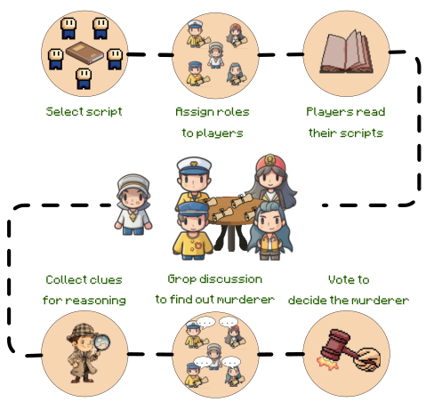
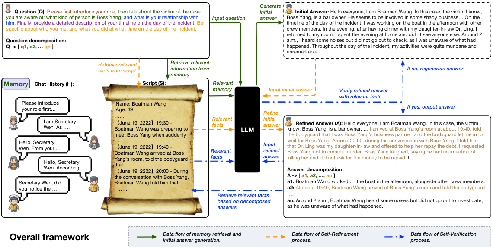
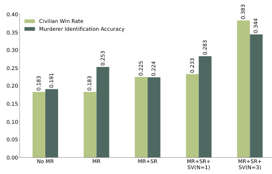
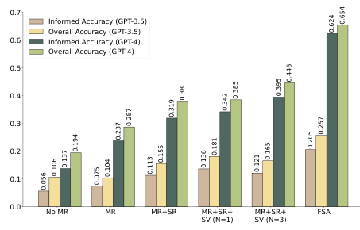

# Deciphering Digital Detectives: Understanding LLM Behaviors and Capabilities in Multi-Agent Mystery Games

> **来源与完成范围**：依据 ACL Findings 2024 本地 PDF，正文 PDF pp.1–9（印刷页 8225–8233）§1–§8 Conclusion；补充 p.10 Limitations 和 Appendix A/B 对角色说谎规则、人工评价、模型使用方式的必要说明。四幅正文原图均内嵌，表与柱图数值经原文核对。论文系统名为 **ThinkThrice（三思）**。

## 核心问题：信息没收集到，和有信息却不会推理，要分开测

剧本杀中的每个角色只读自己的剧本，必须通过问答收集其他人的时间线和线索，最后识别凶手。平民需要合作，凶手可以策略性隐瞒，信息来源和行动目标并不统一。因此，最终投票正确率同时混合了交流质量、记忆、信息获取、推理和对手策略。（Abstract；§1）

论文提出三件互相配合的工作：收集 1,115 个中文剧本杀实例；构建由语言模型自主扮演玩家的游戏框架；把评测拆成事实问题、需要跨角色证据的推断问题和最终胜负。ThinkThrice 在回答前检索历史，补全遗漏细节，再验证是否忠实于角色剧本。实验支持这些步骤能改善信息交流；但实际评测只用四个较小剧本，不能把 1,115 个收集实例误写为 1,115 个完成实验的游戏。

**原图 1，PDF p.1；中文图注**：玩家阅读不同角色视角，通过线索和集体讨论拼出案件，最后投票决定凶手。该图说明任务中存在信息不对称；相同故事里，不同 agent 的初始证据和可用记忆不同。

## 1 Introduction：为什么剧本杀是有价值的 agent 任务

狼人杀、Avalon 等游戏已有 LLM agent 研究，但剧本杀通常包含更丰富的故事、人物关系和具体时间线，不能只依赖固定身份规则。模型要读长脚本、理解自己的角色目标、与其他角色多轮对话，并从相互冲突或不完整的信息中推理。（PDF pp.1–2）

作者指出胜率不足以解释失败。如果平民没有问出关键时间，错误投票不一定是逻辑推理能力差；如果已经掌握证据却连错因果，单看话说得像不像人也无济于事。因此需要观察中间信息状态，而不仅是最后一票。

四项贡献依次为中文数据资源、多 agent 游戏框架、信息获取和推理的评估方法、以及改善交流质量的提示模块。论文并未声称解决一般多 agent 协作，也没有对真实人类玩家建立人机胜负排行榜。

## 2 Related Work：与已有游戏及 agent 评测的差异

互动角色游戏既可作为单人任务完成环境，也可承载合作与对抗。本文聚焦多人之间的语言交流：agent 的行动主要是提问、回答和投票，而不是在物理环境中移动。相比相对固定的狼人杀/Avalon 故事框架，剧本杀每个剧本的人物、关系、动机和线索可不同。（PDF pp.2–3）

已有 agent 使用记忆、反思或推理提示，本工作把这些方法组合到剧本杀中。新意并非三个模块分别都是新算法，而是把信息交流的完整性与真实性作为明确目标，并使用能分别检验事实和推断的题目观察它们的作用。

## 3 Jubensha Dataset：资源规模与实验子集

收集的 1,115 个实例来自中文在线来源，包含主持手册、上帝视角复盘、线索、角色剧本等异质文件，格式包括 PDF、JPG、DOCX。作者用 OCR 等工具转换为统一 Markdown，再用 GPT 整理为可自动启动游戏的 JSON。（PDF pp.3–4）

| 数据特征 | 原文统计 |
|---|---:|
| 总剧本实例 / 含文本实例 | 1,115 / 1,115 |
| 包含图片 | 643 |
| 包含音频 | 392 |
| 包含视频 | 172 |
| 玩家数：最少 / 最多 / 平均 | 1 / 20 / 6.52 |
| 每个游戏总 tokens：最少 / 最多 / 平均 | 4k / 518k / 129k |

**来源：Tables 1–2，PDF p.3。** 模态数量可重叠，不能把四列相加当作实例总数；129k 是游戏整体材料规模，不能直接解释为每名玩家实际收到的上下文。本文实验仅处理文本模态，未证明系统能综合音视频线索。

游戏流程为选剧本、分配身份、读个人脚本、获得线索、若干轮讨论、匿名投票。真实凶手获得最多票则平民胜，否则凶手胜。正文实验选取四个 4 或 5 人剧本；数据集中更大玩家数、更长文本、多模态和多结局内容主要为未来研究准备。

表 3 将剧本杀与狼人杀、Avalon 的对抗、合作、故事丰富度、人物多样性和关系复杂性作定性比较。其意义是说明评测对象包含叙事理解压力，不是用实测数字证明剧本杀在所有维度都更难。

## 4 The ThinkThrice Framework：先记住，再补足，再核验

每个 LLM agent 扮演一名玩家，始终拥有自己的角色脚本。另有非玩家主持人，其问题与指令预设，用于保证游戏按既定流程进行；主持人不是又一个开放式规划 agent。系统按回合顺序行动，同一时刻只有一个角色发言，设有限回合模拟实际游戏时间约束。（PDF p.4）

**原图 2，PDF p.5；中文图注与读图**：绿色表示历史检索与初稿，橙色表示按问题拆解查个人脚本并补全内容，蓝色表示把答案拆成事实核查。右侧示例中，初稿含含糊的“晚上回房间”等内容，修订后补入 19:40、20:00 及具体接触对象。图展示的是让有限轮次中的交流更有效，而不是简单让答案更长。

### Memory Retrieval（MR）：独立保存各角色看到的历史

每个 agent 的所有观察写入其专属向量库，用 OpenAI embedding 表示；新事件需要回应时，Faiss 检索相似度最高的五条历史，拼入本次提示。不同角色的记忆库分开，避免直接给每个人上帝视角。（PDF p.4）

MR 主要保存游戏开始后的交流，个人剧本一直可用。因此 No MR 条件不是“什么都不知道”，而是缺少可持续取回的交流历史。这解释了后面 Own Q 约 0.77、Other’s Q 低得多的模式。向量相似度只是找回相关文本，没有保证对方说的内容为真，也不等于按证据可信度排序。

### Self-Refinement（SR）：按问题查找遗漏信息

先产生初始回答，再将对方问题 $Q$ 拆成子问题 $q_1,\ldots,q_n$；从自己的角色脚本 $S$ 检索能回答各子问题的事实，逐一检查是否已经包含，遗漏则加入修订答案。目标是在回合有限时提高信息覆盖率。（PDF p.4）

这与某些用于隐藏信息的 self-refinement 目的不同。本文希望非凶手能更完整地交流案件信息；但游戏规则又允许凶手隐瞒和策略性说谎，因此“尽量提供更多信息”必须放在角色权限和目标下理解。不能推导出所有角色都被强制诚实公开完整剧本。

### Self-Verification（SV）：防止补全时编造细节

把修订答案 $A$ 拆成事实 $a_1,\ldots,a_n$，与角色脚本逐项核对。真实性门槛同时考虑真实事实数量和正确比例，未达标则重新生成，最多尝试 $N$ 次。系统为历次答案按真实性和字数评分，保存最好版本，所以最后一次若更差不会覆盖较好答案。（PDF p.5）

附录 G（PDF p.21，印刷页 8245）给出实际门槛：主持人提问要求正确比例至少 0.7、纠正事实至少 4 条、回答至少 350 words；其他玩家提问分别为 0.6、1 条、30 words。原文以 words 称长度单位，尽管游戏主体为中文；复现时还需检查实现的分词/计数口径。历次答案评分为：

$$
\mathrm{Score}=\mathrm{Accuracy}+N_{\mathrm{corrected}}+N_{\mathrm{time\ matched}}+\frac{L_{\mathrm{response}}}{200}.
$$

$N_{\mathrm{time\ matched}}$ 是包含明确时间参照、通过正则匹配计数的纠正事实，$L$ 为回答长度。该分数明确奖励更多细节、时间信息和更长答案，所以“交流信息增加”与输出预算增加并不独立。它是任务专门的提示评分和停止规则，并非经理论证明的验证器；自验证仍可能漏检或误判，不能保证最终内容全部真实。

Appendix A 说明人工真实性评价会区分合法策略性说谎与幻觉：凶手对其他玩家无法核实、且符合隐藏身份目的的私有信息进行隐瞒/改写，不直接按普通虚构扣分；涉及其他玩家、与可检验证据冲突的内容则不同。于是“真实性”是**受游戏角色规则约束的忠实性**，不能直接照搬为真实世界事实核查指标。

## 5 Evaluating LLM-Based Agents：事实覆盖与证据推理

### Factual Question Answering

作者用 GPT 为四个实验剧本生成共 720 个事实题，答案可在某一角色脚本中直接找到。例如“张大副的兄弟为谁工作”或“凌医生何时见到张大副”，同时保存来源语句。对于某个 agent，Own Q 来源于自己的脚本，Other’s Q 来源于不可直接访问的其他脚本；后者进一步分其他平民（CQ）和凶手（MQ）。（PDF pp.5–6，Table 4）

这种划分把信息获取压力显式化：Own Q 更多检查本来就有的信息能否取用，Other’s Q 检查交流是否让它补齐别人的故事。答对也可能受语言模型先验或猜测影响，所以还需要对来源和推理进行进一步分析。

### Inferential Question Answering

作者人工构造 56 道推断题，要求组合不同角色脚本中的前提。例如凌医生在 23:00 准备进入通风管，听到咚声；文秘书同一时间从通风管返回，二者结合才支持声音来自文秘书。（PDF p.6，Table 5）

问题保存正确答案和推理依据（rationale），因此可区分“答案碰巧对”与“答对且依据正确”。这不是把长解释自动当作好推理：错误时间、无关动机或未经证实的唯一性假设，即使最后指向正确人物，仍不足以支持可靠推断。

## 6 Experiment：哪些模块改善了什么

### 6.1 Utilization of LLMs in Game Stages

所有使用的 GPT 模型 temperature 设为 0.8。附录 B 说明游戏交互主要采用 `gpt-3.5-turbo-16k-0613`，记忆 embedding 为 `text-embedding-ada-002`；后续推断比较使用 GPT-3.5 与 `gpt-4-1106-preview`，部分题目生成使用 `gpt-4-0613`。因此 Figure 4 的 GPT-4 曲线**不意味着全部游戏由 GPT-4 玩家重新玩过**。（PDF p.6；Appendix B）

每种框架每个剧本运行三次，对高度随机的投票阶段又做十次无额外记忆的投票，汇总准确率与胜率。作者在 Limitations 中承认重复次数仍受预算限制，结果有随机波动；没有完整误差条和大规模统计检验，不能把每个小数差都写成可靠提升。

### 6.2 Factual Questions：最大的变化发生在别人的信息

| 架构 | Own Q | 其他平民 CQ | 凶手 MQ | Other’s Q 平均 |
|---|---:|---:|---:|---:|
| No MR | 0.770 | 0.300 | 0.321 | 0.305 |
| MR | 0.759 | 0.409 | 0.380 | 0.402 |
| MR+SR | 0.757 | 0.467 | 0.487 | 0.471 |
| MR+SR+SV，$N=1$ | 0.768 | 0.485 | 0.518 | 0.492 |
| MR+SR+SV，$N=3$ | 0.772 | 0.495 | 0.514 | 0.498 |

**来源：Table 6，PDF p.6。** Own Q 在 0.757–0.772 间小幅波动，因为个人脚本始终可见。Other’s Q 从 0.305 到 0.498，提高 19.3 个百分点；MR 本身贡献从 0.305 到 0.402，SR 再到 0.471，SV 的增量较小。这更像“记忆加更完整、更可信的交流”，不是通用智力突然提高。

并非所有子项随模块单调上升：MQ 的 $N=1$ 为 0.518，$N=3$ 为 0.514。Own Q 也没有稳定递增。完整框架的平均值最佳，但不能声称每种角色、每种问题都受益同样多。

### 6.3 Similarities Between Chat Histories and Scripts

作者把所有角色脚本拼成一篇文档、全部聊天记录拼成另一篇，分别计算 embedding cosine、TF-IDF cosine 和 trigram Jaccard。超出 embedding 输入限制时按不重叠块编码，再平均为文档向量。（PDF p.7）

| 架构 | Embedding cosine | TF-IDF cosine | Trigram Jaccard |
|---|---:|---:|---:|
| No MR | 0.062 | 0.000 | 0.000 |
| MR | 0.798 | 0.578 | 0.027 |
| MR+SR | 0.820 | 0.645 | 0.064 |
| MR+SR+SV，$N=1$ | 0.825 | 0.668 | 0.075 |
| MR+SR+SV，$N=3$ | 0.831 | 0.670 | 0.077 |

**来源：Table 7，PDF p.6。** 结果与更充分的信息交流一致，但相似度高不等于关键线索一定正确，也可能部分来自更多文本覆盖。No MR 的定义和历史保留方式会直接影响这一指标，因此不要把 0.062→0.831 单独当作推理能力提升。

### 6.4 Civilian Win Rate and Murderer Identification

**原图 3，PDF p.7；中文图注**：图例中 Civilian Win Rate 是以整局为单位的平民胜率；Murderer Identification Accuracy 是全部投票中投中凶手的比例。前者需要正确票形成最多票，后者统计每一票，二者不是同一指标。

| 架构 | 平民胜率 | 凶手识别准确率 |
|---|---:|---:|
| No MR | 0.183 | 0.191 |
| MR | 0.183 | 0.253 |
| MR+SR | 0.225 | 0.224 |
| MR+SR+SV，$N=1$ | 0.233 | 0.283 |
| MR+SR+SV，$N=3$ | 0.383 | 0.344 |

完整框架最高，但中间阶段并不单调：MR 到 MR+SR 时识别准确率从 0.253 降到 0.224，胜率却提高。这可能与集体投票分布、相互影响和随机性有关。结果支持端到端收益，却不能只凭这张图精确归因每个模块的独立因果效果。

### 6.5 Inferential Questions：有证据和用好证据的双重瓶颈

Overall Accuracy 只要求最终答案正确；Informed Accuracy 同时要求答案和推理依据正确。FSA（Full Script Access）允许直接看到所有角色完整脚本，作为信息充分的参考条件。（PDF pp.7–8）

**原图 4，PDF p.8；中文图注**：同一架构下，GPT-4 通常比 GPT-3.5 更能使用已有信息；FSA 则显示信息获取不足造成的剩余差距。它同时包含模型能力与信息条件两个轴，阅读时不要只看最高柱。

| 信息/架构 | GPT-3.5 Informed | GPT-3.5 Overall | GPT-4 Informed | GPT-4 Overall |
|---|---:|---:|---:|---:|
| No MR | 0.056 | 0.106 | 0.137 | 0.194 |
| MR | 0.075 | 0.104 | 0.237 | 0.287 |
| MR+SR | 0.113 | 0.155 | 0.319 | 0.380 |
| MR+SR+SV，$N=1$ | 0.136 | 0.181 | 0.342 | 0.385 |
| MR+SR+SV，$N=3$ | 0.121 | 0.165 | 0.395 | 0.446 |
| FSA | 0.205 | 0.257 | 0.624 | 0.654 |

**按 Figure 4 标注转录。** GPT-4 在完整框架下 Informed 为 0.395，获得所有脚本后为 0.624，说明交流后仍缺失重要线索；而 GPT-3.5 即使 FSA 也只有 0.205，说明信息齐全仍不够。另一个不能忽略的反例是 GPT-3.5 在 SV 三次时比一次更差，多一轮验证不必然提高最终推断。

**Table 8 的定性例子**进一步说明证据质量差别。No MR 引用丢钥匙、人物动机等无关前提，最后猜到文秘书；MR 找到部分时间线，却引入“只有她知道计划”等未证实假设；完整框架知道她进过通风管，结论合理但缺准确时刻；FSA 能同时给出凌医生 23:00 听到声音、文秘书 23:00 返回的两条明确前提，论证最扎实。表中的 GPT 评分有时给“合理但不完整”和“充分依据”同分，提醒我们标量裁判不能替代检查具体证据。

## 7 Future Work：论文还没做的部分

作者提出扩大实际评测剧本数、自动构造推断题、加入更多微观策略指标，以及评估多模态和多结局的复杂剧本。（PDF p.8）当前工作更偏宏观信息收集、案件理解和最终推理，没有细致测量每一次提问的价值、欺骗成功机制、可信来源判断或信息传播路径。

自动推断题可以降低人工成本，但需要保证问题真要跨来源推理，避免仅复述复盘答案；多模态扩展也不能只在文字描述里加图片名。以上是作者给出的未来方向，不是数据包含相应材料就表示已完成实验。

## 8 Conclusion 与局限

论文建立了一个中文叙事驱动、含合作对抗和信息不对称的 agent 测试环境。ThinkThrice 在固定回合里通过历史检索、答案补全和核验改善了多数平均指标；更关键的是其评测把“知道哪些信息”与“能否依据这些信息推理”分开，使失败原因更可诊断。（PDF p.9）

边界包括：1,115 个收集实例但仅四个实验剧本；文本模态、中文环境；GPT 参与生成、玩家和裁判造成潜在共同偏差；有限重复与高随机性；模块带来额外调用成本；自核验不能保证真值；角色合法隐瞒使真实性指标有任务专门定义。（PDF p.10；Appendices A/B/D）不能把此结果概括为在全部数据集、多模态场景或真实人类对抗中均已验证。

## 对当前叙事记忆研究的启发（阅读者推论）

最可复用的是评价分层：个人已知事实、其他角色事实、组合前提推断、最终行动结果。若只测最终答题，无法知道失败来自记忆缺失、对话没有问到、错误来源污染还是推理本身。FSA 参考条件尤其适合衡量信息获取造成的差距，但它属于上界条件，不应与受限角色 agent 当作等价部署方案。

若为剧本或角色模拟设计记忆，应保留陈述来源、时间、可观察者和可信度，把“角色说了什么”“客观发生什么”“系统推断什么”分开。本文专属向量库部分保持了观察边界，却没有完整实现这些类型。也应把“增加交流字数”与“增加关键证据覆盖”分开计量，并报告每轮检索、修订、验证的 token 成本，避免通过更多调用获得的收益被误称为免费能力提升。
