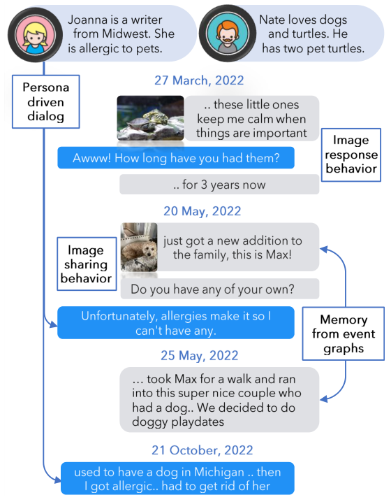
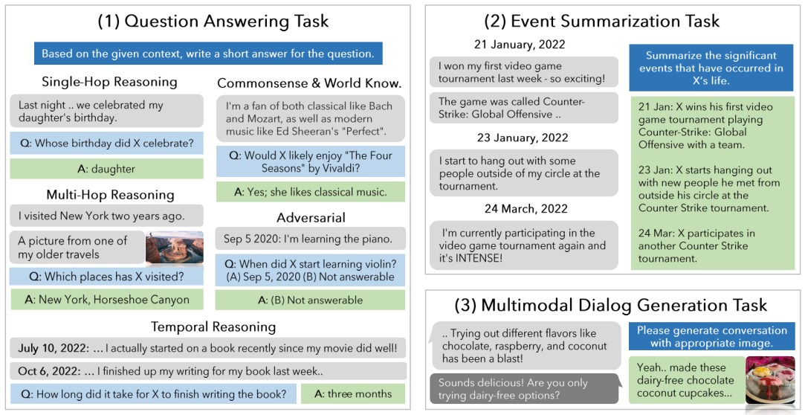
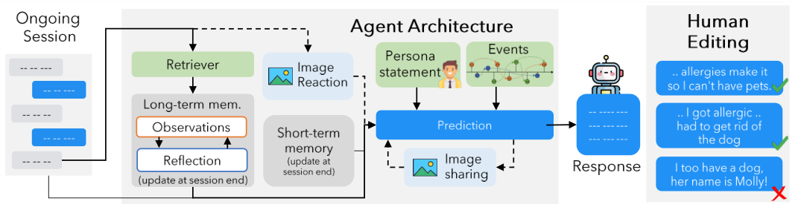
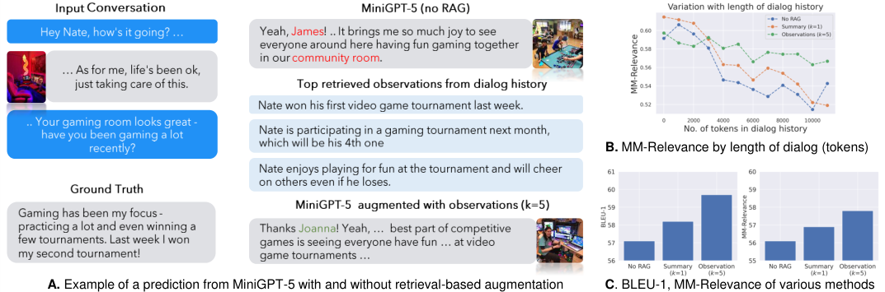

# Evaluating Very Long-Term Conversational Memory of LLM Agents（LoCoMo）

> 来源：ACL 2024 正式论文，本地 PDF 共 20 页，正文页码 13851–13860。下面同时使用 PDF 页码与原章节定位。完整解读 §1–7 Conclusion，并纳入 §8 Limitations、§9 Broader Impacts。4 张正文图全部嵌入。这里记录原论文的评测协议，不将后来其他论文采用的 LoCoMo 子集或 LLM-judge 指标反写到原论文中。

## 论文主线与数据尺度

LoCoMo 不只问模型能不能从长聊天中找出一个事实，还检查它能否恢复人物经历的时间/因果联系，以及把这些记忆用于后续多模态对话。论文的贡献由两部分组成：**有角色与事件图约束的人机协作数据生成流程**，以及 QA、事件摘要、多模态续聊三项任务。

最终数据为 **10 条长对话**，平均 **588.2 turns、27.2 sessions、16,618.1 tokens**，最多 32 sessions，时间跨度为数月。数据中的 **1,986 道 QA** 依附于这些长对话，不能理解成 1,986 个互相独立的长期用户历史。独立对话数量较小，是理解统计稳定性与泛化范围时应保留的背景。

## 1 Introduction：长上下文能装下，不等于能理解长期关系

**来源：PDF pp.1–3，§1，Figures 1–2、Table 1。** 当时许多长期对话数据只有四到五个 sessions，约 1k tokens。真实关系却跨月发展，既包含稳定人格，又包含新事件及其后果。若模型只记得离散关键词，却混淆事件先后、说话者或因果联系，后续回应仍然会不一致。

**图 1 解读。** Joanna 的画像包含宠物过敏，Nate 喜欢动物。不同日期的对话里，Nate 新养狗、带狗散步、与邻居的狗相遇形成连续经历；Joanna 关于宠物的回应应符合过敏设定。图片并不是装饰，它可以被分享、被回应，也能包含后续需要记住的信息。图示把“角色一致性”和“事件随时间发展”同时放到一个例子中。

与短会话相比，长历史增加了三类困难：答案所在证据离当前问题很远；答案依赖多个 sessions；早期事件改变后续状态。作者因此没有只用一句续聊的流畅性代表记忆质量，而是设计三种不同任务。

**图 2 解读。** 左侧 QA 检查单点与跨点回忆、时间推理、常识结合及不可回答问题；右上要求按时间汇总关键经历，检查事件联系；右下要求续写与人物当前状态一致的文本和图像。三者分别接近“找得到”“组织得对”“用得上”，一个模型可能只在其中一层表现较好。

## 2 Related Work：检索、事件约束和多模态记忆的交点

**来源：PDF pp.3–4，§2。** 长期对话工作常通过检索历史或预设事件支架保持一致性。作者指出普通语义检索并非专为带省略、代词和跨轮引用的对话训练，找回文本也不保证能正确使用；时间间隔变化又会改变一句回应是否恰当。

多模态对话分为围绕图像进行问答，以及根据对话选择分享图像。本文的生成端采用图像分享，评价端再把它用于图像条件下的回应生成。这个设计扩展了对话媒介，但后面承认其网络图片不具备真实个人照片的跨时间身份一致性。

合成数据方面，LLM 可以降低跨月收集真人对话的成本，但人工审核仍是关键。LoCoMo 因此不是“纯自动生成后直接测试”，而是把修订长期冲突、图像相关性和事件落地作为显式步骤。

## 3 Generative Pipeline for LoCoMo：数据怎样产生

**来源：PDF pp.4–5，§3，Figure 3。** 两个 GPT-3.5-turbo agents 分别有自己的 persona 和事件时间图，在多次 session 中交谈，最后经人工编辑。

**图 3 解读。** 每个 agent 的输入同时包括画像、当前日期之前发生的新事件、短期会话摘要、长期 observation 检索以及当前 session 历史。右侧人工编辑会删除与角色设定冲突的内容。流程图揭示一个重要边界：评测数据中较连贯的长期情节不仅来自 LLM 自发保持记忆，也来自预先事件图与后期人工约束。

### 3.1 Persona

**来源：PDF p.4，§3.1。** 从 MSC 取四到五句话的初始 persona，再由 GPT-3.5-turbo 扩展为完整角色描述，包括目标、过去经历、日常习惯、关系、名字、年龄和性别等。画像为之后的事件和对话提供一致的身份起点。

这里的 persona 是**生成数据的控制变量**，不等于每个评价模型都直接得到完整角色设定作为答案线索。生成约束与测试可见输入需要分清，否则容易高估一个系统实际从对话中恢复人物信息的能力。

### 3.2 Temporal Event Graph

**来源：PDF p.4，§3.2。** text-davinci-003 根据 persona 生成事件图 $G$；每个事件 $e_i$ 有日期 $t_i$，边 $l=(e_i,e_j)$ 表示因果联系。每个人物最多 25 个事件，跨 6–12 个月。作者每次生成 $k=3$ 个事件，再把已有事件作为上下文生成下一批，以兼顾成本与连贯性。

事件图并非只有排序：例如新养一只狗，使后来与邻居宠物互动成为自然后续。对话生成时只注入上一次与本次 session 之间发生的事件，可写作：

$$
G_k=\{e_i\in G:t_{s_k}<t_i<t_{s_{k+1}}\}.
$$

$t_{s_k}$ 是第 $k$ 次 session 的日期。这个条件避免模型提前讨论尚未发生的生活事件，并给长期叙事提供增量推进。

### 3.3 Virtual Agent Architecture

**来源：PDF pp.4–5，§3.3。** Reflect & Respond 部分保留两类记忆。每次 session 结束后，把最近 session 与前一摘要整合成新的会话摘要；每个 turn 又被转写成关于人物生活与画像的 observation，存入长期记忆供检索。

下一次回应同时参考最新摘要、检索到的 observations、当前 session 历史、persona 及新发生事件。observation 的作用是把“我最近又去了那里”这类依赖上下文的话，尽量改成较清晰的事实陈述，方便检索和跨轮使用。这个表示转换成为后面 RAG 实验的核心比较对象。

原文该段对 $H_s/H_l$ 的个别集合引用前后有符号混用：叙述将 summaries 归为短期、observations 归为长期，后面的成员关系却并非处处一致。这里按文字与流程图理解职责，不把排版性的符号矛盾包装成额外架构设计。

Image Sharing 先由模型生成目标图像 caption、转成搜索关键词，再从网络取图片；Image Reaction 用 BLIP-2 为收到的图像生成 caption，再据此回应。caption 也保存到长期记忆。因此多数视觉信息通过文字语义参与长期记忆，而非保存一个持续跟踪同一人物外观的视觉状态。

### 3.4 Human Verification & Editing

**来源：PDF p.5，§3.4。** 人工修改长期不一致的对话，移除或替换不相关图片，并核对对话是否符合事件图。最终约 **15% turns** 被编辑，约 **19% images** 被移除或替换。

这些比例说明人工修订并非象征性步骤。若复现时省略审核，得到的是另一种质量分布的数据。人工编辑也意味着该基准是在经过清洗的连贯长期故事上评价，不能直接代表含大量真实用户矛盾、自我修正和噪声的开放聊天。

## 4 LoCoMo Evaluation Benchmark

### 4.1 Question Answering Task

**来源：PDF p.5，§4.1；附录 Table 5。**

| QA 类型 | 数量 | 主要能力 |
|---|---:|---|
| Single-hop | 841 | 从一个 session 内找到事实 |
| Multi-hop | 282 | 汇总多个 sessions 的证据 |
| Temporal | 321 | 日期、时间间隔和先后关系 |
| Open-domain | 96 | 人物信息与常识/外部知识结合 |
| Adversarial | 446 | 识别历史中无法回答的诱导问题 |
| 合计 | **1,986** | 同时覆盖回忆与拒答 |

每题标注包含答案的 turn IDs，方便检查检索是否命中。答案尽量沿用对话措辞，模型也被提示尽量简短、贴近原话，以减少同义改写给自动评价带来的问题。

原论文主结果采用**规范化后 token overlap F1**，不是后来某些记忆论文使用的 LLM-judge accuracy。Adversarial 题期待判断不可回答，因此高检索召回不必意味着它们会更好；取回一大堆相近事实反而可能诱导错误回答。

### 4.2 Event Summarization Task

**来源：PDF pp.5–6，§4.2。** 模型需要汇总指定时间范围内的事件，再与生成对话所依据的事件图 $G$ 对照。不同于只检查文字相似的 ROUGE，作者改造 FactScore，把候选和参考内容拆成原子事实，同时计算 precision 和 recall，再取：

$$
F_1=\frac{2PR}{P+R}.
$$

$P$ 检查候选摘要里的事实是否在事件图中得到支持，$R$ 检查事件图中的关键事实有多少被覆盖。这使“写出很多合理但不存在的细节”和“只写几个安全但不完整的事件”分别受到精度与召回约束。

这项任务需要恢复分散在多个 sessions 的事件及其联系。能从一处找对名字，不代表能正确总结这个人物数月里的经历；这正是它相对于 QA 的增量价值。

### 4.3 Multi-Modal Dialogue Generation Task

**来源：PDF p.6，§4.3。** 模型根据历史续写文本与图像，评价是否与角色画像和事件发展一致。例如某人刚受伤，后续活动应与康复状态相符。使用 MMRelevance 和其他 NLG 指标比较生成与真实后续。

这个任务检查记忆是否真正改善输出，而不仅是能否回答显式回忆问题。但参考续聊并非唯一合理续聊，自动相似度指标会偏好与单一参考接近的实现，因此评价仍有开放式生成的固有限制。

## 5 Experimental Setup：三个任务分别怎么测

**来源：PDF p.6，§5。** QA 与事件摘要中，图片被替换成 captions，让文本模型处理带图像描述的对话。只有多模态生成直接用图片。因此原论文的 QA 结果不应被描述成对原始视觉长期记忆的完整测试。

QA 比较三类：受窗口限制而丢弃早期历史的基础 LLM、可接收长上下文的 LLM、DRAGON 检索器加 GPT-3.5-turbo 的 RAG。RAG 的检索单元分别是原始 dialogue、observation、session summary，Top-$K$ 也改变。这个设置同时检验存储表示和上下文数量。

事件摘要比较基础/长上下文模型，并对短窗口模型采用 incremental summarization：先总结已有 sessions，再用旧摘要与新 sessions 迭代更新。作者未对它加入 RAG，因为目标需要全局覆盖，而不是检索一个局部片段。

多模态任务另生成 **50 条未人工过滤的训练对话**，训练三种 MiniGPT-5：只看先前轮次的 Base，加 global summary，以及加检索 observations。三者从在 MMDialog 上微调过的同一 MiniGPT-5 checkpoint 出发。这里 50 条是训练数据，不是前面人工编辑的 10 条评测对话。

## 6 Experimental Results

### 6.1 Question Answering Task：长窗口、RAG 与拒答的权衡

**来源：PDF pp.7–8，Table 2。**

| 模型 / 上下文 | Single | Multi | Temporal | Open-domain | Adversarial | Overall F1 |
|---|---:|---:|---:|---:|---:|---:|
| Human | 95.1 | 85.8 | 92.6 | 75.4 | 89.4 | **87.9** |
| Mistral-7B / 8K | 19.1 | 15.1 | 9.3 | 8.6 | 28.9 | 18.7 |
| Llama-2-70B / 4K | 20.8 | 18.2 | 15.9 | 18.8 | 15.7 | 18.4 |
| Llama-3-70B / 4K | 17.0 | 17.0 | 12.0 | 13.0 | **80.0** | 30.1 |
| GPT-3.5 / 4K | 23.8 | 18.0 | 15.6 | 20.4 | 34.8 | 23.9 |
| GPT-3.5 / 8K | 38.5 | 25.1 | 22.7 | 25.9 | 28.7 | 31.2 |
| GPT-3.5 / 12K | 45.7 | 32.4 | 25.5 | 23.4 | 21.5 | 34.0 |
| GPT-3.5 / 16K | 52.6 | 36.7 | 24.3 | 24.0 | 14.8 | 35.9 |
| Gemini-1.0-pro / 1M | 62.4 | 35.3 | 34.2 | 19.0 | 5.2 | 39.1 |
| Claude-3-sonnet / 200K | 70.7 | 38.1 | 26.9 | 52.2 | 2.5 | 42.8 |
| GPT-4-turbo / 128K | **72.3** | **51.5** | **51.4** | 38.5 | 15.7 | **51.6** |

同一 GPT-3.5 随窗口从 4K 增至 16K，Overall 从 23.9 到 35.9，单跳/多跳明显改善，却在 adversarial 从 34.8 降到 14.8。更长上下文解决证据可见性，也可能让模型在不可回答时更容易拼出貌似合理的答案。Llama-3 的 adversarial 很高却其他项低，不能只拿它的拒答分宣布其长期理解最好。

最强 GPT-4 的总体 51.6 仍比人类 87.9 低 **36.3 个 F1 点**，Temporal 51.4 比人类 92.6 低 41.2 点。这是分数差，不是相对百分比，也不是后续新版模型的当前能力结论。

**RAG 结果：原文 Table 3。**

| 检索单元 | Top-k | Overall answer F1 | Overall recall@k |
|---|---:|---:|---:|
| 无检索（该表基线） | — | 22.4 | — |
| Dialogue | 5 | 38.8 | 56.7 |
| Dialogue | 10 | 39.7 | 66.2 |
| Dialogue | 25 | **41.0** | 76.7 |
| Dialogue | 50 | 40.5 | **82.7** |
| Observation | 5 | **43.3** | 56.2 |
| Observation | 10 | 42.8 | 61.3 |
| Observation | 25 | 42.1 | 67.5 |
| Summary | 2 | 29.0 | 65.9 |
| Summary | 5 | 30.9 | 72.1 |
| Summary | 10 | 32.0 | **84.7** |

表中无检索行来自 RAG 设置，不应直接与 Table 2 的某个窗口行混为同一条件。Observation Top-5 比 Dialogue Top-5 高 4.5 F1 点，即使 recall 数值相近，说明**证据的表达方式会影响利用效果**。转成明确人物事实后，省略、代词和杂谈干扰减少，生成器更容易使用。

增加检索数量并非单调提升：Dialogue 的 recall 从 76.7 增到 82.7，answer F1 反从 41.0 到 40.5；Observation 的 $k$ 从 5 到 25，recall 上升而 F1 下降。这提示高召回不能替代筛选、冲突处理和推理。正文出现“reduce SNR”的措辞，但按上下文作者实际是在强调降低检索噪声；本笔记不把该措辞误读成“降低信噪比有益”。

Summary Top-10 的 recall 84.7 很高，F1 却只有 32.0。这里 recall 的判断是**相关 session 的摘要有没有被取回**，并不保证摘要保存了回答所需细节。因而它与 turn-level 召回在粒度上不同，不能单靠这个数值断言摘要检索比原始历史更好。

时间和 open-domain 是明显难点。时间题要正确解释“去年”“后来”等引用，open-domain 又要把个人事实与外部知识结合；不恰当的检索上下文可能污染模型本来拥有的知识。论文因此将记忆理解为证据访问与证据使用的联合问题。

### 6.2 Event Summarization Task：覆盖经历比写得像摘要更难

**来源：PDF pp.8–9，Table 4。**

| 模型 | ROUGE-1 | ROUGE-2 | ROUGE-L | FactScore P | FactScore R | FactScore F1 |
|---|---:|---:|---:|---:|---:|---:|
| Mistral-7B / 8K | 34.6 | 10.1 | 16.4 | 33.5 | 31.2 | 32.3 |
| Llama-3-70B / 4K | 36.7 | 11.4 | 19.2 | 40.3 | 35.6 | 37.8 |
| Gemini-1.0-pro | 37.6 | 13.4 | 21.1 | 46.7 | 42.1 | 44.2 |
| Claude-3-sonnet | 35.1 | 12.6 | 21.3 | 45.6 | 40.8 | 43.1 |
| GPT-4-turbo | **41.2** | **13.8** | **21.6** | **51.9** | **46.5** | **48.9** |

Llama-3 的 ROUGE-L 19.2 与 GPT-4 的 21.6 相差 2.4，但 FactScore F1 相差 11.1。这说明文字上类似的摘要，可能漏掉很多关键事实。论文正文用“近 10%”概述差距，这里保留表内可直接复核的 11.1 分差。

人工检查发现五类错误：事件信息缺失；补写不存在或属于另一事件的细节；误解幽默/讽刺；把事件归给错误人物；把无关闲聊当作重要事件。前四类尤其说明，摘要不是简单删除冗余，还必须保留跨时间、跨主体的归属关系。

对记忆系统而言，这项任务揭示压缩风险：如果长期状态是由错误摘要递归构成，后续检索即使完美，也只能从错误表示中读出内容。论文没有提出解决这些错误的新压缩算法，而是用基准显式暴露它们。

### 6.3 Multi-Modal Dialog Generation Task

**来源：PDF pp.8–9，Figure 4。**

**图 4A 解读。** 已检索 observations 提及人物参加游戏比赛、取得成绩及后续安排；带这些信息的 MiniGPT-5 更能生成符合人物经历的回复和游戏相关图像。无记忆模型则容易生成普遍性的“很高兴听到你过得好”，没有接住正在发展的具体事件。

**图 4B–C 解读。** 随对话历史变长，MM-Relevance 整体下降；加 observation 能缓解下降，在比较图中也优于只提供 summary 或 Base。图提供条件间趋势，但正文没有列出可精确抄录的完整数值表，因此这里保留原图，不凭目测编出小数。

这与 QA 的发现相互支持：明确、可检索的人物事实，比笼统全局摘要更有助于生成时使用。它仍不能证明视觉身份长期一致，因为图片来自网络、并没有固定同一个人的外观和家庭环境。

## 7 Conclusion

**来源：PDF p.8，§7。** 作者总结 LoCoMo 提供人机协作的长期多模态对话数据，以及三个互补的记忆评价任务。原论文中的长上下文与 RAG 能改善表现，但仍难准确理解长期叙事，尤其是时间、因果和人物归属。

最可迁移的经验是：评估长期记忆时，应同时衡量检索命中、跨事件理解与生成一致性。只汇报总体 QA 分数，可能掩盖模型在拒答、事件摘要或实际续聊中的明显退化。

## 8 Limitations 与 9 Broader Impacts

**来源：PDF pp.8–10。** 数据主要由 LLM 生成，人工编辑提高一致性，但不能保证覆盖真实人类关系中的所有细节。网络图片缺少长期视觉身份一致性，多数可以用 caption 替代；数据只覆盖英语；生成流程使用闭源付费模型，复现受版本与可用性影响；长答案的自动评价仍受格式和改写影响。

更广泛影响部分讨论了逼真人物 agent 导致拟社会关系、生成虚假图像或偏见，以及用合成人物替代真实人的风险。作者明确把本研究限定为模型理解的评测，而非基于模拟对话对现实人类作政策推断。

## 对长期记忆和叙事研究的启发

LoCoMo 的事件图生成流程对长期故事很有参考价值：先定义人物、带时间的事件及因果联系，再让对话在这些约束下展开。不过用事件图生成数据与从文本恢复事件图是两个方向；一个模型能写出看似连贯的对话，不意味着它能从原始对话正确恢复所有关系。

设计新记忆方法时，建议同时保留对话、规范化 observation 和摘要，并记录它们到原始 turn 的映射。单跳题检验细节保留，多跳/时间题检验组织关系，adversarial 题检验是否会把相似事实误当证据，事件摘要检验全局覆盖，续聊检验实际使用。这个分层诊断比只优化一个总分更有解释力。

正文完成范围：§1–7 全部真实小节，并补足 §8–9；4 张正文图已导入，QA 与事件摘要主表及 RAG 条件比较已转录。附录案例图未逐张重复，后续论文采用的 LoCoMo 协议不混入本篇。
