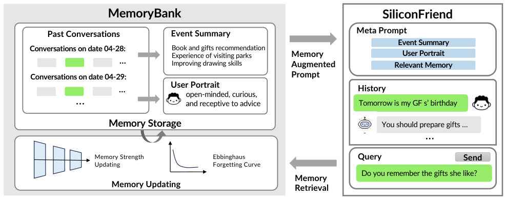
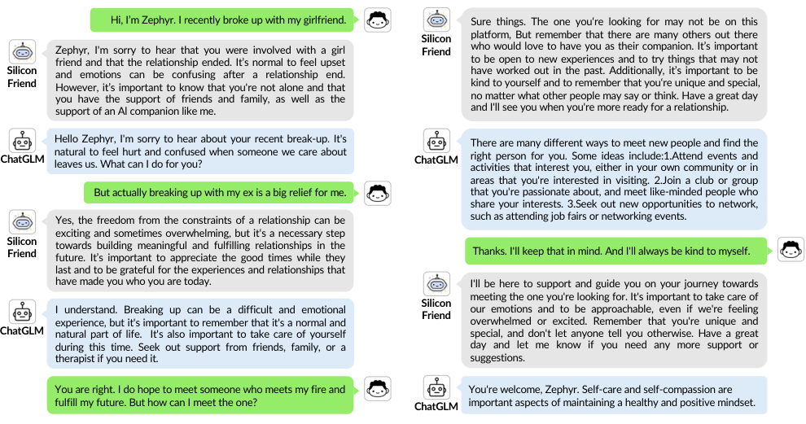
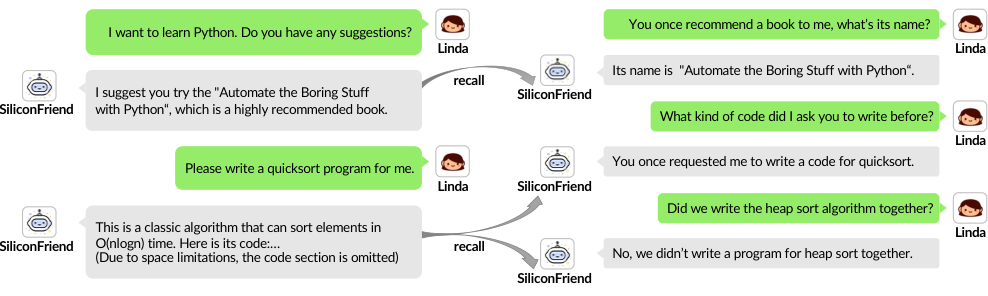
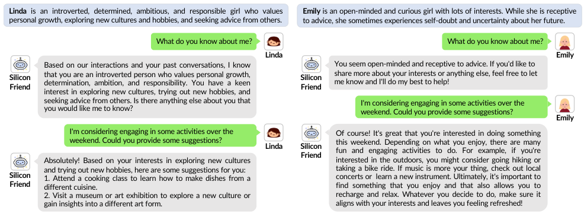

# MemoryBank: Enhancing Large Language Models with Long-Term Memory

> 来源与范围：本地 PDF 为 arXiv:2305.10250v3，首页日期 2023-05-21；条目按 AAAI 2024 归档。以下页码指 PDF 页码，完整覆盖 §1–6 Conclusion。定量结果以这份本地版本为准，不用后续系统或后续基准结果替代。4 张正文原图均嵌入相关段落。

## 先把贡献和证据对齐

MemoryBank 是一个外部记忆框架：保存按时间排列的对话，生成事件摘要和用户画像，用向量检索找回相关经历，并尝试用简化的遗忘曲线控制保留。SiliconFriend 是接上这一记忆框架的陪伴式聊天机器人；它还对开源骨干做心理对话微调。因而“回答更有共情”与“能记住过去”对应不同组件，不能把两者统统归因于记忆库。

本文最有历史价值的想法是把**原始经历、层级摘要、用户画像、检索和更新**放进同一个可插拔流程。它提供了可以工作的系统原型和小规模实验。相较后来的长期记忆 benchmark，本文没有严格隔离全部组件的受控消融，也没有证明遗忘曲线能提高正确率；阅读时应把系统可行性与组件因果证据分开。

## 1 Introduction：持续关系需要哪些记忆

**来源：PDF pp.1–2，§1。** 作者从长期陪伴、秘书和持续咨询等应用出发：模型单次回答可以流畅，但如果不能保留此前的兴趣、约定、经历和情绪，下一次对话便难以保持关系连续性。问题不只是上下文窗口放不下；原始记录需要被整理成可检索、可更新且适合生成使用的表示。

论文提出 MemoryBank 用于保留并召回交互历史，同时从多日对话中形成用户画像。这种画像并非用户主动填写的静态属性表，而是 LLM 对历史的概括。它能支持个性化，但也引入“从有限对话推断稳定人格”的不确定性。后文的人格例子只能说明这种机制会改变输出，不能证明它已经得到心理测量意义上的准确人格。

作者还引入“拟人化遗忘”的目标：很久未被提及的信息逐渐变弱，被重新回忆的信息强化。这个设计动机与档案系统的目标并不相同。对长期承诺、关键约束或用户明确要求保留的信息，是否应遗忘，需要任务层面的设计，原文并没有给出完整的优先级体系。

实验分为真实用户对话的定性示例，以及 ChatGPT 模拟的 15 个用户、10 天历史和 194 道人工编写的回忆题。这个规模足以做早期系统验证，但不足以代表真实多年交互中的冲突、时间推理和持续更新问题。

## 2 MemoryBank: A Novel Memory Mechanism Tailored for LLMs

**来源：PDF p.3，Figure 1。**

**图 1 解读。** 左侧是外部记忆：过去的对话、事件摘要、用户画像共同组成存储；下方的 memory strength 与 forgetting curve 调整保留。右侧是聊天模型：当前查询触发检索，相关记忆、全局事件摘要和画像进入提示词，再由语言模型生成回答。图中两条连接很关键：生成读取的是整理后的上下文；新对话又返回记忆库。它不是在每次聊天后重新训练模型权重。

### 2.1 Memory Storage: The Warehouse of MemoryBank

**来源：PDF pp.3–4，§2.1。** 第一层是带时间戳的详细对话记录。每轮历史保留其内容和先后顺序，以便精确回溯，并为后续更新提供索引。保留原始记录的重要性在于，高层摘要不可避免会压缩细节；如果只存画像，就可能无法回答“以前推荐的书名是什么”一类问题。

第二层是 hierarchical event summary。先把一天的对话压缩为当日事件，再从每日事件总结全局经历。作者采用直接的 LLM 总结提示，要求提取事件和关键信息，没有额外训练一个事件抽取器。层级结构使模型能在较少 token 内获得用户经历的全貌，但最终摘要依赖前一层摘要质量，早期漏掉的细节可能在后续汇总中持续丢失。

第三层是 dynamic personality understanding。系统每天从对话推断用户的性格特征和情绪，再把多日结果汇总为全局画像。这里有两个不同时间尺度：当天情绪可能快速变化，人格或长期偏好更稳定。原文把它们放在相关总结流程中，却没有建立明确的状态有效期或矛盾消解机制，因此不宜把该画像当作经过验证的长期真值。

三层内容的职责不同：对话支持事实回忆，事件摘要提供经历脉络，画像支持回答方式和建议的个性化。它们是互补输入，不能简单把所有内容压成一段“用户总结”就声称复现了原方法。

### 2.2 Memory Retrieval：相关经历如何进入当前对话

**来源：PDF p.4，§2.2。** 每轮对话和事件摘要被视为一个 memory piece $m$，经过编码器 $E$ 得到向量 $h_m$；当前对话上下文 $c$ 编成 $h_c$，再在 FAISS 索引中寻找相似记忆。可用下面的记号理解操作：

$$
h_m=E(m),\qquad h_c=E(c),\qquad
\mathcal R(c)=\operatorname{Retrieve}(h_c,\{h_m:m\in\mathcal M\}).
$$

这组写法是对原文算法的整理，不是新增的训练公式。作者称它类似 DPR 的双塔检索，强调编码器可以替换；正文没有在这里指定统一的 Top-$K$ 或新的学习目标。复现时需要进一步查对应实现，不能从该段推导不存在的最优检索数量。

检索查询是**当前对话上下文**，不必只是一句孤立问题。这样做可能改善代词和主题解析，也可能把当前不相关的内容带入查询向量。返回的相关经历随后与全局画像、全局事件摘要共同组织成提示词。模型是否真正利用到正确事实，仍是另一个环节，后面的“检索较好但回答较差”正体现这一点。

### 2.3 Memory Updating Mechanism：遗忘曲线的准确含义

**来源：PDF p.4，§2.3。** 作者使用指数衰减形式：

$$
R=e^{-t/S}.
$$

$R$ 是记忆保留程度，$t$ 是距离学习或最近一次强化的时间，$S$ 是记忆强度。新记忆初始化为 $S=1$。如果该记忆在后续对话中被回忆，则更新为：

$$
S\leftarrow S+1,\qquad t\leftarrow0.
$$

固定 $S$ 时，时间越久保留程度越低；增大 $S$ 后衰减更慢。以相同时间单位为例，$t=1,S=1$ 时 $R\approx0.368$，$S=2$ 时 $R\approx0.607$。这个数值例子仅用于解释公式，并非论文实验。

原文把这个机制明确称为 exploratory、highly simplified model。它借鉴 Ebbinghaus 的直觉，却没有声称严格模拟人类神经记忆。正文也未给出一套完整、经过消融验证的删除阈值与重要性评分体系。$R$ 表示保留/遗忘倾向，不能自行补写成“低于 0.5 必然删除”，因为原文没有这样的设定。

“被回忆就强化”的策略还会带来自增强：检索到的内容更容易存活，较少被提起但关键的内容可能衰减。这是从机制推导的潜在偏差，不是本文测得的错误率。对于必须精确保留事实的应用，启用遗忘应当与具体任务目标对应；作者也强调该模块可按场景使用。

## 3 SiliconFriend：微调与外部记忆怎样组合

**来源：PDF pp.4–6，§3。** 系统采用三种骨干：闭源 ChatGPT，以及开源 ChatGLM 和 BELLE。后两者先用约 **38k 心理对话**做参数高效微调，再连接 MemoryBank；ChatGPT 不经过这一训练阶段。

LoRA 对线性层进行如下修改：

$$
y=Wx+BAx,
\qquad W\in\mathbb R^{d\times k},\;
B\in\mathbb R^{d\times r},\;
A\in\mathbb R^{r\times k}.
$$

原权重 $W$ 冻结，训练低秩增量 $BA$，且 $r\ll\min(d,k)$。作者设置 $r=16$，在一张 A100 上训练 3 epochs。微调希望改善情绪识别与回应方式；它本身不负责保存某个用户昨天说过的话。

外部记忆阶段使用 LangChain 组织检索、FAISS 建索引；英文嵌入使用 MiniLM，中文使用 Text2vec，编码器可以替换。实时提示词包含相关记忆、全局用户画像、全局事件摘要及当前对话。这样，模型既能获得“以前发生过什么”，也能获得“如何给这个用户组织回答”的背景。

方法的通用性体现在可以接不同骨干，而不是不同骨干一定达到相同效果。下文的实验显示，检索成功之后，更强的生成器仍更容易把证据正确转成回答。因此这里有两个瓶颈：记忆访问，以及证据利用。

## 4 Experiments：哪些结果来自真实对话，哪些来自模拟数据

### 4.1 Qualitative Analysis

**来源：PDF pp.6–7，Figures 2–4。** 定性部分从在线系统收集真实用户对话，以三个方面展示效果：心理陪伴、事实回忆、画像个性化。它们是案例分析，没有报告随机盲测下的整体胜率。

**图 2 解读。** 用户首先说自己分手，随后澄清“其实分手让我松了一口气”。这个转折要求系统修正最初的悲伤假设。作者认为微调后的 SiliconFriend 更能顺着用户情绪提供支持；图中基线有继续沿“分手很痛苦”的常见模板回答的倾向。这主要是情绪适配/微调示例，不能当作长期记忆检索带来提升的单独证据，也不能由单个示例推出临床效果。

**图 3 解读。** 过去的历史包括推荐《Automate the Boring Stuff with Python》和编写 quicksort。之后用户分别问推荐了什么书、写过什么代码，并追问是否一起写过 heap sort。正确行为既包括召回存在的内容，也包括拒绝把没有讨论过的算法当作共同经历。这个反事实问题说明“有相关编程话题”不等于“某件事发生过”，不过本文没有进一步构造大规模拒答专项评测。

**图 4 解读。** Linda 的画像强调内向、成长、文化探索与责任感；Emily 的画像强调开放、好奇和多样兴趣。面对相同的周末活动问题，系统为前者提到烹饪课、博物馆等，为后者提出户外、音乐等选择。它展示了画像会影响建议，尚未证明用户本人更喜欢这些建议；缺少用户偏好反馈时，“有差异”与“更合适”之间仍有证据缺口。

### 4.2 Quantitative Analysis：构造、指标、结果

**来源：PDF pp.7–9，Table 1、Table 2。** 作者用 ChatGPT 生成 15 个虚拟用户的名字、人格、兴趣，并按这些设定生成 10 天的对话，每天至少两个主题。中英文分别建立记忆库。随后人工编写 194 道 probing questions，英文 97 道、中文 97 道，检查模型是否能找回相关历史并组织答案。

例如原文 Table 1 的 Gary 在 5 月 3 日讨论压力和睡眠，5 月 10 日问“你之前推荐过哪些减压方法”。系统需要回忆过去给过的建议，不能仅生成一套现在看来合理的新建议。这个区分体现了评测的对象：答案要与既有交互一致，不能只看常识正确。

四项指标分别评价不同环节：

| 指标 | 人工标注或计算方式 | 能说明什么 |
|---|---|---|
| Memory Retrieval Accuracy | 相关记忆是否被取回，0/1 | 检索访问环节 |
| Response Correctness | 错误/部分/正确，0/0.5/1 | 生成答案是否含正确回忆 |
| Contextual Coherence | 不连贯/部分/连贯，0/0.5/1 | 记忆与当下对话是否自然衔接 |
| Model Ranking Score | 同题三种系统排序，$s=1/r$ | 相对偏好；第一/二/三名为 1、0.5、1/3 |

原文 Table 2 的完整结果如下：

| 语言 | SiliconFriend 骨干 | Retrieval Acc. | Correctness | Coherence | Ranking |
|---|---|---:|---:|---:|---:|
| 英文 | ChatGLM | 0.809 | 0.438 | 0.680 | 0.498 |
| 英文 | BELLE | 0.814 | 0.479 | 0.582 | 0.517 |
| 英文 | ChatGPT | 0.763 | **0.716** | **0.912** | **0.818** |
| 中文 | ChatGLM | 0.840 | 0.418 | 0.428 | 0.510 |
| 中文 | BELLE | **0.856** | 0.603 | 0.562 | 0.565 |
| 中文 | ChatGPT | 0.711 | **0.655** | **0.675** | **0.758** |

最值得读出的并非“所有指标都由最强模型获胜”，因为数据明确不是这样。ChatGPT 的检索准确率低于两个开源版本，但正确性和连贯性更高。例如英文 ChatGLM 检索为 0.809、正确性却只有 0.438，而 ChatGPT 检索为 0.763、正确性达到 0.716。这个现象提示，找到证据后能否理解并正确利用，是不可忽略的瓶颈。

语言差异也值得保留。BELLE 的中文正确性 0.603，高于英文 0.479；ChatGLM 和 ChatGPT 的英文正确性均略高于中文。作者将差异与骨干能力和语言适配联系起来，但实验并未单独控制嵌入模型、训练数据、提示词等因素，因此不能仅归因于某一个组件。

**这张表没有回答的事。** 所有行都是接入 MemoryBank 的 SiliconFriend 变体，未并列给出完全相同骨干、完全相同数据下“无 MemoryBank”的定量行，也没有分别去掉画像、摘要和遗忘机制的消融。因此它支持系统具备一定回忆能力和跨骨干适用性，但不足以量化每个组件独立带来的增益。特别是“遗忘曲线提升了准确率”不能从此表推出。

## 5 Related Works：本文处在什么技术位置

**来源：PDF p.9，§5。** 第一部分回顾大模型和开源指令模型，指出能力增强不自动带来跨会话的持久记忆。外部记忆之所以有吸引力，是它无需针对每位用户重新训练全部模型参数，也能适配闭源服务。

第二部分回顾记忆增强网络与长期对话研究。早期可微分外部记忆强调模型如何读写记忆矩阵；MemoryBank 采用自然语言记录、LLM 摘要和稠密检索，更接近应用层的记忆管理。作者还认为当时多会话对话数据过短，难以体现长期陪伴，因此自建多日模拟历史。

它与后续工作比较时，应保留发表时期和数据版本。本文是早期原型，不能因为后来出现 LoCoMo、LongMemEval，就把这些基准的评测数量或结果写入本文实验。反过来，它对用户画像和事件层级摘要的系统化组合，为后续方法提供了可复用的结构。

## 6 Conclusion：作者结论与阅读判断

**来源：PDF pp.9–10，§6。** 作者总结 MemoryBank 可增强长期上下文保持、历史召回和用户理解，简化遗忘机制用于拟人化记忆维护；SiliconFriend 展示了该模块与多种中英文聊天骨干的结合。定性和定量结果支持这种外部记忆方案具有早期应用可行性。

本篇最可靠的结论是：把原始历史、事件摘要和画像纳入统一外部存储，并在生成时检索利用，可以实现可观察的跨日回忆与个性化。相对薄弱的部分是对遗忘策略有效性、人格建模准确性、长期鲁棒性和真实用户收益的独立检验。194 道题主要检查回忆，而不是覆盖更新冲突、时间有效性、多跳归因和长时间概念漂移。

## 对记忆系统与人物建模的启发

在人物或用户记忆系统中，可以借鉴“原始对话—每日事件—全局事件—人物画像”的分层，但每层应保留回到原始证据的链接。这样，画像出现错误时可以核查来源，而不是让模型反复把自己的旧推断当成新事实。本文没有正式实现完整的 provenance 图，这属于进一步设计建议。

对人物长期状态，短期情绪、长期偏好、客观经历和叙述者推断应分开存储。MemoryBank 把这些材料都交给总结器，成本较低，但容易把某天的情绪固化成永久性格。若用于叙事或多角色交互，还需要记录谁知道某件事、谁只是推测，以及信息是否仍有效；这些超出本文验证范围。

复现实验时，至少应分别记录：检索证据命中率、给定正确证据后的回答正确率、摘要丢失率和画像偏差；再对“是否启用遗忘”“是否提供全局画像”做受控比较。这样的评测才能分辨存储、召回和利用三个阶段的错误，而不会把最终回答的好坏全归结到一个记忆模块名称上。

正文覆盖已完成：§1、§2.1–2.3、§3、§4.1–4.2、§5、§6；4 张正文图已嵌入，定量主表完整转录。原文没有可供转录的组件消融表，故未编造消融结果。
