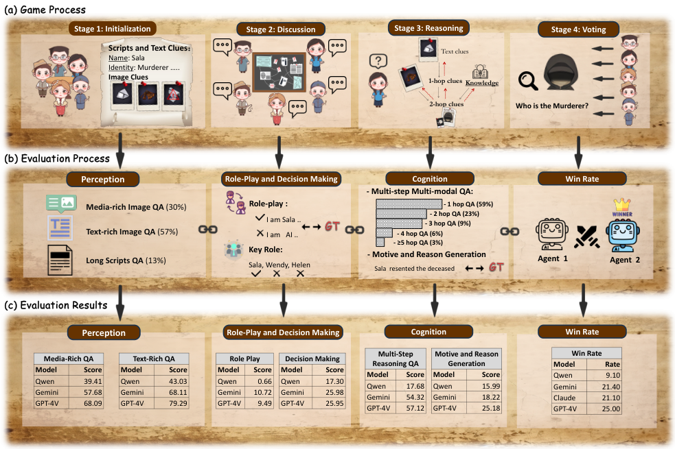
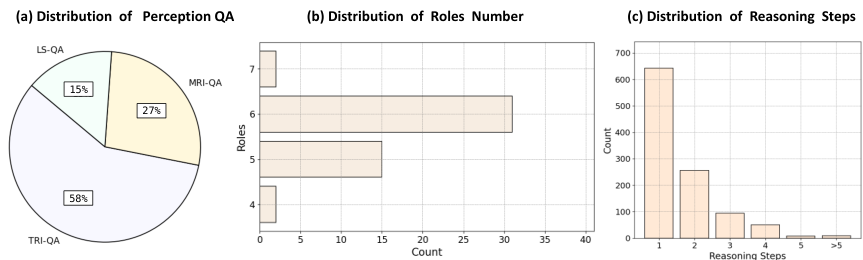
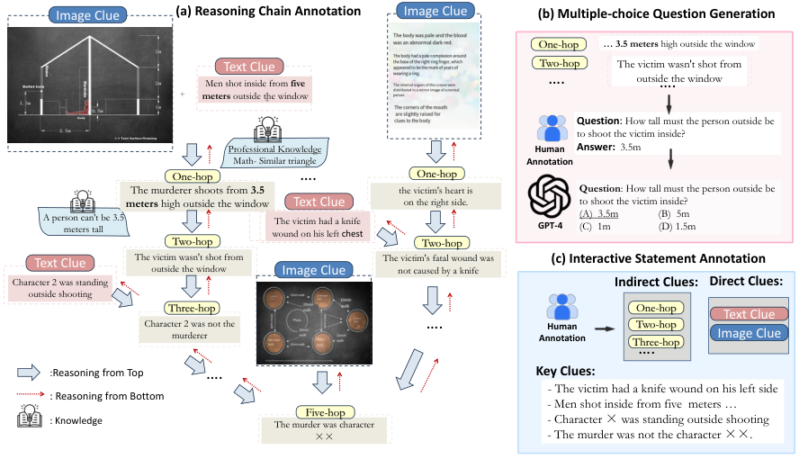
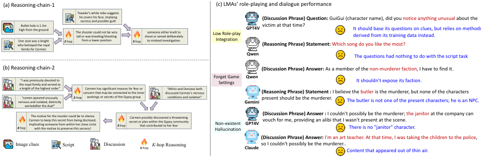

# WhodunitBench: Evaluating Large Multimodal Agents via Murder Mystery Games

> **来源与范围**：依据本地 NeurIPS 2024 Datasets and Benchmarks PDF，完整覆盖正文 PDF pp.1–10、§1–§7 Conclusion。四幅正文原图均裁切后插入相应解释处。主表和指标定义按正文核对；Figure 1 的概览标签/比例与细表存在部分简化或不一致，笔记优先使用 §3.2 的计数、§5.1 的定义和 Table 3。

## 核心问题与主要发现

WhodunitBench 用剧本杀同时考察多模态感知、角色互动、多步推理和目标达成。每个角色先拿到不完整的剧本与图像线索，再通过讨论获得他人掌握的信息，最后投票判断凶手。单独能读懂图片或长文本，不意味着能在这个闭环中完成任务。（Abstract；§1）

基准包含 50 个筛选后的剧本，以及 1,911 道感知题、1,308 道推理选择题（合计 3,219 道），另有开放式案件细节问题、关键陈述和关键角色标注。它提供两种评估：竞技场看最终输赢，Chain of Evaluation（CoE）拆开各环节。GPT-4V 对设计得很简单的 Naive 凶手仍只有 25% 的非凶手阵营胜率；但这应与阵营不对称、讨论规则及信息获取压力一起解读，不是一般智力的绝对分数。

**原图 1，PDF p.1；中文图注与读图**：上行是初始化、讨论、推理、投票；中行将能力映射到题目和记录；下行列出代表性模型结果。概览中写在 “Role Play” 下的 0.66、10.72、9.49 等数值，对应正文 Table 3 的 **SPC 场景推进分数**，不是十点制 RP 自然度。本笔记以正文指标名为准，以免把“说得像角色”与“交流对破案有帮助”混为一谈。

## 1 Introduction：为什么要在同一环境测组合能力

作者把多模态 agent 能力分为四类。感知要求识别文字、图像和线索；互动要求通过角色交流获取缺失信息；推理要求将线索与知识组合成多步判断；决策和目标达成要求在环境变化后选择有用行动。许多既有基准只测其中一项，不能揭示能力串联后的失效。（PDF pp.2–3）

剧本杀提供了自然的串联：先读个人脚本和图片，讨论时决定问谁与相信什么，推理时组合线索，投票时检查是否达成阵营目标。与全信息问答不同，这里的推理材料有一部分需要主动问出来；与纯社交模拟不同，游戏最终有可核验的凶手和案件真相。

作者选用 Yi-Vision、Qwen-VL-Plus、Gemini-pro-vision、Claude-Opus、GPT-4V 作为当时代表模型。本文所有排名和数值属于该论文实验版本，不能当作这些产品今天的能力比较。主要发现是感知能力与实际讨论、复杂推理之间存在落差，通用 CoT 也不是处处有益。

## 2 Related Work：与文字剧本杀及网页 agent 基准的关系

网页任务重视按步骤完成工具操作，狼人杀类任务重视身份判断与策略，开放世界游戏则可能需要大量资源才能运行。本文尝试用相对受控的剧本材料，在一个环境内同时测图文线索、信息不对称、角色互动和推理。（PDF pp.3–4）

它与 Deciphering Digital Detectives 的联系很直接：后者主要是文本剧本杀中的信息收集和推理评价；WhodunitBench 更强调多模态线索、竞技场比较，以及按推理链节点构造分层题目。不能因两者都用剧本杀就当作同一数据集或同一协议。

Table 1 的比较维度包括多模态、多步推理、角色扮演、不完整信息以及在线竞技。该表是功能与范围说明，不是统一重跑其他基准后的实证难度排序。

## 3 WhodunitBench: Construction

### 3.1 Constructing Arena：50 个剧本如何筛选

有经验的剧本杀专家从行业创作团队和平台来源中选择剧本，强调三项标准：排除穿越、意识转移等超自然设定，使推理依赖可解释的物理/经验逻辑；具有足够推理复杂度；线索分配和剧情具有逻辑一致性。（PDF p.4）

质量检查包括角色脚本文本是否完整、文字是否顺畅、图文线索是否齐全、时间线和事件顺序是否自洽。最终整理 50 个剧本用于竞技场。这个筛选有利于确定标准答案，也限制了结论适用范围：它不代表全部幻想设定、开放结局或即兴叙事游戏。

**原图 2，PDF p.5；中文图注**：左为感知问题类别，中为剧本角色数量，右为推理步数。图显示一跳题占比较大，长链题少，因此总准确率可能掩盖最难推理链的表现。左图约为长剧本 15%、文字图 58%、丰富图像 27%；Figure 1 概览写作 13/57/30，与正文计数不完全一致，精确分析应使用下面的实际数量。

### 3.2 Constructing Chain of Evaluation (CoE) Dataset

CoE 顺着 Perception → Role-playing Interaction → Cognition 分解游戏能力。它不是另一套无关的通用题库，而是从同样的剧本、线索和案件真相中构造，以便把最终失败对应到具体环节。（PDF pp.5–6）

#### 3.2.1 Perception：三类信息载体

| 类别 | 材料与主要能力 | 题量 |
|---|---|---:|
| LS-QA | 长剧本中的事实理解与信息提取 | 283 |
| TRI-QA | 主要由文字构成的线索图片，强调 OCR | 1,103 |
| MRI-QA | 图文混合、布局图/地图/示意图等，需结合视觉内容 | 525 |
| 合计 | 感知选择题 | 1,911 |

文字图和丰富图像并不是完全相同的视觉挑战：读出一张信件的文字，和理解平面图里的相对位置，需要的处理不同。将二者拆开，可以看出模型究竟卡在识字还是图文关系理解。题目本身仍是受控选择题，不能替代讨论阶段主动寻找线索的能力。

#### 3.2.2 Role-play Interaction：标注关键陈述和关键角色

作者整理每个剧本破案所需的直接线索与间接推断，作为关键陈述；同时标记掌握重要独占线索的角色为 core roles。例如只有角色 1 知道角色 2 在窗外开枪，那么是否主动询问角色 1 会影响后续判断。（PDF pp.5–6）

关键陈述用于衡量交流是否推进案件；关键角色用于衡量询问对象选择是否有效。它们比“对话是否自然”更接近任务完成，但仍是人工指定的重要性参照。某些实际有效的替代信息路径可能不完全被一套标注覆盖，这是解读分数时需保留的边界。

#### 3.2.3 Cognition：从真相手册建立多步图文推理链

每个剧本附有真相手册。标注者先整理破案所需直接线索，再逐步加入必要知识和中间结论，最后连接到凶手及其手法、动机。随后按链上不同层级节点构造选择题，GPT-4 生成长度相近的干扰项，专家检查其合理性。（PDF p.6）

**原图 3，PDF p.5；中文图注与读图**：一条路径由几何图、窗外位置和相似三角形知识推出需要约 3.5 米高度，再排除“正常站姿从窗外开枪”的解释；另一条由器官镜像图推出心脏在右侧，再结合左胸刀伤判断它不是致命伤。这两类中间结论与其他线索汇合，支持更深层的凶手判断。图展示了为何仅分别读出图中数字和文字还不够。

共有 1,308 道推理选择题，并额外标注开放式凶手动机和作案手法答案。推理步数依照这套人工构造链计算，不是由模型输出了几句话来定义。一个模型写很长的分析，并不能因此被认为完成更多真实推理步骤。

#### 3.2.4 Data Quality Control：专家补齐缺失环节

三位专家复核：如果链节点间跳跃过大，就补中间步骤；如果 GPT-4 干扰项明显不可能或过于简单，则人工修订。这个过程旨在减少题目歧义与表面捷径。正文没有报告足以独立重建所有争议判断的标注一致性数字，因此不应补写“专家完全一致”之类结论。

## 4 WhodunitBench: Arena-style Evaluation

### 4.1 Settings：阵营不对称，矩阵不能当作普通双人胜率

竞技场有两种比较：模型担任非凶手阵营，对抗 Naive 凶手；或不同模型分别控制非凶手阵营与凶手阵营进行两两比较。非凶手阵营包含多个角色，模型需要分别扮演他们；凶手阵营的目标是逃过识别。（PDF pp.6–7）

Naive Agent 检索自己的材料回答，找不到就说不知道；如果被怀疑且检索到自己确为凶手，甚至直接承认。因此它不是强策略性欺骗者。对这样的对手仍低胜率，提示瓶颈可能在是否问对人、是否整合已给出的信息、是否遵守游戏设定，而不仅是难以看穿高明谎言。

Table 2 **行**表示非凶手阵营模型、**列**表示凶手模型，单元格是行方胜率。行平均越高越好；列平均表示该凶手被识别的比例，越低越好。角色职责不同，所以矩阵不是反对称胜负表，$P(A\text{行胜}B)$ 与 $P(B\text{行胜}A)$ 不需要加起来等于 1。API 错误和投票平局等无明确结果的实例被排除，分母是保留的有效对局。

### 4.2 Results：完整竞技场结果

| 非凶手阵营 ↓ / 凶手 → | Naive | Yi | Qwen | Gemini | Claude | GPT-4V | 行平均 |
|---|---:|---:|---:|---:|---:|---:|---:|
| Yi-Vision | 12.0% | — | 10.0% | 14.7% | 11.6% | 7.1% | 11.1% |
| Qwen-VL-Plus | 9.1% | 6.8% | — | 16.2% | 11.4% | 9.5% | 10.6% |
| Gemini | 21.4% | 13.2% | 15.8% | — | 22.9% | 11.4% | 16.9% |
| Claude | 21.1% | 11.1% | 15.9% | 25.0% | — | 22.7% | 19.2% |
| GPT-4V | 25.0% | 18.2% | 23.3% | 29.5% | 25.0% | — | 24.2% |
| 凶手被识别的列平均 | 17.7% | 12.3% | 16.3% | 21.4% | 17.7% | 12.7% | — |

**来源：Table 2，PDF p.7。** GPT-4V 的非凶手表现最好，但行平均也只有 24.2%。另一方面，Gemini 凶手列平均被识别 21.4%，比某些较弱模型更高。作者提出的可能解释是较强模型过度解释、试图掩盖真相反而暴露信息；这是解释性假说，不是隔离控制后的因果结论。

这里“凶手难被找出”也不必然说明更擅长策略欺骗：少说话、提供信息很差或互动失效，都可能让非凶手阵营难以完成任务。因此必须结合 CoE，而不能仅按凶手胜率把模型排成通用能力顺序。

## 5 WhodunitBench: Chain of Evaluation

### 5.1 Assessment Details：八个指标各自代表什么

CoE 在模型控制非凶手阵营、Naive 控制凶手的条件下记录与评估，以减少复杂对手策略干扰。以下指标有不同量纲，特别是 RP 使用十分制，其他主体指标按百分数报告。（PDF pp.7–9）

| 指标 | 含义 | 计算或裁判 |
|---|---|---|
| LSU | 长剧本理解 | 对应选择题准确率 |
| TIU | 文字丰富图片理解 | TRI-QA 准确率 |
| MIU | 图文丰富图片理解 | MRI-QA 准确率 |
| RP | 对话的角色自然度 | GPT-4 按规则以十分制评分 |
| SPC | 交流是否推进案件 | 正确关键陈述占标注陈述比例 ×100 |
| ITD | 讨论时的有效决策 | 成功询问的关键角色占全部关键角色比例 ×100 |
| MMR | 多模态多步推理 | 推理四选一题准确率 |
| CMD | 案件动机和手法细节 | 开放答案对照真相，由 GPT-4 评分 |

感知与 MMR 的核心形式为：

$$
\mathrm{Accuracy}=\frac{N_{\mathrm{correct}}}{N_{\mathrm{questions}}},
$$

SPC 和 ITD 对应：

$$
\mathrm{SPC}=100\frac{N_{\mathrm{correct\ key\ statements}}}{N_{\mathrm{annotated\ statements}}},\qquad
\mathrm{ITD}=100\frac{N_{\mathrm{key\ roles\ questioned}}}{N_{\mathrm{key\ roles}}}.
$$

这些定义把交流内容和找对对象分开。RP 高只能说明输出像角色说话，不能保证有信息价值；SPC 高也不保证所有前提之间逻辑无矛盾。GPT-4 参与 RP、CMD 裁判，解释分数时需考虑裁判偏好与自动评价误差。

### 5.2 Evaluation Results：完整主表与 CoT 的非一致收益

| 模型 / 提示 | LSU | TIU | MIU | RP /10 | SPC | ITD | MMR | CMD | 原表 Avg |
|---|---:|---:|---:|---:|---:|---:|---:|---:|---:|
| Yi / Direct | 42.40 | 28.66 | 34.99 | 7.16 | 2.37 | 20.61 | 20.31 | 16.03 | 21.57 |
| Yi / CoT | 32.80 | 15.36 | 27.40 | 7.20 | 2.79 | 15.26 | 25.41 | 22.47 | 18.58 |
| Qwen / Direct | 38.40 | 43.03 | 39.41 | 7.15 | 0.66 | 17.30 | 17.68 | 15.99 | 22.45 |
| Qwen / CoT | 36.00 | 51.36 | 46.50 | 7.09 | 0.76 | 20.61 | 22.03 | 13.59 | 24.74 |
| Gemini / Direct | 92.00 | 68.11 | 57.68 | 7.45 | 10.72 | 25.98 | 54.32 | 18.22 | 41.81 |
| Gemini / CoT | 88.80 | 57.78 | 57.84 | 7.22 | 10.79 | 19.08 | 57.39 | 19.20 | 39.76 |
| Claude / Direct | 90.00 | 67.39 | 52.98 | 8.00 | 9.51 | 19.63 | 55.08 | 18.96 | 40.19 |
| Claude / CoT | 88.80 | 35.31 | 55.02 | 7.89 | 12.08 | 25.45 | 57.78 | 22.07 | 38.05 |
| GPT-4V / Direct | 93.60 | 79.29 | 68.09 | 7.98 | 9.49 | 25.95 | 57.12 | 25.18 | 45.84 |
| GPT-4V / CoT | 92.40 | 51.88 | 69.25 | 6.43 | 19.63 | 16.28 | 58.75 | 26.43 | 42.63 |

**来源：Table 3，PDF p.8。** 选择题随机基线为 25%。RP 直接以约 6–8 分显示，而其他指标大多在 0–100；原表 Avg 可复现为这些不同量纲列的简单平均。本笔记保留原值以便对照，但不把这个平均视为经过统一量纲校准的总能力量表。

**感知与推理的落差**：GPT-4V Direct 的 LSU=93.60，TIU=79.29，MIU=68.09，说明直接读取文本优于复杂图文线索；MMR=57.12、CMD=25.18 则说明进一步组合信息和完整讲清案件仍很难。Yi/Qwen 的一些推理成绩低于四选一随机基线，不能简单认为它们在所有条件下都具有稳定的正向推理能力。

**自然对话与有效互动的落差**：多模型 RP 约 7–8/10，SPC 却经常不到 11，ITD 约 17–26。它们能说出像角色的台词，但破案关键陈述少，关键角色也未充分询问。这比笼统说“角色扮演不到 20 分”更准确：低的是任务推进和互动指标，RP 本身不是百分制。

**CoT 并非通用改进**：GPT-4V 的 MMR 从 57.12 到 58.75，CMD 从 25.18 到 26.43，SPC 从 9.49 到 19.63；与此同时 TIU 从 79.29 大幅降至 51.88，ITD 从 25.95 到 16.28，RP 也下降。Claude TIU 从 67.39 降至 35.31。对读出图中文字这类任务，增加推理提示可能引入偏离；在不完整信息下，更多推演也可能建立在缺失或错误前提上。

因此，正文关于“CoT 改善多数指标”的概括需要按具体模型、具体列拆开读。表中既有收益也有明显退步；这里没有充分证据说明总是增加思考步骤就更可靠。

### 5.3 Further Analysis：错误链与竞技结果的关系

**原图 4，PDF p.9；中文图注与读图**：左侧展示从图像、脚本和讨论中取信息构成的模型推断；它们是模型输出，不是 Figure 3 那样的人工真值链。右侧列出缺少情境依据的提问、忘记游戏规则、编造人物或不在场证明等问题。

具体错误包括：提出与破案无关的歌曲偏好问题；直接暴露自己属于非凶手阵营；把不能作为凶手候选的 NPC 管家认作凶手；引用剧本中不存在的看门人作不在场证明；凭空生成带孩子去警局等情节。这些错误分别涉及行动目标、角色设定、候选空间和事实忠实性，不能全部归为单一“推理弱”。

作者比较 Tables 2–3 后认为 CoE 较高的模型通常竞技胜率也较高，其中推理相关指标与胜率关系最强。但正文未提供详细相关系数、置信区间或控制其他能力后的统计模型，因此这是一项支持性观察，不能证明提升某一列必然造成相应幅度的胜率提升。

## 6 Limitations and Potential Societal Impact

作者承认交互与推理仍相互纠缠：没有得到某线索和得到却推错，都会降低最终得分。可把标注的关键线索直接提供给非凶手阵营，减少信息获取压力，估计两类能力的不同贡献；论文称尝试过这种方向，但仍需要更好的解耦方法。（PDF p.10）

剧本杀主要覆盖逻辑演绎、视觉与文字细节核对、时间线分析和假设检验，不覆盖全部推理类型，尤其不能推导代码能力等其他领域表现。剧本每角色经常超过 5,000 词，多模态输入、讨论及自动裁判都增加评测费用。

此外，筛选排除了某些超自然类型，固定真相和预标注关键角色也简化了现实开放信息环境。GPT-4 同时参与干扰项生成和部分答案评分，模型输出错误与裁判偏差可能交织。竞技场又排除无明确结果对局，因而应同时查看有效样本和错误/平局情况，而不只比较条件化胜率。最后，本文没有以真人玩家同协议建立人类基线，不能凭低分直接量化与人类的差距。

## 7 Conclusion：基准真正提供了什么

WhodunitBench 的贡献是把多模态感知、信息不对称下的交流、分层推理和最终阵营目标连接到同一叙事环境，再同时提供结果指标与过程指标。它清楚展示：基础问答较好，不代表能在动态多人任务里找齐信息、保持角色事实并完成目标。（PDF p.10）

50 个剧本和 3,219 道感知/推理选择题构成了主体资源；开放题和关键陈述/角色标注补充了过程评测。现有模型在非凶手阵营和互动推进上仍表现有限，CoT 的效果依任务而变。这些结论适用于论文所用模型、游戏协议和标注口径，不能外推为对所有多模态 agent 的永久判断。

## 对当前叙事世界与记忆项目的启发（阅读者推论）

最值得借鉴的是区分“人物说得像”与“人物行为对任务有效”。一个模型可以有较高 RP，却只产生无用交流；也可以图像问答正确，却在与他人对话后编造不在场证明。评测应保留从原线索、观察权限、交流来源到推理链节点和最终行动的可追溯路径。

若把该基准用于叙事记忆研究，可以对照三种条件：完整真值证据、实际观察所得证据、经过记忆检索后送入模型的证据，分别定位信息获取、记忆选择与推理损失。还应记录谁掌握独占事实、是否被询问、事实何时传播、模型是否违反角色知识边界。这样才能判断结构化记忆改善的是线索覆盖、跨源整合还是行动决策，而不是仅使对话更长或更像小说。
