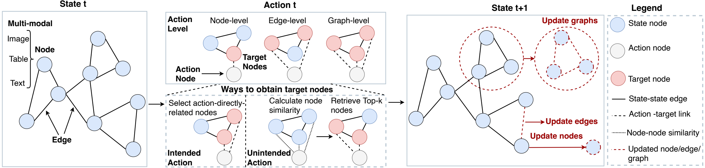
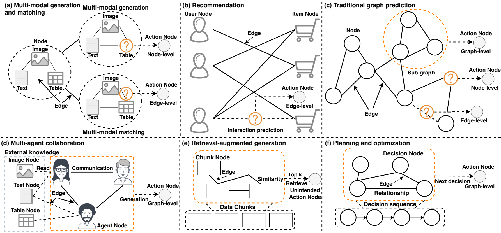
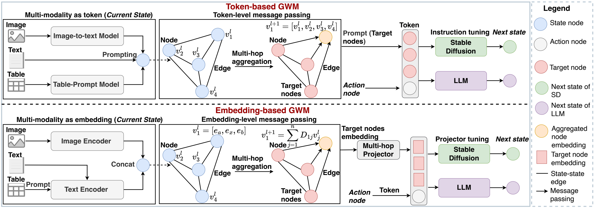
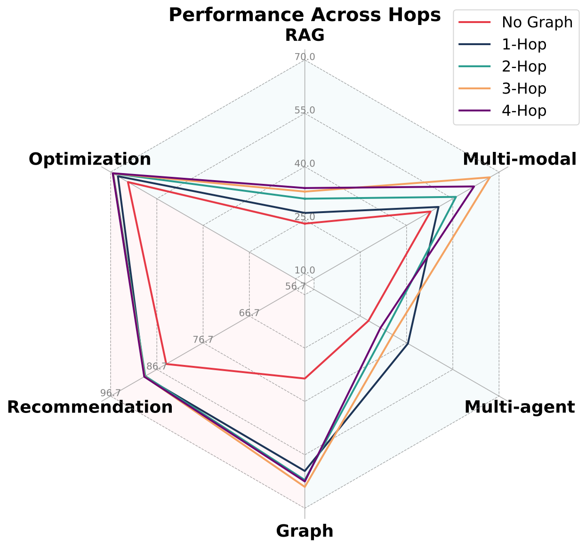
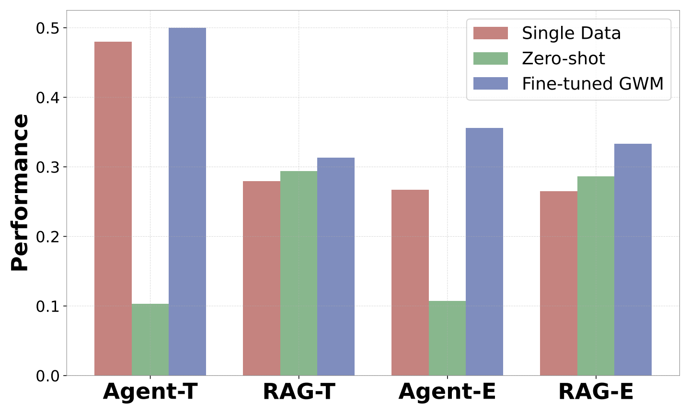

# Graph World Model

## 一句话总结

本文提出 Graph World Model（GWM），把包含文本、图像和表格的世界状态统一表示为图，并把不同任务表示为动作节点，通过图上的消息传递实现跨预测、生成与规划任务的统一建模。

## 研究问题

现有世界模型主要处理无结构数据，难以利用现实世界中广泛存在的图结构关系；图基础模型虽然能处理结构化数据，却通常局限于预定义的图学习任务。论文因此研究：能否构建一种同时支持无结构与图结构、多模态状态，并能跨多种任务迁移的统一世界模型？

## 核心方法

GWM 将当前状态建模为多模态图 $\mathcal{G}=(\mathcal{V},\mathcal{E})$：节点可包含图像、表格和文本，边既可来自显式关系，也可由嵌入相似度形成。任务被表示为动作节点，其中 intended action 直接指向节点级、边级或图级目标，unintended action 则通过语义相似度检索目标节点；状态转移在相关子图上聚合信息并产生下一状态。

论文给出两种实现。GWM-T 先把各模态转换为文本，在 token 层聚合邻居信息，再用任务提示驱动 LLM 或 Stable Diffusion；GWM-E 使用模态专属编码器把信息映射到统一嵌入空间，在 embedding 层进行消息传递，并通过 multi-hop projector 将不同跳数的图信息送入解码器，以降低 token 开销并缓解上下文长度限制。

## 分章节阅读笔记

### 1 Introduction

**本节作用。** 引言把论文放在 World Model（WM）与 Graph Foundation Model（GFM）的交叉位置：WM 擅长把观察表示为状态，并根据动作预测下一状态，已经用于预测、生成与规划；但主流 WM 多处理视频等无结构数据，没有显式利用实体之间的图关系。GFM 能处理图结构，却通常围绕节点、边或图分类等预定义图任务构建，难以同时覆盖多模态输入、图任务以外的生成与规划，以及原本没有显式结构的数据。论文据此提出核心问题：能否把世界模型扩展为一种可处理图结构、同时又能跨任务工作的统一模型？

**论文的关键抽象。** GWM 把当前世界状态表示为图，把任务或操作表示为一个 action node（动作节点）。动作节点连接到与任务有关的 target nodes（目标节点），从而把“针对哪些状态信息执行什么任务”转化为统一的图查询与状态转移过程。作者区分两类动作：intended action 与节点、边或子图等目标存在直接、预先确定的联系，例如预测指定节点的标签；unintended action 没有这种直接结构联系，需要按语义相似度寻找目标节点，例如 RAG 中的用户查询。这个设计使图预测、检索生成、推荐和规划等表面上差异很大的任务能够共享同一套状态—动作接口。

**两种实现路径。** GWM-T 将图像、表格和文本都转换为文本 token，在图上进行 token-level message passing，聚合邻居信息后，将目标节点与动作节点组织成提示，交给 LLM 或 Stable Diffusion 等解码器。它直观且能复用现有生成模型，但 token 成本高，并受上下文长度限制。GWM-E 则使用模态专属编码器把不同输入映射为节点嵌入，在 embedding 层做消息传递，再由 multi-hop projector 汇总不同跳数的目标节点信息并送入解码器；其目的在于以更低的 token 成本承载多跳图信息。

**表 1 所表达的研究定位。** 这张表强调的不是具体性能，而是 GWM 希望同时覆盖的能力边界：

| 代表方法 | 任务范围 | 数据结构 | 模型类别 |
|---|---|---|---|
| Genie | 视频生成 | 无结构 | WM |
| $L^3P$ | 规划 | 结构化 | WM |
| BioBridge | 生物医学领域 | 结构化 | GFM |
| LLAGA | 图领域 | 结构化 | GFM |
| GWM-T | 多领域 | 结构化与无结构 | GWM |
| GWM-E | 多领域 | 结构化与无结构 | GWM |

**引言给出的证据路线。** 作者把六类任务组织为 world prediction、world generation 和 world optimization 三组，其中多模态生成与匹配又包含两个子任务。引言预告后文将验证三项主张：同一个 GWM 能达到或接近各领域专用基线；多跳图结构确实带来收益；模型能迁移到未见任务，并表现出 zero-shot/few-shot 能力。这些在引言中仍是研究主张，具体成立范围需要结合第 5 节的数据集、基线和指标判断。

**阅读要点。** 从引言的定位看，GWM 的主要贡献是统一的任务表示和信息流接口：它把“状态”图化、把“动作”节点化，再复用已有的多模态编码器与生成解码器。第 2 节将形式化图状态、动作类型和任务实例，第 3、4 节分别说明 token 与 embedding 两条实现路线；因此后续阅读的关键是检查这些不同任务是否真的共享了实质性的模型参数与推理机制，而不只是共享概念描述。

### 2 Graph World Model

本章定义 GWM 的统一问题形式。整体流程是：把当前世界状态表示成多模态图，从任务对应的 action node 出发定位 target nodes，在目标节点及其邻域上聚合信息，再由转移函数更新节点、边或整张图。这里的“动作”被扩展为现实操作、程序函数、查询或指令，“状态转移”也不只表示时间上的物理演化，还包括补全节点属性、预测边以及生成图级输出。这种宽泛定义是 GWM 能覆盖分类、推荐、RAG 和规划等异质任务的基础。

### 2.1 World Model Preliminaries

作者沿用世界模型的三个基本组成部分。状态 $s_t$ 表示时间或步骤 $t$ 的世界观察，可以包含多模态信息；动作 $a_t$ 是推动任务执行的操作，其形式可以是现实动作、代码函数、查询或自然语言指令；转移 $P(s_{t+1}\mid s_t,a_t)$ 描述执行动作后从当前状态到下一状态的条件分布。后文的 GWM 主要改变的是状态与动作的表示方式：把单一状态替换为图状态，并把动作也显式表示为图中的节点。

### 2.2 Multi-modal World Represented by Graphs

**图状态。** 世界状态被定义为 $\mathcal{G}=(\mathcal{V},\mathcal{E})$。每个节点 $v=[v^a,v^b,v^e]$ 可以同时携带图像、表格和文本三种模态；缺失的模态位置为空。边集合写成 $\mathcal{E}=\mathcal{E}_p\cup\mathcal{E}_m$：显式边 $\mathcal{E}_p$ 来自专家知识或真实观测，例如论文之间的引用；隐式边 $\mathcal{E}_m$ 则根据嵌入相似度构造，用来补充数据中没有直接给出的语义联系。

**动作如何定位信息。** 动作 $a$ 被表示成 action node，并通过函数 $R$ 从状态节点中选出目标节点，即 $v_r=R(v,a)$。对于 intended action $a_d$，目标由任务结构直接确定：节点级动作指向一个节点，边级动作涉及一对节点或一条边，图级动作作用于子图或整图。对于 unintended action $a_u$，动作与目标之间没有预定义连接，系统先计算动作节点与状态节点的相似度，再取 top-$k$ 节点；RAG 查询属于这种情况。

**状态如何更新。** 目标节点确定后，转移函数执行 $s_{t+1}=f_{tr}(s_t,a_t)$。图 1 把结果分为三种粒度：更新节点，例如补全图像、文本或类别；更新边，例如预测用户—商品交互；更新整图，例如生成协作结论或下一步决策。本章只给出抽象接口，$f_{tr}$ 的具体神经实现由第 3、4 节的 GWM-T 和 GWM-E 提供。

### 2.3 Instantiations of GWM

图 2 的作用是证明上述表示具有足够宽的任务覆盖面。各任务并非共享相同的原始数据，而是被转换为相同的四个槽位：状态节点、关系边、动作节点和待预测的下一状态。

| 任务 | 状态节点 | 边 | 动作与输出 |
|---|---|---|---|
| 多模态生成 | 描述同一实体的图像、表格、文本构成一个模态簇节点 | 模态簇之间的相似关系 | 节点级动作，补全缺失模态 |
| 多模态匹配 | 每种模态分别作为节点 | 跨模态对应或相似关系 | 边级动作，判断两个模态是否匹配 |
| 推荐 | 用户节点与商品节点 | 历史用户—商品交互 | 边级动作，预测未来交互 |
| 传统图预测 | 沿用原数据集的节点和边 | 原始图结构 | 分别使用节点级、边级或图级动作 |
| 多智能体协作 | 智能体节点与外部图像、文本、表格知识节点 | 智能体通信及智能体—知识连接 | 图级动作，综合多方信息生成任务输出 |
| RAG | 长文档的数据块节点 | 数据块嵌入相似度 | unintended action 按查询检索 top-$k$ 节点并生成回答 |
| 规划与优化 | 历史决策状态节点 | 决策间的距离或嵌入相似关系 | 图级动作，根据相关历史状态生成下一决策 |

作者进一步把这些实例归入三组：多模态生成/匹配、推荐和图预测属于 world prediction；多智能体协作与 RAG 属于 world generation；规划与优化属于 world optimization。理解上，这里的统一首先发生在表示层：不同任务都能写成“动作查询图状态并产生某种更新”。是否形成了实质统一的学习机制，还取决于后续两种实现如何共享消息传递、投影器和解码器，以及第 5 节是否使用同一个联合训练模型进行验证。

### 3 Token-based GFM

GWM-T 是 GWM 的直接实现：先把所有模态转换为文本，再把图邻域序列化为文本上下文，最后将目标节点上下文与动作说明组成任务 prompt，交给生成模型预测下一状态。它的优点是几乎所有中间信息都处于自然语言空间，可以直接复用 LLaVA、LLM 和文本条件 Stable Diffusion；代价是图规模和消息传递跳数会迅速转化为 token 数量。

### 3.1 Multi-modality as token

输入节点可能包含图像 $v^a$、表格 $v^b$ 和原始文本 $v^e$。GWM-T 使用预训练 LLaVA $L$ 将图像转写为描述 $v^{ta}=L(v^a)$；表格则按列名和值展开为“column 1 is value 1, ...”形式的文本 $v^{tb}=T(v^b)$。随后，统一模板 $P_u$ 将三部分写成一个节点文本：

> The image's text description is: {image description}, original text is: {original text}, table description is: {table description}.

因此，节点的统一表示为 $v_c=P_u(v^{ta},v^{tb},v^e)$。这一步解决了异构模态无法直接送入同一文本模型的问题，但图像的空间细节和表格的二维结构只能通过文字描述保留；同时，每个节点都会产生一段可计入上下文长度的文本。

### 3.2 Token-level message passing

对于第 $l$ 层，中心节点 $v$ 的文本表示按照下式更新：

$$
\mathbf{h}_v^{(l)}=f_v\!\left(\operatorname{Concat}\!\left(\mathbf{h}_v^{(l-1)},\{\mathbf{h}_u^{(l-1)}\mid u\in N(v)\}\right)\right),
$$

其中 $\mathbf{h}_v^{(0)}=v_c$，$N(v)$ 是节点 $v$ 的一跳邻居，$f_v$ 是把中心节点与邻居文本组织起来的 prompting function。附录给出的实际模板是：

> The text description of the central node is: {center node}, and the text descriptions of the neighboring nodes are: {neighbor nodes}.

连续执行 $l$ 次后，中心节点文本能够携带最远 $l$ 跳邻域的信息。这里的 “message passing” 与标准 GNN 有明显区别：它没有在本节定义可学习的向量聚合权重，而是把图结构决定的邻居集合转换成 token 序列；图负责选择信息传播路径，文本模型负责消费序列化后的内容。邻居数和跳数增加时，上下文会快速膨胀，这正是下一章提出 GWM-E 的主要动机。

### 3.3 Instruction tuning

消息传递完成后，系统取第 2 章确定的目标节点 $v_r$ 及其文本表示 $\mathbf{h}_{v_r}$，再把动作 $a$ 写成任务说明。任务模板 $P_{sa}(\mathbf{h}_{v_r},a)$ 将“相关状态信息”和“要执行的任务”合并为 decoder 的条件输入。不同任务使用不同的动作模板，例如推荐任务询问两个节点是否应连接，RAG 模板要求依据检索文档回答查询，规划模板要求根据多模态历史预测下一决策。

**图像状态。** 当下一状态是图像时，文本条件写作 $c_T=P_{sa}(\mathbf{h}_{v_r},a)$，并由 CLIP 文本编码器得到 $h(c_T)$。Stable Diffusion 在图像潜变量 $\mathbf{z}=\operatorname{Enc}(x)$ 的加噪版本 $\mathbf{z}_t$ 上预测噪声，训练目标为

$$
\mathcal{L}_{SD}=\mathbb{E}\left[\left\|\epsilon-\epsilon_\theta(\mathbf{z}_t,t,h(c_T))\right\|^2\right].
$$

$\epsilon$ 是加入潜变量的真实高斯噪声，$\epsilon_\theta$ 是条件去噪网络。优化该均方误差后，模型能够在图聚合所得文本条件下生成目标图像。

**文本与表格状态。** 当输出是文本或文本化表格时，作者采用标准 supervised fine-tuning。若目标序列为 $y=(y_1,\ldots,y_T)$，则最小化

$$
\mathcal{L}_{SFT}=-\sum_{t=1}^{T}\log P_{f_{\mathrm{SFT}}}\!\left(y_t\mid P_{sa}(\mathbf{h}_{v_r},a),y_{<t}\right).
$$

这要求 LLM 在目标节点上下文、动作 prompt 和此前真实 token 的条件下预测下一个 token。由此，GWM-T 的统一性主要体现在共享的“文本化节点—邻域序列化—动作条件”接口；最终生成仍由输出模态对应的专用 decoder 完成。

### 4 Embedding-based GFM

GWM-E 针对 GWM-T 的两个瓶颈设计：节点和邻域全部文本化会产生较高 token 成本，也会限制能够纳入上下文的传播跳数。它保留图状态—消息传递—动作条件—解码器这条主线，但把节点内容和多跳邻域都放到连续向量空间中处理。其基本流水线是“模态专属编码器 → 参数无关的多跳图聚合 → MLP 跨模态投影 → graph tokens 条件解码”，对应前一章 Figure 3 的下半部分。

### 4.1 Multi-modality as embedding

每种模态使用独立编码器。文本 $v^e$ 由 BERT 编码为 $e_t$；表格 $v^b$ 仍先转成第 3.1 节的列名—数值文本，再由 BERT 编码为 $e_b$；图像 $v^a$ 由 CLIP 图像编码器得到 $e_a$。一个节点的初始表示是三种向量的拼接：

$$
e_v=\operatorname{Concat}(e_a,e_t,e_b).
$$

当某种模态缺失时，对应位置用零向量填充，使所有节点保持固定的模态槽位和向量维度。与 GWM-T 相比，图像不再先经过自然语言描述，因此绕过了长文本开销；不过表格仍依赖文本化，模型也必须通过后续 projector 学习 CLIP 与 BERT 特征之间的对齐关系。

### 4.2 Embedding-level message passing

**Multi-hop aggregation。** 设所有节点表示组成矩阵 $X_e$，图的邻接矩阵为 $\mathcal{A}$，度矩阵为 $\mathcal{D}$。作者先进行对称归一化：

$$
\widetilde{\mathcal{A}}=\mathcal{D}^{-\frac12}\mathcal{A}\mathcal{D}^{-\frac12},
$$

然后用简化 GCN 直接传播节点特征：

$$
X_e^{(l)}=\widetilde{\mathcal{A}}^{l}X_e.
$$

$X_e^{(l)}$ 表示聚合了 $l$ 跳邻域后的节点向量。这个传播过程没有逐层可学习的 GNN 权重；图结构通过矩阵乘法对邻居特征加权平均，因此计算简单，也可以预先得到不同跳数的结果。模型不会只保留最后一层，而是同时保留 $[X_e,X_e^{(1)},\ldots,X_e^{(L)}]$，即 0 跳自身信息以及 1 到 $L$ 跳的邻域信息。这样可以让后续模块自行利用不同感受野，而不必把所有信息压进最深一层表示。

**Cross-modal fusion。** 对每个跳数的表示，模型使用 MLP projector $f_c$ 映射到统一的 decoder 条件空间：

$$
X_c^{(l)}=f_c(X_e^{(l)}),\qquad
X_G=[X_c,X_c^{(1)},\ldots,X_c^{(L)}].
$$

$X_G$ 是最终的 graph tokens，既包含目标节点自身，也包含不同跳数的结构上下文。论文还提出一种异构图扩展：针对每种边类型分别执行多跳聚合，再将结果展平为序列输入 LLM；这里描述的是可扩展方案，本节没有进一步给出独立的关系类型融合机制。

### 4.3 Projector tuning

Projector tuning 的目标是让 $X_G$ 能被已有生成模型当作条件 token 使用。它与 GWM-T 的主要区别是：动作仍可由文字描述，但图状态不再展开为自然语言，而是以连续的 soft tokens 注入 decoder。

**Stable Diffusion。** 原有文本条件记为 $h_T(c_T)$，图条件为 $h_G(c_G)=X_G$。二者沿序列维拼接：

$$
h(c_T,c_G)=[h_T(c_T),h_G(c_G)]\in\mathbb{R}^{d\times(l_{c_T}+l_{c_G})}.
$$

去噪网络同时依据文本动作条件和图结构条件预测噪声：

$$
\mathcal{L}_{SD}=\mathbb{E}\left[\left\|\epsilon-\epsilon_\theta(\mathbf{z}_t,t,h(c_T,c_G))\right\|^2\right].
$$

相比 GWM-T 仅用图信息生成的文字 prompt 条件 Stable Diffusion，这里保留了来自图传播的连续向量，使结构信息不必先完整翻译成文本。

**LLM。** 图 tokens $X_G$ 与文本动作 $a$ 一同作为生成条件，训练目标为

$$
\mathcal{L}_{SFT}=-\sum_{t=1}^{T}\log P_{f_{\mathrm{SFT}}}(y_t\mid X_G,a,y_{<t}).
$$

训练方式类似 prefix tuning：冻结 LLM 参数，只优化 projector $f_c$，让它把图向量转换成 LLM 能理解的前缀表示。附录给出的实现中，面向 LLM 的 MLP 将 2048 维输入映射到 4096 维，面向 Stable Diffusion 的 MLP 映射到 768 维。

本章的核心取舍是以信息压缩换取效率。GWM-E 不再把每个邻居的原始描述塞进 prompt，而是用少量多跳 graph tokens 概括邻域，因此能处理更大的感受野并减少 token；相应地，性能更依赖模态编码器、图边质量和 projector 是否能保留任务相关信息。第 5 节需要验证这种压缩是否在不同任务上普遍优于 GWM-T，以及多跳传播何时会因为过平滑而失效。

### 5 Experiments

本章验证三个问题：一个联合训练的 GWM 能否跨越多种领域与输出模态；显式使用图及多跳邻域是否有效；从其他任务学到的能力能否迁移到新任务。作者分别训练 GWM-T 和 GWM-E，并在所有任务上联合训练、直接测试，不为每个测试任务另行训练一套完整 GWM。统一骨干包括 Llama-3-8B、SD-v1-5、LLaVA-1.5-7B、CLIP 和 BERT；最大文本长度统一为 2k。GWM-T 对 LLM 使用 rank 8 的 LoRA，GWM-E 冻结 LLM 并训练 projector，实验运行于 NVIDIA A6000 GPU。

| 任务族 | 数据集 | 主要目标与指标 |
|---|---|---|
| 多模态生成/匹配 | Goodreads、Multi-Modal-Paper | 图像生成用 CLIP Score、DINOv2；匹配用 Accuracy、Recall、F1 |
| 推荐 | Amazon Baby、Sports、Clothing | 用户—商品边预测，Recall、F1 |
| 传统图预测 | Cora、PubMed、HIV | 节点、链接与整图预测，Accuracy |
| 多智能体协作 | AgentClinic-NEJM | 综合智能体对话和医学多模态知识，Accuracy、Recall、F1 |
| RAG | LongBench v2 | 从最长约 200 万词的上下文中按问题检索 top-5 chunks，Accuracy |
| 规划与优化 | ALFWorld 专家轨迹 | 模仿下一步专家决策，BERTScore Precision、Recall、F1 |

这些指标并不具有同一语义：分类和 RAG 使用正确率，图像生成使用表征相似度，ALFWorld 使用生成文本与专家动作的 BERTScore。因此“跨任务统一”应理解为同一框架可以服务这些任务，不能把不同任务的绝对分数直接横向比较。

### 5.1 A single GWM matches the performance of domain-specific methods across multiple tasks

下面按最有代表性的指标比较每个任务上的最佳 GWM 与最佳专用基线：

| 任务/数据集 | 最佳 GWM | 最佳专用基线 | 结果含义 |
|---|---:|---:|---|
| Goodreads 图像生成 | GWM-T：CLIP 47.46 / DINOv2 20.91 | INSTRUCTG2I：50.37 / 25.54 | 专用模型明显领先 |
| Multi-Modal-Paper 图像生成 | GWM-T：CLIP 59.92；GWM-E：DINOv2 26.03 | SD-FT：CLIP 58.49；ControlNet：DINOv2 24.77 | GWM 在两个指标上分别领先 |
| Goodreads 多模态匹配 | GWM-E：F1 89.06 | CLIP-FT：92.61 | 微调 CLIP 更强 |
| Multi-Modal-Paper 多模态匹配 | GWM-E：F1 97.13 | Contrastive MLP：50.31 | GWM-E 大幅领先，但 CLIP 类基线因表格模态不适用而未参与 |
| Baby 推荐 | GWM-E：F1 84.74 | GRCN：82.47 | GWM-E 领先 |
| Sports 推荐 | GWM-E：F1 90.32 | LightGCN：91.32 | LightGCN 略高 |
| Clothing 推荐 | GWM-E：F1 84.06 | FREEDOM：78.40 | GWM-E 领先 |
| Cora 节点 / 链接 | GWM-E：83.03 / 94.31 | LLAGA：89.22；GAT：93.70 | 节点分类落后，链接预测领先 |
| PubMed 节点 / 链接 | GWM-T：92.91；GWM-E：94.01 | LLAGA：95.03；OFA：96.39 | 两项均未超过最佳专用基线 |
| HIV 图分类 | GWM-E：93.86 | OFA：92.04 | GWM-E 领先 |
| AgentClinic | GWM-T：Accuracy 50.00 / F1 48.20 | FT：45.00 / 44.00 | GWM-T 最佳，GWM-E 的 F1 仅 35.56 |
| LongBench v2 RAG | GWM-E：Overall 33.32 / Hard 29.52 | GPT-4o mini：29.01 / 28.03 | GWM-E 总体和困难题最佳；Easy 上 BM25 的 41.18 高于 GWM-E 的 39.16 |
| ALFWorld | GWM-E：F1 92.13 | T5-FT：91.82 | GWM-E 小幅领先；衡量的是动作文本模仿，不是环境任务成功率 |

这组结果支持“一个联合模型在许多领域达到有竞争力的性能”，但不支持“所有任务和指标都优于专用方法”。GWM-E 的整体表现更稳定，在推荐、部分图预测、RAG 和规划上优于 GWM-T；GWM-T 则在 AgentClinic 和 Goodreads 图像生成上更好。作者总结 GWM-E 在七类任务中的五类胜过 GWM-T，并以约 5–10 倍更少的 token 工作。

RAG 是最醒目的结果：2k 条件长度的 GWM-E 超过三个 128k 长上下文模型，且优势主要来自困难题。不过，这一比较同时改变了检索、训练方式和模型架构，因而能够证明“检索后的图结构条件很有效”，不能单独归因于短上下文优于长上下文。类似地，Multi-Modal-Paper 匹配的巨大优势发生在可处理图像、文本和表格的设置中，而可比较基线仅有 Contrastive MLP，证据强度与 Goodreads 上的完整基线比较不同。

### 5.2 GWM benefits from multi-hop graphs

作者在 GWM-E 上比较 no graph 与 1–4 hop。雷达图的六个轴使用不同指标：多模态轴综合 DINOv2 与匹配 F1，推荐、Agent、Optimization 使用 F1，Graph 与 RAG 使用 Accuracy。因此只能在同一根轴上比较 hop 设置，不能比较不同轴的绝对高低。

图中所有任务加入图邻域后都优于 no-graph 版本，作者还报告图相关任务的最小相对增益达到 20%。这说明收益不只是来自模态编码器和 projector，邻接关系本身提供了额外信息。但最佳 hop 因任务而异：Agent 在较浅邻域上最好，多模态和传统图任务偏好更深的某个设置，继续增加跳数后部分性能下降。这个非单调趋势符合简化 GCN 的机制：$\widetilde{\mathcal A}^lX$ 在传播更远信息的同时，也会混合更多冗余或无关节点，并逐渐产生 over-smoothing。该实验验证了“需要图”和“需要调 hop 数”，但正文没有给出逐任务的完整数值表或方差，无法判断各 hop 差异的统计稳定性。

### 5.3 GWM boosts zero-shot/few-shot performance

迁移实验只在 Agent 和 RAG 两个任务上进行。Single Data 表示只用目标任务训练；Zero-shot 表示训练时排除目标任务，直接测试；Fine-tuned GWM 则先在其他任务训练，再使用目标任务 10% 的数据微调。

少样本结果较一致：四种“任务 × GWM 版本”组合中，使用 10% 目标数据的 Fine-tuned GWM 都高于只在目标任务上训练的 Single Data，提升在 Agent-E 和两个 RAG 设置上尤其明显。这支持跨任务预训练为新任务提供了可复用初始化。

零样本结果需要分任务看。RAG-T 和 RAG-E 的 zero-shot 分数都略高于对应的 Single Data，说明其他任务训练出的图聚合与生成接口可以迁移到 RAG；但 Agent-T 和 Agent-E 的 zero-shot 只有约 0.10–0.11，显著低于各自 Single Data 的约 0.48 和 0.27。因而这张图最稳妥地支持“少样本适应有效，并在 RAG 上出现正向零样本迁移”，尚不能推出普遍的强零样本泛化。

### 6 Additional Related Work

本章用两条研究脉络界定 GWM 的位置，而不是按任务逐项罗列工作。第一条是 graph relation modeling：图通过节点和边显式表示实体关系，GCN、GraphSAGE、GAT、关系型 GNN 等方法利用消息传递学习结构化表示，并已广泛用于推荐和社交网络。进一步的 Graph Foundation Model（GFM），如 LLAGA、OFA，试图让图模型跨数据集或任务迁移，并通过 zero-shot/few-shot 能力缓解冷启动等问题。作者认为这类方法的中心仍是图学习任务，通常没有把无结构数据、多模态生成和规划统一进同一状态转移框架。

第二条是 World Model（WM）：世界模型把观察表示为状态，并根据动作预测下一状态。iVideoGPT、Genie 等工作主要从无结构的视频序列学习动态，可服务生成和规划，却较少显式利用状态实体之间的图关系。也有工作把图引入世界模型，例如 $L^3P$ 用图表示强化学习中的决策步骤及其联系；但作者将这类方法概括为特定领域的规划模型，尚未扩展到推荐、图预测、RAG 或多模态匹配等任务。

| 研究路线 | 主要优势 | 作者指出的边界 | GWM 的对应扩展 |
|---|---|---|---|
| GNN / GFM | 显式建模节点关系，擅长结构化预测 | 多围绕预定义图任务，生成与规划覆盖有限 | 把不同任务都表示为 action node 与状态转移 |
| 传统 World Model | 统一状态、动作与预测/生成/规划 | 主要处理序列等无结构数据 | 用多模态图表示世界状态 |
| 图增强的规划型 WM | 能在特定规划域利用结构关系 | 任务和领域较窄 | 联合覆盖 world prediction、generation、optimization |

这套定位的逻辑是：GWM 并非声称发明了图消息传递或世界模型，而是将二者组合为一个更宽的任务接口。与 GFM 相比，它把查询、生成和决策也视为图动作；与传统 WM 相比，它把单一或序列状态替换成可含显式边与相似度边的多模态图。因而论文的创新主张主要落在“统一表示与跨任务训练”上，而底层编码器、简化 GCN、LLM 和 Stable Diffusion 大多来自已有技术。

本章的覆盖范围较为概括，主要用于支撑论文定位，没有系统比较不同 GFM 的预训练目标、不同 graph-based world model 的动力学假设，也没有深入讨论多模态图生成方法。阅读时应把它视为作者对贡献边界的说明，而不是一份完整的相关工作分类。源码中本章附近排版的 zero-shot/few-shot 图实际支撑第 5.3 节，笔记已在那里解释，不在此处重复。

### 7 Conclusion

结论重新概括了 GWM 的核心贡献：用 graph world state 表示结构化、多模态世界，把不同任务写成 action node 驱动的状态更新，并以 GWM-T 和 GWM-E 支持预测、生成与规划。作者认为，联合训练的 GWM 能达到或接近领域专用基线，多跳邻域能稳定改善无图版本，跨任务训练还能提升 zero-shot/few-shot 表现，因此 GWM 具备作为通用多模态图推理底座的潜力。

结合第 5 章，更精确的证据表述是：GWM 在多个任务上有竞争力，并在 Multi-Modal-Paper、推荐、困难 RAG、部分图预测和规划指标上领先，但并非所有数据集或指标都超过专用模型；多跳图对所有展示任务都有收益，但最佳 hop 依任务而变，且未报告方差；10% 目标数据的少样本迁移一致有效，而正向 zero-shot 迁移主要出现在 RAG，Agent 上的 zero-shot 明显较弱。因此实验较好支持“统一接口与少样本适应”，对“普遍强 zero-shot 泛化”的支持仍有限。

作者明确提出两个当前边界。第一，系统只覆盖文本、表格和图像，尚未纳入音频、视频或更专业的科学模态。第二，当前图传播主要面向 homophilous graphs，即相连节点往往具有相似特征或标签；对 heterophilous / non-homophilous graphs，简单邻域平均可能混入相反语义，需要更强的关系类型建模和传播机制。紧随正文的 Impact Statement 还补充指出，当前图架构较简单，真实应用需要进一步处理 LLM 输出的可靠性、偏差与安全问题。

整篇论文最终建立的是一个可组合的系统范式，而不是单个全新的基础算子：模态编码器负责观察，图传播负责关系，action node 负责指定任务，projector 与 decoder 负责产生下一状态。其价值在于展示这些模块可以被组织成跨领域框架；后续研究的关键则是验证这种统一是否能扩展到更复杂的动态图、异构关系、真实交互式规划和更严格的跨任务泛化设置。
