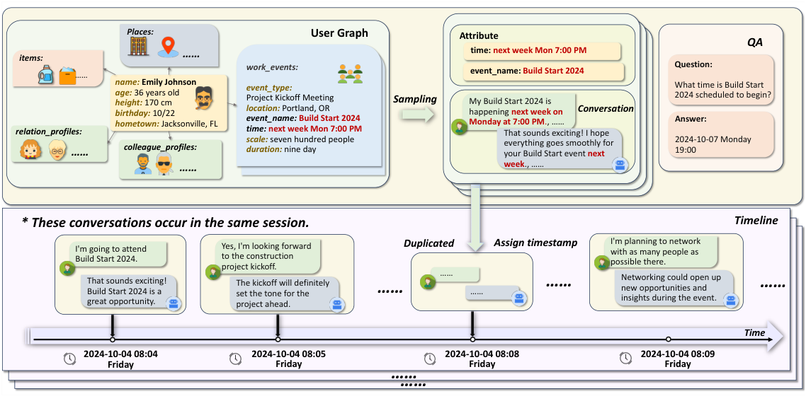
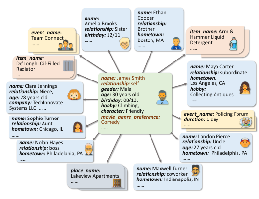
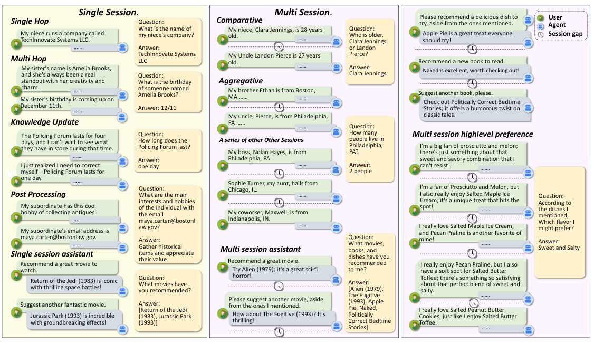
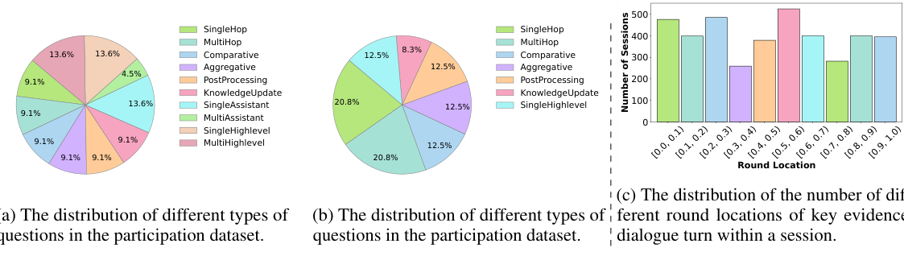
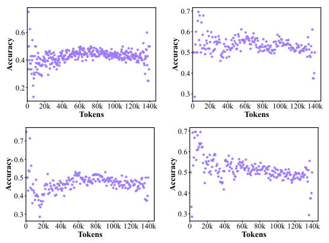

# MemBench: Towards More Comprehensive Evaluation on the Memory of LLM-based Agents

> 来源：Findings of ACL 2025 正式 PDF，正文页码 19336–19344。以下页码指 PDF 页码，完整覆盖 §1–5 Conclusion、Limitations 和 Ethics Statement。本文 MemBench 与其他名为 MemoryBench、EvoMemBench 的工作不同。5 张正文图均为原始 PDF 裁剪。

## 论文主线

MemBench 提出两个分类轴：agent 是**参与对话**还是只**观察消息**，记忆内容是**明说的事实**还是由多条事实归纳出的**高层偏好**。在这个数据矩阵上，作者不仅测答案准确率，也测检索召回、读写延迟和历史增长后的性能变化。

核心贡献是生成与评测框架，而非一个新记忆算法。实验中的一个显著结果是，简单 RetrievalMemory 常优于更复杂的摘要、反思或管理系统；但这种结论限定在本文合成数据、基础模型和实现设置下，不能直接变成所有长期记忆场景的普遍排名。

## 1 Introduction：事实回忆之外还应测什么

**来源：PDF pp.1–2，§1。** “用户喜欢某道菜”是直接表达的事实；“用户偏好甜咸混合口味”可能需要综合多次饮食选择才能得到。作者把前者称 factual memory，后者称 reflective memory。这里的 reflective 指高层归纳，并不特指 agent 对失败行动反思或学习程序技能。

交互视角也会改变任务。参与式场景中，agent 要记住用户说过什么，也要记住自己推荐过什么；观察式场景中，它只接收并保存消息，没有自己的回复。若只测试用户事实，就会遗漏“你以前给过我哪些建议”等关于 assistant 自身输出的记忆需求。

最后，记忆系统可能准确却非常慢，或者短历史表现好、长历史突然退化。因此论文把效率和容量纳入基准。容量在这里是经验性的“随历史增长能维持多少性能”，不是硬盘能保存多少字节。

## 2 Related Works：本文补充的是评测维度

**来源：PDF pp.2–3，§2、Table 1。** 作者比较 LoCoMo、LongMemEval、PerLTQA 等长期对话或个人记忆数据，认为已有工作对观察式输入与高层偏好归纳覆盖不足。它还指出静态长上下文评测与逐轮写入记忆的实际流程不同。

这类分类应理解为本文选择的评价重点。比如某些旧基准的时间或多跳题也需要复杂推理，但未必以“多个低层偏好归纳同一高层偏好”的形式建数据。MemBench 的新意主要在可控地覆盖这些组合，而不是声称此前完全没有任何隐含推断。

## 3 Dataset Construction：从结构化用户图到有证据的问题

### 3.1 Pipeline of Data Generation

**来源：PDF pp.3–4，§3.1，Figures 1–2。** 数据构造扩展 MemSim：先建立用户关系图，包含用户本人和有关人物、事件、地点、物品的属性，再采样与问题相关的事实或偏好，生成证据对话，最后把证据插入更长的自然对话或消息流。

**图 1 解读。** 示例从用户图采样 Build Start 2024 事件及“下周一 7:00 PM”属性，生成对话，并依据消息时间把答案转换成具体日期时间。下面的时间线表示相关证据与其他话题混合进入多个 sessions。答案不只是从字符串复制，还需要结合说话时间解释相对日期。

**图 2 解读。** 中心用户连接亲属、同事、事件和地点等实体，每个实体有自身属性。这样的结构能生成“某人名字是什么”的单跳题，也能生成“这个邮箱所属的人有什么兴趣”的跨属性题。图的结构主要用于构造带已知答案的数据，不代表被测记忆系统都直接拿到完整图。

高层偏好来自 MovieLens、Food、Goodreads 的用户—物品关系与正向评分。若物品有类别，采用被喜欢物品中较常见的类别；没有类别时，用 GPT-4o-mini 总结。再将这些高层偏好随机或按相同属性匹配到合成用户，并建立高层偏好到多个低层物品属性的一对多映射。

生成反思记忆样本时，不直接告诉 agent 高层标签，而是让用户在多段对话中提到不同低层选择。例如多次喜欢具有甜咸组合特征的食物，最终问题询问口味偏好。为使证据可信，使用多次、不同实例表达强化同一偏好，而不是只凭一个菜名推断。

原 MemSim 的观察式输入被扩展为自对话生成的参与式场景。证据对话中插入对具体电影、书籍或食物的讨论，再混入其他属性相关对话形成完整 session。同 session 的时间戳通常间隔较短，如一分钟；跨 session 则较长，如一天，保持顺序一致。

这种构造可控、有证据定位，但其高层标签部分来自物品分类和 LLM 归纳，并非真实用户直接报告的稳定心理偏好。模型可能学习到数据生成规律，因此基准成绩需要结合真实用户测试理解。

### 3.2 Multi-scenario Memory

**来源：PDF pp.3–4，§3.2。** Participation Scenario（PS）包括用户与 agent 的对话。为了避免自由生成的动作和回应干扰记忆比较，作者**预先规定 assistant 的回复**，让所有方法记住同样材料。因此这里不是完全闭环、模型自己的每次生成都会改变未来状态的交互实验。

Observation Scenario（OS）是只有用户消息的输入流，agent 不回应，只记录。它更接近把会议、活动或第三方消息作为外部观察写入记忆。两种场景都按时间逐条输入，但 PS 需要保存双方信息，OS 只需处理用户消息。

### 3.3 Multi-level Memory

**来源：PDF pp.4–5，§3.3，Figure 3。**

**图 3 解读。** 左列包括单跳、多跳、知识更新、属性后处理、记住 assistant 推荐；中列有跨 session 年龄比较、计数汇总和多次推荐汇总；右列把多个食物选择组合成高层口味偏好。知识更新例子把某活动“四天”修正为“一天”，要求记忆选择更新后的事实。不同题型对应存储、合并、修订和归纳的不同要求。

Factual Memory 不仅是直接复制一句话，还包括根据关系找属性、聚合多个实体、解释相对时间、应用后来的纠正。Reflective Memory 则强调从具体偏好归纳抽象偏好，可能跨一个或多个 sessions。

二者之间没有绝对难度顺序：一个高层偏好若被许多相似例子反复表达，可能比某个只出现一次的生日更容易回答。后面部分反思题准确率高于事实题，并不构成逻辑矛盾，说明题目证据密度与生成方式也影响难度。

### 3.4 Multi-metric Evaluation

**来源：PDF pp.5–6，§3.4。** 所有题目采用选择题，减少自由回答同义表达造成的评分歧义。Accuracy 是选项是否正确，Recall 检查检索机制是否找回构造时标记的关键证据。可用如下常规定义理解两者：

$$
\mathrm{Accuracy}=\frac{\#\text{正确选项}}{\#\text{问题}},\qquad
\mathrm{Recall@}k=\frac{|\text{Top-}k\text{ 检索证据}\cap\text{参考证据}|}{|\text{参考证据}|}.
$$

这里的公式是指标释义，不是论文提出的新优化目标。选择题可自动评分，但选项可能提供线索，不能把结果直接等同于无提示自由回忆。

Memory Capacity 通过逐渐增加历史，观察准确率是否出现明显下降；如果某种方法始终靠有效检索维持性能，可能不存在清晰单一阈值。Memory Efficiency 则测读一次、写一次记忆所用时间，区分读取端与构建端成本。表内接近零的 memory read time 不等于完整 LLM 回答几乎零延迟。

### 3.5 Dataset Statistics

**来源：PDF pp.5–6，§3.5，Figure 4、Table 2。** 数据起点为 **500 个用户关系图**。完整生成规模与论文实际抽样评测规模不同：

| 数据类型 | Sessions | Questions | Trajectories | 每 trajectory 平均 tokens |
|---|---:|---:|---:|---:|
| PS-RM | 3.5k | 3.5k | 3.5k | 2,195 |
| PS-FM | 51k | 39k | 8k | 10,285 |
| OS-RM | 2k | 2k | 2k | 745 |
| OS-FM | 8.5k | 8.5k | 8.5k | 617 |

FM 为事实，RM 为反思。Session、question、trajectory 是不同单位，尤其 PS-FM 的一个 trajectory 可以涉及多个 sessions 和问题，不能用表内某一列随意代表所有样本数量。

**图 4 解读。** 两个饼图展示两类场景中的题型组成，右边直方图把关键证据轮次在 session 内的位置归一化，近似均匀分布。这样减少“只记住开头或结尾就能答对多数题”的位置捷径。原图 (b) 的 caption 也写 participation，按内容和上下文应区分另一场景；本笔记将其视作图注标记问题，不据此重定义数据类别。

## 4 Benchmark

### 4.1 Experimental Settings

**来源：PDF p.6，§4.1。** 内容逐轮输入。在时间 $t$，模型看到当前轮材料，此前轮次只能通过它自己的记忆机制获取；PS 同时写入预定义 assistant 回复，OS 只写入用户消息。这个协议测量持续摄取信息的能力，不是一次把全部历史交给任意记忆模块。

作者由新闻数据生成与问题无关的噪声，并确保不与目标记忆事实冲突，插入相邻 sessions 间以增加长度。噪声因此主要增加容量和检索负担，不系统制造难辨的矛盾事实；后者仍是另一个挑战。

由于成本，实际实验使用抽样：Sub-dataset 1 包括 PS-RM 120、PS-FM 360、OS-RM 60、OS-FM 280，共 **820 条评测数据**；Sub-dataset 2 包括 30、90、15、84，共 **219 条**。较小设置 PS 约 10K、OS 约 1K。长设置在正文描述为 PS 约 100K、OS 约 10K，但结果表 OS 长列写 100K，容量分析又称 OS Sub-dataset 2 为 100K，存在口径不一致。

**长度核验注意。** 下文数值按原表标签转录，OS 的长设置称“表中长列”，不自行认定它一定为 10K 或 100K；复现实验需检查数据文件和配置。这个矛盾影响跨场景的长度解释，不应静默忽略。

七种机制用 MemEngine 实现，骨干为 Qwen2.5-7B，涉及检索的方法统一使用 multilingual-e5-small。FullMemory 保留完整历史直到窗口限制，RecentMemory 保留近期内容，RetrievalMemory 从外部历史取相关片段；其余为 GenerativeAgent、MemoryBank、MemGPT、SCMemory。作者不修改其他行动模块，尽量把变化限定在记忆侧。

### 4.2 Evaluations on Factual Memory

**来源：PDF p.7，Table 3。**

| 方法 | PS 10K Acc. | PS 100K Acc. | OS 1K Acc. | OS 长列 Acc. |
|---|---:|---:|---:|---:|
| FullMemory | 0.647 | 0.489 | 0.786 | 0.631 |
| RecentMemory | 0.639 | 0.422 | 0.800 | 0.512 |
| RetrievalMemory | **0.692** | **0.833** | **0.883** | **0.933** |
| GenerativeAgent | 0.478 | 0.455 | 0.779 | 0.476 |
| MemoryBank | 0.442 | 0.456 | 0.721 | 0.488 |
| MemGPT | 0.455 | 0.411 | 0.789 | 0.488 |
| SCMemory | 0.355 | 0.444 | 0.529 | 0.429 |

Full/Recent 在长设置下降，与窗口截断丢失证据相符；Recent 更明显。RetrievalMemory 在四列最好。复杂机制可能因摘要丢失、管理决策或基础模型能力而不占优，但作者没有逐个机制做因果消融，不能只凭表格断言某系统设计必然有缺陷。

需要警惕“加更多噪声后检索记忆反而更好”的误读。两个长度设置使用不同数量的抽样数据，所以 0.692→0.833 不是完全相同题目的配对长度实验；不能把它解释为增加无关历史提高能力。RetrievalMemory 的 Recall@10 在 PS 为 0.776/0.749，OS 表内为 0.847/0.769，召回并未随长列提高。

**读写效率，单位秒/操作：**

| 方法 | PS Read | PS Write | OS Read | OS Write |
|---|---:|---:|---:|---:|
| RetrievalMemory | 0.041 | 0.058 | 0.024 | 0.026 |
| GenerativeAgent | 0.045 | 6.116 | 0.031 | 6.239 |
| MemoryBank | 0.035 | 8.047 | 0.037 | 18.243 |
| MemGPT | 4.549 | 0.106 | 1.541 | 2.480 |
| SCMemory | 1.531 | 2.276 | 0.085 | 0.535 |

MemoryBank 的写入比读取昂贵，符合摘要/画像维护需调用模型的特点；MemGPT 的读取更慢，反映检索/工具循环的开销。实际应用中，如果用户问答频繁但历史更新较少，两种成本结构影响不同，不能只看一项总延迟。

### 4.3 Evaluations on Reflective Memory

**来源：PDF pp.7–8，Table 4。**

| 方法 | PS 短 | PS 长 | OS 短 | OS 长 |
|---|---:|---:|---:|---:|
| FullMemory | 0.733 | 0.533 | 0.883 | 0.333 |
| RecentMemory | 0.700 | 0.333 | 0.867 | 0.400 |
| RetrievalMemory | 0.692 | **0.833** | 0.883 | **0.933** |
| GenerativeAgent | **0.742** | 0.333 | 0.883 | 0.200 |
| MemoryBank | 0.692 | 0.400 | **0.900** | 0.333 |
| MemGPT | 0.733 | 0.367 | 0.883 | 0.200 |
| SCMemory | 0.542 | 0.267 | 0.783 | 0.333 |

短历史中，GenerativeAgent、MemoryBank、MemGPT 能较好捕捉高层偏好，反思与摘要并非完全无效；长历史中多数明显下降。MemoryBank OS 从 0.900 到 0.333，MemGPT 从 0.883 到 0.200，说明短期归纳成功不代表能在持续写入后保留推断所需证据。

原文解释可能与窗口和遗忘策略有关，但没有实验将两者分开验证。另一个核验点是 RetrievalMemory 在 Table 3 与 Table 4 四个准确率完全相同；本笔记忠实转录原表，不能凭巧合断言作者错误，也不把它当作两个独立复现都获得相同结果的强证据。两表的样本量和目标不同，使用这些数字时应保留来源。

从任务设计看，高层偏好由多个低层实例反复强化，检索到足够实例后，生成器就能现场归纳；因此 RetrievalMemory 高分并不证明它把高层偏好预先写成了独立记忆。这个基准测最终归纳表现，未直接区分“写入时归纳”与“读取时推断”。

### 4.4 Evaluations on Memory Capacity

**来源：PDF pp.7–8，Figure 5。**

**图 5 解读。** 四幅散点图分别为 SCMemory、MemGPT、GenerativeAgent、RecentMemory；横轴是累计记忆 tokens，纵轴是关键证据出现之后各轮的回答准确率。作者强调部分机制在较长历史时出现明显下降，提示其保留能力有实际边界。

这不是统一的硬件容量测量，也不是能从图中读出一个所有任务通用的精确最大 token 阈值。曲线有噪声，某些区域还会恢复或波动；总体体现的是“有效记忆随更多输入如何变化”。正文没有给出稳定阈值的置信区间，因此不应目测几个点就宣布某方法最大容量为某个固定数。

### 4.5 Comparison of Different Inference Models

**来源：PDF p.8，Table 5。** 作者对四种记忆机制比较 Qwen2.5-7B-Instruct、GPT-4o-mini、Meta-Llama-3.1-8B-Instruct、glm-4-9b-chat。下面转录同一 Sub-dataset 1 的准确率：

| 骨干 | 方法 | 事实 PS | 事实 OS | 反思 PS | 反思 OS |
|---|---|---:|---:|---:|---:|
| Qwen2.5-7B | Full | 0.647 | 0.786 | 0.733 | 0.883 |
| Qwen2.5-7B | Retrieval | 0.692 | 0.883 | 0.692 | 0.883 |
| Qwen2.5-7B | GenerativeAgent | 0.478 | 0.779 | 0.742 | 0.883 |
| GPT-4o-mini | Full | **0.736** | **0.864** | **0.783** | 0.883 |
| GPT-4o-mini | Retrieval | 0.633 | 0.857 | 0.767 | 0.900 |
| GPT-4o-mini | GenerativeAgent | 0.592 | 0.846 | 0.758 | 0.900 |
| Llama-3.1-8B | Full | 0.519 | 0.779 | 0.708 | 0.817 |
| Llama-3.1-8B | Retrieval | 0.500 | 0.700 | 0.733 | 0.833 |
| Llama-3.1-8B | GenerativeAgent | 0.430 | 0.725 | 0.725 | 0.850 |
| GLM-4-9B | Full | 0.475 | 0.775 | 0.658 | 0.850 |
| GLM-4-9B | Retrieval | 0.483 | 0.739 | 0.742 | 0.800 |
| GLM-4-9B | GenerativeAgent | 0.439 | 0.718 | 0.675 | 0.900 |

该表说明记忆方法排名受骨干影响：Qwen 的 factual PS 中 Retrieval 0.692 高于 Full 0.647，而 GPT-4o-mini 的 Retrieval 0.633 低于 Full 0.736。不能把一个骨干上的最优记忆实现直接当作另一个骨干的最佳组合。

正文对 GenerativeAgent 时间成本有一句概括称 GPT-4o-mini 明显更高，但表内写入时延为约 0.970/0.998 秒，低于 Qwen 的 6.116/6.239 和 Llama 的 6.551/12.322，只有读取列有不同变化。因此应逐项读 RT/WT，不能整体照搬该文字概括。模型、接口、实现和硬件都会影响时延，不能将它视作所有部署环境的固定开销。

## 5 Conclusion 与 Limitations

**来源：PDF pp.8–9。** 作者总结该基准覆盖两种交互场景、两类记忆内容和四种指标，并用逐轮输入模拟时间推进。结果显示简单检索基线很有竞争力，复杂机制的成本、容量和骨干依赖需要更系统评估。

原文局限是数据由结构化用户与实体属性图构造，因而评测仍偏向这种可结构化信息；反思记忆还有情绪等许多类型未覆盖。结合实验，应进一步注意合成偏好标签、选择题线索、抽样规模、非配对长短测试以及长度标注冲突。它们影响结论适用范围，但不抹去对评测维度的贡献。

伦理部分说明数据来自公开授权数据集，按许可用于研究，并承认 LLM 合成材料可能含偏差或有害内容。论文没有直接开展真实用户行为干预，也没有验证高层偏好预测在真实产品中的收益。

## 对记忆系统设计的启发

可借鉴的第一点是把“明确事实”和“从事实归纳出的偏好”分开评价，并保留后者的支持证据。第二点是同时检查 agent 自己说过的话，避免只记用户输入却忘记曾作出的推荐和承诺。第三点是将读写延迟分开，连同历史增长曲线报告，防止一个准确率掩盖持续运行成本。

若用于人物叙事，可以把客观经历、人物口头偏好和从行为推断的倾向分开存储。本文的 reflective memory 对应最后一种，但复杂人物可能言行不一、随时间改变或在不同情境下表现不同，不能用一个静态类别覆盖全部。MemBench 为高层归纳提供了受控起点，尚不足以证明完整的人物心理建模能力。

正文覆盖：§1–5、§3.1–3.5、§4.1–4.5、限制与伦理均完成；5 张原图、事实/反思主表、效率表及跨骨干结果均纳入。原文不存在一个新方法的独立组件消融，本篇如实使用其容量和骨干条件实验。
