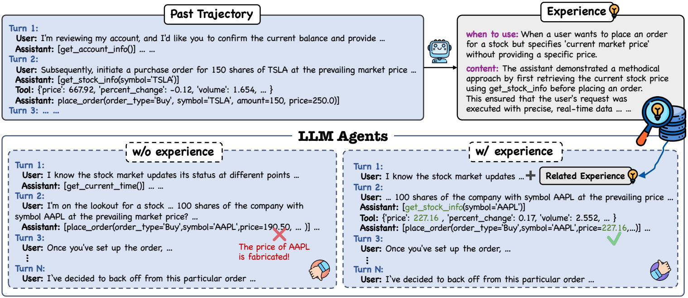
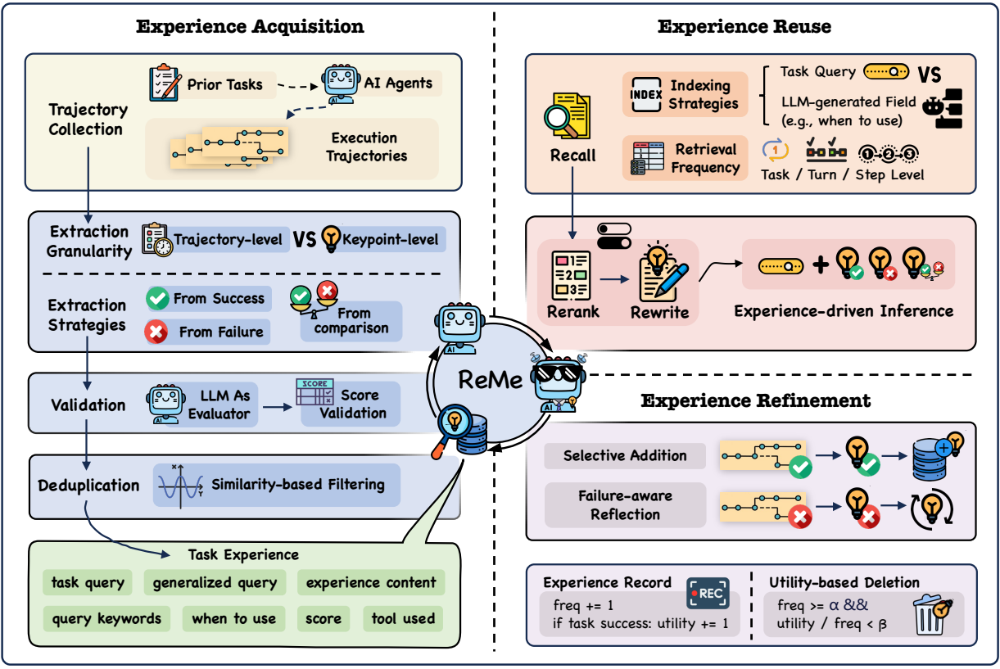
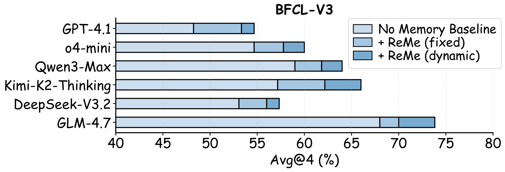
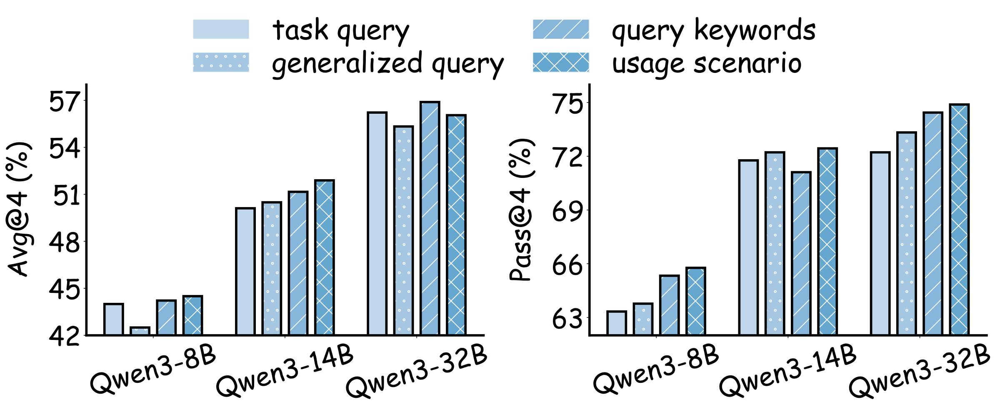
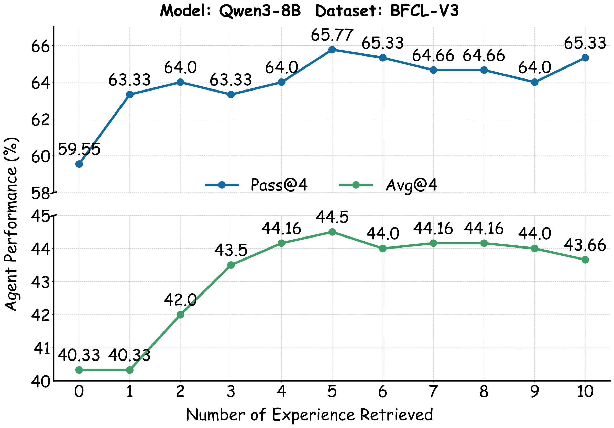
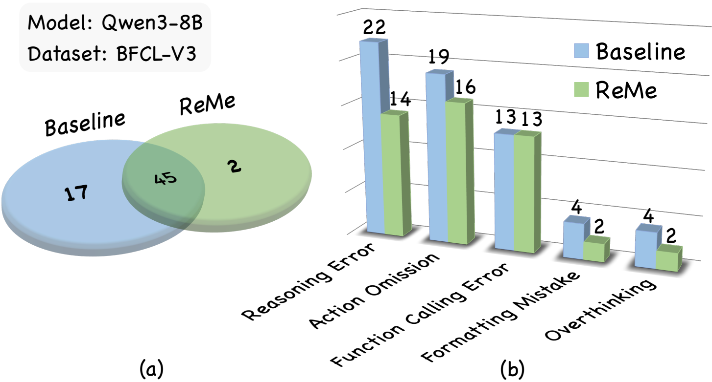

# Remember Me, Refine Me: A Dynamic Procedural Memory Framework for Experience-Driven Agent Evolution

## 一句话总结

ReMe 将 LLM agent 的 procedural memory 从“静态追加式经验库”改造成“经验获取、经验复用、经验精炼”的闭环系统：它从成功与失败轨迹中提炼细粒度可复用经验，在新任务中按使用场景检索并自适应改写经验，再根据执行反馈增删记忆，从而提升工具使用型 agent 在 BFCL-V3 和 AppWorld 上的任务成功率。

## 研究问题

论文关注的是 LLM agent 如何在不重新训练模型参数的情况下，通过 procedural memory 持续改进“怎么做任务”的能力。作者认为已有记忆增强 agent 主要受限于“passive accumulation”：要么存储完整轨迹，要么把整条轨迹粗略总结成 workflow，检索后也常直接套用，缺少面向当前任务的适配；同时，经验池长期只增不减，会混入失效经验或有害噪声。论文要解决的核心问题是：如何构建一个动态 procedural memory 系统，使其能从噪声轨迹中提炼高质量经验、在新任务中按上下文有效复用，并持续维护一个紧凑可靠的经验池。

## 核心方法

ReMe 围绕记忆生命周期设计了三个阶段。第一，experience acquisition 阶段将单条经验表示为 $E=\langle \omega, e, \kappa, c, \tau \rangle$，其中 $\omega$ 描述经验适用场景，$e$ 是核心经验内容，$\kappa$ 是关键词，$c$ 是置信度，$\tau$ 是使用过的工具；系统对每个训练任务采样多条轨迹，再让 summarizer 从成功模式、失败原因和成功/失败对比中提炼经验，并通过 LLM-as-a-Judge 验证与相似度去重后存入经验池。第二，experience reuse 阶段用 usage scenario 作为索引键检索 top-$K$ 相关经验，并可加入 reranker 与 rewriting module，把历史经验重组为更贴合当前任务约束的指导。第三，experience refinement 阶段让经验池动态演化：成功新轨迹可被选择性加入；失败轨迹先触发 failure-aware reflection，若基于反思后的重试成功才把相关经验写入记忆；已存经验则记录检索次数 $f$ 与成功效用 $u$，当 $f \geq \alpha$ 且 $u/f \leq \beta$ 时被删除。实验在 BFCL-V3 和 AppWorld 上验证该闭环，作者特别强调 Qwen3-8B + ReMe 可超过无记忆的 Qwen3-14B，作为 memory-scaling effect 的证据。

## 分章节阅读笔记

### 1 Introduction

Introduction 的作用是把论文的问题定位从一般的 LLM agent 能力提升，收束到 procedural memory 的生命周期管理。作者的起点是：LLM 正在从静态语言模型转向能够迭代推理、调用工具、处理动态任务的 autonomous agents；在这种场景中，如果每次遇到任务都重新试错，成本高且容易重复失败。因此，procedural memory 被定义为从过往交互中内化的“how-to”知识，它不是记事实，而是记“在什么条件下应该怎样做”。

Figure 1 用股票交易任务说明 procedural memory 的实际价值。左上角的 past trajectory 显示 agent 过去处理过类似任务：用户要求按当前市场价购买股票，正确策略是先调用 `get_stock_info` 获取实时价格，再用真实价格下单。右上角的 experience 把这条轨迹抽象成可复用经验：当用户要求按当前市场价下单但没有提供具体价格时，应先查询当前价格。下方对比说明，如果没有经验，agent 可能直接编造 AAPL 的价格并下单；如果检索到相关经验，它会先查实时价格，再用返回价格执行订单。这个例子支撑了引言的核心主张：经验不能只是原始轨迹存档，而要被提炼成可迁移、可触发、可操作的 procedural knowledge。

在此基础上，作者提出理想 procedural memory 系统应满足三个标准。第一是 high-quality extraction，即从有噪声的执行轨迹中提炼泛化经验，而不是保存完整轨迹或具体任务片段。第二是 task-grounded utilization，即检索到的记忆不能机械套用，而要根据当前任务的约束进行适配。第三是 progressive optimization，即记忆池必须能持续更新，强化有效经验并清除过时经验，否则长期运行后会变成“有效洞见 + 有害噪声”的混合体。

作者对现有工作的批评集中在 passive accumulation paradigm。现有方法常把 memory 当作静态 append-only archive：一类方法保存原始完整轨迹，另一类方法总结整条轨迹级别的 workflow。前者粒度太粗、包含大量无关细节；后者虽有抽象，但仍可能停留在轨迹级别，难以捕捉任务中的关键决策点。更重要的是，许多系统检索到经验后缺少上下文适配，也缺少及时删除机制，导致轻微场景变化时经验可能误导 agent，长期运行时经验池质量下降。

ReMe 因此被定义为一个从 passive storage 转向 feedback-driven evolution 的框架。引言中概括了三项设计：multi-faceted distillation 负责从成功模式、失败触发点、成功/失败对比中提炼细粒度经验；context-adaptive reuse 负责用 usage scenario indexing、reranking 和 adaptive rewriting 让历史经验贴合新任务；utility-based refinement 负责根据新轨迹与历史效用更新经验池，加入可靠经验并删除低效经验。这里已经预告了 Methodology 的三段结构：experience acquisition、experience reuse、experience refinement。

实验动机在引言末尾被放大为 memory-scaling effect。作者声称 ReMe 在 BFCL-V3 与 AppWorld 上达到新的 agent memory system SOTA，并且 Qwen3-8B + ReMe 能超过无记忆的 Qwen3-14B。这一表述的重点不是“记忆一定替代模型规模”，而是给出一个研究判断：高质量、可演化的外部 procedural memory 可能是一条比单纯增大模型参数更高效的 lifelong learning 路径。

这一章的贡献陈述有三层：方法上提出 ReMe 的闭环 procedural memory；资源上发布 `reme.library` 这种细粒度 procedural memory 数据集；实验上证明该框架能跨基准提升工具使用 agent，并呈现小模型借助记忆追上或超过大模型无记忆版本的现象。整体来看，引言完成的是问题建模：LLM agent 的关键瓶颈不只是“能不能存经验”，而是“能不能把经验变成可抽象、可适配、可维护的长期程序性知识”。

### 2 Related Works

Related Works 的作用是为 ReMe 找到一个更精确的位置：它不是一般意义上的 agent memory，也不只是经验检索，而是面向 agent 行动过程的 procedural memory lifecycle。作者把相关工作压缩成两个方向，分别回答“agent 为什么需要记忆”和“已有经验学习方法哪里不够”。

第一类是 memory-enhanced LLM agents。作者先指出 LLM agent 已经被用于金融、教育、个性化助手等复杂互动场景，这些任务共同要求 agent 能保存探索过的信息，并在后续推理或行动中复用。这里的 memory 被分成两类：parametric memory 和 non-parametric memory。Parametric memory 指把长期知识编码进模型参数，例如通过训练或专门的 world-knowledge model 让模型内部掌握任务规律；non-parametric memory 则指外部知识库、数据库、经验池等，不改模型权重，而是在推理时把相关信息取回并加入上下文。ReMe 显然属于后一类，但它进一步强调外部记忆的内容不是事实知识，而是可指导行动的“how-to”经验。

作者列举的 WKM、AWM 和 MARK 分别代表不同记忆形态。WKM 偏向把世界知识模型化，用于 agent planning；AWM 从过往经验中自动归纳任务 workflow，服务 web navigation；MARK 则构建用户偏好记忆，面向个性化对话。它们说明 memory-enhanced agents 已经是一个成熟方向，但这些工作关注的记忆对象不同：有的是世界知识，有的是工作流，有的是用户偏好。ReMe 的差异在于，它聚焦 procedural memory，也就是工具调用和多步任务中“该如何执行”的经验。

第二类是 experience learning strategies。这一部分更直接连接 ReMe 的问题设定：LLM 可以通过收集经验、回忆相关知识来改善决策。作者把 experience learning 的核心概括为两个动作：从历史交互中抽取可用信息来更新经验池，以及在新任务中检索有效经验辅助生成响应。早期方法如 Synapse、HiAgent 保存完整轨迹作为经验，这种做法保留细节多，但也带来两个问题：长交互历史难管理，且缺少抽象，导致泛化能力有限。

后续方法开始转向结构化经验总结与上下文感知检索。例如 Agent KB 提炼 generalizable experience units，并用 teacher-student dual-phase retrieval 支持复杂 agentic problem solving；CER 提炼细粒度技能和环境动态，使 agent 能在新任务中增强自身。这些工作已经接近 ReMe 的方向，因为它们不再满足于存原始轨迹，而开始强调可泛化经验和检索机制。

ReMe 对这些工作的主要推进点在于经验维护。作者认为现有方法即使能提炼和检索经验，也普遍忽视 strategic experience removal。这个批评很关键：经验池不是越大越好，因为即使经过人工或模型验证，仍可能存在有害经验；而且一开始有用的经验也会随任务分布、模型能力或环境变化而退化。因此，ReMe 把“删除低效/过时经验”提升为和“抽取经验、检索经验”同等重要的机制。

这一章的逻辑可以概括为：memory-enhanced agents 证明了外部记忆对 agent 有价值；experience learning methods 证明了从轨迹中抽取经验并检索复用是可行的；但现有方法大多停留在静态或半静态经验池，缺少闭环维护。ReMe 正是在这个缺口上提出动态 procedural memory framework，把经验的获取、使用和精炼串成一个持续演化的系统。

### 3 Methodology

Methodology 是论文的主体方法章节，任务是把引言中的三个理想条件落实成一个可执行框架。ReMe 的设计并不是单个检索模块，而是一个 procedural memory lifecycle：先把历史任务轨迹压缩成结构化经验，再在新任务中检索、排序、改写这些经验，最后根据执行结果对经验池增删维护。这个章节的关键是理解三件事：经验的结构化表示、经验如何被检索和适配、经验池如何避免越积越乱。

Figure 2 展示了 ReMe 的整体闭环。左侧是 Experience Acquisition：从 prior tasks 中收集 execution trajectories，再按粒度和策略抽取经验，经过 validation 与 deduplication 后写入 task experience pool。右上是 Experience Reuse：面对新 task query 时，系统根据索引策略召回经验，再通过 rerank 和 rewrite 变成面向当前任务的指导。右下是 Experience Refinement：成功轨迹可以 selective addition，失败轨迹先触发 failure-aware reflection；同时每条经验会记录使用频次和成功效用，低效经验会被 utility-based deletion 清除。整张图强调的不是“有一个经验库”，而是经验库会在 agent 执行过程中持续变形。

### 3.1 Overview of ReMe

Overview of ReMe 给出三阶段框架。Experience acquisition 阶段负责从 agent 过去生成的成功和失败轨迹中提炼 actionable knowledge，输出结构化经验池；experience reuse 阶段负责在新任务到来时从经验池中召回相关经验，把它们加入 agent 上下文，从而改善推理与行动；experience refinement 阶段负责根据新的执行反馈继续优化经验池，加入可靠新经验并删除失效经验。

这个 overview 的核心含义是：ReMe 把 memory 看成一种会参与 agent 行动循环的状态，而不是推理前静态加载的一批文本。Acquisition 对应“学到什么”，reuse 对应“怎么用”，refinement 对应“用完以后如何修正记忆”。这三步共同把 procedural memory 从 append-only archive 变成 feedback-driven memory system。

### 3.2 Experience Acquisition

Experience Acquisition 先定义经验的格式。论文把 agentic experiences 记为 $\mathcal{E}$，单条经验 $E$ 表示为 $E=\langle \omega, e, \kappa, c, \tau \rangle$。其中 $\omega$ 是 when-to-use 场景，说明什么情况下应该调用这条经验；$e$ 是经验正文，也就是具体的行动原则或避免错误的提示；$\kappa$ 是关键词集合，用于分类和检索辅助；$c$ 是置信度分数；$\tau$ 是该经验涉及的工具。这个表示的关键是把“经验”拆成可索引、可评估、可复用的字段，而不是只存一段自然语言总结。

初始经验池来自训练任务中的探索轨迹。执行 agent $\text{LLM}_{execute}$ 在环境中完成任务，对每个任务 query $q$ 采样 $N$ 条轨迹。多次采样的意义在于制造不同执行路径：有些成功、有些失败、有些中间决策不同。这样 summarizer 才能不仅看到“成功答案是什么”，还看到“哪些关键步骤导致成功或失败”。

论文用 $\text{LLM}_{summ}$ 做三类互补提炼。Success pattern recognition 从成功轨迹中识别有效策略，提炼其背后的可复用原则；failure analysis 从失败轨迹中找早期错误、无效做法和可避免的陷阱；comparative analysis 同时比较成功与失败轨迹，定位二者之间真正区分结果的关键动作。三者组合的意义是避免经验只偏向正例模板：成功告诉 agent 应该做什么，失败告诉 agent 不要做什么，对比则帮助找出最有判别力的步骤。

提炼后的经验还要经过 validation 和 deduplication。Validation 使用 LLM-as-a-Judge 判断经验是否 actionable、accurate、valuable，也就是是否能真的指导后续 agent 执行。Deduplication 则把新经验编码成向量，与已有经验计算 cosine similarity，如果相似度超过阈值就丢弃，防止经验池被重复内容撑大。最终保留下来的经验按 usage scenario $\omega$ 的 embedding 建索引，存入向量数据库。这里选择 $\omega$ 作为核心索引很重要，因为检索目标不是找文字相似的原任务，而是找“当前任务适用的经验场景”。

### 3.3 Experience Reuse

Experience Reuse 说明新任务如何使用经验池。给定当前任务，retriever 会编码 task query，并与经验池中按 usage scenario 建立的向量表示计算 cosine similarity，取 top-$K$ 条相关经验。这些经验相当于 in-context learning demonstrations，但它们不是完整示例，而是经过压缩的 procedural hints，用来指导 $\text{LLM}_{execute}$ 的下一轮推理和工具调用。

ReMe 在简单检索之后加入了两步适配。第一步是 context-aware reranker $\text{LLM}_{rerank}$，它不只看向量相似度，还根据当前任务的具体上下文、约束和目标重新判断哪些经验更有用。第二步是 rewriting module，它把多条原始经验重组为 cohesive、task-specific guidance。换言之，系统不是把检索到的记忆原样塞进 prompt，而是把它们改写成更贴近当前任务的行动建议。

这个小节的关键是“reuse 不等于 retrieval”。作者强调历史经验与新任务通常不会完全一致，直接套用可能失败。因此 ReMe 通过 retrieval、reranking、rewriting 三步，把外部经验从“可召回文本”转化为“当前任务可执行指导”。论文还把这一步解释为 exploitation 与 exploration 的平衡：有用经验帮助 agent 利用过去知识；当经验并不完全匹配时，改写和上下文适配让 agent 保持一定灵活性，而不是僵硬复现过去轨迹。

### 3.4 Experience Refinement

Experience Refinement 是 ReMe 与许多静态经验库方法的主要差异。作者指出，静态经验池无法适应任务分布变化或模型能力变化，过去相关的经验可能逐渐变得无关甚至有害。因此 refinement 负责动态更新经验池，主要包括 selective addition、failure-aware reflection 和 utility-based deletion。

Selective addition 讨论新经验应该何时加入经验池。论文比较 full addition 和 selective addition：full addition 会把所有新轨迹都总结后加入，不管成功还是失败；selective addition 只把成功轨迹提炼出的经验加入。作者认为 full addition 容易不如 selective addition，因为在线执行时单条失败轨迹上下文不足，直接从单次失败中总结经验可能产生误导；相比之下，成功轨迹通常更稳定地提供可靠、可执行的步骤。因此 ReMe 默认更谨慎地加入新经验。

Failure-aware reflection 保留了从失败中学习的可能性，但加了一个质量门控。遇到失败时，$\text{LLM}_{summ}$ 会分析失败尝试并提炼潜在改进点，然后让 $\text{LLM}_{execute}$ 基于这些反思再试。如果重试成功，对应经验才会写入记忆；如果仍失败，就不写入经验池。论文还限制最多 self-reflection 3 次，避免由于模型能力上限或任务本身困难导致无限循环。这里的设计思想是：失败本身不一定可信，但“能让后续尝试成功的失败反思”更可能是有价值经验。

Utility-based deletion 负责删除过时或低效经验。ReMe 为每条经验记录两个量：总检索次数 $f$，以及历史效用 $u$。当一次被召回的经验帮助任务成功时，$u$ 增加 1；每次被召回时，$f$ 记录使用频次。删除规则是：

$$
\phi_{remove}(E) =
\begin{cases}
\mathbf{1}\left[\frac{u(E)}{f(E)} \leq \beta\right], & \text{if } f(E) \geq \alpha, \\
0, & \text{otherwise}.
\end{cases}
$$

这个公式的含义是：只有经验被检索至少 $\alpha$ 次后，系统才有足够证据评估它；如果它的成功效用比例 $u(E)/f(E)$ 低于阈值 $\beta$，就把它视为低效经验并删除。这样可以避免刚加入的新经验因为样本太少被误删，也可以防止高频但无效的经验长期占据经验池。

Methodology 的整体逻辑是把 procedural memory 拆成“生产、使用、维护”三个相互连接的机制。Acquisition 解决经验从哪里来、如何结构化；reuse 解决经验如何在新任务中变成上下文指导；refinement 解决经验池如何持续保真。这个闭环支撑了后续实验中的 fixed 与 dynamic 版本对比：fixed 只使用已有经验池，而 dynamic 额外执行在线添加、反思和删除，因此更能体现 ReMe 的自演化假设。

### 4 Experiments

Experiments 章节承担两个验证任务：一是证明 ReMe 相比无记忆和现有 memory baselines 能提高 agent 任务成功率；二是拆开方法组件，证明细粒度经验抽取、动态经验池维护、rerank/rewrite、usage scenario indexing 和合适的检索数量都对最终效果有贡献。整体实验逻辑与 Methodology 对应很紧：主结果验证闭环框架，消融验证 acquisition、reuse、refinement 三个阶段的关键设计。

### 4.1 Experimental Settings

实验使用两个 tool-augmented benchmarks。BFCL-V3 用于评估多轮、多步 function calling 能力；由于默认数据集没有训练划分，作者随机选择 base multi-turn 类别中的 50 个任务构建初始经验池，剩余 150 个任务作为评估集。AppWorld 用于评估交互式 coding/function-calling agent，作者使用 90 个训练任务做初始经验获取，并在 168 个 test-normal 任务上评估。

指标包括 Avg@4 和 Pass@4。Avg@4 是四次独立尝试的平均任务成功率；Pass@4 是四次尝试中至少一次成功的概率。这个设定很适合 agent 场景，因为 agent 在采样式执行中可能一次失败、一次成功，Pass@4 更能反映经验是否扩大了成功探索空间。除特殊说明外，结果都取三次独立运行的均值，并报告标准差。

Baselines 包括 No Memory、A-Mem 和 LangMem。No Memory 是没有外部经验记忆的基础 agent；A-Mem 是 agentic memory 系统，强调让 agent 动态组织长期记忆；LangMem 是 LangChain 的长期记忆模块，用于从交互中抽取关键信息并优化 agent 行为。为了公平，所有方法都只在任务开始时检索一次经验，且记忆添加都只在收集到成功轨迹后触发。

实现细节把实验设置固定下来：执行模型使用 Qwen3 instruct 系列，并设 $\text{LLM}_{summ}=\text{LLM}_{execute}$，即让 agent 用同等规模模型进行自我经验总结。Experience acquisition 阶段每个任务采样 $N=8$ 条轨迹，temperature 设为 0.9；经验索引用 `text-embedding-v4`，默认 embedding 维度 1024；experience reuse 阶段默认 top-$K=5$；ReMe `fixed` 和 `dynamic` 的区别在于任务执行期间是否动态更新经验池。Refinement 阶段的删除参数为 $\alpha=5$、$\beta=0.5$，最多 self-reflection 3 次，任务最大迭代步数为 30。

### 4.2 Main Results

主结果表明，ReMe 在三个 Qwen3 模型规模上都取得最高平均成功率，并且 dynamic 版本稳定优于 fixed 版本。下面是 Table 1 中跨 BFCL-V3 和 AppWorld 的平均结果摘要：

| Model | Method | Avg Avg@4 | Avg Pass@4 |
|---|---|---:|---:|
| Qwen3-8B | No Memory | 27.65 | 46.20 |
| Qwen3-8B | A-Mem | 27.09 | 45.88 |
| Qwen3-8B | LangMem | 27.79 | 46.17 |
| Qwen3-8B | ReMe fixed | 30.78 | 51.04 |
| Qwen3-8B | ReMe dynamic | 34.94 | 55.03 |
| Qwen3-14B | No Memory | 35.62 | 54.65 |
| Qwen3-14B | ReMe fixed | 38.62 | 59.63 |
| Qwen3-14B | ReMe dynamic | 44.66 | 63.71 |
| Qwen3-32B | No Memory | 40.89 | 61.52 |
| Qwen3-32B | ReMe fixed | 43.78 | 66.51 |
| Qwen3-32B | ReMe dynamic | 49.10 | 69.97 |

Qwen3-8B 上的结果最能体现 ReMe 的基础增益：ReMe dynamic 相比 No Memory 平均 Avg@4 提升 8.83 个百分点，Pass@4 提升 7.29 个百分点。作者强调 Pass@4 的提升说明经验不仅提高单次平均成功率，也提高多次尝试中至少找到一个成功解的概率，即经验帮助 agent 更有效地探索可行行动路径。

另一个重要现象是 memory-scaling effect。Qwen3-8B + ReMe dynamic 的平均 Pass@4 为 55.03，高于无记忆 Qwen3-14B 的 54.65；Qwen3-14B + ReMe dynamic 的 Avg@4 和 Pass@4 也超过无记忆 Qwen3-32B。这说明在这些任务上，高质量 procedural memory 可以在一定程度上弥补模型规模差距。这个结论需要限定在论文实验设置内理解：它证明的是 ReMe 在 BFCL-V3 和 AppWorld 上带来的有效外部经验增益，而不是普遍宣称小模型加记忆总能超过大模型。

Figure 3 扩展到更多 backbone，包括 GPT-4.1、o4-mini、Qwen3-Max、Kimi-K2-Thinking、DeepSeek-V3.2 和 GLM-4.7。图中每个模型的浅色部分是 No Memory baseline，后续两段分别表示 ReMe fixed 和 ReMe dynamic 带来的增益。结果显示 ReMe 在不同模型上都能提高 BFCL-V3 的 Avg@4，dynamic 版本通常进一步优于 fixed。这支撑了作者关于“方法不只依赖某个 Qwen3 模型”的泛化主张。

### 4.3 Ablation Studies

Granularity ablation 验证经验抽取粒度。作者比较 trajectory-level 和 keypoint-level：trajectory-level 更接近整条轨迹总结，keypoint-level 则提炼关键决策点。Table 2 显示 keypoint-level 在 Qwen3-8B 和 Qwen3-14B 上都更好：

| Granularity | Qwen3-8B Avg@4 | Qwen3-8B Pass@4 | Qwen3-14B Avg@4 | Qwen3-14B Pass@4 |
|---|---:|---:|---:|---:|
| Trajectory-level | 43.00 | 60.00 | 49.66 | 69.33 |
| Keypoint-level | 44.50 | 65.77 | 51.89 | 72.44 |

这个消融直接回应了引言里的批评：完整轨迹或粗粒度 workflow 容易引入无关信息，使 agent 难以抓住真正决定成败的步骤；细粒度关键点更容易迁移到新任务，因此 Pass@4 提升尤其明显。

Component ablation 验证 refinement 阶段的各个组件。以 Qwen3-8B 在 BFCL-V3 上为例，full addition 只有 40.83 Avg@4 / 62.00 Pass@4；换成 selective addition 后提升到 44.33 / 64.66；加入 failure-aware reflection 后 Avg@4 进一步到 45.00；再加入 utility-based deletion 后达到 45.17 / 68.00。这个结果支持两个判断：经验质量比经验数量更重要；删除低效经验主要改善成功覆盖率，尤其体现在 Pass@4 上。

Rerank 和 rewrite 的消融对应 experience reuse 阶段。无记忆基线为 24.41 Avg@4 / 28.50 Pass@4；只用 ReMe 但不加 rerank/rewrite 为 27.17 / 34.66；只加 rerank 为 28.91 / 36.67；只加 rewrite 为 28.67 / 37.33；二者都加达到 29.00 / 40.67。这里 Pass@4 的提升说明，rerank 能筛掉不够贴合当前任务的经验，rewrite 能把经验转成更可执行的上下文指导，二者组合更有利于 agent 找到成功路径。

Retrieval key ablation 比较四种索引方式：raw task query、generalized query、query keywords 和 usage scenario。Figure 4 显示，简单使用原始任务描述通常不如 LLM 生成的字段；usage scenario 在 Pass@4 上最稳定，尤其适合表示“这条经验什么时候适用”。这与方法设计保持一致：ReMe 的目标不是找到表面相似的任务，而是找到当前任务情境下可复用的行动经验。

### 4.4 More Analysis

More Analysis 进一步回答四个问题：summarizer 能力是否重要、检索多少条经验合适、额外计算成本是否可接受、ReMe 到底减少了哪些错误。

Summarizer 能力实验固定 $\text{LLM}_{execute}=\text{Qwen3-8B}$，把 $\text{LLM}_{summ}$ 从 Qwen3-8B 换到 Qwen3-14B 和 Qwen3-32B。结果从 44.50 / 65.77 提升到 46.33 / 66.00，再到 47.83 / 68.00。这说明经验提炼质量是系统瓶颈之一：即使执行 agent 不变，更强的 summarizer 也能产出更有效的 procedural memory。

Retrieved experience number 分析把 $K$ 从 0 调到 10。Figure 5 显示，K 从 0 增加到 5 时，Avg@4 和 Pass@4 整体上升，并在 K=5 达到较好点；继续增加后收益饱和甚至下降。作者的解释是，更多经验会提高包含噪声或不完全相关经验的概率。因此 K=5 是性能与噪声之间的折中，而不是越多越好。

Computational overheads 说明 ReMe 的额外成本较小。以 AppWorld 为例，Qwen3-8B No Memory 平均每任务 21.42 秒，加入 ReMe 后为 23.96 秒，增加 2.54 秒。作者据此认为该成本不会限制长程或资源受限场景中的使用。这个结论主要针对推理时延；经验构建和维护的离线/在线成本在本文中没有被展开成更完整的系统成本分析。

Error analysis 使用 Qwen3-8B 在 BFCL-V3 上比较 No Memory 与 ReMe。失败总数从 62 降到 47；其中 ReMe 修正了 17 个 baseline 独有失败，同时只引入 2 个新失败。错误类型上，Reasoning Error 从 22 降到 14，Action Omission 从 19 降到 16，Formatting Mistake 和 Overthinking 也各自从 4 降到 2；Function Calling Error 保持 13 不变。这个分布说明 ReMe 最明显改善的是多步推理和行动遗漏，而不是所有类型错误都同等改善。换言之，procedural memory 更擅长提醒 agent 做对关键步骤，而不是直接修复底层函数调用格式或 API 匹配问题。

第四章整体证明链条是：主结果说明 ReMe 有整体增益；dynamic 优于 fixed 说明经验池维护确实有用；粒度消融说明 keypoint-level 经验优于 trajectory-level；组件消融说明 selective addition、reflection、deletion、rerank 和 rewrite 各自贡献不同；更多分析则说明 summarizer 能力、检索数量和错误类型共同影响 ReMe 的实际收益。实验支持论文的中心论点：procedural memory 的有效性不只来自“有记忆”，而来自“记得精、用得准、能更新”。

### 5 Conclusion

Conclusion 用很短的篇幅回扣全文主张：ReMe 是一个 dynamic procedural memory framework，目标是把 agent reasoning 从 blind trial-and-error 推向 strategic experience reuse。这里的关键表述是“evolves agent reasoning”，也就是作者并不把记忆看成额外上下文材料，而是看成能持续改变 agent 行为模式的外部学习机制。

作者再次强调 fine-grained structured knowledge 的作用。ReMe 从历史轨迹中提炼结构化、细粒度经验，使 agent 能抓住真正关键的执行洞见，而不是被 coarse-grained trajectory 中的大量无关步骤干扰。这个总结呼应了实验中的 granularity ablation：keypoint-level experience 比 trajectory-level experience 更有效。

结论还突出 experience refinement 的必要性。ReMe 不只是构建经验池，而是通过动态维护保持经验池质量，使其服务长期 agent evolution。这个观点对应主结果中 dynamic 版本优于 fixed 版本，也对应组件消融中 selective addition、failure-aware reflection 和 utility-based deletion 的收益。

从全文角度看，Conclusion 的最终论点是：ReMe 的实验结果和消融结果共同支持“procedural memory 有效性来自闭环管理”这一中心命题。也就是说，agent 不是因为拥有更多记忆就自然变强，而是因为记忆被抽取得更细、检索和改写得更贴合任务、执行后还能持续增删维护，才形成可复用的长期经验能力。
