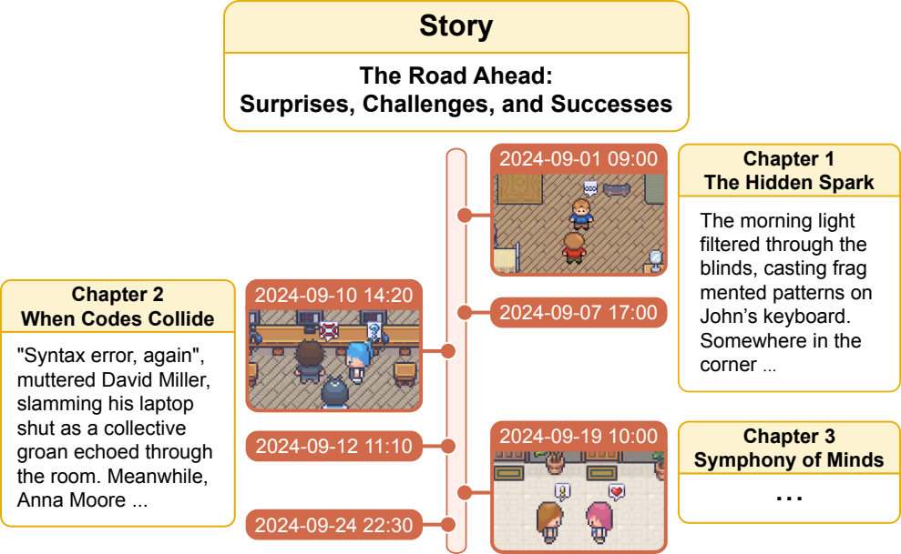
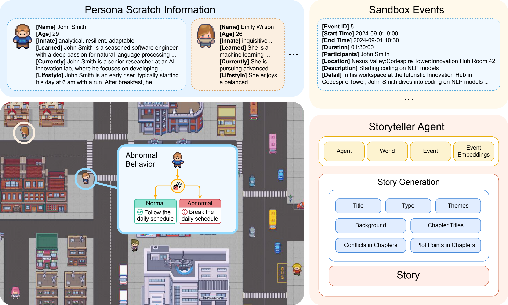
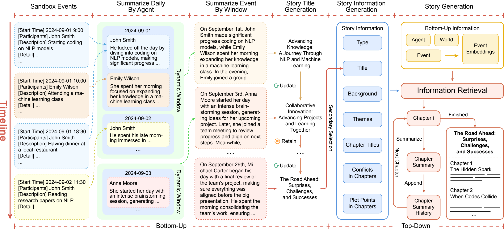
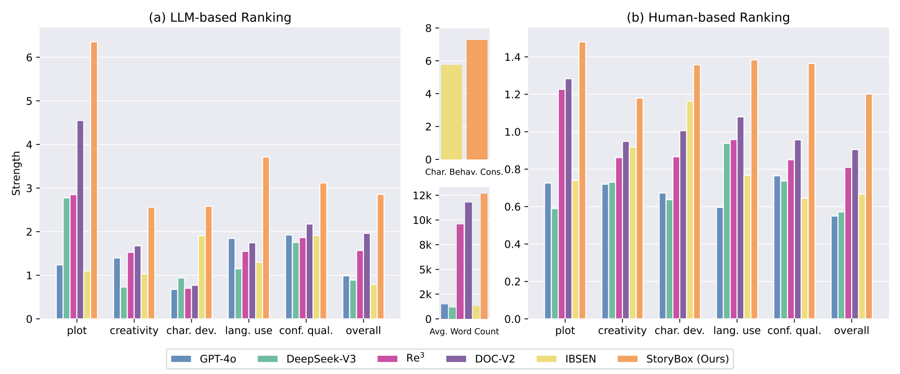
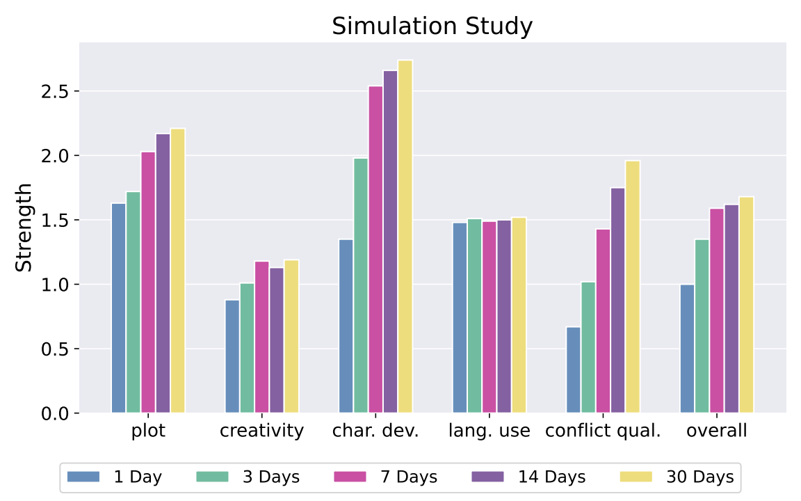
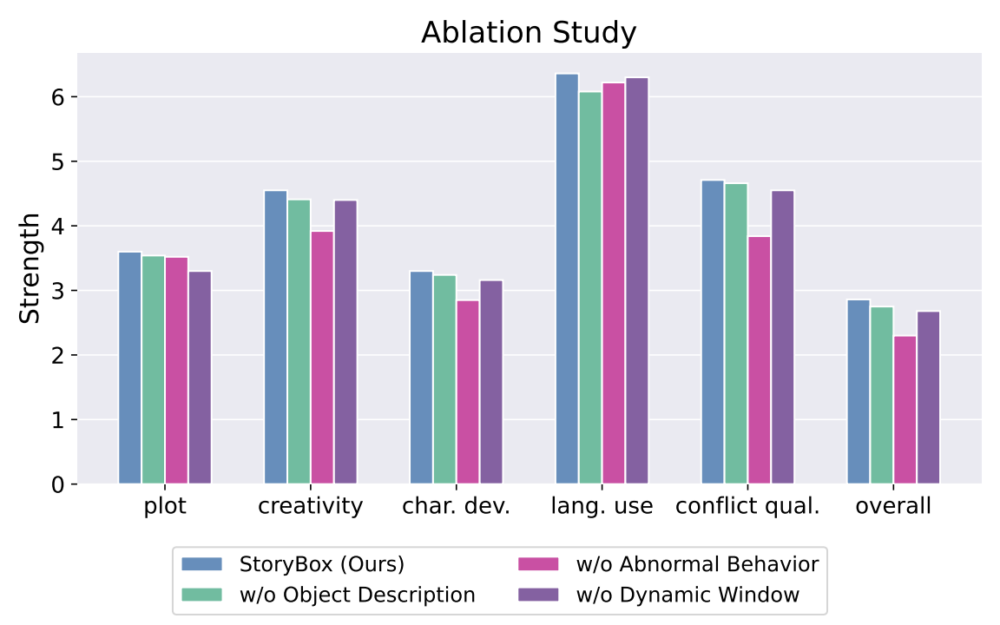

# StoryBox: Collaborative Multi-Agent Simulation for Hybrid Bottom-Up Long-Form Story Generation Using Large Language Models

## 一句话总结

StoryBox 将 LLM 多智能体沙盒模拟作为长篇故事生成的事件来源，再由 Storyteller Agent 对事件进行摘要、规划和逐章写作，从而以“混合自底向上”的方式生成超过 10,000 词且保持较好一致性的长篇故事。

## 研究问题

论文关注的是长篇故事生成中常见的结构僵硬、角色发展不足和长程一致性难题。传统 top-down 方法通常先给出大纲再扩写，虽然能提供结构约束，但容易让情节显得预设、可预测，并削弱角色与环境互动带来的自然演化。作者希望模拟人类写作者在创作前形成“故事世界心理场景”的过程：先建立一个包含角色、环境和互动规则的动态沙盒，让角色在其中行动、对话、偏离日常计划并触发事件，再把这些事件组织成完整叙事。

这篇论文的核心问题可以概括为：如何利用 LLM 驱动的多智能体模拟产生足够丰富、连贯且可控的事件素材，并将这些事件转化为长篇故事，使故事既有自然生成的角色互动，又能维持章节级的主题、冲突和叙事连续性。

## 核心方法

方法由两个主要部分组成。第一部分是多智能体沙盒模拟：每个角色拥有 Name、Age、Innate、Learned、Currently、Lifestyle 和 Daily Plan Requirements 等属性，系统据此生成日程和行为；同时引入 Abnormal Behavior 与 Abnormal Factor，让角色有概率偏离常规计划，制造冲突和不可预测事件。角色行为被归为 move、chat 和 none，所有行为都会被记录为事件，并包含时间、地点、参与者、简短 description 和更细粒度的 detail。环境建模采用树状层级结构，而不是 Generative Agents 式的坐标 tile，从而支持更灵活、更大范围的故事空间。

第二部分是 Storyteller Agent。由于沙盒事件数量较大，系统先按角色和日期进行事件摘要，再用动态窗口机制把事件进一步压缩成适合 LLM 处理的摘要块。随后系统生成 story type、标题、背景、主题、章节标题、章节冲突和关键 plot points；如果用户提供人工设定，则跳过对应自动生成步骤。正式写作阶段结合故事信息与沙盒数据进行检索，既用关键词也用 event embeddings 匹配相关事件，并通过逐章迭代生成、章节摘要历史和后续章节续写来维持长程连贯性。

## 分章节阅读笔记

### 1 Introduction

#### 章节作用

引言把 StoryBox 的研究位置放在两个交叉方向之间：一方面是 LLM-based multi-agent simulation，另一方面是 long-form story generation。作者的基本判断是，长篇故事生成并不只是把短故事拉长，而是需要持续产生有因果关系的事件、保持角色行为一致，并让情节从角色和环境互动中自然推进。因此，论文没有从“如何写一个更好的大纲”切入，而是从“如何自动形成一个可演化的故事世界”切入。

这一节的核心类比是人类写作者的“mental scene”。人写长篇故事时通常会先想象一个包含角色、场景、关系和潜在冲突的整体世界，而不是只从单个句子或单个大纲节点开始。StoryBox 将这个心理场景具体化为 multi-agent sandbox simulation：角色作为 agents 在动态环境中移动、对话、响应环境，并由这些交互触发 emergent events。引言因此为后文方法部分设定了一个清晰目标：先生成可用的故事事件材料，再由 Storyteller Agent 将这些材料组织成完整叙事。

#### Figure 1: Sandbox Timeline

Figure 1 展示的是论文所说的“从模拟事件到章节故事”的直观过程。中间的时间线代表沙盒模拟持续推进，不同日期和时间点产生具体事件；右侧和左侧的章节片段说明，这些事件不是被直接拼贴成日志，而是经过筛选、组织和叙事化后进入不同章节。图中的重点不是某个具体场景，而是事件生成方式：故事素材来自 agents 与 agents、agents 与 environment 的连续互动，章节写作则建立在这些动态事件之上。

这张图也帮助理解“hybrid bottom-up”的含义。bottom-up 指情节材料来自底层模拟中的局部互动，而不是完全由预先大纲规定；hybrid 指系统并不放弃高层叙事控制，后续仍会生成 story type、title、themes、chapter titles、conflicts 和 plot points，并由 Storyteller Agent 把事件组织成连贯故事。

#### 研究动机

引言指出，传统 long-form story generation 常采用 top-down 方法，即先构造故事结构或大纲，再逐步扩展成完整故事。这类方法的优势是结构明确，但作者认为它会限制自然的角色发展和 plot progression：角色行为更像是在完成既定剧情任务，而不是在一个动态环境中相互影响、产生新事件。对于长篇故事而言，这种限制会导致故事显得 forced 或 predictable。

StoryBox 的动机正是缓解这个问题。多智能体模拟可以提供一个动态、上下文丰富的生成环境，让角色根据预设属性行动，并在与其他角色及环境的互动中形成事件链。作者强调，沙盒中的事件不是预先写死的 plot，而是在 agents 的行为和环境变化中逐渐出现。这样得到的故事基础更接近“角色驱动”的叙事，有助于支持更自然的角色成长、冲突形成和情节延展。

#### 方法基本设想

引言层面只给出方法概览：系统首先运行 multi-agent sandbox simulation，生成一系列具有时间、角色、环境和互动背景的事件；随后由 Storyteller Agent 将这些事件加工为长篇故事。这个设计把“生成故事”拆成两个层次。底层负责产生具有情境感的事件材料，高层负责把材料转化为 coherent and consistent narrative。

这里的关键是，StoryBox 并不是单纯让 LLM 直接写一篇长故事，而是先通过模拟构建中间表示。这个中间表示主要由 emergent events 构成，它们为后续叙事提供角色行为、互动关系、冲突来源和环境线索。引言中反复强调 sandbox 的作用，实际上是在为后文的 agent attributes、abnormal behavior、event recording、environment modeling 和 Storyteller Agent workflow 做铺垫。

#### 主要贡献

引言最后将贡献概括为三点。第一，论文提出一个用于故事事件生成的 multi-agent simulation framework，使角色行为能够在上下文环境中互动并产生动态事件。第二，论文提出 hybrid bottom-up process，将自发生成的 agent interactions 与 guided storytelling 结合起来，目标是兼顾自然情节演化和整体叙事控制。第三，系统能够生成超过 10,000 词的长篇故事，并声称在 coherence、consistency 和多项评价指标上优于已有方法。

从论文结构上看，引言承担的是“提出问题与定义方法直觉”的作用：它没有展开具体算法细节，也没有给出实验细节，而是先建立一个中心论点：长篇故事生成需要一个能持续产生丰富事件的动态世界，multi-agent simulation 可以充当这个世界，而 Storyteller Agent 则负责把底层事件转译为高层叙事。

### 2 Related Work

#### 章节作用

相关工作部分的功能是说明 StoryBox 为什么需要同时借用两条研究线：LLM-based multi-agent simulation 提供“可演化世界”和“角色互动”的机制，story generation 提供“如何把素材组织成叙事”的任务背景。作者没有把相关工作写成覆盖面很广的综述，而是用两个小节快速建立自己的定位：已有多智能体模拟能产生复杂社会行为，但通常不以长篇叙事为最终目标；已有长篇故事生成方法能规划和扩写文本，但常依赖 top-down 结构，难以自然地产生角色互动和长期事件链。StoryBox 的位置就在这两者之间。

### 2.1 LLM-Based Multi-Agent Simulation

这一小节强调，LLM 赋能的 agents 已经能够进行较细腻的语言处理和决策，因此可以支持更自然的多智能体互动。作者把这个方向的代表工作分成一个隐含脉络：一类工作研究通用或可配置的多智能体交互框架，另一类工作把 agents 放到社会模拟场景中，用来观察信息传播、情绪扩散、群体意见、社区治理、日常行为或发展心理等现象。

作者最关心的是 social simulation，因为 StoryBox 需要的不是单个 agent 完成任务，而是一组角色在共享环境里持续互动。文中提到的 S$^3$ 关注社交网络中的信息、情绪和态度传播；Generative Agents 与 AgentSims 展示了虚拟城镇或沙盒中的日常人类互动；Social Simulacra 用 agents 模拟在线社区治理；SocialAI School 则面向儿童发展和社会文化 agents。这些工作共同说明，LLM agents 已经可以作为模拟复杂社会动态的工具。

StoryBox 对这条线的继承点是：它同样使用 LLM-based agents 来构建角色行为和互动环境。但它的目标不同于一般社会科学模拟或 agent 行为评估。作者关心的是把这些互动转化为 long-form story generation 的底层事件素材。因此，多智能体模拟在本文中不是最终产物，而是故事生成流程的前端：它负责制造带有时间、地点、角色关系和环境上下文的 emergent events。

这一定位也解释了为什么引言反复使用 sandbox 这个概念。StoryBox 需要一个足够开放的模拟场，让角色行为不会只服务于预设大纲，而能产生新事件、新冲突和新的角色关系变化。相关工作部分借 social simulation 证明这种机制是可行的，但后文方法会进一步把它改造成面向叙事的事件生成器。

### 2.2 Story Generation

这一小节转向故事生成本身。作者首先承认 LLM 已经显著提升了故事文本的流畅度，但指出长篇故事仍然面临 coherence 和 consistency 问题。对于长篇叙事，语言流畅并不等于故事成功；系统还必须处理情节节奏、角色发展、冲突延续、章节间衔接和长期记忆。相关工作中，RecurrentGPT、CONCOCT 等方法从长文本生成、故事规划或 pacing 控制角度改进 top-down 生成流程，即先规划结构，再扩写成完整故事。

作者随后讨论多智能体故事生成或剧本生成方法。Agents' Room 使用 Planning Agent、Writing Agent 和 Orchestrator 协作生成约 1,000 到 2,000 词故事；IBSEN 使用 Director-Actor 协作生成可控的戏剧脚本；StoryVerse 和 Word2World 等工作也探索了 LLM 角色模拟、叙事规划或故事世界生成。这些方法与 StoryBox 很接近，因为它们都试图把 agents 引入叙事生成，而不是只依赖单个 LLM 直接写作。

StoryBox 与这些工作的差异主要在两个层面。第一，它把 multi-agent simulation 明确作为底层事件生成机制，而不是只用 agents 扮演写作流程中的不同职能角色。也就是说，agents 在沙盒中先“生活”和互动，再由 Storyteller Agent 写故事。第二，论文强调 long-form generation，声称生成长度可超过 10,000 词，而相关小节中提到的 Agents' Room 主要面向 1,000 到 2,000 词故事。作者借此说明，StoryBox 试图处理更长文本中的持续事件管理和章节连贯性问题。

这一小节的关键对比是 top-down 与 hybrid bottom-up。传统大纲式方法能够提供结构，但可能压制自然角色互动；纯模拟又可能缺乏叙事控制。StoryBox 的主张是把二者结合起来：由沙盒模拟产生动态事件，再通过 Storyteller Agent 的主题、章节、冲突和 plot point 规划把事件组织成可读的长篇故事。相关工作因此为后文方法部分铺垫了一个核心论证：本文不是简单提出一个新的写作 agent，而是把“事件生成”和“叙事组织”拆开，并用多智能体模拟连接二者。

### 3 Methodology

#### 章节作用

第三章是 StoryBox 的方法主体，负责回答引言中留下的关键问题：一个用于长篇故事生成的“可演化故事世界”具体怎样构建，沙盒中的事件又如何被转换成可读的长篇叙事。作者把系统拆成两个层次：底层是 multi-agent simulation，用来模拟角色在环境中的行为和互动，并产生具有上下文的事件；上层是 Storyteller Agent，用来摘要、筛选和组织这些事件，最终生成 coherent and engaging stories。

#### Figure 2: System Framework

Figure 2 给出了 StoryBox 的整体框架。左上角的 Persona Scratch Information 定义角色的基本设定；左下角的 sandbox 是角色活动的环境，异常行为机制会让角色有概率偏离常规日程；右上角的 Sandbox Events 是模拟产生的事件记录；右下角的 Storyteller Agent 则把 agent、world、event 和 event embeddings 等信息输入到故事生成模块中，生成标题、类型、主题、背景、章节标题、章节冲突和 plot points，最终形成完整故事。

这张图说明，StoryBox 的方法不是单步文本生成，而是一个“事件生产 - 信息组织 - 章节写作”的管线。多智能体沙盒负责让故事素材从角色互动中产生，Storyteller Agent 负责把这些素材变成有结构、有主题、有章节连续性的叙事。

### 3.1 Multi-Agent Simulation

多智能体模拟是 StoryBox 的事件来源。作者借鉴 Generative Agents 的角色建模思路，但针对故事生成做了修改：这里的 agent 不只是要表现出类似人类的日常行为，还要产生对故事有用的事件、冲突和角色变化。因此，角色设定必须同时支持行为一致性和叙事可变性。

这一部分的核心思路是：先定义角色是谁、当前处境如何、日常计划是什么，再让角色在环境中执行 move、chat 或 none 等行为。每次行为都会成为后续故事生成的候选事件。这样，故事的底层材料不是由大纲直接规定，而是在角色属性、环境状态和互动过程的共同作用下形成。

### 3.1.1 Core Attributes

Core Attributes 定义每个角色的基础画像，包括 Name、Age、Innate、Learned、Currently 和 Lifestyle。它们分别描述角色身份、年龄、先天气质、后天经历、当前状态和生活习惯。对于故事生成来说，这些属性的作用是给角色行为提供稳定依据：同一个角色在不同事件中应当表现出可解释的偏好、能力、动机和生活节奏。

作者额外引入 Daily Plan Requirements，用来建模角色每天要完成的任务或例行活动。这个属性是动态的：新的一天开始时会生成新的 daily plans，再进一步转化为按小时安排的详细日程。这样做的意义是让角色有一条“正常生活轨道”。后续无论角色遵守日程还是偏离日程，系统都能判断行为是否符合角色设定，并据此产生更有叙事意义的事件。

### 3.1.2 Abnormal Behavior Attribute

Abnormal Behavior Attribute 用来解决一个直接的叙事问题：如果所有角色都只按日程行动，沙盒会变得稳定但无聊，难以产生冲突和转折。作者因此为每个角色加入异常行为属性，让角色有可能放弃日常计划、追求其他目标，或与其他角色发生冲突。

异常行为由 Abnormal Factor 控制，数值越高，角色越可能偏离 routine。这一机制在方法上很简单，但叙事作用很重要：它为故事提供不确定性，使角色互动不只是机械执行日程，而能形成意外、矛盾和剧情推进。后文实验中的 ablation 也专门检验了去掉 random abnormal behaviors 后的性能下降，说明作者把它视为 StoryBox 生成动态故事的关键组件之一。

### 3.1.3 Character Behavior Types

角色行为被归为三类：move、chat 和 none。move 表示角色移动到某个地点并执行具体行动；chat 表示角色与其他角色对话；none 表示角色暂时不行动，可能对应休息、停顿、反思或等待。这个三分法让沙盒行为既足够简单，便于系统记录和调度，又能覆盖故事中常见的行动、互动和节奏停顿。

从叙事角度看，move 提供空间变化和行动线索，chat 提供人物关系和冲突表达，none 则提供 pacing 和 tension 的缓冲。三类行为共同支撑角色在环境中的连续活动，使后续事件记录不仅有动作，也有互动关系和节奏变化。

### 3.1.4 Event Recording

Event Recording 是沙盒与 Storyteller Agent 之间的关键接口。作者规定，在沙盒中 agent 的每个动作都被记录为一个 event。每个事件包含 Event ID、start time、end time、duration、participants、location、description 和 detail。这样的结构使事件既可排序、可检索，也能保留足够的叙事上下文。

description 是事件的简短摘要，例如“Starting coding on NLP models”；detail 则补充环境、时间、角色状态、地点、动作、情绪和可能动机等信息。作者强调，简短 description 对写出丰富故事是不够的，因为它无法提供情境细节。detail 的作用就是让事件不只是日志条目，而是可被 Storyteller Agent 编织进故事的情境化素材。

这一设计实际上把沙盒事件变成了中间表示。它既比自然语言故事更结构化，方便摘要和检索；又比纯符号事件更丰富，能支持后续生成具有场景感和人物动机的叙事。

### 3.1.5 Environment Modeling

环境建模决定角色能在怎样的世界中行动。作者指出，Generative Agents 使用 tile-based environment，这种设计适合小型虚拟城镇，但依赖精确坐标，扩展性和灵活性有限。StoryBox 改用 tree-like structure，用相对距离和层级关系组织环境对象，而不是依赖固定坐标网格。

这种树状结构让故事世界可以更大、更灵活。角色不必被限制在固定 tile 上，而可以在更复杂的层级环境中探索和互动。对于长篇故事生成，这一点很重要：长篇叙事往往需要跨地点、跨场景、跨对象的事件链，如果环境过于狭小或刚性，故事素材会很快重复。树状环境为后续事件生成提供了更开放的空间基础。

### 3.2 Hybrid Bottom-Up Long-Form Story Generation

多智能体模拟生成事件后，StoryBox 进入第二阶段：把事件转换成长篇故事。这个阶段被称为 hybrid bottom-up，因为底层内容来自沙盒事件，但最终文本生成仍然有类型、主题、标题、章节、冲突和 plot points 等高层控制。

#### Figure 3: Storyteller Agent Workflow

Figure 3 展示了 Storyteller Agent 的完整流程。左侧是按时间排列的 Sandbox Events；随后系统先按 agent 和日期进行 daily summary，再用 dynamic window 对事件摘要进行分块压缩。中间部分根据事件摘要迭代生成并更新 story title，再生成 story information，包括 type、title、background、themes、chapter titles、chapter conflicts 和 plot points。右侧是最终写作流程：bottom-up information 进入 information retrieval，系统逐章生成故事，每章结束后写出 chapter summary，并把摘要加入 chapter summary history，为下一章生成提供上下文。

这张图最重要的地方是把 bottom-up 和 top-down 的边界画出来。左侧事件摘要来自 bottom-up 的沙盒过程，右侧章节规划和故事信息则是 top-down 的叙事控制。StoryBox 的“hybrid”就在于两者同时存在：事件不是凭空编造，章节也不是无结构地堆叠。

### 3.2.1 Event Summarization

事件摘要解决的是上下文长度问题。沙盒事件按时间顺序产生，但数量可能非常大，不能直接全部输入 LLM。作者先按角色和日期摘要，记录每个角色每天做了什么；再引入 dynamic windowing mechanism，把这些 daily summaries 分成更小的窗口继续摘要。窗口大小由 LLM 根据事件复杂度和密度动态决定。

这一层设计有两个作用。第一，它降低输入规模，使后续标题生成、故事信息生成和章节写作不会被原始事件淹没。第二，它尽量保留时间顺序和角色轨迹，让 Storyteller Agent 在压缩信息时仍能看到事件之间的连续关系。对于长篇故事生成来说，这种“压缩但不打乱时间线”的处理是维持连贯性的基础。

### 3.2.2 Story Information Generation

Story Information Generation 负责建立高层叙事框架。作者强调，系统先生成 story type，而不是先生成 title。story type 相当于故事的类型约束，例如 adventure、mystery 或 romance，会影响后续情节、角色关系和主题方向。随后系统根据初始事件摘要生成标题，并在新的事件摘要到来时不断更新标题。标题在这里不只是文本包装，也起到筛选和聚焦故事核心的作用。

标题确定后，系统继续生成 background、main themes、chapter titles、conflicts per chapter 和 major plot points。它们共同构成 story information，为后续逐章写作提供结构。作者还说明，如果存在人工输入，Storyteller Agent 可以跳过对应的自动生成步骤；同时，主题数量、章节数、每章冲突数和每章 plot points 数量都可以作为超参数调整。这说明系统既支持自动生成，也保留一定的人为可控性。

### 3.2.3 Story Generation

正式生成故事时，系统使用 information retrieval 模块连接 story information 和 sandbox data。输入包括标题、主题、章节信息等高层叙事信息，也包括 agent、world、event 和 event embeddings 等底层数据。事件被转换为 embeddings 后，系统可以同时使用关键词检索和 dense vector retrieval 来找到与当前章节最相关的事件。

这里的检索机制体现了 bottom-up 的核心：章节文本不是只根据大纲生成，而是不断从沙盒事件中取材。与此同时，检索也起到动态过滤作用，因为沙盒可能产生大量事件，并不是每个事件都适合进入最终故事。Storyteller Agent 根据当前章节目标和已有故事进展选择相关事件，使故事既受底层事件驱动，又不会失去叙事焦点。

章节生成采用迭代循环。生成第一章时，系统检索标题、主题和当前章节相关信息；一章可能需要多次迭代才能完成。章节结束后，系统生成 chapter summary，并把它加入 chapter summary history。后续章节不仅使用当前章节检索到的信息，也使用前面章节的摘要历史，从而保持连续性。这个机制是 StoryBox 支持长篇生成的关键：它用章节摘要历史代替完整前文，降低上下文压力，同时保留叙事状态。

#### 小结

第三章的方法贡献可以概括为一个双层系统。底层沙盒通过角色属性、异常行为、行为类型、事件记录和环境建模生成有上下文的事件；上层 Storyteller Agent 通过事件摘要、故事信息生成、检索和逐章迭代写作，把事件组织成长篇故事。它的核心不是单一模型技巧，而是把“角色驱动事件生成”和“结构化长篇叙事控制”连接成一条流水线。

### 4 Experiments

#### 章节作用

第四章用实验来验证 StoryBox 的三个核心主张：第一，它生成的长篇故事在 plot、creativity、character development、language use、conflict quality 和 overall 等维度上优于或至少强于主要基线；第二，沙盒模拟确实有助于角色行为一致性和长篇故事长度；第三，方法中的 object descriptions、random abnormal behaviors 和 dynamic context window 都不是装饰性组件，而是会影响最终故事质量。

#### Figure 4: Main Evaluation Results

Figure 4 是本章的主结果图，左侧是 LLM-based ranking，右侧是 human-based ranking。比较对象包括 GPT-4o、DeepSeek-V3、Re$^3$、DOC-V2、IBSEN 和 StoryBox。图中还单独报告了 Character Behavior Consistency 和 Average Word Count，用来衡量沙盒角色是否符合 persona 以及是否真正生成长篇文本。

从趋势上看，StoryBox 在自动评估中的多数维度都最高，尤其在 plot、language use、conflict quality 和 overall 上优势明显；在人类评估中也整体领先。图中还显示 StoryBox 的平均词数约为 12k，明显高于直接用 vanilla LLM 生成故事的方法，也略高于部分长篇结构化方法。这个结果支撑作者的主张：沙盒模拟提供的事件材料和 Storyteller Agent 的结构化组织，有助于生成更长、更连贯的故事。

### 4.1 Experimental Settings

实验设置部分说明评测任务、数据、指标和基线。由于故事生成没有唯一标准答案，论文采用 premises、settings 和 characters 作为输入，让不同方法基于同一设定生成故事，再从多个主观维度比较输出质量。这里的实验目标不是测试某个单一自动指标，而是综合考察故事是否有结构、是否有创造性、角色是否发展、语言是否丰富、冲突是否有效，以及整体偏好如何。

### 4.1.1 Dataset

论文沿用 DOC 的任务形式，即输入 premise、setting 和 characters，但没有直接使用 DOC 数据集作为唯一来源。作者认为 DOC 中的故事类型相对单一，因此自行构造了 20 个 story-related settings，且没有 reference answers。这一点很重要：实验评价不是“生成文本和标准答案有多像”，而是比较不同方法在同一故事设定下生成结果的质量。

新数据集覆盖更广的故事类型，包括 science fiction 等题材。这样的设计更适合检验 StoryBox 的动态模拟能力，因为不同题材需要不同环境、角色关系和冲突机制。如果数据集过于同质，系统在多样化故事世界中的优势就不容易体现。

### 4.1.2 Evaluation Metrics

评价指标分为 human evaluation 和 automatic evaluation。人类评价采用 pairwise comparison，让标注者比较同一 setting 下不同方法生成的故事，并在 Plot、Creativity、Character Development、Language Use、Conflict Quality 和 Overall 六个维度上打分或选择偏好。作者还使用 Latin Square design 平衡故事设置分配，并随机化故事顺序，以减少疲劳和顺序偏差。

自动评价使用 LLM 按照与人类评价一致的维度进行比较。论文没有把自动评价视为完全替代人类判断，而是把它作为成本较低的近似方式，并进一步比较自动评价趋势和人评趋势是否一致。除了六个常规故事质量维度，作者还增加 Character Behavior Consistency，用来衡量角色行为是否符合 persona；Average Word Count 则衡量长篇生成能力。

这些指标与 StoryBox 的方法假设是对应的。Plot、Conflict Quality 和 Overall 检验 Storyteller Agent 的结构化叙事能力；Character Development 和 Character Behavior Consistency 检验沙盒角色模拟是否有效；Language Use 则检验环境和事件细节是否能转化为更丰富的文本表达。

### 4.1.3 Baselines

基线被分为三类。第一类是 Vanilla LLMs，包括 GPT-4o 和 DeepSeek-V3，代表直接让强模型生成长篇故事。第二类是 Structured Frameworks，包括 Re$^3$ 和 DOC-V2，代表用结构化规划或扩写框架支持长篇故事生成。第三类是 Multi-Agent Simulations，例如 IBSEN，代表用多智能体协作生成戏剧或叙事内容。

这种分组使实验比较更有针对性。StoryBox 需要同时证明它优于直接调用强 LLM，也优于已有结构化长篇生成框架，还要和同样使用 agent 思路的方法比较。尤其是 IBSEN 这一类基线，可以检验 StoryBox 的优势是否来自“多 agent”本身，还是来自“沙盒事件生成 + Storyteller Agent 组织”的组合设计。

### 4.1.4 Implementation Details

实现细节主要放在 supplementary material 中，包括 story-related settings、sandbox initialization、角色和环境设定、prompt 以及其他实现参数。正文这里只说明这些细节存在，没有展开具体 prompt 或工程流程。因此，这一小节在主文中的作用更多是交代复现信息来源，而不是支撑主要结论。

### 4.2 Automatic Evaluation

自动评估结果对应 Figure 4(a)。作者报告 StoryBox 在主要指标上整体表现最好。Plot 维度上，StoryBox 的优势被解释为其能维持更强的情节连贯性；IBSEN 相对较弱，作者认为可能是因为它缺少专门面向叙事结构的设计。Creativity 维度上，多数方法较接近，但 DeepSeek-V3 较低，作者将其解释为风格多样性不足。

Character Development 是 StoryBox 的关键优势之一。作者认为，沙盒模拟使角色在连续事件中发展，而不是只在写作阶段被动服务于大纲，因此更容易形成角色变化。Language Use 的提升则来自 Storyteller Agent 对环境和上下文线索的整合：事件 detail 和环境描述给文本提供了更丰富的场景材料。Conflict Quality 上 StoryBox 也最高，说明异常行为和多智能体互动可能确实带来了更结构化的冲突来源。

Character Behavior Consistency 中，StoryBox 略高于 IBSEN，说明两者作为 simulation-based 方法都能维持一定角色一致性，但 StoryBox 的 persona 和事件记录机制可能更稳定。Average Word Count 显示 StoryBox 平均约 12,000 词，其他长篇方法大约 10,000 词，而未专门适配长篇生成的模型只有约 1,000 词。这部分结果支撑作者对“long-form generation ability”的主张。

### 4.3 Human Evaluation

人类评估招募了 78 名参与者，背景包括文学、计算机科学和其他学科。参与者比较同一 setting 下不同方法生成的故事，并使用与自动评价相同的维度进行判断。这样设计的原因是故事质量具有强主观性，仅靠 LLM 自动评价容易存在偏差。

Figure 4(b) 显示，StoryBox 在人评中也整体领先，说明其优势不只来自自动评估偏好。作者特别指出，人类评价趋势与自动评价基本一致，因此自动评估在该实验中可以作为一定程度的近似。但也存在差异：人类评审更偏好 IBSEN 相对于 GPT-4o 和 DeepSeek-V3 的输出，这提示 simulation-based narratives 可能具有一些自动指标没有充分捕捉的人类可感知特质，例如角色互动更自然、戏剧关系更明确或情节更像由人物推动。

这一节的意义在于给 StoryBox 的主结果增加可信度。自动评价显示其强，人类评价也显示其强；两者一致时可以增强结论，不一致处则提醒读者故事生成评价仍然复杂，不能完全依赖自动指标。

### 4.4 Simulation Duration Study

#### Figure 5: Simulation Duration Study

Simulation Duration Study 研究沙盒模拟时长对故事质量的影响。作者比较 1、3、7、14 和 30 天模拟，在故事长度固定约 12,000 词的条件下观察各项指标变化。这个实验直接对应 StoryBox 的一个核心设计问题：模拟越久会产生越多事件，但更多事件是否一定带来更好故事？

结果显示，不同指标对模拟时长的敏感性不同。Plot、Creativity 和 Language Use 变化较小，作者认为这可能是因为 Storyteller Agent 和 LLM 本身已经提供了较强的高层指导和语言生成能力。Character Development 和 Conflict Quality 随模拟时长增加更明显，因为更长的模拟让角色有更多互动机会，也更容易积累复杂关系和冲突。

Overall 从 1 天到 7 天提升明显，但 7 天之后收益变小。作者还指出，token usage 会随模拟时长增加而大约翻倍，而质量提升会逐渐平台化。过多事件甚至可能增加模型综合信息的负担。因此，论文将 7 天模拟视为质量和效率之间的实用折中。

### 4.5 Ablation Study

#### Figure 6: Ablation Study

消融实验检验三个组件：object descriptions、random abnormal behaviors 和 dynamic context window。Figure 6 显示，移除任一组件都会造成性能下降，但下降模式不同。这说明 StoryBox 的性能不是由单一模块贡献，而是多个组件分别支撑不同质量维度。

去掉 object descriptions 主要伤害 Language Use，因为环境对象描述为 Storyteller Agent 提供具体场景材料，使故事语言更有画面感、更 grounded。去掉 random abnormal behaviors 的影响最大，尤其损害 Creativity、Character Development 和 Conflict Quality。这与方法部分的设计逻辑一致：异常行为是制造意外、冲突和人物变化的重要来源。没有它，角色更容易只执行日程，故事会趋于平稳。

去掉 dynamic context window 会降低 Plot 质量，因为系统在处理大量事件时失去动态分块和摘要能力，较难维持长程情节组织。这个结果说明，长篇故事生成不仅需要生成更多事件，还需要合适的信息压缩和上下文管理机制。总体来看，消融实验支撑了作者的组件级论证：环境细节改善表达，异常行为推动冲突和角色发展，动态窗口维持长篇结构连贯性。

#### 小结

第四章的实验结论可以概括为三层。主评估表明 StoryBox 在自动评价和人类评价中整体领先，并能生成更长文本；模拟时长实验表明事件积累有益但存在边际收益，7 天是较合理折中；消融实验表明沙盒环境细节、异常行为和动态窗口分别支撑语言表现、冲突/角色发展和情节连贯性。需要注意的是，故事生成评价仍然依赖主观判断和 LLM 自动评价，实验结论更适合理解为相对比较，而不是绝对质量证明。

### 5 Conclusion

结论部分非常简短，主要回到论文的中心主张：StoryBox 是一种基于 multi-agent simulation 的 long-form story generation 方法。它的贡献不在于提出一个新的单轮文本生成 prompt，而在于把长篇故事生成拆成两个阶段：先用多智能体沙盒生成角色驱动的动态事件，再由 Storyteller Agent 将这些事件组织成有章节、有主题、有冲突延续的完整故事。

作者在结论中强调，实验结果显示 StoryBox 在多项指标上优于已有方法，并且自动评价和人类评价都支持其有效性。这与第四章的证据链是一致的：主结果证明 StoryBox 的整体质量较强，模拟时长实验说明沙盒事件积累对角色发展和冲突质量有帮助，消融实验则说明异常行为、环境对象描述和动态窗口都对系统性能有贡献。

从论文论证结构看，结论的作用是把方法和实验重新收束到一个实践意义上：多智能体模拟可以为长篇故事生成提供更自然的事件来源，使故事不只是从大纲扩写出来，而是从角色行为和环境互动中演化出来。需要注意的是，结论没有进一步展开新技术细节，也没有补充新的实验，只是对 StoryBox 的有效性和生成 engaging、coherent stories 的能力做总结。

## 实验结论

实验部分支持三个主要结论。第一，StoryBox 在自动评价和人类评价中总体领先，尤其在 plot、character development、language use、conflict quality 和 overall 等维度上表现较强，说明沙盒事件和 Storyteller Agent 的组合能改善长篇故事质量。第二，StoryBox 能生成约 12,000 词的故事，相比直接使用 vanilla LLM 更适合 long-form generation。第三，组件消融显示 object descriptions、random abnormal behaviors 和 dynamic context window 分别支撑语言表达、角色/冲突发展和长程情节连贯性。

模拟时长实验进一步说明，更多沙盒事件并不总是线性提升质量。角色发展和冲突质量会从更长模拟中受益，但 plot、creativity 和 language use 的提升较有限；7 天模拟在质量和 token 成本之间更平衡。这一点也限制了 StoryBox 的实际使用方式：系统需要控制事件数量和信息压缩策略，否则过长模拟会增加成本并可能加重 Storyteller Agent 的综合负担。

## 局限性与可追问点

原文的 `Limitations` 指出两类主要局限。第一，当前沙盒模拟是 sequential 的，即角色一个接一个行动，这会拖慢整体模拟过程。并行化看似可以提高效率，但会带来行为依赖问题：一个角色的动作可能直接影响另一个角色的后续行为，如果简单并行执行，可能产生状态不一致或事件冲突。因此，一个可追问方向是如何设计支持因果依赖和冲突解决的并行多智能体模拟机制。

第二，故事质量评价仍然困难。论文使用了人类评价和自动评价，但人类评价成本高、耗时长；自动评价虽然便宜，却未必能准确近似人类偏好。第四章中人类评审对 IBSEN 的相对偏好已经说明，simulation-based narratives 中某些“人类可感知”的叙事特质可能没有被自动指标充分捕捉。因此，后续研究需要更可靠、可扩展的 narrative evaluation metrics，尤其是能评估角色弧线、冲突发展、情节节奏和长程一致性的指标。

这篇论文还留下几个隐含问题。StoryBox 的实验依赖 20 个无参考答案的故事设定，题材覆盖虽比 DOC 更广，但规模仍有限；Storyteller Agent 中的具体 prompt 和 LLM 选择可能显著影响结果；此外，系统声称可以生成更自然的角色驱动故事，但最终仍需要高层 story information 和 retrieval 筛选来控制叙事，这意味着 bottom-up 事件与 top-down 规划之间的权重如何调节，仍是一个值得进一步研究的问题。

## 对我当前研究/项目的启发

StoryBox 是直接的 simulation-to-writing baseline：它证明沙盒事件能够支持长篇写作，也显示模拟时长存在收益递减。对 SharedWorldsPrivateMinds 来说，关键不是重复“先模拟再写作”，而是检验一个带 authority、legal projection、角色 belief、discourse reveal 与 branch promotion 的统一 substrate，是否在相同 source stream 和预算下优于 StoryBox 式 scratch/event handoff 或分离 writer/actor stores。

2026-07-15 的发布审计确认项目页指向 `amcghm/StoryBox`；固定 revision `ba24ff64e6023e8d071af4adb7e64b03bd9b08b1` 有 MIT LICENSE 和 20 个 `data/storyNN` 示例世界。该许可使代码/仓库示例可作为可审计实现参考，但论文的人评结果仍不能证明其内部 memory 具有角色信念、权限或分支正确性。
