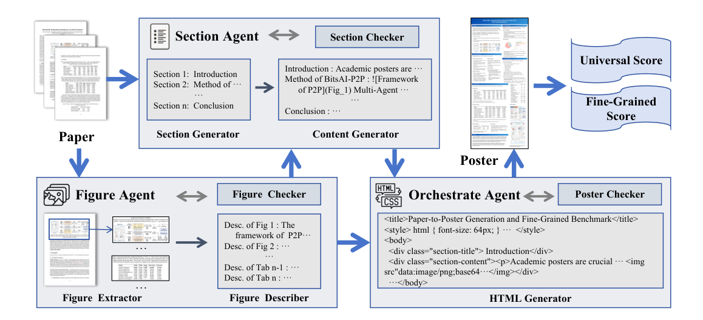
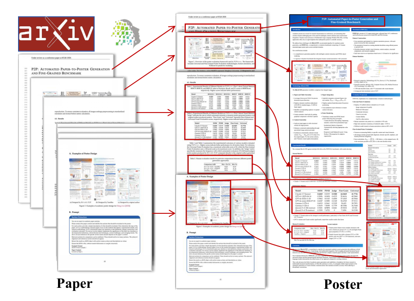
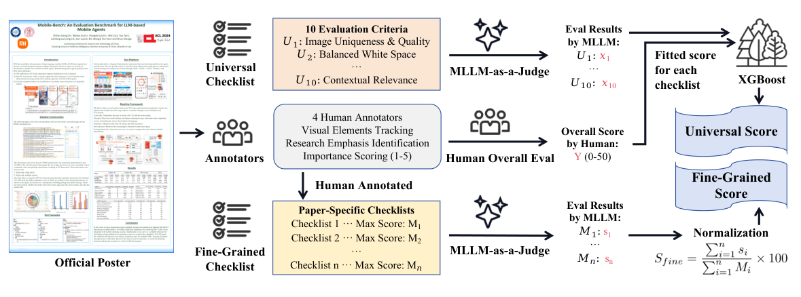
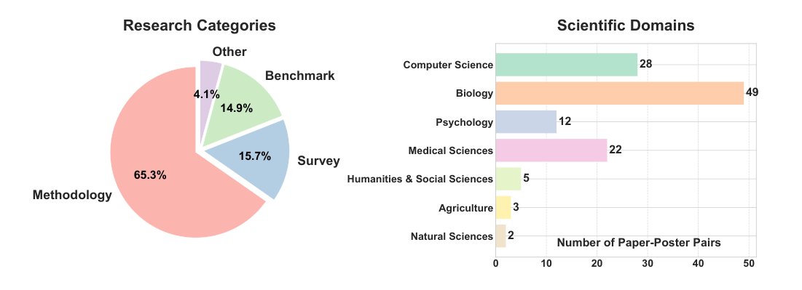

# P2P: Automated Paper-to-Poster Generation and Fine-Grained Benchmark

## 阅读定位与核心结论

这篇论文同时解决三个问题：怎样把论文变成内容忠实、图文匹配的海报；怎样为这个任务训练小模型；怎样分别评价内容保真与整体设计质量。其贡献对应 **P2P 多 agent 生成流程、P2PINSTRUCT 指令数据、P2PEVAL 双轨评估**。只看 Universal Score 的 XGBoost 会漏掉论文的大部分工作。

本文笔记依据本地 ICLR 2026 版本 PDF，完整覆盖正文 §1–6（PDF pp.1–10），并补读 B.2、D、F 等解释核心机制所需的附录。下文页码均为 PDF 页码。正文全部 4 张图均从原文裁取；表格保留原始指标含义，部分大表节选代表行。

最值得保留的结论是：**先把图文处理与排版拆开，再对中间产物和最终渲染结果分别检查，确实能改善这组实验中的海报质量；但忠实度、视觉偏好、文本重合度不能相互替代。**完整系统以 Claude-3.7-Sonnet 为主模型时，FineGrain 为 65.3962/100，Universal 为 37.2474/50。人工比较中，相对原作者海报“更好或持平”为 57.63%，严格更好为 35.59%，不能将前者解释成多数海报严格胜过人工。

## 1 Introduction：任务为什么需要单独研究

原文将 paper-to-poster 分成内容提炼、图文整合和二维结构重组三个互相制约的任务。论文按线性顺序展开论证，海报则需要读者在有限空间内迅速找到问题、方法、证据和结论。直接缩短文章不会自动得到可读的海报：某段摘要可能没有对应的图，一张关键实验图可能被缩得无法辨识，也可能保留了图却删掉了理解它所必需的解释。（§1，pp.1–2）

作者进一步把评估分成两条轴。**Objective fidelity** 问的是科学事实、数值、图表和核心发现是否被准确保留；**subjective quality** 问的是排版、阅读顺序、视觉平衡和整体交流效果。这两条轴相关，但可以分离：漂亮的海报可能漏掉关键结论，内容齐全的海报也可能阅读困难。因此论文同时提出生成系统和评估基准，而不是只展示几张视觉上成功的案例。

既有模板和规则方法在布局控制上有优势，但难以随论文结构调整内容和图文关系。作者认为 LLM/MLLM 提供了语义理解能力，而任务分工、检查与修订机制负责把这些能力组织成可靠流程。这里的“multi-agent”主要指按功能拆分的调用流程，并不意味着模型会自主协商所有设计决策。

## 2 Methodology

### 2.1 P2P：三个 agent 如何协作

*原文 Figure 1，p.3。图中每个生成阶段都有检查回路；图片及其描述既进入正文生成，也进入最终 HTML 组装。*

原文将流程形式化为：

$$
F=A_{\mathrm{Fig}}(D),\qquad
T=A_{\mathrm{Sec}}(D,F),\qquad
P=A_{\mathrm{Orch}}(T,F).
$$

其中 $D$ 是输入论文，$F$ 是抽取并描述后的图表集合，$T$ 是海报文本，$P$ 是最终 HTML/CSS 海报。这是模块之间的数据依赖关系，不是训练损失函数。一个关键设计是图像先被理解、索引，正文生成时就引用这些图像，因而图文关系在排版之前已经建立。（§2.1，pp.2–4）

**Figure Agent：让图表成为可引用的语义单元。** Figure Extractor 用 DocLayout-YOLO 检测并裁取图表，Figure Describer 根据空间关系找到原始 caption，再由多模态模型生成内容描述。每个单元可写为 $(v_i,c_i,\mathrm{desc}_i)$：$v_i$ 为图像及元数据，$c_i$ 为原图注，$\mathrm{desc}_i$ 为模型给出的语义描述。描述的作用是让后续文本模型知道这张图支持什么内容，而不是把图片当成只用于装饰的文件。

Figure Checker 负责排除重复抽取、确认重要图表没有漏掉、检查图与 caption 的配对。附录 B.2（pp.18–19）说明这主要是规则与程序检查：用曼哈顿距离配对图和图注，检测置信度初始阈值为 0.85，数量不匹配时按 0.05 递减阈值，以找回置信度较低的图表。这个机制能提高抽取覆盖率，但数量相等本身不能证明语义配对绝对正确。

**Section Agent：先确定海报结构，再生成带图索引的正文。** Section Generator 根据原论文推断 JSON 结构，规定各板块及内容重点；Content Generator 综合论文、结构和图表描述生成 Markdown 文本：

$$
T=M_{\mathrm{text}}(D,S,F_d).
$$

$S$ 是海报结构，$F_d$ 是带描述和索引的图表。输出文本在合适位置写入图索引引用，使“哪张图解释哪段话”成为生成结果的一部分。Section Checker 比较输出与源论文，检查连贯性、核心贡献覆盖、事实忠实性及引用是否正确；发现问题时返回具体意见，重新生成结构或内容。附录给出的实现是 LLM-as-a-Judge 返回 `OK`/`Problem` 并提供反馈，因此这一步仍受底层模型理解能力限制。

**Orchestrate Agent：把语义内容变成可渲染版面。** HTML Generator 接收 Markdown、实际图片以及宽高/纵横比，输出 HTML 与 CSS。作者使用模块化 CSS 分离内容和样式，依据机构或会议标识调整配色，用 flexbox 组织自适应列和留白。系统在最终嵌入图像中省略原始长 caption，以维持简洁呈现；这也意味着邻近正文必须承担必要解释，不能只插图不说明。

Poster Checker 对最终 HTML 的结构和布局作程序检查。附录 B.2 给出留白比例超过 10% 等失败条件，把失败指标与旧 HTML 返回给生成器。GPT-4.1 的平均循环次数为 2.32，Qwen-2.5-VL-7B 为 3.47；连续 5 次未通过时，可升级到更早阶段，例如要求 Section Agent 重组内容。**修订既可能调整排版，也可能回退到内容结构；它不是无限次要求同一模型“再想一想”。**不过这些阈值属于该实现的设计规则，不能据此认为所有学术海报的最佳留白都应低于 10%。

*原文 Figure 2，p.4。红箭头对应标题、图表和正文板块从源论文到海报的迁移。它展示的是内容筛选和重排的实例，不能用单个案例代替整体质量评估。*

这张图适合用来理解系统的输出合同：源论文中的关键元素要能在海报中找到去处，但布局不必复制原论文。图表抽取、内容摘要和排版必须共享稳定的图索引，否则三个阶段分别做对，也可能在最终海报里组合错误。

### 2.2 P2PINSTRUCT：把流程中的中间产物变成监督数据

作者收集 **30,460 个 instruction-response pair**：其中 16,848 个为图片描述对，由 Claude 生成，平均每个描述约 192 tokens；另外 13,612 个来自 Section Generator、Content Generator 和 HTML Generator，平均响应超过 3,300 tokens。（§2.2，p.4）

这里的 30,460 是跨模块的指令样本数量，不是 30,460 篇相互独立的完整论文或海报。模型学到的监督包括图像描述、结构规划、正文组织和代码生成，不能把它们统一理解成一种端到端标签。

附录 D（p.20）补充：数据来自 SciPostLayout 的训练划分，与测试集区分。生成时采用类似 teacher forcing 的引导，让对应的人工海报内容或图像作为参考，例如 HTML 阶段可看到原作者海报，以减轻完全由模型自身风格循环生成的偏差。质量依据包括 checker、每阶段随机抽查 20 对样本，以及微调后性能提升。后两项提供有限验证，并不等于对整个数据集逐条人工验收。

## 3 P2PEVAL：同时评价内容保真与整体质量

*原文 Figure 3，p.5。下路从论文专属 checklist 得到加权覆盖分；上路先生成十个通用维度分，再用人类整体评分监督 XGBoost。两条路径的监督来源和最终分数含义不同。*

### 3.1 Benchmark Constructing：checklist 从哪里来

基准包含 **121 对 paper-poster**，来自 ACL 系列 2022–2024 年材料与 SciPostLayout/F1000Research；保留论文 PDF，以及海报 PDF、PNG。总共标注 **1,738 项 checklist**，其中 **775 项与视觉元素有关**，每项最大分的平均值为 4.07。（§3.1，p.5）

标注并非照着完整论文逐句勾选，而是以原作者海报已经选择的内容为主要参照：图表及其准确表达、相邻文本的一致性、关键任务和实验板块、被突出强调的动机和发现。每项重要性为 1–5，次要细节可记 1，核心元素记 3，中心贡献记 5。这样评估的是对作者沟通重点的保留，而非要求生成海报复制参考版式。

每对材料由三位标注者独立写 checklist，再由第四位资深标注者取条目并集、整合结果；分值取各初始标注的平均并四舍五入。初始分歧很大的海报会被排除。这个过程增加覆盖与一致性，也会使测试集更偏向专家能够达成共识的案例。因此高分表示对这份人工定义的重点保留得好，不能推出它囊括了原论文所有值得传播的信息。

*原文 Figure 4，p.6。方法类论文占 65.3%；学科上生物学 49 对、计算机科学 28 对、医学 22 对、心理学 12 对，其余类别较少。*

分布图说明这是跨学科集合，但各领域并不均衡。自然科学只有 2 对、农业只有 3 对，人文社科只有 5 对，因此总体均值主要由较大类别决定；“跨学科”不应被解读成每个领域都已有充分统计支持。

### 3.2.1 Fine-Grained Poster Evaluation：按人工重要性汇总内容保留

先由 GPT-4o 对每个 checklist 条目检查其事实是否出现在生成海报中、表达是否准确，得到该项得分；再用程序归一化：

$$
S_{\mathrm{fine}}=100\,\frac{\sum_{i=1}^{n}s_i}{\sum_{i=1}^{n}M_i}.
$$

$n$ 是该海报的条目数，$M_i$ 是人类确定的第 $i$ 项最大分，$s_i$ 是自动核验赋予该项的得分，最终范围为 0–100。（§3.2.1，p.6）

这个公式应读成“总获得分/总可能分”，而不是对各条目完成率做未加权平均。重要性已体现在 $M_i$ 中。论文把 LLM 定位为局部事实核验器，整体聚合规则则是确定的。不过“聚合确定”不等于“核验无误”：漏看细小文字、图表读错或判断标准漂移，仍会影响 $s_i$。此分数测的是 checklist 定义的忠实度，不测审美，也不是布局相似度。

### 3.2.2 Universal Poster Evaluation：由局部评分预测人类整体判断

十个维度各取 0–5 的离散分：（§3.2.2，pp.6–7；附录 F.2，pp.23–24）

| 维度 | 要检查什么 |
|---|---|
| U1 作者与标题准确性 | 标题、作者是否完整且无误 |
| U2 图片唯一性与质量 | 是否误重复、模糊或分辨率不足 |
| U3 留白平衡 | 是否拥挤或出现不合理的大片空白 |
| U4 上下文相关性 | 图是否与邻近解释对应 |
| U5 图文比例 | 视觉证据和解释文字的比例是否服务内容 |
| U6 尺寸适宜性 | 整体尺寸和纵横比是否适合展示 |
| U7 视觉一致性 | 字体、配色、标题样式是否统一 |
| U8 内容保真 | 数据、公式、术语和发现是否准确 |
| U9 信息流逻辑 | 阅读路径是否能串起研究论证 |
| U10 自包含解释 | 无现场口头补充时是否仍可理解 |

第一步由 GPT-4o 输出十维特征向量，第二步由 XGBoost 预测 0–50 的人类整体分。为便于理解，可把这一步记为 $\widehat y=f_{\mathrm{XGB}}(u_1,\ldots,u_{10})$；这是本笔记对流程的记号，不是论文额外提出的训练目标。关键是学习人类对维度组合的权衡，而非默认十项等权相加。

评分模型使用 **1,701 条人类评分、200 棵树、10 折交叉验证**。附录 F.1 说明每张海报由三人独立打整体分，事先给出 0–14、15–24、25–34、35–44、45–50 的区间锚点，大分歧样本排除。报告的标注一致性为 Krippendorff’s $\alpha=0.95$、Spearman $=0.96$、Cohen’s $\kappa=0.71$。这些是标注者一致性，不是评估器在新领域上的准确率。

| 聚合方式 | $R^2$ ↑ | KL ↓ | JS ↓ |
|---|---:|---:|---:|
| 直接 LLM 整体评分 | 0.27 | 1.60 | 0.62 |
| LLM 充当回归器 | 0.51 | 0.34 | 0.22 |
| 微调 LLM 聚合器 | 0.70 | **0.06** | 0.14 |
| MLLM 特征 + XGBoost | **0.92** | 0.11 | **0.02** |

*附录 Table 9，p.24。正文和附录另给 XGBoost 的更精确 KL=0.1093、JS=0.0239。*

XGBoost 的 $R^2$ 和 JS 最好，但表中 **KL 最小的是微调 LLM**；旧笔记中“所有指标都更好”的说法不成立。$R^2$ 衡量个体评分拟合，KL/JS 比较评分分布，分布接近并不保证逐个样本排序正确。其他基线的 $R^2$ 为 OLS 0.66、Random Forest 0.83、正则化方法 0.89。

作者为降低流程泄漏，收集的是去掉 checker/reflection 的生成结果。但这不能自动保证 10 折验证按论文或海报分组。所读文本没有清楚交代同一论文的不同输出、同一海报的多位评分是否跨折；因此 0.92 应作为作者所报告协议下的拟合结果，不能直接当成跨论文、跨领域泛化已经解决的证据。

## 4 Experiments and Analysis

### 4.1 Experimental Setup

论文共评估 35 个模型/配置，涵盖 GPT、Claude、Doubao、Qwen、InternVL、Gemma、DeepSeek，另比较直接输出海报图像的 YuanBao，并用 P2PINSTRUCT 微调三个小模型。多数模型行表示把不同模型放进 P2P 流程后的结果，不能把整张表读成“多 agent 对独立单模型”的公平消融。（§4.1，p.8）

对于纯文本模型，图像描述由 Claude-3.7-Sonnet 提供，因此例如 DeepSeek-R1 的结果是混合流程表现，不能完全归于 DeepSeek 单独的视觉能力。附录 G 给出微调设置：学习率 $5\times10^{-5}$、3 epochs、AdamW、BF16，最大序列长度 8,000，不做 sequence packing。

### 4.2 Evaluation Metrics

FineGrain 满分 100，Universal 满分 50；ROUGE 衡量与参考海报文本的词面重合，BERTScore 衡量文本语义相似，计算时去除图片链接。Table 1 的 **Judge** 是自动评审更偏好生成海报而非原作者海报的比例，不是人工偏好率，也不是“正确率”。Table 2 才是人工成对比较。（§4.2，p.8）

这几种指标放在一起的价值在于暴露不同失败模式。比如抄入大量参考文本会抬高 ROUGE，却可能让海报拥挤；框架图和关键数值都在，则 FineGrain 可以较高，但视觉布局仍可能不合格。

### 4.3 Results and Analysis

#### 主结果：内容、设计与词面相似度没有统一赢家

| P2P 使用的主模型/配置 | ROUGE-1 | Judge ↑ | FineGrain /100 ↑ | Universal /50 ↑ |
|---|---:|---:|---:|---:|
| Claude-3.7-Sonnet | 0.2745 | 0.5537 | 65.3962 | **37.2474** |
| Claude-3.7-Sonnet，推理模式 | 0.2734 | **0.6281** | **65.8848** | 35.5062 |
| GPT-4.1 | 0.2459 | 0.4793 | 60.2879 | 34.4700 |
| GPT-4o | 0.2395 | 0.4959 | 55.4380 | 34.3888 |
| DeepSeek-R1，Claude 图像描述 | 0.1927 | 0.5333 | 62.5013 | 33.9701 |
| Qwen3-8B，非推理，Claude 图像描述 | 0.2563 | 0.1835 | 45.0272 | 28.8107 |
| Qwen3-8B，推理，Claude 图像描述 | 0.2231 | 0.2545 | 53.6611 | 32.4912 |
| Qwen3-P2P-8B，微调后 | **0.2882** | 0.4587 | 57.6622 | 32.4996 |
| YuanBao | — | 0.0083 | 57.8677 | 31.5754 |

*原文 Table 1，p.7，节选。加粗仅对应此表所列数值中的最大值；模型版本和其他 26 行见原表。*

Claude 的推理模式让 FineGrain 从 65.3962 升到 65.8848，却让 Universal 从 37.2474 降到 35.5062。所以“推理有益”更准确的含义是部分内容指标受益，不能推广成所有质量维度同时提高。DeepSeek-R1 的 ROUGE-1 较低而 FineGrain 较高，也表明忠实呈现关键元素不要求大量词面复现。

微调数据的收益则相当明显：Qwen3-8B 非推理配置到 Qwen3-P2P，FineGrain 提升 12.6350 分，Universal 提升 3.6889 分。另两组在原表中为 Qwen2.5-VL-7B 的 13.7417→37.3078、13.0597→25.0337，以及 InternVL3-8B 的 33.3900→51.9670、22.2245→31.6206。这里比较的是任务适配的收益；不能据此认为小模型已经在所有指标上超过大模型。Qwen3-P2P 的 Universal 也只比原 Qwen3 推理配置高约 0.0084 分。

#### 人工偏好：必须分开“严格更好”与“持平或更好”

| A 相对 B | A 更好或持平 | A 严格更好 |
|---|---:|---:|
| P2P / YuanBao | 83.05% | 54.35% |
| P2P / 原作者海报 | 57.63% | 35.59% |
| YuanBao / 原作者海报 | 20.34% | 12.40% |

*原文 Table 2，p.8；P2P 使用 Claude-3.7-Sonnet。*

相对 YuanBao，P2P 有明确优势；相对原作者海报，它在相当一部分案例中有竞争力。57.63% 包含平局，不能写成 57.63% 的海报优于人工。也不能把 Table 1 中的自动 Judge=0.5537 混入这张人工结果表。

#### 输出格式：当前生成器更适合 HTML

| 格式 | FineGrain | Universal |
|---|---:|---:|
| HTML | 65.3962 | 37.2474 |
| SVG | 52.7408 | 30.6648 |
| LaTeX | 56.8756 | 25.2585 |

*原文 Table 3，p.8，主模型固定为 Claude-3.7-Sonnet。*

HTML 在本实验中两项都最高。作者将其归因于 HTML/CSS 的布局灵活性和现有模型的代码生成熟练度。这是模型、提示、渲染器共同作用下的实证结果，不是证明 LaTeX 或 SVG 在原则上无法制作优秀海报。

#### 组件消融：反思更明显地改善整体质量

| 多 agent | 图像描述 | Reflection | FineGrain | Universal |
|---|---|---|---:|---:|
| 有 | 有 | 有 | 65.3962 | 37.2474 |
| 有 | 有 | 无 | 64.4556 | 34.2229 |
| 有 | 无 | 有 | 63.7388 | 35.1107 |
| 有 | 无 | 无 | 63.5806 | 33.1458 |
| 无 | 无 | 无 | 60.7233 | 34.2554 |

*原文 Table 4，p.9。全部使用 Claude-3.7-Sonnet。*

完整系统移除 reflection 后，FineGrain 下降 0.9406，Universal 下降 3.0245，和 checker 主要修复结构、布局问题的机制相符。移除图像描述也会降低两项，说明先把图像转成可用语义提示有助于后续内容整合。

但不能把此表讲成“每加一个模块都单调变好”：只有多 agent、没有图像描述和 reflection 时，Universal=33.1458，低于直接流程的 34.2554；多 agent+描述、无 reflection 的 Universal=34.2229 也略低于直接流程。完整组合最好，单独拆分流程并不自动带来更好的观感。

#### 无 reflection 时的布局分析

Table 5（p.10）比较 Claude 与 GPT-4o 的列结构：累计列数 376 vs 293，列高变异系数 0.21 vs 0.18，最高/最低列高比 1.73 vs 1.61，留白占比 19.16% vs 14.92%；最高列相对位置为 0.55 vs 0.51。Claude 更倾向碎片化、更多列和更不均衡的高度，GPT 更紧凑均匀。

这些数字具体解释了为什么检查渲染结果有必要：模型在内容组织上形成的默认风格会转化成可测的布局问题。不过该表研究的是去掉 reflection 的输出分布，不能用来断言完整 P2P 最终仍有同样程度的失衡。

## 5 Limitations and Future Work

作者明确列出三个边界。（§5，pp.9–10）第一，系统主要优化 HTML，其他格式存在性能损失，实际需要 LaTeX/PPT 的用户还要转换或重新生成。第二，多阶段与循环增加调用成本和延迟，迭代数需要权衡质量与资源。第三，checker 对结构和语法错误较有效，但复杂多面板图中的空间关系、深层语义错误仍由底层模型能力决定。

例如版面失衡可能只是更深问题的表征：模型没有理解几幅子图应该如何共同支持一个论点。此时反复调整留白可能只是重排同一组错误内容。向 Section Agent 回退有恢复作用，但没有保证一定修好。

从评估角度还需补充：121 对材料的领域覆盖有限；基于原作者海报的 checklist 会继承原作者的信息取舍；排除分歧样本可能降低对真实审美分歧的代表性；Universal 的高拟合度需要更透明的分组验证来支持跨文档泛化。这些是阅读后提出的验证问题，不应误写成作者已经完成的额外实验。

## 6 Conclusion

论文最终交付的是生成、训练数据、评估相互配套的体系：P2P 通过功能分工和检查回路生成海报，P2PINSTRUCT 提供中间任务监督，P2PEVAL 分别检查信息保留和人类整体偏好。主实验与消融支持“语义图表描述 + 文本组织 + 最终渲染检查”的组合价值，同时也显示推理模式、模块拆分和文本指标都不能保证视觉质量单调改善。（§6，p.10）

它最有迁移价值的方法论是为不同性质的目标保留独立证据：局部可核验事实可以用带来源的清单检查，人类整体偏好需要独立标注与验证。最终报告应同时呈现两条轴，避免用单个综合分掩盖科学内容的遗漏或布局问题。

## 对当前研究/工具设计的启发（阅读推论）

对论文阅读工具，Figure Agent 的启发很直接：资产存在并不等于笔记完整，必须把图索引、原始 caption、正文讨论位置绑定起来；最终检查还要验证图片是否真正嵌入并能显示，以及邻近文字是否解释图中的机制或证据。

对 ForeSci 等研究评价任务，可以研究“固定局部维度 + 人类监督聚合器”的方式，但应重新定义适合研究决策的维度，收集真实人类标签，再与简单线性/序数基线比较。验证必须按 task/document 分组，并分别报告评分拟合、排序能力和跨域性能。海报任务中的 $R^2=0.92$ 不能直接转移成研究判断的可靠性结论。

## 原文定位与核验记录

| 笔记内容 | 原文位置 |
|---|---|
| 问题、贡献与完整生成流程 | §1–2，pp.1–4；Figure 1–2 |
| 数据集和双轨评估 | §3，pp.4–7；Figure 3–4 |
| 主实验、人工偏好、格式、消融、布局 | §4，pp.7–10；Table 1–5 |
| 正文限制与结论 | §5–6，pp.9–10 |
| checker 阈值、回退机制 | B.2，pp.18–19 |
| 训练数据来源与人工参考 | D，p.20 |
| 人工打分、聚合器比较 | F.1–F.3，pp.22–24；Table 9 |

已覆盖正文至 Conclusion；附录只补读理解和核验上述结论所需部分。原图裁取页码与坐标保存在同名资产目录的 `figure_provenance.json`。
