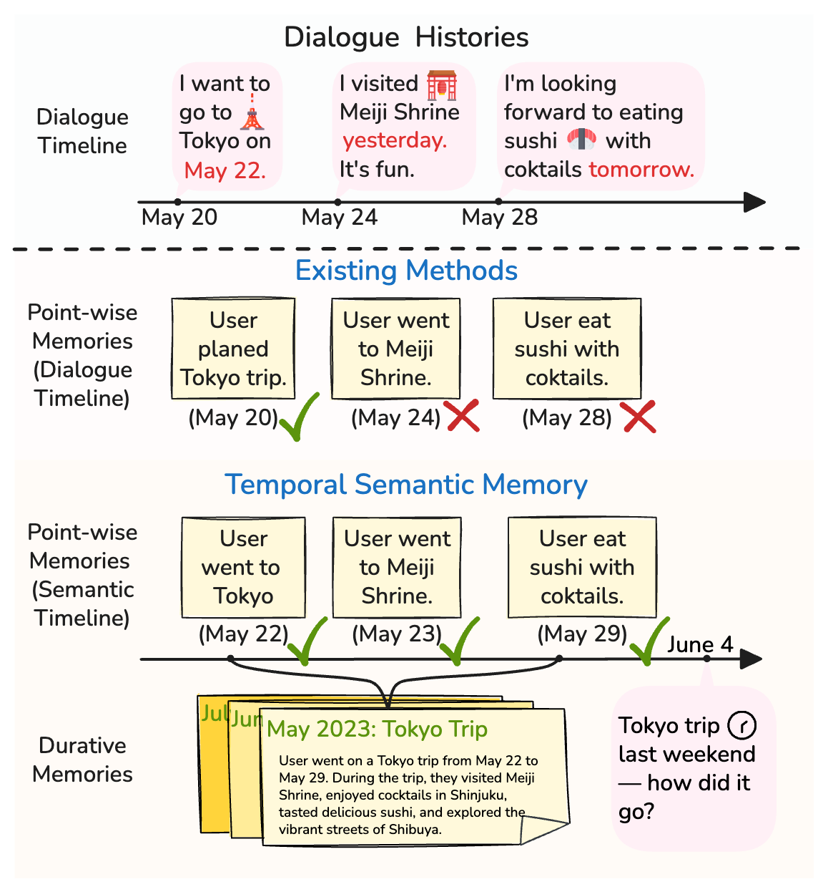
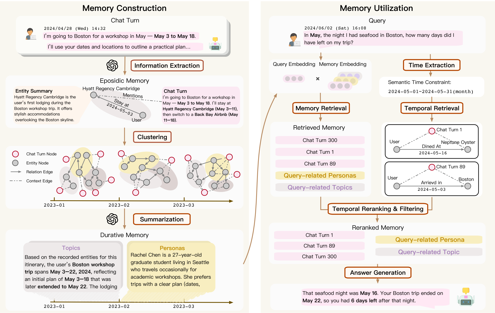
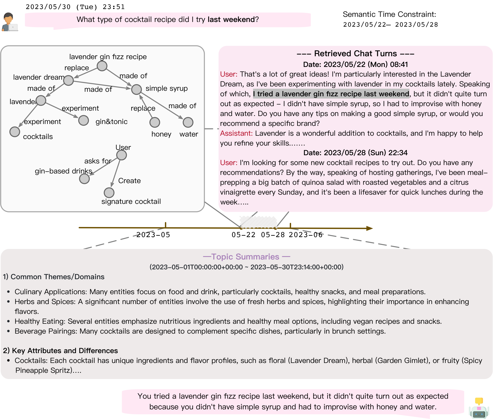

# Beyond Dialogue Time: Temporal Semantic Memory for Personalized LLM Agents

> 阅读范围：依据本地 arXiv 源码 `source/main.tex`，完整覆盖 Abstract、§1–5（Conclusions）及 Limitations，并补充与方法理解直接相关的案例。该条目保存的是 TeX 原文而非 PDF，因此以下采用原文章节、公式及表格文件定位；图片为作者原始素材，未重绘。本文中的“持续记忆”是用户状态、主题和画像的持续性，不是跨任务学习操作技能。

## 论文主线与术语

这篇论文解决两个经常混为一谈的问题：**什么时候说的**与**事情什么时候发生**并不相同；一次持续经历也不应被拆成互不关联的聊天片段。TSM（Temporal Semantic Memory）先把对话中事件投射到语义时间线上，再按时间和主题形成持续性摘要；回答问题时同时检查语义相关性和时间有效性。它的核心不是单纯增加一个时间戳，而是让建库、摘要和检索共享同一种事件时间解释。

| 原文术语 | 本文译法 | 在系统中的实际含义 |
|---|---|---|
| Dialogue timeline | 对话时间线 | 某句话被说出的日期或时刻 |
| Semantic timeline | 语义时间线 | 话语所描述事实实际成立、事件实际发生的时间 |
| Episodic memory | 情景记忆 | 带事件时间的原子事实，以时序知识图谱作索引 |
| Durative memory | 持续性记忆 | 一段时间中的主题、偏好、用户状态等汇总 |
| Topic / Persona | 主题摘要 / 画像摘要 | 前者总结实体，后者回看实体对应的原始对话来总结用户 |
| Sleep-time consolidation | 离线巩固 | 定期重新聚类和生成摘要，避免每轮重建高层记忆 |

## 1 Introduction：为什么聊天记录的时间不够

**来源：原文 §1，Figure 1。** 用户可能今天回顾上周的旅行，也可能今天说明明天才开始的计划。把“今天说的旅行”视为“今天发生的旅行”，会使系统在回答某个日期的问题时取错证据。这里的错误并非相关性模型完全不懂“旅行”，而是它找到了语义正确、时间错误的内容。

**图 1 解读。** 原图将传统方法与 TSM 对照：几条离散对话可以共同描述一次 Tokyo 行程。要回答“旅行期间”的问题，系统需要把这些记录对齐到同一段真实经历。图的重点有两层：时间对齐解决错误日期；把相邻且相关的经历连起来，解决碎片缺失。后者是作者提出 durative memory 的动机。

原文的第二个批评是 temporal fragmentation：每天分别存下“去了哪里”“做了什么”，仍未必得到“这一周在东京旅游”的持续状态。在需要跨会话综合的查询中，只取相似度最高的几句话，可能遗漏行程范围、持续兴趣或偏好变化。因此作者把点状事实保留在底层，再建立按时段组织的语义摘要。

论文限定在长期个性化对话中的事实记忆。所谓“记忆演化”主要是事实更新、用户状态变化和摘要重整，没有训练一个自动产生通用程序技能的策略。正文提出的贡献可以概括为：持续性记忆构建、语义时间引导检索，以及把在线图更新和周期性摘要更新分开的维护机制。

## 2 Related Work：与已有记忆系统的差别

**来源：原文 §2.1 Agent Memory、§2.2 Graph-structured Memory。** 作者先区分事实记忆、经验记忆和工作记忆。事实记忆用于保持用户资料、历史和关系的一致性；经验记忆保存可复用轨迹或策略；工作记忆管理当前上下文。TSM 主要处理第一类，因此其结果不能直接推出在编程或工具调用任务中的效果。

图结构本身也不是新贡献。Mem0 的图版本将事实组织为图，A-MEM 为记忆建立联结，Zep 使用时序知识图谱。TSM 进一步强调：**图里记录了时间，不等于检索真正使用了时间**。它把时序图作为定位原始证据和约束检索的索引，并在图之上构造时段摘要。

阅读时应保留这个比较的范围：作者对 Zep 等方法的概括服务于其实现和实验设置，并不证明所有版本的这些系统都没有时间推理能力。真正需要对照的是本实验采用的构建、检索和更新流程。

## 3 Methodology：从原始对话到时间一致的回答

### 3.1 Preliminary：三种基本操作

**来源：原文 §3.1。** 输入是多会话对话历史，session 可以由用户离开、显式结束或新线程划分；每个 chat turn 是一次用户提问及对应回答。作者把通用记忆系统抽象为：

$$
M=f_{\mathrm{construct}}(D),\qquad
M'=f_{\mathrm{update}}(M,D'),\qquad
A=f_{\mathrm{retrieve}}(M,Q).
$$

其中 $D$ 是既有历史，$D'$ 是新对话，$M$ 是外部记忆，$Q$ 是问题，$A$ 是答案。最后一个函数名写作 retrieve，但在这里包括利用检索结果生成回答的整体过程。这组式子只是接口定义，没有引入新的训练目标。

### 3.2 Overview：两层表示、两种时间尺度

**来源：原文 §3.2，Figure 2。** 底层时序知识图谱保存可追溯的原子事实；高层 topics 与 personas 汇总某段时间中的主题和用户状态。回答时同时检索高层摘要和原始聊天，再根据问题时间约束进行过滤、排序。维护时则把实时图更新与较慢的摘要巩固分开。

**图 2 解读。** 顺着原始对话向右看，可以识别“抽取事实—按时间切片—主题聚类—摘要生成”的处理链。检索端不是只在图上游走：它仍然使用稠密检索，但图提供事实的有效时间及其对应原始对话。topic 和 persona 进入最终上下文时，还要满足用户问题的时间意图。理解这个分工后，就不会把 TSM 误写成“直接检索知识图谱三元组来回答”的系统。

### 3.3 Duration-aware Memory Construction

#### 3.3.1 Episodic Memory Construction：图谱保存什么

**来源：原文 §3.3.1，式 (1)。** 图谱形式为：

$$
\mathcal G=\{(e_s,r,e_o,t)\mid t\in\mathbb T\}.
$$

$e_s,e_o$ 是主语和宾语实体，$r$ 是关系，$t$ 是该事实成立的语义时间。每个实体还有规范名称与摘要：$e=(n_e,s_e)$。实体摘要由支持它的对话上下文生成，用于后续的语义聚合。

系统处理当前一轮对话时，可查看前 $n$ 轮作为上下文，然后抽取实体和关系，进行去重与时间一致性检查。这里的上下文窗口有助于恢复代词或省略，但论文正文没有给出所有抽取、消歧超参数，不能把它理解成可完全无歧义地从任意口语解析时间。

特别值得保留的实现事实是：**TKG 不是直接返回给生成器的主要记忆内容，而是索引**。它承担语义时间定位、过滤及一致性判断。真正检索的记忆池包括 topic、persona 和 raw chat turns。

#### 3.3.2 Durative Memory Construction：从点状事实形成持续状态

**来源：原文 §3.3.2，式 (2)–(9)。** 首先将图按固定时间间隔切开：

$$
\mathcal G^{(k)}=\{(e_s,r,e_o,t)\in\mathcal G:t\in[\tau_k,\tau_{k+1})\}.
$$

默认间隔为**一个月**。每个时间片内取出出现的实体集合 $\mathcal E^{(k)}$，再基于实体名称的嵌入 $\mathbf h_e^{\mathrm{name}}$ 做高斯混合模型聚类：

$$
p(z\mid e)=\operatorname{GMM}(\mathbf h_e^{\mathrm{name}}),\qquad
 a(e)=\arg\max_z p(z\mid e),\qquad
\mathcal E_z=\{e\in\mathcal E^{(k)}:a(e)=z\}.
$$

$z$ 是某个语义主题簇。GMM 给出的软归属最后通过 argmax 变成单一簇指派，不能据此把本文说成“每个实体同时归属多种主题”的方法。时间切片先执行，语义聚类后执行，说明它首先保障时段局部性，再在该时段内部寻找主题。

对同一簇中的实体名称和实体摘要进行汇总，得到 topic：

$$
\mathrm{Topic}_z=(\tau_k,s_z,\mathbf c_z),\quad
s_z=\mathrm{LLM}_{\mathrm{sum}}(\{(n_e,s_e):e\in\mathcal E_z\}),\quad
\mathbf c_z=\mathrm{Embedding}(s_z).
$$

这里的 $s_z$ 描述该时段的主题，$\mathbf c_z$ 是用于检索的向量。生成 persona 时，作者没有仅对实体摘要再摘要一次，而是通过双向索引找到这些实体出现的原始对话集合 $\mathcal D_z$，再总结其中表现出的用户特征：

$$
\mathrm{Persona}_z=(\tau_k,\mathbf p_z,\mathbf u_z),\quad
\mathbf p_z=\mathrm{LLM}_{\mathrm{sum}}(\mathcal D_z),\quad
\mathbf u_z=\mathrm{Embedding}(\mathbf p_z).
$$

尽管原文用粗体 $\mathbf p_z$，它在这个定义中表示画像摘要文本，而 $\mathbf u_z$ 才是检索向量。两者容易被误读。topic 回答“这一时段谈了哪些关联内容”，persona 更接近“从这些对话看，这一时段用户有什么兴趣、倾向和行为模式”。

由此产生的“持续性”是时间片内的聚合表示，不能自动等同于精确恢复任意事件的连续起止区间。跨月旅行、突然变化的偏好或非常稀疏的记录，仍会受到固定时间粒度的限制。

### 3.4 Semantic-time Guided Memory Utilization：时间约束怎样影响检索

**来源：原文 §3.4，式 (10)–(16)。** 给定问题 $q$ 和提问时间 $t_{\mathrm{now}}$，系统先解析语义时间范围：

$$
T_q=\operatorname{ParseTime}(q,t_{\mathrm{now}}).
$$

实现使用 spaCy 处理显式和相对时间表达。$t_{\mathrm{now}}$ 的作用是解释“上个月”“昨天”等表达；时间范围应该对应被询问的事件，而不是聊天消息本身的发送时间。

记忆候选池与语义检索得分为：

$$
\mathcal M=\mathcal M_{\mathrm{topic}}\cup\mathcal M_{\mathrm{persona}}\cup\mathcal M_{\mathrm{raw}},\qquad
s_{\mathrm{sem}}(m;q)=\operatorname{sim}(\operatorname{Enc}(q),\operatorname{Enc}(m)).
$$

系统先取语义得分最高的 Top-$K$，再对高层摘要做时间过滤。topic/persona 有明确时间片 $\tau(m)$，只有与 $T_q$ 匹配时保留；raw turn 则不会仅因其对话时间不匹配就直接丢弃，因为它可能在今天谈昨天发生的事。

与此同时，从 TKG 查找有效时间属于 $T_q$ 的事实，再通过双向索引得到其来源对话：

$$
\mathcal F_T=\{(e_s,r,e_o,t)\in\mathcal G:t\in T_q\},\qquad
\mathcal S_T=\operatorname{Idx}(\mathcal F_T).
$$

最后使用字典序，而不是线性加权，优先考虑时间匹配，再考虑语义相似度：

$$
\pi(m;q)=\left(\mathbf1[\tau(m)\in T_q],s_{\mathrm{sem}}(m;q)\right).
$$

这意味着时间有效性是第一排序键。同一时间匹配等级内，才由语义相似度排序。正文的叙述还说明原始对话的时间提升应由 $\mathcal S_T$ 中的图证据支持；但符号式中统一使用 $\tau(m)$，没有把 raw turn 的映射规则完全展开。这属于原文形式化简略，复现时需要结合代码，不能擅自将 raw turn 的发送时间代入。

还有一个方法边界：时间过滤发生在 dense Top-$K$ **之后**。若正确证据在初始召回阶段就没有进入候选池，时间重排不保证能把它补回来。因此收益仍依赖初始检索覆盖率以及时间抽取质量。

### 3.5 Hierarchical Memory Update：哪些操作在线执行

**来源：原文 §3.5。** 新对话到达时，实体执行 add 或 merge；关系依据语义和有效时间执行 DUPLICATE、ADD、INVALIDATE、UPDATE。实现中关系包含 `valid_time` 与 `invalid_time`，用于表示何时成立、何时失效。INVALIDATE 的价值是保留历史事实，同时避免它继续充当当前状态。

topic/persona 的生成成本更高，因此按月或在累计轮次超过阈值后离线重整：重新组织实体、执行 GMM 聚类、生成新的摘要快照。这种安排把“新信息可立即检索”和“高层表示周期性一致化”分成两个维护频率。作者没有报告足够完整的构建成本表，不能仅凭 sleep-time 设计就推断端到端成本一定低于简单 RAG。

## 4 Experiments：实验是否支持时间建模的价值

### 4.1 Experimental Setup

**来源：原文 §4.1。** LongMemEval_S 含 500 道人工编写的问题，每题历史约 115k tokens，覆盖信息抽取、跨会话推理、时间推理、知识更新和拒答等能力。LoCoMo 原数据含 1,986 题、五类问题；本文结果表列出的是 Temporal、Multi-Hop、Open-Domain、Single-Hop 四类，样本数合计 1,540，未列 adversarial。因此不能直接把该表准确率解释成原版全部 1,986 题的得分。

生成骨干是 GPT-4o-mini 与 Qwen3-30B-A3B-Instruct-2507；评价使用 GPT-4.1-mini 作 judge，报告答案 Accuracy。基线包括 Full Text、Naive RAG、LangMem、A-MEM、MemoryOS、Mem0/图版本以及部分设置下的 Zep。这里的 ACC 与原始 LoCoMo 论文采用的 token F1 不是同一种指标，跨论文比较必须先核对评测协议。

### 4.2 Main Results：总体收益与分类结果

**来源：`source/table/main_results_longmemeval.tex`，原文 Table 1。** 以下完整保留 LongMemEval_S 的总体数值，并选出最能检验主张的时间与跨会话列：

| 骨干 | 方法 | Overall ACC (%) | Temporal | Multi-Session |
|---|---|---:|---:|---:|
| GPT-4o-mini | Full Text | 56.80 | 31.58 | 45.45 |
| GPT-4o-mini | Naive RAG | 61.00 | 39.85 | 48.48 |
| GPT-4o-mini | LangMem | 37.20 | 15.79 | 20.30 |
| GPT-4o-mini | A-MEM | 62.60 | 47.36 | 48.87 |
| GPT-4o-mini | Zep | 60.20 | 36.50 | 47.40 |
| GPT-4o-mini | MemoryOS | 44.80 | 32.33 | 31.06 |
| GPT-4o-mini | Mem0 | 53.61 | 40.15 | 46.21 |
| GPT-4o-mini | TSM | **74.80** | **69.92** | **69.17** |
| Qwen3 | Full Text | 54.80 | 33.08 | 35.61 |
| Qwen3 | Naive RAG | 60.80 | 36.84 | 47.73 |
| Qwen3 | LangMem | 50.80 | 37.60 | 38.35 |
| Qwen3 | A-MEM | 65.20 | 51.88 | 51.12 |
| Qwen3 | MemoryOS | 49.60 | 28.57 | 36.84 |
| Qwen3 | Mem0 | 39.51 | 41.94 | 28.13 |
| Qwen3 | TSM | **74.80** | **63.91** | **63.91** |

在 GPT-4o-mini 上，74.80−62.60=**12.20 个百分点**，对应摘要强调的最大总体收益；Temporal 增加 22.56 点，Multi-Session 增加 20.30 点。它们与时间对齐、持续性汇总的动机一致。但是 TSM 并未赢得所有分类：GPT-4o-mini 的 Single-Preference 为 40.00，低于 Mem0 的 60.00；Single-User 87.14，也低于 A-MEM 的 92.86。类别样本量小会使比较不稳定，但不能把负面结果抹去。

**来源：`source/table/main_results_locomo.tex`，原文 Table 2。**

| 方法 | GPT-4o-mini Overall ACC (%) | Qwen3 Overall ACC (%) |
|---|---:|---:|
| Full Text | 71.83 | **74.87** |
| Naive RAG | 63.64 | 66.95 |
| LangMem | 57.20 | 60.53 |
| A-MEM | 64.16 | 56.10 |
| MemoryOS | 58.25 | 61.04 |
| Mem0 / Mem0ᵍ | 68.44（图版本） | 43.31 |
| Zep | 58.44 | 未列 |
| TSM | **76.69** | 71.23 |

Qwen3 上 Full Text 超过 TSM。作者的解释是 LoCoMo 历史约 16k–26k tokens，可以直接放入上下文；检索压缩反而有丢失信息的风险。这与 LongMemEval_S 的长历史形成有价值的对照：外部记忆的必要性受上下文长度和任务类型共同影响。

**原表核验发现的限制。** LoCoMo 表内若干基线的分类数值，按表头样本数加权后不能得到其 Overall。例如 GPT-4o-mini Full Text 的四分类值 76.92、87.14、89.29、36.67，按 321/282/96/841 加权约为 57.6，而表中总体是 71.83。这不是四舍五入能解释的差异。这里保留作者报告的 Overall 用于理解正文，但不把疑似有误的分类行用于细粒度结论；原始表格需要作者或运行结果进一步核实。

### 4.3 Ablation Study：时间检索与持续摘要各贡献多少

**来源：`source/table/ablation.tex`，原文 Table 3。**

| 设置 | Overall | Temporal | Multi-Session | Knowledge Update | Preference |
|---|---:|---:|---:|---:|---:|
| TSM | 74.80 | 69.92 | 69.17 | 80.77 | 40.00 |
| 去掉时间过滤/重排 | 72.80 | 63.91 | 71.43 | 79.49 | 33.33 |
| 去掉 topic/persona 摘要 | 73.40 | 65.41 | 69.92 | 82.05 | 23.33 |

第一项消融保留构建的记忆，但利用阶段只做稠密检索；Temporal 下降 6.01 点，支持“把时间编码进去还不够，读取时也要使用”的主张。它在 Multi-Session 上反而上升，说明硬时间限制可能筛掉有用背景，不能说时间过滤对每类题都改善。

第二项移除高层摘要、仍保留时间重排，所以它不是普通 Naive RAG。Temporal 和 Preference 下降，而知识更新与跨会话列略升，表明抽象摘要在聚合持续状态的同时，也可能引入干扰或过度概括。

**原文有明确算术/排版不一致。** summary 消融行写 73.40，但正文写 73.6，附带差值写 −1.2；按该行应是 −1.40。Preference 23.33 相对 40.00 应是 −16.67，而非差值行/正文中的 −10.0。以上表格照抄“原始结果行”，分析采用可复核的减法，并不替作者选择哪个版本才是实际实验结果。整体机制的方向性有支持，精确消融幅度仍需核查。

### 案例辅助理解：时间线为什么影响答案

**来源：原文附录 Case Study，Figure 3。**

**图 3 解读。** 用户在 2023-05-30 询问“上周末尝试了哪种鸡尾酒配方”，图中返回 lavender gin fizz，并展示相关实体图、5 月主题摘要和两条原始对话。它让读者看到摘要与底层对话怎样一起进入回答，而不是只看到最终一句答案。

**案例本身存在需要核查的时间问题。** 图中将问题约束标为 05-22 至 05-28；被突出引用的证据却是 05-22 说“last weekend”，通常对应 05-20/21，而 05-30 的“last weekend”通常对应 05-27/28。仅从图示材料，无法确认这两次相对时间指向同一事件。因此这张原图可用于理解系统的数据流，但不能当作语义时间正确性的无争议成功示例；它也提醒我们需要同时核对事件时间与话语时间。

## 5 Conclusions 与 Limitations：可以带走什么

**来源：原文 §5 Conclusions、Limitations。** 作者的结论是，语义时间和持续性组织共同改善长期对话记忆，在时间推理、跨会话理解场景尤其有价值。完整方法在两种骨干和两套数据上取得较强结果；但 LoCoMo 的全文基线反例提醒我们，外部记忆的收益应与全文可用性一起讨论。

作者明确列出两项局限：固定月粒度可能不适合不同事件密度；实验聚焦个性化，尚未验证程序性记忆或多智能体共享记忆。结合正文，还应留意时间解析错误、后过滤导致漏召回、摘要更新滞后，以及图构建所需模型调用成本。这些是由方法流程推导出的阅读判断，不是论文已经测量的失败率。

## 对后续研究的启发与复现清单

对于涉及人物长期状态、日程或经历的系统，最值得采用的是**对话时间、事件有效时间、摘要覆盖时间分开保存**。例如人物今天回忆三年前搬家，原始话语、搬家事件及当前居住状态应有不同的时间语义。TSM 给出了一个实现方向，但故事世界中的误信、虚构计划、取消事件和不同叙述者视角，仍需额外建模，本文没有直接解决。

若要复现或比较，应固定同一生成模型和 judge，记录原始问题数量、是否排除 adversarial、摘要时间粒度、Top-$K$、时间表达解析失败的默认行为、在线/离线更新触发规则及完整 token 成本。尤其需要检查上述 LoCoMo 分类表和消融表的不一致，不能把这份论文的所有小数当作已独立验证的结果。

本篇正文已按原文章节覆盖到 Conclusions；全部 3 张论文内容图已嵌入对应讨论处。附录提示词未逐条翻译，数值冲突已就地标注。
