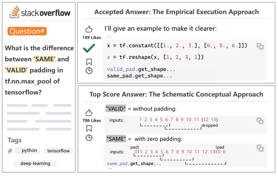
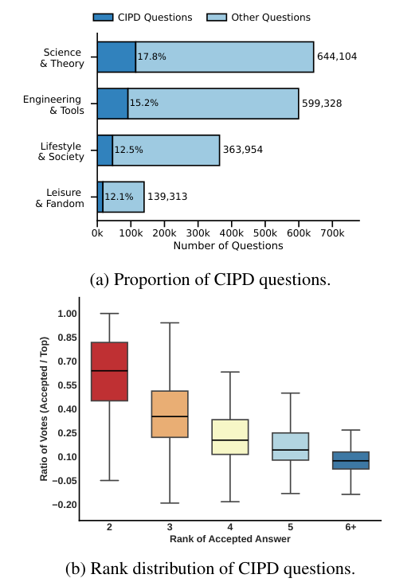
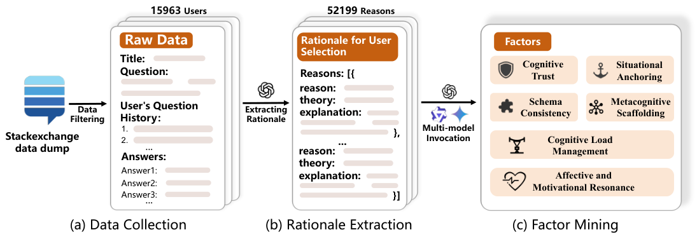
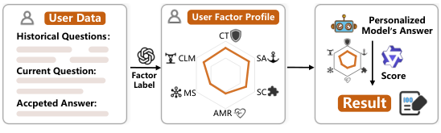
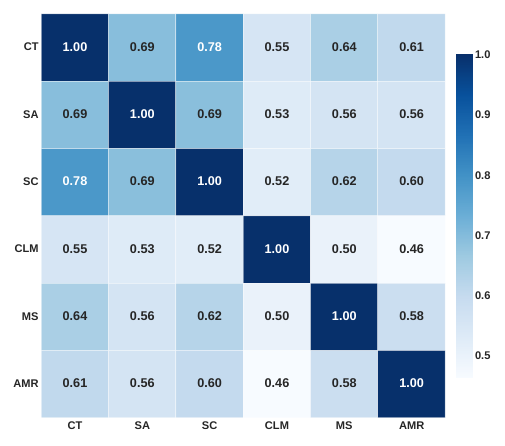

# CoPA: Benchmarking Personalized Question Answering with Data-Informed Cognitive Factors

> 来源：本地 arXiv:2604.14773v1 PDF，2026-04-16。完整阅读范围是 Abstract、§1–7 Conclusion，以及 Limitations、Ethics Statement；页码指 PDF 页码。5 张正文原图均已嵌入。本篇是个性化问答评价基准，重点不在长期记忆存储算法，也不是教育效果的随机对照试验。

## 论文主线：从真实选择差异中构建评价维度

同一道问题，社区票数最高的回答与提问者最终接受的回答可能不同。CoPA 将这种差异称为 **Community–Individual Preference Divergence（CIPD）**，尝试从个人选择偏离群体共识的样本中推断“用户需要哪一种解释”，再把这些理由归纳为六类认知因素，用于评价生成答案。

这条证据链包含三个不同层次：用户的 accepted answer 是可观察行为；模型解释用户为何选择它，是事后推断；六因素评分是否有效，需要用区分个人选择、人类一致性和外部数据实验检验。不能因为行为来源真实，就把后两层都当作用户直接陈述过的真实心理动机。

## 1 Introduction：为什么一般回答质量不足以评价个性化

**来源：PDF pp.1–2，§1，Figure 1。** 对小孩解释引力与对物理学家解释引力，即使都事实正确，组织方式也应不同。传统 BLEU/ROUGE 检查词汇相似，通用 judge 倾向评价“整体写得好不好”，人工制定的规则又可能缺乏行为数据支撑。作者希望评价的是答案与某个用户认知需要的匹配程度。

**图 1 解读。** 例子询问 TensorFlow 的 SAME/VALID padding：提问者接受的是带代码执行例子的回答，得到 189 likes；社区更喜欢示意图和概念解释，得到 786 likes。两者都可能正确，差别在于解释路径。CIPD 因而提供一个有挑战的对照：评价器需要识别“对这个用户更合适”，不能仅偏向受欢迎、内容全面的回答。

这个例子同时揭示潜在混淆：接受答案还可能受解决问题是否成功、回答时机或用户后续操作影响。作者后面检查了回答时间，但无法完全排除这些因素。因此 CIPD 应理解为个性化偏好的行为代理，而非纯粹、无噪声的心理标签。

本文贡献包括从大规模 QA 历史归纳因素、建立 1,985 用户的 CoPA、比较多种个性化生成方法，并验证这些因素在其他 QA 数据上的用途。贡献中心是**评价维度的构造与检验**，不是提出新的检索记忆模型。

## 2 Community–Individual Preference Divergence：这个现象有多普遍

**来源：PDF pp.2–3，§2，Table 1、Figure 2。** 数据来自 Stack Exchange 的 173 个社区，归为 Engineering & Tools、Science & Theory、Lifestyle & Society、Leisure & Fandom 四组。群体信号是投票数，个人信号是提问者标记 accepted 的回答。作者在分析 CIPD 时排除只有一个回答的问题，因为那类样本没有可比较的选择。

**图 2 解读。** 面板 (a) 显示 CIPD 在科学理论、工程工具、生活社会、休闲兴趣中的占比分别约为 17.8%、15.2%、12.5%、12.1%。这说明即使有明确事实答案，用户也可能选择较低票的解释。面板 (b) 的横轴是 accepted answer 的排名，纵轴是 accepted/top 的票数比；排名越靠后，差异通常越大，表明并非全是近乎并列的微小差别。

为检查时间混淆，作者统计发现 **72.70%** 的 accepted answers 并不早于对应最高票回答。这个结果削弱了“只是第一个回答更容易被接受”的单一解释，但并未证明剩余差异全部来自认知偏好。投票数积累时间、答案质量和问题是否已被解决仍可能产生影响。

正文 Table 1 中四大类问题量分别为 1,537,431、1,652,195、664,689、287,908，属于类别分布描述；下一节提到的 6.8 million 是初始全量数据池，626,786 则是后续用户及质量筛选后的集合。这些数量处在不同筛选阶段，不能互相替换。

## 3 Factor Distillation：从行为样本到六个因素

**来源：PDF pp.3–4，§3，Figure 3。**

**图 3 解读。** 流程先把同一用户的提问历史与答案选择连接，再让 LLM 输出选择理由，最后用多个模型多次调用寻找稳定的因素。图中 15,963 users 与 52,199 reasons 分别指用户与抽取出的理由池，不能把后者当作最终测试题数。多模型共识降低单次归纳的偶然性，但模型共享的偏差仍可能保留。

**数据清洗。** 作者去掉含超链接、超过 4,096 words、无回答的样本，分别过滤 1,965,220、5,310、734,011 条；再保留跨领域至少提出过三个 CIPD 问题的用户。最终用于因素归纳的集合是 **15,963 用户、626,786 问题**。这使用户有足够历史，但也使数据偏向活跃、有明确选择差异的人群。

每个用户 $i$ 的第 $j$ 次交互被表示为：

$$
u_{i,j}=\left(q_{i,j},(a^*_{i,j},v^*_{i,j}),\{(a^{(k)}_{i,j},v^{(k)}_{i,j})\}_{k=1}^{N_{i,j}}\right).
$$

$q$ 是问题，$a^*$ 是 accepted answer，$v^*$ 是其票数；其他 $a^{(k)},v^{(k)}$ 是候选答案与票数。若 $a^t$ 为最高票答案，则 CIPD 满足 $a^t\ne a^*$ 且 $v^t>v^*$。这个定义要求个人接受与群体最高票明确不一致，而不是泛指任何个性化问题。

**理由抽取。** 模型接收当前问题、已标明的 accepted answer、其他候选以及最多最近 50 条问题上下文，输出结构化 JSON：行为理由 reason、对应理论 theory、解释 explanation。该过程知道当前选择结果，因此它是对选择的事后解释，不能把这一步自身的成功当作“预测未见选择”。

作者随机抽查 500 条理由，由两名领域专家判断可靠性，报告 Cohen’s $\kappa=0.7251$、与专家判断的 alignment rate 为 97%。这给出理由解释的可接受性证据，但 alignment 不等于已直接测量到用户心理。后续仍需要无泄漏的偏好区分实验。

**因素汇总。** GPT-5-chat-latest、Gemini-2.5-Pro、Qwen3-Max 的重复调用结果经频率共识筛选，并由两位心理学博士志愿者做合理性检查，得到以下六个维度：

| 因素 | 缩写 | 中文理解 | 评价时具体检查什么 |
|---|---|---|---|
| Cognitive Trust | CT | 认知信任 | 证据、论证和可信程度是否满足该用户在该领域的要求 |
| Situational Anchoring | SA | 情境锚定 | 是否贴合用户眼前的问题、工具和限制 |
| Schema Consistency | SC | 图式一致性 | 是否能接到用户已有知识、概念和理解路径 |
| Cognitive Load Management | CLM | 认知负荷管理 | 信息量、细节密度和复杂度是否合适 |
| Metacognitive Scaffolding | MS | 元认知支架 | 是否帮助用户检查理解、反思或形成自主推理 |
| Affective and Motivational Resonance | AMR | 情感与动机共鸣 | 是否匹配用户当下情绪与学习/解决问题的动机 |

这些因素可以重叠。例如与已有知识对接既影响 SC，也可能提高 CT。论文并未要求每个答案只属于某一个因素；它们是六个评分维度，不是互斥标签。后面的相关性分析专门检查这一点。

## 4 The CoPA Benchmark：如何建立画像并评分

### 4.1 Benchmark Construction

**来源：PDF pp.4–5，§4.1，Table 2、Figure 4。** 评测集在每个领域按用户最近问题的票数排序，选取前 20%；不足 10 用户的领域全部纳入，超过 50 名候选的领域限制为 50。最终得到 **1,985 位不同用户**。

| 类别 | 用户数 | 每用户平均历史问题数 | 画像平均长度（原表统计值） |
|---|---:|---:|---:|
| Engineering & Tools | 864 | 30.69 | 555.12 |
| Science & Theory | 456 | 27.57 | 597.74 |
| Lifestyle & Society | 413 | 41.09 | 580.34 |
| Leisure & Fandom | 252 | 40.74 | 590.10 |

这不是一组每个人都固定有 50 条历史的数据：50 是构造画像时的上限，各类别平均历史量不同。原表还记录标题和正文长度，说明实际可用历史具有明显的信息量差异。

**图 4 解读。** 左侧用户数据被转换为六因素画像，中间雷达图表示用户各维度需求，右侧评价器据此给个性化生成答案评分。雷达图不是模型记忆命中率；它是对答案需要满足何种认知偏好的结构化表达。

用户画像记为 $P_i=\{p_1,\ldots,p_6\}$。每个 $p_k$ 描述该用户在第 $k$ 因素上的偏好，而非一项客观人口学属性。生成回答 $R_i$ 后，评价 LLM 逐因素给 $s_k\in\{0,1,2\}$：0 为不匹配，1 为部分匹配，2 为完全匹配，再归一化至 $[0,1]$ 汇总。

读分数时要记住：这是**画像条件下的认知匹配得分**，不等价于事实正确率，也不是原始用户满意度。一个答案如果迎合错误画像，仍可能得到较高分，因此画像和 judge 的可靠性是评价链不可分割的组成部分。

### 4.2 Evaluated Approaches

**来源：PDF pp.5–6，§4.2。** No-Personalization 不提供用户历史。Time-Personalization 按时间采用最近 $K$ 个问题；RAG-Personalization 检索与当前问题最相似的 Top-$K$ 历史问题；Profile-Personalization 则把最近历史压缩成 Domain Profiles 与 Global Profiles，分别描述领域内和跨领域偏好。

三种策略比较的是选择/组织个性化上下文的方法。Time 保持近期状态，RAG 强调与当前问题相似的经验，Profile 尝试抽象较稳定的用户特征。它们并非只在“是否有记忆”这一变量上不同；压缩方式和给生成器的信息形式也改变，因此结果应按完整策略解释。

## 5 Experiments：依次验证评价因素、迁移、生成质量和人工一致性

### 5.1 Experimental Setup

**来源：PDF p.5，§5.1。** 理由抽取使用 GPT-5-chat-latest，因素归纳集成 GPT-5-chat-latest、Gemini-2.5-Pro、Qwen3-Max，温度均为 0.7。生成骨干为 Qwen3-8B Fast-Thinking 和 GPT-4o-mini；RAG 嵌入使用 Qwen3-Embedding-4B；评价器是 Qwen3-32B Fast-Thinking。本地模型部署使用四张 A800 与 vLLM。

多个阶段由不同 LLM 完成，能减少同一模型从头到尾自评的直接重合，但仍不是独立于 LLM 偏差的测量。尤其评价器与其中一个生成骨干来自同一模型家族，模型排名应结合后面的人工验证阅读。

### 5.2 Effectiveness of Factors：能否识别用户选中的答案

**来源：PDF pp.5–7，Table 3。** 将 accepted answer 得分记为 $S_{\mathrm{acc}}$，最高票答案得分为 $S_{\mathrm{top}}$，比较：

$$
\mathrm{Accuracy}=\Pr(S_{\mathrm{acc}}>S_{\mathrm{top}}),\quad
\mathrm{TieRate}=\Pr(S_{\mathrm{acc}}=S_{\mathrm{top}}),\quad
\mathrm{Margin}=S_{\mathrm{acc}}-S_{\mathrm{top}}.
$$

Accuracy 的含义是能否把用户选择排在社区最高票之前。Tie 不计入正确，所以它不能直接与忽略平局的二选一胜率比较。主实验将历史截断在**前一次 CIPD 问题**以构造因素画像，避免把当前 accepted answer 直接喂给画像生成阶段；使用当前 CIPD 的结果另放附录。这一防泄漏设置是判断实验有效性的关键。

| 评分方法 | 工程 Accuracy / Tie (%) | 科学 Accuracy / Tie (%) | 生活 Accuracy / Tie (%) | 休闲 Accuracy / Tie (%) |
|---|---:|---:|---:|---:|
| Direct judge | 12.15 / 80.67 | 18.86 / 75.00 | 10.17 / 84.75 | 11.90 / 81.75 |
| CoT judge | 26.00 / 60.31 | 31.35 / 55.16 | 26.39 / 61.74 | 29.55 / 59.85 |
| Jaccard | 40.28 / — | 42.32 / — | 39.23 / — | 42.06 / — |
| Inclusion coefficient | 34.07 / — | 26.54 / — | 27.60 / — | 28.17 / — |
| 随机生成因素 | 25.58 / 61.00 | 30.26 / 56.14 | 33.90 / 53.27 | 35.09 / 50.00 |
| CoPA 因素 | **51.57 / 26.28** | **53.44 / 22.88** | **51.43 / 24.12** | **55.37 / 18.24** |

Direct 的高平局率意味着：两份高质量回答都容易被判为“不错”，却无法判断个人适配差别。CoT 有改善，但仍大量平局。CoPA 的因素不仅优于通用 judge，也优于随机因素，因此结果支持“从行为数据归纳维度”有用，而不只是提示更长、更复杂。

CoPA 四领域 Margin 分别是 0.127、0.136、0.093、0.143；Direct 分别为 0.026、0.065、0.027、0.028。这反映个性化区分度增强，但总体 Accuracy 仍只有约 51%–55%，不能描述成准确识别绝大多数用户动机。

**因素消融：原文 Table 4。** 为便于比较，以下列出 Accuracy：

| 去掉因素 | 工程 | 科学 | 生活 | 休闲 |
|---|---:|---:|---:|---:|
| CT | 54.28 | 54.82 | 54.96 | 54.76 |
| SA | 54.05 | 52.41 | 55.21 | 55.95 |
| SC | 54.63 | 54.17 | 54.72 | 56.35 |
| CLM | 53.24 | 53.95 | 55.69 | 57.14 |
| MS | 50.00 | 51.54 | 53.51 | 53.57 |
| AMR（表中写 AM） | 53.82 | 53.73 | 55.21 | 55.56 |
| All | **55.09** | **55.04** | **56.17** | **57.14** |

MS 消融下降较明显，例如工程 55.09→50.00，说明“是否帮助用户形成自己的理解”提供了其他因素没有完全覆盖的信息。但休闲领域去掉 CLM 后 Accuracy 仍是 57.14，所以不能把作者“移除任意因素所有指标都退化”的概括当作每个格子的严格事实。

另一个需要保留的核验点：**Table 4 的 All 与 Table 3 的 ours 数值不同**，正文没有在表格附近完整说明两个实验口径为何不一致。这里将消融只在 Table 4 内部比较，不跨表计算消融提升，也不擅自把两组 All 合并成一个结果。

### 5.3 Generalizability of the Factors

**来源：PDF pp.6–7，Table 5；LaMP-QA 结果在附录 Table A5。** 作者把六因素加进 UPGC-QA 与 LaMP-QA 的生成提示，再检查原有个性化方法是否更好。在 UPGC-QA 中覆盖 Wildchat、StackExchange、CS101 三类场景，指标采用原基准的 Jaccard 与 Inclusion Coefficient。

| 骨干与方法 | Wildchat Jac. / IC | StackExchange Jac. / IC | CS101 Jac. / IC |
|---|---:|---:|---:|
| Qwen3-8B ProfileQA | 6.99 / 8.87 | 43.01 / 73.02 | 16.32 / 45.99 |
| 加六因素 | **8.31 / 10.03** | **44.17 / 74.23** | **17.67 / 47.35** |
| GPT-4o-mini ProfileQA | 8.22 / 11.35 | 44.09 / 72.98 | 16.37 / 46.23 |
| 加六因素 | **9.64 / 11.67** | **44.96 / 75.05** | **18.24 / 47.98** |

结果说明因素可用作生成指导，并非仅在 CoPA 自有评分下有用。不过“在外部问答数据有效”仍不等于能泛化到所有个性化任务；这些场景仍具有明显的知识解释和问答性质。论文没有证明六因素足以覆盖推荐系统、开放式陪伴或长期行为改变。

### 5.4 Factor-level Evaluation of Personalized QA Approaches Using CoPA

**来源：PDF pp.6–8，Table 6。**

| 回答/方法 | Engineering | Science | Lifestyle | Leisure | Avg. |
|---|---:|---:|---:|---:|---:|
| Accepted Answer | 0.8009 | 0.7984 | 0.7393 | 0.7946 | **0.7833** |
| Random Answer | 0.6183 | 0.5774 | 0.5516 | 0.5418 | 0.5722 |
| Top-voted Answer | 0.6207 | 0.5941 | 0.5633 | 0.5886 | 0.5917 |
| GPT-4o-mini No-Pers. | 0.6307 | 0.4700 | 0.5347 | 0.5136 | 0.5373 |
| GPT-4o-mini Time-Pers. | 0.6858 | 0.5353 | 0.5591 | 0.5516 | 0.5830 |
| GPT-4o-mini RAG-Pers. | 0.6964 | 0.5334 | 0.5748 | 0.5472 | 0.5909 |
| GPT-4o-mini Profile-Pers. | 0.7003 | 0.5912 | 0.6223 | 0.5719 | **0.6214** |
| Qwen3-8B No-Pers. | 0.6671 | 0.5409 | 0.5803 | 0.5403 | 0.5821 |
| Qwen3-8B Time-Pers. | 0.7188 | 0.5691 | 0.6230 | 0.5638 | 0.6187 |
| Qwen3-8B RAG-Pers. | 0.7198 | 0.5724 | 0.6172 | 0.5721 | 0.6204 |
| Qwen3-8B Profile-Pers. | 0.7341 | 0.6365 | 0.6729 | 0.6002 | **0.6609** |

画像策略在两种骨干上都最好。Qwen3 的总体 0.6609 相比无个性化的 0.5821 提高 0.0788，但仍低于 accepted answer 的 0.7833，说明结构化画像有帮助却没有消除差距。

正文笼统称 Time/RAG 超过最高票回答，然而 GPT-4o-mini 的总体 0.5830、0.5909 都低于最高票 0.5917。这个主张只能在部分模型/领域成立，不能照搬成普遍结论。表格显示的真实趋势是：加个性化信息通常优于同骨干无个性化，其中 Profile 最稳定。

因素级分析认为 CT、SC、SA 得益于画像；CLM 普遍较高，说明模型较会控制信息密度；MS 仍低，表明让答案真正帮助用户反思与自主学习，比按用户口味调整表述更困难。这些分析提示，个性化不应只以措辞和语气变化衡量。

### 5.5 Human Validation of CoPA Scoring

**来源：PDF p.8，Table 7。** 两名研究生独立评价随机 50 组问题—回答，使用同样的三点量表与六因素准则。整体人际 weighted Cohen’s $\kappa=0.643$，人类平均评分与 LLM 的 Spearman $\rho=0.754$。分因素的人机相关范围为 MS 的 0.683 至 SA 的 0.830。

这些结果支持评分有一定人类一致性，但样本只有 50 组，评价者也不是最初提问的用户。因此这是“人类是否接受该评分规则”的检验，并不是“系统是否正确预测真实用户后续满意度”的直接验证。

### 5.6 Factor Correlation Analysis

**来源：PDF p.8，Figure 5。**

**图 5 解读。** 最大相关出现在 CT–SC，$\rho=0.78$；CLM 与其他因素的相关较低，约为 0.46–0.55。作者据此认为因素具有联系但并非完全重复。矩阵并不能证明六个因素在心理学意义上互相独立，也不能仅因低于 0.9 就宣布已经完成严格的构念效度检验。

更谨慎的结论是：当前评分数据中，CLM 提供了较不同的信息，CT 与 SC 关系较紧密。若将六项简单平均，相关较高的维度可能重复计入相近偏好，后续应考虑权重、用户特定重要性以及跨数据源稳定性。

## 6 Related Work

**来源：PDF pp.8–9，§6。** 个性化 LLM 方法分为非参数上下文增强与参数化建模。前者检索历史或构建画像，便于更新和解释；后者把偏好编码到参数或适配矩阵中，但面临存储和遗忘等成本。本篇比较的 Time/RAG/Profile 属于前者。

评价相关工作则分词汇匹配、LLM judge、规则启发式三类。CoPA 试图在它们之间补上“维度从何而来”的问题：因素来自选择差异的归纳，并通过多个实验验证。因此它与记忆系统的关系是帮助评价记忆如何改善用户适配，而不是直接测量记忆存储或检索是否准确。

## 7 Conclusion、Limitations 与 Ethics Statement

**来源：PDF pp.9–10。** 作者总结：CIPD 提供发现个性化需求的行为材料，六因素使评价更能区分个人选择与群体共识，结构化用户画像能提升生成答案的匹配度。完整证据包括选择对比、因素消融、外部 QA 迁移、生成方法对比和小规模人工一致性。

原文主动承认三个主要限制：Stack Exchange 单一数据源可能过度代表解释和学习偏好；因素间不保证正交；归纳、画像和评分多个阶段依赖 LLM，存在 epistemic circularity 与模型偏差。作者还指出 judge 的稳定性和因素可操作性需要改进。

伦理部分说明对用户标识做了去识别化处理，并讨论公开数据中的隐私以及 LLM 幻觉风险。对这份阅读笔记而言，最直接的研究限制是：去标识不消除行为偏好推断的不确定性，模型生成的画像仍应视为可修订推断。

## 对长期记忆与个性化研究的可用结论

可以把 CoPA 六因素作为“记住用户以后，回答哪里变好了”的补充评价：例如历史是否帮助理解用户前置知识、现场约束、信息负荷和动机。但应同时保留事实正确性、记忆证据命中率及用户偏好反馈，避免一个流畅又迎合画像的答案掩盖事实错误。

若用于人物写作或叙事角色，CT/SC/SA 可以帮助分析人物为什么信任某类论证，但不能直接把 Stack Exchange 用户的解释偏好当作角色心理理论。对陌生场景更稳妥的做法，是先从目标任务的真实选择或反馈发现因素，再测试这六维是否仍有覆盖与区分能力。

正文覆盖已完成：§1–7，包含 §4.1–4.2、§5.1–5.6 及限制/伦理；5 张正文图、主结果表和因素消融已纳入。Table 3/4 口径差异及正文个别过强概括均已标明，未用自行推断替换原始结果。
