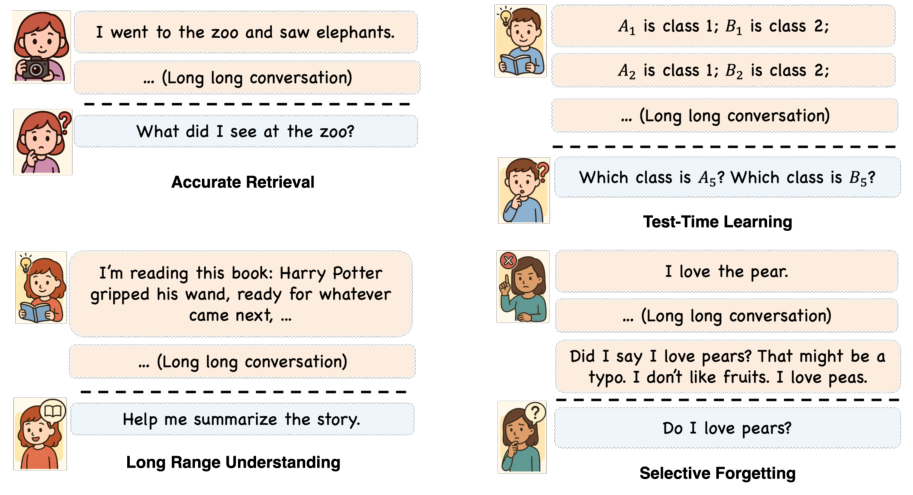
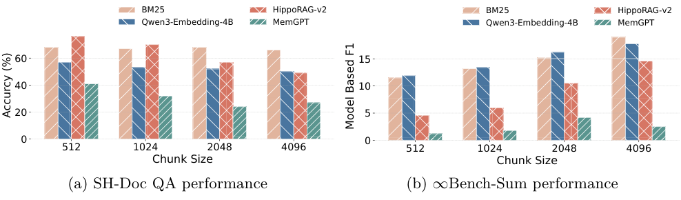
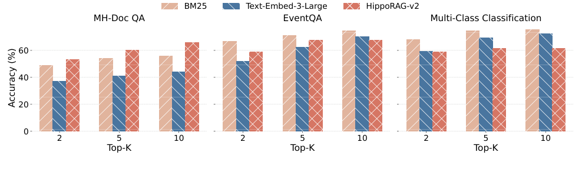

# Evaluating Memory in LLM Agents via Incremental Multi-Turn Interactions（MemoryAgentBench）

> 来源：本地 arXiv:2507.05257v4，首页标注 ICLR 2026、版本日期 2026-06-28。完整解读 §1–5 Conclusion，包含全部 §2/§3/§4 小节；必要的数据构造、消融精确数值从附录 B/E 补充。3 张正文图均已导入。原论文的模型名称、窗口和结果是该版本的实验设置，不是当前产品规格。

## 先理解本文究竟测什么

MemoryAgentBench 把长文本改造成一串按时间输入的消息，让 agent **先逐块吸收、更新自己的记忆，再回答多个问题**。它希望检查四项能力：准确检索（AR）、测试时学习（TTL）、长距离整体理解（LRU）、选择性遗忘/修订（SF）。核心改变是把“拿到整段历史后答题”改成“经历信息到达过程后答题”。

基准共 **2,071 个问题/评价项**。按附录 Table 6 的命名行计，包含 **14 个任务配置**：4 个 AR、5 个分类 TTL 加 1 个推荐 TTL、2 个 LRU、2 个 SF；主表把 5 个分类集合并成 MCC 一列。不能把列数、任务配置数、源 benchmark 数混为一谈。

## 1 Introduction：长上下文与记忆评测有什么区别

**来源：PDF pp.1–3，§1，Figure 1。** 模型能一次读取几十万 tokens，不代表它能在持续交互中判断哪些信息要保留、怎样抽象、何时更新以及何时舍弃旧事实。外部记忆还可能生成新的概括，而不只是逐字存下历史。

**图 1 解读。** AR 例子是回忆去动物园看见什么；TTL 是从之前给过的带标签实例学会新分类；LRU 是听完一部长故事再概括；SF 则是用户澄清先前说的 pears 是误写、真正喜欢的是 peas。最后一例说明：把所有相关旧文本都找回来仍不够，系统要知道哪一条覆盖了哪一条。

四项能力并非完全互斥。AR 可以包含一次查询取回多个证据；LRU 强调要理解大范围材料的整体结构，不能只靠几个局部片段；TTL 是在不重新训练参数的部署过程中从示例学习任务映射；SF 则处理冲突和失效信息。这里“遗忘”不必物理删除文件，只要最终有效记忆和答案遵循更新后的事实即可。

作者认为旧基准或较短、或偏静态长文、或题材较窄，难覆盖这四维。本文因此重构现有数据，再新增 EventQA 和 FactConsolidation。它主要比较文本历史和外部数据库形式的记忆，不系统评价所有参数化长期学习方法。

## 2 Related Work

### 2.1 Benchmarks on Long-Context and Memory

**来源：PDF pp.3–4，§2.1。** 长上下文 benchmark 通常把完整材料一次提供，主要检查模型注意与理解能力。RAG benchmark 多围绕固定或缓慢变化知识库，检查检索和证据支持。专门记忆 benchmark 已转向长期对话，但未必同时包含从示例学习、全局理解及显式冲突更新。

这里的比较是论文定义下的覆盖分析，不应把其 Table 1 中其他数据集的数量直接当成那些基准原论文的唯一统计。例如本版本给 LoCoMo 使用的问答数与原始 ACL 2024 的 1,986 QA 不同；阅读其他论文时仍应回到各自版本，避免混用。

### 2.2 Agents with Memory Mechanisms

**来源：PDF pp.4–5，§2.2。** 长上下文系统把记忆直接放在窗口中；RAG 把过往材料外存，按关键词、向量或图/树结构检索；agentic memory 则用循环决定如何改写查询、找证据、核验与更新工作记忆。

作者认为单次 Top-$K$ 片段难以覆盖整部小说或上千个训练示例，而 agentic retrieval 虽能多次查找，也不自动解决全局知识整合。这个推断是本文组织方法比较的动机，后面的实验提供支持范围；不能从方法名称就预先判定某类系统一定无效。

## 3 MemoryAgentBench

### 3.1 Dataset Preparation：四种能力分别怎样构造

**来源：PDF pp.5–6，§3.1；附录 B、Table 6（PDF p.21）。**

| 能力 | 任务 | 历史序列数 : 问题数 | 平均上下文长度 |
|---|---|---:|---:|
| AR | SH-Doc QA | 1 : 100 | 197K |
| AR | MH-Doc QA | 1 : 100 | 421K |
| AR | LongMemEval (S*) | 5 : 300 | 355K |
| AR | EventQA | 5 : 500 | 534K |
| TTL | BANKING77 | 1 : 100 | 103K |
| TTL | CLINC150 | 1 : 100 | 103K |
| TTL | NLU | 1 : 100 | 103K |
| TTL | TREC Coarse | 1 : 100 | 103K |
| TTL | TREC Fine | 1 : 100 | 103K |
| TTL | Movie Recommendation（ReDial） | 1 : 200 | 1.44M |
| LRU | ∞Bench-Sum | 100 : 100 | 172K |
| LRU | DetectiveQA | 10 : 71 | 124K |
| SF | FactConsolidation-SH | 1 : 100 | 262K |
| SF | FactConsolidation-MH | 1 : 100 | 262K |

长度由 GPT-4o-mini tokenizer 计算，附录注明 1K=1024。多个问题共享同一长历史，能摊薄构建记忆的成本，但这些问题不是相互独立的历史样本。

**Accurate Retrieval。** SH/MH 文档题由 RULER 类数据重构，收集支持 100 道题的短文档，去重、打乱并拼成长历史。SH 主要依赖一处证据，MH 依赖多处文档。短实体答案采用 substring exact match（SubEM），即检查标准答案是否作为子串出现在输出中。

LongMemEval (S*) 把多段历史按时间组织为 5 个约 355K 的对话，每个历史可以回答多道题，共 300 题。它是为了减少“每题单独重建一遍大记忆”的成本而制作的版本，**不是原始 LongMemEval_S 的 500 题/约115K设置**。开放式答案由 GPT-4o judge 判断。

EventQA 使用 ∞-Bench 的五本长书，通过 spaCy NER 找最常被提及的十个人物，由 GPT-4o 提取 101 个事件，再为真实下一事件生成五个干扰项。给 agent 最多五个先前事件，要求在六个候选中选出正确延续；每书 100 题，共 500。它测试对已读故事的事件回忆与顺序判断，不是自由预测未来情节，正确答案已存在于输入故事中。

**Test-Time Learning。** 五个分类数据把成千上万的句子与数字标签写成历史，打乱顺序，最后要求对新句子给出对应标签。类别数分别为 BANKING77 的 77、CLINC150 的 151（含其额外类别口径）、NLU 的 68、TREC Coarse 的 6、TREC Fine 的 50。数字映射迫使模型利用历史中的示例，而不能只输出熟悉的自然语言类别名。

电影推荐把去重后的大量短推荐对话拼接为超过千个示例的长历史。生成端要求推荐 20 部电影，评价指标却是 **Recall@5**，只看前五个推荐与参考的重合。这两个数字对应不同环节，并不矛盾，但复现时不能把报告分数解释为 Recall@20。

**Long-Range Understanding。** ∞Bench-Sum 要求对完整小说的情节与人物做 1,000–1,200 words 总结，采用经过流畅性门控的 F1 评价；附录说明用 GPT-4o 给流畅性 0/1，作为乘数。DetectiveQA 选取十本侦探小说中的 71 道困难题，需要综合长距离线索。只取几个与问题词面相似的片段，可能漏掉决定性伏笔。

**Selective Forgetting。** FactConsolidation 用 MQUAKE 的事实编辑对：先放旧事实，再放与之矛盾的新事实，按序号排列，并明确要求“序号更大即更新”。单跳题直接问更新事实，多跳题需要把若干更新后的关系连起来。历史构造有 6K、32K、64K、262K 等版本，主表用长设置。

这是一种任务内反事实设定，答案应服从当前输入，即使它与现实世界或模型参数里的常识冲突。评价的重点是可靠修订与推理，不是把伪事实宣称为现实真相。

### 3.2 Different Categories of Memory Agents

**来源：PDF pp.6–7，§3.2。** Long-Context Agent 维护最近 tokens 的缓冲区，超窗口后按 FIFO 丢弃最早块。RAG 的简单版本存原始文本，向量版存嵌入，结构增强版构造图、树或事件表示。Agentic Memory Agent 可以迭代检索、改写问题、验证证据与调整工作记忆。

这些机制处理输入的方式不同。尤其部分结构化系统在输入收集后构造索引，其他系统逐块执行更新；统一的是顺序输入和后续答题接口，而不是所有内部处理时机、调用次数和成本都相同。判断公平性应继续查看 chunk size 与构建成本。

### 3.3 Datasets and Agents Formulation

**来源：PDF p.7，§3.3。** 每条历史表示为 $c_1,\ldots,c_n$，对应问题 $q_1,\ldots,q_m$ 与答案 $a_1,\ldots,a_m$。每块被包装为带明确记忆指令的 user message，提示之后会提问；agent 依次摄取全部块，再回答问题。

用操作记号可以概括为：

$$
M_i=U(M_{i-1},c_i),\qquad \widehat a_j=G(M_n,q_j).
$$

这只是对评测协议的整理；$U$ 由被测记忆系统实现，$G$ 是回答过程，论文没有为它们提出新的训练损失。对长上下文基线，$M_i$ 就是受窗口限制的历史缓冲区。

为 SF 明确提供序号与新旧规则，减少模型没理解任务指令造成的混淆。每个类别使用标准化提示，必要时小幅适配各 agent。多题共享历史提高成本效率，却要求清楚记录答题过程是否改写记忆、题目顺序是否影响后续答案；比较复现实验时应检查具体 harness，而不是仅看相同数据文件。

## 4 Experiments

### 4.1 Experimental Setup

**来源：PDF pp.7–8，§4.1。** 多数 RAG 和商业记忆系统使用 GPT-4o-mini 骨干，因此同骨干无记忆窗口基线是比较记忆增益的主要参照。长上下文基线还包括 GPT-4o、Claude-3.7-Sonnet、GPT-5-mini、GPT-4.1-mini、Gemini-2.0-Flash；MIRIX 另测 GPT-4.1-mini。

默认 SH/MH 文档 QA、LME(S*) 和 SF 的 chunk size 为 512，其余连续文本任务为 4096。但出于成本，Mem0、Cognee、Zep、MIRIX 统一用 4096。这个差别与后续 chunk 消融直接相关：更细分块对部分 AR 系统有利，不能忽略它就把全部差距归给算法本身。

主表多数检索采用 Top-10。AR/SF 多用 Accuracy，MCC 用分类准确率，推荐用 Recall@5，摘要用 F1，DetectiveQA 用正确率。Overall 是异质任务/维度的汇总分，不等于把所有问题当成相同二元事件算出的一个通用正确率。

### 4.2 Overall Performance Comparison

**来源：PDF p.8，Table 3。** 为看清四种能力，先列各类平均与总分；均沿用原表：

| 方法 | AR | TTL | LRU | SF | Overall |
|---|---:|---:|---:|---:|---:|
| GPT-4o | 58.1 | 50.0 | 54.9 | 32.5 | 48.8 |
| GPT-4o-mini | 49.2 | 48.6 | 46.2 | 25.0 | 42.2 |
| Claude-3.7-Sonnet | 59.7 | **53.9** | 62.2 | 22.5 | 49.6 |
| GPT-5-mini | **74.4** | 48.6 | **66.2** | **53.0** | **60.6** |
| GPT-4.1-mini | 71.8 | 46.2 | 49.1 | 20.5 | 46.9 |
| Gemini-2.0-Flash | 65.1 | 46.4 | 41.6 | 16.5 | 42.4 |
| BM25 + GPT-4o-mini | 60.5 | 44.5 | 35.6 | 25.5 | 41.5 |
| Text-Embed-3-Large | 54.6 | 44.3 | 37.3 | 16.0 | 38.0 |
| Qwen3-Embedding-4B | 54.7 | 45.1 | 37.0 | 16.0 | 38.2 |
| RAPTOR | 36.8 | 35.9 | 27.9 | 7.5 | 27.0 |
| GraphRAG | 40.9 | 24.8 | 19.9 | 8.0 | 23.4 |
| HippoRAG-v2 | **65.1** | 35.8 | 36.2 | **29.5** | **41.6** |
| Mem0 | 32.6 | 21.2 | 20.7 | 10.0 | 21.1 |
| Cognee | 28.3 | 22.8 | 16.0 | 15.5 | 20.6 |
| Zep | 37.5 | 37.5 | 16.2 | 5.0 | 24.0 |
| Self-RAG | 33.6 | 12.2 | 18.1 | 11.0 | 18.7 |
| MemGPT | 34.3 | 40.8 | 22.4 | 15.5 | 28.3 |
| MIRIX / GPT-4o-mini | 47.5 | 24.1 | 25.4 | 8.0 | 26.2 |
| MIRIX / GPT-4.1-mini | 63.0 | 35.7 | 40.5 | 11.5 | 37.7 |

原表还重复给出一行 GPT-4o-mini 参照，Overall 写为 42.3，而上方长上下文行是 42.2；各分项相同。这里保留主行数值并标记这一 0.1 差异，不据此计算精细排名差。

**AR：部分检索方法确实有效，但不是所有 RAG 都优于窗口基线。** 同骨干 GPT-4o-mini 的 AR 为 49.2，BM25 为 60.5，HippoRAG-v2 为 65.1；但 RAPTOR、GraphRAG、Mem0、Cognee 等低于 49.2。原文“Most RAG”概述应结合具体行读，不能简化为 RAG 全面更好。

HippoRAG-v2 在 SH-QA/MH-QA 为 76.0/66.0，对照 GPT-4o-mini 的 64.0/43.0；BM25 在 EventQA 为 74.6，对照 59.0。收益说明当任务所需信息能通过少量相关片段访问时，外部检索可以弥补有限窗口。

**TTL/LRU：长上下文保留全局材料的优势明显。** GPT-4o-mini 的 MCC 82.0、摘要 28.9，BM25 分别 75.4、19.0；HippoRAG-v2 为 61.4、14.6。更多“擅长找事实”的结构不必然有助于从大量示例学习映射或概括整部故事。GPT-5-mini 的摘要 56.3、DetectiveQA 76.1，表现出较强整体理解，但相对其他方法的差异同时包含骨干能力。

**SF：多跳修订远比单跳难。** GPT-5-mini 的 FC-SH 78.0、FC-MH 28.0；GPT-4o-mini 为 45.0/5.0；HippoRAG-v2 为 54.0/5.0；BM25 为 48.0/3.0。即使单跳能够取到更新事实，组合几条关系时仍可能混入过期边。纯扩大窗口到 1M 也不保证有效：GPT-4.1-mini 为 36.0/5.0。

这些结果支持分别报告四维，避免用检索优势掩盖更新或全局理解短板。原论文没有证明复杂记忆框架在所有现实任务都无用；它测的是当前配置在这些特定长文本转交互任务中的表现。

### 4.3 Analysis and Ablation Study

#### 4.3.1 Ablation Study on Input Chunk Size

**来源：PDF p.9，Figure 2；附录 Table 8（PDF p.25）。**

**图 2 解读。** 左图 SH-Doc QA 中，Qwen embedding 与 HippoRAG-v2 在较小块上较好；右图摘要中，多数方法随块增大获得更多连贯内容，分数上升。两类任务呈不同偏好，说明不能为所有记忆应用设一个未经验证的统一 chunk size。

| 方法/任务 | 512 | 1024 | 2048 | 4096 |
|---|---:|---:|---:|---:|
| BM25 / SH-QA | 66.0 | 67.0 | 68.0 | 66.0 |
| Qwen3 embedding / SH-QA | **57.0** | 53.0 | 52.0 | 50.0 |
| HippoRAG-v2 / SH-QA | **76.0** | 70.0 | 57.0 | 49.0 |
| MemGPT / SH-QA | **41.0** | 32.0 | 24.0 | 27.0 |
| BM25 / Summary | 11.5 | 13.2 | 15.2 | **19.0** |
| Qwen3 embedding / Summary | 7.9 | 9.4 | 13.2 | **14.8** |
| HippoRAG-v2 / Summary | 4.6 | 6.0 | 10.5 | **14.6** |
| MemGPT / Summary | 1.2 | 1.8 | **4.2** | 2.5 |

这里固定 $k=10$，因此不仅切分粒度改变，最终检索进来的总 token 预算也从约 5K 增到约 40K。摘要收益可能同时来自块内连贯性与更多可见信息，不能把表格当作严格固定 token budget 的粒度消融。

#### 4.3.2 Ablation Study on Retrieval TopK

**来源：PDF p.9，Figure 3；附录 Table 9。**

**图 3 解读。** 多跳文档、事件 QA 和分类三类任务整体随 $k$ 增大而改善，但并非所有方法每一步单调上升。更多证据提高覆盖率，也增加输入成本与噪声。4096-token 块取 10 个已约 40K 输入，作者因此未继续测试 20 个。

| 方法/任务 | k=2 | k=5 | k=10 |
|---|---:|---:|---:|
| BM25 / SH-QA | 50.0 | 60.0 | 66.0 |
| BM25 / MH-QA | 49.0 | 54.0 | 56.0 |
| BM25 / EventQA | 66.6 | 71.2 | 74.6 |
| BM25 / MCC | 67.8 | 74.6 | 75.4 |
| Text-Embed-3-Large / EventQA | 51.8 | 62.4 | 70.0 |
| HippoRAG-v2 / MH-QA | 53.0 | 60.0 | 66.0 |
| HippoRAG-v2 / EventQA | 58.8 | 67.6 | 67.4 |

Table 9 的部分 EventQA 数值与主表对应默认值并不完全一致，例如 HippoRAG-v2 的 k=10 写 67.4，主表写 67.6；Contriever 的差异更大。因此本文按各表独立描述趋势，不把不同表的“默认”结果强行当成相同运行。

#### 4.3.3 Ablation Study on Backbone Model

**来源：PDF pp.9–10，Table 4。**

| 方法 | 骨干 | EventQA | 推荐 | Summary | FC-SH | Avg. |
|---|---|---:|---:|---:|---:|---:|
| BM25 | GPT-4o-mini | 74.6 | 13.6 | 19.0 | 48.0 | 38.8 |
| BM25 | GPT-4.1-mini | 76.4 | 14.0 | 19.4 | 51.0 | 40.2 |
| BM25 | Gemini-2.0-Flash | 70.8 | 10.0 | 18.9 | 47.0 | 36.7 |
| Text-Embed-3-Small | GPT-4o-mini | 63.0 | 15.3 | 17.7 | 28.0 | 31.0 |
| Text-Embed-3-Small | GPT-4.1-mini | 62.0 | 15.5 | 17.9 | 30.0 | 31.4 |
| GraphRAG | GPT-4o-mini | 34.4 | 9.8 | 0.4 | 14.0 | 14.7 |
| GraphRAG | GPT-4.1-mini | 39.0 | 10.3 | 1.2 | 16.0 | 16.6 |
| MIRIX | GPT-4o-mini | 29.8 | 9.8 | 9.9 | 14.0 | 15.9 |
| MIRIX | GPT-4.1-mini | **53.0** | 10.3 | **18.9** | **20.0** | **25.6** |

BM25 换较强骨干只提高 1.4 平均分，Text-Embed-3-Small 提高 0.4；MIRIX 却提高 9.7，EventQA 提高 23.2。作者认为简单 RAG 的瓶颈更多在检索后提供的信息，而 agentic 架构还依赖模型做多步管理与调用决策。

这是有限方法、有限任务下的证据。不能推出所有 RAG 一旦骨干足够强便绝无收益，也不能仅因更强模型提升 MIRIX，就证明全部提升来自某一个专门记忆类型。

#### 4.3.4 Validation of Dataset FactConsolidation

**来源：PDF p.10，Table 5。**

| 模型 | FC-SH 6K | FC-SH 32K | FC-MH 6K | FC-MH 32K |
|---|---:|---:|---:|---:|
| GPT-4o | 92.0 | 88.0 | 28.0 | 10.0 |
| o4-mini | **100.0** | 61.0 | **80.0** | 14.0 |

这项验证回应“任务是否本来就无法完成”。o4-mini 在短历史多跳可达 80.0，说明题目并非全部错误或不可解；增长到 32K 后降为 14.0，显示长序列冲突整合仍困难。GPT-4o 的单跳下降较小，o4-mini 的单跳反而明显下降，所以“推理模型在所有长度全面更强”并不成立。

这个对照未隔离检索、更新与推理每一步，因此只能说长历史放大了选择性修订的困难，不能仅凭一个最终分数确定错误发生在存储还是推理阶段。

### 补充理解成本：构建与回答应分开计算

**来源：附录 E.5、Table 12，PDF p.26。** MH-QA、4096 块设置下，BM25 的记忆构建/查询约 0.11/1.7 秒，HippoRAG-v2 为 380/1.71 秒，Mem0 为 1334/0.65 秒，MIRIX 为 20171/14.1 秒。构建一次后回答许多题的成本摊薄方式，和每题重建历史的方式差别极大。

这些是特定硬件、API 和实现下的测量，不是可直接移植到其他部署的性能承诺。它们解释了作者为什么对昂贵系统采用大块，也说明报告答案质量时，应同时记录处理完整历史的总成本。

## 5 Conclusion、Ethics 与 Reproducibility

**来源：PDF pp.10–11。** 作者总结四维基准与统一增量协议能暴露现有记忆系统的互补优势和缺口，尤其是动态更新和长距离一致性。预算限制使实验只覆盖部分代表性系统，未来希望扩大方法范围。

伦理声明讨论合法来源文本、隐私和使用范围；复现声明承诺公开脚本、配置、提示词、数据生成种子和依赖环境。本文阅读依据是保存的 PDF，对当前仓库是否已经完全兑现所有发布承诺未作额外核验，不能把声明当成已检查过的事实。

## 如何使用这篇论文指导研究

四维划分有助于设计独立诊断：检索不到材料属于 AR；看过大量例子却不能学会新映射属于 TTL；只能记细节无法恢复全局情节属于 LRU；旧事实在更新后仍主导答案属于 SF。实际系统可能同时失误，应保留检索结果、记忆更新记录及答案依据，才能确定瓶颈。

若研究人物或叙事记忆，EventQA 可测试事件顺序，DetectiveQA 和摘要可测试跨章节整合，FactConsolidation 可启发构造人物状态更新题。但小说中的误信、叙述者不可靠、不同角色信息可见性，比“较大序号覆盖较小序号”更复杂，不能把这个简单更新规则直接当成完整叙事世界模型。

复现实验时应核对：同一源数据版本、分块方式、提示包装、每块是否触发真实更新、读题顺序、是否固定总检索 token、骨干、judge、构建/查询成本及状态重置。该版本的分块差异和少量表间默认值不一致已标注；这份笔记没有将主表全部结果视为已经独立复跑验证。

正文已完整覆盖 §1–5、§2.1–2.2、§3.1–3.3、§4.1–4.3.4；3 张正文原图、四维主结果、分块/Top-k/骨干/长度验证数值均已纳入。附录完整提示词、所有逐任务成本和显存表未逐条复写。
