# Evoking User Memory: Personalizing LLM via Recollection-Familiarity Adaptive Retrieval

## 一句话总结

RF-Mem 把个性化 LLM 的用户记忆检索建模为“熟悉性快速识别”和“回忆式逐步重构”的双路径选择问题，用检索分数均值与熵来决定何时直接 top-K、何时进入聚类与 query-centroid mixing 的迭代检索，从而在较低延迟下提升个性化记忆召回与回答质量。

## 研究问题

现有 personalized LLM memory retrieval 往往把用户历史当作静态向量库，主要依赖一次性相似度 top-K 检索；这种做法在明确、高置信查询上高效，但面对模糊查询、长尾记忆、跨时间片段的个性化证据时容易只召回表层片段。

论文要解决的核心问题是：如何让检索器根据当前 query 与用户记忆之间的“熟悉程度”自适应地选择检索深度，在熟悉时保持低成本快速检索，在不熟悉或不确定时触发结构化的 recollection，以重构更完整的证据链。

## 核心方法

RF-Mem 先进行 probe retrieval，得到候选记忆及相似度分数，并用两个信号判断熟悉性：平均相似度 $\bar{s}$ 表示整体相关性，归一化分数分布的熵 $H(p)$ 表示检索不确定性。若 $\bar{s}$ 足够高或中间区间内熵较低，则走 Familiarity path，直接返回 top-$K$ 记忆。

当平均分较低或熵较高时，系统切换到 Recollection path：对候选记忆向量做 KMeans 聚类，把每个聚类中心与当前 query embedding 按 $\alpha$-mix 组合成新的 recollect query，再执行下一轮 retrieval-cluster-mix。这个过程用 beam width、fanout 和最大轮数约束搜索规模，目标是在 embedding space 中模拟人类回忆里的线索扩展，而不是依赖 LLM 生成额外查询。

最终 RF-Mem 作为一个在线检索层接入个性化 LLM：熟悉问题用一次检索保证速度，不熟悉问题用迭代重构提升覆盖率，并在固定预算和延迟约束下与 dense retrieval、full context、纯 recollection 等基线比较。

## 摘要解读

Abstract 把论文的核心矛盾压缩成两类现有做法的不足：一种是把用户历史全部塞进 prompt，让 LLM 自己从长上下文里找相关记忆，这在成本和规模上不可持续；另一种是把记忆检索简化成一次相似度 top-$K$，虽然快，但通常只能捕捉表层匹配。作者认为 personalized LLM 的记忆问题不是普通 RAG 的客观事实检索，而是要从用户历史、偏好和上下文中找出对“当前用户、当前任务”真正有用的片段。

论文的关键灵感来自认知科学中的 Recollection-Familiarity dual-process theory。Familiarity 是快速、粗粒度的“熟悉感”判断；Recollection 是更慢、更有链式结构的情景重构。作者把这个认知模型映射到检索器：当检索结果显示 query 和用户记忆足够熟悉时，直接走 Familiarity path，返回 top-$K$；当熟悉性不足或不确定性较高时，触发 Recollection path，逐步扩展证据。

RF-Mem 的核心机制是用 probe retrieval 的平均相似度和熵来估计 familiarity signal。高熟悉性对应低成本的一次性检索；低熟悉性则进入 recollection：先对候选记忆聚类，再将聚类中心与原 query 通过 $\alpha$-mix 组合，在 embedding space 中生成新的检索方向并迭代扩展证据。这里的“回忆”不是让 LLM 生成推理链，而是在检索器内部通过向量空间的聚类与 query 更新来模拟上下文重构。

Abstract 最后给出的主张是：RF-Mem 能避免 full-context 的上下文开销，同时比 one-shot retrieval 更能恢复个性化记忆证据；实验覆盖三个 benchmark 和不同 corpus scale，在固定预算与延迟约束下优于 one-shot retrieval 和 full-context reasoning。

## 分章节阅读笔记

### 1 Introduction

Introduction 首先区分了传统 RAG 和用户记忆检索。传统 RAG 面向开放域语料，目标是找“客观事实”；personalized memory retrieval 面向用户历史、偏好、交互上下文，目标是找出适合某个具体用户在某个具体时刻的证据。这个区别很重要，因为用户记忆往往是碎片化、情境化、随时间演化的，不能只靠静态向量库里的一次 top-$K$ 匹配来完成。

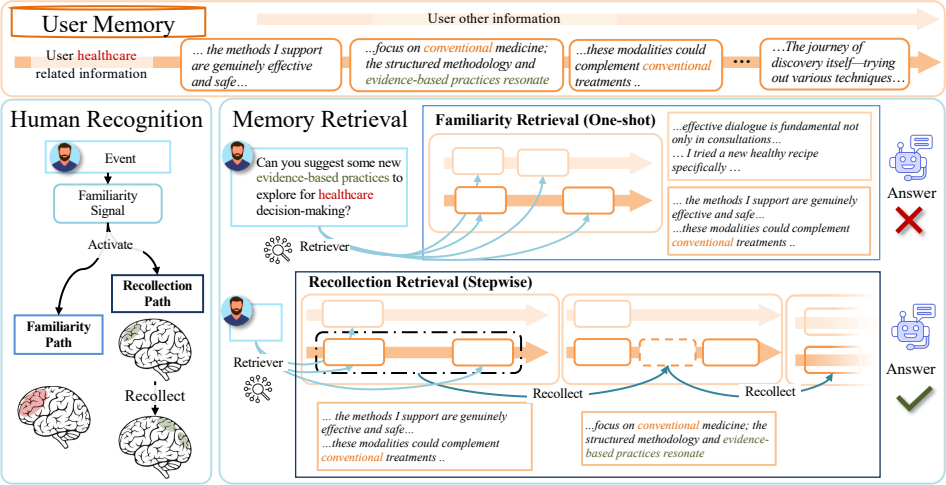

Figure 1 是 Introduction 的主要动机图。左侧用人类识别过程说明双路径记忆：Familiarity path 提供快速熟悉感，Recollection path 在熟悉感不足时被激活，用更慢的方式重构上下文。右侧把这个思想映射到 memory retrieval：对于同一个用户健康相关 query，one-shot familiarity retrieval 可能只抓到几个局部片段，还可能混入无关信息；stepwise recollection retrieval 则能沿着候选记忆继续扩展，逐步补出“conventional medicine”“evidence-based practices”等更完整的上下文线索。

作者随后把现有 memory-augmented LLM 的检索工作分成三个层面：query reformulation、index construction 和 retrieval strategy。论文认为前两类已经有不少工作，但 retrieval strategy 仍主要停留在 embedding-based one-shot top-$K$。这种策略对应认知理论里的 Familiarity channel：速度快，但召回浅。它的两个核心缺陷是：第一，缺少 Recollection path，难以为模糊查询、长尾知识或个性化推理找出跨片段的 evidence chain；第二，缺少在 familiarity 与 recollection 之间自适应切换的机制，容易在召回不足和额外噪声/延迟之间摇摆。

RF-Mem 在 Introduction 中被定位为一个 uncertainty-guided dual-path retrieval framework。它先做 probe retrieval，计算候选列表的平均分数和熵来估计熟悉性。熟悉时直接返回 top-$K$，保持 one-shot retrieval 的效率；不熟悉时进入 Recollection path：对 probe 结果做 KMeans 聚类，把聚类中心和原始 query 做 $\alpha$-mix，形成新的 recollect query，并在多轮 retrieve-cluster-mix 中逐步重构证据链。整个过程受 beam width、fanout 和最大轮数约束，所以它不是无界扩展，而是在可控计算预算内增加检索深度。

Introduction 最后的贡献声明可以理解为四点：把 personalized memory retrieval 建立在 Recollection-Familiarity 双过程理论上；提出基于 familiarity uncertainty 的路径选择；用 clustering 和 query-centroid mixing 实现 embedding space 中的链式 recollection；保持轻量级，仅依赖向量检索和小规模聚类，在接近 one-shot retrieval 的延迟下提升准确率与召回。作者还强调 RF-Mem 可以补充 MemoryBank 这类 index-building 方法，说明它更像在线 retrieval layer，而不是替代所有记忆存储结构。

### 2 Method: Recollection–Familiarity Memory Retrieval

方法章正式提出 RF-Mem，即 Recollection-Familiarity Memory Retrieval。它的定位不是新的记忆存储系统，也不是新的 LLM 生成器，而是一个在线 memory retriever：用户提出问题后，RF-Mem 负责从用户记忆库中取出合适的 memory text，再交给 LLM 生成回答。因此，方法章的主线不是“如何存记忆”，而是“面对当前 query 时，检索器如何决定直接快速召回，还是进入更深的回忆式扩展”。

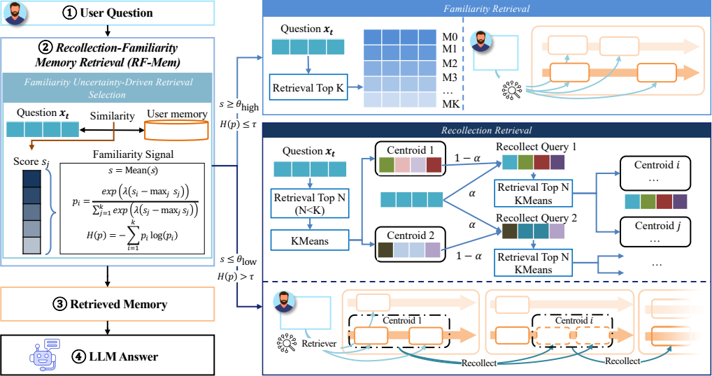

Figure 2 对应方法章的整体结构。流程从 user question 开始，进入 RF-Mem 模块；RF-Mem 首先计算 familiarity signal，再根据这个信号选择 Familiarity path 或 Recollection path；检索到的 memory text 被送给 LLM 生成最终回答。图右上角是 Familiarity Retrieval，直接 top-$K$；右下角是 Recollection Retrieval，通过 top-$N$、KMeans、centroid mixing 和多轮扩展来重构证据。

#### 2.1 Familiarity Uncertainty-Driven Retrieval Selection

这一节定义 RF-Mem 的路径选择器。作者的基本判断是：memory retrieval 不应该固定为一次 top-$K$，而应该根据 query 对用户记忆的“熟悉性”在两条路径之间切换。这个“熟悉性”不是主观概念，而是从 probe retrieval 的相似度分数中计算出来。

形式上，用户记忆库记为 $\mathcal{M}=\{m_1,\ldots,m_M\}$，每条记忆 $m_i$ 由编码器 $\phi(\cdot)$ 映射成向量 $\mathbf{z}_i=\phi(m_i)$。给定 query $q$，它的向量是 $\mathbf{x}_t=\phi(q)$。检索器先计算 query 与每条记忆的相似度 $s_i=\langle \mathbf{x}_t,\mathbf{z}_i\rangle$，得到初始候选集合 $\mathcal{C}=\text{Top-}K(\{(m_i,s_i)\}_{i=1}^{M})$。这一步相当于 probe retrieval：先不决定最终输出，只用它来观察“当前 query 在用户记忆中是否有明确落点”。

作者使用两个信号来描述 familiarity。第一个是平均相似度 $\bar{s}=\frac{1}{K}\sum_{i=1}^{K}s_i$，表示候选列表整体是否相关。第二个是熵 $H(p)$，用于刻画候选分数是否集中。具体地，先把 probe scores 归一化：

$p_i=\frac{\exp(\lambda(s_i-\max_j s_j))}{\sum_{j=1}^{K}\exp(\lambda(s_j-\max_j s_j))}$，

再计算 $H(p)=-\sum_{i=1}^{K}p_i\log p_i$。其中 $\lambda$ 控制分布尖锐程度。直观上，如果 top candidates 中少数记忆明显高分，那么 $p$ 更集中、熵更低，说明检索器比较确定；如果很多候选分数接近，熵更高，说明 query 的证据分散或不确定。

路径选择规则分三种情况：

- 若 $\bar{s}\geq\theta_{\text{high}}$，整体相似度足够高，说明 query 与用户记忆高度相关，走 Familiarity path。
- 若 $\bar{s}\leq\theta_{\text{low}}$，整体相似度较低，说明直接匹配不可靠，走 Recollection path。
- 若 $\theta_{\text{low}}<\bar{s}<\theta_{\text{high}}$，平均分处于中间区间，则用熵作二级判断：$H(p)\leq\tau$ 表示证据集中，走 Familiarity；$H(p)>\tau$ 表示不确定性高，走 Recollection。

这一节的作用是把认知科学里的“熟悉性调控”变成一个可执行的检索 routing policy。它不是简单地说高分就好，而是同时看整体相关性和候选分布形状：平均分解决“有没有相关记忆”的问题，熵解决“相关证据是否集中明确”的问题。

#### 2.2 Familiarity Retrieval

这一节解释 RF-Mem 的快速路径。只要 probe retrieval 显示 familiarity signal 足够强，系统就采用 Familiarity Retrieval。这个路径和普通 dense retrieval 很接近：它直接根据原始 query 与 memory embeddings 的相似度返回 top-$K$ memory evidence，不做额外扩展、聚类或 query 更新。

作者把它对应到 dual-process theory 里的 Familiarity：快速、低努力、基于表层线索的识别。它的合理使用场景是 query 明确、候选证据集中、检索器已经有较高置信度。例如用户问一个直接偏好或明确事实时，一次 top-$K$ 就可能足够；继续做 recollection 反而增加延迟，也可能引入无关记忆。

**Scoring and Retrieval**

这一段给出 Familiarity path 的正式检索公式。给定 query $q_t$，编码为 $\mathbf{x}_t=\phi(q_t)$；每条 memory entry $m_i$ 编码为 $\mathbf{z}_i=\phi(m_i)$，并且向量都做 unit normalization。相似度由内积给出：

$s(\mathbf{x}_t,\mathbf{z}_i)=\langle \mathbf{x}_t,\mathbf{z}_i\rangle$。

然后检索器返回：

$\mathcal{C}_t=\text{Top-}K(\{(m_i,s(\mathbf{x}_t,\mathbf{z}_i))\}_{i=1}^{M})$。

这个公式本身并不新，重要的是它在 RF-Mem 中的角色发生了变化：它不再是唯一策略，而是 routing policy 选择出的一个分支。也就是说，dense top-$K$ 在 RF-Mem 中被重新解释为“familiarity 足够强时的终止策略”。

#### 2.3 Recollection Retrieval

Recollection Retrieval 是方法章的慢路径。当 probe retrieval 给出 unfamiliar signal，例如平均分不足或熵较高时，系统认为直接 top-$K$ 可能只会得到浅层片段，于是进入多轮证据扩展。作者把它对应到人类记忆中的 deliberate recollection：不是凭熟悉感立刻识别，而是通过线索一步步重构上下文。

这一节内部可以按原文的四个加粗步骤理解。

**Candidate Memory Retrieval**

Recollection path 的第 $r$ 轮维护一个当前 query 向量 $\mathbf{x}^{(r)}$，初始时 $\mathbf{x}^{(0)}=\mathbf{x}_t=\phi(q_t)$。每一轮先做一次 top-$N$ 检索：

$\mathcal{C}^{(r)}=\text{Top-}N(\{(m_i,\langle\mathbf{x}^{(r)},\mathbf{z}_i\rangle)\}_{i=1}^{M})$。

这里 $N=(B+r)\times F<K$，由 beam width $B$、fanout size $F$ 和当前轮数 $r$ 决定。作者让 $N$ 随轮数增加，是为了避免后续由旧候选构造出的 query 反复取回同一批记忆；已经在前面轮次出现过的重复记忆会被排除。这个设计的含义是：recollection 不是在固定 top-$K$ 内部重排，而是在预算范围内逐步打开搜索范围。

**Relevant Memory Clustering**

拿到 top-$N$ 后，RF-Mem 对这些候选 memory embeddings 做 KMeans，分成 $B$ 个簇。每个簇 $G_b^{(r)}$ 的中心为：

$\mathbf{g}_b^{(r)}=\frac{1}{|G_b^{(r)}|}\sum_{m_i\in G_b^{(r)}}\mathbf{z}_i,\quad b=1,\ldots,B$。

聚类的作用是把一个线性候选列表变成多个语义分支。对于个性化记忆来说，相关证据可能分散在不同生活事件、偏好主题或时间片段中；如果只沿最高分方向继续检索，很容易被局部片段锁住。KMeans centroid 在这里充当“回忆线索”：每个中心代表一组语义相近的候选，后续可以从不同中心继续展开。

**Recollect Queries Generation via $\alpha$-mix**

每个簇中心会被转化为一个新的 recollect query。公式是：

$\mathbf{x}_b^{(r+1)}=\mathrm{norm}(\alpha\mathbf{x}^{(r)}+(1-\alpha)\mathbf{g}_b^{(r)}+\mathbf{x}_t),\quad \alpha\in[0,1]$。

这条公式有三个成分。$\mathbf{x}^{(r)}$ 保留当前轮已经形成的检索方向；$\mathbf{g}_b^{(r)}$ 引入某个语义簇的中心线索；$\mathbf{x}_t$ 作为 residual 保留原始 query，防止检索在多轮扩展中偏离用户问题。$\alpha$ 控制 query 方向和簇中心方向之间的权重：$\alpha$ 越大，越保守、更贴近原 query；$\alpha$ 越小，越愿意沿着 cluster cue 探索。

这一设计是论文方法的核心之一。它没有让 LLM 写新的查询，也没有显式生成自然语言推理链，而是在 embedding space 中完成 query refinement。作者所谓的 recollection，本质上就是“用已召回的语义簇来重塑下一轮检索方向”。

**Retrieve-Cluster-Mix Loop**

生成 recollect query 后，每个 $\mathbf{x}_b^{(r+1)}$ 再执行下一轮 top-$N$ 检索：

$\mathcal{C}^{(r+1)}=\text{Top-}N(\{(m_j,\langle\mathbf{x}_b^{(r+1)},\mathbf{z}_j\rangle)\}_{j=1}^{M})$。

随后再次聚类、再次 $\alpha$-mix，形成 retrieve-cluster-mix 循环。这个循环让检索从一个 query 点扩展成一个受控的搜索树：每一轮最多保留 $B$ 个 active branches，并用最大轮数 $R$ 限制深度。它比单次 top-$K$ 更有机会找出跨片段证据，但又不会像 full-context 那样把所有历史都交给 LLM。

**Stop and Generation**

Recollection path 在达到最大轮数 $R$ 或收集到目标数量的候选后停止。最终证据集合是多轮候选的截断并集：

$\mathcal{C}_t=\text{Top-}K(\bigcup_{r=0}^{R}\mathcal{C}^{(r)})$。

这批 memory fragments 被抽取为 memory text，并送入 LLM 生成回答。到这里可以看出 RF-Mem 的计算边界：它付出的额外成本主要是若干轮向量检索、KMeans 和 query 向量混合，而不是长上下文推理或 LLM 生成式扩展。

**方法章小结**

方法章的核心思想是把个性化记忆检索拆成“何时停”和“何时继续找”两个问题。Familiarity selection 决定是否值得进入慢路径；Familiarity Retrieval 保留 dense retrieval 的低延迟优势；Recollection Retrieval 通过 candidate retrieval、clustering、$\alpha$-mix 和循环扩展补足 one-shot 检索难以覆盖的链式证据。RF-Mem 的创新点不在某一个单独公式，而在把这些组件组织成一个受 familiarity uncertainty 控制的双路径检索器。

### 3 Experiments

实验章的目标是验证 RF-Mem 是否真的同时具备两点：第一，在 personalized generation 场景中能提升最终回答质量；第二，在纯 retrieval 场景中能提升相关个人记忆片段的召回，并且保持合理延迟。主文实验分成三块：Experimental Setup、Personalized Generation、Personalized Retrieval，以及一组 Adaptive Experiment。

#### 3.1 Experimental Setup

实验使用三个数据集。PersonaMem 用于 personalized generation，它包含模拟用户与 LLM 的多轮交互历史，覆盖 7 类真实任务，记忆长度有 32K、128K 和 1M tokens；每段历史最多包含 60 个 multi-turn sessions，并且用户 persona 和 preferences 会随交互演化。PersonaBench 用于评估相关个人记忆检索，数据由私有用户文档和查询构成，查询类型包括 Basic Info、Social Info、Preference Easy 和 Preference Hard。LongMemEval 面向长期个性化记忆检索，要求在 small 和 medium 两种 memory setting 下找到和事实问题相关的历史信息。

指标设置也分两类。PersonaMem 评估最终生成回答的 Accuracy，也就是回答是否正确符合当前用户 persona 和会话上下文。PersonaBench 与 LongMemEval 更关注检索本身，所以使用 Recall@K，衡量相关 memory pieces 是否被检索出来。

Baseline 有四类。Zero Memory 是完全不用用户记忆；Full Context 是把完整用户历史输入 LLM，不做检索；Dense Retrieval 是标准相似度 top-$K$，对应论文里的 Familiarity path；Recollection 是作者提出的慢路径，但不做自适应切换，所有 query 都进入 recollection。RF-Mem 则是完整方法：先判断 familiarity uncertainty，再决定走 Familiarity 还是 Recollection。

这个实验设置的关键约束是公平性：作者尽量把比较限制在 retrieval-only methods，让不同方法使用同一套 memory vectors，避免把性能差异混入 query generation、外部索引或其他系统模块。

#### 3.2 Overall Performance in Personalized Generation

这一节在 PersonaMem 上评估最终回答质量，重点看不同 memory corpus scale 下 RF-Mem 是否比 Dense Retrieval、Recollection 和 Full Context 更稳。主表按 32K、128K、1M 三种记忆规模报告各类问题的 accuracy、检索时间和平均输入 token 数。

整体结果很清楚：RF-Mem 在三种规模下都是 Overall 最优。

| Memory scale | Dense Retrieval | Recollection | RF-Mem | Full Context |
|---|---:|---:|---:|---:|
| 32K | 0.5908 | 0.6214 | 0.6350 | 0.6129 |
| 128K | 0.5259 | 0.5288 | 0.5394 | 0.3231 |
| 1M | 0.4518 | 0.4544 | 0.4589 | OOC |

这张表最重要的趋势不是单个数字，而是 scale 增大后的行为差异。32K 时 Full Context 还能工作，但需要 24.7K 平均 tokens；RF-Mem 只用约 3.6K tokens，却比 Full Context 高 0.0221。到 128K，Full Context 的 accuracy 掉到 0.3231，说明长上下文输入并不自动等于更好记忆使用；到 1M，它直接 out-of-context。RF-Mem 的优势在于不把所有历史交给 LLM，而是让检索器先做 selective evidence construction。

和 Dense Retrieval 相比，RF-Mem 的提升说明一次 top-$K$ 在复杂 personalized generation 中不够稳定。Dense Retrieval 在“Shared Facts”或“Revisit Reasons”这类直接匹配任务上仍然有竞争力，但遇到 Track Evolution、Aligned Recommendations、New Scenarios 这类需要整合跨片段信息的任务时，容易只取到局部线索。Recollection 能补足这类问题，但如果所有 query 都强制进入慢路径，会增加延迟，也可能在简单问题上引入多余扩展。

RF-Mem 的价值正是在这两者之间动态选择。它在 32K 下 retrieval time 是 5.09ms，低于 Recollection 的 7.09ms；128K 下是 4.27ms，明显低于 Recollection 的 7.86ms；1M 下是 6.28ms，仍低于 Recollection 的 8.12ms。也就是说，它不是简单用更多计算换准确率，而是把慢路径留给不确定 query。

这一节支持论文的第一个核心主张：personalized generation 不适合依赖 full context，也不适合固定 one-shot retrieval；更合理的方案是用 familiarity signal 控制检索深度。

#### 3.3 Overall Performance in Personalized Retrieval

这一节把 LLM generation 拿掉，直接评估检索质量。作者在 PersonaBench 和 LongMemEval 上比较 Familiarity、Recollection 和 RF-Mem，并使用三个 embedding retriever backbone：MiniLM、MPNet 和 BGE。这样可以检验 RF-Mem 是否只是依赖某个特定 embedding model，还是对不同检索器都有效。

在 PersonaBench 上，RF-Mem 的 Overall Recall@5 和 Recall@10 基本都达到最高或并列最高：

| Retriever | Metric | Familiarity | Recollection | RF-Mem |
|---|---|---:|---:|---:|
| MiniLM | Recall@5 | 0.4484 | 0.4491 | 0.4701 |
| MiniLM | Recall@10 | 0.5964 | 0.6062 | 0.6071 |
| MPNet | Recall@5 | 0.3887 | 0.3976 | 0.4009 |
| MPNet | Recall@10 | 0.5333 | 0.5527 | 0.5553 |
| BGE | Recall@5 | 0.3738 | 0.3722 | 0.3836 |
| BGE | Recall@10 | 0.5002 | 0.5046 | 0.5089 |

这个结果说明 RF-Mem 的提升不是来自单一模型偶然性，而是来自 retrieval strategy 的自适应。Familiarity 通常更快，但在 Social Info、Preference Hard 等需要上下文整合的任务上不一定够；Recollection 在这类任务上能补充更深线索，例如 MiniLM 下 Preference Hard 的 Recall@10 从 Familiarity 的 0.5561 提升到 Recollection 的 0.6267，但它的延迟更高。RF-Mem 通过选择机制把两者结合起来：简单问题尽量不扩展，复杂问题才进入慢路径。

LongMemEval 的结果进一步验证了长期记忆场景。RF-Mem 在 small 和 medium setting 中多数指标都达到最高：

| Retriever | Setting | Key RF-Mem results |
|---|---|---|
| MiniLM | LongMemEval-S | Recall@5 0.7375, Recall@10 0.8473, Recall@50 1.0000 |
| MiniLM | LongMemEval-M | Recall@5 0.4391, Recall@10 0.5609, Recall@50 0.7613 |
| MPNet | LongMemEval-S | Recall@5 0.7398, Recall@10 0.8377, Recall@50 0.9952 |
| MPNet | LongMemEval-M | Recall@5 0.4391, Recall@10 0.5894, Recall@50 0.7684 |
| BGE | LongMemEval-S | Recall@5 0.8186, Recall@10 0.9189, Recall@50 1.0000 |
| BGE | LongMemEval-M | Recall@5 0.5155, Recall@10 0.6635, Recall@50 0.8329 |

LongMemEval 的意义在于：当记忆历史变长，相关证据可能更分散，纯 Familiarity 容易漏掉一些深层线索；纯 Recollection 虽然召回更强，但耗时显著增加。例如 MiniLM 下 LongMemEval-S 的 Recollection time 是 50.62ms，而 RF-Mem 是 39.58ms；BGE 下 LongMemEval-M 的 Recollection time 是 58.05ms，而 RF-Mem 是 44.74ms。RF-Mem 在接近 Recollection 召回的同时保留了更好的延迟。

这一节的结论是：Familiarity 和 Recollection 的强项确实互补。Familiarity 适合直接事实或明显偏好；Recollection 适合跨片段、上下文重、长时记忆问题；RF-Mem 的优势来自动态调度，而不是单一路径本身。

#### 3.4 Adaptive Experiment

Adaptive Experiment 检验 RF-Mem 是否能作为模块接入其他 memory 或 RAG 系统，而不是只能在原始 turn-level memory index 上工作。主文分三种适配场景：index building method、query expansion method、iterative RAG method。

##### 3.4.1 Adaptive to Index Building Method

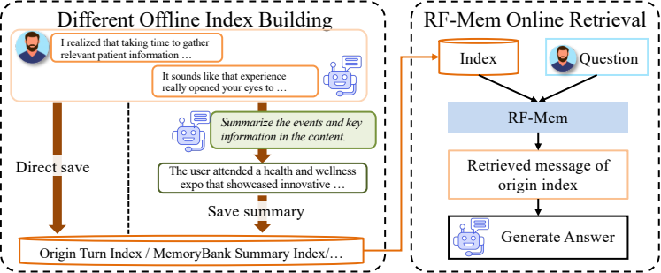

这一组实验把 RF-Mem 接到 MemoryBank summary index 上。MemoryBank 属于 offline indexing：先把用户对话总结成较短的 summary memory；RF-Mem 则作为 online retrieval layer，在实际 query 到来时决定检索路径。

在 PersonaMem 32K 上，使用 MemoryBank summary index 后整体 accuracy 都低于原始 turn-level index，因为 summary 会损失细节。但在同一 summary index 条件下，RF-Mem 仍是最优：

| Method | Avg. Tokens | Overall |
|---|---:|---:|
| Familiarity | 1267.6 | 0.4941 |
| Recollection | 1441.8 | 0.5212 |
| RF-Mem | 1421.8 | 0.5314 |

这说明 RF-Mem 不依赖某一种 memory storage 形式。它可以叠加在 MemoryBank 这类 summarization-based memory 上，作为在线 retrieval controller 补充已有索引结构。

##### 3.4.2 Adaptive to Query Expansion Method

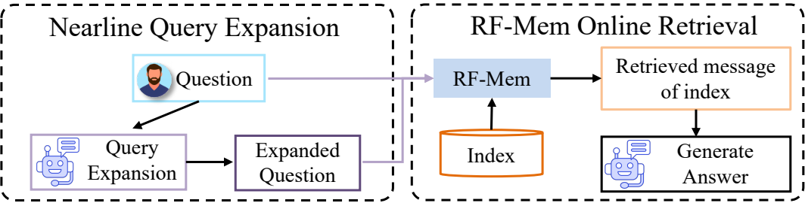

第二组实验把 HyDE 作为 nearline query expansion 方法。HyDE 先为原始 query 生成 pseudo-relevance feedback 或扩展表示，RF-Mem 再基于扩展后的 query representation 做在线检索。

PersonaBench 上使用 MiniLM 时，RF-Mem 仍然在 Overall 上最好：

| Method | Recall@5 Overall | Recall@10 Overall |
|---|---:|---:|
| Familiarity | 0.3464 | 0.5120 |
| Recollection | 0.3482 | 0.5046 |
| RF-Mem | 0.3504 | 0.5194 |

这里的重点不是绝对数值比前面主实验更高，而是 query representation 变化后，RF-Mem 的双路径机制仍然有效。换句话说，query expansion 改变的是输入 query 的语义表示，RF-Mem 仍可以在其上判断 familiarity uncertainty 并选择合适的检索深度。

##### 3.4.3 Adaptive to Iterative RAG Method

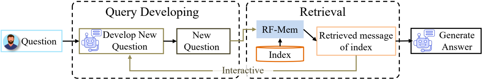

第三组实验把 RF-Mem 接入 Search-o1 这类 iterative RAG pipeline。Search-o1 会在多轮推理中生成 refined follow-up queries，而 RF-Mem 作为 retrieval layer 对这些不断变化的 queries 做实时检索。

在 PersonaMem 32K 上，RF-Mem 仍然整体最好：

| Method | Avg. Tokens | Overall |
|---|---:|---:|
| Familiarity | 4948.7 | 0.5823 |
| Recollection | 5103.9 | 0.6010 |
| RF-Mem | 5158.2 | 0.6146 |

这个结果说明 RF-Mem 不是和 iterative RAG 竞争，而是可以为 iterative RAG 提供更稳的检索层。Search-o1 负责生成后续 query，RF-Mem 负责在每个 query 状态下判断是否需要 deeper recollection。两者的分工是：推理框架控制问题演化，RF-Mem 控制 memory retrieval depth。

**实验章小结**

实验章整体支撑了三个论点。第一，Full Context 不是可扩展方案，随着 memory scale 增大不仅成本高，而且性能会下降甚至 OOC。第二，Familiarity 和 Recollection 各有适用场景，单一路径都不够稳定；RF-Mem 的改进来自根据 familiarity uncertainty 做路径切换。第三，RF-Mem 是模块化的 online retrieval layer，可以叠加在 MemoryBank、HyDE、Search-o1 等不同上游或外部组件之上。

### 4 Related Works

### 5 Conclusion

Conclusion 很短，主要把全文重新收束到 dual-process theory 这个叙事框架上。作者认为，现有 personalized memory retrieval 主要停留在基于相似度的一次性 Familiarity retrieval，而本文引入的 Recollection 是一种 deliberate stepwise retrieval mechanism：当熟悉性不足时，检索器不直接停在 top-$K$，而是通过多轮候选检索、聚类和 query mixing 继续扩展证据。

结论段对 RF-Mem 的定位是“familiarity uncertainty-driven framework”。也就是说，RF-Mem 的重点不是单纯提出一个慢检索方法，而是提出一个能在 Familiarity 和 Recollection 之间切换的 controller。这个 controller 的依据是检索分数的平均值和熵：熟悉时保留 one-shot retrieval 的效率，不熟悉或不确定时启动 stepwise recollection。

实验结论被概括为两类收益：一是在 personalized generation 和 personalized retrieval 两类任务上都有稳定增益；二是在 million-entry corpus 这类大规模记忆场景下仍然可扩展。作者借此强调，个性化 LLM 的 memory retrieval 不能只依赖表层相似度匹配，而应该引入更“deliberate”的检索过程来补足复杂、分散、长时记忆证据。

需要注意的是，Conclusion 没有展开新的局限性讨论。它延续的是主文的积极论证：RF-Mem 证明了把 Familiarity 与 Recollection 结合起来对 personalized LLM 有价值。结合前文来看，这里的边界也很清楚：所谓 Recollection 主要是在 embedding space 中做 cluster-guided iterative retrieval，并不是显式建模真实人类情景记忆、时间链或因果链。

## 关键公式 / 图表

### 关键图

### 关键表格

<!-- extracted-assets -->

### 已抽取 Figure 截图

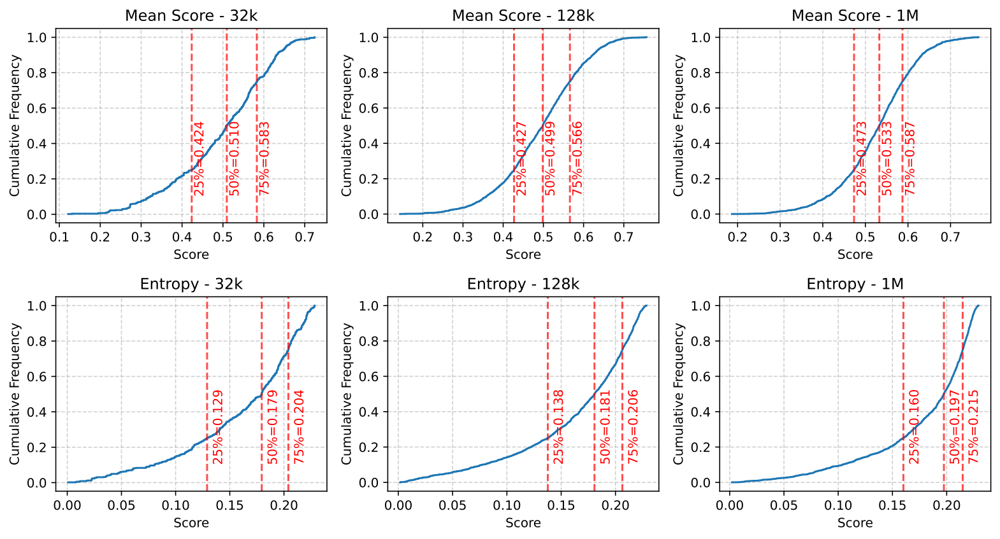

- Mean score $\bar{s}$ and entropy $H(p)$ of the PersonaMem dataset.

- Source: arXiv source `chapter/figure/Mean_Ent_personamem.pdf`

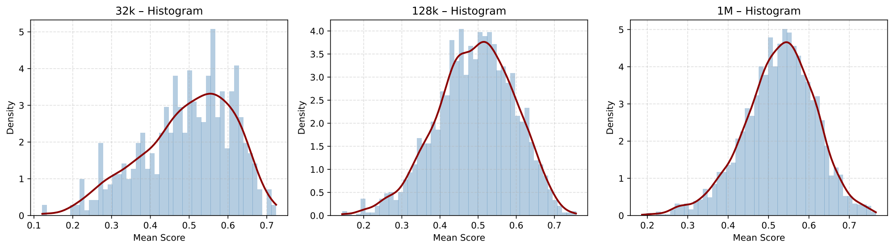

- \revise{Empirical distributions of mean score $\bar{s}$ of the PersonaMem dataset.}

- Source: arXiv source `chapter/figure/Mean_KDE_personamem.pdf`

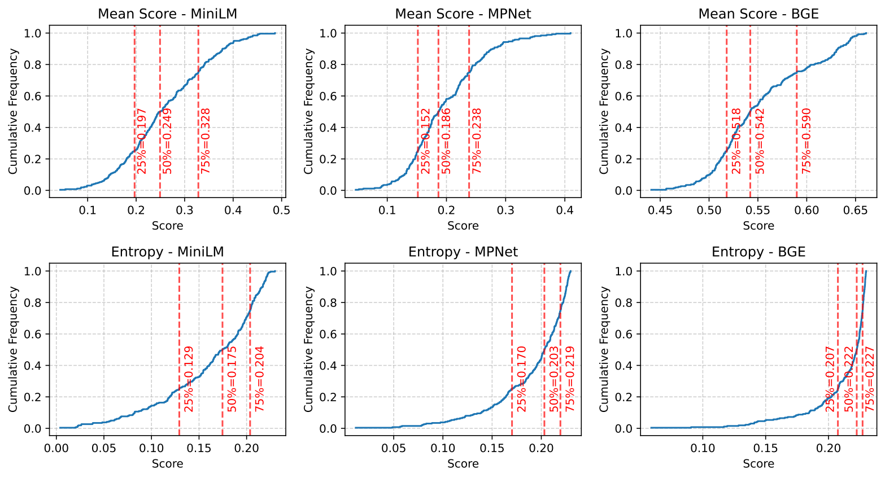

- Mean score $\bar{s}$ and entropy $H(p)$ of the PersonaBench dataset.

- Source: arXiv source `chapter/figure/Mean_Ent_personabench.pdf`

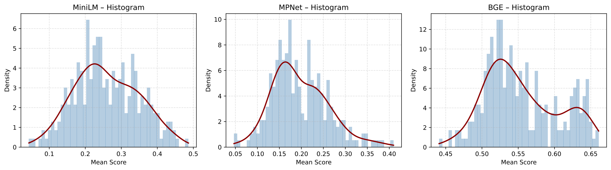

- \revise{Empirical distributions of mean score $\bar{s}$ of the Personabench dataset.}

- Source: arXiv source `chapter/figure/Mean_KDE_personabench.pdf`

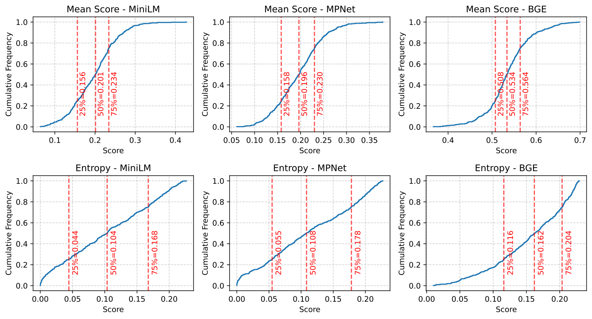

- Mean score $\bar{s}$ and entropy $H(p)$ in the LongMemEval-S dataset.

- Source: arXiv source `chapter/figure/Mean_Ent_LME-s.pdf`

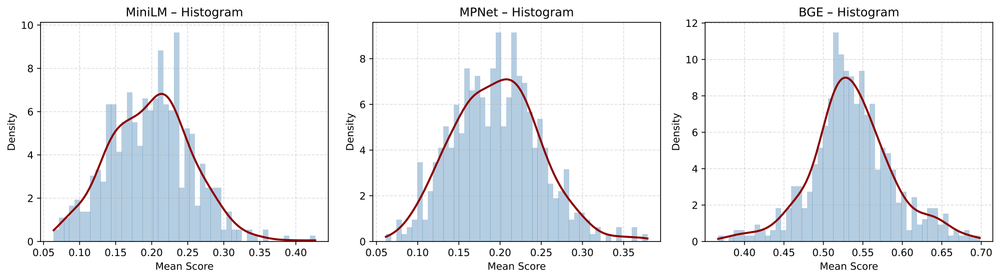

- \revise{Empirical distributions of mean score $\bar{s}$ of the LongMemEval-S dataset.}

- Source: arXiv source `chapter/figure/Mean_KDE_LME_S.pdf`

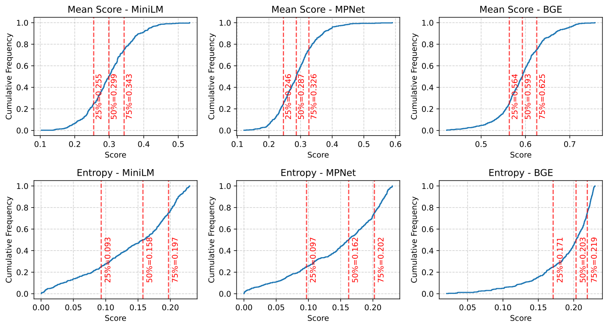

- Mean score $\bar{s}$ and entropy $H(p)$ in the LongMemEval-M dataset.

- Source: arXiv source `chapter/figure/Mean_Ent_LME-m.pdf`

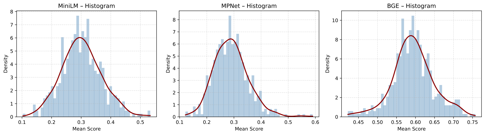

- \revise{Empirical distributions of mean score $\bar{s}$ of the LongMemEval-M dataset.}

- Source: arXiv source `chapter/figure/Mean_KDE_LME_M.pdf`

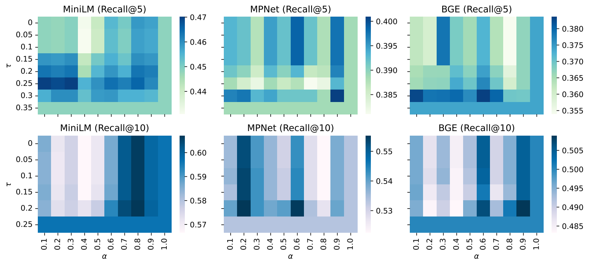

- Hyperparameter sensitivity study on PersonaBench. Heatmaps report Recall@5 and Recall@10 across different retrievers, varying $\alpha$ (query–centroid mixing) and $\tau$ (entropy threshold).

- Source: arXiv source `chapter/figure/heatmaps_alpha_tau_PB.pdf`

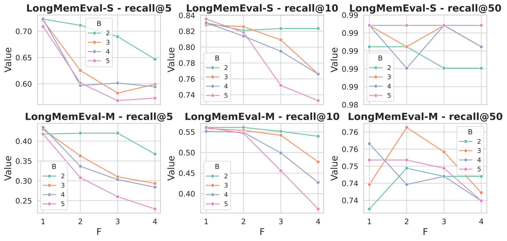

- Hyperparameter $B$ and $F$ sensitivity of Recollection retrieval on LongMemEval-S and LongMemEval-M.

- Source: arXiv source `chapter/figure/B_F.pdf`

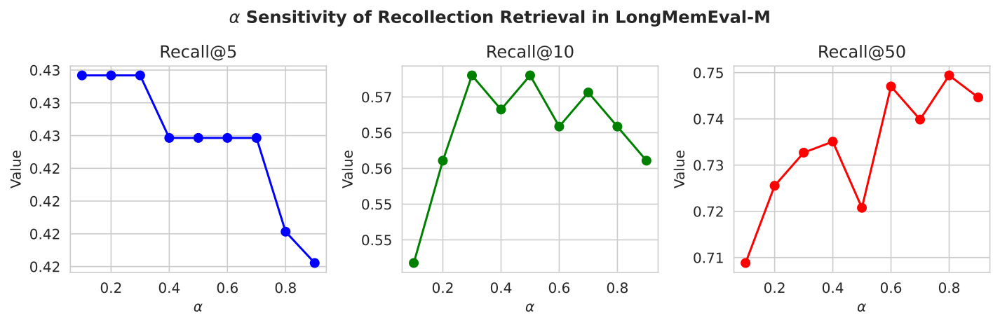

- Effect of $\alpha$ on short- vs. long-path retrieval performance (Recall@$K$).

- Source: arXiv source `chapter/figure/alpha_LME.pdf`

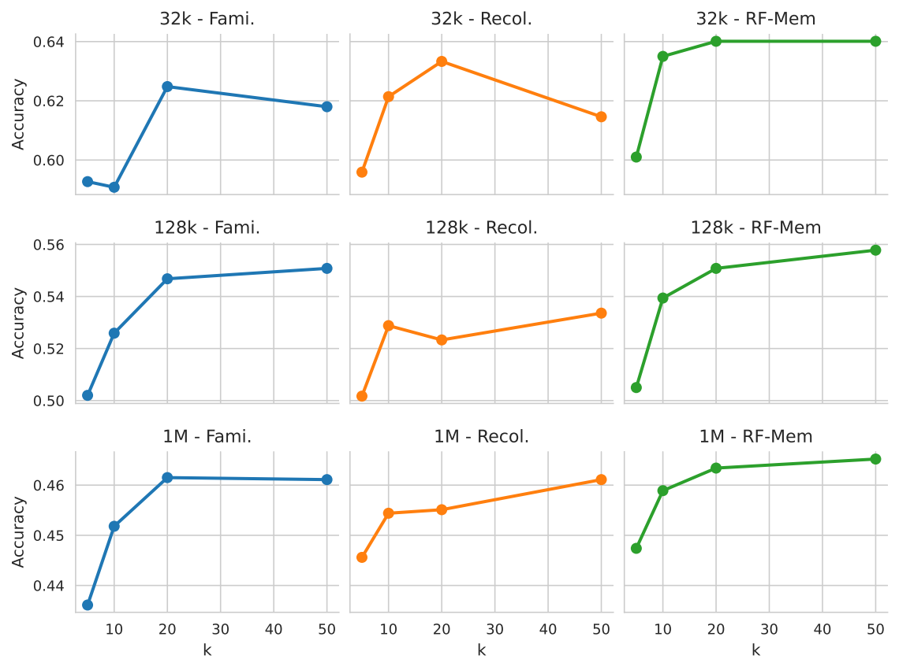

- Effect of probe size $K$ on retrieval performance across different corpus scales.

- Source: arXiv source `chapter/figure/para_k.pdf`

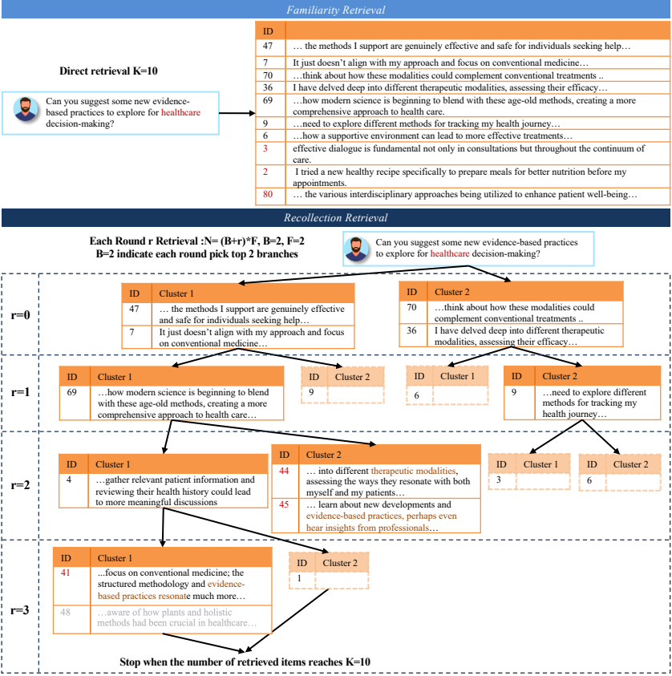

- Case study from PersonaMem: comparison between \emph{Familiarity} and \emph{Recollection} retrieval \revise{where Recollection wins}. Familiarity surfaces salient but fragmented evidence, while Recollection progressively reconstructs temporally distributed details via clustering and query refinement.

- Source: arXiv source `chapter/figure/case_study.pdf`

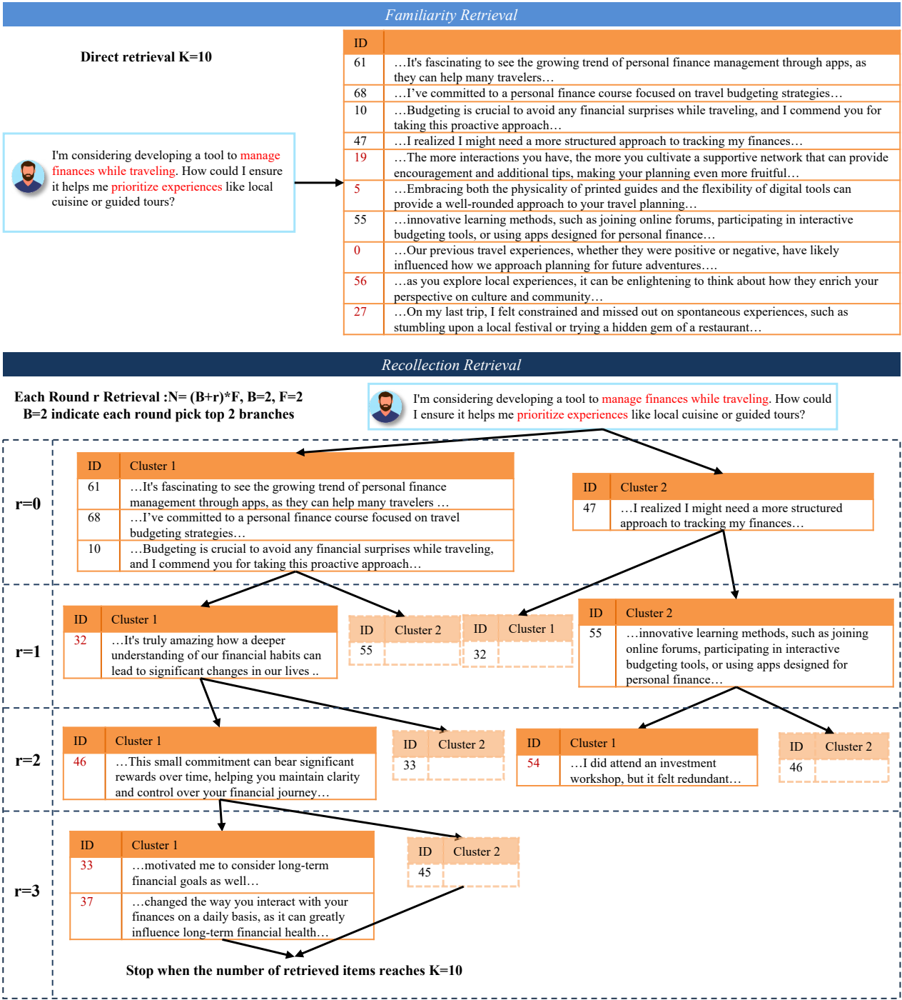

- \revise{Case study from PersonaMem: comparison between \emph{Familiarity} and \emph{Recollection} retrieval where Familiarity wins. Familiarity produces broader and more relevant evidence aligned with prioritizing travel experiences, while Recollection progressively drills into long-term financial management and drifts away from the user’s actual intent.}

- Source: arXiv source `chapter/figure/bad_case.pdf`

### 已抽取表格候选

暂无结构化表格候选。文字型表格或说明框在逐章阅读时转写为 Markdown list/table。

## 实验结论

## 局限性与可追问点

## 对我当前研究/项目的启发
