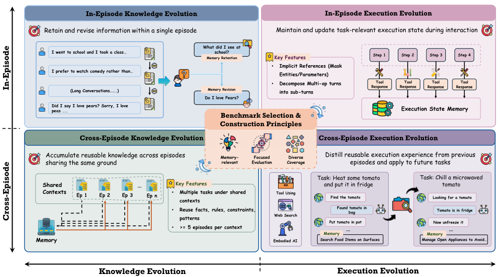
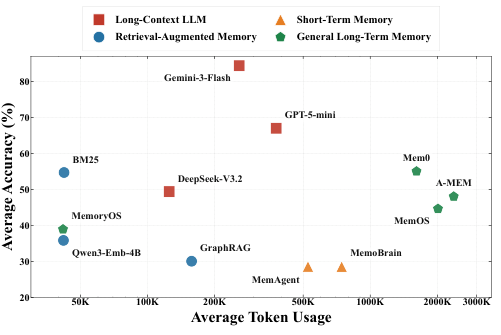
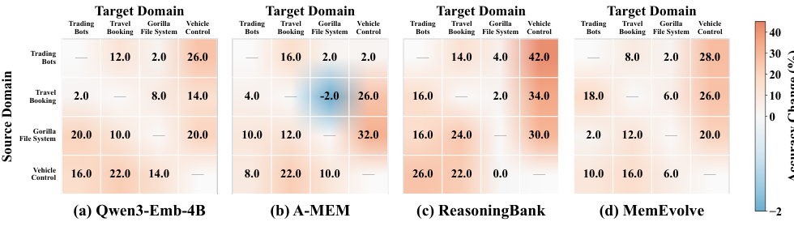
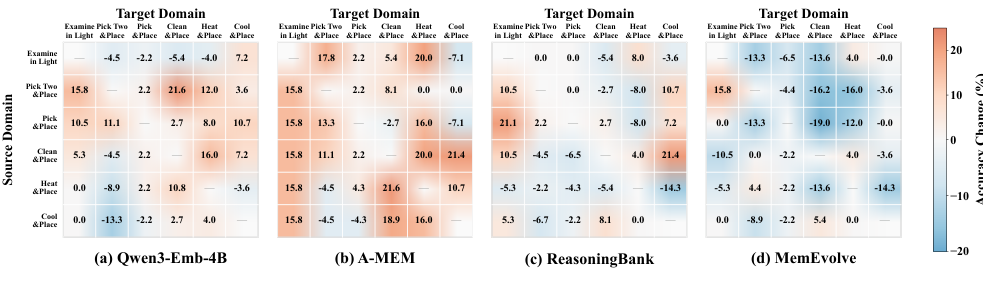

# EvoMemBench: Benchmarking Agent Memory from a Self-Evolving Perspective

> 来源：本地 arXiv:2605.18421v2，2026-06-15；以下页码均为 PDF 页码。完整覆盖 §1–6 Conclusion，附录仅用于理解实验协议，不逐条翻译。本文与 Evo-Memory、MemBench、MemoryBench 是不同工作，名称接近但不能混用数据或结果。

## 论文主线

EvoMemBench 把记忆评测拆成两个轴：**同一次任务内还是跨任务积累**，以及**支持知识回答还是支持动作执行**。四种组合覆盖不同的失败机制：遗忘事实、没更新旧事实、丢失执行状态、无法迁移历史经验。论文不是提出一种新的记忆算法，而是用统一骨干和协议比较 15 种记忆方法，并与强长上下文模型对照。

最核心的实证结论不是“加记忆总能改善 agent”，而是收益取决于任务难度、上下文预算和保存的经验是否匹配目标任务。全文直接访问原始证据常常很强；压缩或错误迁移也会伤害表现。这个结论要求分别查看四个象限，不能只看一个混合总分。

## 1 Introduction：从记住内容到支持持续适应

**来源：PDF pp.1–2，§1，Figure 1。** 单纯把历史追加到提示词中，会受到上下文长度和成本约束。但引入记忆后还必须回答：哪些事实仍然有效，哪些中间状态要保持，哪些跨任务经验可以复用。作者用 self-evolving memory 指这类持续更新与重用，并不要求模型参数本身在线训练。

**图 1 解读。** 左上是当前 episode 内保留/修订事实；右上是当前执行过程中记住工具结果、参数和尚未完成的步骤；左下是不同 episode 共享背景规则时积累知识；右下是从旧任务提炼可复用的行动方法。横轴区分“知道什么”与“下一步怎么做”，纵轴区分当前任务状态与跨任务经验。图中的例子说明，任务中的一个对象标识和一条跨任务烹饪规则并不是同一类记忆。

作者认为既有对话 QA 基准主要落在知识保持/修订领域，较新的 agentic benchmark 又往往只覆盖部分交互或持续学习场景。EvoMemBench 的价值在于把这些能力置于同一个评价框架，以同一骨干比较不同记忆形式的适用边界。

## 2 Related Work：为什么不能用一个 benchmark 代表所有记忆能力

**来源：PDF pp.2–3，§2、Table 1。** 方法侧包括检索增强、一般长期记忆、程序性记忆以及可演化的记忆架构。检索系统回用历史片段；长期系统维护事实、偏好和关系；程序性系统将轨迹抽象为步骤、工作流或策略。它们存储的对象不同，最终都叫“memory”并不意味着能在同一个任务上公平代表各自优势。

基准侧，LoCoMo、LongMemEval 与 MemoryAgentBench 主要检查文本中的长期信息；MemoryArena 更强调记忆驱动行动；StuLife 等进入持续互动。原文表 1 根据作者的两个轴给出覆盖对照。这个分类是本文的组织视角，并不意味着被划为某一象限的基准完全没有其他能力需求。

比较时尤其要避免将“知识任务中检索好”直接解释成“程序性经验学习好”。同样，某种 workflow memory 在工具任务上获益，也不能证明它擅长在多个互相矛盾的个人事实中找出最新有效信息。

## 3 Problem Formulation：怎样定义带记忆的 agent

### 3.1 Agents with Memory Mechanisms

**来源：PDF p.3，§3.1。** 第 $e$ 个 episode 的第 $t$ 步，agent 接收观察 $o_t^e$，已有历史 $h_{t-1}^e$，记忆状态为 $m_t^e$，选择动作：

$$
a_t^e\sim\pi(\cdot\mid h_{t-1}^e,o_t^e,m_t^e).
$$

动作获得反馈 $y_t^e$ 后，更新记忆：

$$
m_{t+1}^e=U(m_t^e,o_t^e,a_t^e,y_t^e).
$$

$\pi$ 是执行策略，$U$ 是记忆更新函数。公式没有规定记忆必须是向量、图或自然语言；这使不同方法可以接入同一接口。它也把行动和反馈显式纳入更新，区别于只把静态文档预先写进知识库的设定。

### 3.2 Scope of Memory Evolution: In-Episode and Cross-Episode

**来源：PDF p.3，§3.2。** In-episode 记忆只服务于当前任务：开始时初始化，过程中更新，结束后清空。它需要保留当前任务的实体标识、中间结果和有效知识。Cross-episode 记忆跨多个任务保留，后续 episode 可以利用之前的经验，但应避免把只适用于某次任务的细节机械复制到新任务。

这一区分对应不同的泄漏风险。当前 episode 结束后应清空的记忆如果没有清空，可能意外把测试实例相互污染；跨 episode 本来允许积累经验，但必须明确任务顺序、哪些反馈可见、是否在同一共享背景内累积。

### 3.3 Content of Memory Evolution: Knowledge and Execution

**来源：PDF pp.3–4，§3.3。** Knowledge evolution 关注事实、约束、偏好、规则和任务规律的保留及修订。Execution evolution 关注已完成什么、剩下什么、工具调用结果和哪些程序有助于下一步行动。一个工具返回的“对象 id”虽然形式上也是事实，但在这个分类中主要服务于执行状态跟踪。

四象限并非完全独立的认知能力；复杂任务可能同时需要它们。本文通过重构任务来突出某一种依赖，目的是减少复杂规划或预训练常识对“记忆是否发挥作用”的遮蔽。

## 4 Benchmark Construction：六个数据集如何落入四象限

**来源：PDF pp.4–5，§4、Table 2。** 选数据的原则是任务与记忆有关、结果可核验、领域足够多样。最终六个数据集如下：

| 象限 / 名称 | 来源 | 子域及样本数（原表口径） |
|---|---|---|
| InEp-Know | MemoryAgentBench | Accurate Retrieval 2,000；Selective Forgetting 800 |
| InEp-Exec | BFCL MultiTurn LongContext | 文件系统/车辆控制/交易/旅行预订，各 200 |
| CrossEp-Know | CL-Bench | 领域知识 294；规则系统 257；程序任务 306；经验发现与模拟 27 |
| CrossEp-Tool | BFCL MultiTurn Base | 文件系统/车辆控制/交易/旅行预订，各 200 |
| CrossEp-Web | xbench-DeepSearch、WebWalkerQA | 100、170 |
| CrossEp-Emb | ALFWorld | Examine 19；Pick 46；Clean 37；Cool 28；Heat 25；Pick Two 45 |

这些数字沿用 Table 2 的 samples 定义，不把多轮工具操作数与独立问题数合并计算一个“统一题量”。不同任务的评分单位和成本不同。

### 4.1 In-Episode Knowledge Evolution

**来源：PDF p.4，§4.1。** 从 MemoryAgentBench 取信息准确检索与选择性遗忘部分，采用渐进多轮输入。旧信息不断到达，后续可能出现修正，因此 agent 既要保留未过时事实，也要抑制已失效事实。

这个设置把 retention 和 revision 分开看。只要相关内容能被找回，retention 可能表现很好；但当同一实体先后有多个版本时，检索更多历史反而可能带来更多冲突。后面的 FactConsolidation 结果就是对这种区别的检验。

### 4.2 In-Episode Execution Evolution

**来源：PDF p.4，§4.2。** 在 BFCL 的长上下文多轮工具任务上做两种改写。第一，把后文中可以从历史推断的实体、参数或结果显式提及，改为隐式指代，迫使 agent 回忆。第二，将一轮中多个有依赖关系的动作拆成保持原顺序的子轮，减少一次规划很多步的干扰，突出执行状态保持。

改写由 GPT-5-mini 协助，并人工检查正确性。这个构造选择很重要：它确实增强记忆依赖，但也改变了原 BFCL 的任务表面形态，结果不能直接与原始 leaderboard 数字相比。

### 4.3 Cross-Episode Knowledge Evolution

**来源：PDF p.4，§4.3。** CL-Bench 为多个任务提供共享的新背景知识。作者按 context 分组，只保留至少五个样本的背景，共 **120 contexts、884 samples**。同一背景中的任务按顺序执行，上一题结束后更新记忆，供下一题使用。

Easy/Medium/Hard 根据 DeepSeek-V3.2 的基线表现按 context 分为三分位。因此难度划分是**相对于这个骨干**的，不是人类或所有模型通用的绝对难度。共享背景减少直接依赖预训练知识的可能性，但任务顺序仍可能影响记忆积累效果。

### 4.4 Cross-Episode Execution Evolution

**来源：PDF p.5，§4.4。** CrossEp-Tool 采用 BFCL Base 并做与 InEp-Exec 相同的记忆导向改写，用于学习 API 约束、参数填充和调用模式。CrossEp-Web 用两种搜索 QA 数据，测试搜索、证据核验经验能否复用。CrossEp-Emb 用 ALFWorld 六类任务，测试动作惯例和环境知识。

常规评测在各子域内部积累，避免一开始把异质环境混成同一个经验池；跨环境迁移另做实验：先在 source 子集构建记忆，再在 target 子集测试，且**目标测试阶段固定记忆，不继续更新**。因此迁移图反映源经验是否适用，而不是在目标域重新学习后的最终能力。

## 5 Experiments

### 5.1 Experiment Setup：公平比较的边界

**来源：PDF pp.5–6，§5.1。** 三个无外部记忆基线为 Gemini-3-Flash、GPT-5-mini、DeepSeek-V3.2；所有接记忆的方法统一使用 **DeepSeek-V3.2**。所以“记忆系统 vs DeepSeek-V3.2”更接近隔离记忆增益；与另两个强模型的比较还包含骨干能力差异。

| 记忆族 | 方法 |
|---|---|
| Retrieval-Augmented | BM25、Qwen3-Emb-4B、GraphRAG |
| Short-Term | MemAgent、MemoBrain |
| General Long-Term | Mem0、A-MEM、MemOS、MemoryOS |
| Procedural Long-Term | AWM、SkillWeaver、AgentKB、ACE、ReasoningBank |
| Meta-Evolution | MemEvolve |

并非 15 种方法都在每个象限强行运行，适用性按方法和任务匹配。知识任务报告答案准确率，执行任务报告最终成功率；跨子任务用 average rank 汇总，数值越低越好。token 成本包括 agent 与记忆模块的输入、输出，不能只数最终回答。

InEp-Know 在每个信息块后更新记忆，InEp-Exec 在每轮交互后更新；后者分别限制 16K、32K、64K、128K 上下文，记忆内容也计入预算。这使“加更多记忆”的代价真实地占用本来可以放原始历史的空间。

### 5.2 Main Results

#### 5.2.1 In-Episode Knowledge Evolution：保留比修订容易

**来源：PDF p.6，Table 3。** 下表保留主要基线与代表记忆方法；FC-MH/SH 分别为多跳/单跳事实修订：

| 方法 | EventQA | LongMemEval S* | RULER qa1 | RULER qa2 | FC-MH | FC-SH | Overall Rank ↓ |
|---|---:|---:|---:|---:|---:|---:|---:|
| Gemini-3-Flash | 98.20 | 83.00 | 94.00 | 77.00 | 58.00 | 96.00 | **1.00** |
| GPT-5-mini | 80.60 | 62.33 | 85.00 | 73.00 | 24.00 | 77.00 | 3.00 |
| DeepSeek-V3.2 | 83.00 | 32.33 | 64.00 | 42.00 | 10.00 | 65.00 | 5.50 |
| BM25 | 88.80 | 50.33 | 73.00 | 55.00 | 7.00 | 54.00 | **4.17** |
| Qwen3-Emb-4B | 83.60 | 21.33 | 38.00 | 38.00 | 4.00 | 30.00 | 8.17 |
| GraphRAG | 74.20 | 22.00 | 31.00 | 31.00 | 4.00 | 18.00 | 10.17 |
| MemAgent | 71.80 | 12.67 | 26.00 | 39.00 | 3.00 | 19.00 | 10.50 |
| MemoBrain | 77.60 | 10.67 | 30.00 | 32.00 | 1.00 | 20.00 | 11.00 |
| Mem0 | 79.20 | 52.00 | 75.00 | 68.00 | 7.00 | 49.00 | 4.50 |
| A-MEM | 91.20 | 51.00 | 60.00 | 46.00 | 5.00 | 35.00 | 4.83 |
| MemOS | 90.40 | 41.33 | 55.00 | 43.00 | 3.00 | 35.00 | 6.17 |
| MemoryOS | 84.80 | 38.67 | 41.00 | 37.00 | 2.00 | 30.00 | 8.17 |

**Finding 1。** 足够强的长上下文基线仍然占优。Gemini 在六个子集都领先，说明原始证据保存完整时，外部抽象未必更可靠。但因它与记忆系统骨干不同，这不是“同骨干加记忆一定变差”的因果证据。

**Finding 2。** 记忆系统较容易改善 retention，却难以正确 revision。BM25 相对 DeepSeek 在 EventQA、LongMemEval 和 RULER 都提高，但 FC-MH 从 10 降到 7，FC-SH 从 65 降到 54。A-MEM 的 EventQA 91.20 很高，修订却只有 5/35。这说明找回相关事实与选择仍有效的版本，是两项不同能力。

**图 2 解读。** 横轴为平均 token 使用量，采用跨数量级刻度；纵轴是平均准确率。图中 BM25 处于相对低成本位置，多个结构化或长期记忆系统付出较多 token 却没有获得相应准确率。应同时看横纵坐标，不能把更复杂的 memory construction 当作天然更高效。这里 token 包含记忆维护，而非只计算检索后的生成成本。

#### 5.2.2 In-Episode Execution Evolution：预算越紧，记忆越可能有用

**来源：PDF p.7，Table 4。**

| 方法 | 16K Overall | 32K Overall | 64K Overall | 128K Overall |
|---|---:|---:|---:|---:|
| Gemini-3-Flash | 50.5 | 65.5 | 66.9 | 62.0 |
| GPT-5-mini | 35.0 | 42.5 | 49.4 | 42.5 |
| DeepSeek-V3.2 | 28.5 | 35.5 | 45.3 | 39.5 |
| BM25 | 36.5 | 44.5 | 47.2 | 40.5 |
| GraphRAG | 35.0 | 36.5 | 52.0 | 41.0 |
| MemAgent | 26.0 | 36.5 | 47.4 | 37.0 |
| MemoBrain | 25.0 | 30.5 | 40.5 | 39.0 |
| A-MEM | 37.5 | 39.5 | 49.5 | 40.0 |
| AWM | 31.5 | 43.0 | **53.1** | 35.0 |
| SkillWeaver | 34.0 | 40.5 | 51.5 | 44.5 |
| ReasoningBank | **43.0** | **49.5** | 47.1 | **48.0** |
| MemEvolve | 36.0 | 41.0 | 50.7 | 43.0 |

**Finding 3。** 相对同骨干 DeepSeek，各预算下最优记忆方法提高 14.5、14.0、7.8、8.5 个百分点，低预算收益较大。这里每列最优可能是不同方法，不能把四个数字当成某一方法的完整曲线。

**Finding 4。** 程序性指导有价值，但压缩可能破坏关键细节。ReasoningBank 在 16K、32K、128K 最优；AWM 在 64K 最优。相反，MemAgent 与 MemoBrain 在 16K 都低于无记忆骨干，表明抽象过程中若丢失准确参数、实体引用或工具返回值，简短摘要未必能替代原始执行轨迹。

上下文增加也不保证单调提升：例如 DeepSeek 64K 为 45.3，128K 为 39.5。该表支持预算与记忆有交互作用，不能仅靠“窗口更长”推断所有任务必然更好。论文没有把每个下降都独立归因到某种机制，因此不能过度解释单列波动。

#### 5.2.3 Cross-Episode Knowledge Evolution：困难任务更需要经验

**来源：PDF pp.7–8，Table 5。**

| 方法 | Easy | Medium | Hard |
|---|---:|---:|---:|
| Gemini-3-Flash | 37.3 | 13.0 | 7.8 |
| GPT-5-mini | 60.8 | 21.6 | 14.4 |
| DeepSeek-V3.2 | 52.1 | 12.6 | 0.0 |
| BM25 | 47.2 | 13.8 | 10.1 |
| Qwen3-Emb-4B | **50.0** | 13.7 | 7.9 |
| GraphRAG | 48.0 | 13.7 | 7.7 |
| Mem0 | 44.6 | 11.7 | 3.8 |
| A-MEM | 43.8 | 10.0 | 6.7 |
| MemOS | 46.8 | 14.8 | 6.8 |
| MemoryOS | 44.2 | 11.0 | 9.0 |
| ACE | 44.8 | **16.5** | **13.0** |
| ReasoningBank | 42.7 | 15.7 | 6.1 |
| MemEvolve | 46.0 | 12.0 | 7.4 |

加粗仅表示上表记忆方法的最优项。**Finding 5。** Easy 中无记忆 DeepSeek 为 52.1，所有记忆方法都没超过；Hard 中它为 0.0，ACE 到 13.0、BM25 到 10.1。已经足够的当前背景可能被无关旧经验干扰，而困难任务更可能从先前推理和规则应用中获益。

**Finding 6。** 瓶颈是形成可复用知识，而非多存一些内容。ACE 在 Medium/Hard 的记忆方法中最好，尤其规则系统应用的 Easy/Medium/Hard 为 74.9/24.0/7.8。作者将其解释为记忆需要保存“怎样应用规则”的经验，而不只是规则文本。这个解释与结果一致，但并不是一项单独控制记忆内容形式的消融实验。

#### 5.2.4 Cross-Episode Execution Evolution：不同环境需要不同记忆形式

**来源：PDF pp.8–9，Table 6。** 由于任务组大小不同，论文用排名作综合比较。以下列出各大类平均 rank 及总 rank，越低越好：

| 方法 | Tool Rank | Web Rank | Embodied Rank | Overall Rank |
|---|---:|---:|---:|---:|
| DeepSeek-V3.2 | 13.5 | 14.0 | 10.0 | 11.8 |
| BM25 | 5.8 | 6.5 | 7.8 | 6.9 |
| Qwen3-Emb-4B | 4.0 | 8.0 | 6.0 | 5.7 |
| GraphRAG | 6.5 | 11.0 | 5.8 | 6.9 |
| Mem0 | 8.5 | 4.0 | 8.2 | 7.9 |
| A-MEM | 8.8 | 6.0 | **1.8** | **5.2** |
| MemoryOS | 5.8 | 6.5 | 6.5 | 6.5 |
| AWM | 11.0 | 5.0 | 4.3 | 7.2 |
| SkillWeaver | 12.3 | 13.5 | 10.2 | 12.2 |
| AgentKB | 8.3 | 6.0 | 4.2 | 6.5 |
| ACE | 9.8 | 9.5 | 4.8 | 8.2 |
| ReasoningBank | 4.8 | 4.5 | 4.5 | 5.4 |
| MemEvolve | 8.8 | 13.0 | 6.0 | 8.8 |

具体成功率可帮助理解 rank 的尺度：DeepSeek 在 Vehicle Control 为 36.0，BM25 为 88.0、ReasoningBank 为 82.0；WebWalkerQA 从 61.2 到 ReasoningBank 的 75.3；ALFWorld Clean&Place 从 56.8 到 A-MEM 的 81.1。收益并非只来自某一个总分权重。

**Finding 7。** 按方法族平均，工具使用中 retrieval-augmented 最好，网页搜索中 general long-term 最好，具身任务中 procedural long-term 最好，对应平均 rank 5.43、5.38、5.60。但这不等于每个族内方法都优于其他族，也不等于最佳单一方法必定来自该族：例如具身任务的单方法 A-MEM 很强。家族均值和单系统排名要分开解释。

**图 3 解读。** 行为源域，列为目标域，颜色表示相对无记忆基线的准确率变化；对角线不用于跨环境比较。工具任务的非对角格多呈正收益，可能因为检查中间状态、使用工具返回值填下一步参数、核验最终状态等决策习惯能跨 API 领域迁移。不同方法的颜色深浅又显示，这种可迁移性仍依赖经验提炼方式。

**图 4 解读。** 具身任务迁移更常出现蓝色负收益格。冷却、加热、清洁、检查和放置虽然都涉及物体操作，却具有不同目标和前置条件；错误的源经验可能把 agent 引向不适用步骤。读图时应看同一目标列里源任务变化，而不只数有多少正值。

**Finding 8。** 迁移取决于记忆是否保留目标任务仍适用的决策过程。源经验与目标过程不匹配时，“记得更多”并不能补救。此实验使用冻结的源记忆，因此没有混入目标域继续更新带来的适应收益。

#### 5.2.5 Summary：把八条发现放回同一证据链

**来源：PDF p.9。** 四象限的共同趋势是：上下文不足、任务较难、或历史经验与目标结构匹配时，记忆更容易有益；原始上下文足够时，压缩和检索增加的噪声可能抵消收益。事实更新与跨环境执行迁移仍是明显短板。

本文没有一张“新方法去掉组件”的传统消融表，因为它没有提出待消融的新算法。对应的机制检验是上下文预算、任务难度和跨环境迁移三个条件变化。把它们称为分析实验更准确，不应凭空补出不存在的模块消融。

## 6 Conclusion 与证据边界

**来源：PDF p.10，§6。** 作者总结 EvoMemBench 提供四种记忆演化的统一试验台，现有系统尚未形成通用解决方案。论文支持按任务需求选择记忆表示，同时保留强无记忆基线，而不是假设一个复杂记忆模块可以全面替代长上下文。

阅读时需注意四个限制。第一，跨骨干比较不能单独归因于记忆。第二，CL-Bench 难度由 DeepSeek 定义，可能影响模型间“简单/困难”的含义。第三，数据重构依赖 LLM 与人工核验，隐式指代会改变原任务分布。第四，rank 适合汇总但不显示绝对收益规模；小差距和大差距可能只相差一个名次。上述限制来自实验设计本身，不是作者额外报告的新实验结论。

## 对记忆研究与系统选型的启发

对于长篇叙事或多角色 agent，可借用四象限设计诊断：当前故事内人物已知事实的修订属于 InEp-Know；执行一段写作计划时保持约束属于 InEp-Exec；跨作品积累类型知识属于 CrossEp-Know；跨任务学习写作、核查和修改流程属于 CrossEp-Exec。这样可以避免一个最终文本质量分数掩盖到底是事实记忆还是执行经验出了问题。

复现时需要保存 episode 顺序、记忆重置边界、每步可见反馈、检索 token 占用、上下文截断规则及 source→target 的冻结状态。尤其应同时报告无记忆同骨干、强长上下文模型、准确率/成功率和完整 token 成本。只有这些条件一致，才能判断收益来自记忆本身还是提示长度、强模型或任务重构。

正文已完整覆盖 §1–6、§3.1–3.3、§4.1–4.4、§5.1–5.2.5；4 张正文图已嵌入。核心结果及条件变化实验已给出数值，附录完整提示词和所有逐子域大表未逐条复写。
