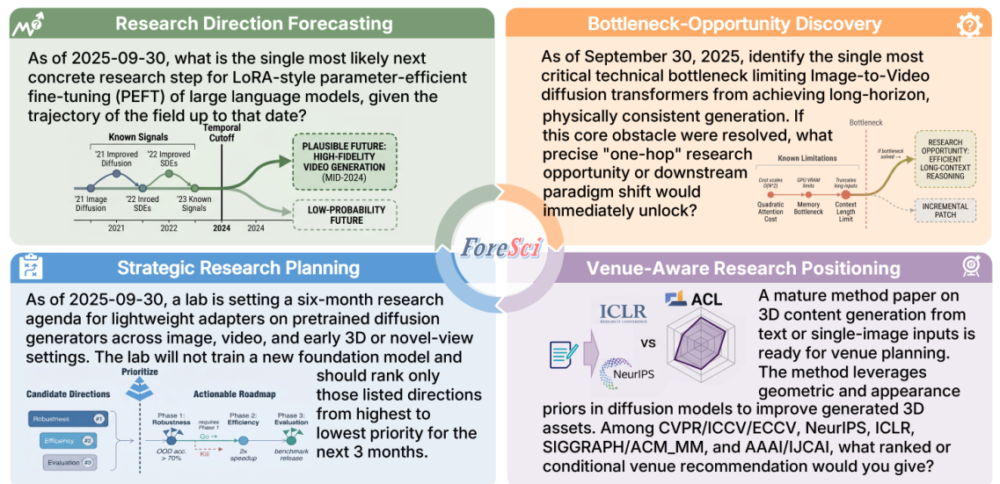
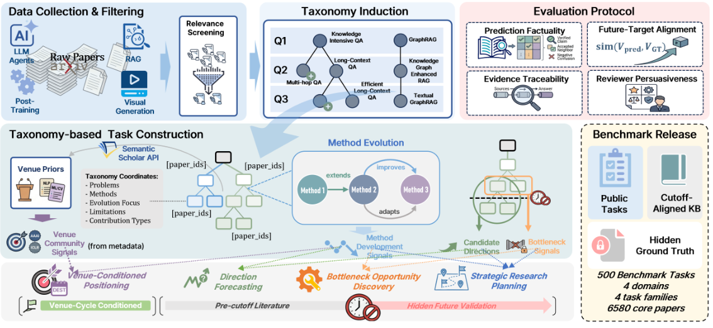
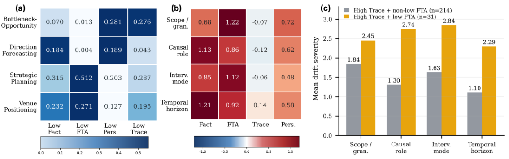
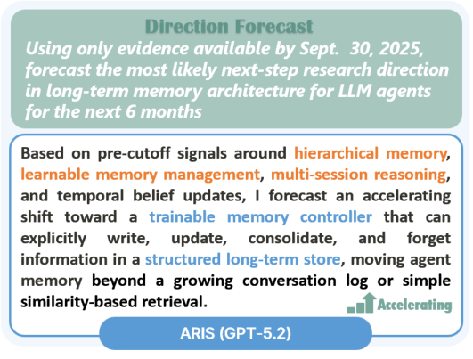

# ForeSci: Evaluating LLM Agents for Forward-Looking AI Research Judgment

> 阅读范围：本地匿名投稿 PDF 第 1–9 页，完整覆盖正文第 1–6 节、Limitations 与 Ethical Considerations。附录只在解释评估细节时引用，不把附录逐段翻译作为正文完成条件。下列图均直接裁自原 PDF；页码采用 PDF 页序。

## 先把研究问题说清楚

ForeSci 评估的是：站在某个历史时间点，一个研究助手能否用当时能找到的论文，为接下来的研究方向、关键瓶颈、团队计划或投稿定位作出有依据的判断。它不是要求模型复述未来论文，也不是判断一句预测听起来是否新颖。500 个问题都附带受时间限制的离线知识库；未来论文只参与评估，不让答题系统检索。

全文最有价值的发现是 **evidence–decision decoupling（证据与决策脱钩）**：系统可能给出很多相关、可追溯的历史证据，却选错未来研究对象、弄反瓶颈与机会的因果位置，或者给出不适合当前时间窗口的干预。因而，“能引用论文”并不能单独证明它具备科研判断力。这个结论来自分项结果与错误审计，而不是作者对 agent 的笼统印象。

## 1 Introduction：为什么需要单独评估科研判断（p.1–2）

科研决策的价值往往体现在结果尚未出现时：一个瓶颈是否值得攻克，一个方向是否值得投入六个月，一个项目该面向哪个社区。现有 research agent 的检索、写作或实验执行能力，不能直接回答这些问题。一个系统可能很会整理已知知识，却不会从中选择下一步行动。

作者强调两个必须同时解决的条件。第一是**信息边界**：检索语料和答题模型都不能提前看见预测窗口的答案。第二是**历史可推断性**：不能随意挑一件未来事件让模型猜，问题必须能从截止时间之前已经存在的方向演化、瓶颈或社区信号中合理推导。只控制检索时间而随机构造未来目标，会把评测变成运气测试；只设计合理问题而不隔离未来信息，又会奖励事后知识。

**图 1（p.2）解读。** 四个框分别对应方向预测、瓶颈—机会发现、战略规划、投稿定位。方向预测示例问 LoRA 类高效微调接下来最可能的发展路线；战略规划示例加入六个月、有限模型选择等约束；投稿定位要求比较不同会议社区。共同点是答案包含“选择及其理由”，不能只列相关论文。图中未来分支是评测者用来构造目标的材料，不能当作答题时已公开的证据。

论文贡献包括可控时间的 500 题基准、四个相互补充的指标、跨模型的系统比较，以及对上述脱钩现象的具体诊断。另有一个只生成预测、暂不评分的前瞻性包，用于展示新文献到来后如何更新任务。

## 2 Related Work：与现有科研 benchmark 的边界（p.2–3）

**自主研究系统。** PaperQA、Chain-of-Ideas、AI-Researcher、AI Scientist 等工作覆盖文献检索、综合、构想和执行。ForeSci 的定位是这些系统之上的“研究决策层”：不仅提供信息，还要决定哪条方向最值得做，并说明证据如何导向这个选择。

**自主研究评测。** 已有基准会测科学推理、文献问答、研究工作流和论文相关产物，也有工作测 novelty、taste、impact、未来论文对齐，或预测未来论文组成部分。ForeSci 选择开放式、宏观、带约束的判断问题，例如对多个研究选项排序。这种输出有偏好和情境依赖，不能简单用标准答案字符串匹配。

**时间完整性。** 一般预测基准已经强调时间切分、知识泄漏与历史回测。本文把这个要求扩展到开放式科研输出：生成端只接触截止前知识，评估端可以接触隐藏的截止后证据。需要同时检查知识库时间与模型知识时间；模型发布时间和真实训练数据截止日期不是同一概念，论文对不同 backbone 使用的时间依据也并不完全一致，复现时应逐项核实。

## 3 The ForeSci Framework：任务如何从历史文献中构造（p.3–5）

### 3.1 Problem Formulation

一个实例写作：

$$
x=(q,t,K_{\le t}(q),f),\qquad a=\pi_\theta(q,K_{\le t}(q)).
$$

这里，$q$ 是公开问题，$t$ 是截止日期，$K_{\le t}(q)$ 是允许系统访问的历史知识库，$f$ 是四种任务族之一，$a$ 是系统答案。隐藏目标 $G_{>t}(q)$ 来自未来论文，只向评估器开放。特别要区分 $K_{\le t}$ 与 $G_{>t}$：前者负责约束推理依据，后者负责判断预测是否与后来的研究发展一致。

实验关闭在线搜索，约束 agent 的检索、工具与记忆只能使用该离线知识库，并选用作者认为训练知识早于相应任务截止点的 backbone。这个设置测的是“限定历史证据下的判断”，不能直接外推到随时联网的实际研究助手。

### 3.2 Data Collection and Filtering

作者从 arXiv 按领域检索候选论文，通过 Semantic Scholar 补充出版信息，按 arXiv 标识去重。筛选分两层：先去掉只命中表面关键词的领域无关论文，再识别具有核心贡献和未来信号的 benchmark-core 论文；相关但不居核心的论文仍可作为 supporting papers，噪声或边界不清的条目剔除。

| 领域（Table 1，p.4） | 离线知识库文档数 | 任务数 |
|---|---:|---:|
| LLM Agents | 2,769 | 138 |
| LLM Fine-tuning and Post-training | 2,131 | 99 |
| RAG and Retrieval Structuring | 767 | 92 |
| Visual Generative Modeling and Diffusion | 913 | 171 |
| 合计 | 6,580 | 500 |

领域分布不均衡，但四种任务族各有 125 题。截止时间随实例而变：正文列出三个月窗口对应 2025-12-31、六个月窗口对应 2025-09-30，并包含 2025-09-30 之后的 venue deadline 设置。因此不能把全部 500 题理解为同一个固定截止点、同一种预测跨度。

**图 2（p.5）解读。** 从左上角的论文收集和筛选，进入 taxonomy 构造与方法演化，再由不同 builder 生成任务。公开发布的任务与 cutoff-aligned 知识库和隐藏的未来目标分开。图上将指标画在同一管线中，强调“数据如何得到”与“答案如何评分”共同决定时间控制能否成立。不能把隐藏 taxonomy、未来演化边或参考目标直接交给被测 agent。

### 3.3 Taxonomy Construction

作者基于 TaxoAdapt 为每个领域 $d$ 和截止点 $t$ 归纳图：

$$
T_{d,t}=(V_{d,t},E_{d,t}).
$$

节点代表研究子方向，边代表方法演化关系。图在连续时间切片中扩展，保持时间顺序，避免后来的研究术语或分类反向进入早期问题。这里的 taxonomy 不只是给论文贴标签，而是用来定位“哪些方向已经有足够证据，可以合理询问它下一步如何发展”。

每个节点聚合多篇当时可见的代表性与支持性论文，保存全文证据，说明已出现的问题、方法、评价重点、局限与贡献类型。在节点记录之上抽取五类信号：候选研究方向；方法和评估如何演化；重复出现的瓶颈；近期可行性、依赖及风险；venue-community 的贡献风格、成熟度要求与评审风险。

LLM 先抽取这些结构，人工专家再核查证据强度和时间有效性。人工环节不是仅检查语言通顺，还要判断这个研究方向是否确实能由当时材料推出。这也意味着任务质量依赖构造流程和专家判断，taxonomy 不是客观唯一的领域地图。

### 3.4 Task Families

| 任务族 | 系统具体要做什么 | 隐藏目标如何定义 |
|---|---|---|
| Direction Forecasting | 在给定候选方向中选择未来更可能获得动能的方向，并说明轨迹 | 未来方法演化形成的主要方向、可接受邻近方向及 accelerating/steady 等轨迹标签 |
| Bottleneck–Opportunity Discovery | 找出一个根瓶颈，说明削弱它后会开启哪种“一跳”机会 | 根瓶颈、允许的表述变体、被释放的机会及其机制 |
| Strategic Research Planning | 为假想团队对固定研究选项排序，兼顾近期资源与实施约束 | 目标排序、最高优先项、理由、里程碑、依赖、风险及 go/no-go 条件 |
| Venue-Conditioned Positioning | 对 venue/track 排序或条件推荐，说明 framing、评审风险和证据升级要求 | 根据社区信息和未来方法发展诱导的投稿定位判断 |

瓶颈任务尤其要求分清“原因”和“后果”：一个有吸引力的新应用不等于当前阻碍进步的根瓶颈。战略规划则不能只报最热门方向，还要把未来价值和团队执行条件一起考虑。投稿定位也不等于预测录用率，而是判断贡献与社区预期是否匹配。

任务由 LLM 起草，再由专家检查源证据、时间泄漏、模糊表达和支持薄弱的条目。公开问题隐藏内部 taxonomy 信息和未来结果；未来目标允许一定的相邻方向或瓶颈变体，避免完全依赖措辞一致。

## 4 Evaluation：四个指标分别检查哪一环（p.5–6）

### 4.1 Metrics

**Prediction Factuality（Fact）检查未来目标中的事实覆盖与准确性。** 评估器将答案拆成原子断言 $C(a)$，再与隐藏未来目标中的 claim bank $C^*(q)\subset G_{>t}(q)$ 对比，报告断言级 F1。它不是单纯判断引用是否真实，也不是只对截止前文献做事实核验。若答案写得少但都正确，recall 仍会受罚；若列出很多泛泛预测，precision 可能下降。

**Future-Target Alignment（FTA）检查是否选对未来决策目标。** 方向预测和瓶颈—机会任务用 bge-m3 表征相似度比较抽出的预测断言与隐藏 claim bank；战略规划和投稿定位则比较排序，使用确定性的排序对齐计算。两种实现服务于不同输出形态，因此 FTA 不应被解释为统一的“预测正确率”。

**Evidence Traceability（Trace）检查历史证据能否支持所作判断。** 评估器查看是否使用相关的截止前证据、证据是否支撑最终决策，以及是否存在从文献到结论的无依据跳跃，归一化到 $[0,1]$。Native LLM 没有检索证据，主表以横线表示这一项，不应填成零分。

**Reviewer Persuasiveness（Pers）检查论证是否有研究判断上的说服力。** 不同任务族用各自 rubric，对决策质量、机制解释、比较推理、清晰度和风险意识评分：

$$
\operatorname{Pers}(a,q)=R_f(q,a,E_{\le t}(q),G_{>t}(q)).
$$

$E_{\le t}(q)$ 是截止前支持材料包，$R_f$ 是任务特定的评分标准。这里的“评审”是 LLM 虚拟评审，不能等同真实会议的录用结果。自动评估使用 DeepSeek-V4；Trace 和 Pers 属于 rubric 评分，论文重复运行评估器并报告均值/方差，人工校验详见附录 C.3。

### 4.2 Models, Systems, and Adaptation

系统包括无检索 Native LLM、稀疏加稠密检索的 Hybrid RAG，以及 CoI-style、ResearchAgent-style、ARIS-style 三种离线适配 agent。适配同时约束检索、工具、记忆，并要求最终答案符合任务族的输出 schema。因此主表比较的是在同一历史知识边界内的系统工作流，不是原系统不受限制的官方成绩。

Backbone 是 Qwen3-235B、GPT-5.2、GLM-4.6 与 Gemini-3。论文用 Qwen3 和 GLM 的发布日期、GPT-5.2 与 Gemini-3 的知识截止信息说明时间选择。阅读时应保留这种证据口径差异：公开发布早于任务截止点是支持时间控制的一个条件，但不能自动保证训练集所有时间信息都审计无误。

## 5 Results：收益来自哪里，失败发生在哪里（p.6–8）

### 5.1 Evaluation of LLM Agents

下表逐项转录主文 Table 2；分数均保留原来的 0–1 尺度。

| Backbone | 系统 | Fact | FTA | Trace | Pers |
|---|---|---:|---:|---:|---:|
| Qwen3-235B | Native | .603 | .622 | — | .786 |
| Qwen3-235B | Hybrid RAG | .597 | .630 | .432 | .775 |
| Qwen3-235B | CoI | .611 | .642 | .560 | .782 |
| Qwen3-235B | ResearchAgent | .609 | .660 | .563 | .787 |
| Qwen3-235B | ARIS | .607 | .644 | .608 | .793 |
| GPT-5.2 | Native | .618 | .628 | — | .846 |
| GPT-5.2 | Hybrid RAG | .610 | .626 | .408 | .837 |
| GPT-5.2 | CoI | .626 | .632 | .593 | .857 |
| GPT-5.2 | ResearchAgent | .635 | .633 | .584 | .857 |
| GPT-5.2 | ARIS | .617 | .642 | .627 | .861 |
| GLM-4.6 | Native | .509 | .590 | — | .674 |
| GLM-4.6 | Hybrid RAG | .520 | .613 | .429 | .658 |
| GLM-4.6 | CoI | .543 | .620 | .499 | .662 |
| GLM-4.6 | ResearchAgent | .540 | .633 | .499 | .656 |
| GLM-4.6 | ARIS | .537 | .619 | .520 | .649 |
| Gemini-3 | Native | .544 | .609 | — | .741 |
| Gemini-3 | Hybrid RAG | .559 | .598 | .413 | .720 |
| Gemini-3 | CoI | .563 | .606 | .473 | .734 |
| Gemini-3 | ResearchAgent | .562 | .609 | .459 | .729 |
| Gemini-3 | ARIS | .560 | .602 | .567 | .733 |

证据组织对 Trace 的提升比较一致：例如 GPT-5.2 从 Hybrid 的 .408 到 ARIS 的 .627，增加 .219；Qwen3 从 .432 到 .608，增加 .176。但 FTA 的变化小得多，且最佳工作流不同：Qwen3 和 GLM 上 ResearchAgent 最佳，GPT-5.2 上 ARIS 最佳，Gemini-3 上 ResearchAgent 只追平 Native 的 .609。

Pers 更能说明“复杂工作流不自动有益”：GLM 的原生模型 .674 高于全部三个 agent，Gemini-3 原生 .741 也高于三个 agent。作者的解释是检索或结构化产物可能帮助某些 backbone 组织推理，也可能为另一些模型加入噪声或降低最终报告质量。这是合理解释，主表本身并未单独识别该机制。

因此论文支持的是“部分 agent 在特定任务、backbone 和指标上有收益”，不能写成“agent 全面优于 RAG”或“最强模型包揽四项”。额外检索和工具使用的真正价值要看它能否改变并改善最终决策。

### 5.2 Error Mechanisms: When Foresight Fails

**图 3（p.8）解读。** (a) 对每个指标取全体最低 20% 为低分集合，再统计各任务族落入该集合的比例；(b) 比较无偏移和严重偏移答案的标准化指标差；(c) 在高 Trace 答案内部比较低 FTA 与非低 FTA 的偏移严重程度。三个子图按“哪里容易错—什么错误影响分数—可追溯为何仍会错”构成证据链。

战略规划的 Fact 和 FTA 低分率分别为 .315 与 .512，明显体现“排序正确且理由正确”比较困难。不同任务族的失败通道不相同：瓶颈任务的低 Trace 率为 .276，而投稿定位低 Pers 率为 .195。这里的 .512 是该任务族落入全局 FTA 最低 20% 集合的比例，不是准确率或全部预测错误率。

作者人工验证 LLM 对答案偏移的分类，定义四种偏移，严重度记为 $s\in\{0,1,2,3\}$：

| 偏移类型 | 实际含义 | 易混淆之处 |
|---|---|---|
| Scope/granularity | 讨论相关方向，但粒度或研究对象不对 | 大方向“相关”无法替代题目要求的具体路线 |
| Causal-role | 给技术因素分配了错误因果角色 | 把瓶颈解除后产生的机会误当根瓶颈 |
| Intervention-mode | 问题大体找对，但行动方式错误 | 需要改训练目标，却只建议工程集成 |
| Temporal-horizon | 指向错误成熟阶段或时间尺度 | 近期可做计划被长期愿景取代 |

采样每类任务 20 题，包含五种方法、四个 backbone，共 1,600 个匹配答案，四维合计 6,400 个维度标注。标准化差异定义为：

$$
\Delta_{\mathrm{norm}}(m)=\frac{\mathbb{E}[m\mid s=0]-\mathbb{E}[m\mid s\ge2]}{\operatorname{SD}(m)}.
$$

$m$ 是某项评估指标；分子比较完全无偏移和至少中度偏移的平均表现。该量是观测分组差异，不是对偏移做随机干预后得到的因果效应。因果角色偏移对应 Fact 下降 1.13 个标准差；粒度偏移与干预方式偏移分别对应 FTA 下降 1.22、1.12 个标准差。Trace 与这些内容错误的关联弱，甚至方向不一致。

图 3(c) 中高 Trace 但低 FTA 的 31 个答案，在四种偏移上的平均严重度都高于高 Trace 且非低 FTA 的 214 个答案。附录案例更直观：Gemini-3 ARIS 的投稿建议 Trace=.920，却只有 Fact=.200、FTA=.355。它围绕 RL-from-AI-feedback 给出有文献支撑的 NeurIPS-first framing，但参考目标将项目视为语言模型后训练与对齐，更偏向 ACL/EMNLP。证据相关并没有阻止决策对象偏移。

论文还在附录 F.1 比较不同方法的错误“指纹”。主文的谨慎结论是：agent 对局部证据的组织可能增强可信感，同时放大一个方向已经走偏的结论；不能仅以答案是否带引用判断其可靠性。

### 5.3 Prospective Use: Dynamic Forecasting Beyond Retrospective Evaluation

作者用同一管线生成真正等待未来验证的任务包：LLM-agent 领域，文献截止点 2026-05-15，预测窗口为 2026-05-16 至 2026-08-15，共 12 题，四类各三题。论文写作时目标尚未发生，所以**不报告这个包的预测得分**。它只证明数据构造与预测记录可以随新文献刷新，尚不能证明真实部署的预测质量。

**图 4（p.8）解读及原文核对。** 图示回答根据分层记忆、可学习记忆管理、多会话推理和时间性信念更新，推测 agent memory 会转向可训练控制器与结构化长期存储。它保留方向、轨迹标签和理由，展示一个预测产物应该如何表达。**图中文字使用 2025-09-30、未来六个月，而本节描述的新前瞻包使用 2026-05-15、三个月窗口；两者时间设置不一致。** 笔记保留这处原稿差异，不把图里的答案当作新 12 题包已经验证过的结果。

## 6 Conclusion：本文最终建立了什么（p.8）

ForeSci 把面向未来的研究判断转成了可重复的受控任务：历史知识库负责界定生成时能知道什么，隐藏的未来目标负责验证判断，四个指标分别检查未来事实、决策对象、证据链和说服力。实验说明 agent 工作流经常改善证据组织，却没有一个方法在所有模型、任务族和指标上占优。

最应保留的认识是：科研判断错误往往发生在“从正确局部证据到最终行动选择”的连接处。正确引用、流畅论证、甚至较高 Trace，都不能保证选对研究方向。这也是把 Fact、FTA、Trace、Pers 分开报告而不是压成一个综合分的原因。

## Limitations 与 Ethical Considerations（p.9）

论文只覆盖四个快速发展的 AI 领域、四类任务和特定时间窗口，不能充当所有学科研究助手的通用排名。文献可见信号也无法完整代表未发表研究、社区隐性知识、真实评审偏好和后续采用情况。对 venue positioning 与战略规划，参考排序不可避免包含偏好，不宜把与参考目标不同的所有方案视为科学上无价值。

隐藏未来目标、人工任务构造和 LLM judge 都会引入误差。重复评分能显示评估器波动，却不能消除 rubric 本身的偏向；Pers 更是虚拟评审近似量，不是科学价值的直接度量。论文因此更适合比较失败方式和证据使用，不能据此认证唯一最优研究系统。

伦理说明指出该数据来自公开学术材料，面向研究助手诊断。实际研究优先级、投稿和评审决策仍应有人类判断参与；特别是高说服力但校准不足的预测，可能误导有限资源的配置。

## 对当前研究的可操作启发（阅读者分析）

若把该思路用于研究规划系统，应明确记录五个对象：截止点、公开证据、候选行动、所选行动与理由、待未来验证的目标。仅存最终长报告会丢失“证据到底怎样影响选择”的审计条件。

可以把失败检查拆成对象、因果角色、干预方式和时间尺度四项，而不是让 reviewer 只打一个整体质量分。对于 memory、retrieval 或 proposal 系统，尤其应加入“证据已找到但决策仍错误”的对照，区分检索能力与利用证据作决定的能力。这是从本文机制诊断得到的设计建议，并非论文已经验证的新增实验。
