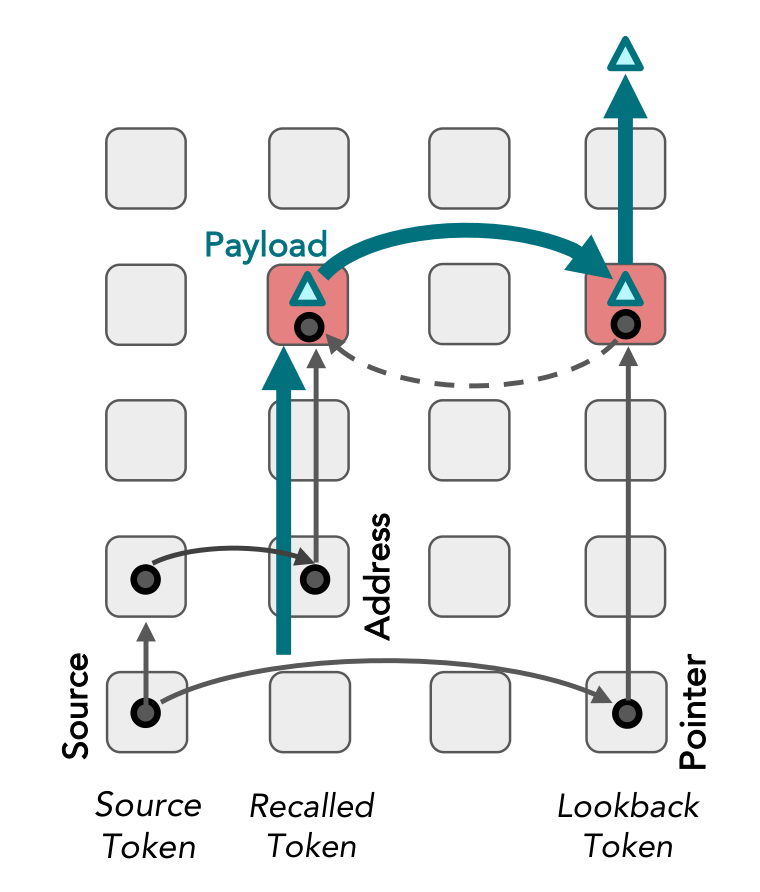
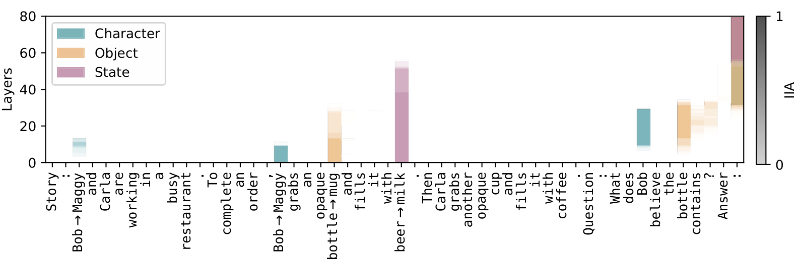
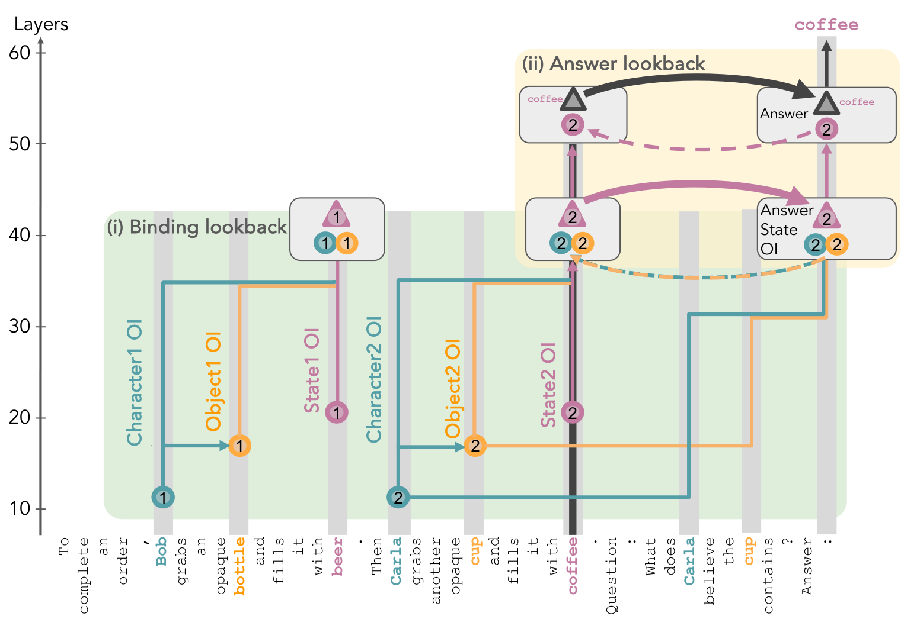
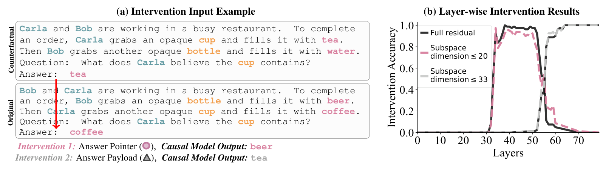
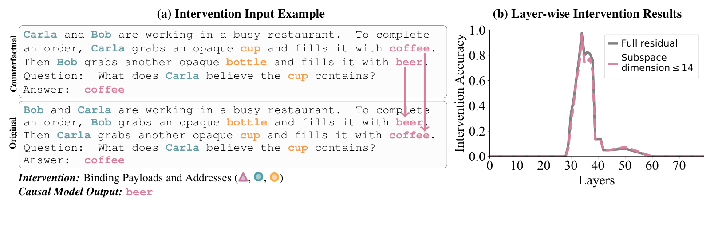
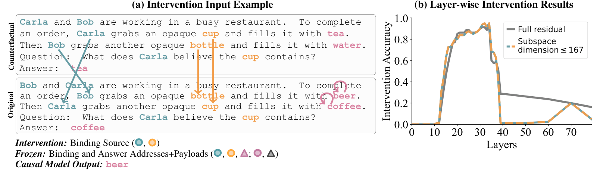
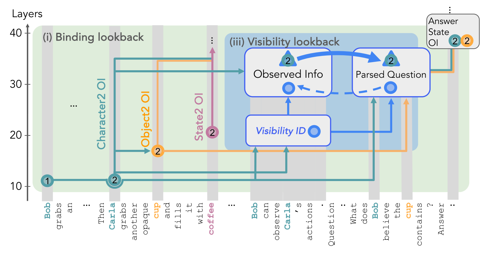
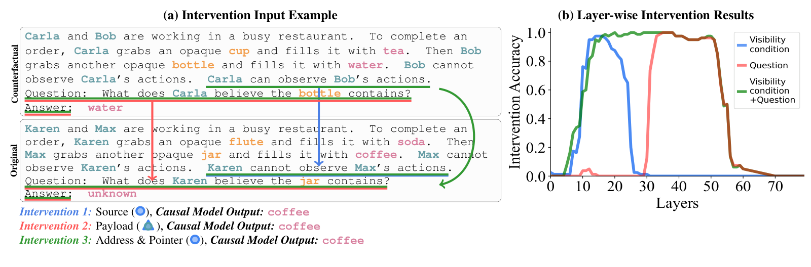

# Language Models Use Lookbacks to Track Beliefs

## 阅读定位：论文解释的是内部算法

本文研究语言模型如何在内部追踪“谁知道什么”，尤其是人物的信息不同、信念可能不同于实际状态时，模型怎样找到该人物应该相信的答案。它的主要贡献是 **lookback 这一可被因果干预支持的计算模式**，不是新的提示法或外部记忆模块。

笔记依据本地 arXiv v3 / ICLR 2026 PDF，完整覆盖正文 §1–8（pp.1–10），补读伦理、行为基线及 BigToM 迁移证据。正文 8 张原图全部插入。以下具体层数来自正文重点分析的 Llama-3-70B-Instruct，不应直接套到其他模型。

中心发现是：模型先保存能够定位信息的引用，再在问题出现时沿引用取回所需内容。**Binding lookback** 找到人物—物体对应的状态编号，**Answer lookback** 再用编号找到具体状态词；存在可见关系时，**Visibility lookback** 帮助把另一个人物观察到的信息纳入当前人物的知识。作者用交换内部激活后的反事实输出验证这些角色，而不是仅凭 attention 图宣称模型理解了信念。

## 1 Introduction：从行为分数转向计算机制

ToM 行为测试能够说明模型在某些题上答对或答错，却不能单独区分系统化算法与表面关联。Sally–Anne 式情境要求追踪人物因信息缺失形成的不同信念：世界已经改变，未观察到变化的人仍可能相信旧状态。作者希望进一步知道模型在哪里保存身份、怎样关联状态、可见性如何影响信息利用。（§1，pp.1–2）

为此，本文构造容易系统地交换人物、物体、状态和可见性的 CausalToM。它的简化不是为了得到最全面的 ToM benchmark，而是为了构造严密的反事实配对：如果只改一个内部变量，高层算法应该输出什么？模型实际是否也这么变化？这一研究目标决定了后文以干预实验为中心。

## 2 The Lookback Mechanism：地址、指针和内容各做什么

*原文 Figure 1，p.2。实线是信息传递，虚线是 pointer 指向 address 的回看；与 address 同处的 payload 才是要取回的内容。*

一个 source reference 被复制到两个位置：较早 token 的 residual stream 中存 **address**，较晚、需要使用信息的 token 中存 **pointer**；与 address 一起保存的是 **payload**。当信息真正需要时，pointer 形成 attention query，address 形成 key，两者匹配后通过 value/output 路径把 payload 送到当前 token。（§2，pp.2–3）

这里的“指针”是对神经表征功能的描述，并非模型维护了显式内存地址表。pointer 和 address 不必在向量空间逐维相同，只需分别经 query/key 变换后产生适当的点积匹配；QK 回路解决“去哪里取”，OV 回路解决“取来什么”。两类变量必须区分，否则就无法解释为什么交换某一中间表征会取出第三个答案。

作者给出的学习动机是：模型读到故事时不知道后面会问什么，与其立即把一切可能答案搬到所有后续位置，不如把重要内容与可定位的地址保存在局部，等问题出现再检索。这也是它与简单“把最后状态一路复制到末尾”的机制不同之处。

论文脚注还区分 lookback 与典型 induction head：这里同一个引用信息会到达存放内容的位置和之后需要查询的位置，构成可解引用关系。相似之处在于都利用 attention 的匹配与搬运，本文的具体因果分工需要由后面的实验支持。

## 3 Experimental Setup: Dataset, Models, and Methods

### 3.1 Dataset：反事实配对比故事复杂度更重要

CausalToM 的基本故事有两个角色、两个不同物体、两个不同状态，例如 Bob 往不透明瓶中倒 beer，Carla 往不透明杯中倒 coffee。问题询问某个人物相信某物体里有什么，任务指令要求不知道时回答 `unknown`。（§3.1，p.3）

设置分成两类。**No Visibility** 按任务规定两个人不知道对方的行为；**Explicit Visibility** 加入“Bob 能观察 Carla，但 Carla 不能观察 Bob”这类显式关系。后者可以是不对称的，因此不能把“看得见”实现为无向关联。模型要根据被询问人物的知识回答，而不能直接返回物体在全局故事中的状态。

主要机制实验每组使用 **80 个模型原本答对的样本**。这是重要的选择条件：本文主要解释成功执行时的机制，不能用高干预成功率代表对所有样本、所有复杂信念情境的覆盖。作者还在附录 M 给出 BigToM 初步迁移证据，但明确无法复制全部干预设计。

### 3.2 Models：为什么挑这三个模型

研究模型为 Qwen2.5-14B-Instruct（FP32）、Llama-3-70B-Instruct（FP16）、Llama-3.1-405B-Instruct（INT8），使用 NNsight 访问与干预内部状态。正文主要展示 Llama-3-70B，另两个模型的结果在附录 N。（§3.2，p.3）

附录 D / Table 1（pp.20–21）先做每次 100 题、10 次独立运行的行为评估，帮助解释模型选择：

| 模型 | No Visibility，准确率均值±标准差 | Visibility，准确率均值±标准差 |
|---|---:|---:|
| Qwen2.5-7B-Instruct | 0.948 ± 0.022 | 0.719 ± 0.031 |
| Llama-3.1-8B-Instruct | 0.722 ± 0.044 | 0.310 ± 0.035 |
| Qwen2.5-14B | 0.865 ± 0.038 | 0.433 ± 0.040 |
| **Qwen2.5-14B-Instruct** | **0.962 ± 0.021** | **0.912 ± 0.022** |
| OLMo-2-0325-32B-Instruct | 0.814 ± 0.033 | 0.679 ± 0.029 |
| **Llama-3-70B-Instruct** | **0.952 ± 0.020** | **0.923 ± 0.014** |
| **Llama-3.1-405B-Instruct** | **0.883 ± 0.041** | **0.970 ± 0.013** |

*节选原表代表行，粗体为三个机制研究对象。*

可见性条件对一些小模型明显更难，但不是所有模型都按参数量单调提升：405B 在无可见性条件下低于 70B，在有可见性条件下更高。三个入选模型都在两种条件下超过 80%，所以作者能获得足够多的成功样本来研究其内部算法。

### 3.3 Causal Mediation Analysis：怎样追踪真正起作用的信息

**Interchange intervention / activation patching。**模型分别运行原始输入 $o$ 和反事实输入 $c$，把 $o$ 的某处内部激活换成 $c$ 对应位置的激活，观察输出如何改变。关键是文本输入本身保持为原始故事，变化发生在内部计算中。作者既交换整个 residual vector，也交换其中被定位的低维子空间。（§3.3，pp.4–5）

*原文 Figure 2，p.3。横轴为输入 token，纵轴为层；颜色对应人物、物体、状态，强度表示 interchange intervention accuracy。*

图 2 首先给出粗粒度线索：正确状态词的信息在较深层从原位置流向末尾；人物与物体的查询相关信息较早被取回并送到末尾，随后才被最终状态内容替换。但热图只能说明“这条路径影响输出”，不能直接告诉我们其中究竟编码了人物名称、位置编号还是答案词。

**Causal abstraction。**作者先提出一个高层算法，把其中的变量与神经激活对齐，再执行成对干预：高层变量被交换时预测一个结果，底层相应表示被交换时若产生同样结果，就支持这种对齐。IIA 衡量两者干预后输出一致的比例；用便于阅读的记法表示：

$$
\mathrm{IIA}=\frac{1}{N}\sum_{j=1}^{N}
\mathbf{1}\!\left[y_j^{\mathrm{LM,int}}=y_j^{\mathrm{causal,int}}\right].
$$

$N$ 是干预样本数，两个 $y$ 分别是语言模型与高层因果模型在对应干预下的输出。这是对文中指标定义的展开，**不是模型在原始任务上的准确率**。

**定位低维子空间。**Desiderata-based Component Masking 学习稀疏二值 mask，选择激活空间的奇异向量，使干预后的输出符合高层算法预测。它帮助区分同一 residual stream 中混在一起的功能变量。得到低维可干预子空间是机制证据；不能仅凭“低维”就认为整套信念表示被唯一、完整地发现了。

## 4 Hypothesized High-Level Causal Model of Belief Tracking

*原文 Figure 3，p.4。不同颜色表示信息类型，不同形状表示 source、pointer/address 或 payload 等作用；同一个状态 OI 在第一次回看中是 payload，在第二次回看中转为 pointer。*

模型首先为人物、物体、状态分配 **Ordering IDs（OIs）**，表征它们在该类元素中的出现顺序。例如 Bob/Carla 是第一个/第二个人物。OIs 不是词义本身：交换出现顺序可以改变 OI，却不改变名字或饮料词。

**第一步 Binding lookback。**人物 OI 与物体 OI 的 address 副本被搬到对应状态 token，与状态 OI payload 放在一起，形成三元绑定。问题出现后，查询人物和物体的 pointer 副本到达最后 token，匹配相应 address，取回正确的状态 OI。

**第二步 Answer lookback。**状态 token 处保存状态 OI 的 address 与实际状态词 payload；前一步得到的状态 OI 现在充当 pointer，再次回看，取出具体词，如 `coffee`。所以“找到第二个状态”与“取出 coffee”是两步计算。正是这个拆分让实验能制造出不同于原始答案、也不同于反事实答案的第三种输出。（§4，p.5）

这一节是高层假设，下一节才测试它是否与模型的神经计算相符。不能把示意图本身当成已经验证的机制。

## 5 Verifying the Hypothesized Causal Model of Belief Tracking

作者从最靠近答案的步骤反向验证：先定位最终状态值与指向它的编号，再回头定位三元绑定及其来源。每组设计都明确“换的是什么、不换的是什么、算法应该输出什么”。（§5，pp.5–8）

### 5.1 Step II: Answer Lookback—Retrieving the Correct State

*原文 Figure 4，p.6。原始答案是 coffee，反事实答案是 tea。中层交换得到 beer，而更深层交换得到 tea，这种分离支持“先编号、后内容”。*

反事实故事同时改变人物/物体出现顺序与饮料词。在原始故事中，Carla 的 cup 是第二个状态 coffee；在反事实故事中，它是第一个状态 tea。若交换的是 **答案内容**，原始模型应输出反事实的 tea；若交换的是 **答案指针**，原始模型会转去取原始故事的第一个状态，于是输出 beer。

实验发现：末尾 `:` token 在 **第 56 层之后**的激活交换给出 tea，80 个案例中观察到一致的 payload 效果；**第 34–52 层**交换则给出 beer，说明中间状态携带的是可解引用的编号，而非已取出的词值。图中报告的相关子空间维度分别不超过 20 和 33，全文残差与低维干预显示相符趋势。

这一结果的说服力在于 beer 既不是原始答案 coffee，也不是反事实答案 tea。如果模型只是把反事实答案复制过来，就无法解释这个结果。作者由此把 Answer lookback 的实际解引用定位到大约 **52–56 层**之间。

### 5.2 Step I: Binding Lookback—Linking Characters, Objects, and States

**先定位 address 和 payload。**作者保持具体人物、物体、饮料词不变，只交换两个故事句子的顺序；这样词值一样，OIs 改变。再把两个状态 token 的对应表示作交换，观察模型是否转去取另一个状态。

*原文 Figure 5，p.7。原始和反事实的自然答案均为 coffee，但交换绑定信息后高层模型预测 beer。第 33–38 层的干预支持该预测。*

原始与反事实的正确答案都可以是 coffee，但 OI 地址发生改变。若状态处携带人物/物体地址和状态编号，交换后问题 pointer 会匹配到另一处，从而产生 beer。结果在 **33–38 层**最符合假设，图示子空间不超过 14 维。早期只编码具体词值时，同样交换不会产生预测的效果。这将“词是什么”与“它在绑定里处于什么位置”区分开来。

**再定位 source reference。**这里更微妙：只改 source OI，理论上 address 与 pointer 都可能一起改变，最后答案反而不变。为了观察 source 的作用，作者冻结状态 token 中的地址和内容，仅改变人物/物体来源表示。

*原文 Figure 6，p.7。冻结状态处信息使 pointer 改变后指向另一状态，因而能观察 source 的因果作用。*

在 **20–34 层**，这种受控干预导致预期的替代状态答案，支持人物/物体 token 此时携带可被后续复制的 OI。图示子空间不超过 167 维。附录还展示不冻结时的差别，用于说明“某次 patch 没有效果”不一定代表信息不存在，也可能是下游两端同步变化、把效果抵消了。

最后，作者在查询人物、查询物体 token 及末尾定位 pointer 副本，细节在附录 I/J。把正文证据串起来：

| 位置/步骤 | Llama-3-70B 正文报告的主要层区间 | 功能 |
|---|---|---|
| 人物、物体来源 | 20–34 | 保存其 OIs |
| 状态 token 的三元绑定 | 33–38 | 保存人物/物体地址与状态 OI |
| 末尾的答案 pointer | 34–52 | 指向应取的状态 |
| Answer lookback | 52–56 | 将编号解引用为词值 |
| 末尾的答案 payload | 56 之后 | 携带具体答案词 |

这些是特定干预设计识别到的功能区间，有重叠是正常的：不同 token 上的计算可以同时发生，并非整层只能做一件事。

## 6 Impact of Visibility Conditions on Belief Tracking Mechanism

*原文 Figure 7，p.8。可见性句生成 Visibility ID；后续 token 通过 pointer/address 匹配取回 observed information，再影响绑定和回答。*

当文本写明 Bob 能观察 Carla，Bob 应能利用 Carla 的行动结果。作者提出：模型先在可见性句处形成 **Visibility ID**，把 address 留在那里，把 pointer 送到后续 token，再解引用获取与被观察者相关的信息。（§6，pp.8–10）

必须保留作者的限定：双人物设置不能完全区分 payload 的精确语义；结果与“携带被观察人物的 OI”一致，但还不足以唯一确定它。正文用 hypothesize 和 initial evidence 描述这个部分。旧笔记若直接写成“已证明它保存完整人物知识库”，就远超过证据。

### 6.1 Verifying the Hypothesized Visibility Lookback

*原文 Figure 8，p.9。蓝线换可见性句，红线换问题/答案位置，绿线同时换两侧。中间层单换一侧信号弱，而两侧一起换能恢复效果。*

原始故事中的被问人物无法观察另一人，答案为 unknown；反事实故事则让对应观察成立。干预后的高层预期是取回原始故事中可被看到的状态，例如 coffee，而不是简单照搬反事实里的 water。

三个实验依次定位不同部件。**Source**：替换可见性句的激活，在 **10–23 层**产生预期效果。**Payload**：替换后续问题与答案 token 的激活，在 **31 层之后**观察到对齐。中间 **24–31 层**若只换一侧，效果变弱，作者提出是 pointer 与 address 不匹配导致无法正确回看。

第三个实验同时替换可见性句与后续位置，恢复这一区间的干预效果，支持“两端需要一致”的假设。这个对照比单个高 IIA 峰值更关键：它解释了为何信息转移中的中间阶段看似缺失，实际上可能以地址—指针关系的形式存在。

## 7 Related Work：相对已有可解释性研究多了什么

作者把工作放在三条脉络中。（§7，p.10）第一是 ToM 行为 benchmark 与提示增强；本文借用相关任务，但目标是解释现有能力。第二是实体追踪与变量绑定，包括可操控的实体状态表示、绑定 ID 和 Ordering ID；本文把这些局部表征放进首尾相连的检索流程。第三是 ToM 的内部表征研究，包括线性可解码性和 belief-like 表示的判定条件。

这里的差异是：某个探针能读出信念，不代表模型作答时一定依赖该信息，更不能单独说明它怎样使用该信息。本文通过预测并验证交换干预后的输出，尝试把“信息存在”提升为“信息以某种功能关系参与计算”的证据。

## 8 Conclusion：成立的结论及其范围

通过一系列交换干预，作者在简单故事中找到重复出现的 pointer dereference 式模式，并把人物、物体、状态绑定与可见性处理连接起来。这支持模型至少在所分析条件下会实施有结构的信念追踪，而不是只把最后出现的状态词输出。（§8，p.10）

但结论范围仍是这些模型、这些受控故事和成功样本。正文层数并非通用常数；相关子空间也不是模型唯一可能的信念表示。附录 M（pp.28–31）的 BigToM 结果提供初步外推证据，作者明确因数据结构限制无法复制所有 CausalToM 实验。不能把它写成自然故事、长篇叙事、多阶心理推理的普遍算法已经完全发现。

## 伦理、复现与阅读边界

论文伦理声明（p.11）强调研究解释模型现有机制，不意味着模型具有意识、意图或道德主体性。其可解释性目标也与提升欺骗、说服等应用能力不同。本文发现的是内部计算关系，不能据此类比完整的人类心理过程。

复现需要记录故事模板与反事实配对、模型版本与精度、干预 token/层、哪些变量冻结、全残差还是子空间、mask 训练设置及成功样本筛选。仅复现自然准确率或只画 attention，不能复现本文核心论证。行为评估为每模型 10×100 题，机制实验为各结构 80 个答对样本，这两个样本口径必须分别报告。

## 对外部记忆与叙事系统的启发（阅读推论）

可以借鉴的抽象是将 **内容身份、关系绑定、访问权限与实际内容**分开保存。人物知道某件事，不能仅由全局状态存在来推出；检索可以先确定人物—对象的合法绑定，再取得状态内容。这与外部系统中的证据来源、角色可见性和稳定实体 ID 有概念联系，但论文没有证明某种图数据库 schema 最优。

更值得借鉴的是验证方式：构造成对故事，保持词值不变而交换身份/顺序，或保持事实不变而改变观察条件，看系统答案是否按预期变化。这样可以区分记住一个答案词、正确维护绑定、正确使用可见性三种能力。对于外部记忆系统，应同时测试普通问答和这类结构化反事实一致性，而不能只以总体准确率判断机制正确。

## 原文定位与完成范围

正文 §1–2 在 pp.1–3；实验设置 §3 在 pp.3–5；高层模型 §4 在 p.5；无可见性干预 §5 在 pp.5–8；可见性机制 §6 在 pp.8–10；相关工作与 Conclusion §7–8 在 p.10。关键机制图为 Figure 1–8；行为基线见附录 Table 1（p.21），BigToM 范围限制见附录 M（pp.28–31）。正文已完整读至 Conclusion，附录按机制解释需要补读。原图裁取记录见资产目录 `figure_provenance.json`。
