# Learning How and What to Memorize: Cognition-Inspired Two-Stage Optimization for Evolving Memory

## 一句话总结

MemCoE 将 LLM agent 的长期用户记忆更新拆成“学习如何组织记忆”的全局 guideline 诱导和“学习具体更新什么内容”的 guideline 对齐策略优化，从而在长对话个性化任务中更稳定地维护演化中的用户偏好。

## 研究问题

长期个性化 agent 需要持续追踪用户偏好、习惯和状态变化，但完整历史往往超过上下文窗口；简单存储/检索历史片段又难以捕捉偏好随时间演化的动态模式。

现有外部记忆系统多依赖手工设计的抽取、合并和遗忘规则，难以从交互反馈中学习；而把记忆操作直接作为 RL 动作来训练时，又会因为自由文本更新空间过大、结果奖励稀疏且延迟，导致长程优化不稳定、数据需求较高。

本文的核心问题是：能否借鉴人类记忆中“稳定 schema 组织先验”和“情境化情节编码”的分工，构建一个既能学习记忆组织方式、又能学习具体记忆更新内容的 agent memory 系统？

## 核心方法

论文提出两阶段框架 MemCoE，对用户记忆库 $\mathcal{M}_t$ 的演化过程建模为：

$$
\mathcal{M}_{t+1} = \mathcal{T}(\mathcal{M}_t, h_t; \mathcal{S}, \phi)
$$

其中，$\mathcal{S}$ 是可优化的记忆更新 guideline，$\phi$ 是执行记忆演化和回答的模型参数。

第一阶段是 Memory Guideline Induction (MGI)：把记忆更新 prompt 当作全局自然语言参数，通过正确轨迹与错误/次优轨迹的对比反馈生成 textual gradient，再在 batch 级聚合这些反馈，迭代编辑 guideline，学习“如何组织、抽取、合并、遗忘记忆”的稳定规则。

第二阶段是 Guideline-Aligned Memory Policy Optimization (GMPO)：固定 MGI 诱导出的 guideline，用 guideline 遵循度奖励和最终答案正确性奖励共同定义轨迹奖励，并通过多轮 GRPO 训练记忆演化策略，使模型在遵守结构化记忆规则的同时学习“哪些用户信息应该被写入、更新或保留”。

这个设计的关键不是单纯扩大上下文或改检索，而是先用 guideline 收缩自由文本记忆更新的动作空间，再用 RL 学习长程交互中真正有助于个性化回答的记忆内容。

## 摘要解读

摘要是全文的“问题-缺口-方法-证据”压缩版。

作者先把任务定位在长期个性化 LLM agent：agent 如果要持续给出一致的个性化响应，就不能只依赖当前对话，而需要维护用户长期记忆，尤其是用户偏好会随着多轮交互不断演化。这里的关键点是，记忆不是一次性写入的静态 profile，而是一个随时间变化的用户状态。

摘要指出两个现有路线的不足。第一类外部记忆系统主要依赖静态、手工设计的更新规则，因此难以从交互反馈中学习，也不容易适配不同用户行为。第二类 RL-based memory agent 虽然把记忆更新变成可学习动作，但如果只用最终答案是否正确这类稀疏 outcome reward，长程训练信号会很弱，导致优化不稳定。

MemCoE 的核心想法是把“记忆应该如何组织”和“具体应该更新什么信息”拆开。作者借用 memory schema theory 中 prefrontal regions 与 hippocampus regions 的功能分工：前者像稳定的组织 schema，决定注意什么、按什么规则组织；后者负责把具体情节细节编码进记忆。对应到方法上，就是先学习一个全局记忆更新 guideline，再在这个 guideline 约束下训练具体的记忆演化策略。

两阶段分别是：

- Memory Guideline Induction (MGI)：把全局 guideline 当作自然语言参数，通过正确轨迹和负轨迹的对比反馈生成 textual gradients，再用这些反馈迭代优化 guideline，学习“如何记忆”。
- Guideline-Aligned Memory Policy Optimization (GMPO)：用已诱导出的 guideline 定义更密集的结构化过程奖励，再做多轮 RL，训练模型在遵循 guideline 的同时决定“记什么、改什么、保留什么”。

摘要最后给出实验承诺：在 PersonaMem、PrefEval、PersonaBench 三类个性化记忆 benchmark 上，覆盖显式/隐式偏好、不同上下文规模和不同噪声水平，MemCoE 相比强 baseline 有更好的 robustness、transferability 和 efficiency。这里还只是 claim，后面读实验时要重点看 ablation 是否能支撑“MGI 和 GMPO 都不可缺”的说法。

## 分章节阅读笔记

### 1 Introduction

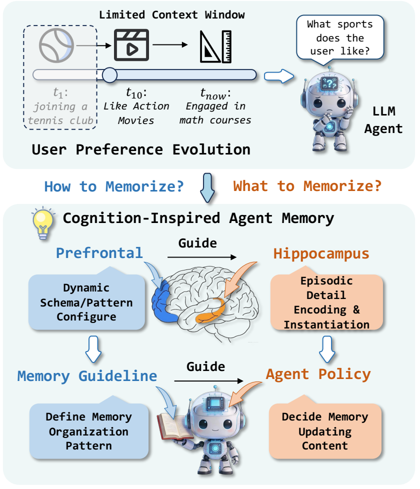

Introduction 的作用是把摘要中的方法动机展开成一条完整论证链：为什么需要长期记忆、为什么现有记忆更新机制不够、为什么要用“schema + episodic update”的两阶段设计。

第一步，作者说明长期用户记忆是个性化 agent 的基础。LLM agent 已经被用于个人助手、客服、教育等场景，这些场景中的个性化交互依赖 agent 持续整合用户偏好、习惯和行为变化。但上下文窗口有限，无法保留完整历史；单纯存储并检索过去对话片段，也很难捕捉偏好随时间变化的模式。因此，外部 memory bank 的必要性来自两个约束：历史太长放不进上下文，动态偏好又不能只靠局部检索片段解决。

第二步，作者区分了两类已有记忆系统，并指出它们各自的瓶颈。

- 静态 pipeline 类方法会把原始对话转换成外部记忆库，但通常依赖预定义抽取、更新、合并规则。这类方法工程上可控，但规则是固定的，难以通过反馈学习，也难以适配不同用户的表达方式和偏好变化。
- RL-based memory agent 把记忆操作作为可学习动作，理论上更灵活；但记忆更新通常是自由文本编辑，动作空间非常大。如果训练时只有最终答案对错这类稀疏且延迟的 reward，模型很难知道哪一次写入、删除或改写导致了最终成功/失败，所以长程探索和优化都会不稳定。

第三步，作者引入认知心理学中的 memory schema theory，作为方法设计的类比来源。prefrontal regions 被解释为负责选择和配置 schema：它决定当前情境下应该关注什么、用什么结构组织信息。hippocampus regions 被解释为在 schema 框架下编码具体 episodic details。这个类比的真正作用不是证明模型像大脑，而是给方法提供一个设计原则：先保持稳定的组织先验，再在这个先验里灵活写入具体内容。

对应到 MemCoE，Introduction 把方法拆成两层：

- Memory Guideline 相当于 schema，负责“如何控制记忆”：什么信息值得写、如何合并冲突、如何保留稳定偏好、如何处理过时或噪声信息。
- Agent Memory 相当于 episodic encoding，负责“具体存什么”：在每轮对话之后，把当前用户行为和偏好变化落实到 memory bank 里。

这就引出全文的研究问题：能否构建一个 schema-based agent memory system，让记忆组织机制和更新机制都能像长期交互一样演化？

作者给出的答案是 MemCoE。第一阶段 MGI 模拟 prefrontal 侧的 schema 学习：把 instruction prompt 视为全局自然语言参数，利用 memory-augmented trajectories 中正确与错误轨迹的对比反馈形成 textual gradients，再在 batch 级聚合，得到跨样本、跨域更稳定的 guideline。第二阶段 GMPO 模拟 hippocampus 侧的具体情节编码：固定 guideline，用 guideline-aligned reward 约束模型按规则更新记忆，并用多轮 RL 学习具体应写入哪些内容。

Introduction 里最关键的一句话逻辑是：第一阶段的 guideline 不是简单 prompt，而是在为第二阶段收缩动作空间。没有 guideline 时，RL 要在自由文本记忆编辑空间里盲目探索；有了 guideline 后，RL 的目标变成在一组稳定记忆操作规则下选择合适内容，训练信号更密、更可控。

最后，Introduction 预告了实验验证路径：作者会在 PersonaMem、PrefEval、PersonaBench 上比较静态 memory template、检索式 memory、RL memory agent 等 baseline，并从长上下文、噪声、显式/隐式偏好、跨 LLM transfer、效率和扩展性几个角度证明方法有效。后续精读实验时，需要重点核查三个问题：MGI 是否真的提升 transferability，GMPO 是否真的提升长程偏好保持，效率优势是否来自方法本身而不是实现细节。

### 2 Related Work

Related Work 分成三条线：Memory for LLM Agents、RL for Memory、Prompt Optimization。它的功能不是简单列举前人工作，而是把 MemCoE 的贡献卡在三条线的交叉点上：它不重新发明 memory backend，而是解决 memory evolution；它不是第一个用 RL 做记忆，但补了过程级奖励；它也不是普通 prompt optimization，而是把 prompt 优化成长期记忆更新 guideline，并接到后续 RL 训练里。

第一条线是 Memory for LLM Agents。作者把已有 agent memory 方法概括为外部 memory bank 加若干基础操作：segmentation、summarization、compression、forgetting/updating。也就是说，大多数方法都会先把长历史切分、摘要或压缩，再存入可检索的记忆结构。为了提升检索质量，还有树结构、图结构等 memory index；面向个性化的工作则强调用户 profile、preference、历史行为；面向 agent 经验复用的工作则保存成功/失败轨迹，用于未来决策。

这一段的关键批评是：这些方法虽然表现强，但很多更新逻辑依赖 hand-crafted heuristics。手工规则在用户行为稳定、任务分布固定时可用；但当用户偏好非平稳变化、表达方式多样、历史里混入噪声或冲突信息时，固定规则容易脆。作者强调 MemCoE 和具体存储结构是 orthogonal 的，意思是它不是替代 tree/graph/vector memory，而是作为 memory evolution 机制插到这些 backend 上，学习如何更新已有记忆。

第二条线是 RL for Memory。这里讨论的是把记忆操作看成 sequential decision problem：模型在多轮交互中决定保留、覆盖、检索、生成或压缩哪些信息。相关方法包括 RMM、MemAgent、MEM1、MemGen 等，它们共同点是试图用学习而不是规则来控制记忆。

作者对这条线的主要批评是 reward 太稀疏。很多方法用最终任务成功、最终回答是否正确作为训练信号，但记忆更新是长程过程：中间某一步写错、没写、过度遗忘、冲突合并失败，都可能到最终回答时才暴露。只有最终 reward 时，模型很难把错误归因到具体 memory update。MemCoE 的回应是 guideline-aligned rewards：不仅看最终答案，还看每一步记忆更新是否遵循结构化 guideline，从而提供更密集的过程信号。

第三条线是 Prompt Optimization。作者把 prompt 看成可优化的自然语言参数，而不是固定手写指令。典型流程是评估当前 prompt、生成自然语言反馈或 textual gradients、再据此改写 prompt；相关代表包括 TextGrad、OPRO、Reflexion 等。

MGI 和这条线的关系最直接：它也用 textual gradients 优化 prompt。但作者强调 MGI 的对象不是普通单轮任务 prompt，而是一个全局 memory-evolution guideline。这个 guideline 要在长历史、多轮 memory-augmented trajectory 上工作，所以它需要诊断“为什么某条记忆轨迹有效、另一条失败”，并通过 batch aggregation 抽象出更通用的记忆更新原则。

这一节里最重要的定位可以概括为三句话：

- 相比普通 LLM agent memory，MemCoE 的新意在于学习 memory evolution 规则，而不是只设计一个新的 memory storage/index。
- 相比 RL memory agent，MemCoE 的新意在于用 guideline 提供 process-level reward，减少只靠最终答案 reward 带来的信用分配困难。
- 相比 prompt optimization，MemCoE 的新意在于优化的是长期记忆更新 guideline，并且这个 guideline 会进入第二阶段 RL，成为策略训练的结构约束和奖励来源。

读这一节时也要注意一个潜在风险：作者说 MemCoE 与 memory backend “正交且兼容”，但实验是否真的覆盖多种 backend，需要到后续实验设置里核查。如果只在固定 memory representation 上验证，那么“广泛兼容”更多是方法设计上的主张，而不是充分实证结论。

### 3 Preliminary

Preliminary 的作用是把长期个性化记忆问题形式化，为后面的 MGI 和 GMPO 提供统一符号。它不引入复杂算法，而是定义“对话历史如何进入记忆库、记忆库如何演化、agent 如何用记忆回答问题”。

论文考虑的是一个用户和 assistant agent 随时间交互的场景。第 $t$ 个对话片段记为 $h_t$，截至当前的累计对话历史记为：

$$
\mathcal{H} = \{h_1, h_2, \ldots, h_t\}
$$

这里的 $\mathcal{H}$ 可以理解为长期交互历史，而不是一次对话里的短上下文。论文关心的问题是：这些历史中哪些用户偏好、习惯、状态变化应该被抽出来，并在后续交互中持续发挥作用。

为了承载长期个性化信息，系统维护一个用户记忆库 $\mathcal{M}_t$。它是一个文本形式的 memory bank，并且会随着新对话不断变化。这个设定很重要：$\mathcal{M}_t$ 不是固定 profile，而是时刻 $t$ 的用户状态表示；当用户出现新的偏好、修正旧偏好，或者历史信息变得过时时，记忆库都应相应更新。

作者进一步把 memory-update prompt 记为 $\mathcal{S}$。这不是普通的输入提示词，而是控制记忆如何更新的规则或 guideline。也就是说，$\mathcal{S}$ 规定系统在面对新片段 $h_t$ 时，应该怎样抽取新信息、怎样修改已有记忆、怎样处理冲突或过时信息。后文的 MGI 正是要把这个 $\mathcal{S}$ 从手写规则变成可学习的自然语言参数。

整体记忆演化过程被写成：

$$
\mathcal{M}_{t+1} = \mathcal{T}(\mathcal{M}_t, h_t; \mathcal{S}, \phi)
$$

这个公式可以逐项理解：

- $\mathcal{M}_t$：当前已有的用户记忆库。
- $h_t$：当前新进入的一段对话或交互证据。
- $\mathcal{S}$：控制如何更新记忆的 guideline。
- $\phi$：LLM 的参数，也就是执行更新和生成行为的模型能力。
- $\mathcal{T}$：记忆演化算子，负责把当前记忆和新对话合成为下一时刻记忆 $\mathcal{M}_{t+1}$。

这里的 $\mathcal{T}$ 是后文方法的核心抽象。它不只是在 memory bank 后面追加新句子，而是包括三类操作：incorporating new information、refining existing entries、removing outdated or inconsistent content。对应到实际记忆系统，就是写入、改写/合并、遗忘/删除。

有了记忆库之后，agent 面对某个任务或查询输入 $x$ 时，会基于当前记忆状态生成个性化回答：

$$
y_t = \mathcal{A}(x, \mathcal{M}_t)
$$

其中，$\mathcal{A}$ 是回答 agent，$y_t$ 是输出。这个公式说明 $\mathcal{M}_t$ 的角色是辅助上下文：它调节 agent 如何理解用户、如何选择符合用户偏好的回答。也因此，记忆库质量会直接影响下游个性化回答质量。

Preliminary 最后把全文挑战压缩成一句话：关键不只是“有没有记忆”，而是能否设计一个 principled mechanism $\mathcal{T}$，让 $\mathcal{M}_t$ 能随 $\mathcal{H}$ 一致、稳定、准确地演化。后面的两阶段方法正是在回答这个问题：MGI 学 $\mathcal{S}$，也就是如何更新；GMPO 学在 guideline 约束下具体如何执行 $\mathcal{T}$，也就是更新什么内容。

### 4 Methodology

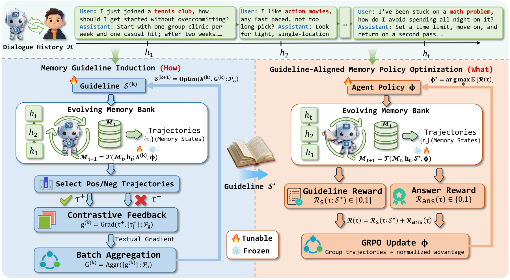

Methodology 是全文的核心方法章节。它承接 Preliminary 中的记忆演化算子 $\mathcal{T}$，回答一个具体问题：不要手工规定 $\mathcal{T}$ 里面的更新规则，而是怎样让系统自己学会“如何更新记忆”和“具体更新什么内容”。

MemCoE 的总思路是两阶段优化。第一阶段 Memory Guideline Induction (MGI) 负责学习 $\mathcal{S}$，也就是记忆更新 guideline；第二阶段 Guideline-Aligned Memory Policy Optimization (GMPO) 在固定 guideline 的前提下优化模型参数 $\phi$，让模型学会在多轮交互中执行合适的记忆更新。对应论文标题里的说法，MGI 学的是 how to memorize，GMPO 学的是 what to memorize。

#### 4.1 Memory Guideline Induction

MGI 的出发点是：现有 memory-evolution 方法常靠人工 prompt 或模板规定“看到新对话后如何修改记忆”。这种规则在简单场景里可行，但面对不同领域、不同用户表达方式、不同标注习惯时容易脆。作者因此把 memory-update prompt $\mathcal{S}$ 看成一个可优化的全局自然语言参数，而不是固定手写指令。

MGI 的目标是学到一个优化后的 guideline $\mathcal{S}^{\star}$。它应该能告诉 agent 如何进行记忆演化，例如什么信息要写入、什么信息要合并、什么信息要遗忘、如何处理冲突。这里的关键是，$\mathcal{S}^{\star}$ 不是针对单个样本的临时反馈，而是跨样本抽象出来的稳定记忆规则。

**Contrastive feedback as textual gradient**

在第 $k$ 次优化时，系统先使用当前 guideline $\mathcal{S}^{(k)}$，对训练样本中的历史 $\mathcal{H}$ 做记忆演化，然后让 agent 基于演化后的记忆回答查询 $x$。由于模型可以多次 forward，系统会得到一组候选轨迹 $\{\tau_i\}$。每条轨迹 $\tau_i$ 包含查询 $x$、中间记忆状态和候选回答 $y_i$。根据任务监督或环境反馈，作者选出至少一条正确轨迹 $\tau^+$，并把其他部分合理但结果不够好的轨迹作为负样本 $\{\tau_j^-\}$。

接下来，系统用一个反馈指令 $\mathcal{P}_g$ 比较正轨迹和负轨迹，要求模型指出：正确轨迹为什么好，负轨迹典型错在哪里，当前 guideline 应该如何改。这个自然语言反馈被称为 textual gradient：

$$
g^{(k)} = \mathrm{Grad}(\tau^+, \{\tau_j^-\}; \mathcal{P}_g)
$$

这里的 “gradient” 不是数值梯度，而是自然语言形式的修改方向。它的作用类似梯度：指出当前 $\mathcal{S}^{(k)}$ 应该往哪个方向改，才能更容易产生正确记忆轨迹。

**Batch-level gradient aggregation**

单个样本的 textual gradient 可能只反映局部问题。为了得到更稳定、可迁移的 guideline，作者把一个 mini-batch 中多个样本的 textual gradients 聚合起来：

$$
G^{(k)} = \mathrm{Aggr}(\{g^{(k)}\}_{(\mathcal{H}, x)}; \mathcal{P}_a)
$$

$G^{(k)}$ 是 batch-level 的抽象修改方向。$\mathrm{Aggr}(\cdot)$ 的作用是从多个样本反馈里总结共同失败模式，例如“模型经常覆盖掉仍然有效的旧偏好”“模型把一次性行为误当成长期偏好”“模型没有显式处理冲突信息”。这些共性问题再被转化为 guideline 级别的改写建议。

**Guideline optimization objective**

有了聚合后的 textual gradient $G^{(k)}$，系统用优化指令 $\mathcal{P}_o$ 对当前 guideline 做自然语言编辑：

$$
\mathcal{S}^{(k+1)} = \mathrm{Optim}(\mathcal{S}^{(k)}, G^{(k)}; \mathcal{P}_o)
$$

从优化角度看，MGI 近似在寻找一个能最大化期望奖励的 guideline：

$$
\mathcal{S}^{\star}
= \arg\max_{\mathcal{S}}
\mathbb{E}_{(\mathcal{H}, x)}
\left[
\mathcal{R}(\tau^+, \{\tau_j^-\}; \mathcal{S})
\right]
$$

论文这里的 $\mathcal{R}(\cdot)$ 在实现中主要表示输出是否正确。这个目标的意义不是说真的对自然语言 prompt 做可微优化，而是把 prompt refinement 理解成一种基于对比反馈的迭代优化过程。

MGI 的核心作用可以概括为：先学一个稳定的 schema，让后续策略不再面对完全开放的自由文本记忆编辑空间。没有 MGI 时，模型要自己探索“该怎么写记忆”；有 MGI 后，模型在一组更明确的操作规则内学习“该写什么内容”。

#### 4.2 Guideline-Aligned Memory Policy Optimization

GMPO 是第二阶段，目标从“学 guideline”转为“在 guideline 约束下学记忆演化策略”。此时 $\mathcal{S}^{\star}$ 被固定，模型参数 $\phi$ 负责执行记忆更新和最终回答。论文把演化算子 $\mathcal{T}$ 和回答 agent $\mathcal{A}$ 看成统一的 memory-augmented policy。

在训练样本 $(\mathcal{H}, x)$ 上，系统按照 $\mathcal{S}^{\star}$ rollout 一条多轮轨迹 $\tau$。轨迹中反复交替发生两件事：

$$
\mathcal{M}_{t+1} = \mathcal{T}(\mathcal{M}_t, h_t; \mathcal{S}^{\star}, \phi)
$$

以及回答生成 $y_t = \mathcal{A}(x, \mathcal{M}_t)$。也就是说，每个新对话片段都会推动记忆库演化，而当前记忆库又会影响 agent 对查询的回答。最终训练信号既来自记忆更新过程，也来自最终答案质量。

**Guideline-aligned rewards**

GMPO 的关键设计是奖励不只看最终答案。作者定义了两类奖励：

- Guideline-aware reward $\mathcal{R}_{S}(\tau; \mathcal{S}^{\star}) \in [0,1]$：检查每个 memory-update segment 是否遵循 guideline 要求的格式、字段、标签和结构。它提供密集的过程级监督，鼓励模型输出结构化、可控的记忆编辑，而不是任意自由文本。
- Answer reward $\mathcal{R}_{\text{ans}}(\tau) \in \{0,1\}$：检查最终回答是否正确，用来保证记忆策略最终服务于下游任务表现。

总奖励是两者加权：

$$
\mathcal{R}(\tau)
= (1-\lambda)\mathcal{R}_{S}(\tau; \mathcal{S}^{\star})
+ \lambda \mathcal{R}_{\text{ans}}(\tau)
$$

$\lambda$ 控制两种目标的平衡。如果 $\lambda$ 太大，训练更偏最终答案，可能又退化成稀疏奖励；如果 $\lambda$ 太小，模型可能只学会格式正确的记忆更新，但不一定提升最终个性化回答。因此这个权重体现了“遵循 guideline”和“回答正确”之间的折中。

**Policy optimization**

作者使用 GRPO 优化 $\phi$。在每个训练样本上，GRPO 会采样一组轨迹，基于组内相对奖励计算 advantage，再用 clipped policy-gradient 更新模型。论文把最终目标写成：

$$
\phi^\star
=
\arg\max_{\phi}
\mathbb{E}_{(\mathcal{H}, x)\sim\mathcal{D},\;
\tau \sim \pi_\phi(\cdot \mid \mathcal{H}, x; \mathcal{S}^{\star})}
\left[
\mathcal{R}(\tau)
\right]
$$

这个目标表示：在数据分布 $\mathcal{D}$ 上，学习一个策略 $\pi_\phi$，使其在给定历史 $\mathcal{H}$、查询 $x$ 和固定 guideline $\mathcal{S}^{\star}$ 时，能产生高奖励的记忆演化轨迹。

Methodology 的关键贡献不在于某一个公式本身，而在于把两个原本容易混在一起的问题拆开：MGI 负责学稳定的记忆组织原则，GMPO 负责学具体内容选择和更新执行。这样做降低了 RL 的探索难度，也让训练信号从纯最终答案 reward 变成“过程结构 + 最终表现”的组合。

### 5 Experiments

实验章要回答三个层次的问题。第一，MemCoE 是否真的比 long context、RAG、手工 memory bank 和 RL memory agent 更强。第二，提升是否来自 MGI 和 GMPO 两个设计，而不是某个偶然组件或更强 backbone。第三，这个 memory evolution 机制在效率、跨模型迁移、检索设置、演化频率和 guideline 质量上是否稳定。

#### 5.1 Experimental Settings

这一节交代数据集、baseline 和实现细节。论文使用三个个性化记忆 benchmark：

- PersonaMem：评估长多轮历史中的 preference evolution，主文报告 32K 和 128K 两种上下文规模，指标是 accuracy。
- PrefEval：评估显式/隐式偏好，多选题形式；Explicit 和 Implicit 各 1,000 个问题，并插入 50 个 turns，指标也是 accuracy。
- PersonaBench：评估异质、带噪用户语料中的个性化检索与问答，主文按 noise level 报告 w/o Noise、0.3、0.5、0.7，指标是 F1。

Baseline 分成四类。LongContext 直接把尽可能多的原始历史塞进上下文；RAG 把历史片段建向量库并取 top-$K$；Mem0、A-Mem、LightMem 代表外部 memory bank 系统；MemAgent 和 MEM-$\alpha$ 代表 RL-based memory agents，显式学习 memory evolution actions。这样的 baseline 设置比较完整，因为它覆盖了“全上下文”“检索增强”“手工外部记忆”“强化学习记忆代理”四条常见路线。

实现上，作者主要使用 Qwen2.5-7B-Instruct 作为 backbone，MEM-$\alpha$ 使用 Qwen3-4B。检索器用 all-MiniLM-L6-v2，默认 top-10。训练数据从 PersonaMem 采样 300 条；训练时为了降低成本使用 retrieved dialogues 作为上下文，推理时则输入完整 dialogue history。每一轮 memory evolving 输入一个 4K-token chunk。这个设置和前面“memory 演化频率”的问题直接相关：实验中的一次演化不是一次 user turn，而是一个固定 token budget 的对话块。

#### 5.2 Overall Evaluation

主结果表比较了 8 个 evaluation settings。最核心的总体分数如下：

| Method | Overall |
|---|---:|
| Long Context | 26.90 |
| RAG | 36.68 |
| Mem0 | 38.23 |
| A-Mem | 42.64 |
| LightMem | 41.21 |
| MemAgent | 45.00 |
| Mem-$\alpha$ | 44.19 |
| MemCoE | 52.02 |

MemCoE 在所有列上都是最优：PersonaMem 32K/128K 是 57.06/47.24；PrefEval Explicit/Implicit 是 81.30/69.90；PersonaBench 四个噪声设置是 32.27/29.89/25.99/25.09。这个结果的第一层含义是，直接 full history 并不是长期个性化的可靠解法。LongContext 在长历史和噪声下整体只有 26.90，说明把历史都交给 LLM 并不会自动得到稳定记忆。

第二层含义是，普通 RAG 也不够。RAG 的 overall 是 36.68，比 LongContext 高，但和外部 memory bank、RL memory agent、MemCoE 仍有明显差距。原因是 RAG 只负责找片段，不负责把分散、冲突、过时的用户信息整合成可持续更新的 profile。对于长期个性化，检索到证据只是第一步，还需要 memory evolution。

第三层含义是，MemCoE 相比手工 memory bank 和 RL memory agent 都更稳。Mem0、A-Mem、LightMem 的问题是更新规则大多依赖固定 heuristic；MemAgent 和 MEM-$\alpha$ 虽然会学习 memory actions，但主要依赖最终答案 reward，过程级监督不足。MemCoE 的优势来自两阶段组合：MGI 学到跨样本的 memory-update guideline，GMPO 再用 guideline-aware reward 学会具体更新什么。

从泛化角度看，表中 PersonaMem 是 in-domain，PrefEval 和 PersonaBench 是 out-of-domain。MemCoE 在 PrefEval 和 PersonaBench 仍保持领先，说明 MGI 学到的不是只适配 PersonaMem 的表层 prompt，而是相对可迁移的记忆组织原则。不过这里的泛化仍然是 benchmark 间泛化，不等同于真实线上用户环境泛化。

#### 5.3 Ablation Study

消融实验验证 MGI、GMPO、contrastive feedback 和 guideline reward 分别是否必要。表中缩写含义是：CF 指 MGI 中用于 textual-gradient induction 的 contrastive feedback；GR 指 GMPO 中用于约束 memory update schema 的 guideline reward。

| Setting | PersonaMem 32K | PersonaMem 128K | PrefEval Explicit | PrefEval Implicit |
|---|---:|---:|---:|---:|
| MemCoE | 57.06 | 47.24 | 81.30 | 69.90 |
| w/o CF | 56.44 | 46.33 | 78.30 | 68.10 |
| w/o GR | 56.24 | 46.06 | 79.50 | 68.30 |
| w/o MGI | 54.81 | 44.50 | 73.20 | 63.60 |
| w/o GMPO | 53.37 | 43.97 | 77.40 | 66.20 |
| w/o ALL | 48.47 | 39.09 | 71.70 | 60.60 |

两个细粒度组件的影响较小但稳定。去掉 CF 后，PrefEval Explicit 从 81.30 降到 78.30；去掉 GR 后，PersonaMem 32K 从 57.06 降到 56.24，PrefEval Explicit 从 81.30 降到 79.50。这说明对比式 textual feedback 和 guideline-aligned process reward 都有价值，但它们不是唯一来源。

更大的掉分来自去掉整个阶段。去掉 MGI 后，PrefEval Explicit/Implicit 从 81.30/69.90 降到 73.20/63.60，说明没有学到好的 memory-update guideline 时，模型在偏好保留和跨域场景上明显不稳。去掉 GMPO 后，PersonaMem 32K/128K 从 57.06/47.24 降到 53.37/43.97，说明仅有 guideline 还不够，模型还需要通过 policy optimization 学会在多轮历史里具体选择、写入和更新信息。

w/o ALL 接近普通手写/弱记忆更新流程，在 PersonaMem 32K 只有 48.47。这组结果支撑论文的核心论点：MemCoE 的增益不是单纯 prompt rewriting，也不是单纯 RL，而是“先学 how，再学 what”的组合。

#### 5.4 Efficiency Analysis

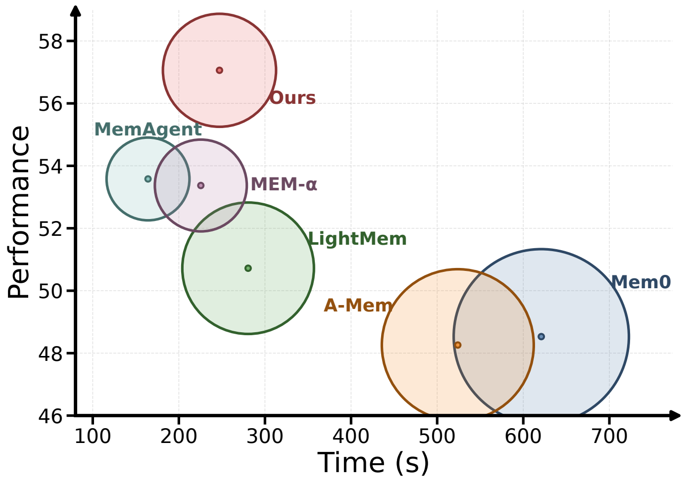

效率分析在 PersonaMem 上比较 memory construction/evolution 的性能和耗时，使用 20 条 32K dialogue histories。Figure 16 的结论是：MemCoE 位于比较好的 performance-time frontier 上，即性能最高，同时耗时仍处在较快方法范围内。

作者给出的解释是，MemCoE 把 extraction、update、forgetting 这些行为内化到模型的 memory evolution 过程中，而不是像 Mem0、A-Mem 那样多次调用 LLM 分别做抽取、合并、更新。因此它不是靠更多外部调用堆性能。相反，MemAgent 和 MEM-$\alpha$ 虽然运行快，但性能低，说明仅靠轻量 RL memory action 并不能稳定维护用户信息。

这一节对部署很重要：长期记忆系统如果每次更新都很慢，就很难在线使用。MemCoE 的主张是，它在记忆演化质量和构建时间之间取得更好的折中。

#### 5.5 Cross-LLM Transferability of Guidelines

这一节只考察 MGI 学到的 guideline 是否能跨 LLM 迁移，不包含第二阶段 RL。作者用一个 LLM 优化 guideline，再把同一 guideline 放到不同 backbone 上评估。

| Method | Qwen2.5-7B | gpt-4o-mini | gemini-2.5-flash | GPT-5 |
|---|---:|---:|---:|---:|
| RAG | 48.67 | 47.44 | 61.15 | 63.80 |
| A-Mem | 48.26 | 48.47 | 62.37 | 64.42 |
| Ours, optimized w/ Qwen2.5-7B | 53.37 | 52.56 | 64.62 | 66.67 |
| Ours, optimized w/ gpt-4o-mini | 52.56 | 54.19 | 64.83 | 67.28 |

结果显示，使用 Qwen2.5-7B 优化的 guideline 放到 gpt-4o-mini、Gemini、GPT-5 上仍然超过 RAG 和 A-Mem；使用 gpt-4o-mini 优化的 guideline 在三个更强 backbone 上表现最好。这个结果支持一个重要判断：MGI 学到的 guideline 不是完全绑定某个模型的 prompt trick，而更像一组模型无关的 memory-update principles。

但这里也要注意边界。表中说的是 optimized guideline 的 transferability，而不是完整 MemCoE 的跨模型 RL 策略迁移。第二阶段 GMPO 会更新模型参数 $\phi$，它的迁移成本和可移植性需要另看。

#### 5.6 Comparison on Different Retrieval

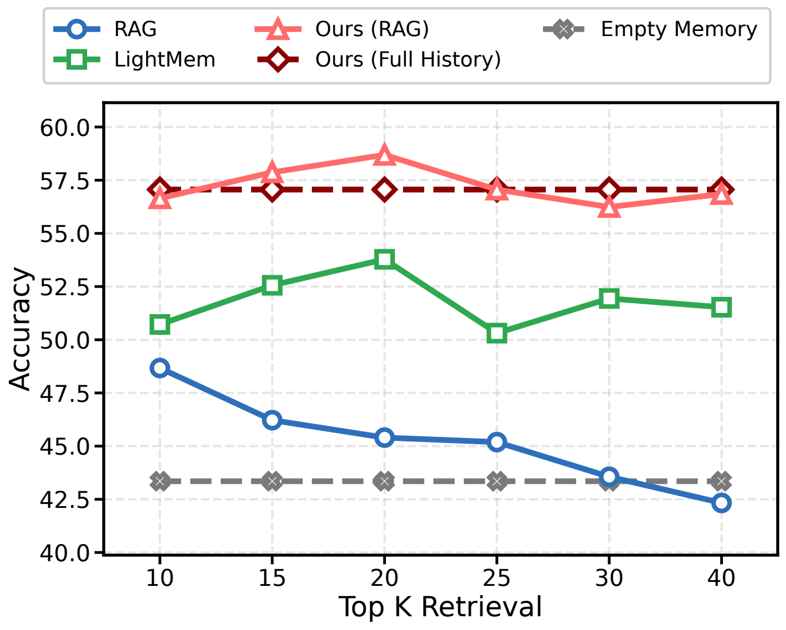

这一节研究 retrieval Top-$K$ 对不同方法的影响。作者比较了普通 RAG，以及 MemCoE 的两种推理模式：Ours (RAG) 先检索相关 context，再在检索内容上做 memory evolution；Ours (Full History) 则在完整历史上做 memory evolution。

Figure 17 的关键现象是，MemCoE 的两种模式在不同 Top-$K$ 下都强于 baseline。尤其 Ours (RAG) 在 $K \approx 20$ 左右达到峰值，甚至超过 full-history variant。这说明检索不是没用，关键在于检索结果是否被进一步组织成 coherent memory。如果只是 vanilla RAG，$K$ 增大后性能会下降，甚至低于 Empty Memory，因为更多检索片段会带入 distractors。

这一节对 MemCoE 的定位很关键：它不是反对 retrieval，而是反对把 retrieval 当成最终记忆。检索应该作为 evidence filtering，后面还需要 memory evolution 把证据转成稳定、去噪、可回答的用户记忆。

#### 5.7 Impact of Per-Round Token Budget on Memory Evolution

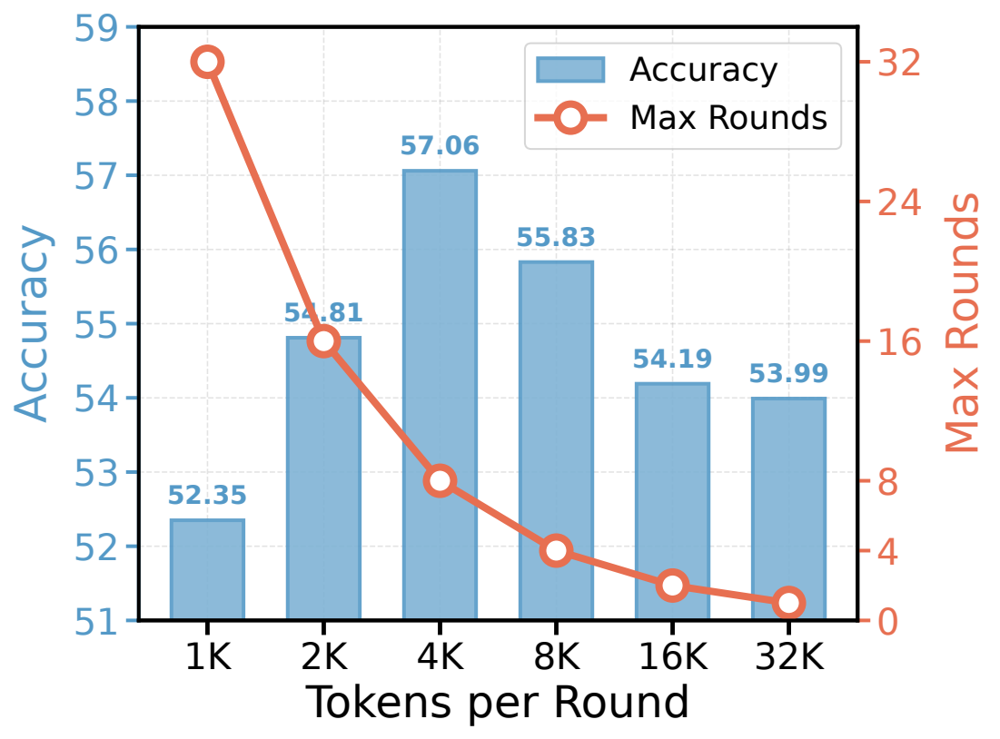

这一节直接回答 memory evolution 的频率问题。per-round token budget 决定每次演化处理多长的 dialogue chunk，也就决定长历史会被切成多少轮演化。

如果每轮 token budget 太小，例如 1K--2K，系统必须把同一段历史切成很多轮反复更新。这样做看似精细，但会带来累积错误和 uncontrolled forgetting：后面的 update 可能逐渐覆盖或稀释前面已经正确写入的偏好。相反，把 budget 增大到中等范围时，轮数减少，更新动态更稳定，性能上升。

但 budget 也不是越大越好。8K--32K 这种过大的 chunk 会让单次演化上下文过复杂，模型一次 pass 中要同时判断太多信息的相关性、冲突和长期价值，处理难度上升。因此实验结论是：有效 memory evolution 需要中等 per-round token budget，避免“过度频繁更新”和“单步上下文过载”两个极端。

这也说明 MemCoE 里的 $h_t$ 更像一个 dialogue snippet/chunk，而不是一条 user utterance。论文主实验采用的是每轮 4K-token chunk。

#### 5.8 Effect of Guideline Quality

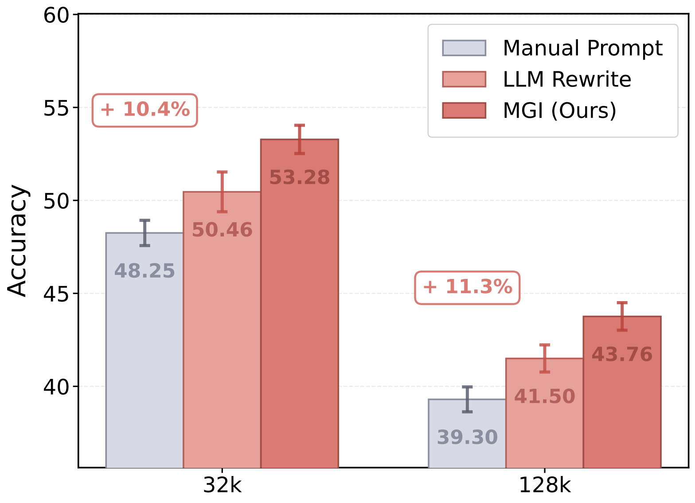

最后一节比较不同质量的 memory-update guideline。作者从人工 prompt 开始，再比较 LLM rewrite 和 MGI induced guideline。结果显示 guideline 质量越高，PersonaMem 32K 和 128K 上的表现越好。

MGI 诱导出的 guideline 最强：PersonaMem 32K 达到 53.28，128K 达到 43.76；相对 manual prompt 分别提升 +10.4% 和 +11.3%。三次随机种子的误差条显示结果比较稳定，不像是一次偶然采样。

这一节补强了 MGI 的必要性。普通 LLM rewrite 只能做表层语言润色，能带来一定提升，但不一定能系统性发现“哪些记忆该保留、哪些该删除、冲突如何处理、哪些一次性细节不要写入”。MGI 的优势在于它通过正确/错误轨迹对比和 batch aggregation，把这些失败模式总结成更稳定的更新规则。

实验章整体来看，主文证据链比较完整：overall table 证明性能领先，ablation 证明两个阶段都有贡献，efficiency 证明不是纯靠成本堆上去，cross-LLM 表明 guideline 有迁移性，retrieval 和 token-budget 实验说明 MemCoE 在实际部署中的两个关键旋钮，最后 guideline-quality 实验证明第一阶段学到的不是普通 prompt polish。

### 6 Conclusion

Conclusion 把全文重新收束到 memory schema theory 的类比上。作者把人类记忆中的 prefrontal regions 和 hippocampus regions 分别对应到两类能力：前者更像负责组织原则、schema 和控制策略，后者更像负责具体情节信息的编码与保留。MemCoE 的两阶段设计正是沿着这个类比展开：MGI 学“how to organize memory”，GMPO 学“what to store”。

这一章对方法贡献的总结很集中。MemCoE 首先诱导一个可迁移、schema-consistent 的 memory evolution guideline，用来规定长期记忆应该如何组织、合并、更新、遗忘；然后在这个 guideline 约束下优化 memory policy，让模型在多轮、多 session 交互中决定哪些信息应该保留、哪些旧信息应该更新、哪些内容应该忘记或降权。也就是说，作者最终强调的不是某个具体 memory backend，而是“显式 guideline + policy optimization”这一组合。

实验结论被概括为三类收益。第一，MemCoE 在 PersonaMem、PrefEval、PersonaBench 三个 personalization memory benchmark 上持续优于 retrieval-based memory bank 和 RL-based memory agent baselines。第二，它在更长历史和更噪声 evidence 下仍保持稳健，说明 memory evolution 机制比单纯 full-context 或 vanilla RAG 更适合长期个性化。第三，它在效率、鲁棒性和迁移性上都有实践价值：效率来自把 extraction/update/forgetting 内化到演化过程，鲁棒性来自 guideline 约束下的稳定更新，迁移性来自 MGI 学到的 guideline 可以跨 LLM 使用。

Conclusion 的核心判断可以压缩成一句话：长期用户记忆不应只靠“存更多历史”或“检索更多片段”，而应学习一套显式的记忆演化原则，并让模型在这个原则下学习具体更新策略。这也是标题里 “Learning How and What to Memorize” 的最终落点。

需要注意的是，结论本身主要重申贡献，真正的边界写在后面的 non-numbered limitations 中：第二阶段 GMPO 依赖 LLM-based scorer 来提供 guideline-aligned process reward，性能会受 scorer 可靠性影响；per-round token budget 和 evolution rounds 也需要调节，长历史被切成很多轮时，小错误可能累积成 unintended forgetting 或 over-generalized memory entries；此外，目前方法是在固定 guideline 下做单目标策略优化，还没有显式平衡 stability vs. plasticity、informativeness vs. brevity 这类多目标冲突。

## 关键公式 / 图表

### 关键图

### 关键表格

<!-- extracted-assets -->

### 已抽取 Figure 截图

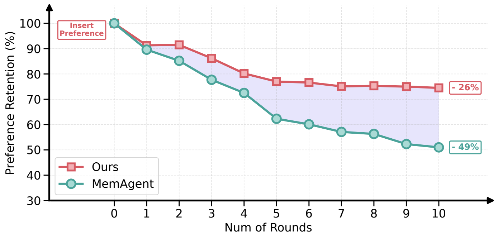

- Preference retention during multi-round memory evolution on PrefEval (Explicit). We insert a user preference at round 0 and then run memory evolution for subsequent rounds, where each round uses a 4K-token dialogue context. A strong judge model, `Gemini-2.5-Pro`, verifies whether the preference remains in the memory bank after each round.

- Source: arXiv source `img/preference_retention_gap.pdf`

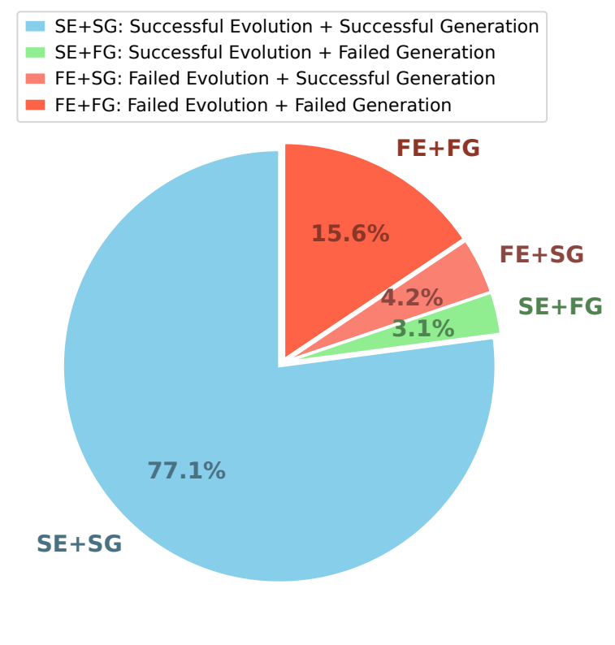

- Error analysis decomposing failures into the memory evolution stage and the response generation stage. It uses the same setup as the preference-retention figure above: successful evolution means the memory bank captures the user preference, and successful generation means the final answer is correct given the evolved memory.

- Source: arXiv source `img/pie-error-analysis.pdf`

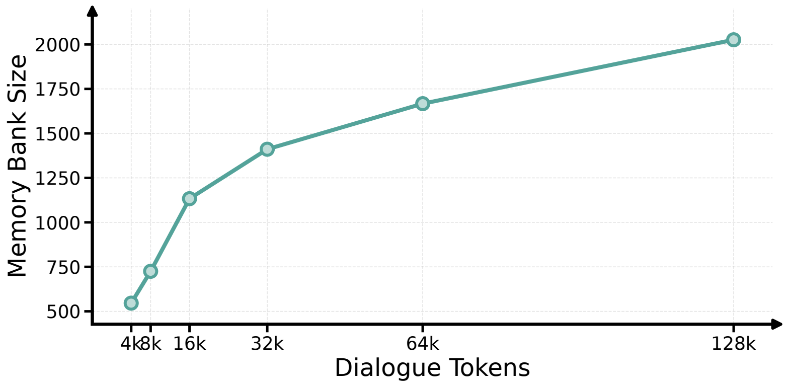

- Scaling analysis on PersonaMem (128K). We increase the total dialogue tokens (each evolution round processes 4K tokens) and report the resulting memory bank size (left) and memory evolving time (right).

- Source: arXiv source `img/memory_bank_size.pdf`

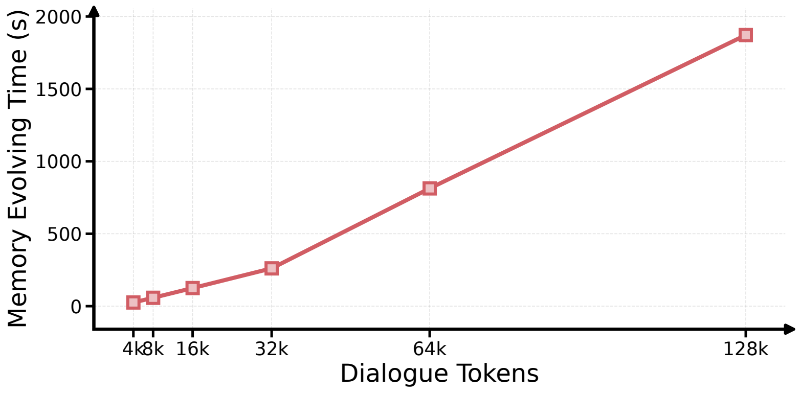

- Scaling analysis on PersonaMem (128K). We increase the total dialogue tokens (each evolution round processes 4K tokens) and report the resulting memory bank size (left) and memory evolving time (right).

- Source: arXiv source `img/memory_evolving_time.pdf`

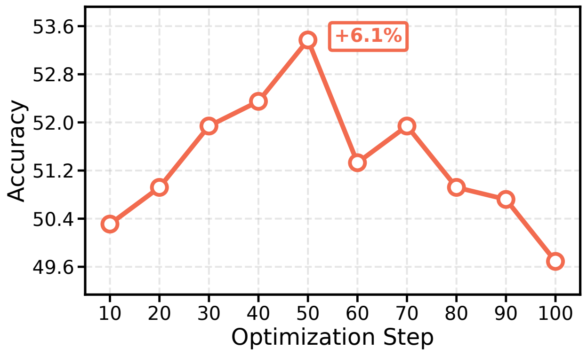

- PersonaMem (32K)

- Source: arXiv source `img/optim_step_personamem_32k.pdf`

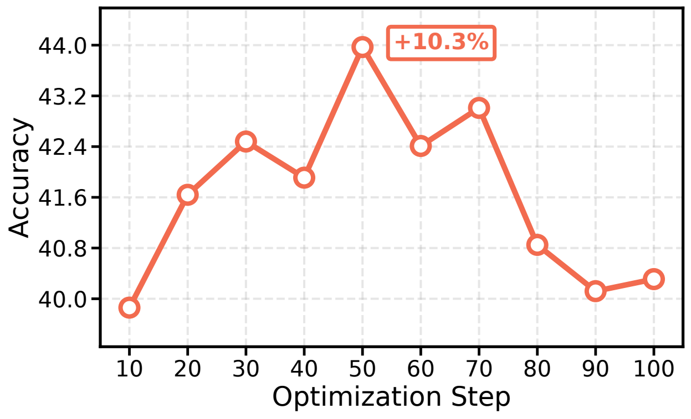

- PersonaMem (32K)

- Source: arXiv source `img/optim_step_personamem_128k.pdf`

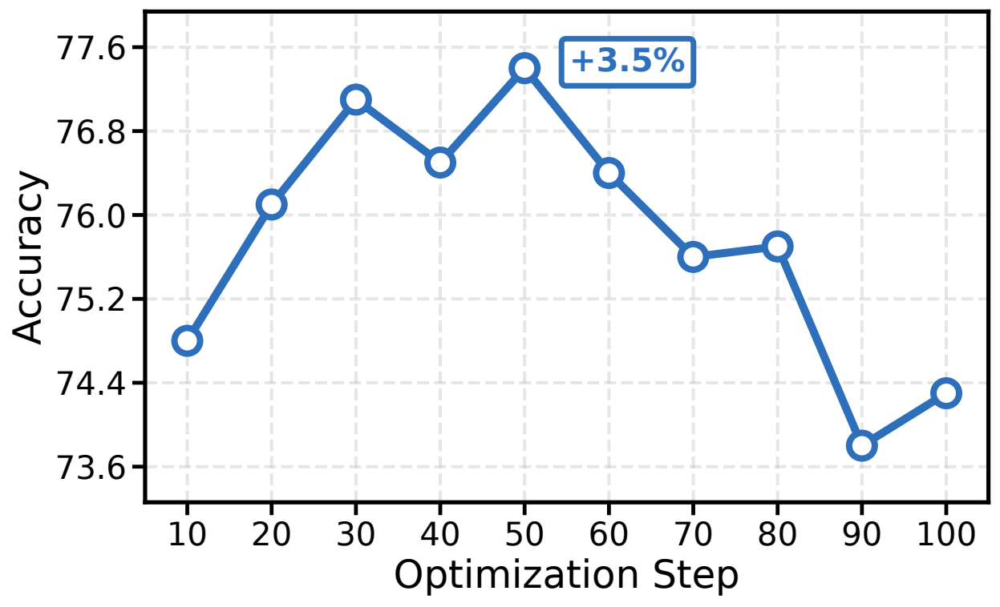

- PersonaMem (32K)

- Source: arXiv source `img/optim_step_prefeval_explicit.pdf`

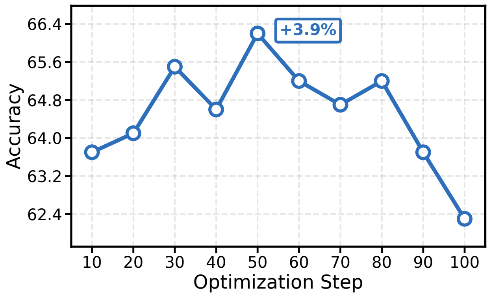

- PersonaMem (32K)

- Source: arXiv source `img/optim_step_prefeval_implicit.pdf`

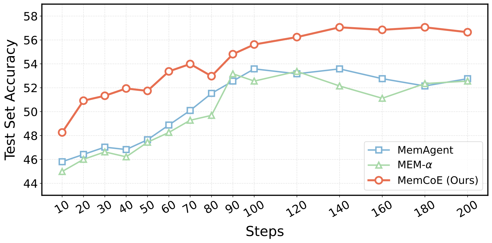

- Test set Accuracy of RL-based baselines across RL training steps.

- Source: arXiv source `img/training_curves.pdf`

- Efficiency analysis on PersonaMem. We report the performance--time balance of memory construction/evolution over 20 dialogue histories (32K), where circle size indicates the standard deviation of runtime.

- Source: arXiv source `img/efficiency_tradeoff.pdf`

- Retrieval Top-$K$ on PersonaMem (32K).

- Source: arXiv source `img/topk_curve.pdf`

- Effect of tokens per evolve round on PersonaMem (32K).

- Source: arXiv source `img/dual_yaxis_tokens_rounds.pdf`

- Impact of prompt quality on PersonaMem, averaged over three random runs with different seeds; error bars indicate standard deviation.

- Source: arXiv source `img/prompt_bar.pdf`

- Top: With a limited context window, the agent fails to capture preferences. Bottom: Inspired by the Prefrontal -> Hippocampus division, the paper decouples agent memory into Memory Guideline (for organizing) -> Agent Memory (for updating).

- Source: arXiv source `img/intro.pdf`

- Overview of our proposed \ourmodel. It performs two-stage optimization for evolving user memory: (1) {Memory Guideline Induction} (\moduleone) iteratively refines a natural-language guideline; (2) {Guideline-Aligned Memory Policy Optimization} (\moduletwo) fixes the induced guideline to define guideline-aligned rewards and applies multi-turn GRPO to learn what information to update in evolving memory bank.

- Source: arXiv source `img/method.pdf`

### 已抽取表格候选

暂无结构化表格候选。文字型表格或说明框在逐章阅读时转写为 Markdown list/table。

## 实验结论

## 局限性与可追问点

## 对我当前研究/项目的启发
