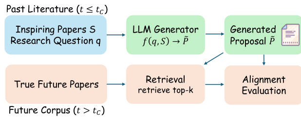
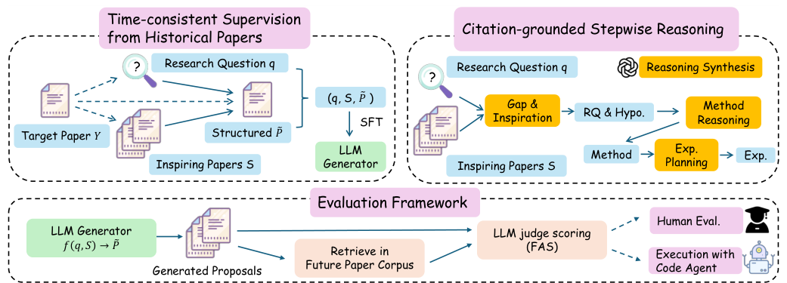
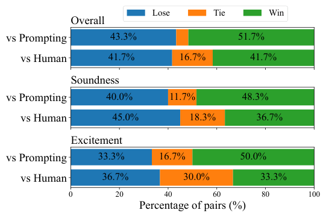
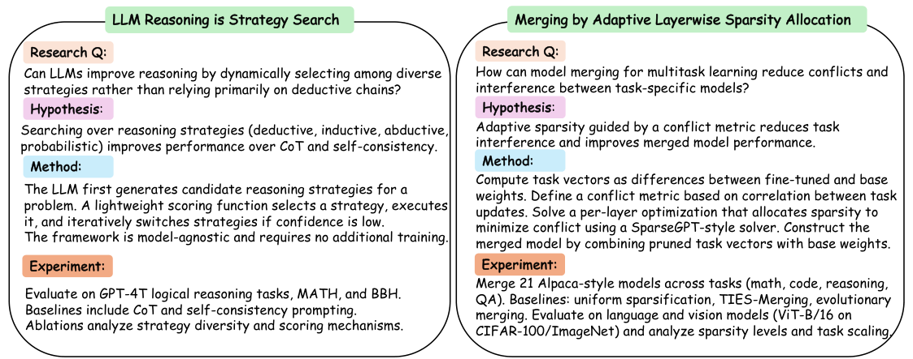

# Learning to Predict Future-Aligned Research Proposals with Language Models

> 阅读范围：本地 PDF 第 1–9 页正文，覆盖 §1–6、Limitations 与 Ethical Statement；为核实“可执行方案”的实际收益，额外读取附录 A/B 的实验表。所有插图直接裁自原文。论文的“未来对齐”是 proposal 质量的代理目标，不能等同创新性、正确性或科学价值。

## 核心问题与阅读主线

这篇论文尝试解决 proposal 生成的训练目标问题：一个研究方案没有唯一标准答案，“新颖”“有趣”“有用”又难以大规模自动标注。作者提出用时间切分后的未来文献作为可核验参照——给模型当时已有的问题和启发论文，观察它提出的研究路线是否与后来真实发表的研究相吻合。

方法有三个环节：从历史论文及其引用合成时间一致的监督样本；用带引用依据的分阶段推理训练 proposal 生成器；用 Future Alignment Score（FAS）衡量生成方案与未来文献的最大语义对齐。主要证据包括三种 backbone 的主表、推理监督消融、专家成对比较、引用移除实验，以及两个被代码 agent 实现的案例。阅读时应逐步检查：FAS 怎么定义、训练有没有真正直接优化它、分阶段推理带来多大额外收益、对齐收益能否转化为可执行价值。

## 1 Introduction：把主观质量问题改写为时间预测问题（p.1–2）

研究构想系统已经能做 gap discovery、结果预测，甚至生成论文和代码。但若训练只模仿流畅的 proposal 文本，模型容易学到完整且像样的表达，并不一定学到可追求的研究方向。人评虽然必要，却成本高、评审间差异大，也难为大规模训练提供稳定信号。

作者将问题改写为：在截止时刻 $t_C$ 之前能获取研究问题 $q$ 和启发论文集合 $S$，模型生成结构化方案 $\hat P$；随后检查该方案是否预见了 $t_C$ 之后的真实研究。这里的合理性是“后来确有研究者沿这条路线展开工作”，不是“未来论文证明这个方案一定正确”。这让它成为一个可扩展、但有发表偏差的质量代理。

**图 1（p.1）解读。** 上方是生成路径，历史论文和研究问题进入 LLM，输出 proposal；下方是评估路径，在未来语料中检索候选论文后做语义对齐。未来论文只能出现在评估侧。若把未来候选全文提前喂给生成器，就破坏了这个任务的时间非对称性。

论文不要求重建某一篇指定目标论文，而允许生成方案与任意一条后来出现的合理研究路线匹配。这也是 FAS 取候选中的最大值而不是只对原始目标论文评分的原因。相应地，它奖励“至少命中一个未来方向”，不会自动惩罚所有未被未来实现的附加主张。

## 2 Method：数据、训练与评估分别做什么（p.2–4）

### 2.1 Future-Aligned Proposal Prediction

设带时间戳的论文库为 $C$，论文 $p$ 的发表时间为 $t_p$。目标论文 $Y$ 晚于截止点，只有 $t_p\le t_C$ 的论文可以成为上下文；$t_p>t_C$ 的论文属于隐藏未来语料。输入与输出为：

$$
(q,S)\longrightarrow\hat P.
$$

输出 schema 包含 Research Question、Hypothesis、Proposed Method、Novelty Claims、Experimental Details。明确这些字段有两个作用：训练目标不会退化成松散 brainstorm；评估可以判断到底是问题假设、技术方法、新颖性论述还是实验计划更好地对齐未来。

### 2.2 Verifiable Learning Objective

未来语料及检索集合定义为：

$$
C_{\mathrm{future}}=\{p\in C:t_p>t_C\},
$$

$$
R_k(\hat P)=\operatorname{TopK}_{p\in C_{\mathrm{future}}}\cos\bigl(e(\hat P),e(p)\bigr),
$$

其中 $e$ 是 embedding 模型。检索只负责缩小候选范围；最终不是拿 embedding cosine 直接当 FAS，而是再让 LLM judge 评估方案与候选论文的语义对应：

$$
\operatorname{FAS}(\hat P)=\max_{p\in R_k(\hat P)}s_{\mathrm{LLM}}(\hat P,p).
$$

$s_{\mathrm{LLM}}$ 衡量的是方案内容与未来研究的语义对齐。最大值允许一个方案只需要对应一条实际出现的路线，而不必与整片未来文献平均相似。论文还分别对 hypothesis、method、novelty 和 experiments 计算 component-level FAS；主表的 Overall 是整体方案分数，不能自行当作四个分项的算术平均。

FAS 本身不可微，本文**没有通过 FAS 做在线强化学习或可微优化**。实际训练用历史论文合成的 supervised targets 作为可操作代理，通过 SFT 学习。这一差别决定了“future-aligned learning”在实现上是一种数据与监督设计，不是直接对未来检索器反向传播。

### 2.3 Time-Consistent Supervision from Historical Papers

作者从目标论文 $Y$ 构造三个对象：

$$
q=g_q(Y),\qquad S=g_S(Y,t_C),\qquad \tilde P=g_P(Y,S).
$$

$q$ 是由目标论文反推的研究问题，提示词要求抑制关键方法和答案细节，尽量保持成稿前可合理提出的问题表述。$S$ 从 $Y$ 的参考文献中挑选，先用轻量规则形成候选，再由 LLM 判断哪些是真正启发了研究的文献，而不是外围相关引用；同时按时间过滤。$\tilde P$ 则是由已发表成果重构的前瞻性研究计划。

这个过程提供大量训练样本，但它并不意味着获取到了研究者当年的真实构思记录。选择“哪篇论文是灵感来源”、反推 gap、改写成 proposal，都含有合成模型的解释。尤其 $q$ 仍由未来目标论文产生，即使压制显式方法泄漏，也可能保留后来才变得清晰的问题 framing；这是阅读时应关注的残余泄漏风险，不能仅凭时间过滤就宣布完全消除。

### 2.4 Citation-Grounded Reasoning Traces

作者认为只监督最终 proposal 会漏掉“从已有论文转向新方案”的关键能力。因此合成以引用为依据的 reasoning trace，要求解释文献缺口和可借用的灵感。完整方法 Stepwise CoT SFT 将推理与输出交错，分成三个阶段：先做 gap analysis 与 inspiration borrowing，形成研究问题和假设；再推导方法；最后规划实验。

它与两个消融的区别如下：

| 训练形式 | 输入相同 | 监督输出组织方式 | 用于检验 |
|---|---|---|---|
| Direct SFT / w/o reasoning traces | $q,S$ | 直接输出结构化 proposal | 显式推理是否有额外价值 |
| CoT SFT / w/o stepwise | $q,S$ | 一个完整推理块后接 proposal | 推理与各产物交错是否有价值 |
| Stepwise CoT SFT | $q,S$ | gap/假设、方法推理/方法、实验推理/计划逐阶段交错 | 完整方法 |

**图 2（p.4）解读。** 左上将已发表论文变成训练三元组，右上展示交错推理结构，下方将训练出的生成器送入未来语料检索、FAS、人评与执行案例。图中三条验证路径承担不同任务：FAS 测未来对应，人评测专家偏好，执行案例检查是否至少有方案能落地；不能用其中一种完全替代另外两种。

## 3 Experiments：监督是否改善方案质量（p.4–7）

### 3.1 Experimental Setup

语料来自 NeurIPS、ICML、ICLR，合计 17,771 篇目标与相关历史引用论文。2024 年论文构造训练监督，2025 年论文用于未来评估；随机抽取 2,823 个训练实例和 819 个测试实例。17,771 是论文语料规模，不是 SFT 实例数量。

Backbone 包括 Llama-3.1-8B-Instruct、Qwen2.5-7B-Instruct、Qwen2.5-14B-Instruct，采用 LoRA 监督微调，推理温度 .7。FAS 默认用 text-embedding-3-large 检索前 10 篇未来候选，由 GPT-4.1-mini 按 1–10 rubric 打分。主表按十倍数值展示，例如 Overall 69.7 对应 6.97/10；这些数值不是 69.7% 的预测准确率。

附录 B 在 300 个测试实例上改变检索深度、embedding 和 judge：默认 Ours/Untuned/CoI 为 6.94/6.46/6.07；$k=5$ 为 6.93/6.46/6.05；换较小 embedding 为 6.74/6.36/5.93；换 GPT-4o-mini judge 为 6.72/6.57/6.25。排序保持，但绝对值会改变，因此跨论文比较 FAS 必须统一整个评估管线。

### 3.2 Baselines

提示基线有三种输入：只给 Research Question、只给 Papers、同时给两者的标准 Prompting。另适配 AI-Researcher 的种子想法—扩展—排序流程和 Chain-of-Ideas 的论文演化链流程。它们原本面向更开放的 idea generation，本文的低 FAS 不能直接证明其所有科研能力更差。

训练基线正是上一节的 Direct SFT 和整体 CoT SFT。比较三种训练形式时，重点是区别“训练是否有用”和“分阶段推理是否额外有用”；若只和未训练模型比较，无法把收益归因到 stepwise 组织本身。

### 3.3 Main Results

**Table 1 的完整主结果（p.5）。** Hyp.=假设，Method=方法，Novelty=新颖性主张，Exp.=实验细节；均为原表显示尺度，越高越好。

| 模型 | 方法 | Hyp. | Method | Novelty | Exp. | Overall |
|---|---|---:|---:|---:|---:|---:|
| Llama-3.1-8B | RQ only | 63.0 | 52.8 | 51.1 | 52.4 | 60.0 |
| Llama-3.1-8B | Paper only | 55.2 | 49.4 | 46.9 | 48.0 | 52.4 |
| Llama-3.1-8B | Prompting | 64.5 | 56.8 | 54.4 | 55.0 | 62.1 |
| Llama-3.1-8B | AI-Researcher | 57.9 | 46.0 | 45.1 | 44.4 | 53.7 |
| Llama-3.1-8B | Chain-of-Ideas | 63.2 | 54.1 | 51.6 | 45.9 | 59.3 |
| Llama-3.1-8B | Stepwise CoT SFT | 68.1 | 61.0 | 58.7 | 51.9 | 65.3 |
| Llama-3.1-8B | w/o reasoning | 66.7 | 58.3 | 56.9 | 54.6 | 64.1 |
| Llama-3.1-8B | w/o stepwise | 67.2 | 59.2 | 57.6 | 55.1 | 65.0 |
| Qwen2.5-7B | RQ only | 66.7 | 56.6 | 55.2 | 52.0 | 63.3 |
| Qwen2.5-7B | Paper only | 56.4 | 50.5 | 46.6 | 47.2 | 52.9 |
| Qwen2.5-7B | Prompting | 66.3 | 57.8 | 55.1 | 54.8 | 63.6 |
| Qwen2.5-7B | AI-Researcher | 58.0 | 47.5 | 45.6 | 44.8 | 54.1 |
| Qwen2.5-7B | Chain-of-Ideas | 62.0 | 53.2 | 50.3 | 47.1 | 59.3 |
| Qwen2.5-7B | Stepwise CoT SFT | 68.7 | 60.5 | 59.1 | 54.9 | 66.5 |
| Qwen2.5-7B | w/o reasoning | 67.9 | 60.0 | 58.7 | 54.9 | 65.3 |
| Qwen2.5-7B | w/o stepwise | 68.3 | 60.2 | 59.2 | 54.8 | 65.9 |
| Qwen2.5-14B | RQ only | 65.8 | 56.4 | 54.4 | 53.6 | 62.6 |
| Qwen2.5-14B | Paper only | 54.3 | 49.3 | 45.6 | 46.6 | 51.3 |
| Qwen2.5-14B | Prompting | 65.8 | 57.1 | 55.1 | 55.6 | 63.0 |
| Qwen2.5-14B | AI-Researcher | 58.5 | 48.1 | 46.0 | 45.0 | 55.3 |
| Qwen2.5-14B | Chain-of-Ideas | 63.8 | 54.7 | 52.1 | 46.8 | 60.8 |
| Qwen2.5-14B | Stepwise CoT SFT | 71.4 | 63.5 | 61.8 | 56.7 | 69.7 |
| Qwen2.5-14B | w/o reasoning | 68.0 | 60.0 | 58.9 | 55.1 | 65.1 |
| Qwen2.5-14B | w/o stepwise | 68.7 | 60.0 | 58.2 | 56.8 | 66.1 |

完整方法在三个模型的 Overall 都最佳。相对相同 backbone 的 Prompting，增量为 3.2、2.9、6.7 分，约对应 5.2%、4.6%、10.6% 的**相对提升**。摘要的“+10.6%”不能写成增加 10.6 个百分点。

分阶段收益在 Qwen2.5-14B 最明显：69.7 高于无推理的 65.1 和整体 CoT 的 66.1。Llama 上则只比整体 CoT 高 .3 分，说明该设计并非对所有模型都有同等幅度的增益。去掉推理比保留整体推理更差；不能把原文“w/o stepwise leads to a further drop”误读成无 stepwise 比无 reasoning 还低。

分项收益主要集中于假设和方法设计，实验规划更不稳定。例如 Llama 完整方法的 Exp.=51.9，低于 Prompting 55.0；Qwen14B 完整方法 Exp.=56.7，也略低于整体 CoT 的 56.8。由此能说“总体 FAS 更好”，不能说所有方案组成部分一致改善。

输入消融也很关键：Qwen14B 的 RQ-only 为 62.6，接近完整输入 Prompting 的 63.0，而 Paper-only 只有 51.3。问题表述提供强约束；单纯堆论文不足以引导一个明确的研究方向。文献的帮助在学会如何借用它们后更充分，这由训练结果和后面的引用移除共同支持。

### 3.4 Human Evaluation

人评只评最佳 Qwen2.5-14B Stepwise CoT 模型，分别与 prompting 方案及由已发表论文重构的 human-derived 方案比较。共 120 对，每组 60 对，同一对使用同一个研究问题和输出 schema，三位有会议审稿经验的领域研究生评分，以多数票聚合。

**图 3（p.6）解读。** 对 Prompting，完整方法 Overall 胜/平/负为 51.7%/5.0%/43.3%，Soundness 为 48.3%/11.7%/40.0%，Excitement 为 50.0%/16.7%/33.3%。这支持“更常被偏好”，但优势并非压倒性。

与 human-derived 相比，Overall 是 25 胜、10 平、25 负，即 41.7%/16.7%/41.7%。Soundness 胜 36.7%、负 45.0%；Excitement 胜 33.3%、平 30.0%、负 36.7%。所以“与人类衍生方案整体可比”比“超越人类”更符合证据。而这里的人类组也是从论文重构的方案，不是作者当年原始 proposal。

模型对人类组的评审全票一致比例仅 5–12%，对 prompting 则为 26.7–31.7%，说明高质量方案之间的区分存在相当大的专家分歧。这个实验提供 FAS 与人感知质量相关的补充证据，不能把它解读为 FAS 已完全等价于人评。

### 3.5 Executable Proposal Case Studies

**图 4（p.7）解读。** 左侧是把推理视为策略搜索，动态探索多种推理方式；右侧是根据层级冲突分配稀疏率的模型合并。图中列的是生成的方案摘要及原计划，实际实现的模型、任务规模和结果应以附录 A 为准，不能把提案中计划评测的每个设置都当作已经执行。

**Strategy Search。** 候选模式包含演绎、归纳、溯因和枚举；分别采样推理轨迹，以同一策略内部答案一致性评分，再选策略和答案，必要时进一步协调。附录用 gpt-4o-mini，在 GSM8K、MATH、BBH 各 100 个样例上测试。它每题约 14 次 API 调用，而 self-consistency 为 5 次，Direct/CoT 为 1 次，计算预算不相同。

| 方法（附录 Table 5，p.14） | GSM8K | MATH | BBH |
|---|---:|---:|---:|
| Direct | 93.0 | 46.0 | 84.0 |
| CoT | 89.0 | 42.0 | 90.0 |
| Self-Consistency | 95.0 | 48.0 | 92.0 |
| Strategy Search | 95.0 | 50.0 | 88.0 |

MATH 从 48% 到 50%，是 **+2 个百分点、相对 +4.17%**，并不是绝对增加 4.17 个百分点。BBH 反而从 92% 降到 88%。这证明存在可执行且局部有用的案例，同时暴露策略多样化可能带来噪声以及额外预算的代价。

**MALS（Merging by Adaptive Layerwise Sparsity Allocation）。** 从微调参数与基座参数之差形成 task vector；通过任务间相关性与符号冲突估计每层冲突，并结合更新幅度估计重要性，在总稀疏预算下给高冲突层更多稀疏、重要层保留更多参数。实际语言实验以 Mistral-7B 为基座合并数学、通用推理、聊天三个模型，视觉实验用 ViT-B/16，目标稀疏率 50%。

附录 Table 4 显示 MALS 的 ARC-E=.755、ARC-C=.605，相对 Simple Average 的 .430/.290 明显改善；但 GSM8K=.525 低于平均合并 .530，也低于 TIES .545；视觉准确率 .493 低于 TIES 的 .530。符号选举变体会改变结论，例如 MALS w/ sign 的 GSM8K=.560，但 ARC-E 降为 .475。它不是全指标胜出；作者把这些视为可落地的初步案例，而不是大规模、等预算且跨领域验证的最终算法优势。

两项方案由 Cursor 与 Claude-4.5-Opus 辅助实现，并有少量人类协助。实现成功说明模型提出的文本可以转成实验，不足以单独证明整个科研流程已经完全自主。

## 4 Analysis：模型是否用了论文，方案内部是否连贯（p.7–8）

### 4.1 Citation Sensitivity by Citation Type

作者为 819 个测试实例中的 4,084 篇启发论文标注背景/基础、方法/技术、基准/实验三类用途。允许多标签，43.5% 跨多个类别；背景与方法占 72.1%、62.8%，benchmark 仅 9.2%。对某类 $t$，去掉相关引用再重新生成：

$$
\hat P^{(-t)}=f\bigl(q,S\setminus S^{(t)}\bigr).
$$

只在确实包含该类引用的实例上计算变化，结果如下：

| 移除类别（Table 2） | 样本数 | ΔHyp. | ΔMethod | ΔNovelty | ΔOverall |
|---|---:|---:|---:|---:|---:|
| Background | 775 | −6.75 | −7.21 | −8.31 | −6.59 |
| Method | 765 | −6.93 | −7.37 | −8.35 | −6.63 |
| Benchmark | 248 | −6.41 | −6.85 | −7.30 | −6.13 |

背景与技术引用移除后总体下降接近，说明问题 framing 和方法灵感都有用。Novelty Claims 最敏感，符合“新颖性必须相对已有工作表达”的理解。Benchmark 移除影响稍小，但三组评估实例不完全相同，且多标签移除可能删除同一篇论文；不能把这些差值当成三种独立、可直接相加的因果贡献。

### 4.2 Multi-Dimensional LLM-Based Judging

FAS 测未来对应，未直接检查资源可用性及任务—方法—实验是否相互一致。因此又用 1–5 的 LLM rubric 检查三个维度：

| 方法（Table 3，p.8） | Resource Validity | Task–Method | Task–Experiment | 平均 |
|---|---:|---:|---:|---:|
| Prompting | 3.26 | 3.20 | 2.99 | 3.15 |
| CoI | 3.52 | 3.20 | 3.12 | 3.28 |
| AI-Researcher | 3.30 | 3.13 | 3.03 | 3.16 |
| 完整 Future-aligned SFT | 3.63 | 3.42 | 3.21 | 3.42 |
| w/o reasoning traces | 3.54 | 3.41 | 3.16 | 3.37 |
| w/o stepwise | 3.39 | 3.30 | 3.07 | 3.25 |

完整方法三项最高，但实验一致性仍最低。另需避免照抄过强概括：原文声称所有 future-aligned 模型都高于基线，而表中 w/o stepwise 的平均 3.25 低于 CoI 的 3.28，Resource 3.39 也低于 CoI 3.52。本笔记按表内实际值解读为“完整方法最强，训练变体并非处处胜出”。

## 5 Related Work（p.8）

第一条脉络是 LLM 科研协助，从想法生成、文献综述、方案实施、评审到端到端研究工作流。本文选择一个较窄、可监督的问题：如何训练和比较 proposal generator，而不是宣称覆盖科研所有阶段。

第二条脉络是科学预测，包括预测神经科学结果、AI 实验结果、热门主题、future work，以及更广的科研流程预测。本文将预测对象放到方案的语义方向，并利用历史论文和引用构建训练信号。与预测一个数值结果相比，它允许未来方向有多种有效表达，但也因此更依赖检索和语义 judge 的质量。

## 6 Conclusion（p.8）

论文建立了 future-aligned proposal prediction：通过与隐藏未来文献的语义匹配评价方案，从历史论文及引用合成监督，再以带证据的阶段性推理进行 SFT。三种 backbone 的 Overall FAS 提升、专家比较、引用移除和可执行案例共同支持这种时间监督信号有训练价值。

最稳妥的结论是：它改善了特定机器学习语料、特定评价管线下的未来方向对齐，并提供方案质量和可执行性的补充证据。它并未证明与未来文献相似就是创新，也未证明案例中的新算法全面胜过已有方法。

## Limitations 与 Ethical Statement（p.9）

领域局限于三大机器学习会议，论文结构和迭代路径相对规范；更慢的学科、不同引用文化或实验成本高的领域未被验证。FAS 会偏向后来被发表的路线，可能惩罚有价值但未被实现、未被接受或超出语料覆盖的新构想。真实未来论文也不必然代表正确、可复现或社会上有益的方向。

数据合成依赖 LLM 选择引用、反推问题和生成推理，可能引入错误和事后合理化。人评规模有限、专家分歧存在，两个执行案例又经过选择且预算不等，不能据此估计所有生成方案的成功率。伦理部分还强调研究生成的潜在双用途，以及部署时需要领域判断和人工检查。

## 对当前研究的启发（阅读者分析）

FAS 适合成为 proposal 系统的一个外部、可回测的评估维度，与新颖性、可行性、预算、风险和证据支持并列。对训练数据，更可借鉴的是“灵感来源—gap—方法决定—实验检验”的显式对应；只储存最终 proposal 会丢失最有价值的推理监督。

若复用该范式，应把目标论文反推的研究问题与真实历史问题区分，报告截断依据、模型训练知识边界、候选未来语料覆盖以及检索/judge 版本。对执行案例则应同时报告绝对和相对提升、完整任务结果及 API 预算，防止把一个小样本上的 +2 个百分点扩大成普遍科研能力提升。
