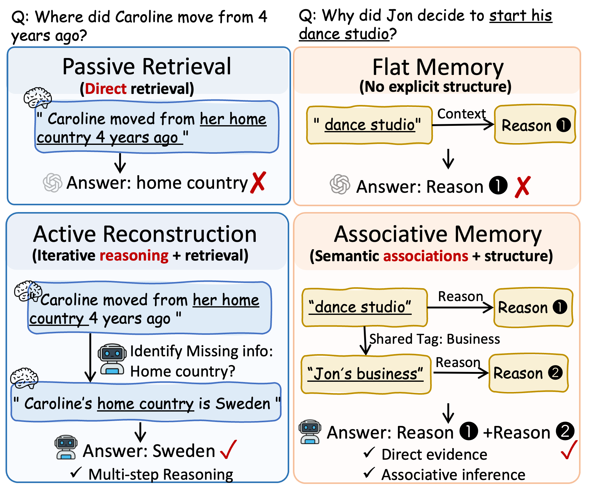
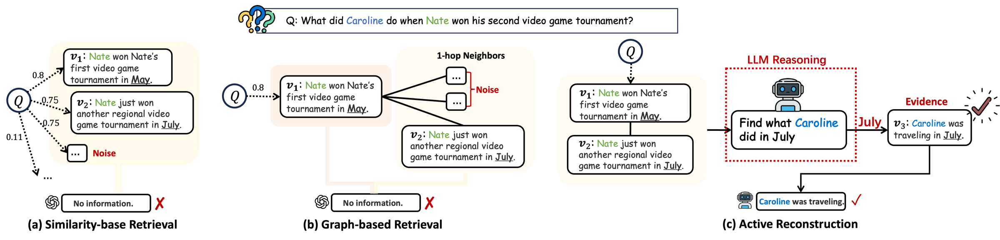
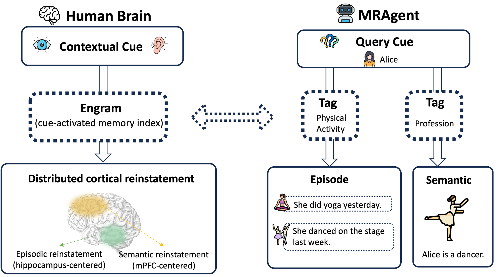
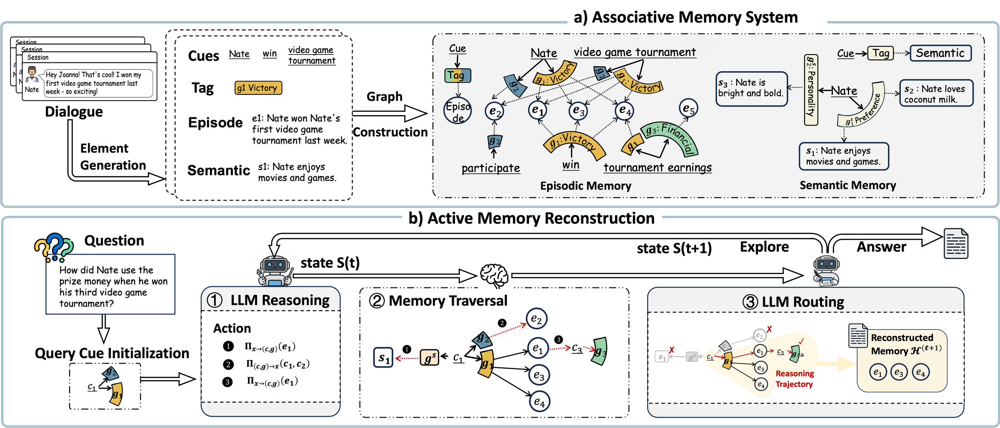
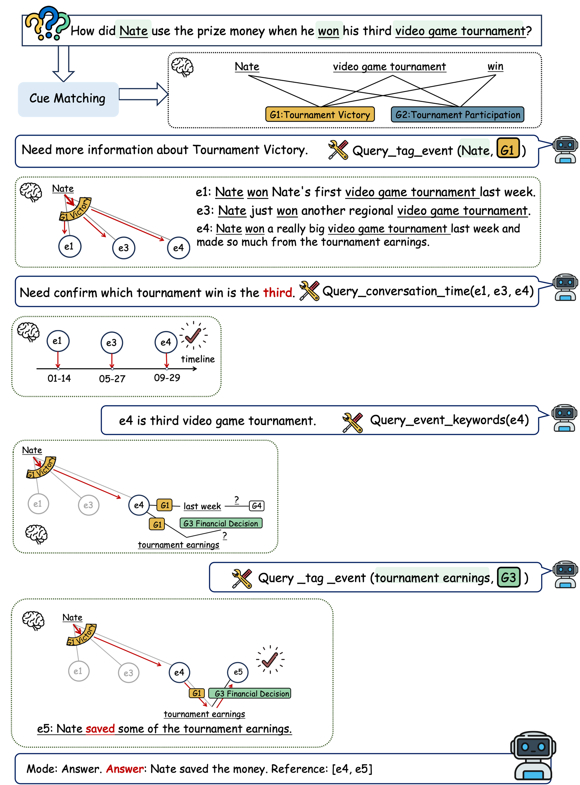
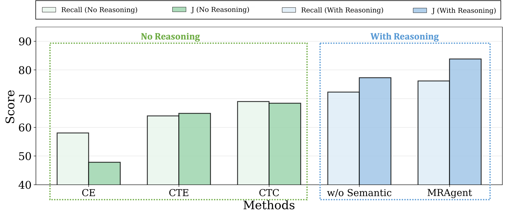
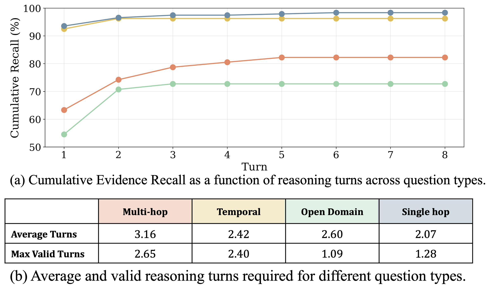
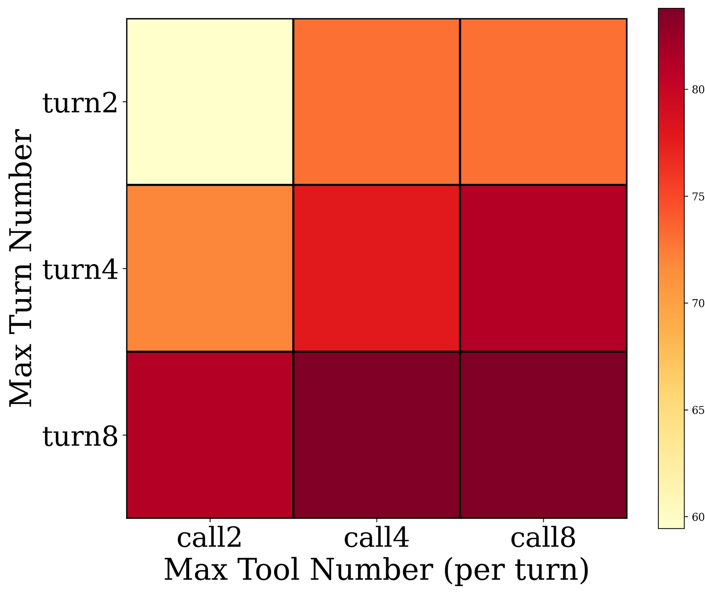
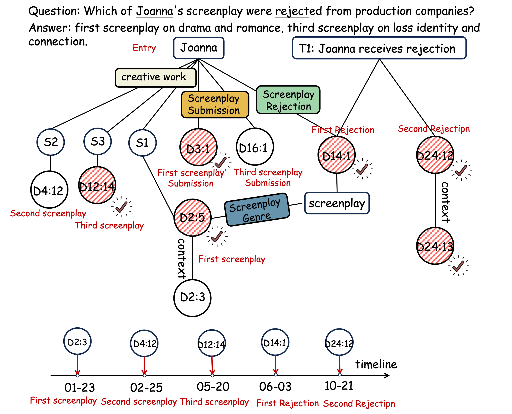

# Memory is Reconstructed, Not Retrieved: Graph Memory for LLM Agents

## 一句话总结

MRAgent 将长期记忆组织为 Cue--Tag--Content 关联图，并把 LLM 推理嵌入多步记忆访问过程，使智能体能够依据中间证据持续发现新线索、选择路径和剪除无关分支，而不是一次性取回固定的 top-$k$ 记忆后再作答。

## 研究问题

论文关注长交互历史中的复杂记忆推理。现有相似度检索和图记忆系统大多遵循静态的“retrieve-then-reason”范式：检索结果只由初始问题决定，或者依赖预定义的邻居扩展，因此无法利用推理途中出现的时间、人物或事件线索调整后续检索，也容易累积噪声。作者据此提出两个相互依赖的问题：如何把一次性检索改造成随证据演化的主动、多步重构过程；以及如何显式组织记忆间的语义与结构关联，使这种探索既灵活又不会发生组合爆炸。

## 核心方法

MRAgent 包含记忆构建与主动重构两部分。构建阶段先用 LLM 将对话蒸馏为情景记忆、语义记忆和主题抽象，再形成 Cue--Tag--Content 异构图：Cue 是实体、属性等细粒度入口，Content 保存具体记忆，Tag 则概括二者之间的关联。检索时先由 cue 激活少量 tag，再在 cue 与 tag 的共同约束下访问 content，从而把关联判断与完整内容读取分开。

重构阶段维护由当前活跃记忆元素与累计证据组成的状态，并允许 Cue$\rightarrow$Tag、(Cue, Tag)$\rightarrow$Content 以及 Content$\rightarrow$(Cue, Tag) 的正反向遍历。LLM 每一轮根据问题、已有证据和当前候选选择遍历动作，记忆系统执行受控扩展，随后 LLM 路由并剪枝；当证据足够时停止，否则利用新发现的 cue 或 tag 继续探索。论文还从假设类表达能力角度论证：在相同检索预算且至少两步时，主动检索严格包含被动检索能够实现的预测函数。

## 分章节阅读笔记

### 1 Introduction

引言负责完成一次研究视角的转换：长期记忆系统的问题不只是“模型没有保存足够多的信息”，也不只是“记忆结构不够丰富”，还在于检索与推理通常被拆成两个彼此隔离的阶段。作者希望把 memory access 本身变成推理过程的一部分，使智能体能够根据刚刚找到的证据决定下一步访问什么。

作者以 LLM 的“锯齿状认知能力”（jagged cognitive profile）作为背景：模型可以在数学和一般推理任务上表现很强，却难以稳定处理跨越很长交互历史的辅助或决策任务。有限上下文窗口使完整历史无法长期保留，因此外部记忆成为必要组件。已有方法从非结构化 RAG 逐渐发展到层级存储和知识图谱，改善了记忆的组织方式以及关系的可解释性，但作者认为它们的访问策略仍然大多是固定 top-$k$ 或预定义子图遍历。

这里的核心批评是“检索结果何时被决定”。传统系统通常只根据初始问题一次性决定候选记忆；即使使用图结构，后续访问也常由预先设定的邻居扩展规则决定。模型只能在已经取回的内容上推理，不能把中间推理产生的新线索重新送回记忆系统。作者将这种策略统称为 **passive retrieval policy（被动检索策略）**。

Figure 1 将论文要解决的两个问题并列展示。左侧例子中，问题要求回答 Caroline 四年前从哪里搬来，直接检索只能找到“她从祖国搬来”这一不完整表述；主动重构会识别出缺失变量是“home country”，再发起一次有针对性的访问，找到 Sweden。右侧例子中，扁平记忆只提供关于 dance studio 的直接原因，而关联记忆通过共享的 `Business` 标签把它连接到 Jon 的另一段商业经历，使答案能够结合直接证据与关联证据。这两部分分别对应“访问过程需要迭代”和“记忆结构需要支持关联导航”。

作者用认知神经科学中的重构式记忆观为这一设计提供动机：人的回忆并非把一条完整记录原样读出，而是由上下文线索（contextual cues）触发，在中间表征之间传播，逐步形成连贯的记忆体验。论文据此把技术挑战明确为两个方面：其一，如何把一次检索变成跨多个推理步骤逐渐揭示信息的 **active reconstruction**；其二，如何显式编码语义和结构依赖，使智能体能够沿着关联关系探索，而不是无约束地扩大候选集合。

Figure 2 给出了更具体的失败案例。问题询问 Nate 第二次赢得电子游戏锦标赛时 Caroline 在做什么。相似度检索可以找出 Nate 的两次比赛，却因为问题与 Caroline 的活动在表面语义上不相似而找不到答案；固定的一跳图扩展虽然增加了邻居，也主要带来噪声，因为 Caroline 的事件未必与比赛节点存在预建边。主动重构则先从第二次比赛中推断出关键时间线索 `July`，随后把“Caroline 在 July 做什么”作为新的访问方向，最终找到她当时在旅行。这里发生的关键变化是：**中间证据 July 改写了下一轮检索条件**。

MRAgent 是作者针对这两个挑战给出的高层方案。它在记忆图上同时探索多条候选路径，依据已积累的证据剪除无关分支，并选择下一步最有信息价值的方向。图结构采用 Cue--Tag--Content：Cue 是实体、属性、时间等细粒度入口，Content 是具体记忆，Tag 显式描述二者之间的关联。Tag 相当于访问完整内容之前可供 LLM 判断的语义路标，让系统能够先选择路径、再读取代价更高的具体记忆。

引言将论文贡献概括为四点：提出把记忆访问嵌入推理循环的主动重构范式；设计以关联标签为中介的 Cue--Tag--Content 图；从理论上主张主动检索策略的表达能力严格强于被动策略；并在实验中报告相对强基线更好的效果、token 成本和运行时间。理论命题的成立条件和实验结论的证据范围仍需分别在第 4.3 节与第 5 节检验，引言在此只负责给出论文的主张地图。

这一章最终确立了论文的研究位置：MRAgent 的新意不应只理解为“graph memory”，而应理解为 **reasoning-guided memory access over an associative graph**。图提供可导航的关联结构，LLM 推理负责根据中间状态改变导航方向，两者缺一不可。下一章会把这种直觉形式化为被动策略与主动策略的序贯记忆访问问题。

### 2 Problem Setting: Active Memory Access

这一章把引言中的“主动记忆重构”从直觉转化为序贯决策问题。作者先用策略是否依赖已取回证据来区分 passive retrieval 与 active reconstruction，再说明相似度检索和固定图扩展为什么仍属于被动策略，最后借用人类记忆的线索驱动重构过程解释 Cue--Tag--Content 设计的来源。这里建立的定义会直接支撑第 4.3 节关于主动与被动策略表达能力的理论比较。

### 2.1 Memory Retrieval Definition

设外部记忆为 $\mathcal{M}$，其中包含 $N$ 个记忆单元 $\mathcal{V}=\{v_1,\ldots,v_N\}$。面对问题 $x$，系统拥有 $T$ 次记忆访问机会；经过第 $t$ 步后，已经取回的证据集合记为 $S^{(t)}=\{v^{(1)},\ldots,v^{(t)}\}$。两类策略的差异不在检索次数，而在后续访问能否依赖这个不断变化的证据状态。

被动策略 $\pi_{\mathrm{p}}$ 满足：

$$
\{v^{(1)},\ldots,v^{(T)}\}=\pi_{\mathrm{p}}(x).
$$

这表示所有要访问的记忆都只由初始问题 $x$ 决定。实现上可以一次返回，也可以分批执行，但只要第 $t$ 步不能根据前面实际读到的内容改变选择，它在本文定义下就是 stateless 的被动检索。

主动策略则满足：

$$
v^{(t)}=\pi_{\mathrm{a}}^{(t)}\!\left(x,S^{(t-1)}\right),
\qquad
S^{(t)}=S^{(t-1)}\cup\{v^{(t)}\}.
$$

第 $t$ 个记忆单元不仅取决于原问题，还取决于此前累计证据 $S^{(t-1)}$。如果早期证据揭示了时间、人物关系或缺失变量，策略便可以修改下一步检索方向。因而，“active”在这里有一个精确含义：**memory access is state-dependent，即记忆访问依赖推理状态**。

这一形式化还控制了比较的公平性：主动和被动策略都只有 $T$ 次访问预算，作者后续声称的优势不是来自“主动方法可以无限检索”，而是来自同一预算内的自适应决策能力。

### 2.2 Limits of Passive Retrieval

作者将常见外部记忆访问进一步归纳为相似度检索与图检索，并指出二者即使使用了不同的数据结构，也可能共享同一种被动决策方式。

相似度检索按照问题与每个记忆单元的匹配分数选出前 $k$ 个结果：

$$
\pi_{\mathrm{sim}}(x)
=
\operatorname{TopK}\!\left(\{\operatorname{sim}(x,v)\}_{v\in\mathcal{V}},k\right).
$$

其优势是简单且适合直接相关的事实，但相关性函数始终以初始问题为中心。复杂问题所需的桥接证据可能与问题表面上并不相似，因此不会进入 top-$k$；与此同时，大量词面相似但不能回答问题的内容可能占据上下文。引言中的比赛示例正是如此：系统能检索到 Nate 的赛事，却找不到语义距离较远的 Caroline 活动。

图检索先用相似度获得种子集合 $\mathcal{V}^{\mathrm{sim}}$，再加入这些种子的预定义邻居：

$$
\begin{aligned}
\mathcal{V}^{\mathrm{sim}}
&=\operatorname{TopK}\!\left(\{\operatorname{sim}(x,v)\}_{v\in\mathcal{V}},k\right),\\
\pi_{\mathrm{graph}}(x)
&=\mathcal{V}^{\mathrm{sim}}\cup\operatorname{Neighbor}\!\left(\mathcal{V}^{\mathrm{sim}}\right).
\end{aligned}
$$

图结构能够利用已经编码好的关系，缓解部分多跳问题，但它有两个前提：正确证据必须通过预建边与种子相连，扩展规则还必须碰巧覆盖正确的跳数和方向。如果关联边缺失，遍历无法到达目标；如果邻居很多，固定 $N$-hop 扩展又会带来大量噪声。因此，**用了图并不自动意味着检索是主动的**。只要种子和扩展规则没有随中间证据变化，它仍属于被动策略。

主动重构把 LLM reasoning 放入访问循环，使已发现的信息能够成为新的 retrieval cue 或 retrieval constraint。例如系统从“第二次比赛”确定 `July` 后，不再沿赛事节点盲目扩边，而是将 `July` 与 Caroline 结合成新的访问方向。这使原先与问题没有直接相似度、也没有显式近邻边的证据变得可达。

作者最后将被动检索的局限归纳为三点：不能根据中间状态修正策略；固定聚合或扩展容易持续累积噪声；严重依赖预先构建的相似度空间或图结构，面对未显式编码的关联时缺乏灵活性。三点背后其实是同一个原因：reasoning 发生在 retrieval 结束之后，而不是与 retrieval 同步进行。

### 2.3 Motivation from Cognitive Memory Systems

作者以认知神经科学中的重构式记忆观解释系统结构。人类回忆被描述为一个连续过程：视觉、听觉等 contextual cue 激活 engram（由既往经历形成的紧凑内部记忆状态），engram 的激活进一步偏置和约束后续回忆，最终在分布式脑区中恢复与当前任务有关的情景或语义内容。重点不是原样读取一条完整记录，而是由线索逐步恢复一个连贯记忆。

Figure 3 给出了这种过程与 MRAgent 的功能类比。人的 contextual cue 对应系统中的 query cue；cue-activated engram 对应连接入口与内容的 tag；情景性与语义性的 cortical reinstatement 分别对应 episodic memory 和 semantic memory。例如 query cue `Alice` 可以通过 `Physical Activity` 标签访问“她昨天做瑜伽”等具体事件，也可以通过 `Profession` 标签访问“Alice 是舞者”这种较稳定的语义知识。

Tag 在这一类比中不是内容本身，而是决定“沿哪个关联方向恢复内容”的中间结构。它把一个 cue 可能关联的多种方面显式分开，使 LLM 可以先判断当前问题需要活动、职业还是其他关系，再读取相应的情景或语义记忆。下一章会将这种直觉落实为多粒度 Cue--Tag--Content 图。

这幅图应理解为设计层面的功能对应，而不是对人脑机制与 MRAgent 在生物学上等价的证明。论文借助认知记忆理论说明为什么“线索触发、中间关联、逐步重构”是合理的架构原则；系统本身的有效性仍由后续理论分析和实验结果支持。

### 3 Associative Memory System

第 3 章回答“主动重构需要怎样的记忆结构”。上一章只把外部记忆抽象为一组记忆单元，本章则把它具体化为多粒度异构图：细粒度 Cue 提供入口，Tag 显式描述关联方向，Content 保存情景、语义或主题层面的内容。设计目标是让 LLM 在读取完整记忆之前，先根据较短的关联标签判断哪些路径值得探索。

Figure 4 的上半部分对应本章：原始对话先经过 element generation，产生 cue、tag、episode 和 semantic unit，再被组织为情景与语义记忆图。下半部分预览下一章的在线过程：问题初始化 query cue，LLM 选择图遍历动作，系统执行访问，LLM 再根据候选内容路由和剪枝，直到形成可用于回答的 reconstructed memory。本章重点是准备这个可遍历空间，而不是定义具体的遍历策略。

### 3.1 Cue--Tag--Content Associative Memory

作者将统一记忆系统表示为异构图 $\mathcal{M}=(\mathcal{C},\mathcal{V},\mathcal{R})$。其中 $\mathcal{C}$ 是 cue 集合，包含人物、实体、动作、属性等细粒度关键词；$\mathcal{V}$ 是 content 集合，保存具体记忆内容；$\mathcal{R}$ 是 cue 与 content 之间的带类型关系：

$$
\mathcal{R}\subseteq\mathcal{C}\times\mathcal{G}\times\mathcal{V},
\qquad
(c,g,v)\in\mathcal{R}.
$$

三元组 $(c,g,v)$ 表示 cue $c$ 通过 tag $g$ 与 content $v$ 关联。严格按论文的数学定义，图中的两类主要节点是 Cue 和 Content，Tag 是关系属性；但在访问过程中，Tag 又像一个可被激活和筛选的中间元素。图中 Nate、`win` 和 `video game tournament` 是 cues，`Victory` 是 tag，而具体获胜事件是 episodic content。

Tag 的信息价值在于描述“这个 cue 以什么方面关联到这段内容”。同一个人物可能通过 `Profession`、`Preference`、`Physical Activity` 等不同 tag 连接到大量记忆。如果只根据人物节点展开所有邻居，候选集合会迅速膨胀；如果先判断当前问题需要哪个 tag，就能在读取完整内容前剪掉大部分无关分支。

论文用两个映射算子实现这种两阶段访问：

$$
\begin{aligned}
\phi_{c\rightarrow g}(c)
&\triangleq\{g\mid(c,g,\cdot)\in\mathcal{R}\},\\
\phi_{(c,g)\rightarrow v}(c,g)
&\triangleq\{v\mid(c,g,v)\in\mathcal{R}\}.
\end{aligned}
$$

$\phi_{c\rightarrow g}$ 从一个 cue 找出所有候选关联类型；$\phi_{(c,g)\rightarrow v}$ 再根据选定的 cue–tag 组合取回具体内容。换言之，系统先回答“可能沿哪些关系找”，再回答“这条关系下有哪些记忆”。这种分解把 associative reasoning 与 content retrieval 分开，是 MRAgent 控制图扩展规模的基础。

### 3.2 Multi-Granular Memory Layers

单一粒度的记忆难以同时支持具体事件查询、稳定事实查询和粗粒度主题定位，因此作者把 Content 组织为三个互补层次：

| 层次              | 保存的内容                                 | 主要组织方式                          | 适合支持的访问                     |
| ----------------- | ------------------------------------------ | ------------------------------------- | ---------------------------------- |
| Episodic layer    | 在特定时间和情境中发生的具体事件           | Cue--Tag--Episode，并沿统一时间线组织 | 事件细节、时间约束与跨事件推理     |
| Semantic layer    | 人物属性、偏好和一般事实等相对稳定知识     | 实体 cue 加 aspect-level tag          | 不遍历长事件历史，直接访问目标事实 |
| Abstraction layer | 一组相关事件共享的主题或 recurring pattern | Topic 节点连接其组成 episodes         | 先定位主题，再自上而下进入相关事件 |

情景层中的内容 $e_i\in\mathcal{V}^{e}$ 对应具体经历，cues 可以是实体、动作或上下文关键词，tag 概括 cue 与事件之间的关联。统一时间线使重构过程能够加入时间过滤，例如从 `July` 定位同一时段的其他事件。

语义层中的内容 $s_i\in\mathcal{V}^{s}$ 是跨事件提炼出的稳定知识。它仍然以实体 cue 为入口，但 tag 更像“人物的哪个方面”，例如性格、长期偏好或职业。这样，询问 Nate 的偏好时不必重新扫描所有包含 Nate 的对话事件。

抽象层中的 topic $\tau\in\mathcal{V}^{\tau}$ 汇总一组相关 episodes，并通过 $\phi_{\tau\rightarrow e}$ 支持自上而下访问。它不是简单增加一个更长的摘要，而是提供粗粒度路由：系统可以先判断问题属于哪个主题，再下降到该主题包含的具体事件。

三层的分工可以概括为：episode 保留上下文和时间细节，semantic unit 提供稳定且直接的事实，topic 缩小大规模事件集合的搜索范围。主动重构可以根据问题类型在不同粒度之间切换，而不必把所有记忆都压缩成同一种单元。

### 3.3 Memory Population via LLM Distillation

上述图结构通过一个自动化 LLM distillation 流程从对话中构建。输入流先被切分为语义连贯的情景单元 $e_i$；随后两个 LLM 组件分别为每个事件生成短关联标签并抽取细粒度线索：

$$
g_i=F_{\mathrm{LLM}}^{\mathrm{tag}}(e_i),
\qquad
C_i=F_{\mathrm{LLM}}^{\mathrm{cue}}(e_i).
$$

$F_{\mathrm{LLM}}^{\mathrm{tag}}$ 输出概括该事件关系模式的 tag $g_i$，$F_{\mathrm{LLM}}^{\mathrm{cue}}$ 输出实体、属性和显著描述等 cue 集合 $C_i$。对每个 $c\in C_i$，系统建立 $(c,g_i,e_i)$ 关系，由此形成 Cue--Tag--Episode 层。以“Nate 赢得电子游戏比赛”为例，系统可以抽取 Nate、win、video game tournament 等 cues，并通过 `Victory` tag 将它们连接到该事件。

语义记忆采用类似流程，但目标是从原始对话中提炼跨事件保持稳定的知识，再通过实体 cue 和 aspect-level tag 建立连接。主题层则对相关 episodes 的共同主题进行汇总，并把 topic 节点连接回组成它的事件。整个构建链条可以概括为：

`Dialogue → episodic segmentation → cue/tag extraction → episodic graph → semantic distillation → topic abstraction`

本章由此完成从原始交互到可遍历记忆空间的转换。它把检索时需要使用的关联提前显式化，使下一章的 LLM 不必在每一轮都阅读全部内容后才判断关系。与此同时，图质量会自然依赖事件切分、cue/tag 抽取和主题归纳的可靠性；正文在本节只定义构建流程，更具体的实现细节被放在附录，系统效果则需要结合后续消融实验判断。

### 4 MRAgent: Reconstructive Memory Agent

第 4 章定义 MRAgent 如何在上一章构建的关联图上执行在线记忆访问。其方法主线是：用显式状态记录“当前可以从哪里继续探索”和“已经积累了哪些证据”，让 LLM 选择正向或反向遍历动作，再对系统返回的候选进行语义路由与剪枝。最后，作者用假设类包含关系论证这种自适应访问比预先决定全部检索位置更有表达力。

### 4.1 Reconstructive Memory Framework

第 $t$ 轮的重构状态定义为：

$$
\mathcal{S}^{(t)}=\left(\mathcal{Z}^{(t)},\mathcal{H}^{(t)}\right).
$$

$\mathcal{Z}^{(t)}$ 是 **active set**，包含当前被激活的 cues、tags 或 contents，表示下一步可以从哪些位置继续遍历；$\mathcal{H}^{(t)}$ 是 **reconstructed context**，保存此前各轮已经积累的证据，用于判断当前理解是否充分以及哪条路径更有希望。可以把前者理解为搜索前沿（frontier），后者理解为搜索过程已经建立的工作记忆。

MRAgent 将可执行遍历表示为有限动作集合 $\mathcal{A}=\{\Pi_1,\ldots,\Pi_m\}$。这些动作由第 3 章的映射算子具体实现，分为正向和反向两类。

正向遍历沿 Cue--Tag--Content 方向展开：

$$
\begin{aligned}
\Pi_{c\rightarrow g}\!\left(\mathcal{C}^{(t)}\right)
&\triangleq\bigcup_{c'\in\mathcal{C}^{(t)}}\phi_{c\rightarrow g}(c'),\\
\Pi_{(c,g)\rightarrow v}\!\left(\mathcal{C}^{(t)},\mathcal{G}^{(t)}\right)
&\triangleq
\bigcup_{c'\in\mathcal{C}^{(t)}}\bigcup_{g'\in\mathcal{G}^{(t)}}
\phi_{(c,g)\rightarrow v}(c',g').
\end{aligned}
$$

第一种动作从当前 cues 激活候选 tags，第二种动作在 cue 和 tag 的共同约束下取回 contents。这对应从问题线索逐步进入具体记忆。

反向遍历则从已经取回的内容重新激活与之相关的 cues 和 tags：

$$
\Pi_{v\rightarrow(c,g)}\!\left(\mathcal{V}^{(t)}\right)
\triangleq
\{(c',g')\mid\exists v'\in\mathcal{V}^{(t)},(c',g',v')\in\mathcal{R}\}.
$$

反向动作是主动重构能够“转向”的关键。系统读到一个事件后，可以发现其中隐含的新人物、时间、主题或关系，再以这些元素为起点进入另一条路径。正向遍历负责从线索获得证据，反向遍历负责从证据生成新的检索线索；两者组合后，搜索轨迹不再受初始 query cue 限制。

### 4.2 Memory Reconstruction Process

面对问题 $x$，系统先抽取细粒度 cues，与图中的 cue 集合匹配，形成初始 active set $\mathcal{Z}^{(0)}$。此时尚未积累证据，因此初始状态为 $\mathcal{S}^{(0)}=(\mathcal{Z}^{(0)},\varnothing)$。随后每轮执行三个相互衔接的阶段：

| 阶段                             | 输入                                                                      | 操作与输出                                                                     |
| -------------------------------- | ------------------------------------------------------------------------- | ------------------------------------------------------------------------------ |
| LLM reasoning / action selection | 问题$x$、累计证据 $\mathcal{H}^{(t)}$、当前前沿 $\mathcal{Z}^{(t)}$ | 选择本轮要执行的遍历动作$\mathcal{A}^{(t)}$                                  |
| Controlled memory traversal      | 动作集合与当前前沿                                                        | 图工具执行确定性映射，产生候选集合$\widetilde{\mathcal{Z}}^{(t+1)}$          |
| LLM routing / state update       | 问题、累计证据与新候选                                                    | 保留相关候选、剪除分支，更新$\mathcal{Z}^{(t+1)}$ 和 $\mathcal{H}^{(t+1)}$ |

动作选择写为：

$$
\mathcal{A}^{(t)}
=f_{\mathrm{select}}\!\left(x,\mathcal{H}^{(t)},\mathcal{Z}^{(t)}\right).
$$

这里的 LLM 不直接虚构新的记忆节点，而是从预定义工具集合中选择动作。记忆系统随后执行这些动作，得到尚未筛选的候选：

$$
\widetilde{\mathcal{Z}}^{(t+1)}
=\bigcup_{a\in\mathcal{A}^{(t)}}\Pi_a\!\left(\mathcal{Z}^{(t)}\right).
$$

`Controlled` 的含义是扩展范围由 LLM 选择的 typed action 限制，而不是直接展开当前节点的所有邻居。候选产生后，另一个 LLM routing 函数结合原问题和累计证据进行筛选：

$$
\begin{aligned}
\mathcal{Z}^{(t+1)}
&=f_{\mathrm{route}}\!\left(x,\mathcal{H}^{(t)},\widetilde{\mathcal{Z}}^{(t+1)}\right),\\
\mathcal{H}^{(t+1)}
&=\mathcal{H}^{(t)}\cup\mathcal{Z}^{(t+1)}.
\end{aligned}
$$

路由后的 $\mathcal{Z}^{(t+1)}$ 成为下一轮搜索前沿，同时被加入 reconstructed context。系统再判断 $\mathcal{H}^{(t+1)}$ 是否足以回答问题：证据不足则继续 `Navigate`，证据充分则进入 `Answer` 模式；达到最大步数也会停止。

Figure 5 展示了完整轨迹。问题询问 Nate 如何使用第三次电子游戏比赛的奖金。系统先根据 Nate、win 和 tournament cues 选择 `Tournament Victory` 标签，取回三次获胜事件；接着查询事件时间，确认 $e_4$ 是第三次比赛；再从 $e_4$ 反向发现 `tournament earnings` 和 `Financial Decision`，沿该关系取回 $e_5$，最终得到“Nate 保存了部分奖金”。每一步的新证据都改变了下一步工具调用，这正是第 2 章 active policy 定义在系统中的具体实现。

### 4.3 Theoretical Analysis: Active vs. Passive Retrieval

理论部分不再局限于 Cue--Tag--Content 图，而是考虑带文本 payload 的一般异构图。一次节点访问会返回该节点的文本及有限数量的出边。给定预算 $T$，$\mathcal{H}^{\mathrm{LM}}_{\mathrm{active}}(T)$ 表示能够根据完整访问历史选择下一节点的 LM predictor 集合，$\mathcal{H}^{\mathrm{LM}}_{\mathrm{passive}}(T)$ 表示全部 $T$ 个节点只能由初始问题预先确定的 predictor 集合。

论文主张：

$$
\mathcal{H}^{\mathrm{LM}}_{\mathrm{passive}}(T)
\subsetneq
\mathcal{H}^{\mathrm{LM}}_{\mathrm{active}}(T),
\qquad T\ge 2.
$$

证明的包含部分很直接：主动策略可以选择忽略访问历史，完全复现任意被动策略，因此 passive hypothesis class 一定包含在 active class 中。

严格性使用一个 binary-tree needle-in-a-haystack 任务。树深设为 $d=T-1$，每个内部节点的 payload 保存下一步应走左还是右的一位信息，真正答案只放在目标叶节点。主动策略先访问根，根据读到的 bit 选择子节点，再逐层读取下一位，最后用 $d+1=T$ 次访问准确到达目标叶，理论误差为零。被动策略必须在看到任何 bit 之前决定所有访问节点，只能预先猜测可能的叶子；附录给出的误差下界是：

$$
L\!\left(\pi^{\mathrm{pass}};D_{n,d}\right)
\ge
\varepsilon_Y\!\left(1-\frac{T}{2^d}\right),
$$

其中 $\varepsilon_Y$ 是只知道标签先验时不可避免的错误率。这个构造说明：存在一类问题，其正确访问地址只能由上一节点的内容决定；在这种任务上，自适应检索可以线性地跟随路径，而非自适应检索需要覆盖指数数量的候选叶子。

**证明审读。** 将 $d=T-1$ 代入后，下界为 $\varepsilon_Y(1-T/2^{T-1})$。它在 $T\ge3$ 时为正，确实给出严格分离；但在论文声称覆盖的边界情形 $T=2$ 时等于零，因此附录当前的二叉树构造没有直接证明该情形的严格性。`T=2` 的结论可能通过分支数大于 2 的类似构造补足，但这一步并未写在现有证明中。更准确地说，论文给出的证明文本完整支持 $T\ge3$，而 `T=2` 存在一个证明缺口。

此外，该定理证明的是 hypothesis-class expressivity：存在某个分布使主动策略能够实现而被动策略不能实现。它不表示主动检索在每个实际数据集上都必然更准确，也不保证 LLM 总能学会正确的 action selection 与 routing；这些实际能力仍需由第 5 章实验验证。

### 5 Experiments

实验章围绕五个问题展开：MRAgent 是否优于已有记忆系统（RQ1），计算成本如何（RQ2），图结构、Tag、语义记忆和多步推理分别贡献多少（RQ3），证据能否随推理轮数逐步恢复（RQ4），以及真实多会话案例中的遍历轨迹是否符合设计预期（RQ5）。整体证据链从最终答案质量延伸到 retrieval evidence、token/runtime 与具体工具路径，覆盖面较完整。

### 5.1 Experiment Setup

**数据集。** LoCoMo 包含 50 段长对话，每段最多 35 个 session、平均约 300 turns，并配有约 200 个问答，覆盖 single-hop、multi-hop、temporal 和 open-domain。实验排除了 adversarial questions，因此 LoCoMo 结果不能外推到不可回答检测。LongMemEval 使用 LongMemEval-S，约 500 个问题，每个问题对应约 115K tokens 的带时间戳会话历史；论文主要评测 multi-session、single-session-user、temporal-reasoning 和 single-session-preference 四类，而不是完整类别集合。

**对比方法。** Baselines 包括普通向量 RAG、LLM 辅助建图并做邻居扩展的 A-Mem、三层层级记忆 MemoryOS、向量检索后总结的 LangMem，以及维护紧凑事实记忆并做相似度检索的 Mem0。所有方法分别使用 Gemini-2.5-Flash 和 Claude-Sonnet-4.5 作为 backbone，以减少“方法提升只是来自更强基础模型”的混淆。LongMemEval 表中的 MRAgent$^*$ 是一个额外配置：记忆仍由 Gemini 构建，但在线检索改用 Claude，不应与纯 Gemini baselines 视为完全同配置比较。

**指标与预算。** 正文报告 F1、GPT-4o-mini LLM-Judge（J）和 evidence recall。J 判断生成答案与参考答案在语义上是否等价；evidence recall 衡量标注支持证据中有多少被检索到，从而把检索质量与最终生成质量分开。每种方法独立运行三次，Judge temperature 为 0；每个问题最多 8 个 reasoning turns，每轮最多 10 次工具调用，并允许提前停止。

这里存在一处需要澄清的指标文档问题。附录称 F1 由二元 Judge 决策计算，但主结果中 F1 与 J 差异很大，例如 Claude-MRAgent 的 LoCoMo multi-hop F1 为 56.72，而 J 为 90.19。如果回答通常非空，按附录公式计算的 precision、recall 和 F1 应接近 Judge 正确率，因此这组数值无法由该定义直接复现。主表中的 F1 很可能使用了另一种答案重叠指标，但当前源码没有一致说明；解读结果时应把 F1 与 J 视为两个经验指标，同时保留这一可复现性疑问。

### 5.2 Main Results (RQ1)

LoCoMo 的总体 LLM-Judge 结果如下：

| Backbone          | 最强 baseline | Baseline J | MRAgent J | 绝对提升 | 相对提升 |
| ----------------- | ------------- | ---------: | --------: | -------: | -------: |
| Gemini-2.5-Flash  | Mem0          |      68.31 |     84.21 |   +15.90 |   +23.3% |
| Claude-Sonnet-4.5 | LangMem       |      78.61 |     88.32 |    +9.71 |   +12.4% |

优势在需要组合证据的类别尤其明显。Gemini 下，MRAgent 的 temporal J 为 80.37、open-domain J 为 68.75、single-hop J 为 90.48，对应最强 baseline 分别只有 61.68、41.67 和 73.72。Claude 下，multi-hop、temporal、open-domain、single-hop J 分别达到 90.19、85.34、71.57 和 91.10，均为最高。

不过，作者“across question types and backbones consistently outperforms all baselines”的表述对所有指标而言略强。Gemini multi-hop F1 上 MRAgent 为 43.69，低于 Mem0 的 45.17；它在该类别的 J 仍以 75.17 排名第一。因此，更准确的结论是：MRAgent 在所有报告的 LoCoMo J 指标和绝大多数 F1 指标上领先，但不是逐单元格全胜。

LongMemEval 的 Gemini-backbone J 结果为：

| Method                            | Multi-session | Single-user | Temporal | Preference | Overall |
| --------------------------------- | ------------: | ----------: | -------: | ---------: | ------: |
| 最强 baseline（各列）             |         56.39 |       90.00 |    45.71 |      46.67 |   54.92 |
| MRAgent                           |         68.42 |       92.85 |    68.42 |      66.67 |   72.95 |
| MRAgent$^*$（Claude retrieval） |         86.46 |       92.85 |    85.71 |      78.57 |   86.76 |

MRAgent 相对最强 Gemini baseline 的 Overall J 从 54.92 提升到 72.95，即 +18.03 个百分点、约 +32.8% 相对提升。作者将结果归因于两部分：CTC 图用 Tag 把语义关联写入结构，使候选路径可被选择；多轮推理则让访问方向随累计证据改变。主结果本身证明了完整系统有效，但这两项归因是否成立还要依赖后面的消融实验。

### 5.3 Cost Analysis (RQ2)

LongMemEval 上每个样本的成本统计同时包含记忆构建与检索：

| Method   | Token consumption |      Runtime (s) |
| -------- | ----------------: | ---------------: |
| A-Mem    |              632k |         1,122.23 |
| MemoryOS |              273k |         3,135.54 |
| LangMem  |            3,268k |         1,209.57 |
| Mem0     |              245k | **533.29** |
| MRAgent  |    **118k** |           586.11 |

MRAgent 的 token 消耗最低，相比次低的 Mem0 减少约 51.8%，相比 A-Mem 减少约 81.3%。论文的解释是把复杂关系推断推迟到 query-specific retrieval 阶段：离线构建相对轻量，在线时先用 Tag 筛选方向，再访问昂贵的 episodic content，避免反复总结完整历史。

运行时间结论需要更精确地表述。MRAgent 的 586.11 秒明显快于 A-Mem、MemoryOS 和 LangMem，但不是最快；Mem0 为 533.29 秒，比 MRAgent 快约 9.9%。因此实验支持“最佳 token efficiency 和第二好的 runtime”，而不是所有成本维度都最优。它也展示了主动多轮访问的现实权衡：减少上下文 token 不必然等比例减少串行调用延迟。

### 5.4 Ablation Study (RQ3)

消融在 Claude backbone 的 LoCoMo multi-hop 上同时观察 evidence recall 与 J。无推理条件下，结构从 CE（Cue$\rightarrow$Episode）升级到 CTE（Cue--Tag--Episode），Recall 约从 58 提升到 64，J 约从 48 提升到 65；再加入完整 CTC 中的语义内容后，Recall 约为 69，J 约为 68。这说明 Tag 带来的最大改善体现在回答质量，语义层则继续补充稳定知识。

加入主动 reasoning 后，只有 episodic layer 的 `w/o Semantic` 版本约达到 Recall 72、J 77；完整 MRAgent 进一步达到 Recall 76、J 84。按可对应的结构比较，CTE 加 reasoning 相比 CTE one-shot 明显提升，CTC 加 reasoning 相比 CTC one-shot 同样提升；这支持“结构和主动访问互补”，而不是其中一个单独解释全部收益。

该消融最有力地支持三个局部结论：Tag 比直接 Cue--Episode 索引更有效；多步 reasoning 在相同层次结构上继续增加证据覆盖和回答正确性；semantic memory 对 multi-hop 有额外贡献。由于实验只在 LoCoMo multi-hop 与 Claude 上展示，这些组件效应是否同样适用于其他问题类型和 backbone，主文没有逐项验证。

### 5.5 Multi-turn Reasoning Analysis (RQ4)

累计 evidence recall 显示不同问题对深度的需求不同。Single-hop 和 temporal 在第一轮已经超过 92%，约两至三轮接近饱和；multi-hop 从第一轮约 63% 增至第五轮约 82%，相对增长超过 30%；open-domain 从约 55% 增至第三轮约 73% 后基本稳定。这直接支持“多跳证据不是增加同轮 top-$k$ 就能一次找齐，而是需要前一轮信息触发后一轮访问”。

平均停止轮数分别为 multi-hop 3.16、temporal 2.42、open-domain 2.60、single-hop 2.07。图中所谓 Max Valid Turns 分别为 2.65、2.40、1.09 和 1.28。作者据此声称有效证据结束位置与实际停止轮数接近，说明 agent 能自主终止；这一证据对 temporal 最强，对 multi-hop 尚算接近，但 open-domain 和 single-hop 分别相差 1.51 与 0.79 轮，不能说所有类别都“closely matches”。这些差值提示仍存在一定冗余探索。

附录的预算热图进一步区分搜索深度 $T$ 与单轮并行工具数 $K$。固定 $K$ 时，从 2 轮增加到 4、8 轮会持续提高 multi-hop J；固定较浅深度时，增加并行调用只能带来有限提升并很快饱和。例如 2 轮下从 2 calls 增至 4 calls 有改善，但继续增至 8 calls 几乎不变。结论是 retrieval breadth 可以扩大当前层的候选覆盖，却不能替代由中间证据串联起来的 sequential depth。

### 5.6 Case Study (RQ5)

案例问题是“Joanna 的哪些剧本被制作公司拒绝？”答案分散在多个 session：投稿、剧本内容和拒稿事件并不位于同一段对话，仅检索 `rejection` 不能判断被拒的是哪一部作品。

第一轮，系统通过 `Screenplay Submission`、`Screenplay Rejection` 和 rejection topic 找到投稿与拒稿候选；第二轮查询事件上下文和关键词，补全每次拒稿的具体信息；第三、四轮访问 Joanna 的 semantic information，将第一、第二、第三部剧本与各自主题对应；第五轮查询时间，把 1 月 23 日、2 月 25 日、5 月 20 日的三次创作/投稿与 6 月 3 日、10 月 21 日的拒稿事件对齐。最终系统判断第一部 drama-and-romance screenplay 和第三部关于 loss、identity、connection 的 screenplay 被拒。

这个案例展示了三类操作的组合价值：Tag/Topic 用于发现分散事件，semantic memory 用于识别每部作品，timeline 用于验证投稿与拒稿的对应关系。它很好地说明了系统如何工作，但作为单个成功案例只能提供可解释性证据，不能单独证明整体可靠性；量化结论仍应以主结果、消融和 evidence recall 为依据。

### 6 Related Work

Related Work 按“检索对象是什么、记忆如何组织、访问策略是否随中间证据变化”三个维度定位 MRAgent。作者讨论了 Retrieval-Augmented Generation、Graph-based Memory，以及 Hierarchical and Persistent Memory Systems 三条路线。贯穿本章的判断标准仍是第 2 章的 passive/active 区分，而不是简单比较谁使用了图或谁支持多轮调用。

**Retrieval-Augmented Generation。** 经典 RAG 将外部文档存入非结构化向量库，在推理时根据 query 做一次 top-$k$ 相似度检索并把结果加入 prompt。GraphRAG 在此基础上增加图结构、community summary 和 neighborhood expansion，从而改善全局与多跳访问，但路径通常仍由相似度种子和预定扩展规则决定。

Agentic RAG 已经把 retrieval 放入 reasoning loop，因此与 MRAgent 在“主动访问”上非常接近。Search-o1 在推理模型检测到知识缺口时按需生成搜索请求，并在写入推理链之前加工检索文档；Search-R1 则用 reinforcement learning 训练多轮 query generation。作者没有否认这些方法具有自适应检索，而是从应用对象上区分它们：Agentic RAG 通常从开放或外部语料补充单次任务中的事实缺口，MRAgent 则在智能体自己的持久交互历史上重构个人化、跨 session 的记忆证据。

**Graph-based Memory。** A-Mem 用 LLM 抽取关系，把结构化 memory notes 连接成图，检索时先选种子再扩展邻居；Zep 使用 bi-temporal knowledge graph，既记录事实何时成立，也能使过时边失效；LiCoMemory 用实体和关系构建轻量层级图，并结合时间与层级信息检索。这些工作说明图结构确实能改善关系访问、多跳访问和时间一致性。作者对它们的核心批评不在表示能力，而在 traversal policy：访问通常由预定义算子控制，不能根据刚读到的证据重新决定下一条路径。

**Hierarchical and Persistent Memory Systems。** MemoryOS 用 short/mid/long-term 三层结构管理长期交互；Mem0 通过 LLM 驱动的 add、update、delete 保持紧凑的显著事实集合；SeCom 按语义连贯主题片段构建 memory bank。这条路线主要解决记忆如何随时间存储、压缩和更新。作者认为它们虽然让 memory content 持续演化，但读取阶段仍主要把问题映射为固定的候选集合，没有让 intermediate evidence 参与检索策略更新。

论文的定位关系可以概括为：

| 路线                           | 检索对象                    | 结构/维护重点                  | 在线访问特点                       | 与 MRAgent 的关键差异                  |
| ------------------------------ | --------------------------- | ------------------------------ | ---------------------------------- | -------------------------------------- |
| RAG                            | 外部文档                    | 向量库                         | query-only top-$k$               | 缺少持久个人记忆与主动重构             |
| GraphRAG / graph memory        | 文档图或 agent memory graph | 显式实体、关系、时间结构       | 种子加预定义邻居扩展               | 有结构，但路径不随中间证据改变         |
| Agentic RAG                    | 开放或外部语料              | 动态 query generation          | reasoning-guided multi-turn search | 有主动访问，但通常不是持久交互记忆重构 |
| Hierarchical/persistent memory | 长期交互历史                | 分层、压缩、增删改             | 固定 query-to-memory retrieval     | 内容会更新，访问策略仍偏被动           |
| MRAgent                        | 持久交互历史                | Cue--Tag--Content 多粒度关联图 | 中间证据驱动正反向遍历与剪枝       | 试图同时结合持久性、关联结构和主动访问 |

因此，本章给出的新颖性主张是一个交叉点，而不是对单项技术的首创：图记忆不是新的，持久记忆不是新的，reasoning-time multi-turn retrieval 也不是新的；MRAgent 的目标是在 persistent agent memory 上，用显式关联结构支持 state-dependent reconstruction。这个定位也意味着最直接的比较对象应同时具备较强图结构和迭代检索能力，而论文实验中的 baselines 主要覆盖前者或持久记忆，和 Agentic RAG 的直接实证比较仍然缺失。

### 7 Conclusion and Discussion

结论将 MRAgent 概括为一个 reconstructive memory agent：它不把记忆访问视为生成答案前的一次固定检索，而是在结构化图上交替执行 LLM reasoning、typed traversal 和 evidence routing，使后续访问能够依赖当前已经重构出的上下文。

作者认为最关键的设计选择是把复杂关系依赖的建模从 memory construction 阶段转移到 retrieval 阶段。系统不在写入时穷尽所有可能关系，而是在收到具体 query 后，通过 Cue--Tag--Content 图进行 targeted、state-dependent exploration。这样可以让计算集中在当前问题需要的路径上。第 5 章的 token 结果支持这种信息效率：MRAgent 的 118k tokens 显著低于所有 baselines；但 runtime 为第二而非第一，因此“更低计算成本”更准确地指较少上下文处理和较轻构建，而不是最低端到端延迟。

这种设计同时形成一个清晰的成本权衡：

`轻量、静态构建 → 查询时按需关系推理 → 更低 token / 更高串行深度风险`

作者正式承认两项限制。第一，reconstruction cost 随探索深度增长。简单问题可以快速停止，但需要很多 traversal steps 的问题会进行更多 LLM 与工具调用，因此延迟可能高于 single-shot retrieval。实验中的 budget heatmap 证明深度确实带来效果，同时成本表显示 MRAgent 仍略慢于 Mem0，这与该限制一致。

第二，当前 memory construction 是静态的，没有在线 update、consolidation 或 forgetting。这里的“静态”并不是没有使用 LLM 构图，而是图一旦由输入流生成，就缺少后续维护机制。随着交互累积，节点和关系只增不减，可能保存重复、过时或冲突的信息，并持续提高存储和导航成本。这使当前实现更适合固定评测语料，而距离长期部署中的 continuously evolving memory 仍有差距。

作者据此提出三条未来方向：adaptive construction 根据查询和使用反馈调整图结构；lightweight memory maintenance 对重复、过时或低价值记忆做合并与淘汰；more robust traversal policies 降低深层搜索的错误传播和冗余调用。三者分别对应构建、维护和读取阶段。

结合全文证据，论文较充分地支持“主动多步访问与关联结构对长程、多跳记忆问答有效”，但仍有若干边界需要与结论并读：消融主要集中在 Claude + LoCoMo multi-hop；LoCoMo 排除了 adversarial questions；F1 定义与结果表存在不一致；理论附录对 $T=2$ 的严格分离留有证明缺口；与 Agentic RAG 的直接实验比较缺失。这些问题不否定系统在所测设置下的提升，但限制了当前结果能够支撑的普遍性。

全文最终形成的研究判断是：长期记忆系统不应只优化“存储表示”，还应把 retrieval policy 视为可推理、可适应的系统组件。MRAgent 给出了一个清晰实现，但下一阶段的关键不是继续无边界增加图结构，而是同时解决动态维护、可靠路由和深度成本控制。
