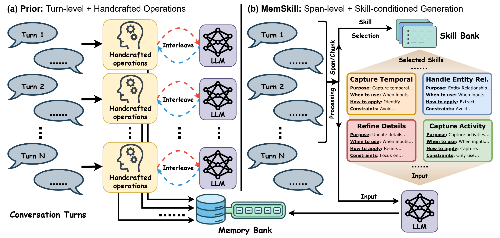
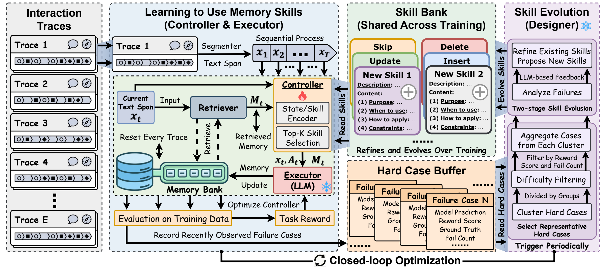
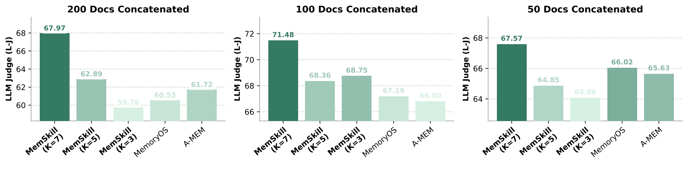
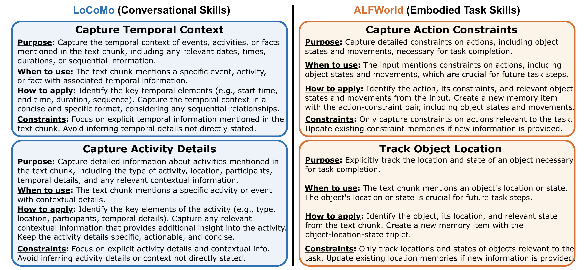

# MemSkill: Learning and Evolving Memory Skills for Self-Evolving Agents

## 一句话总结

MemSkill 把 LLM agent 的记忆抽取、整合和修订从固定的手工操作，改写为可学习、可选择、可演化的 memory skills，并通过 controller、executor、designer 的闭环训练让记忆管理策略随困难样例不断改进。

## 研究问题

现有 agent memory 系统通常依赖 add/update/delete/skip 等静态操作或人工设计模块，默认了“什么值得记、如何更新、何时删除”的人类先验；当交互历史变长、任务形态变化或输入从对话迁移到文档/具身环境时，这类固定流程容易僵化且调用成本高。论文要解决的问题是：能否让 agent 从交互数据中学习可复用的记忆操作，并在训练过程中自动发现和修正新的记忆技能，从而减少人工先验、支持 span-level 记忆构建，并提升跨模型、跨任务泛化。

## 核心方法

MemSkill 维护两个层面的存储：每条轨迹自己的 memory bank，以及跨轨迹共享的 skill bank。每个 memory skill 由简短 description 和详细 content 组成，初始只包含 Insert、Update、Delete、Skip 四个基础技能。处理当前文本 span 时，controller 根据 span 表征和已检索记忆表征，为可变大小 skill bank 中的每个技能打分，并选择有序 Top-K 技能；LLM executor 在一个调用中基于当前 span、检索记忆和选中技能生成结构化 memory updates。训练时，controller 用下游任务表现作为奖励进行 PPO 优化；designer 定期从 hard-case buffer 中聚类挑选代表性失败案例，用 LLM 分析缺失的记忆行为，进而细化旧技能或提出新技能，并在性能退化时回滚。整体形成“学习使用技能”和“演化技能库”交替进行的闭环。

## 分章节阅读笔记

### 1 Introduction

#### 本节主线

Introduction 的核心不是简单提出“LLM agent 需要长期记忆”，而是把问题推进了一层：现有 agent memory 大多把“记忆操作”写死成手工流程，例如按轮次 add / update / delete / skip，或者用人工设计的模块决定该存什么、怎么改、何时删。作者认为这会让记忆系统过度依赖人类先验，在长历史、多样交互模式和任务迁移场景下不够灵活。因此，论文提出把 memory extraction / consolidation / revision 本身看成一种可学习、可复用、可演化的技能。

换句话说，MemSkill 的问题设定是：不要只学习“用已有记忆回答问题”，也不要只设计一个固定 memory pipeline；而是让 agent 学会“如何构造和维护记忆”。

#### 现有方法的瓶颈

作者首先指出，LLM agent 进入长程、开放式交互后，历史信息会不断增长。记忆系统的作用是保留经验、维持连贯性，并在未来任务中检索有用信息。已有方法通常会做摘要、检索、外部 memory store 管理等，但很多系统仍然依赖静态、手工设计的 memory mechanism。

这里的“手工设计”主要包括两类：

1. 固定操作原语：例如 add、update、delete、skip。
2. 启发式模块：例如人工规定什么内容值得存、旧记忆如何合并、什么时候剪枝。

作者批评的重点不是这些操作没用，而是它们把“记忆行为”预先固定了。不同任务、不同用户、不同交互粒度下，应该记住的信息类型可能不同；如果流程是固定的，系统就很难随数据和任务变化自适应。

#### 作者的关键转向：memory skill

作者提出把 memory construction 重新表述为应用一组 memory skills 的结果。这里的 skill 不是模型参数里的隐式能力，而是结构化、可复用的自然语言行为规范，描述：

- 什么时候适用；
- 应该如何从交互片段中抽取信息；
- 如何整合、修订或删除已有记忆；
- 应该避免什么错误。

这一步是全文的概念核心：传统方法把记忆构建视为固定 pipeline 的输出，MemSkill 把它视为“选择并组合若干技能后的生成结果”。这样做的好处是，技能可以被学习选择，也可以被后续修改和新增。

#### 理想记忆系统的三个性质

作者在 Introduction 中明确提出，一个更理想的 agent memory system 应该满足三点：

1. **减少对人类先验的依赖**  
   不应由人工在每个领域里规定什么值得记，而应让 memory behavior 从交互数据和任务反馈中形成，并随任务需求变化。

2. **支持更大的抽取粒度**  
   很多现有方法按 turn 处理记忆，但长历史里逐轮处理会产生大量重复 LLM 调用，也容易把跨轮信息割裂。MemSkill 希望支持 span-level / chunk-level 处理，在一个更长片段上一次性构建记忆。

3. **技能条件化、可组合的记忆构建**  
   不是把 memory construction 拆成固定模块串联，而是针对当前上下文选择少量相关技能，并在一次生成中组合使用。这样既保持提示上下文简洁，也给后续技能演化留下空间。

#### Figure 1 解读

Figure 1 对比了两种记忆构建范式。

左侧是作者概括的 prior paradigm：系统按 turn 逐轮处理 conversation，每轮都经过 handcrafted operations，再和 LLM 调用交错执行，最后写入 memory bank。这种范式的问题是操作固定、调用频繁、粒度较小，长历史下成本和脆弱性都会放大。

右侧是 MemSkill paradigm：系统先把多轮交互组成 span / chunk，再从 shared skill bank 中选择一小组相关技能，例如捕捉时间信息、处理实体关系、细化细节、捕捉活动等；随后 LLM executor 以当前输入和 selected skills 为条件，一次生成 memory update。这里的关键变化是：记忆操作不再是固定代码/规则，而是一个可选择、可扩展的技能库。

#### MemSkill 的整体方案

Introduction 中已经概括了后文方法的三块：

- **Skill bank**：共享的技能库，每个 skill 表示一种可复用的记忆抽取、整合或修订方式。
- **Controller**：根据当前上下文选择少量相关技能。
- **Executor**：LLM 基于当前 span、已有检索记忆和 selected skills，一次生成 skill-guided memories。

更进一步，MemSkill 不只学习如何使用固定技能库，还引入 **designer** 做技能演化。训练过程中，controller 用下游任务表现作为 RL 奖励来学习选技能；designer 定期收集 hard cases，分析当前技能为什么导致错误或不完整记忆，然后 refine 旧技能或提出新技能。演化后，controller 继续在新技能库上训练，并增加探索以便使用新技能。

所以整个系统是一个闭环：

`当前技能库 -> 学习选择技能 -> 构建记忆 -> 下游任务反馈 -> 收集失败案例 -> 演化技能库 -> 继续训练`

#### 本节贡献表述

作者最后把贡献总结为三点：

1. 提出 MemSkill，把 agent memory operations 表示为 evolving skill bank，从固定手工 pipeline 转为 adaptive skill-conditioned generation。
2. 提出结合 RL skill selection 和 LLM-guided skill evolution 的闭环优化流程，使技能库能从 hard cases 中持续细化。
3. 在 LoCoMo、LongMemEval、HotpotQA、ALFWorld 上验证效果，覆盖 conversational QA 和 embodied interaction，并强调跨任务、跨模型泛化。

#### 读这一节时要抓住的判断点

这篇论文真正想占的位置，是“self-evolving memory behavior”，而不只是“更好的 memory retrieval”。它和 MemoryBank、Mem0、MemoryOS 等工作的区别，作者会反复强调在于：后者通常仍有固定的记忆管理流程，MemSkill 则让记忆操作本身成为可选择、可演化的对象。

一个值得后续重点追问的问题是：这些 evolved skills 到底是否学到了可迁移的记忆行为，还是只是把训练集里的经验改写成更复杂的 prompt 模板。实验部分的 transfer setting、ablation 和 case study 就是在回应这个问题。

### 2 Related Work

#### 本章作用

Related Work 很短，但定位很清楚：作者把 MemSkill 放在两个交叉方向之间。

第一条线是 **LLM agent memory systems**：研究如何从交互历史中构建外部记忆，并用这些记忆支持后续推理、问答或决策。第二条线是 **self-evolving LLM agents**：研究 agent 如何从经验中自我改进，减少人工监督。MemSkill 的主张是，它不是单纯改进 memory store / retrieval，也不是泛化地让 agent 学一个 web skill 或任务策略，而是让“记忆构建与修订的行为规则”本身可以演化。

### 2.1 LLM Agent Memory Systems

这一小节先概括 agent memory 的常见流程：

1. 从历史交互中周期性抽取 salient information；
2. 写入外部 memory store；
3. 新 query 到来时检索相关记忆；
4. 通过 consolidation 或 pruning 更新 memory store。

这类流程包括 MemoryBank、MemGPT、Mem0、A-MEM、MemoryOS、LightMem 等方向。作者承认这些工作推动了 agent memory 的发展，但认为它们通常仍有一个共同限制：记忆管理大多由静态、人工设计的 extraction / consolidation / pruning routine 控制。

这里作者特别提到 Memory-R1 和 Mem-alpha 这类 learning-based 方法：它们已经开始用下游任务信号和强化学习来优化 memory management。也就是说，作者没有把所有现有方法都说成“完全手工”。但即便如此，作者仍认为这些方法的核心 memory behavior 很多时候还是围绕固定操作或固定架构展开，没有把“记忆技能本身”作为可增长、可修订的对象。

#### 与 concurrent self-evolving memory work 的区别

作者还列出几类同期 self-evolving memory 工作，并逐一划边界：

- **Evo-Memory**：关注 streaming memory evolution，即在线流式场景里记忆如何演化。
- **MemEvolve**：优化 predefined memory architectures，重点是预定义架构的演化或调整。
- **MemGen**：面向 reasoning 的 latent memory，不一定显式维护自然语言记忆技能。
- **ReasoningBank**：从经验中蒸馏 reasoning strategies，更偏推理策略库。

MemSkill 的差异点是：它演化的是 **memory skills themselves**，也就是可复用的记忆操作规范，例如如何捕捉时间信息、实体关系、活动细节、约束、位置等。这些技能直接控制“怎样从交互中构建和修订记忆”。

#### 这一小节的阅读判断

作者想强调的 novelty 不是“有记忆库”，也不是“会更新记忆”，而是：

`fixed memory operation / fixed memory architecture -> evolvable memory skill bank`

后面 Method 里 skill bank、designer、hard-case evolution 的设计，都是为了支撑这个差异。

### 2.2 Self-Evolving LLM Agents

这一小节把 MemSkill 放到更大的 self-evolving agents 背景中。这里的核心问题是：agent 能不能通过交互经验自我改进，而不是依赖大量人工标注或手写规则。

作者列出的相关方向大致可以分成四类：

1. **经验蒸馏与复用**  
   ExpeL 从轨迹中蒸馏可编辑的自然语言 insight，并在之后任务中检索使用。EvolveR 把交互经验整理成可复用原则，并通过强化学习闭环更新。它们和 MemSkill 相似之处在于都把经验转化成可复用知识；区别在于 MemSkill 聚焦的是记忆构建规则，而不是一般任务经验或行动原则。

2. **self-play / curriculum 式自我演化**  
   Absolute Zero Reasoner、Multi-Agent Evolve、R-Zero 等通过 proposer / solver / judge 或 challenger / solver 结构构造训练任务和反馈。它们减少了对人工数据的依赖，但主要面向推理能力或训练课程生成，不是 agent memory management。

3. **agent learning dynamics 与自动设计**  
   AgentEvolver、RAGEN 关注多轮 RL 中 agent 学习稳定性或效率；ADAS、AlphaEvolve 探索自动发现和优化 agent design。这类工作说明“agent 结构/策略可以被搜索和演化”，但 MemSkill 的粒度更具体：演化 memory skill bank。

4. **可复用技能发现**  
   SkillWeaver 展示 agent 可以为 web interaction 发现和细化 reusable skills。MemSkill 与它概念上接近，但技能对象不同：SkillWeaver 偏任务交互技能，MemSkill 偏记忆抽取、整合、修订技能。

#### 本小节的定位句

可以把作者的定位压缩为一句话：

MemSkill 把 self-evolving agents 的思想引入 agent memory，但演化对象不是整个 agent、任务策略、推理策略或交互技能，而是控制记忆如何被构建和维护的 memory skills。

#### 对后续阅读的提示

Related Work 中有一个潜在风险点：作者把很多相近工作都区分为“不是 memory skills themselves”，但这需要后文证明 MemSkill 的 skill bank 真有独立贡献。后续实验里最关键的证据应该来自：

- w/o designer：如果去掉技能演化，性能是否明显下降；
- w/o controller：如果不能学习选择技能，性能是否下降；
- transfer experiments：技能库是否能迁移到 LongMemEval、HotpotQA 或 Qwen；
- case study：演化出的技能是否确实呈现任务相关、可解释、可复用的记忆行为。

### 3 Method

#### 本章主线

Method 章要解决的是一个闭环训练问题：如何同时学习“使用当前技能库”和“改进技能库本身”。作者把系统拆成四个核心对象：

- **Memory bank**：每条 interaction trace 自己的记忆库，存放该轨迹生成的 memories。
- **Skill bank**：跨所有 traces 共享的记忆技能库，存放可复用的 memory skills。
- **Controller**：可训练模块，负责根据当前 span 和已检索记忆，从 skill bank 里选 Top-K 技能。
- **Executor / Designer**：executor 是固定 LLM，用 selected skills 生成 memory updates；designer 是固定 LLM，用 hard cases 反思并演化 skill bank。

这一章的关键思想是：trace-specific knowledge 和 reusable memory-management knowledge 要分开。前者存在 memory bank 里，后者存在 skill bank 里。MemSkill 的训练目标不是只让某条对话的记忆变好，而是让跨轨迹复用的记忆构建规则逐步变好。

#### Figure 2 解读

Figure 2 展示了完整闭环：

1. 输入是一组 interaction traces，每条 trace 会被 segmenter 切成连续 text spans。
2. 对每个 span，系统先从当前 trace 的 memory bank 检索相关记忆，得到 $M_t$。
3. Controller 读取当前 span $x_t$、检索记忆 $M_t$ 和 skill bank，选择 Top-K skills。
4. Executor LLM 以 $x_t$、$M_t$、selected skills 为条件，生成 memory update，写回该 trace 的 memory bank。
5. 构建好的 memory bank 用 training queries 评估，得到 task reward，用来优化 controller。
6. 近期失败案例进入 hard-case buffer。
7. Designer 周期性读取代表性 hard cases，分析失败模式，refine old skills 或 propose new skills。
8. 新 skill bank 进入下一轮 controller 训练，形成 closed-loop optimization。

图里最重要的分界是：左中部分是“学习使用技能”，右侧是“演化技能库”；底部 hard-case buffer 是二者连接的反馈通道。

### 3.1 Overview

Overview 先说明 MemSkill 有两个交织过程：

1. **Learning to use a given skill bank**：controller 选择上下文相关技能，executor 应用这些技能产生 memory updates。
2. **Improving the skill bank itself**：designer 定期根据困难训练样例修订旧技能、加入新技能。

作者强调 memory bank 和 skill bank 的区别：

- memory bank 是 trace-specific 的。例如一段长对话有自己的记忆内容，换一条 trace 就重置。
- skill bank 是 shared across traces 的。它不是某个人或某条轨迹的事实，而是“如何构建记忆”的可复用方法。

这个区分很关键。MemSkill 希望从很多轨迹的失败中提炼出通用 memory skills，而不是只记住训练轨迹本身。

### 3.2 Skill Bank

Skill bank 里的每个 memory skill 都是一条结构化自然语言规范。每个 skill $s \in \mathcal{S}$ 包含两部分：

- **description**：短描述，供 controller 做 skill representation 和 selection。
- **content specification**：详细内容，告诉 executor 何时使用、如何抽取或修订记忆、有什么约束。

初始 skill bank 很小，只包含四个基础操作：

- `Insert`：新增记忆；
- `Update`：修订已有记忆；
- `Delete`：删除错误、过期或被替代的记忆；
- `Skip`：当前片段不需要记忆更新。

这个初始化设计比较保守：先保证系统能完成基本 memory management，再让 designer 从 hard cases 中发现更细粒度的技能。例如后面 case study 里，LoCoMo 会演化出捕捉时间上下文、活动细节、实体关系的技能；ALFWorld 会演化出动作约束、对象位置等更具任务性的技能。

这里有一个重要理解：MemSkill 不是丢弃传统 add/update/delete/skip，而是把它们作为初始技能，然后允许系统把这些粗粒度技能细化或扩展成更具体的 memory behaviors。

### 3.3 Learning to Use Memory Skills

这一节讲 controller 和 executor 如何配合完成一次 span-level memory construction。核心流程是：

`current span + retrieved memories -> controller selects Top-K skills -> executor generates structured memory updates -> update memory bank`

和 turn-level 方法不同，MemSkill 按 token 数把 interaction trace 切成固定长度 span，顺序处理。这样能减少逐轮处理造成的大量 LLM 调用，也让每次记忆抽取看到更大的上下文片段。

### 3.3.1 Controller: Skill Selection Policy

Controller 的任务是：在 skill bank 会不断变化的情况下，为当前 span 选择少量相关 skills。

#### 输入状态

第 $t$ 步有两个输入：

- 当前 text span：$x_t$
- 从当前 trace 的 memory bank 中检索到的旧记忆：$M_t = \{m_{t,1}, \dots, m_{t,R}\}$

初始 span 时 $M_t$ 可以为空；后续 span 会基于已写入 memory bank 的内容检索相关记忆。

#### 状态和技能表征

作者用固定 embedding model $e(\cdot)$ 编码当前 span 和检索记忆。检索记忆的 embedding 取平均：

$$
\bar{m}_t = \frac{1}{R}\sum_{r=1}^{R} e(m_{t,r})
$$

然后把 span embedding 和 memory embedding 拼接，输入可训练网络得到状态表征：

$$
h_t = f_{\theta}^{\mathrm{ctx}}\left([e(x_t);\bar{m}_t]\right)
$$

每个 skill 的表征只由 description 得到，而不是用完整 content：

$$
u_i = f_{\theta}^{\mathrm{skill}}\left(e(\mathrm{desc}(s_i))\right)
$$

这样做的理由是 description 更短、更稳定，适合作为 controller 的选择信号；完整 content 留给 executor 作为执行指导。

#### 为什么不用固定 action head

普通分类策略可能会输出固定维度的 action logits，但这里 skill bank 会被 designer 新增或修改，大小 $|\mathcal{S}_t|$ 会变。因此 controller 不能绑定一个固定 action space。

作者的做法是：对每个候选 skill，都把当前状态 $h_t$ 和 skill 表征 $u_i$ 拼接，用共享 scorer 打分：

$$
z_{t,i} = f_{\theta}^{\mathrm{score}}([h_t;u_i])
$$

再对当前 skill bank 内所有 skills 做 softmax：

$$
p_\theta(i \mid h_t) = \mathrm{softmax}(z_t)_i
$$

这个设计让 controller 可以自然适配变化中的 skill bank：新 skill 来了，只要能计算它的 description embedding，就能被同一个 scorer 打分。

#### Top-K skill selection

Controller 不是选一个 skill，而是选有序 Top-K skill list：

$$
A_t = (a_{t,1}, \dots, a_{t,K})
$$

论文用 Gumbel-Top-K 这类方式实现无放回采样。选 Top-K 的直觉是，一个 span 中可能同时需要多种记忆操作：例如既要新增活动事实，也要更新已有时间信息，还可能跳过无价值细节。只把 selected skills 传给 executor，也能避免把整个 skill bank 塞进 prompt。

### 3.3.2 Executor: Skill-Conditioned Memory Extraction

Executor 是固定的 LLM，不训练参数。它接收三类上下文：

- 当前 span $x_t$；
- 检索到的旧记忆 $M_t$；
- controller 选出的 skills $A_t$。

然后它生成结构化 memory updates，并由系统解析后写回该 trace 的 memory bank。这里的关键是 **skill-conditioned generation**：LLM 不是自由摘要，也不是按固定 add/update/delete 规则机械操作，而是在少量相关技能约束下生成记忆更新。

这一设计有两个实际好处：

1. **减少 LLM 调用**：多个技能可以在同一个 LLM call 中组合应用，不必每个 turn、每种操作都调用一次。
2. **提高长历史可扩展性**：span-level 抽取比 turn-level 更适合长对话或长轨迹。

但也有一个隐含风险：executor 的质量强依赖 selected skills 是否准确，以及 skill content 是否写得足够清晰。如果 controller 选错技能，或 designer 生成的技能过宽泛，executor 仍可能产生噪声记忆。

### 3.3.3 Controller Optimization

Controller 用强化学习训练，奖励来自下游任务表现。每条 trace 被看作一个 episode：controller 在多个 spans 上连续选择 Top-K skills，executor 根据这些选择构建 memory bank；构建完成后，用该 memory bank 回答 memory-dependent training queries，得到 F1、success rate 或 judge score 之类的任务奖励。

这里最技术性的点是：controller 的 action 不是单个离散动作，而是 **ordered Top-K list without replacement**。所以 PPO 不能直接用单动作概率，而要用 Top-K 列表的联合概率。

对于 $A_t=(a_{t,1},\dots,a_{t,K})$，联合概率是：

$$
\pi_\theta(A_t \mid h_t)
= \prod_{j=1}^{K}
\frac{p_\theta(a_{t,j}\mid h_t)}
{1-\sum_{\ell<j} p_\theta(a_{t,\ell}\mid h_t)}
$$

分母的含义是“无放回”：前面已选过的 skill 不再可选，所以第 $j$ 个 skill 的概率要在剩余概率质量上重新归一化。当 $K=1$ 时，它就退化为普通单动作概率。

附录进一步说明，PPO 中的 importance ratio 用这个 Top-K joint probability 来计算：

$$
r_t(\theta)=
\frac{\pi_\theta(A_t\mid h_t)}
{\pi_{\theta_{\text{old}}}(A_t\mid h_t)}
$$

然后进入标准 clipped PPO objective。也就是说，MemSkill 的 RL 创新不在于发明新 PPO，而是把 PPO 适配到“可变 skill bank + Top-K 组合动作”的选择问题。

### 3.4 Skill Evolution through Designer Feedback

这一节讲 designer 如何让 skill bank 自我演化。Designer 本身是固定 LLM，不通过梯度训练；它通过分析 hard cases 来修改自然语言 skills。

#### Hard-case buffer

训练过程中，系统维护一个滑动 hard-case buffer，记录近期困难样例。每个 case 是 query-centric 的，包含：

- query；
- ground truth；
- retrieved memories；
- model prediction；
- task reward；
- failure count。

buffer 有两个约束：太旧的 case 会过期，buffer 达到容量上限也会淘汰旧案例。这样能让 designer 关注近期系统性失败，而不是无限积累噪声。

附录给出 difficulty score：

$$
d(q) = (1 - r(q)) \cdot c(q)
$$

其中 $r(q)$ 是任务奖励，$c(q)$ 是累计失败次数。奖励越低、重复失败越多，样例越值得 designer 分析。

#### 代表性 hard cases 的选择

如果只按难度取 top cases，designer 可能被单一错误类型支配。作者因此先按 query 语义相似度聚类，例如 LoCoMo 中有些 query 问时间，有些问地点，有些问人物关系；然后从每个 cluster 中挑代表性高难案例。

这个设计的意义是让 skill evolution 覆盖多种失败模式，而不是只修复最常见的一类错误。

#### 两阶段 skill evolution

Designer 的更新分两步：

1. **Analyze failures**：分析 hard cases 中当前记忆行为缺了什么，或哪些 skill 规范不准确。
2. **Edit / propose skills**：根据分析结果修改已有 skills，或提出新 skills。

为了降低演化不稳定性，作者还加入三个机制：

- **snapshot rollback**：保存表现最好的 skill bank，如果新一轮演化导致性能下降，就回滚。
- **early stopping**：如果多轮演化都无法提升稳定奖励，就停止训练。
- **new-skill exploration incentive**：新技能刚加入时，controller 可能不会主动选它，所以训练后短期给新技能增加 logit bias，让它们获得一定选择概率；这个 bias 会随训练步线性衰减。

这说明作者意识到 LLM designer 可能产生坏技能或无用技能，所以用工程机制控制 skill drift。

### 3.5 Closed-Loop Optimization

Closed-loop optimization 可以理解为一个交替优化过程：

1. 固定当前 skill bank，训练 controller 选择和组合 skills。
2. Executor 根据 controller 选择构建每条 trace 的 memory bank。
3. 用下游 training queries 评估 memory bank，得到 reward。
4. 把近期失败样例写入 hard-case buffer。
5. Designer 周期性读取代表性 hard cases，修改或扩展 skill bank。
6. Controller 在新 skill bank 上继续训练，并短期探索新技能。
7. 如果 skill bank 更新后表现退化，则回滚到最佳快照。

这章的核心贡献不是单个模块，而是这个闭环：reward 不是直接更新 LLM executor 或 designer，而是更新 controller；hard cases 不是直接作为监督数据训练模型，而是驱动 designer 改写 skill bank。最终系统同时优化“选技能的策略”和“可选技能的集合”。

#### 本章阅读判断

Method 章最值得抓住的判断点有三个：

1. **可变 skill bank 如何被 controller 兼容**  
   通过 state-skill pair scoring，而不是固定 action head。

2. **Top-K 技能选择如何进入 RL**  
   用无放回 Top-K list 的联合概率替代单动作概率，再接 PPO。

3. **LLM designer 的不稳定性如何控制**  
   通过 hard-case clustering、difficulty filtering、snapshot rollback、new-skill exploration 和 early stopping 控制。

从方法合理性看，MemSkill 的设计是自洽的；从实证角度看，后面实验必须证明：designer 演化出的技能确实比四个初始 primitive skills 更有效，controller 学到的选择策略也确实比随机选技能更有效。

### 4 Experiments

#### 本章主线

实验章要回答四个问题：

1. MemSkill 在长对话记忆和具身任务上是否比强基线更好？
2. 学到的 skill bank 能否跨 base model、跨数据集迁移？
3. 在输入形式明显变化时，例如从对话迁移到 HotpotQA 文档长上下文，skills 是否仍有用？
4. controller 和 designer 是否真的贡献了性能，而不是系统复杂度带来的偶然收益？

作者的证据链是：主结果表证明整体有效性；HotpotQA 图证明分布迁移；消融证明 controller/designer 必要；case study 和 cost analysis 解释为什么技能演化可解释且运行时更经济。

### 4.1 Experiment Setup

#### 数据集与任务设置

实验覆盖四个 benchmark：

- **LoCoMo**：长对话式 memory benchmark，考察从多轮交互历史中构建记忆并回答问题。
- **LongMemEval**：超长对话记忆评测，作者采用 transfer setting，把 LoCoMo 学到的技能直接迁移过去。
- **HotpotQA**：不是对话，而是多文档长上下文 QA，用来测试输入格式和证据结构变化下的分布迁移。
- **ALFWorld**：具身交互任务，评价记忆是否能帮助多步行动决策。

指标分两类：

- 对话 benchmark：F1 和 LLM judge score（L-J）。
- ALFWorld：success rate（SR）和环境交互步数（#Stps，越低越好）。

#### 对比基线

作者比较了 No-Memory、CoN、ReadAgent、MemoryBank、A-MEM、Mem0、LangMem、MemoryOS 等方法。这个 baseline 组合覆盖了无外部记忆、阅读/上下文压缩、显式 memory bank、现成 memory framework 等几类路线。

#### 实现细节

Controller 中的 $f_{\theta}^{ctx}$、$f_{\theta}^{skill}$、$f_{\theta}^{score}$ 都是轻量 MLP。Base LLM 使用 LLaMA-3.3-70B-Instruct 和 Qwen3-Next-80B-A3B-Instruct。

关键设置：

- 默认在 LLaMA 上训练 MemSkill。
- Qwen 主要用于 transfer evaluation，即不重新训练，直接迁移技能。
- LongMemEval 也采用 transfer：直接使用 LoCoMo 学到的 skill bank。
- controller 用 PPO 优化。
- 检索器和 embedding model 使用 Qwen3-Embedding-0.6B。
- 对所有方法最多检索 20 条记忆，保证检索量一致。
- designer 每 100 training steps 触发一次 evolution，每轮最多 3 个 skill edits。
- evaluation 时默认 span size = 512。
- evaluation 的 K：LoCoMo / LongMemEval 用 K=7，ALFWorld 用 K=5。

这里要注意：作者把 Qwen 和 LongMemEval 都设计成迁移设置，目的不是单纯刷分，而是证明 skill bank 学到的是可复用 memory behavior，而不是只适配某个模型或某个数据集。

### 4.2 Comparison Experiments

#### 主结果表解读

主结果表覆盖 LoCoMo、LongMemEval、ALF-Seen、ALF-Unseen，并分别在 LLaMA 和 Qwen 两个 base model block 下比较。

在 **LLaMA** block 中：

- LoCoMo：MemSkill 的 F1=44.21、L-J=53.82，均为最好。
- LongMemEval：MemSkill 的 F1=31.12、L-J=60.89，也为最好。
- ALFWorld：MemSkill 在 seen/unseen 上平均 SR=80.36，为最好；unseen SR=83.58，也高于其他方法。

在 **Qwen transfer** block 中：

- LoCoMo：MemSkill 的 L-J=54.14 最好，F1=42.08 也最高。
- LongMemEval：MemSkill 的 L-J=60.40 最好，但 F1=25.29 低于 CoN 的 29.19。这说明 MemSkill 在 LLM judge 质量维度更强，但并非所有自动 F1 都全面最高。
- ALFWorld：MemSkill 平均 SR=81.29 最好，seen SR=85.71，unseen SR=76.87。

作者强调的是整体趋势：MemSkill 在 conversational memory 和 embodied tasks 上都能取得最强或接近最强表现，尤其 L-J 和 ALFWorld success rate 很稳定。

#### 结果背后的解释

作者把 MemSkill 的收益归因于两点：

1. 现有方法如 MemoryBank、A-MEM、MemoryOS 通常使用固定、人工指定的 memory procedures；MemSkill 的技能选择和技能库可以从交互中学习和演化。
2. MemSkill 的 skill bank 可以跨模型和跨数据集迁移，说明学到的不是某个 LLM 的特殊 prompt trick，而是较通用的 memory construction behavior。

这个解释需要结合消融看才完整：如果去掉 designer 或 controller 性能明显下降，才能支撑“演化技能”和“学习选技能”确实有效。

### 4.3 Skill Generalization Under Distribution Shift

#### HotpotQA 迁移设置

这一节测试更强的 distribution shift：把 LoCoMo 上学到的 skill bank 直接迁移到 HotpotQA。LoCoMo 是多轮对话，HotpotQA 这里是长文档拼接，输入结构和证据组织方式明显不同。

作者测试三种上下文长度：

- 50 docs concatenated
- 100 docs concatenated
- 200 docs concatenated

对比对象是 conversational benchmark 中较强的 MemoryOS 和 A-MEM。指标是 LLM judge score（L-J），base model 使用 LLaMA。

#### 图中结论

图里最强设置都是 MemSkill K=7：

- 50 docs：MemSkill K=7 为 67.57，高于 MemoryOS 66.02 和 A-MEM 65.63。
- 100 docs：MemSkill K=7 为 71.48，高于 MemoryOS 67.19 和 A-MEM 66.80。
- 200 docs：MemSkill K=7 为 67.97，高于 MemoryOS 60.55 和 A-MEM 61.72。

越长、越噪的 200 docs 场景下差距更明显。这支持作者的说法：学到的 memory skills 不只适配对话表面形式，而是能迁移到文档式长上下文的抽取和修订。

#### K 的影响

图里还有一个重要现象：K=7 通常优于 K=5 和 K=3。尤其 200 docs 时，K=3 明显不足。这说明在复杂长上下文里，需要组合更多 memory skills；如果 Top-K 太小，skill bank 的能力被 under-utilized。

不过这也带来一个问题：K 是需要调的超参数。后续如果部署到不同任务，K 可能要根据上下文长度和噪声程度调整。

### 4.4 Ablation Study

消融实验专门验证两个组件：

- **w/o controller**：不用学习到的 controller，改成随机选技能。
- **w/o designer**：关掉 designer，skill bank 固定为初始四个 primitive skills。
- **Refine-only**：允许 designer 修改已有技能，但不允许新增技能。

LoCoMo L-J 结果：

| Variant | LLaMA | Qwen |
|---|---:|---:|
| MemSkill | 53.82 | 54.14 |
| w/o Ctrl | 48.43 | 42.84 |
| w/o Des | 46.50 | 36.15 |
| Ref.-only | 47.45 | 48.88 |

#### 消融结论

1. **Controller 很重要**  
   随机选技能会明显下降，说明不是“把一堆技能塞给 LLM 就行”，必须学习当前 span 应该用哪些技能。

2. **Designer 更重要，尤其对迁移模型 Qwen**  
   w/o designer 在 Qwen 下从 54.14 掉到 36.15，下降非常大。这支持作者关于“演化 skill bank 才能形成可迁移 memory behavior”的说法。

3. **只 refine 不 add 也不够**  
   Refine-only 比 w/o designer 好，特别是 Qwen 上 48.88 明显高于 36.15，说明修改初始技能有帮助；但它仍低于完整 MemSkill，说明新增技能带来额外收益。

这个消融基本支撑了 Method 章的两个核心设计：controller 负责选，designer 负责扩展/改写技能库，两者都不能省。

### 4.5 Discussion

#### Case study：演化技能是否有领域特异性

作者展示了 LoCoMo 和 ALFWorld 上演化出的代表性技能。

LoCoMo 的技能偏向 conversational memory：

- Capture Temporal Context：捕捉事件、活动、事实的时间信息、持续时间、先后关系。
- Capture Activity Details：捕捉活动类型、地点、参与者、时间和上下文细节。

ALFWorld 的技能偏向 embodied task memory：

- Capture Action Constraints：记录完成任务所需的动作约束、对象状态和移动信息。
- Track Object Location：追踪对象位置和状态，帮助多步任务执行。

这个 case study 支撑一个重要观点：designer 不是只把 Insert/Update 改写得更长，而是会根据数据中的 recurring information needs 生成领域相关技能。对话任务需要轻量事件结构，具身任务需要可行动的世界状态记忆。

#### Cost analysis：span-level 的效率优势

作者还做了 LoCoMo 上的运行时成本分析，比较 L-J、输入/输出 token 和 LLM calls。这里不计训练/演化成本，只看部署推理时的 memory extraction 和 query answering。

关键结果：

- MemoryOS：L-J 48.64，1288 calls。
- A-MEM：L-J 49.71，1548 calls。
- LightMem：L-J 51.95，685 calls。
- MemSkill SS=512：L-J 53.82，215 calls。

SS=512 同时达到最高 L-J 和显著更低的 LLM calls，是表中最好的质量-成本折中。原因是 MemSkill 按 span 处理，不是按 turn 频繁调用 LLM。

不过 span size 不是越大越好：

- SS=1024 calls 更低，但 L-J 掉到 48.11。
- SS=2048 calls 也低，但 L-J 只有 50.46。

这说明 span 太大会让一个 memory update 覆盖过多信息，抽取质量下降。SS=512 在这篇实验里是较优平衡点。

#### 本章阅读判断

实验章整体支持了作者的三个核心主张：

1. **有效性**：MemSkill 在长对话和具身任务上整体优于强基线。
2. **可迁移性**：LoCoMo 学到的 skill bank 能迁移到 Qwen、LongMemEval 和 HotpotQA。
3. **组件必要性**：controller 和 designer 的消融都会显著降性能，说明“学习选技能”和“演化技能库”都是关键。

需要保留的审慎点也有几个：

- LongMemEval 在 Qwen 下 F1 不是最优，说明 L-J 和 F1 的评价可能不完全一致。
- HotpotQA 迁移只和 MemoryOS/A-MEM 比，未纳入所有主表基线。
- Designer 使用 LLM 生成技能，训练期成本被视为部署前摊销；如果在线频繁演化，成本和稳定性还需要更多验证。
- 技能是否真正“抽象可复用”，还是某些 benchmark-specific prompt patterns，主要依赖 transfer 和 case study 支撑，仍值得进一步独立验证。

### 5 Conclusion

Conclusion 回到全文的核心命题：MemSkill 把 agent memory operations 重新表述为一个可演化的 skill bank，而不是固定的手工流程。系统学习为每个 context span 选择相关 skills，并让 LLM executor 在这些 skills 的条件下生成 skill-guided memories。

作者再次强调，MemSkill 不只是学习如何使用一组固定技能；它还引入 designer，从 challenging cases 中 refine 旧技能、提出新技能，形成闭环训练。这个闭环让系统同时改进两件事：

- 当前上下文应该选哪些 memory skills；
- skill bank 本身应该包含哪些可复用记忆行为。

实验结论被压缩为一句：在 LoCoMo、LongMemEval、HotpotQA 和 ALFWorld 上，MemSkill 相比强基线有稳定提升；定性分析也显示 evolved skills 能支持更自适应的 memory management。

最后一句是作者对未来方向的定位：未来的 self-improving agent memory system 不应只学习“如何使用记忆”，还应学习并持续改进“记忆是如何被构建和维护的”。这也是整篇论文区别于一般 memory retrieval / memory store 方法的核心立场。
