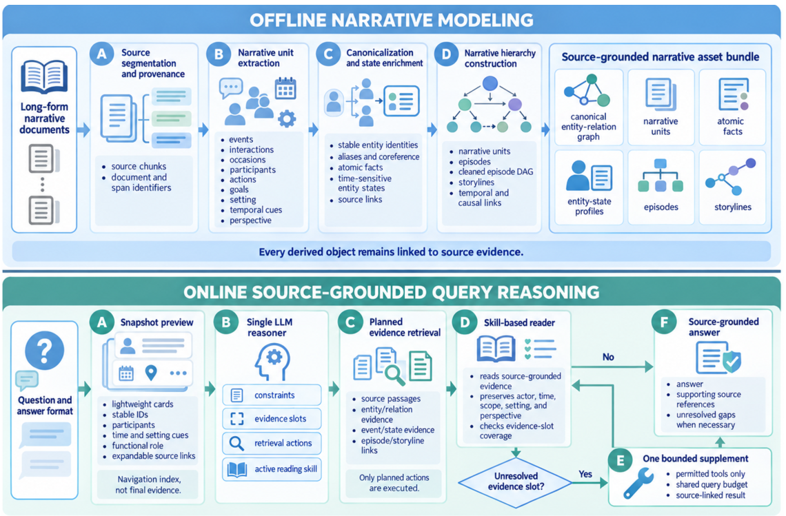
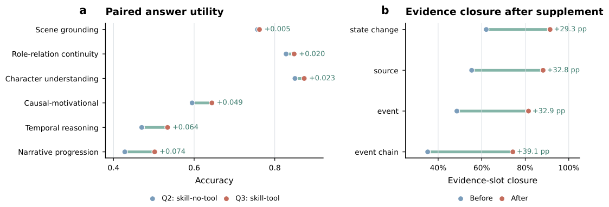

# Narrative Knowledge Weaver: Narrative-Centric Retrieval-Augmented Reasoning for Long-Form Text Understanding

> 阅读范围：本地匿名投稿 PDF 正文 §1–6、Limitations 与 Ethics（p.1–9）；补读附录 A.1 的 SABER / storyline 构建细节以及附录 B 的题型和规模消融。正文两幅原图完整插入。以下严格区分论文方法、观察结果与阅读者分析，去除了旧笔记末尾未展开的重复提纲。

## 这篇论文到底解决什么问题

NKW 面向长篇叙事问答。一个角色为什么改变决定，往往不能由“与问题最相似的一段”直接回答：需要先确认是谁，在什么时间相信或希望什么，哪次互动触发变化，以及后面观察到了什么结果。普通 chunk RAG 能找位置，实体图能连接对象，但二者不一定记录证据在故事中的功能。

NKW 的方法是把同一原文构造成彼此可回溯的多个视图：规范实体关系图、原子事实、动态人物档案、事件/互动/情境、episode 与 storyline；在线先看轻量导航卡片，规划需要的证据，再选一个阅读 skill 组装和审计答案。结构与在线过程共用 actor、state、goal、time、perspective 等字段，而不是先随意建图、再用通用 agent 盲目遍历。

主要收益集中在完整剧本的故事世界问答，尤其较大模型和 Pass@5。小模型的单次答案不一定改善，短篇或局部问题上轻量检索仍可能更好。这条边界贯穿主结果，不能简化成“叙事图普遍优于 RAG”。

## 1 Introduction：两个具体的不匹配（p.1–2）

第一，叙事证据有**功能**。同一段文字可能是动机前提、转折、后果、状态更新，或者只是碰巧同场景的干扰信息。why-question 检索到“角色作决定”的段落还不够，真正原因可能在更早的互动。语义相关、人物同现与因果支持是不同关系。

第二，人物和关系随剧情改变。稳定身份不等于静态属性：同一个人可以先信任、后怀疑，也可能表面说一件事、实际相信另一件事。如果只给这个人一份包含全剧信息的摘要，容易把后来知道的信息提前用于早期问题。NKW 因而先处理别名/代词归一，再保留带时间和来源的状态事实。

论文提出的三项贡献依次是证据架构、意图条件下的证据组装、受控评估。架构不是完全重建所有叙事理论层级，而是将其中对问答有操作意义的元素变成可检索对象；在线系统也不是每次查询所有通道，而只执行计划选定的操作。这让“建什么”与“问什么、怎么看”形成明确对应。

## 2 Related Work（p.2–3）

**叙事理论与理解。** QuALITY、FairytaleQA、STAGE 从较短文本到完整剧本测试叙事能力；相关理论强调情境中的变化、故事时间与呈现顺序的区别、状态转移与失衡。事件链、场景、转折点、角色弧等计算表示是 NKW 的背景。它最终采用三个可查询层级：底层 narrative units、中层 episodes、长程 storyline arcs，scene 作为来源有界的上下文，而不是机械地把每个理论术语都造一个节点。

**结构化知识与检索。** 文档级实体关系抽取和共指解决“谁与谁是同一对象、有什么关系”；GraphRAG/LightRAG/HippoRAG 等组织结构化检索；RAPTOR/HiRAG 用层次摘要或知识，DOS RAG 保留段落顺序。NKW 关注的是将稳定身份连接到变化状态，再把局部事件连接到剧情进展。

**叙事检索与在线控制。** ComoRAG、NarCo、ChronoRAG 分别涉及记忆工作区、回溯连贯和相邻时间上下文；A-RAG、RoG、ToG、KG-Agent 以及纠错 RAG 处理自适应检索与证据修订。NKW 的区别是把叙事功能、状态、层级和专门阅读操作一起约束，最终结论必须沿来源链回到原文。

## 3 The Narrative Knowledge Weaver Framework（p.3–5）

给定原文分块 $D=\{c_i\}_{i=1}^n$，离线构造：

$$
B=(G,U,F,P,H,X).
$$

$G$ 为规范实体—关系图，$U$ 为有来源的叙事单元，$F$ 为原子事实，$P$ 为实体状态档案，$H$ 为 episode/storyline 层次，$X$ 为来源链接。一次构造之后可被多个问题复用；在线并不默认把整个 $B$ 塞进上下文。

**图 1（p.4）解读。** 上半部分依次完成分段及来源、单元抽取、身份归一与状态丰富、层级构造；下半部分先形成 snapshot，再由一个 reasoner 输出约束、证据槽位、行动和 skill。Reader 若缺关键槽位，最多请求一轮有限补证；如果证据齐备就回答。最下面的 source-grounded answer 应带支持来源和未解缺口，不能将导航摘要直接当成事实。

### 3.1 Construction-Time Asset Building

#### 3.1.1 Entity–Relation Backbone

块级抽取器生成实体记录 $v=(\mathrm{name},\mathrm{type},\mathrm{desc},S_v)$ 和关系记录 $r=(u,v,\mathrm{desc},\mathrm{keywords},w,S_r)$。$S_v,S_r$ 指向来源，$w$ 是关系权重。实体类型包括角色、群体、地点、时间点、物件、机构、角色身份与概念；事件/episode 这些过程性对象保存在单独的类型化存储中。

多元陈述拆成二元边；缺失端点可用轻量、带来源的 proxy 表示。同名实体和同一端点对的关系在 upsert 时合并，同时同步图索引、向量索引、entity–chunk 和 relation–chunk 映射。关键是“合并表示”不等于改写原文证据：后续仍应能从图对象找到其具体措辞与上下文。

#### 3.1.2 Narrative Unit Extraction

与图并行抽取三类单元：

| 单元 | 记录什么 | 为什么不合成一种普通事件 |
|---|---|---|
| Event | 行动、发现、决定、到达离开、状态改变 | 对应发生了什么变化 |
| Interaction | 定向交流、冲突、合作、影响 | 对应谁对谁做了什么，方向尤其重要 |
| Occasion | 稳定情境、制度约束、社会规范、背景条件 | 说明行动所处环境，不一定发生变化 |

每个单元尽量记录参与者、行动和目标、明确说出的目标/理由、场景、故事时间与文本顺序、叙述者或聚焦视角、功能角色和来源范围。字段允许缺失：原文没有说出目标、精确时间或视角时保留 unknown，而不是为结构整齐去补一个貌似合理的故事解释。抽取器还产出原子事实与初始实体属性，后面用于跨块状态组合。

#### 3.1.3 Entity Canonicalization

图合并之后处理别名、代词和场景限定称呼，让同一角色、物件、地点、机构或计划对应统一 referent。映射更新参与者、互动端点、事实主客体、属性拥有者，但不重写自然语言证据。这样既便于统一查人，也保留“原文究竟用什么称呼”的审计路径。

不同单元的去向不同：occasion 作为上下文节点连到参与者/场景，event 和 interaction 留在叙事存储与向量索引，参与后续 episode 构造。不能把图理解为包办所有信息的一种唯一表示。身份归一出错会把两个人的状态混在一起，因此这是会向下游传播的关键风险。

#### 3.1.4 Entity Attribute and State Enrichment

实现中对图度至少为 2 的显著实体再访问其关联原文块，抽取状态、行动、目标、因果作用、心理状态与持久关系等实体特定事实。重复事实与重叠属性合并成紧凑字典和语义索引，但保留 before/after 与时间线索。

这里必须区分“角色最终状态”和“题目所问时刻状态”。一个人物后来发现骗局，不能把“知道真相”回写成全程属性。NKW 的 time-sensitive profile 支持从规范身份进入不同阶段，而不是为人物只存一段不带时态的性格小传。度阈值是论文报告实现的选择，也意味着孤立但关键的角色或物件可能获得较少丰富处理。

### 3.2 Global Episode and Storyline Construction

三个层级具有不同叙事范围：unit 记录局部变化或关系，episode 组织同一发展情境/目标中的若干单元，storyline 连接多个 episodes，显露较长的目标推进、障碍、转折和后果。层级向上传递的信息必须有原文支持，不能用高层摘要替没有结局的冲突自动补上 closure。

Episode 分组同时参考共同参与者和目标、时间/场景连续、因果依赖、视角兼容、语义相似及来源。候选形成是确定性的，可以再用 LLM 裁决或概括；不使用问答标签指导构建。episode 之间预测 causes、elaborates、precedes 等边，来源顺序只是一个信号，不能把文本相邻自动当作故事先后或因果。

**SABER 的作用。** 附录 A.1 解释了主文所说的 episode DAG 清理。给边置信度 $c(e)$ 与类型权重 $w_{\tau(e)}$，有效权重为 $s(e)=c(e)w_{\tau(e)}$。先标记可能被两跳路径覆盖的三角捷径，检测强连通分量，在环内删除最弱边并优先考虑已标为冗余的捷径，直到图无环。之后才让 LLM 判断仍有歧义的直达边是否完全被既有间接路径覆盖。

LLM 在这个阶段不能新建 episodes、加边、反转先后关系，或无依据删除支持链接。这样的限制降低了“图清理”变成再创作的风险，但去环仍依赖抽取与权重是否正确：如果真正的关联被低置信度误删，后续结构会受影响。

Storyline 不是只取一条最长路径。系统在深度和数量上受限地枚举源到汇的路径，放入 trie，拆出共同主干与有意义分支；按覆盖、连贯、来源支持和新增 episode 数挑链，对过长链切分并控制重叠。每条链生成目标、障碍、转折、状态改变、观察到的结果和保守的 resolution 状态，并保留 child episode 链接。Storyline 之间再记录 blocking、resolving、prerequisite、conflict、parallel 等关系。

### 3.3 Narrative-Grounded Retrieval and Reasoning

#### 3.3.1 Evidence Views

不同视图承担不同证据任务：原文提供精确措辞；原子事实提供紧凑命题；profile 提供角色状态关系；event/interaction/occasion 提供局部结构；episode/storyline 提供跨场景进展。每个都带 provenance，最终可以相互核对。

为防止一个显著实体的全部资料占满证据包，默认只附查询相关属性及相似度最高的五条原子事实，完整事实清单仍可通过允许的实体操作访问。这是检索预算与信息完整性的折中，不代表未入选事实被删除或从此不可查询。

#### 3.3.2 Snapshot-Guided Query Planning

系统先给 reasoner 看四类 snapshot cards：规范实体、原子断言、类型化叙事单元、episode/storyline threads。卡片带稳定 ID、参与者、时间/场景、状态/目标/功能角色及可展开链接。**卡片是导航索引，不是最终证据**；选择卡片后仍要展开原文或有来源记录才能支撑答案。

给问题 $q$、答案格式 $f$、preview $\Pi_q$，一个 LLM reasoner 输出：

$$
P_q=(C_q,S_q,A_q,K_q).
$$

$C_q$ 指 actor、范围、肯否极性与时间约束；$S_q$ 是待填的证据槽位；$A_q$ 是行动清单；$K_q$ 选一个主要阅读技能。例如“为何角色改变立场”，需要身份和先前状态、触发互动、后来变化三个槽位；字面问题则可能只展开一小段来源。首轮只执行 $A_q$，未选中的图或叙事通道不会暗中也检索一遍。

#### 3.3.3 Skill-Based Evidence Assembly

首轮检索及 reader 可写为：

$$
E_q^{(0)}=\operatorname{Retrieve}(B,A_q),\qquad
E_q=\operatorname{Reader}_{K_q}(q,f,C_q,E_q^{(0)}).
$$

| 主要 skill | 检查重点 |
|---|---|
| read-source | 字面命题、原文措辞及局部支持 |
| track-character-state | 规范身份、前后状态及知识/目标变化 |
| trace-causes-and-outcomes | 行动、动机、实际后果和因果连接 |
| resolve-narrative-perspective | 谁在讲述、谁在感知、某信念归属于谁 |

工具提供 source、event、relation、state-change、event-chain、scene、entity 七类证据操作，正文分别命名为 `find_source_evidence`、`find_event_evidence`、`find_relation_evidence`、`find_state_change`、`trace_event_chain`、`locate_scene`、`inspect_entity`。skill 定义阅读程序及许可工具，不是让 reader 任意调用所有工具。

Reader 对照 $C_q$ 检查 actor、时间、范围、极性、状态和视角。关键槽位足够时即可回答；若仍未解决，最多一轮补证、至多两个并行 evidence actions，必须绑定原有槽位并服从共享预算。所有被接纳的最终主张都保留证据来源。这个设计意在补“缺的证据”，不是通过无上限检索挑到某个满意答案。

## 4 Experimental Setup（p.5–6）

| 数据集 | 文档与问题规模 | 处理后平均长度 | 主要任务 |
|---|---|---:|---|
| STAGE | 151 部剧本：109 英文、42 中文；5,010 题 | 27,546 | 六种故事世界推理 |
| FairytaleQA | 278 个儿童故事；10,580 题 | 2,165 | 语义答案叙事问答 |
| QuALITY | 162 篇英文文章；2,523 道选择题 | 4,115 | 长文选择问答 |

长度对英文按空白分词计词，中文按字符，因此不能不加说明地将数字称作统一 token 数。STAGE 更长、跨场景依赖更多，是本文假设最直接的测试场景。

基线为 Hybrid RAG、GraphRAG、LightRAG、HippoRAG、A-RAG、DOS RAG。主实验 600-token chunks；附录在 40 部分层采样剧本上检查 400/600/800/1200。Backbone 覆盖七个设置：Qwen3 的 8B/30B/235B（non-thinking）、Llama-3.1 的 8B/70B/405B，以及 GPT-5.5；其中 Qwen3-30B 指 30B-A3B-Instruct-2507。

STAGE 与语义答案 FairytaleQA 用 DeepSeek-V4 对照问题与标准答案判正确，QuALITY 使用选项精确匹配。Overall 是每个 benchmark 的主要正确性指标；Pass@5 表示五个采样答案至少一个正确，不是多数投票答案，也不等于系统已经能识别并选择那一个正确候选。

## 5 Experimental Results and Analysis（p.6–8）

### 5.1 Main Results

**STAGE：Table 1 的 Overall 全模型比较。**

| Backbone | Hybrid | GraphRAG | LightRAG | HippoRAG | A-RAG | DOS RAG | NKW |
|---|---:|---:|---:|---:|---:|---:|---:|
| Qwen3-8B | .422 | .285 | .368 | .264 | .232 | .332 | .385 |
| Qwen3-30B | .514 | .303 | .387 | .319 | .298 | .415 | .589 |
| Qwen3-235B | .606 | .321 | .441 | .401 | .362 | .505 | .701 |
| Llama-3.1-8B | .385 | .292 | .342 | .272 | .215 | .311 | .372 |
| Llama-3.1-70B | .512 | .312 | .391 | .410 | .335 | .421 | .563 |
| Llama-3.1-405B | .611 | .352 | .453 | .487 | .395 | .519 | .653 |
| GPT-5.5 | .622 | .402 | .478 | .512 | .422 | .531 | .698 |

NKW 在五个 backbone 的 Overall 最高，两个 8B 模型例外：Qwen8B 比 Hybrid 低 3.7 个百分点，Llama8B 低 1.3 个百分点。Qwen235B 的 .701 比最强基线 .606 高 9.5 个百分点。应解释为大部分较强 backbone 能利用复杂证据结构，小模型仍可能承受规划与阅读负担；后一机制是对结果的解释，主表没有单独证明原因。

| Backbone | Hybrid Pass@5 | NKW Pass@5 | NKW Overall→Pass@5 |
|---|---:|---:|---:|
| Qwen3-8B | .464 | .501 | .385→.501 |
| Qwen3-30B | .556 | .664 | .589→.664 |
| Qwen3-235B | .646 | .815 | .701→.815 |
| Llama-3.1-8B | .412 | .485 | .372→.485 |
| Llama-3.1-70B | .555 | .643 | .563→.643 |
| Llama-3.1-405B | .638 | .743 | .653→.743 |
| GPT-5.5 | .652 | .811 | .698→.811 |

NKW 的 STAGE Pass@5 在所有七个 backbone 上高于所有基线，表中列最强 Overall 基线 Hybrid 作参照。它表明多次采样能覆盖更多正确证据路径，也显示单次选择的稳定性仍有改善空间，不能把 .815 当单次答题准确率。

**FairytaleQA / QuALITY：Table 2–3 的关键比较。** 为便于读出适用边界，下表保留每个 backbone 的 NKW 与最佳基线 Overall，以及 NKW Pass@5：

| 数据集 | Backbone | 最佳基线 Overall | NKW Overall | NKW Pass@5 |
|---|---|---|---:|---:|
| FairytaleQA | Qwen3-8B | HippoRAG .771 | .652 | .801 |
| FairytaleQA | Qwen3-30B | LightRAG .856 | .852 | .945 |
| FairytaleQA | Qwen3-235B | DOS RAG .892 | .875 | .955 |
| FairytaleQA | Llama-3.1-8B | Hybrid .722 | .684 | .751 |
| FairytaleQA | Llama-3.1-70B | Hybrid .813 | .819 | .861 |
| FairytaleQA | Llama-3.1-405B | DOS RAG .874 | .865 | .921 |
| FairytaleQA | GPT-5.5 | DOS RAG .901 | .884 | .941 |
| QuALITY | Qwen3-8B | DOS RAG .713 | .684 | .781 |
| QuALITY | Qwen3-30B | DOS RAG .775 | .758 | .865 |
| QuALITY | Qwen3-235B | DOS RAG .862 | .865 | .899 |
| QuALITY | Llama-3.1-8B | DOS RAG .655 | .612 | .664 |
| QuALITY | Llama-3.1-70B | DOS RAG .802 | .805 | .854 |
| QuALITY | Llama-3.1-405B | DOS RAG .858 | .861 | .891 |
| QuALITY | GPT-5.5 | DOS RAG .884 | .887 | .923 |

FairytaleQA 单次 Overall 上 NKW 只有 Llama70B 高于所有基线；QuALITY 为四个 backbone 最高，其中大模型优势常只有 .003。两个数据集的 Pass@5 则各有五个 backbone 最高，8B 例外由 LightRAG 领先。论文所谓 competitive 必须保留这层含义：并不是每个 passage-centered benchmark 都有显著单次收益。

原表 FairytaleQA 的 Llama405B Hybrid 出现 Overall=.849、Pass@5=.843，小于 Overall；若二者不是同一批采样或有独立估计，可能出现差异，但正文未在此解释。笔记不据此自行改数，也不把理论上“同五样本内至少一对”的单调性强加到未明确的采样细节。

### 5.2 Controlled Comparisons and Ablations

普通主表同时改变了表示和在线过程，不能单独归因于叙事结构。Table 4 让四种变体共享 reasoner/skill-reader/answer prompts、解码、最大最终证据预算，以及一轮补证协议，只改变证据提供方式。

| 变体（STAGE/Qwen235B） | 平均证据 tokens | p95 tokens | 补证率 | 平均补证 action | Overall | Pass@5 |
|---|---:|---:|---:|---:|---:|---:|
| HybridRAG + Agent + Skills | 8,140 | 11,250 | 76.5% | 1.45 | .628 | .692 |
| LightRAG + Skills | 7,620 | 10,840 | 72.8% | 1.32 | .471 | .635 |
| NKW w/o narrative assets | 6,950 | 9,420 | 68.4% | 1.24 | .648 | .742 |
| Full NKW | 7,210 | 9,650 | 64.2% | 1.15 | .701 | .815 |

Full NKW 比共享控制器的 Hybrid 高 7.3 个百分点，同时平均证据更少。去掉叙事资产降 5.3 个百分点。这比普通主表更有力地支持“表示提供了独立帮助”。但 common cap 指预算上限一致，并不是每题实际 token、总成本或离线构建量完全一样。表中 reasoner/reader 平均各 1 次，工具内部模型调用未计入 calls，不能拿该表声称全系统只调用两次模型。

**Table 5：逐个组件消融，所有数值为 Overall / Pass@5。**

| 变体 | STAGE | FairytaleQA | QuALITY |
|---|---|---|---|
| Full | .701 / .815 | .875 / .955 | .865 / .899 |
| w/o attributes | .671 / .772 | .851 / .921 | .817 / .871 |
| w/o narrative hierarchy | .648 / .742 | .860 / .931 | .789 / .842 |
| w/o graph refinement | .665 / .768 | .849 / .916 | .804 / .859 |
| w/o snapshot reasoner | .641 / .735 | .845 / .905 | .775 / .829 |
| w/o skill assembly | .625 / .705 | .835 / .885 | .755 / .809 |

五项去掉后都下降；在线 skill assembly 对 Overall 影响最大：STAGE −7.6、QuALITY −11.0 个百分点。离线 hierarchy 的收益在 STAGE 和 QuALITY 较大，在 FairytaleQA 仅 1.5 个百分点，符合较短故事未必需要更强全局层级的直觉。

题型分析进一步定位功能：去掉 attributes 对角色理解下降 6.6、关系连续下降 5.8 个百分点；去掉 hierarchy 对时间推理下降 12.7，对因果动机下降约 8.3。完整系统 Qwen235B 的时间推理 Overall=.534、剧情进展=.502，即使领先基线仍是相对困难部分。场景定位=.762、人物理解=.873、关系连续=.848 则较高。

跨规模消融显示去掉 skill assembly 在 Qwen8B/30B/235B 分别下降 7.0/6.9/7.6 个百分点。因此它在 NKW 内部始终有帮助，即使完整 NKW 在小模型下仍不如 Hybrid。组件有用与整体在所有场景最优，是两个不同层次的结论。

### 5.3 Skill and Tool Analysis

为了单独测“补充工具证据”而不把 skill、prompt、初始检索一起改变，Q2 skill-no-tool 与 Q3 skill-tool 共享同一问题、snapshot、reasoner plan、初始 source packet。只有 Q3 允许所选 skill 请求一轮有限补证。Rescued 是从错变对，Errors 是从对变错。

| 数据集（Table 6） | 补证率 | 救回 | 引入错误 | 不变 | Q2→Q3 accuracy | 净提升 | 额外延迟 p50 / p95 |
|---|---:|---:|---:|---:|---|---:|---|
| STAGE，N=5,010 | 64.2% | 226 | 45 | 4,739 | .665→.701 | +.036 | 8.5s / 18.2s |
| FairytaleQA，N=10,580 | 14.5% | 120 | 46 | 10,414 | .868→.875 | +.007 | 3.2s / 7.5s |
| QuALITY，N=2,523 | 8.3% | 45 | 12 | 2,466 | .852→.865 | +.013 | 2.8s / 6.4s |

净增益按 $(\mathrm{rescued}-\mathrm{errors})/N$ 计算，不能只报告救回数。STAGE 里 $(226-45)/5010\approx.0361$；补证确实有用，但也会引入错误。单次补证率高说明长剧本初始包更常留下未解决槽位，不代表所有工具都被调用，也不是循环次数无限增长。

**图 2（p.8）解读。** 左图显示 Q2→Q3：剧情进展 +.074、时间推理 +.064、因果动机 +.049，明显高于场景定位 +.005。右图显示来源、事件、状态变化、事件链四种证据能力的槽位完成率提高，其中 event chain +39.1 个百分点最大，source/event 分别 +32.8/+32.9，state change +29.3。slot closure 提高说明补到了计划认为缺失的证据，但它不是答案正确率，两者不能混成同一指标。

成本方面，40 剧本诊断子集上 NKW 每部离线构建 10.12 分钟、每题 36.45 秒；LightRAG 为 7.46 分钟/9.15 秒，GraphRAG 为 16.33 分钟/485.50 秒，DOS RAG 在线约 8.88 秒。这些是该子集和实现的测量，不是所有硬件、并发条件下的固定速度。NKW 相对轻量方法有明显额外开销，应在同一文档有很多问题、需长期复用资产时进一步考虑摊销价值。

## 6 Conclusion（p.8）

NKW 将事实、图、角色状态、互动和叙事层级对齐，使在线推理能从局部原文走到跨场景剧情，再沿来源链接返回验证。它最适合答案依赖状态变化、因果动机、时间与剧情推进的长篇问答。受控实验支持离线表示和在线组装都有贡献；有界补证在复杂题型更有用，但有成本和引错风险。

最值得记住的并非“图越复杂越好”，而是证据需要在故事中有明确作用，并保留可审计的时间、身份和视角。较小模型、局部问题和短篇文本可能更适合轻量检索；论文最后也把效率、稳定性、领域覆盖和来源审计列为后续方向。

## Limitations 与 Ethics（p.9）

构建质量依赖上游事件抽取、身份归一和事实提炼。错误合并、遗漏事件或误解因果会传到后续层级；来源链接帮助核验，却不会自动修复这些结构错误。在线 agent 还可能每次选择不同路径，造成单次答案方差。

论文每题只选一个 primary skill，没有隔离每个 skill 的独立因果贡献，也未研究多 skill 交互。因而“skill assembly 有效”的消融不能进一步推出四种技能分别贡献多少。三个叙事层级是工程化表示，不是对作者全局意图、完整 plot 或所有叙事理论层次的重建；原文未解决的目标和冲突应保留 uncertain。

研究使用已有公开或按许可获取的数据与模型，不重新分发原始剧本和专有权重，没有新招募参与者。伦理上主要风险是用户过度相信自动构造的故事图、把有来源链接的解释误认为唯一正确解读。框架面向作品分析与研究，不能据此自主判断现实中的人物。

## 对当前系统的启发（阅读者分析）

可以把 NKW 的设计拆成三条可检查契约：身份规范化不能抹去状态时间；高层结构必须能下钻到原文；在线新增检索必须回答一个明确的未解槽位。这样比简单记录“调用了几次工具”更能判断 agent 是否有效使用记忆。

若用于 SWPM 或写作记忆，需要进一步区分 reader 从已有文本推断的 story world 和 writer 接下来要维护的可编辑世界状态。NKW 在本文测的是读懂既有作品的 QA，不能直接把其结果宣称为长篇生成质量提升。更合适的迁移实验是先检查状态、因果和角色视角能否被可靠恢复，再测试它们对后续写作约束和修订的作用。
