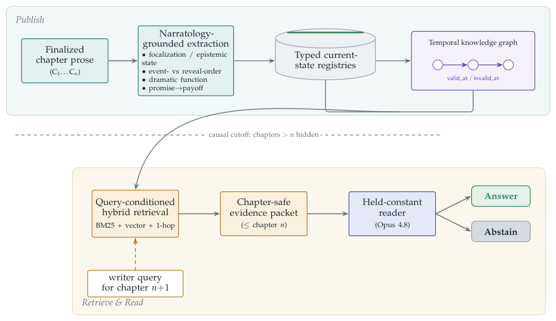
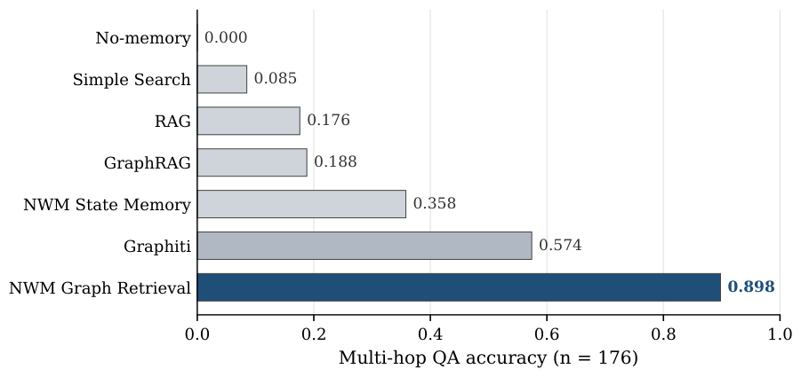
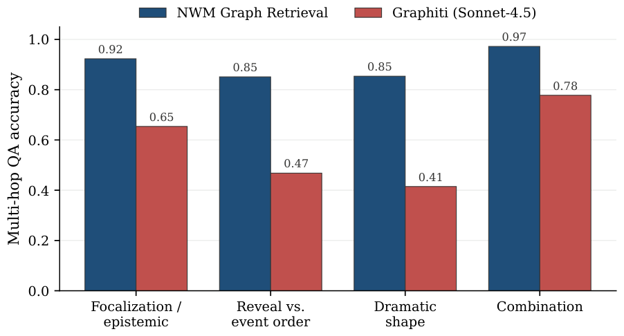
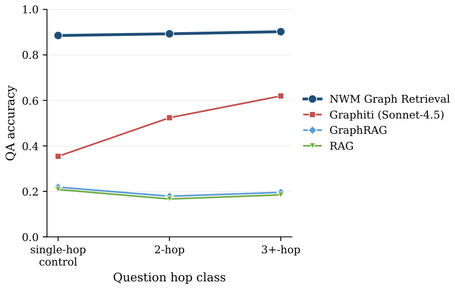

# Narrative World Model: Narratology-Grounded Writer Memory for Long-Form Fiction

> 阅读范围：完整正文 §1–9 与 Code and Data Availability（PDF p.1–10）；补读附录 A、F–I 以核实检索预算、oracle、类型消融与跨 reader 复验。插入正文 Figure 1，以及正文讨论直接引用的附录 Figure 2–4。这里的 world model 是写作场景的结构化记忆系统，论文实测的是记忆问答，没有完成长篇生成质量实验。

## 先记住三个结论边界

NWM 将已定稿章节写入带章节范围、证据和有效期的叙事记忆，再按问题做混合检索及一跳图展开。在相同 reader 下，其私有多跳问答准确率 .898，高于 Graphiti .574；公开全量 .625，高于 .516。说明该实现更常把回答所需的跨章证据交给 reader。

但“叙事类型标签本身带来优势”并没有被消融支持：去掉标签或将记录摊平成自然语言没有降低分数；本地重嵌入后去类型甚至更好。更有依据的解释是**分解出了哪些细粒度记录，以及按问题选择了哪些记录**，而不是标签名称自动赋予模型叙事能力。

另外，私有 176 题和公开 576 题的比较显著；公开 110 题多跳子集虽数值较高，但 $p=.054$，未达到常用 .05 阈值。不能概括为“两个语料的所有多跳比较都显著”。这些边界决定如何评价本文的表示贡献。

## 1 Introduction：写下一章之前，模型需要记得什么（p.1–2）

长篇生成的常见失败不是单个句子不流畅，而是忘了世界已经发生的变化：某人是否知道秘密、某物是否已转移、某个承诺是否兑现、人物关系何时转向。第 $N+1$ 章既要推进故事，又必须尊重前 $1\ldots N$ 章已定稿文本。

滚动摘要会丢掉暂时不显著但后续关键的细节。向量检索可能找出物件“曾经所在”的段落，却没有告诉作者它现在还是否在那里。通用实体图也未必显式保存角色知识边界、事件发生顺序与读者获知顺序、关系差量或 promise/payoff 状态。一个系统即使有原文，也可能拿错时间或视角的证据。

因此作者把问题集中到 multi-hop narratological QA：答案需要至少两章的证据，并依赖知识、揭示顺序、戏剧功能、铺垫兑现等叙事结构。用同一 reader 读取各系统自己的证据，旨在区分“答题模型更聪明”和“记忆系统确实给了更合适的信息”。

**图 1（p.2）解读。** 上方是 publish：只从 finalized prose 抽取叙事记录，写入当前状态 registries 和时序图；下方是 retrieve/read：给下一章的写作查询，只允许用 checkpoint 以前的证据，BM25、向量与一跳展开组成证据包，由固定 reader 回答或弃答。横向 cutoff 强调“后续章节和未来大纲不能偷偷进入当前记忆”。

贡献包括私有 176 道验证后的多跳题、一个公开可复现语料与 110 题子集、类型化时序状态系统、统一 reader 协议，以及 extractor-matched Graphiti 对照。标题中的 writer memory 指系统设计目的；这些结果仍是 QA 证据供给实验，不是生成故事的盲评结果。

## 2 Related Work（p.3）

**长篇生成和修订。** Hierarchical Story Generation、Plan-and-Write、Re3、DOC 通过中间计划、递归提示或细纲控制目标结构。NWM 的对象是章节写完之后已经被接受的状态，而非作者打算未来发生什么。计划可以修改，定稿事实需要版本与证据，这两类记忆不能混写。

**检索和长期记忆。** RAG/REALM、MemoryBank、MemGPT、Generative Agents、Mem0 等保存外部信息或长期交互事实。NWM 进一步把保存单元定为有类型、版本、章节范围的故事状态，并提供在当前 checkpoint 仍有效的切片。它关心的是“这个旧信息现在还成立吗”，不是一律让最新摘要覆盖更早信息。

**知识图与叙事 QA。** GraphRAG、HippoRAG、LightRAG 为图结构检索提供背景；HotpotQA、2WikiMultiHopQA、MuSiQue 说明多证据问题与单段检索不同，NarrativeQA 则面向故事理解。NWM 的 RLM QA 借鉴递归分解思路，但不是另训一个递归基础模型。

**叙事学与时间图。** Genette 区分谁看、谁说，以及故事事件与话语呈现顺序；Propp、Polti、Swain 等涉及事件功能、戏剧情境和动机—反应。Graphiti/Zep 是本文最接近的基线，记录事实何时有效、何时摄入的双时间图。NWM 把角色知识、reveal order、promise/payoff、focalized observer 和 dramatic function 变成专门字段。应把“Graphiti 是最强现有框架”理解为作者选择基线的表述，本文没有穷尽所有配置与所有记忆系统。

## 3 Narrative World Model（p.4–5）

### 3.1 Causal Publish Flow

设 $C_n$ 为已接受的第 $n$ 章正文，$M_n$ 为该章发布后的世界状态，$O_{n+1}$ 为下一章 scaffold：

$$
M_n=\operatorname{Publish}(C_n,M_{n-1}),
$$

$$
X_{n+1}=\operatorname{Retrieve}(M_n,O_{n+1}).
$$

$X_{n+1}$ 是下一章写作或查询可用的记忆包。未来 scaffold 可用来表达“要查询什么”，但不能被当作已经发生的证据写入 $M_n$。发布流程保存正文摘要、抽取类型化记录、合并 registries、投影图索引，再对外暴露完成状态。

抽取器是 Claude Sonnet 4.5，它从定稿正文直接产生 §3.2 的记录，每条带 source chapter 和 evidence span。Publish 是信息抽取，不是无损复制，因此它本身可能遗漏、误解或过度推断。若已发布章节被修改，republish 会使从该章派生的后续边失效，避免新正文与旧派生状态并存为有效事实。正文说明了这个更新原则，未在主实验单独报告大量回改情况下的正确性。

### 3.2 Schema Updates and Global Registries

| 记忆记录 | writer 可见字段 | 解决的具体混淆 |
|---|---|---|
| Chapter digest | 章节 ID、有来源摘要、证据范围 | 摘要结论是否能追到原文 |
| Scene/event | 地点、参与者、event order、reveal order、来源章 | 发生时间和揭示时间混为一谈 |
| Character state | 目标、已知/未知、状态、位置、关系变化 | 用后来知识替代当时认知 |
| Relationship state | 人物对、关系类型、极性/状态、有效期 | 将全剧关系压成静态友敌标签 |
| Object state | 物件、拥有者、位置、条件、最后证据 | 旧位置被近期摘要遗漏 |
| Plot/promise | 线索 ID、结构功能、开放/关闭、承诺兑现 | 有铺垫但未兑现被当作闭合 |
| Narrative function | 聚焦观察者、戏剧节拍、转折、读者知识 | 角色知道与读者知道不一致 |
| World fact | 事实、作用范围、有效章节区间、证据 | 局部规则错误推广为永恒全局事实 |

记录汇入角色、关系、地点、物件、活跃线索、承诺和世界规则等累计 registries，供第 $n+1$ 章使用截至 $n$ 的有效状态。一个物件在很早章节被放入某个抽屉，此后未提及，不意味着它已消失；如果没有改变位置的证据，registry 可继续保留这条 old-but-current 状态。

角色不知道某事实与正文没说明他知道，是需要谨慎区分的两种情况。Schema 有 knowledge/unknowns 槽位并不自动证明未知状态可靠，仍应由具体视角与来源支持。本文的优势假设是显式槽位引导抽取更细的证据，而不是要求抽取器自行替作者补全心理活动。

### 3.3 Temporal Knowledge Graph

KG 把 schema 投影成时序关系：角色知道某事实、物件位于某地或属于某人、关系极性改变、线索关闭、事件导致后续事件等。边带 source chapter、evidence、validity interval 和 confidence。

查询“截至第 $n$ 章”时，选择在 $n$ 有效且对于该实体/关系最新的边；旧边作为历史保留。被取代的状态区间闭合，仍成立的状态保持开放。一个早期事实仍可能是当前有效事实，不能只按文本日期取最新提及，也不能因为它旧就丢掉。

这里有两个时间维度须区分：**知识可见边界**由来源章节决定，防止读到未来揭示；**故事内部事件顺序**由 event order 表达，可以与正文顺序不同。一段第十章闪回讲第二章以前发生的事，事件早不代表角色或读者在第二章已经知道。检索要同时尊重 source cutoff 与问题指定的故事时间/认知状态。

### 3.4 Recursive Language-Model QA

RLM QA 是架在 NWM 上的递归验证器。它把叙事问题拆开，查询 schema 与图状态，汇集证据，输出支持轨迹；也可以整理续写前约束、检查候选章节是否引入无依据的状态改变。

这是系统能力描述，不是一个已单独消融验证的新增基础模型。本文主要评估统一 reader 对各自证据包的 QA，没有在主表分别量化 RLM 递归分解对长期生成一致性的独立收益。读到“可检查候选章节”时不能将其写成“已证明降低生成矛盾”。

### 3.5 Query-Conditioned Hybrid Retrieval

给问题 $q$ 与 checkpoint $n$，检索分四步（正文 p.5、附录 A.1 p.13）：

1. **章节过滤。** 先限制候选记录和边的来源章 $\le n$，写入和读取两处都执行时间边界。
2. **混合选种子。** 对实体与 seed nodes 结合 BM25 和稠密向量排序，用 reciprocal-rank fusion 合并结果，以兼顾精确名字/词语和语义相关。
3. **一跳图展开。** 从锚点展开受邻居数限制的一跳边及端点，补出知识、位置、关系变化、揭示、线索解决等关联。
4. **有界证据包。** 合并向量 hits、展开节点与边，重新排序并截断；reader 只看这一包。RLM QA 可在此做问题分解与证据核验。

“一跳展开”和“多跳问答”并不矛盾：一个记录可能已概括跨段状态，多种种子和各自邻域可同时提供来自不同章的几条证据。检索图遍历深度不是问题需要组合的来源数量，不能把它们当同一概念。

NWM State Memory 与 Graph Retrieval 使用同一底层 store。前者把 checkpoint 之前全部 typed memory 按序序列化到有界上下文，不做 query-specific search；后者按问题选择证据。这是本文最直接的内部检索对照，但前者实际采用位置前缀截断，后面会看到其失败主要来自这一打包策略。

### 3.6 Extraction and Baseline Independence

Simple Search 和 RAG 只索引章节文本；GraphRAG 从原文独立抽实体/事件图；Graphiti 将相同章节 episode 摄入双时间图；两种 NWM 条件读自身记忆。外部基线不接触 NWM 生成的 schema/registries，避免“基线也拿到了专门为 NWM 抽好的资产”破坏独立比较。

同时，Graphiti 主设置也使用 Sonnet 4.5，使基础抽取模型与 NWM 匹配；再用 GPT-4.1-mini 重摄入作敏感性检查。相同模型有助于排除“只有 NWM 用更强 LLM”这一解释，但相同模型不等于相同抽取质量：schema、prompt、分段、后处理仍可不同。因而不能仅凭这个对照就宣称已完全隔离表示、抽取与检索的每个贡献。

## 4 Evaluation: Narrative Memory QA（p.5–7）

### 4.1 Protocol

公开语料是 12 本公版书，覆盖六种类型，每本至少 20 章；私有语料是五本生产风格连载，每本 50 章，不能公开。外部基线和题目均从章节正文构建，不使用 NWM 记录作为标准答案来源。公开题目用 GPT-5.5 辅助策划，保存 evidence spans、required chapters、checkpoint、类别和策划来源。

| 评估集合 | 数量 | 构造/筛选规则 |
|---|---:|---|
| 私有多跳题 | 176 | 至少两章证据；过滤 top-1 的 360-word chunk 即可答的题；另一个更强模型判答案和多跳性 |
| 私有单跳控制 | 96 | 与多跳集合配套的单跳对照 |
| 私有合计 | 272 | 用于 Table 1 Overall |
| 公开全量 | 576 | 冻结的、直接按来源正文编写的问答集 |
| 公开多跳子集 | 110 | gold evidence 至少引用两个不同章节 |

私有多跳平衡覆盖 focalization/epistemic、reveal-vs-event order、dramatic-shape/setup-payoff、combination 四族。筛除“最相似一块就能答”的题提高难度，但它依赖特定检索器与 chunk 大小，不能保证对所有可能的单段选择都绝对不可答。公开多跳子集以跨章 gold evidence 定义，与私有的额外 hardness filter 并非完全同一构造协议。

一般 query taxonomy 还包括最新人物状态、知识边界、关系约束、物件位置、事件定位、承诺兑现、时间排序、世界规则、叙事功能及 source-needle 细节。它面向 writer 实际查记忆的问题，但也明显偏重 NWM 试图显式表示的结构。

**检索设置。** RAG 用 360-word chunks、80-word overlap、BGE-large、BM25 和 RRF；GraphRAG 按书建原文实体/事件图，以 seed nodes 加局部邻域检索；Graphiti 使用时间事实。全部按书和章节过滤，避免未来章节信息进入当前证据包。

**统一 reader 与打分。** 所有系统用 Opus 4.8，仅看自己的证据，必须返回 evidence IDs，证据不足则 abstain。最终不是由另一个 judge 给自由解释打主观分，而是采用确定性的 token-normalized support：直接答案字符串支持，或答案承载内容词与 gold 的覆盖达到至少一半。统计 item-weighted accuracy，报告 Wilson 95% 区间和同题配对 exact McNemar。

因此此处 accuracy 是**固定 token 支持规则下的答案正确性**，并非人类语义等价率。浅层关键词重叠可能被接受，正确改写也可能被罚。No Memory 被强制在无证据时弃答，零分是协议下的 evidence-free control，不能解释为 reader 对这些书完全没有预训练记忆。

## 5 Results（p.7–8）

### 5.1 Private Multi-Hop Comparison

| 记忆来源（Table 1） | Overall，272题 | Multi-hop，176题 | Control，96题 |
|---|---:|---:|---:|
| No Memory | .000 | .000 | .000 |
| Simple Search | .107 | .085 | .146 |
| RAG（BGE+BM25+RRF） | .184 | .176 | .198 |
| GraphRAG | .199 | .188 | .219 |
| NWM State Memory | .294 | .358 | .177 |
| Graphiti（Sonnet 4.5） | .496 | .574 | .354 |
| NWM Graph Retrieval | .893 | .898 | .885 |

Graph Retrieval 比 Graphiti 多跳高 32.4 个百分点，Wilson 区间为 [.844,.934]。McNemar 的 64–7 表示 64 题只有 NWM 对、7 题只有 Graphiti 对，不是 64 比 7 的全部答对数；$p<10^{-5}$ 表明在同题配对下差异显著。

同样的 store 若直接作为 State Memory 供给，多跳只有 .358；与 Graph Retrieval 的分歧为 101–6。这是非常大的检索/打包差距，说明“存着答案”远不等于“有限上下文里拿得出答案”。单跳控制 .885 也高于所有基线，收益并不限于多跳，但不应据此认为所有单跳任务都需要复杂图系统。

**图 2（附录 p.14，正文 §5.1 引用）解读。** 它直接画出主表多跳列，让两个断层更清楚：Graphiti 相对通用 GraphRAG 有大提升，说明时间事实结构有帮助；NWM 的 State Memory 与 Graph Retrieval 又差很大，说明查询条件化选择同样不可少。此图没有隔离每个组件，只呈现整体管线结果。

### 5.2 Public Comparison

| 记忆来源（Table 2） | 全量576题 | 多跳110题 |
|---|---:|---:|
| RAG | .314 | .291 |
| GraphRAG | .351 | .355 |
| NWM State Memory | .464 | .573 |
| Graphiti | .516 | .582 |
| NWM Graph Retrieval | .625 | .709 |

公开全量 NWM 对 Graphiti 高 10.9 个百分点，分歧 156–93，$p=.0001$；公开多跳高 12.7 个百分点，分歧 30–16，$p=.054$。多跳样本较少，点估计支持同方向，却不足以按 .05 阈值声称显著。不能用私有的强显著性替代公开子集自身的不确定性。

公开成绩低于私有也提醒我们，私有题集与结构化 schema 更契合不等于所有叙事问答都同样受益。两个语料的书籍、题型、构造方式和分布都不同，不应把它们的绝对分数视为同等难度的简单重复。

#### Extractor fairness：换抽取器是否改变 Graphiti

Graphiti 用匹配的 Sonnet 4.5，多跳 .574；换较便宜 GPT-4.1-mini 后 .585，配对 $p=.89$，没有证据显示准确率变化。图规模变化明显：matched 为 443 entities/3,600 fact edges，cheaper 为 491/2,226。更多边没有关闭与 NWM 的差距。

公开语料的 NWM 图为 7,136 nodes、16,951 edges；独立 GraphRAG 为 18,345/72,768，约 2.6 倍节点、4.3 倍边（附录 Table 3）。这反驳“图越大就越准”的简单解释，却不能仅凭规模差异证明叙事理论是唯一机制；节点内容、粒度、检索和证据包仍共同变化。

#### Representation ablation：论文把跨系统失误作为表示证据

在 64 道 NWM 对、Graphiti 错的私有多跳题里，Graphiti 全部弃答，所需 gold fact 在它的**检索证据**中缺失。题目涉及戏剧反讽、揭示顺序、铺垫兑现或知识边界变化。这支持“失败发生在给 reader 的证据不足”，而非 reader 明明看到了证据还推理错。

但检索包里不存在，不必然意味着底层任何通用 schema 都无法表达该信息；也可能是抽取遗漏、切分粒度或检索没有取到。作者称跨系统比较是 operative ablation，§8 又承认它同时改变多个因素。更严谨的归因需要在同一系统内比较叙事分解与同粒度、同预算的通用分解。

**图 3（附录 p.15，正文 §5.2 引用）解读。** NWM/Graphiti 在认知与聚焦约 .92/.65，揭示与事件顺序 .85/.47，戏剧形态 .85/.41，组合 .97/.78。最大的数值差距在戏剧形态与时间揭示类，符合需要跨章的 setup/payoff 或不同时间轴证据的任务设计。但这些族也是策划时特别选择的重点，不能直接代表所有文学理解能力。

## 6 Discussion：真正被证据支持的机制（p.8，辅以附录 F–I）

作者主文将优势解释为叙事结构被表示且被 query-conditioned retrieval 取出。需要把这句话拆开检验，尤其不能忽略后面去类型实验的反例。

### 论证拆解：同一 store 为什么直接序列化会失败

附录 F 给出关键实施细节：State Memory 上下文中位数约 228k **characters**（约57k tokens），reader 证据预算只有 12k characters（约3k tokens）。全部176题的 State Memory 都超预算，按章节顺序截成前缀，约保留前1–3章、丢弃95%的 store。

| State Memory 错而 Graph Retrieval 对的101题 | 数量 | 比例 |
|---|---:|---:|
| gold 在12k范围内，reader仍错 | 15 | 14.9% |
| gold 在store里但被位置截断 | 84 | 83.2% |
| gold 不在store里 | 2 | 2.0% |

因此内部收益主要证明“按问题挑选记录优于固定章节前缀截断”。它不是证明将全部当前状态做任何合理压缩/排序都必然失败，也不能代表一个最佳的 current-state baseline。作者称预算相同是公平控制，这是上限公平；具体序列化策略仍构成弱基线因素，需要在阅读中保留。

### 论证拆解：Oracle 与全上下文说明什么

给 reader 完整 gold chapters，176题全对（1.000），修复 NWM 剩余18错，配对约 $p=8\times10^{-6}$。为放入这些章节，oracle 预算提升到60k characters，gold evidence 中位数约14k characters，所以不是与主实验等预算的比较。它说明给足正确来源后 reader 可以答这些题，不能单独排除原预算下的 reader困难。

再给全部已发生章节，中位约80k tokens，准确率 .852，低于 NWM .898 但差异不显著（22–14，$p=.24$）。这说明全上下文在该实验未明显超过检索切片，而非“显著输给 NWM”。全部上下文仍远低于只给 gold chapters，符合无关内容稀释证据的解释。

**预算单位核对。** 附录 F 明确写主 reader 12k characters≈3k tokens，附录 G 表格却把 retrieved slice 的约12k和 gold的约14k列在 `tokens` 栏，而前文又称 gold median约14k characters。原稿这处字符/token单位不一致；本笔记保留源值与差异，不依据该表直接宣称严格的“七倍token节省”。准确成本需查实际运行记录。

### 论证拆解：去掉类型标签没有损害表现

| Reader侧对照：检索结果完全相同（附录 H） | 多跳accuracy | 相对完整模型 McNemar p |
|---|---:|---:|
| 完整typed packet | .898 | — |
| 去掉relation/type标签 | .909 | .62 |
| typed records摊成自然语言 | .926 | .12 |

这说明 reader 主要使用记录内容，未依赖显式类型名；去掉冗长结构也可能释放上下文，但该解释未被单独证实。数值上升未显著，不能反过来声称“去标签一定更好”。

更进一步，作者把所有边合成一种通用关系，移除节点 embedding 文本中的类型词，再重新嵌入和选种子。top-10 seed 集合 Jaccard 平均降到 .31，176题无一保持完全相同的种子，因此这确实改变检索而不仅改变显示。

| 检索侧本地BGE管线 | 多跳accuracy |
|---|---:|
| Typed graph | .807 |
| Untyped graph，重新选种子 | .886 |

去类型提升7.9个百分点，配对 $p=.009$。这个实验因生产向量端点受限，使用本地 BGE，不能把 .807 直接与生产版本 .898作单因素比较；但在同一局部管线内，标签没有显示正贡献。更支持的设计要点是“记录分解与检索条件化”，而叙事特定分解是否优于任意细粒度分解仍未验证。

### 论证拆解：跳数与换reader的稳健性

**图 4（附录 p.15，正文 §6 引用）解读。** NWM在单跳到3+跳保持较高，Graphiti随这些分组的跳数上升而改善，平面检索较低。不能由此推出“问题跳数越多越容易”：各组不是同一题通过随机增加一跳得到，题型和可表示性可能变化。图支持的是这些分组中图系统的相对表现，不是跳数的独立因果效应。

由于题目裁决与主要reader同属Anthropic，附录I让Gemini3.1 Pro读取字节级相同的缓存证据。NWM .898→.841，Graphiti .574→.432，State .358→.295，GraphRAG .188→.131，RAG .176→.176，oracle 1.000→.994。NWM对Graphiti的分歧80–8，约 $p=5\times10^{-16}$，核心比较保持。低分区GraphRAG与RAG的名次交换，所以不能照抄“所有系统排序完全不变”。

## 7 Toward Generation and Writer-Workflow Evaluation（p.9）

作者明确把生成实验列为下一步：让同一故事在匹配记忆条件下继续写10–15章，测矛盾、实体/人物/关系一致性、更难的组合QA、writer修正负担和盲法成对人评；还要检验KG/RLM是否改善时间消歧、矛盾检测，以及检索到的状态如何真正约束正文。

这一节是**未来实验方案**，不是已经观察到生成变好的结果。记忆能答对问题只是必要条件：生成器仍可能不使用证据、选择错误推进方式，或为了服从状态变得平淡。对当前工作最有价值的做法是保持memory-QA与writer-loop两个评估层分离，然后通过有控制的续写实验把它们连接起来。

## 8 Limitations（p.9）

**类型贡献未被隔离。** 跨系统比较同时变化schema、抽取、检索、打包；去标签实验无退化，说明不能把贡献归因于类型名字。尚缺叙事分解与通用细粒度分解对照，生产向量级去类型也未完成。

**统计功效。** 公开110题多跳$p=.054$只是方向性证据，显著结论由私有176题和公开576题全量支撑。不能用“underpowered”作理由将不显著结果描述成显著。

**benchmark倾向。** 私有题集有意围绕聚焦/知识、reveal order、戏剧形态和组合，正是NWM的结构重点。结果应解释为叙事多跳问题上的比较，不是任意story QA的通用胜出。

**自动打分。** token coverage不等同人类理解，可能漏判改写、接纳浅匹配。固定规则使比较可重复，但仍需要人类或语义judge的一致性验证。

**数据和工作流范围。** 公开公版语料可复现；生产连载和后台不能公开。无记忆行为是弃答控制；生成质量仍属未来工作。当前样本不验证无限章数或跨语言泛化。

**基线配置。** GraphRAG是按章节、按书、seed加局部邻域的具体实现，并非Microsoft GraphRAG全局community-summary模式；Graphiti是默认配置加匹配抽取模型。结论针对这些可重现配置，不能代表所有调优后的图检索或时间记忆方法。

## 9 Conclusion（p.9–10）

NWM在固定reader、章节安全的证据协议下，比所测Graphiti和图/平面检索基线更好地支持故事状态问答，尤其私有多跳设置。其优势不是仅由更强extractor或更大图解释，同一store按问题检索远优于前缀序列化。

结合全文而非只看摘要，最可信的结论是：**细粒度的叙事状态分解与查询相关的证据选择能改善该任务的证据供给；类型标签本身的收益未获支持，真实续写收益尚待验证。** 这同时保留主结果的价值与消融对归因施加的限制。

## Code and Data Availability（p.10）

公开benchmark来自Project Gutenberg，题目构建、固定reader、检索基线和评分协议可在该语料重现；私有五书语料、其多跳题集和生产NWM backend不公开。私有结果用Book A–E及固定化名展示。因而“公开协议可复现”不意味着生产系统全部代码和全部主结果数据都可独立取得。

## 对当前研究的启发（阅读者分析）

与NKW相比，NWM更突出writer发布/回改与当前有效状态，NKW更突出reader对既有作品的episode/storyline证据组装。两个方向可以共享来源、时间、身份、状态字段，但应保留输入对象与评测目标的区别。

若做SWPM的因果实验，建议在相同抽取模型、同等粒度和预算下比较三件事：叙事特定记录与通用细粒度记录；query-ranked证据与有竞争力的状态压缩；有无写作前后验证。对失败还应分别标注store缺失、检索未取到、被截断、reader误用、writer未遵守，避免把整个管线的收益都归给一个“世界模型”名称。
