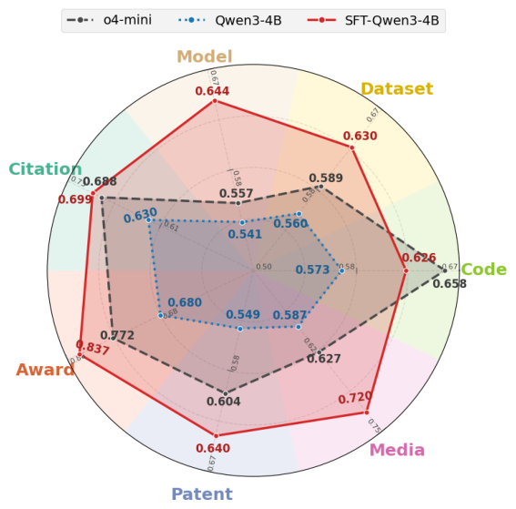
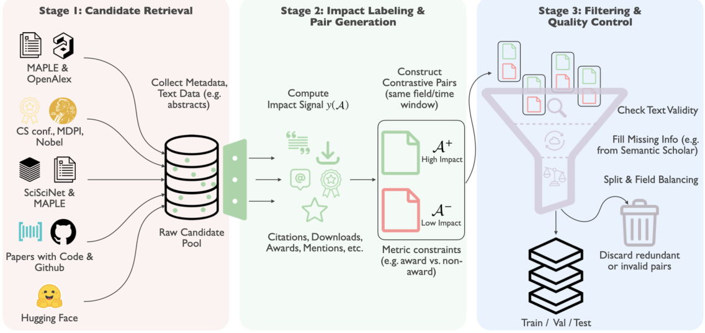
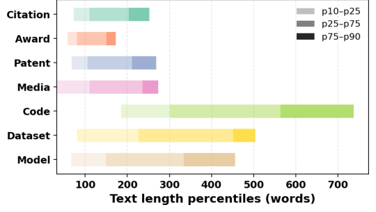
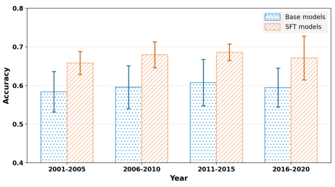

# SciImpact: A Multi-Dimensional, Multi-Field Benchmark for Scientific Impact Prediction

> 阅读范围：本地 PDF 正文 §1–5，以及 Limitations / Ethical Considerations（p.1–10）；补读附录 E 的显式流行度泄漏审计。正文四张图均嵌入对应解释处。此文的 prediction 是文本条件下的历史成对分类，作者明确承认它不是严格的事前预测 benchmark。

## 先理解任务，避免把“影响力”混成一个分数

SciImpact 将科学影响分成七个维度：引用、获奖、专利引用、媒体关注、代码采用、数据集采用、模型采用。输入是同领域的两个论文或相关 artifact 的文本，输出哪个在指定维度上有更高的已记录影响。指标是二选一准确率，不是预测将来具体能获得多少引用、下载或奖金。

论文的主要贡献是把不同来源的影响信号整理成一个跨 19 个领域的大规模比较数据集，并展示专门训练的小模型能显著改善这种判断。它没有提出一个新的因果影响力定义，也没有证明仅凭摘要可以可靠决定科研资助。完整阅读应沿着“七个标签怎样获得—怎样构造成对任务—模型从哪种文本作判断—哪些维度和学科更难—训练收益和泄漏如何解释”展开。

## 1 Introduction：为什么仅预测引用不够（p.1–3）

引用是最常见的科学影响代理，但它主要描述学术共同体中的传播。获奖反映某个评选群体的认可；专利引用与技术转化有关；媒体和社交关注反映更广的公共传播；代码仓库、数据集、模型的采用则反映研究产物在其他工作中的使用。这些信号相关，却不完全可互换。

例如，一篇被大量下载的数据集论文不一定获得最多学术引用；一项研究可以在特定社区获得奖项，但对工业采用影响有限。把这些信号压成单一分数，会掩盖模型究竟擅长辨认何种影响。原文 Table 1 对比既有资源：有的数据同时覆盖 citation、award、patent、media，另有资源专门关注数据集或模型卡；SciImpact 的整合作用是将这七类放到统一成对接口，并扩展到自然科学、工程、社科与人文等领域。

**图 1（p.1）解读。** 蓝线是原生 Qwen3-4B，红线是 SFT 后的同规模模型，黑线是 o4-mini。红线相对蓝线在每个维度都向外扩展，说明训练有效；但在 Code 上 o4-mini 的 .658 仍高于 SFT-Qwen3 的 .626，不能把图概括为“小模型每一项都超过闭源模型”。不同轴上差距不同，也正是需要分维度评测的理由。

论文评估 11 个现成 LLM（3 个闭源、8 个开放权重），再加两个 SFT 变体。摘要给出 215,928 对样本；后文表 3 各行之和与该总数存在差异，具体在 §3.4 保留核对记录。

## 2 Related Work（p.3）

### 2.1 Evolution of Scientific Impact Prediction

早期工作从作者历史和文献计量特征预测未来引用；后续模型加入时间衰减、累积优势、不同引用轨迹，再用序列模型和审稿文本等辅助信号。LLM 则让直接利用论文文本推断影响成为可能。

另一方面，代码 star、模型和数据下载、专利、媒体、政策文件各自有研究传统。问题不在这些信号此前完全无人使用，而在缺少统一、多领域、多维度的评测方式。SciImpact 将多个具体影响信号都转换为“同维度内哪一个更高”，从而减少量纲不同带来的比较困难；这种统一也牺牲了绝对影响规模的信息。

### 2.2 Datasets for Science Literature Analysis

论文梳理 MAG、OpenAlex、MAPLE、SciSciNet 等资源。MAG 提供历史学术图谱与领域标识，OpenAlex 补充开放元数据和引用，MAPLE 支持领域对应，SciSciNet 把论文连接到外部影响信号。不同数据源的标识、文本完整性和覆盖范围不一致，所以这项工作的工程核心包括跨源对齐、缺失信息补抓和质量控制，而非仅下载一个现成表格。

## 3 SciImpact Benchmark：从 artifact 到可比较样本（p.3–6）

每个实例是 $(A^+,A^-)$：在指定维度下，$A^+$ 的影响指标 $y(A^+)$ 高于 $y(A^-)$。“Artifact”不仅指论文，也可能指代码 README、数据集卡或模型卡。19 个领域覆盖艺术、生物、商业、化学、计算机、经济、工程、环境科学、地理、地质、历史、材料、数学、医学、哲学、物理、政治学、心理学和社会学。

**图 2（p.4）解读。** 第一阶段连接不同来源并取得文本和影响指标；第二阶段按领域及维度规则形成高低影响对；第三阶段补齐文本、平衡数据并去重。图中提到 time window，并不意味着每个维度都执行了同年匹配：正文只对特定维度给出年份、venue 或作者的相应约束，应逐项阅读。

### 3.1 Stage 1: Candidate Retrieval

**Citation。** 从 MAPLE 取每个领域 top-100 venues 的论文，限定发表年份为 2001–2020，以便引用有积累时间，再与 OpenAlex 对齐，取标题、摘要、年份及截至 2025 年中的引用数。成对论文要求同年发表，减少“旧论文有更久积累时间”这一显然混杂因素。因此 2001 年的样本与 2020 年的样本代表不同长短的影响窗口，但同一对之内比较年龄相同的论文。

**Award。** 计算机取主要会议 Best Paper Award；物理、化学、医学取与 Nobel Prize 对应的论文；其他领域取 MDPI Best Paper Awards。通过 DOI 连接 OpenAlex。奖项是布尔标签：获奖为真，未获奖为假。Best Paper 的负样本要求与获奖论文同 venue；Nobel 的负样本要求同一科学家作者，试图比较其不同工作。正文并没有声明所有 Award 对都同年，也没有让模型直接预测作者得奖概率。

**Patent 与 Media。** 从 SciSciNet 获取论文被专利、新闻或社交帖引用的次数，通过 MAG 标识与 MAPLE 对齐领域。政策文件因相应资源非公开、访问受限而未纳入。Media 混合新闻和社交提及，是注意力信号，不等同正面评价或公众受益。

**Code。** 从 Papers with Code 找论文对应 GitHub 仓库，保留至少 10 stars 且 README 不缺失、不极短的仓库，用 GitHub REST API 收集 star 数作为标签，README 作为输入。Star 是关注或收藏，不必然代表真正生产使用，这个代理含义应与“代码采用”名称区分。

**Dataset 与 Model。** 从已有 Hugging Face 数据集卡与模型卡资源取得文本和平台下载统计。输入分别是 dataset card、model card；下载次数形成标签。平台生态、文档写法和可见性都可能影响下载，因而这里并非只在测论文科学内容本身。

### 3.2 Stage 2: Impact Labeling and Pair Generation

同一维度、同一领域内配对，按 §3.1 的适用条件进一步匹配年份、venue 或作者。计数型维度要求两个 artifact 都有一定活动量，且高者至少是低者两倍，避免用一个几乎无人使用的产物与一个常见产物构成过于琐碎的对比，也避免差距小到容易受计数噪声影响。

| 维度（Table 2） | $y(A)$ 的实际含义 | 配对门槛 |
|---|---|---|
| Citation | 引用数 | 两者均 ≥10；高/低 ≥2 |
| Award | 相应奖项认可 | 一个获奖，一个未获奖 |
| Patent | 专利引用数 | 两者均 ≥5；高/低 ≥2 |
| Media | 新闻及社交提及数 | 两者均 ≥5；高/低 ≥2 |
| Code | GitHub stars | 两者均 ≥10；高/低 ≥2 |
| Dataset | Hugging Face 下载数 | 两者均 ≥10；高/低 ≥2 |
| Model | Hugging Face 下载数 | 两者均 ≥10；高/低 ≥2 |

因此这个 benchmark 偏向辨别已有显著差距且达到最低活跃门槛的对象。它未直接评估冷启动的零引用论文、几乎无人下载的新模型，或影响非常接近的边界案例。把成对准确率外推成对所有新论文的排序能力，需要新的验证。

### 3.3 Stage 3: Filtering and Quality Control

作者优先保留标题、摘要或卡片文本完整的样本，删除明显无效输入；对缺失文本，尝试用标识或标题从 Semantic Scholar 等来源重新获取，只保留可靠匹配。跨源链接造成的重复 pair 会被移除。

字段覆盖采用目标配额：计算机、物理、化学、医学的 train/validation/test 目标是 4,000/3,000/3,000 对，其他每个领域为 400/300/300；数量不足则保留全部。这里是目标而非每个单元实际达到的数量。正文描述了 pair 去重，但未在此详细给出不同集合之间是否完全 paper-disjoint 的规则；若复现或用于泛化比较，应进一步查明共享论文或共享仓库能否跨 split 出现。

### 3.4 Dataset Statistics

| 维度（Table 3，p.5） | 配对数 | 单 artifact 平均词数 | 每对平均词数 |
|---|---:|---:|---:|
| Citation | 43,309 | 156.9 | 313.8 |
| Award | 42,033 | 114.8 | 229.6 |
| Patent | 45,745 | 160.2 | 320.5 |
| Media | 52,739 | 166.8 | 333.6 |
| Code | 9,193 | 448.9 | 897.8 |
| Dataset | 10,517 | 344.8 | 689.5 |
| Model | 12,463 | 257.6 | 515.2 |

**数量核对。** 上表逐项照录 PDF，求和为 215,999，与摘要/引言的 215,928 相差 71。原稿未在相邻正文解释这个差异，本笔记不替作者改数字，也不把两者说成已经一致。需要使用实际发布数据时，应以 release 文件计数为准。

**图 3（p.5）解读。** 颜色深浅对应 p10–p25、p25–p75、p75–p90 的词数区间。摘要类输入较短且集中，README 更长、变异也更大，数据与模型卡居中。这个图说明跨维度差异不仅来自标签，还来自输入材料类型与信息量；不能将所有准确率差异归因于“模型更懂哪个影响概念”。

## 4 Experiments：统一文本接口下比较模型（p.6–9）

### 4.1 Task Setup and Evaluation Protocol

Citation/Award/Patent/Media 使用标题与摘要；Code/Dataset/Model 使用 README 或卡片文本。必要时输入截断到最多 1,000 词。Prompt 明确目标维度，并要求只输出两个许可句子中的一个，例如“Paper A won the Best Paper Award”或对应 B 的句子。通过精确字符串解析结果，不要求模型提供理由。

测试中较高影响对象在 A/B 两个位置各有 50% 概率，所以随机或固定位置猜测基线为 .5。准确率表示正确辨认 $A^+$ 的比例。它测的是相对判别能力，不能给出绝对预测误差、置信校准，也不告诉我们模型正确时用了什么证据。

开放模型包括三种 LLaMA、三种 Qwen、Ministral-3-3B 与 Nemotron-3-Nano-30B；闭源为 GPT-4.1-mini、o4-mini、Claude-haiku-4.5。这个名单是本文实验设置，不是当前所有模型的完整能力排名。

### 4.2 Supervised Fine-tuning Setup

Qwen3-4B 与 LLaMA-3.2-3B 在所有领域和维度的训练集合并后进行多任务指令 SFT，超参在同样聚合的 validation 上选择。使用 LLaMA-Factory 的全参数微调与四张 H20。监督输出是成对判断标签，不是解释链，也不是关于影响形成机制的因果注释。

这使得模型学习在不同任务提示下利用不同文本线索；判断 Code 时看文档的可用性信号，判断 Award 时可能看贡献表达等。但论文未通过机制实验证明它究竟学到了哪些线索，因此这些只能作为解释候选。

### 4.3 Main Results

**按影响维度的完整结果（Table 4，p.7）。** 原表尺度为 0–1 的 pairwise accuracy；Average 是七个维度等权平均，不能等同所有样本合并的准确率。

| 模型 | Citation | Award | Patent | Media | Code | Dataset | Model | Avg. |
|---|---:|---:|---:|---:|---:|---:|---:|---:|
| GPT-4.1-mini | .664 | .745 | .592 | .608 | .603 | .596 | .572 | .626 |
| o4-mini | .688 | .772 | .604 | .627 | .658 | .589 | .557 | .642 |
| Claude-haiku-4.5 | .662 | .780 | .596 | .632 | .626 | .602 | .542 | .634 |
| LLaMA-3.2-3B | .534 | .539 | .534 | .517 | .513 | .526 | .548 | .530 |
| LLaMA-3-8B | .552 | .625 | .534 | .594 | .547 | .549 | .534 | .562 |
| LLaMA-3.1-8B | .579 | .652 | .534 | .589 | .525 | .534 | .535 | .564 |
| Qwen3-4B | .630 | .680 | .549 | .587 | .573 | .560 | .541 | .589 |
| Qwen2.5-7B | .601 | .646 | .557 | .604 | .563 | .592 | .560 | .589 |
| Qwen2.5-14B | .565 | .672 | .586 | .620 | .577 | .561 | .562 | .592 |
| Ministral-3-3B | .559 | .642 | .536 | .607 | .542 | .503 | .519 | .558 |
| Nemotron-3-Nano-30B | .537 | .618 | .500 | .504 | .528 | .565 | .549 | .543 |
| SFT-LLaMA-3.2-3B | .653 | .806 | .629 | .697 | .618 | .618 | .625 | .664 |
| SFT-Qwen3-4B | .699 | .837 | .640 | .720 | .626 | .630 | .644 | .685 |

Qwen3-4B 从 .589 到 .685，增加 9.6 个百分点；LLaMA-3.2-3B 从 .530 到 .664，增加 13.4 个百分点。SFT-Qwen 的均值比 o4-mini 的 .642 高 4.3 个百分点，也超过更大的开放模型。这说明针对任务的数据训练能显著提升这个判别任务，参数规模本身不是最主要决定因素。

但分项不能忽略：SFT-Qwen 的 Code=.626 仍低于 o4-mini .658，专利/模型/数据集仍只有约 .63–.64，距离可靠决策有明显空间。Award=.837 则高得多，提示不同影响标签的文本可判别性差异很大。

**按科学领域的完整结果（Table 5，p.8）。** Other Fields 合并剩余领域；此表 Average 按表内五组聚合，与上表七维平均不同。

| 模型 | 计算机 | 物理 | 化学 | 医学 | Other Fields | Avg. |
|---|---:|---:|---:|---:|---:|---:|
| GPT-4.1-mini | .625 | .706 | .685 | .673 | .586 | .655 |
| o4-mini | .639 | .730 | .690 | .710 | .617 | .677 |
| Claude-haiku-4.5 | .631 | .680 | .694 | .730 | .615 | .670 |
| LLaMA-3.2-3B | .533 | .541 | .528 | .525 | .531 | .532 |
| LLaMA-3-8B | .561 | .616 | .585 | .556 | .551 | .574 |
| LLaMA-3.1-8B | .560 | .644 | .607 | .552 | .559 | .584 |
| Qwen3-4B | .590 | .653 | .633 | .607 | .577 | .612 |
| Qwen2.5-7B | .587 | .661 | .617 | .579 | .565 | .602 |
| Qwen2.5-14B | .597 | .684 | .594 | .597 | .585 | .612 |
| Ministral-3-3B | .547 | .619 | .616 | .577 | .556 | .583 |
| Nemotron-3-Nano-30B | .544 | .525 | .578 | .533 | .510 | .538 |
| SFT-LLaMA-3.2-3B | .652 | .700 | .718 | .722 | .681 | .695 |
| SFT-Qwen3-4B | .669 | .717 | .768 | .743 | .704 | .720 |

物理最优是 o4-mini .730，SFT-Qwen 为 .717；其余表内领域组 SFT-Qwen 最强。作者的无重复双因素 ANOVA 与后续比较显示维度和领域差异显著：计算机与 Other Fields 比化学、医学、物理更难，六组成对比较均 $p<.01$。这说明平均分不能掩盖学科差异，但领域同时对应不同 Award 子类型及信号覆盖，不能把全部差异归因于学科文本本质上更易或更难。

#### 多维训练是否具有互补性

单维 SFT 为每个维度各训练一个 checkpoint，在对应维度测试，再求平均；多维 SFT 是一个统一模型看所有维度。结果为：

| 训练方式（Table 6） | Qwen3-4B | LLaMA-3.2-3B |
|---|---:|---:|
| Untuned | .589 | .530 |
| Single-Dimension SFT | .632 | .542 |
| Multi-Dimension SFT | .685 | .664 |

多维训练比单维分别高 5.3、12.2 个百分点，支持跨维度数据提供有用的共同监督。不过多维也接触更多训练数据，正文这个对照没有单独排除训练规模收益；将结果解释为“只因不同信号在机制上互补”会超出证据。

#### Award 为什么特别容易

| Award 子类（Table 7） | Base models 平均 | SFT models 平均 |
|---|---:|---:|
| Best Paper Award | .606 | .748 |
| Nobel Prize | .737 | .898 |

作者提出两个解释：奖项由相对有限的评委群体判断，其偏好可能比全社会的引用或采用行为更集中；著名发现可能有容易辨识的内容标志。Nobel 论文又更可能在预训练语料中被广泛讨论，因此历史知识和记忆也能帮助辨认。后者意味着高分未必来自真正的前瞻科学眼光。上述均属解释性推测，表本身没有区分各机制的贡献。

#### 发表时期是否改变难度

**图 4（p.8）解读。** 横轴为 2001–2005、2006–2010、2011–2015、2016–2020；蓝柱是 base 模型平均，橙柱是 SFT 平均。误差线是同一时间分箱内不同模型准确率的标准差，不是样本级置信区间。各时期 SFT 都更高，而年份越老并未呈现持续更容易的单调关系。

论文认为只给标题摘要、不给年份/早期引用轨迹等特征，弱化了显式年龄线索。应注意“没有明显年代趋势”不等于已经排除模型记忆：某些经典论文仍可从内容被认出，且研究年代还与主题和文体共同变化。

#### 显式流行度泄漏审计（附录 E，p.13–14）

结构化 stars/downloads 计数只用于标签，不直接作为输入。但 README 或卡片中可能自带徽章、下载数字、popular/trending 等描述。作者删除这些显式线索后重新评估。SFT-Qwen 的 Code 变为 .636（+.010）、Dataset .628（−.002）、Model .644（无变化）；SFT-LLaMA 三项变化分别 +.001、+.001、+.003。至少对这些模型，表现并非主要靠直接读出页面里的数字。

这种清理只能检验显式文本泄漏，不能排除项目名、著名方法描述、隐含知名度或模型预训练记忆。正文提出“SFT 大幅提升说明记忆不是主要因素”，这一论证不充分：训练可能与已有记忆同时发挥作用。作者在 Limitations 中更谨慎地承认 recognition 与 forecasting 难分，阅读时应采用后一种边界。

## 5 Conclusion（p.9）

SciImpact 的结论是科学影响具有多种不同可观测面向，需要跨维度、跨领域评估。通过统一的成对任务，数据能够训练较小模型学会更好的文本判别，并显示奖项、专利、媒体或 artifact adoption 的难度不同，学科分布也影响表现。

实验确立的是“多维历史影响辨认任务可被有效训练”，以及该 benchmark 的诊断价值。它没有证明模型能可靠预测未发表工作未来的绝对影响，也没有说明某个被判为低影响的方案缺乏科学价值。

## Limitations 与 Ethical Considerations（p.9–10）

**文本截断与信息缺失。** 1,000 词上限让输入长度可控，却会遗漏长 README 或卡片内容；仅标题摘要本来就缺少实验细节、研究环境与后续传播条件。长上下文或分层检索可能有帮助，但本文未验证。

**Recognition vs. Forecasting。** 一些获奖、经典、高被引对象可能已存在于模型预训练和公众叙述中，因此基准不是纯事前预测。要隔离前瞻能力，需要严格的时间测试集或有明确时间边界的预训练模型。这里与 ForeSci/FAS 的时间评估设置不同，不能混用名称就认为具有同样的无泄漏保证。

**Pairwise Simplification。** 两个对象且标签差距至少两倍的二分类，比大候选集排序、绝对计数预测和非常接近的对象比较简单。准确率也没有测量置信度或推荐带来的实际成本。

伦理部分围绕 Goodhart 定律：如果资助、聘任或晋升直接依赖这种模型，人们可能优化题目、写作和传播以满足预测信号，反而损害研究多样性。历史奖项、媒体、下载信号也带有领域和机构偏差。因而作者将其定位为人类探索与筛选的辅助工具，而非自主科研评价系统；“影响标签”不是对科学功绩的规范性判决。

## 对当前研究的启发（阅读者分析）

若为研究 agent 加入 impact evaluator，最有用的是保存七个分项及证据类型，说明是在预测引用、采用还是奖项，避免一个含义不清的“科研价值分”。训练时可以使用统一比较接口，但数据构造必须记录年份、作者/venue 匹配规则、活跃门槛、标签快照日期和 split 的共享对象情况。

对于 proposal 推荐，最好把该类历史影响判别与可行性、未来方向、机制合理性分开验证。一个方案与历史获奖风格相似，与它未来可执行、具有新意或产生真实社会价值之间，还需要其他证据链。这是将本文任务边界用于系统设计的建议，不是额外实验结论。
