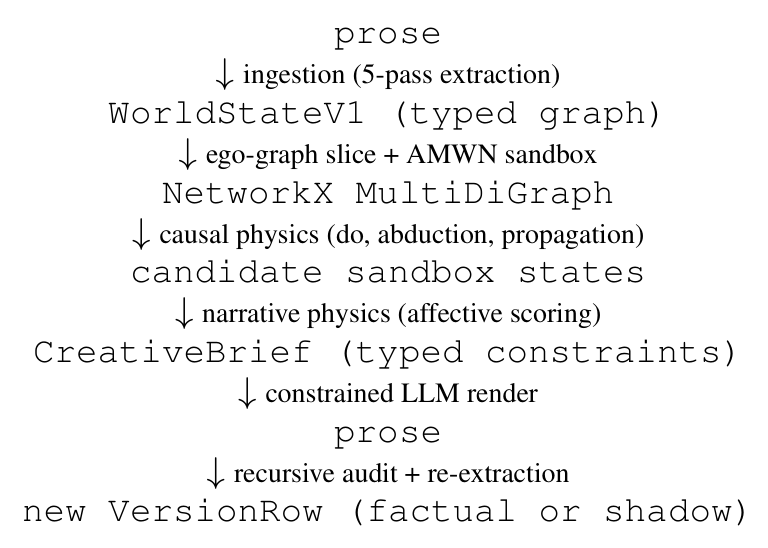

# Shadow-Loom: Causal Reasoning over Graphical World Models of Narratives

## 阅读定位与证据边界

Shadow-Loom 是一个实验性叙事系统：把故事转成带版本的类型化世界图，用代码进行干预、状态传播与分支模拟，再让 LLM 按约束写成文字，并检查文字是否引入没有依据的状态变化。其核心分工是 **causal physics 决定哪些变化被图中的规则允许，narrative physics 对这些变化的叙事效果打分**。

本文是研究工件与系统设计报告，不是已通过外部 benchmark 验证的故事生成模型。没有对强基线的总体胜率，也没有读者实验来证明四种情感评分准确预测人的体验。内部样例和单元测试可以说明实现运行、输出满足某些设计性质，但不能代替这种验证。

本笔记依据本地 arXiv:2605.02475v2（2026-05-06）PDF，完整覆盖正文 §1–7（pp.1–7）。**原文没有独立 Conclusion 标题，正文在 §7 Limitations and future evaluation 后结束**；按正文解读完成的标准，本篇读至这里即可。为解释核心机制，补读作者指定为权威细节的附录 A（pp.13–22）以及内部审计表 B.8。正文唯一的 Figure 1 已按原样插入。

## 1 Introduction：为什么把叙事状态放在模型之外

作者认为，纯文本生成容易把因果、时间与人物知识隐含在模型参数及上下文中；即使模型能回答“某人相信什么”，后续行为也不一定与该信念一致。Shadow-Loom 的选择是显式保存这些关系，让“如果 Macbeth 拒绝杀 Duncan，会发生什么”成为图上的受控改动，而不只是让模型自由续写另一种故事。（§1，pp.1–2）

第一项动机来自因果推理的层级差别：观察、干预和反事实需要不同的信息与操作。作者借用 Pearl 的三层结构和 AMWN / counterfactual calculus 作为设计语言，希望把反事实写作变成可追踪的计算过程。但这不意味着从自然语言抽出的任何图都自动满足严格因果识别的前提；正文和限制节都明确承认其图并不是完整、严谨的 SCM。

第二项动机是“编译与测试”的类比：代码 agent 的产物有可执行约束，叙事系统也应有可检查的基底。系统可以拒绝三类续写：因果传播违反 inertia 或 affordance；反事实分支违反已实现的一致性等检查；重新抽取后的状态与 creative brief 不一致。这里“可检查”意味着能追溯具体规则，不意味着这些规则本身已经由人类读者实验验证。

作者把四项设计组合起来：类型化世界图与双时间索引、允许观察/干预/反事实的因果引擎、对叙事结构与人物情绪评分的引擎、受约束生成与递归审计。系统名中的 shadow 指与事实线并行保存的反事实分支；这些分支是持久对象，而非临时覆盖原故事。

## 2 Pipeline overview：从输入故事到可审计的新版本

*原文 Figure 1，p.3。原图本身采用文字流程图；图中间是类型化图上的程序操作，LLM 出现在输入抽取、输出渲染和审计位置。*

流程以一个可追溯版本树为基础。每个版本保留祖先，反事实 fork 成为兄弟分支，因此可以比较、保留或提升某个 shadow，而不立即改变 canon。（§2，p.3）

**第一阶段：ingestion。**首先用五个抽取 agent 建立全局注册表及别名；随后每个文本 chunk 另外并行调用 physics、social、consequences 三类专家，分别抽取事件/因果与空间边、关系与通道、权威状态增量。验证与修复检查 ID 是否闭合、类型是否合法。全局注册表先确定身份，局部抽取再写增量，有助于避免同一人物在各块中成为不同节点；但抽错关系的语义问题不一定被类型检查捕获。

**第二阶段：causal physics。**按焦点人物与时间锚点切出 ego-graph，重建当时状态，复制到沙箱；执行 do、必要的 abduction，再沿因果结构传播。传播同时受惯性和空间/物体可执行条件限制。切片必须先回到查询时间，否则故事结尾的信息会泄漏进更早的反事实。

**第三阶段：narrative physics。**对候选沙箱计算 mystery、dramatic irony、suspense、surprise 四个结构评分，以及 grief、rage、joy、regret、love、fear 六个 trait 相关评分。这些是作者设计的代理量，用于在候选中选择更符合指令的状态。

**第四阶段：generation。**把胜出候选打包为类型化 `CreativeBrief`，其中包含应保留的信念、不能提前透露的信息、可发生的 trait 变化等 `ConstraintBlocks`；渲染 LLM 只在这些约束下写对白、描述和节奏。候选选择发生在生成文字之前。

**第五阶段：audit and feedback。**从生成文字反向抽取因果陈述，找出 brief 没有许可的变化（“miracle steps”），进行反事实和叙事效果检查；有问题则反馈重写，受重试预算约束。通过后合并为新的 `VersionRow`。论文还介绍 NiceGUI 作者界面和约四十个 MCP 工具，但没有以 UI 可用性替代模型效果评估。

### 补读 A.1–A.4：图究竟保存什么、怎样改动

作者定义世界状态为：

$$
W=(N,E,C,\mathcal T,\tau).
$$

$N$ 是节点，$E$ 是三层边，$C$ 表示通信通道信息，$\mathcal T$ 为世界特征，$\tau\in\{\mathrm{factual},\mathrm{shadow}\}$ 为分支标记。每个事件都有故事发生时间 $f(e)$（fabula）和呈现位置 $s(e)$（syuzhet）；两者可以不同。trait 与 belief 等状态通过稀疏 timeline 增量重建，而不是只保留最终快照。（A.1，pp.13–14）

| 节点族 | 关键内容 | 对叙事的作用 |
|---|---|---|
| Entity，`ENT_` | trait、belief、常量、位置、状态历史 | 区分人物的实际属性与所知信息 |
| Event，`EVT_` | 行动者、对象、双时间、事件类型 | 表示 choice、outcome、revelation、utterance 等 |
| Location，`LOC_` | 环境状态、容量、空间连接 | 限制跨地点作用与移动 |
| Object，`OBJ_` | 所在地/所有者、属性、affordance | 指定物体支持的行动与目标类型 |
| Channel，`CHN_` | 媒介、参与者、方向、每人可理解度 | 控制信息能够传给谁 |
| GlobalTrait，`WORLD_` | 世界级压力及其惯性/历史 | 表示制度、社会环境等持续约束 |

*按原文 Table 1（p.13）整理。*

边分为 causal、relationship、spatial 三层。因果边保留机制、证据强度、因果力度、延迟及 trait 目标；人物关系分别保存 affinity、fear、power_dynamic 等轴，每轴有自己的惯性和证据。空间边则记录通路、锁与障碍物。

**通信不是一条普通关系边。**持久通信能力是 Channel 节点，一次实际发言是带 `via_channel_id` 的 utterance 事件，内容的 truth value 可以为真、假或不确定。人物 belief 记录经哪个事件和通道获得。这样“文本里有人说了 P”不会直接变成所有人都知道 P，也不会自动变成世界事实 P。

**观察、干预与反事实。**观察读取当前切片；do 操作切断目标的入因果边并设定值。若切断通信通道或撤销发言事件，系统还会删除由该来源获得、在分支中已失去根据的 beliefs。反事实则先利用证据更新历史沙箱，再重施干预。附录的 trait 更新采用：

$$
T^{\mathrm{post}}=
\frac{\iota_T T^{\mathrm{prior}}+\kappa_E T^{\mathrm{evidence}}}
{\iota_T+\kappa_E}.
$$

$\iota_T$ 是被解释为历史先验精度的惯性，$\kappa_E$ 是证据精度（默认 1）。惯性越大，越保留历史基线；惯性越小，越向证据值移动。类似更新也用于关系轴；belief 回传还受通道可理解度约束。（A.4，p.16，式 1）

应把它读为作者实现的加权更新规则。仅从这个式子不能证明叙事抽取图完成了严格 SCM 的外生变量识别与 abduction。论文自己在正文限制中也没有作这种保证。

**Impact > Inertia 的传播。**对下游节点 $u$，父节点 $p_i$ 通过证据与力度共同决定边权 $w_i=\sigma_i\phi_i$，其中证据权重 $\sigma_i$ 取 0.25、0.5、0.75。定义：

$$
I_i=(V_{p_i}-V_u)w_i,\qquad
\overline I=\frac{\sum_i I_i}{\max(1,\sum_i w_i)},
$$

$$
\Delta_u=
\begin{cases}
\overline I-\operatorname{sgn}(\overline I)\iota_u,
& |\overline I|>\iota_u+\varepsilon,\\
0,&\text{otherwise}.
\end{cases}
$$

$V$ 是状态值，$\iota_u$ 是惯性阈值，$\varepsilon$ 防止临界数值误差。冲击不够则不改变；超过阈值后只传播扣除惯性后的部分。分母至少为 1，避免把一条极弱边归一化成强影响；多条弱边的累积也不会无限压倒强来源。（A.4，p.17，式 2）

系统按拓扑顺序传播，遇到非平凡因果环会阻断并记录原因；跨地点作用还要通过空间路径与 affordance 检查。附录提供可选 noisy-OR 随机模式与基线漂移，但默认关闭，所以不能把随机传播写成主流程默认行为。

**AMWN 与规则检查的边界。**附录描述了祖先上下文投影、跨世界节点合并、d-separation 以及把关系轴提升为合成节点的实现。其三类检查对应 consistency、independence、exclusion；规则标记默认主要用于建议和审计，不能随意把可疑干预静默删掉。尤其 LLM 可能漏掉潜在共同原因，图上分离不代表真实叙事因果独立。论文提供可选潜在混杂开关，并明确严格识别算法没有被完整照搬。因此“支持 AMWN 风格的可审计分支”比“已经实现通用完整反事实识别”更准确。

## 3 Theoretical lineage and computational counterparts

本节篇幅很大，主要贡献是把理论概念与字段/计算操作对应起来，而不是报告新实验。（§3，pp.3–5）

| 理论来源 | 系统中的对应物 | 阅读时应保留的区别 |
|---|---|---|
| Fabula / syuzhet | 事件发生时间与呈现索引 | 世界进展与读者获知顺序可以分离 |
| Possible worlds / 反事实图 | factual/shadow、版本树、沙箱 | 分支可追溯不等于推断已获现实验证 |
| 角色功能与故事语法 | 世界压力、关系权力轴、事件类型 | 类型是粗粒度工程近似 |
| Situation model / 因果理解 | 时间、空间、人物、因果、意图字段 | 可存储不等于抽取必然准确 |
| Theory of mind | 有来源和建立时间的 belief | 还要检查行为是否符合该 belief |
| Sternberg 等叙事效果理论 | 四类结构评分 | 设计函数与读者真实反应不是同一件事 |
| 信息论与信念修订 | 通道 intelligibility、belief 增删 | 可理解度为模型参数，需要经验校准 |
| Plan-and-render | CreativeBrief、受约束渲染与再评分 | 图内有效也可能在文字生成时失真 |
| 交互叙事与游戏引擎 | 模拟器、drama manager、随机渲染器 | 架构类比不构成性能比较 |

作者反复强调，系统接近一个可检查的叙事游戏引擎：符号状态转移为生成提供行动边界，叙事评分选择方向，LLM 实现语言表面。与隐向量世界模型相比，其优势设想是可检查和干预；代价是 schema、阈值和因果机制需要显式建模，可能无法覆盖开放文本中的全部含义。

### 补读 A.5：四个“读者状态”评分到底测什么

设锚点 $A=(t_f,t_s)$，分别控制世界时间与叙述位置。事件若 $s(e)\le t_s$ 就已向读者揭示；人物知识仍需按参与、发言和有效 belief 来源重建。两种时间投影让读者知道但人物不知道、人物经历但读者尚未看到等情况可以分别表示。（A.5，pp.17–22）

**Mystery：已显露结果还有多少原因隐藏。**对焦点相关的已揭示结果，回溯其因果祖先，计算仍未揭示祖先的加权占比：

$$
\mathrm{Mys}=
\frac{\sum_{e\in\mathrm{eff}}\rho_e\sum_{a\in\mathrm{Anc}(e),\,s(a)>t_s}\sigma_{k_a}\Pi(a,e)}
{\sum_{e\in\mathrm{eff}}\rho_e\sum_{a\in\mathrm{Anc}(e)}\sigma_{k_a}\Pi(a,e)}.
$$

$\Pi(a,e)$ 是最强反向路径的权重，深度上限为 4；$\sigma$ 是事件重要性，$\rho_e$ 是随叙述距离衰减的好奇心权重（默认时间常数为 8 个 syuzhet beats）。若所有权重为 1，就退化成“隐藏原因数/全部原因数”。它具体度量因果解释缺口，不是词汇困惑度，也不是一般语言上的模糊程度。（式 3）

**Dramatic irony：读者知道而焦点人物不知道多少。**先构造已揭示集合 $R$ 与各人物知识集 $K_c$，从 $R\setminus K_c$ 提取信息差。每个差距按事件强度、伤害类型、错误信念放大、接近真相揭露的距离加权，再乘人物行动权重。最终把最大人物差距与平均差距混合，最大值权重默认 $\beta=0.6$，并截到 1。（式 4–5）

分母用已揭示事件质量，而非固定的全部事件质量，作者希望它既能随读者获知秘密上升，也能在人开始知情后下降。这个“先升后降”是函数设计目标，不能把满足此目标又当作独立证明函数对应人的戏剧体验。

**Suspense：未揭示未来中的希望与威胁。**事件先按人物关系分桶：敌对行动可以是威胁，盟友营救可以是希望；中立关系才回退到较简单的角色规则。权重结合因果证据、时间接近程度、空间距离、悬而未决的持续性和伤害类型。存在性/身体威胁、背叛、心理/关系/社会/认知等类型有不同显著性与饱和常数。

这里存在需要明确的版本差异：摘要与正文仍突出 **balance × stakes**；但附录 A.5（pp.19–20）把 **EFK expected-variance combiner** 写成默认，将原方式保留为 `classic` 选项。默认版用已揭示 threat/hope 权重 $A,B$ 构成 Beta 均值：

$$
\mu_t=\frac{1+A}{2+A+B}.
$$

再枚举下一次揭示是 threat 或 hope 时的更新，计算按接近度加权的平方信念变化，用同一先验下的最大参考变化归一化，并按 stakes 汇总。系统还加了“双边都有未揭示候选”的 guard：只有威胁或只有希望时返回安全/绝望边界，而非将其当作 suspense。这是作者额外施加的结构理论条件，不是纯 EFK 方差公式自动要求的结果。

`classic` 版本则为：

$$
\mathrm{Susp}_{\mathrm{classic}}
=\max_k\left[\sigma_k\left(1-\frac{|w^{(k)}_{\mathrm{threat}}-w^{(k)}_{\mathrm{hope}}|}{T_k}\right)
\frac{T_k}{T_k+K_k}\right],
\quad T_k=w^{(k)}_{\mathrm{threat}}+w^{(k)}_{\mathrm{hope}}.
$$

$K_k$ 为该伤害类型的饱和常数；希望与威胁平衡、且总 stakes 不小，分数才高。式子只在有效非空桶上计算，无双边质量时按文中边界返回 0。笔记同时列出两者，是因为不能忽略原稿正文与详细定义的差异。（式 9–14）

**Surprise：终局状态差距与当前揭示引发的更新。**先从其他实体的终局 trait 建立 leave-one-out 先验，以免焦点实体把自己的先验拉近真值；不足两个其他带该 trait 的实体时默认 0.5。附录的现行更新是 Beta–Bernoulli 加权更新，伪计数强度默认 2：$\alpha$ 增加 $wp$、$\beta$ 增加 $w(1-p)$，其中 $p$ 是重建的终局 trait，$q=\alpha/(\alpha+\beta)$ 是更新后均值。焦点实体作为因果目标时按完整边权更新，作为因果来源时使用 0.4 倍权重，反映行为对行动者自身特征的较弱证据。（式 15–16）

对单个 trait，使用二元 KL：

$$
D_{\mathrm{KL}}(p\Vert q)
=p\log\frac pq+(1-p)\log\frac{1-p}{1-q}.
$$

再对 $1-e^{-D_{\mathrm{KL}}}$ 做显著性加权，并与时间错序项混合；默认 trait 权重 0.7、anachrony 权重 0.3。错序项比较同一事件在 fabula 与 syuzhet 中的相对排名。（式 17–20）

作者特别区分 **cumulative** 与 **local**：前者比较终局状态 $p$ 与截至当前的 $q_s$，表示读者还差多少；后者比较本次更新前后 $D_{\mathrm{KL}}(q_s\Vert q_{s-1})$，表示这一刻改变了多少预期。平静段落的局部值接近 0，揭示时可能出现尖峰。两者不是同一个数列的简单换名，局部 KL 也不应严格写成累计 KL 的普通导数。

正文把更新概括为 geometric prior update，但附录式 16 明说 Beta–Bernoulli 已替代旧几何拉近式。这里按作者指定的详细附录解释现行定义，并保留这个不一致，不能替原稿假装二者完全一致。

**六种情绪评分。**grief/rage/joy/regret/love/fear 对当前可重建 trait 的正向和反向指标取平均，例如某些特征升高增加分数，另一些用 $1-v$ 降低分数。它们是 trait-target 接近度，缺少对应 trait 时还有设计回退值。既非从读者问卷学习的心理量表，也非文本情感分类器输出。

## 4 What is novel, what is borrowed

作者明确承认主要组成来自已有理论与系统传统：Pearl 层级、AMWN、实际因果、叙事效果理论、Bayesian surprise、LLM-as-judge、plan-and-render、类型化故事图等。声称的新意在于把这些元素联成一个开源流水线：持久反事实分支、图上模拟、叙事效果排序、约束 brief、再抽取审计。（§4，pp.5–6）

较小的具体构造包括 Impact > Inertia 规则、surprise 更新与双时间轴取样。不过这里的贡献类型应写成工程整合及可研究的设计选择，不能升级为新的通用因果识别定理。作者的“据我所知未见相同组合”也不等于系统性文献检索已经证明独一无二。

## 5 Rationale for the design choices

**为什么类型图。**它让 belief、通信可理解度和因果机制可以查看和改动，减少每次从长文本重新猜测世界状态的负担。但可靠性仍取决于抽取、类型覆盖和模型参数；图不是天然正确的真值库。（§5，p.6）

**为什么两个引擎。**可发生性与叙事吸引力承担不同职责。若直接按情感分最大化自由生成，模型可能靠突然出现的事件提高分数；先约束再评分能把候选局限在当前图许可的变化中。相反，只有因果一致性也不保证故事好看，因此需要可替换的叙事目标。

**为什么约束渲染而非直接微调。**brief 将应遵守的关系转为具体检查目标，使生成错误可以对应到缺少因果边、越权获知秘密或未获支持的 trait 变化。本文没有给出与微调模型的实证对照，所以这部分是架构选择理由，而非已证明的效果优势。

**为什么在持久层记录 shadow。**反事实需要可比较、可撤回的版本；共享 ancestry 的分支可以 diff、审计和提升，保留“设想”与“既定情节”的区别。这个设计也有助于防止一次 what-if 结果被后续问答误读成 canon。

## 6 Why this might matter beyond fiction

作者提出叙事是反事实与 ToM 推理的可控试验场，因为事实和人物知识由作者限定，可以建立有限、可检查的目标。对 NLP，审计记录有望定位模型在哪个具体约束上偏离；对数字人文与计算社会科学，图与分支可以用于显式记录分析假设；对创作工具，作者可比较不同干预与信息揭示路径。（§6，pp.6–7）

原文特别声明不对某个具体社会模拟的经验有效性作保证。真实历史、政策与社会系统有大量不可见混杂、利益关系和测量误差，不能把小说 fixture 上能执行的反事实直接视为现实政策预测。该节贡献是提出可复用研究基础，而非展示这些跨领域任务已经完成。

## 7 Limitations and future evaluation：内部检查证明了多少

本文没有外部数据集 headline score；叙事评分是理论启发的设计函数，未以读者反应校准；因果引擎借用了 AMWN 命名和规则思路，但没有原样实现完整识别算法；LLM 抽取错误仍会传播。单元测试覆盖符号层，不等于外部系统评测。（§7，p.7）

作者列出三条未来评估路线：用读者标注检验情感评分；对因果引擎、沙箱和审计做组件消融；与端到端 LLM 在反事实和 ToM benchmark 比较。这些在本稿中是未来工作，不能放进“实验已经证明”的结果列表。

**内部 fixture 审计。**正文和附录 B.8 用手工构建的经典文学/电影世界检查评分曲线。四类结构分数的范围如下：

| 评分 | 最小值 | 中位数 | 均值 | 最大值 |
|---|---:|---:|---:|---:|
| Mystery | 0.17 | 0.53 | 0.57 | 1.00 |
| Dramatic irony | 0.00 | 0.45 | 0.45 | 0.90 |
| Suspense | 0.00 | 0.16 | 0.14 | 0.39 |
| Surprise，local | 0.00 | 0.03 | 0.05 | 0.24 |

*原文 Table 2，p.27；不是正确率或人类偏好分。*

作者报告所有世界的 mystery 随揭示下降，16/20 世界具有先升后降的 irony，终点 suspense 归零；《落水狗》回忆揭示处的 surprise 为 0.19，《消失的爱人》视角翻转为 0.20，《呼啸山庄》框架开头为 0.24。不同分数绝对尺度不同，不能因 mystery 均值高于 surprise 就得出故事“更神秘、不够惊讶”。

**原稿样本数不一致。**正文与 B.8 都写 20 个 fixture × 7 个锚点，却称每指标有 162 次评分，还说某 fixture 只贡献 6 点。直接按描述应为 139，而非 162；其他段落又提到 21/21 个 fixture。这些很可能反映实现或稿件迭代，但只读本文不能确定实际统计口径。本笔记保留原报告数，不虚构一致的样本量，也没有实际运行外部仓库复现这些结果。

更根本的验证边界是：fixture、分数形式和调参目标都来自同一套设计。得到符合设计的曲线可以检查实现是否违背预期，却不能独立证明读者也按这些曲线感到悬念或惊讶。尤其 surrogate 分数成为优化目标后，系统可能找到高分但乏味、机械或依赖 schema 漏洞的故事，需要独立人评检验。

## 正文最终结论与项目启发

本文最可靠的产出是一个可检查的设计：显式世界状态、双时间、带来源的 belief、可分支的干预、独立的可发生性与叙事评分、生成后的再抽取核对。它把叙事一致性的部分要求转成能记录、能干预、能追责的对象。作者将它作为研究基础开放，而非作为已完成效果验证的产品。

对当前叙事/记忆系统，可直接研究的设计原则包括：保留知识的获得事件与通道；把假设分支与 canon 隔离；在角色做事时检查其当时知识；对生成内容重新抽取并对照许可变化。不能直接照搬为已验证常数的是惯性阈值、伤害显著性、时间衰减、trait 与情感映射以及 scorer 混合权重。

有价值的下一步实验应固定同一批故事与底层 LLM，分别比较纯文本、类型图、类型图加因果传播、再加审计等配置；用独立人工标注测事实一致性、角色知识一致性、反事实合理性和阅读体验。若只报告内部 scorer 升高，就无法判断优化是改善故事还是适应了评分函数。

## 原文定位

正文 §1–7 位于 pp.1–7；Figure 1 在 p.3；schema/Table 1 在 A.1（pp.13–14）；抽取与沙箱在 A.2–A.3（p.15）；因果操作与式 1–2 在 A.4（pp.16–17）；四类结构评分、式 3–21 在 A.5（pp.17–22）；生成与审计在 A.6–A.7（p.22）；内部评分统计 Table 2 在 B.8（p.27）。正文已完整覆盖，附录只展开支撑核心机制与证据边界的内容。
