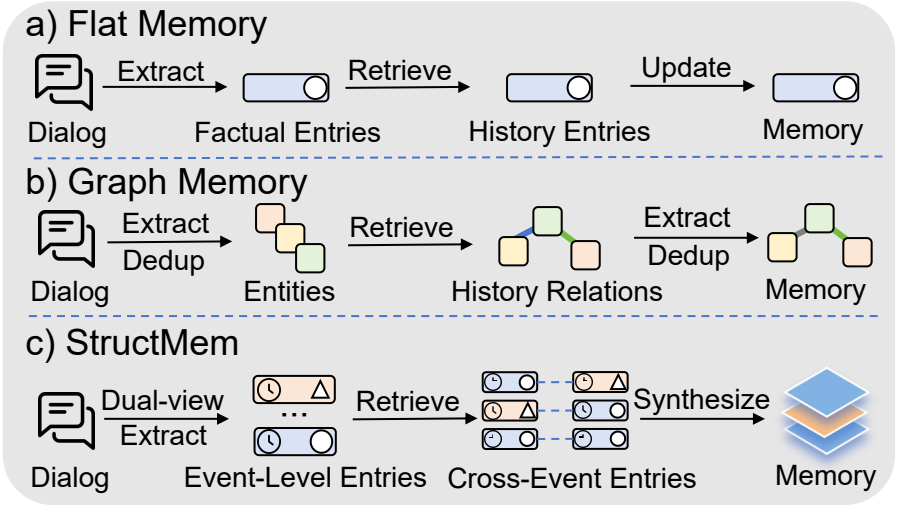
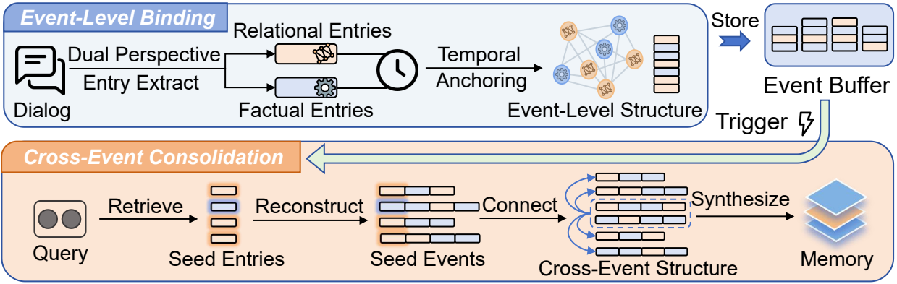
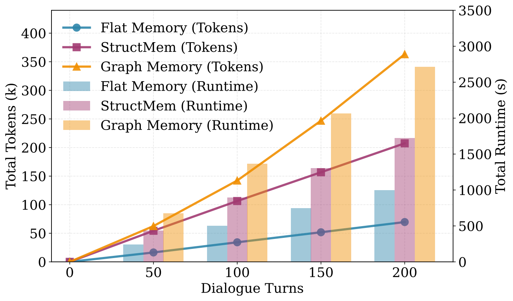
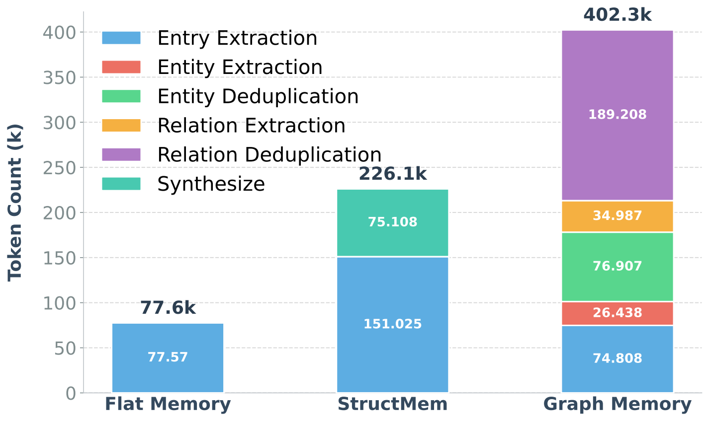
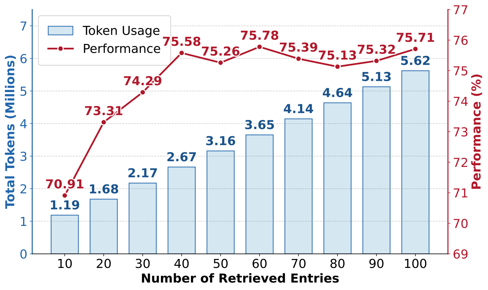
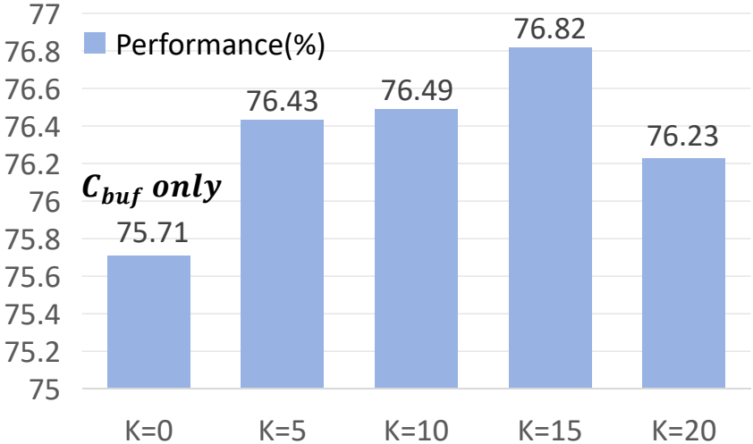

# StructMem: Structured Memory for Long-Horizon Behavior in LLMs

## 一句话总结

StructMem 将长程对话记忆的基本单位从孤立事实或实体关系三元组改为“带时间锚点的关系事件”，通过事件级绑定和跨事件语义整合，在 LoCoMo 长程对话问答上同时提升结构化推理能力并降低记忆构建成本。

## 研究问题

论文关注长期会话智能体的记忆表示问题：仅把历史存成扁平 fact/summary 虽然高效，但难以保留跨轮次、跨事件的时间依赖、因果链和人际关系；显式图记忆虽然有结构推理能力，却需要实体/关系抽取、去重和图维护，成本高且容易累积抽取错误。因此作者试图寻找一种介于 flat memory 与 graph memory 之间的结构化记忆形式，使系统能支持 temporal reasoning 和 multi-hop question answering，同时避免连续图构建的开销。

## 核心方法

StructMem 采用层次化记忆组织。事件级绑定阶段，对每个 utterance 同时抽取 factual entries 与 relational entries，并把它们统一锚定到原始时间戳，使事实内容、交互关系和时间上下文作为同一事件单元被重建。跨事件整合阶段，系统周期性缓存新事件，利用 buffered context 检索历史中语义相关的 seed entries，再按时间戳恢复完整事件簇，最后用 LLM synthesis 生成跨事件关系假设，形成补充性的抽象记忆层。这样它不依赖刚性 schema、实体消歧或符号图遍历，却保留了对长程关系链的结构化支持。

## 分章节阅读笔记

### 1 Introduction

引言首先把问题定义为长程会话智能体的 persistent memory：智能体不只是要记住“某个事实发生过”，还要在多轮、多会话历史中推理时间依赖、因果链和跨事件的多跳关系。因此，记忆系统的核心不只是检索覆盖率，而是历史信息被组织成什么样的结构。

作者将现有方法概括为两类范式。Flat memory 将事实或摘要作为独立条目存入记忆，优势是简单高效，但问题是它切断了事件之间的时间进展、因果依赖和交互关系；当历史很长时，检索容易退化成浅层语义相似度匹配。Graph memory 试图通过实体-关系抽取恢复结构，具备更强的关系推理归纳偏置，但它需要实体抽取、关系抽取、去重和图维护，构建成本高，并且抽取噪声会在图结构中累积。

StructMem 的立场是：上述矛盾并不只是工程实现问题，而是“记忆基本单位”选错了。长程对话记忆不应以孤立事实或 rigid triplet 为基本单位，而应以 temporally grounded relational event 为单位。这个单位同时保留发生了什么、参与者/事件之间如何相关、以及它发生在什么时间上下文中，因此比 flat entry 更有结构，又比显式图 schema 更灵活。

引言给出的方案是一个 event-centric hierarchical memory framework。事件级层面，StructMem 用 dual-perspective extraction 抽取 factual entries 和 relational entries，并把二者绑定到同一时间戳，形成可重建的结构化 episode。跨事件层面，它周期性地对语义相关事件做 consolidation，利用长程对话中的 temporal locality 批量诱导更高层的关系结构。这样，系统避免了显式 schema design、entity resolution 和 symbolic graph traversal，但仍能支持 temporal reasoning 与 multi-hop reasoning。

这一节在整篇论文中的作用是建立研究定位：StructMem 不是简单提出一个更好的 retriever，也不是重新做一套轻量知识图谱，而是把长期对话记忆从“事实条目/图三元组”重构为“时间锚定的关系事件 + 周期性跨事件合成”。后续 Method 的两个核心模块正对应这里提出的两个层次：Event-Level Binding 和 Cross-Event Consolidation。

### 2 Related Work

Related Work 延续引言的问题框架，把长期记忆研究组织成三条路线：flat vector memory、graph-based structured memory，以及不依赖刚性图 schema 的中间型 consolidation 方法。作者真正要做的是说明 StructMem 的位置：它不是简单增强检索，也不是继续加重图构建，而是把结构化组织放到“事件”这一更自然的记忆单位上。

第一条路线是 flat memory。早期 agent memory 常把长历史外部化到向量数据库中，把事实、摘要或片段作为独立条目存储。这类方法适合 semantic matching，能绕开上下文窗口限制，但它把互动历史处理成 unordered bag of propositions。问题在于，长程对话里真正有用的信息往往不是单个事实，而是事实之间的时间推进、因果依赖和关系背景。即使后来加入 reflective reasoning 或 closed-loop retrieval control，只要底层表示仍是扁平条目，复杂推理仍容易退化为在离散事实之间做相似度检索。

第二条路线是 graph memory 或 knowledge-graph memory。GraphRAG、HippoRAG、Mem0 的图版本、Zep 等方法试图通过实体、关系和图遍历恢复结构，使系统更适合 global sense-making 和 multi-hop traversal。这条路线的优势是关系归纳偏置更强，但作者强调它与自然对话之间存在张力：对话叙事是流动、含糊、上下文依赖的，而实体-关系三元组是刚性的。把自然事件压缩成 triplets 可能造成语义损失；抽取噪声还会变成持久结构噪声；持续维护图结构也会带来高延迟和高成本。

第三条路线是介于两者之间的 schema-free 或弱结构化 consolidation。HiMem 用层级文本段落组织记忆，TiMem 用逐轮 reflective thinking chain 加深单轮理解，PREMem 在写入记忆前预先推理用户偏好，EMem 保留 raw episodes 并依赖检索驱动的被动整合，MemWeaver 则引入轻量实体抽取来组织 session-level experiences。这些方法都在尝试不完全依赖刚性知识图谱的结构化记忆，但各自仍有边界：有的偏压缩和索引，有的 per-turn 成本较高，有的主要面向 persona consistency，有的 consolidation 机制不够主动。

因此，这一章给 StructMem 留出的研究空位是：既需要比 flat memory 更强的 temporal / relational structure，又要避免 graph memory 的 rigid schema、entity resolution 和 continuous graph maintenance。StructMem 的回答是 event-centric structure：先在事件内部绑定事实与关系，再周期性合成跨事件关系，把结构化推理需要的上下文放在“时间锚定事件”上，而不是放在孤立 fact 或实体关系图上。

### 3 Method

方法章将 StructMem 定义为一个层次化结构记忆框架。它的核心不是改变最终问答模型，而是改变对话历史进入记忆库时的组织方式：下层的 event-level structure 负责保留单个 utterance 内部的事实和关系绑定，上层的 cross-event structure 负责把跨时间边界的相关事件连接起来，为 temporal reasoning 和 multi-hop reasoning 提供结构化上下文。

### 3.1 Event-Level Binding

Event-Level Binding 解决的是单个 utterance 内部的信息绑定问题。作者认为，一个对话轮次中既包含 factual content，也包含 relational context；如果只抽事实，就容易丢掉人物关系、因果影响和时间依赖；如果强行抽实体关系三元组，又会引入 rigid schema 和 entity resolution 的成本。因此 StructMem 用 dual-perspective extraction 同时抽取两类自然语言条目。

具体地，对第 $i$ 条 utterance $m_i$，系统调用语言模型 $\mathcal{L}$ 和两个 prompt：$P_{fact}$ 用于抽取 factual entries，$P_{rel}$ 用于抽取 relational entries。得到的 $\Phi_i$ 表示事实条目集合，例如事件内容、状态变化或明确事实；$\Psi_i$ 表示关系条目集合，例如人际动态、因果影响和时间依赖。公式 $\Phi_i \cup \Psi_i = \mathcal{L}(P_{fact} \| m_i) \cup \mathcal{L}(P_{rel} \| m_i)$ 表达的是：同一条对话从两个互补视角被写入记忆。

Temporal Anchoring 是这一节真正关键的设计。系统不是把 factual entries 和 relational entries 分散存储，而是把所有来自同一 utterance 的条目都绑定到原始时间戳 $\tau_i$，并为每个 entry 保存 embedding $\mathbf{e}_x$。因此记忆库 $\mathcal{M}$ 中的基本元素是 $\langle x, \mathbf{e}_x, \tau_i \rangle$：文本条目、向量表示、时间锚点三者一起存。这样做的作用是，后续检索到任意一个 entry 时，系统都可以通过共享时间戳恢复同一事件的完整事实-关系上下文。

这一小节的本质是把“单条记忆”从孤立 fact 改造成 temporally anchored episode。它仍然使用自然语言条目和 embedding 检索，因此比知识图谱轻；但由于保留了同一 utterance 内的事实/关系/时间绑定，又比普通 flat memory 更适合后续重建事件。

### 3.2 Cross-Event Consolidation

Cross-Event Consolidation 解决的是跨 utterance、跨时间段的信息连接问题。作者的假设是：长程对话中的相关事件往往具有一定 temporal locality，不必每来一条新消息就做昂贵的全局图更新；可以先把未整合的新 entry 放入 buffer，等达到时间阈值后再周期性合成跨事件结构。

在触发 consolidation 时，系统先把 buffer 中未整合条目按时间排序，得到 $\mathcal{C}_{buf}$。然后把这些 buffered entry 的文本拼接成一个 aggregated query，用 embedding model 编码，再在历史记忆中按 cosine similarity 检索 top-$K$ 个语义最相近的 seed entries，记为 $\mathcal{S}_k$。这些 seed entries 的作用是把当前新事件和历史中潜在相关的旧事件连接起来。

检索到 seed entry 后，StructMem 不直接拿单个 entry 去合成，因为单个 entry 仍可能是不完整的事实片段。它会利用 temporal anchoring 重建 seed 所属的完整事件：对每个 seed entry $x^*$，找出所有与它共享时间戳的条目，形成 ${E}_{\tau}(x^*)$。这些 seed events 与当前 buffer 一起组成 $\mathcal{C}_{cross}$，也就是合成前的 cross-event structure。

最后一步是 Memory Consolidation through Synthesis。语言模型用 consolidation prompt $P_{cons}$ 读取 $\mathcal{C}_{cross}$，生成跨事件的 relational hypotheses 或更高层记忆。作者强调这不是普通摘要：普通摘要倾向于压缩连续文本，可能丢失原始细节；StructMem 的 synthesis 是在“语义检索 + 事件重建”后的事件簇上操作，目标是形成补充性的抽象层，同时保留 raw episodic memory 的 fidelity。

方法章整体可以理解为两级索引和两级结构：event-level binding 保证每个事件内部可重建，cross-event consolidation 保证相关事件之间可连接。前者防止记忆碎片化，后者避免每轮都构图的高成本；两者共同支撑论文想要的中间路线：比 flat memory 更结构化，比 graph memory 更轻量。

### 4 Experiments

实验章的目标是验证两个主张：StructMem 是否真的提升长程对话问答效果，以及这种结构化记忆是否比 graph memory 更省构建成本。实验在 \texttt{LoCoMo} benchmark 上进行，效果用 LLM-as-a-judge 评估，效率用 memory construction 阶段的 token usage、API calls 和 runtime 衡量。

作者比较了三类 baseline：RAG-based systems，包括 OpenAI、FullContext、MiniRAG、LightRAG；flat memory methods，包括 LangMem、A-Mem、Mem0；structural memory methods，包括 MemoryOS、Mem0 图版本、Zep、Memobase。除部分外部系统外，实验统一使用 gpt-4o-mini 作为 backbone，text-embedding-3-small 作为 embedding model。

### 4.1 Experimental Setup

实验设置关注两个维度。Effectiveness 看 LoCoMo 上的问答质量，按 Multi、Open、Single、Temp 四类问题报告；Efficiency 看构建记忆时消耗多少输入/输出 token、调用多少次 API、运行多长时间。这个设置和论文主张是对齐的：如果 StructMem 只是效果高但构建成本接近图记忆，就不能证明它解决了 graph memory 的开销问题；如果成本低但 temporal / multi-hop 效果不高，也不能证明事件结构真的有用。

### 4.2 Overall Performance

主结果表显示，StructMem 在 overall score 上达到 76.82，是表中最高；Memobase 为 75.78，Zep 为 75.14。按问题类型看，StructMem 在 temporal reasoning 上达到 81.62，仅低于 Memobase 的 85.05，但显著高于大多数 RAG 和 flat memory 方法；single-session 也达到 81.09。Multi 和 Open 两类不是最优，Zep 在这两项更高，但 StructMem 的总体优势来自较均衡的表现，尤其是 temporal reasoning 与效率之间的折中。

| Method | Overall | Multi | Open | Single | Temp | Build Tokens (M) | Calls | Time (s) |
|---|---:|---:|---:|---:|---:|---:|---:|---:|
| FullContext | 73.83 | 68.79 | 56.25 | 86.56 | 50.16 | -- | -- | -- |
| MiniRAG | 63.51 | 56.74 | 58.33 | 75.74 | 38.94 | 10.103 | 2508 | 2566 |
| LightRAG | 68.83 | 66.31 | 50.00 | 77.53 | 53.89 | 11.931 | 13576 | 60469 |
| LangMem | 58.10 | 62.23 | 47.92 | 71.12 | 23.43 | 11.066 | 5990 | 26281 |
| A-Mem | 64.16 | 56.03 | 31.25 | 72.06 | 60.44 | 11.494 | 11754 | 60607 |
| Mem0 | 66.88 | 67.13 | 51.15 | 72.93 | 59.19 | 12.196 | 9181 | 30057 |
| MemoryOS | 58.25 | 56.74 | 45.83 | 67.06 | 40.19 | 2.868 | 5534 | 24220 |
| Mem0$^g$ | 68.44 | 65.71 | 47.19 | 75.71 | 58.13 | 35.825 | 53514 | 115670 |
| Zep | 75.14 | 74.11 | 66.04 | 79.79 | 67.71 | -- | -- | -- |
| Memobase | 75.78 | 70.92 | 46.88 | 77.17 | 85.05 | -- | -- | -- |
| StructMem | 76.82 | 68.77 | 46.88 | 81.09 | 81.62 | 1.937 | 1056 | 22854 |

效率结果是这张表的另一半重点。StructMem 的 build tokens 为 1.937M、API calls 为 1056，明显低于 LightRAG、A-Mem、Mem0 和 Mem0$^g$。尤其与 Mem0$^g$ 相比，StructMem 的 token 消耗和 API calls 都小很多，说明它没有走“持续构建显式图”的路线。Zep 和 Memobase 没有公开构建成本，因此表中不能直接比较其效率。

### 4.3 Analysis

分析部分分成 paradigm comparison 和 internal mechanisms。Paradigm comparison 用消融表说明，Graph Memory 相比 Flat Memory 在 Single 和 Open 上提升，但 Temporal 反而下降；StructMem 则在 Multi、Single、Temp 上都有更稳定的提升。w/o Cross-Event 版本代表只保留 event-level structure，不做跨事件整合；它已经能提升 Single 和 Temp，但完整 StructMem 在 Multi 和 Temp 上进一步提高，说明 Cross-Event Consolidation 对跨时间因果关系有贡献。

| Method | Multi | Open | Single | Temp |
|---|---:|---:|---:|---:|
| Flat Memory | 66.31 | 46.88 | 78.83 | 78.50 |
| Graph Memory | 66.67 | 48.96 | 80.50 | 76.64 |
| w/o Cross-Event | 66.31 | 46.88 | 80.86 | 79.44 |
| StructMem | 68.77 | 46.88 | 81.09 | 81.62 |

Figure 3a 和 3b 解释效率来源。随着 dialogue turns 增加，Graph Memory 的 token 和 runtime 增长更快；组件级分析显示，图构建需要 entity extraction、relation extraction、deduplication 等多级 LLM 操作，尤其 relation deduplication 成本很高。StructMem 的成本主要来自 entry extraction 和 periodic synthesis，它把跨事件组织从 per-event graph update 变成 batch consolidation，因此 API 调用和 token 消耗明显下降。

Internal mechanisms 部分回答一个关键质疑：效果提升是否只是因为检索了更多条目。Figure 3c 显示，retrieved entries 从 10 增加到 60 时性能上升，但之后基本进入平台期，说明单纯扩大 flat retrieval 的覆盖率不能持续提升 reasoning。Figure 3d 则显示，当 $K=0$ 即只使用 buffer、不连接历史 seed events 时性能为 75.71；加入跨事件 seeds 后性能提升，$K=15$ 时达到 76.82。这支持作者的解释：Cross-Event Consolidation 不是简单增加上下文，而是在相关事件之间合成了单个 atomic entry 中不存在的关系假设。

实验章整体的证据链是：主表证明 StructMem 效果和效率的总体优势；消融表证明 event-level 和 cross-event 两个结构层都有贡献；Figure 3 进一步解释为什么它比 graph memory 省，以及为什么跨事件合成不是普通扩大检索数量。

### 5 Conclusion

结论回到论文的中心论点：StructMem 通过 hierarchical design 实现 structure-enriched memory organization。它保留 event-level bindings，让单个 utterance 内部的事实、关系和时间上下文不被打散；同时通过 cross-event consolidation 连接跨时间边界的信息，使系统能够支持 multi-hop 和 temporal reasoning。与持续维护显式图结构不同，StructMem 不需要每个事件都经历实体抽取、关系抽取、去重和图更新，因此能减少 token consumption、API calls 和 runtime。

这一节的实质是把方法和实验收束到同一个贡献上：StructMem 试图证明长期会话记忆可以不在 flat memory 和 graph memory 之间二选一。它用时间锚定事件作为基本单位，在保留结构推理所需上下文的同时，避免 graph memory 的连续维护开销。LoCoMo 实验被用来支持这一点：StructMem 在 overall performance、multi-hop/temporal reasoning 和构建效率之间取得较好的折中。

## 关键公式 / 图表

### 关键图

### 关键表格

## 实验结论

## 局限性与可追问点

论文明确承认两个局限。第一，dual-perspective extraction 依赖 instruction prompts。如果 prompt 设计不佳，factual entries 或 relational entries 可能不完整，也可能错误捕获关系信息。也就是说，StructMem 的结构质量部分取决于 LLM 按提示抽取事件视角的稳定性。一个直接的后续问题是：能否通过自动 prompt optimization、示例选择或小模型校验来提高跨对话场景的鲁棒性。

第二，StructMem 主要处理 memory expansion 和 synthesis，但缺少显式的 conflict resolution 与 memory updating 机制。长期用户事实和偏好会变化，例如用户过去喜欢某类内容，后来不喜欢了；如果系统只持续合成历史记忆，而不处理冲突、过期和修订，旧的 summary 或 relational hypothesis 可能与新信息不一致。作者建议未来引入 memory decay 或 updating strategies，使层次化记忆能反映交互中的最新状态。

从研究角度看，这两个局限都很关键：StructMem 证明了“事件级绑定 + 跨事件合成”能改善长期记忆结构，但还没有完全解决动态记忆系统的生命周期问题。后续值得追问的是，事件记忆何时应被更新、遗忘或合并，以及 synthesized memory 如何在新证据出现时被校正。

## 对我当前研究/项目的启发
