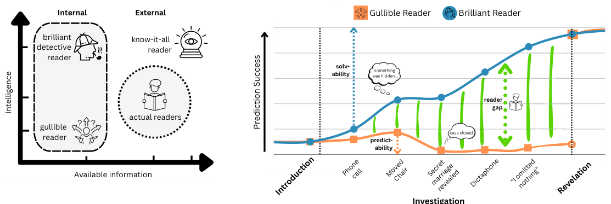
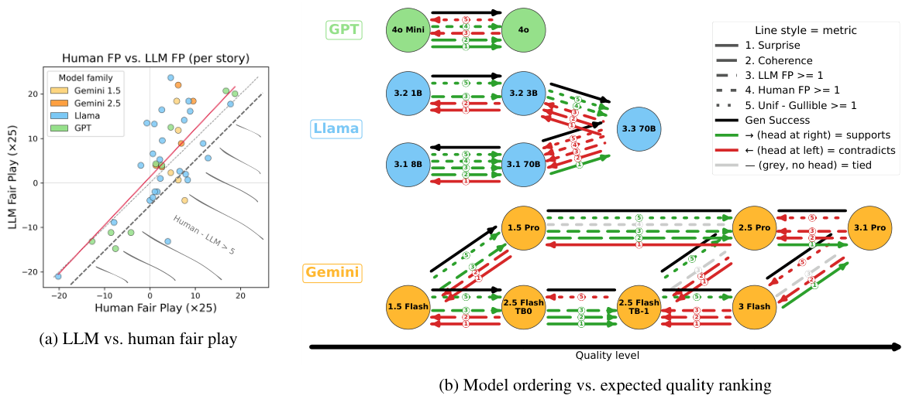
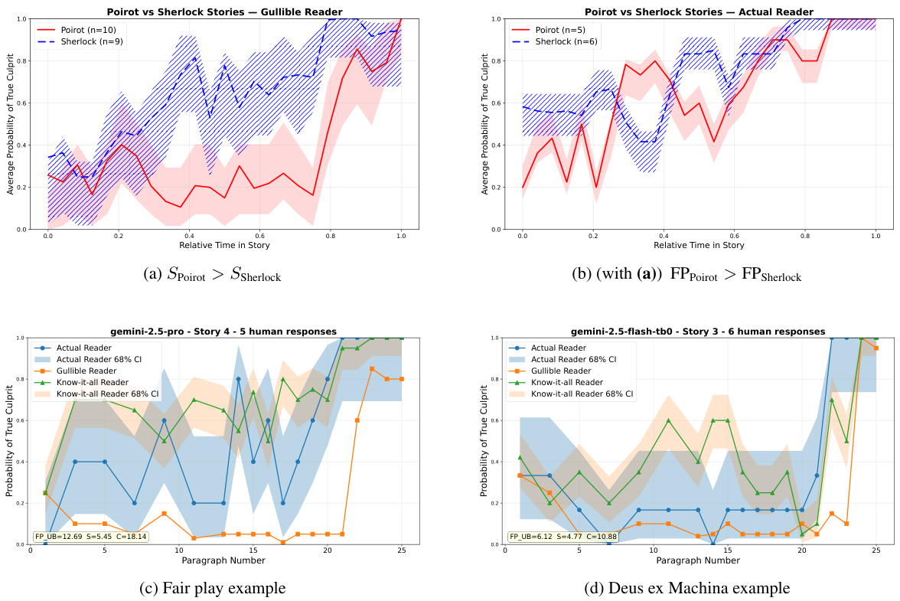

# The Challenge and Reward of Fair Play in Narrative: A Computational Approach

> 阅读版本：本地 PDF 为 arXiv:2507.13841v2，页首日期 May 13, 2026。完整覆盖正文 §1–6（含6.1 Limitations），以及结论后仍属于论文主要内容的 §7 Methods / Data Availability（p.1–14）；补读附录 Table 5 与 Table 9 以呈现人评和模型数值。正文三幅图均直接裁自 PDF。

## 先抓住论文要解决的矛盾

侦探小说希望读者在揭晓时吃惊，又希望读者回头看时承认“线索其实早就够了”。单看结局难猜，会奖励最后凭空冒出凶手的故事；单看容易从线索推出凶手，又会奖励很早就猜中的故事。本文把两者分成 surprise 和 coherence，并用 **fair play** 衡量聪明读者能否比容易受误导的读者更早识别真相。

理论核心是：对同一个固定解释状态的读者，在本文的概率框架和线索充分性假设下，信息积累带来的可解性与被强烈误导之间存在约束。一个真实读者仍可同时体验惊讶与事后连贯，因为他在揭晓后换了一种解释方式——这就是 **hindsight gap（回看时的解释增益）**。它不是“所有好故事都不可能既意外又合理”的不可能性定理。

实验将 LLM 当作不同读者：一个只按表面证据猜凶手，另一个通过同一生成模型的续写采样估计结局分布。指标是每个位置的凶手预测准确率及读者间差，不是让一个judge主观评价“好不好看”。生成故事、人类逐段预测和真实侦探作品对照共同表明，这些维度不能被简单压成一个能力排行榜。

## 1 Introduction：fair与play分别要求什么（p.1–2）

惊讶既包含“没有预料到”，也包含把新结果和已有信息重新整合的 sense-making。侦探小说是典型例子：调查阶段布置线索，但通过叙述、显眼嫌疑和延迟揭示，让读者不直接看到隐藏真相。Fair 指读者确实有机会用线索解题，play 指解题有挑战。

一个 Deus ex Machina（机械降神式解答）可能非常意外，但如果关键解释此前没有任何铺垫，读者没有公平机会。另一种极端是线索直接指向凶手，故事逻辑清楚却缺少推理悬念。作者希望量化中间更困难的情况：同一组线索能误导前向阅读者，同时在真相揭开后成为有解释力的证据。

论文以《罗杰疑案》为贯穿例子：叙述者Sheppard的可信身份与表面不在场证明，能误导轻信的读者；移动的椅子、录音装置等线索又能支持更严密的推理。重点不是“作者藏起所有真相”，而是作者安排读者**如何理解已经看见的信息**。这让该任务同时涉及故事结构和对读者心理的建模。

相关工作分别测过惊讶、悬念或连贯，本文的区别是形式化它们之间的约束，并要求评估同时覆盖两端。它提出的指标也只是这些特定叙事质量的代理，不能替代文风、人物深度或总体文学价值。

## 2 The Probabilistic Framework（p.2–5）

### 2.1 Detective Stories and their Components

把故事表示成 $L$ 个段落：$X=(x_1,\ldots,x_L)$，前 $i$ 段记为 $X_{1:i}$。故事有 introduction、suspicion、revelation 三阶段，revelation point 是第一次明确揭示凶手的段落。

隐藏变量 $Y$ 在侦探小说中是凶手身份，候选集合为 $\mathcal Y$。其中有真正凶手 $y^*$ 和至少一个被叙述引导成重要嫌疑人的 distractor $\bar y$。框架假设候选人在调查阶段开始前已经介绍。这里的“线索”是读者可见、对事件本身无争议的事实；人物说谎或叙述框架造成的误导，需要与事实的逻辑支持区分。

这个设定刻意简化了真实文学：晚出现的凶手、多凶手、完全不可靠事实、多个不断切换的主要干扰者等情况，并没有全部纳入。后面的定理和指标应在这一任务边界内理解。

### 2.2 Reader Models

读者模型把故事前缀映射为候选凶手的概率分布：

$$
M(X,i)=p_M(Y\mid X_{1:i}),\qquad
\hat y_M(i)=\arg\max_{y\in\mathcal Y}M(X,i)_y.
$$

$M$ 描述读者当时的信念，$\hat y_M$ 是他实际猜谁。读者与故事内侦探不同：读者还能使用文风、作家套路、剩余篇幅、体裁惯例等外部信息。例如“故事快结束了，最显眼的嫌疑人可能是假线索”，是读者能作的元推断，未必是角色能从案情中得到的证据。

### 2.3 Idealized Types of Reader Models

| 理想读者 | 可用信息 | 推断方式 | 在评价中的作用 |
|---|---|---|---|
| Gullible $M_0$ | 内部线索 | 接受显眼表面线索，容易受误导 | 检查能否真正误导一个轻信读者 |
| Brilliant $M_1$ | 内部线索 | 对线索作理想最优推断 | 定义线索本身是否足以解释结局 |
| Actual $\bar M$ | 内部+体裁/作者等外部经验 | 真实人群中不同经验读者的混合 | 与真实读者行为相连 |
| Know-it-all $M^*$ | 完整故事生成分布 | 知道生成过程的Bayes最优预测 | 给出可预测性的理想上界 |

Know-it-all 并不是已经读了正确结尾的oracle。它知道给定前缀的**续写分布**，仍无法消除生成过程本身的随机性。例如同一未完小说可有多个合理结局，知道这些结局的概率并不等于知道最终抽到了哪一个。

**图1（p.4）解读。** 左图按内部/外部信息和推断能力区分读者；右图显示一种理想fair-play曲线：轻信读者被误导，聪明读者从线索逐步提高对真凶的判断，两者在揭晓前形成差距。图中的《罗杰疑案》线索解释了同一句话或同一行动为什么对两种读法有不同作用。它是概念示意，不是人类实验的实测概率轨迹。

### 2.4 Expected Reader Behavior

开篇所有嫌疑人刚登场、线索很少，理想化先验近似均匀。调查期间，$M_0$ 被显眼假线索引向无辜嫌疑人，$M_1$ 通过组合内部证据逐步锁定真凶；$M^*$ 还可利用生成惯例，真实读者则分布在不同经验水平上。揭晓后，各读者都应识别真凶。

这些是作者期望好故事呈现的行为，而不是任何实际LLM一定遵守的性质。理论中，故事生成模型 $SM$ 定义故事文本及线索序列分布；$M^*$ 是知道完整生成分布的Bayes最优分类器，$M_1$ 是只用内部线索时的Bayes最优读者。区分二者是为了检测“猜中只是因为作者重复套路”与“确实从案内线索推出来”。

## 3 The Coherence-Surprise Tradeoffs（p.5–7）

### 3.1 Surprise：不知道与被误导不是同一种惊讶

作者用 $M^*$ 对 $M$ 的交叉熵刻画 uninformedness：

$$
H(M^*(i);M(i))=-\sum_{y\in\mathcal Y}p_{M^*}(y\mid X_{1:i})\log p_M(y\mid X_{1:i}).
$$

这不是两分布间的纯KL散度；当 $M=M^*$ 时达到最小值 $H(M^*)$，可能仍大于零，因为续写本身可能不确定。在所有候选等概率的初始设定下，基准为 $\log|\mathcal Y|$。

**弱惊讶**要求读者直到某步仍接近无信息状态：

$$
H(M^*(i);M(i))\ge\log|\mathcal Y|-\epsilon_{\mathrm{surprise}}.
$$

**强惊讶**则要求读者比均匀猜测还更偏离真实生成分布：

$$
H(M^*(i);M(i))\ge\log|\mathcal Y|+\delta_{\mathrm{surprise}},\qquad\delta_{\mathrm{surprise}}>0.
$$

直觉上，前者是“我猜不到”，后者是“我有把握猜错方向”。Fair play 要关心后者是否来自合理误导，而不是信息完全缺失。阈值依赖分布和理想模型，实验并不直接估计这一交叉熵，而改用更稳定的分类指标。

### 3.2 Coherence：线索累计提供了多少信息

Step effectiveness（S-EFF）是读到新一步后，期望uninformedness降低了多少：

$$
\operatorname{S\!\text{-}\!EFF}_M(i+1)=\mathbb E[H(M^*(i);M(i))]-\mathbb E[H(M^*(i+1);M(i+1))].
$$

期望分别对相应长度前缀的生成分布取值。正值表示这一新增信息平均帮助了预测；不能把“有趣事件发生”直接等同有效线索。累计聪明读者的增益定义为：

$$
\Delta_{\mathrm{coh}}(i)=\sum_{j=1}^{i}\operatorname{S\!\text{-}\!EFF}_{M_1}(j).
$$

这里coherence专指线索对谜底的累计解释力，并非语法、段落衔接或所有意义上的情节一致性。线索充分性要求内部最优读者与知道生成过程的最优读者，每一步得到的信息接近：

$$
\big|\operatorname{S\!\text{-}\!EFF}_{M_1}(i)-\operatorname{S\!\text{-}\!EFF}_{M^*}(i)\big|\le\epsilon_{\mathrm{ex}}.
$$

若作者总写同一种结局，$M^*$可根据套路猜中，而$M_1$找不到案内支持，就违反这个假设。于是高可预测性未必代表真连贯，必须防止模式坍缩把CUB虚抬。

读者相对聪明侦探的信息利用差距定义为：

$$
\Delta_{\mathrm{intel}}(i,M)=\sum_{j=1}^{i}\left[\operatorname{S\!\text{-}\!EFF}_{M_1}(j)-\operatorname{S\!\text{-}\!EFF}_{M}(j)\right].
$$

若该差距在各步都很小（不超过 $\epsilon_{\mathrm{intel}}$），称其intelligent。这是本文特定的信息增益定义，不是一般IQ或LLM基准能力分。概率信念接近$M_1$足以使它满足这个条件，但反向推论不必成立。

### 3.3 Tradeoffs：定理限制的是同一种读者解释状态

累计S-EFF可望远镜消去中间项，从统一先验出发，读者的期望交叉熵可由“初始熵−累计有效信息”表示。由此，对一个强惊讶的读者，有核心约束：

$$
\delta_{\mathrm{surprise}}+\Delta_{\mathrm{coh}}(i)\le\Delta_{\mathrm{intel}}(i,M).
$$

它说明同时要强误导和高线索解释力，需要该读者与理想线索解释者之间有足够差距。如果读者始终像理想侦探一样利用线索，差距很小，就没有空间同时保持强误导。弱惊讶也与线索有效性相互约束：信息已经明显积累时，聪明读者不可能仍完全无知。

这些结论带有理想先验、生成分布、线索充分性与读者定义等条件，且讨论的是相应分布下的量。它不是仅凭直觉宣告“越连贯必然越无聊”，也不要求不同读者、不同阅读阶段共享同一个固定信念状态。把它用作通用文学质量定理会超出范围。

长度推论指出：故事越长，若每步持续给出有效线索，真相就越来越容易被推出；要继续维持强惊讶，或者每步信息极少、调查像没推进，或者误导和读者差距需更强。这解释长悬疑结构的控制难度，但实验故事只有25段，没有直接测长篇增长曲线。

### 3.4 The Hindsight Gap

一个真实读者可先以forward-reading模式理解线索，揭晓后改用hindsight模式重新分配线索意义。Hindsight gap是后者相对自己先前解释得到的累计线索有效性增益，不是新增一条隐藏事实本身，也不是简单提高reader模型大小。

Hindsight coherence要求结局能完整解释此前线索，使回看的读者接近聪明侦探的解读。于是强惊讶与高coherence可以由同一个人的两个读法实现：前向被误导，回看时理解为什么真相一直被支持。若只是知道答案后强行认为“早就能猜到”，而案内证据其实不足，就是hindsight bias造成的faux fair play，不能算真正公平。

| 故事类型 | 揭晓前的信号 | 回看时的支持 | 失败或成功点 |
|---|---|---|---|
| Deus ex Machina | 难以猜到 | 线索不足以支持谜底 | 意外来自任意结局 |
| Non-mystery | 容易推知 | 解释清楚 | 缺少有效误导与挑战 |
| Fair play | 表面读法走偏 | 细读后证据形成解释链 | 有真正hindsight gap |

写作难点是让读者先采用一个可信但不够好的解释，再让同样的已给信息支持更好的解释。因此distractor是机制的一部分，不应简单把增加无关信息当作制造惊讶。

## 4 Experimental Setup（p.7–9）

### 4.1 Stories

生成故事覆盖Gemini、Llama、GPT的多个规模与版本，每篇25段。真实文本来自Conan Doyle的Sherlock Holmes和Christie的Hercule Poirot。作者预期后者更偏whodunit（凶手是谁），前者一些作品更偏howdunit（如何犯案及推理过程），因此用“凶手身份”衡量惊讶时不应视作无条件的文学优劣比较。

没有明确真凶和distractor的生成被视作失败，从后续指标分析中剔除。报告有效率很必要：一个模型如果只剩少数成功故事，条件质量高并不能说明它稳定生成得好。正文每模型十篇的描述与附录有效数/比例并不都对应固定十次尝试，后面的原表按实际报告保留。

### 4.2 Metrics：理论量如何落到可测指标

交叉熵对极小概率敏感，LLM和人类的概率输出又不一定校准，所以实验改用最可能嫌疑人的分类结果。在一篇$L$段故事上：

$$
A(M)=\frac1L\sum_{i=1}^{L}\mathbf{1}\!\left[\arg\max M(i)=y^*\right].
$$

定义 $S(M)=1-A(M)$、$C(M)=A(M)$。对**同一个reader**，二者直接互补，因此真正有意义的共同评价必须跨reader：惊讶取 $S=S(M_0)$；coherence上界取 $C_{UB}=A(M^*)$；人类平均coherence取 $C=A(\bar M)$。一篇作品可以使$M_0$常猜错而$M^*$常猜对，两者并不矛盾。

注意该$A$在位置上平均，包含揭晓及之后的位置；uniform predictor在揭晓前均匀猜，在揭晓后也答对。因此其整篇准确率不总是固定$1/|\mathcal Y|$，还受揭晓位置影响。对故事长短和揭晓时间不同的比较，应保持这一口径。

Fair play是更有能力与较弱读者的准确率差：

$$
FP(M,M')=A(M)-A(M').
$$

$$
FP_{UB}=C_{UB}-(1-S),\qquad FP_{AR}=C-(1-S).
$$

上界版本用know-it-all与gullible，人类版本用actual与gullible。另设可解性 $FP_S=C_{UB}-A(\hat P_{\mathrm{unif}})$。同一高FP可能只代表轻信读者非常弱，因此论文要求同时满足三个条件，每项差至少$1/L$，相当于一段的准确率单位：

| 要求 | 判断条件 | 排除的伪成功 |
|---|---|---|
| Intelligence gap | $FP_{UB},FP_{AR}\ge1/L$ | 聪明/真实读者并未从线索受益 |
| Solvability | $FP_S\ge1/L$ | 最优预测不比随机更好，线索不可解 |
| Misdirection | $A(\hat P_{\mathrm{unif}})-A(M_0)\ge1/L$ | 轻信读者只是无知，没有被引向错误方向 |

因此FP大于零不自动等于完全fair play，必须同时检查solvability与misdirection。对真实作者无法访问生成分布，CUB没有可靠估计保证，主文主要使用gullible surprise与人类C/FP，不伪造真正的know-it-all上界。

## 5 Results（p.9–12）

### 5.1 Generated Stories

附录Table9提供完整自动指标，便于核对主文概括。G-VAL为有效生成比例，n是用于分析的有效故事数，K是每checkpoint续写采样数；TB0/−1分别无思考预算/动态思考。

| 模型（Table9，p.40） | G-VAL | n | K | S | CUB | FPUB | FPS |
|---|---:|---:|---:|---:|---:|---:|---:|
| Llama3.2-1B | .27 | 3 | 20 | — | — | — | — |
| Llama3.2-3B | .73 | 8 | 20 | .570 | .612 | .182 | .125 |
| Llama3.1-8B | .90 | 9 | 20 | .744 | .423 | .167 | .068 |
| Llama3.1-70B | .83 | 10 | 20 | .745 | .746 | .491 | .335 |
| Llama3.3-70B | 1.00 | 10 | 20 | .574 | .466 | .040 | −.045 |
| Gemini1.5-flash | .71 | 9 | 5 | .352 | .734 | .086 | .115 |
| Gemini1.5-pro | 1.00 | 10 | 5 | .549 | .684 | .233 | .162 |
| Gemini2.5-flash TB0 | 1.00 | 10 | 20 | .734 | .647 | .381 | .247 |
| Gemini2.5-flash TB−1 | 1.00 | 10 | 20 | .674 | .771 | .445 | .347 |
| Gemini2.5-pro | 1.00 | 10 | 20 | .798 | .687 | .485 | .307 |
| Gemini3-flash | 1.00 | 10 | 20 | .795 | .637 | .432 | .264 |
| Gemini3.1-pro | 1.00 | 10 | 20 | .646 | .584 | .230 | .109 |
| GPT-4o-mini | .57 | 8 | 20 | .669 | .451 | .120 | .137 |
| GPT-4o | .67 | 10 | 5 | .562 | .480 | .042 | .084 |

小于5个有效样本的Llama1B不报告不稳定指标。Table9的caption简写uniform accuracy为$1/|\mathcal Y|$，但正文定义还包含揭晓后正确预测，且表中CUB−FPS并不是同一个固定常数；这里按正文较完整定义理解，原样保留FPS，不用固定四选一概率自行重算表格。

几个对照比“哪个模型最高”更有意义。Llama3.1-70B和Gemini2.5-pro的FPUB分别.491、.485，但前者S/CUB为.745/.746，后者.798/.687，取得相近差值的平衡方式不同。Gemini2.5-flash开思考后CUB从.647升到.771，S从.734降到.674，FP仍从.381升到.445，体现可解性增益大于惊讶损失。

较新Llama3.3-70B的有效率1.00，但FPUB仅.040，平均FPS为−.045；能写出格式有效的故事不代表线索有可解优势。主文按单篇判据报告，6/10的Llama3.3故事、4/10的GPT-4o故事未达到最小intelligence gap。这种失败不是靠所有模型共用一个“综合能力更强”排序就能预测。

跨生成故事，S与LLM coherence的Spearman相关为−.095（n=100，p>.05），接近零且不显著；S与人类coherence为−.383（n=36，p<.05），为显著负相关。它支持两维不能当成共同单一质量的同向代理，但第一个结果本身不能说成“显著负相关”，相关分析也不是理论因果证明。

**图2（p.10）解读。** 左图实际横轴为human FP、纵轴为LLM FP，绘图数值乘以25；右下方区域表示人类FP明显超过自动上界，点较少符合上界预期。右图按作者预期的版本/规模/思考能力排模型，每种指标画一条支持或反对该排序的箭头，许多反向箭头说明单一能力排序不能概括fair play。

人评子集报告平均FPUB=.242、FPAR=.127，且两者正相关；个别故事人类可能高于估计上界，因为$M^*$只是有限采样近似。理论上的期望上界不要求每个有限样本点都严格服从。Experienced reader附录还发现，知道生成设定本身、即使不给先前故事，也能带来很大预测优势，提示必须防止模板知识被误认为案内推理。

### 5.2 Real Stories

作者用经典文学差异检验指标是否符合已知体裁特点。这里的C和FP来自人类逐段预测，S来自模拟gullible；两种实验的故事样本数不同，不能把未匹配的均值代入$FP=C+S-1$计算。

| 指标 | Poirot | Sherlock | 样本口径 |
|---|---:|---:|---|
| Gullible surprise S | .642 | .342 | 10篇 vs9篇 |
| Human coherence C | .661 | .751 | 人评5篇 vs6篇 |
| Human fair play FPAR | .325 | .067 | 人评且匹配gullible的相应子集 |
| 人类FP低于1/L的故事 | 0/5 | 3/6 | 主文使用的human-based DeM判据 |

Poirot对gullible更难猜，Sherlock对真实人类却平均更早可推知。如果只测C，会偏向Sherlock；如果看读者差距，Poirot更强。这与whodunit与howdunit的叙事目标差异一致，不能变成“Christie客观比Conan Doyle写得更好”的普遍结论。

**图3（p.11）解读。** A是gullible随相对故事进程猜中真凶的频率，B是实际人类；两图中Poirot/Sherlock走势差异说明不同reader的评估不能合并。阴影为68%的Clopper–Pearson区间，按相对位置合并预测计算，不能误称95%区间。

C、D分别展示作者挑选的fair-play与Deus-ex-Machina生成例子，横轴为25段。C中更强reader在揭晓前较早获得优势；D中结局附近才明显收敛，说明“最后都猜对”不说明此前线索有效。图内个别S/C/FP标注使用乘L的累计尺度，与主表0–1归一化数值不同。D即使FPUB为正，也不代表满足三项公平条件，需要看相对uniform的可解性；不能只用一个差值判定故事类型。

Sherlock的《歪唇男人》是例外：gullible比人类更准。作者推测真实读者预期套路反转，反而排除了明显嫌疑人；表面读者没有这种外部先验。这展示actual readers不一定对每篇故事都严格位于gullible与know-it-all之间。

### 5.3 Self-Reported Impressions

参与者完成故事后按1–5评价surprise、fairness、coherence、enjoyability。附录Table5如下，#是评分记录数，不是独立参与者人数或故事篇数：

| 来源/模型 | # | Surprise | Fairness | Coherence | Enjoyability |
|---|---:|---:|---:|---:|---:|
| Llama3.2-3B | 28 | 2.79 | 3.18 | 2.68 | 2.39 |
| Llama3.1-8B | 24 | 3.96 | 2.75 | 2.67 | 2.50 |
| Llama3.1-70B | 26 | 3.39 | 2.58 | 2.69 | 2.58 |
| Llama3.3-70B | 55 | 3.38 | 2.40 | 2.47 | 2.29 |
| Gemini1.5-pro | 19 | 3.11 | 3.16 | 3.42 | 2.42 |
| Gemini2.5-flash TB0 | 30 | 3.80 | 2.67 | 3.27 | 3.00 |
| Gemini2.5-flash TB−1 | 30 | 3.47 | 2.60 | 2.90 | 2.53 |
| Gemini2.5-pro | 29 | 3.50 | 3.11 | 3.72 | 3.41 |
| GPT-4o-mini | 23 | 3.61 | 2.57 | 2.74 | 2.35 |
| GPT-4o | 26 | 3.42 | 3.23 | 3.73 | 3.39 |
| 生成故事均值 | 290 | 3.44±.57 | 2.77±.56 | 2.99±.64 | 2.65±.54 |
| Sherlock | 33 | 3.09 | 3.85 | 4.21 | 4.30 |
| Poirot | 37 | 3.70 | 4.03 | 4.51 | 4.11 |
| 真实故事均值 | 70 | 3.32±.49 | 3.91±.45 | 4.39±.35 | 4.21±.38 |

平均行的±是story间标准差。原表平均行按作者聚合口径转录，不能把它擅自当作所有评分记录加权均值。真实故事在公平、连贯和享受程度上明显更高，但惊讶没有把两组清楚分开；这正说明“让人觉得意外”可来自误导，也可来自结构混乱。

主文报告主观surprise与fairness弱负相关$r=-.13,p<.05$，coherence与fairness强正相关$r=.65,p<.001$。自动S与主观surprise相关$r=.15,p<.01$；人类预测C与主观coherence相关$r=.16,p<.01$，LLM C对应$r=.11,p<.05$；人类FP与主观fairness$r=.25,p<.001$。这些多是小到中等效应，支持指标捕捉到相关侧面，不能说它们完全替代人评。论文附录另有不同聚合表，若复现应统一故事级与评分级相关的统计单位。

## 6 Discussion and Conclusion（p.12–13）

全文将侦探故事评价从“惊不惊讶”或“合不合理”的单项评分，推进到两种读者读法之间的比较。强misdirection与足够线索需要作者控制读者在不同阶段如何解释信息，hindsight gap让前向误判与事后认可可以共存。

模型实验显示有效生成率可以随能力提高，而fair play不一定单调改善；人评则说明真实作品在公平、连贯和享受上仍有明显优势。指标不依赖参考故事，可潜在作为生成时筛选或训练反馈，但本文并未实验证明用它优化后就会产出更好长篇小说。

理论上，这也关联surprisal研究的局限：单次前向负对数概率无法充分描述后来揭示如何改变对早先文本的解释。作者将二维框架视为对这种现象的补充。更广义的启发是创作者需要同时模拟不同读者立场，这是一种具体的Theory-of-Mind测试；它仍以侦探小说这个受限任务作为实证基础。

### 6.1 Limitations

人类参与者只有20人；真实作品的fair play依赖有限人类预测，无法访问真正作者生成分布，因此绝对分数不应过度解读。CUB只是理论上界的采样估计，偏差还可能来自多样性、生成套路和校准。

生成文本固定25段，与长篇、多视角、多凶手悬疑不同。单一显著distractor和提前给定嫌疑人集合简化了任务，也让熟悉生成说明的reader可能轻易猜中。模板重复或mode collapse可抬高CUB，而不增加内部线索的解释力。实验主要是whodunit，未验证对惊悚、程序型悬疑和其他叙事类型的普适性。

还应区分理论量与经验代理：交叉熵的信息约束不能不加条件地迁移成任意人评量表的线性约束；分类准确率损失了置信度大小，揭晓位置、候选数和故事长度又会改变基准。因此跨集合比较要报告这些设置，而不是仅报FP一个数。

## 7 Methods：结论之后不能漏掉的实施细节（p.13–14）

### 7.1 Story Generation

生成器逐段写25段侦探故事，明确要求有distractor，并让揭晓后逻辑成立。逐段生成是为了能从中间checkpoint重新采样续写，估计$M^*$。所有生成temperature=1。对thinking模型，不把上一段内部思维轨迹传入下一段，但已生成正文仍作为故事前缀，不能误解为各段看不到前文。

模型名单包括Gemini1.5/2.5/3/3.1、Llama3.1/3.2/3.3多个规模、GPT-4o/mini。有效性用held-out o1-mini和o3-mini判断，要求真凶与distractor均能以$p>.5$明确识别。正文称每模型生成10篇，Table9却给出如G-VAL=.83且n=10、GPT-4o G-VAL=.67且n=10等组合，说明报告的总尝试次数口径并非统一十次；原文这里未完整对齐，复现应核查逐次生成日志，不能据正文自行改表。

### 7.2 Reader Estimation

Gullible用o3-mini逐段预测，提示把事件当真实案情、明确忽略作者可能故意误导。它是由提示模拟的表面推断者，不是人类轻信阅读的无误替代，也未保证它真的完全忽略体裁经验。

Know-it-all用**相同生成模型**从预设checkpoint采样5–20个结局，通过各凶手的相对频数估计后验。多数模型K=20；GPT-4o、Gemini1.5-flash/pro为5。该估计依赖可重复采样、有限样本和继续生成的行为稳定性，既不是直接读取作者隐藏计划，也不是已知正确结尾的oracle。较少K也会增加跨模型上界比较的不确定性。

### 7.3 Statistical Analysis

主观量表与客观指标用Spearman秩相关；阅读曲线用Clopper–Pearson区间，在相对时间点汇合各故事预测。应注意多个段落和多个评分可能来自同一人、同一故事，不能把每个预测都当独立参与者；原文方法说明没有完整展开所有相关分析的层级建模。

### 7.4 Human Experiment

研究获Hebrew University IRB批准，20位参与者提供知情同意。每读一段，从四个候选中猜凶手；读完后给四个主观维度打1–5分。阅读顺序随机，隐藏生成模型身份，作者未发现显著学习效应。

**样本口径核对。** Methods称54篇生成故事加11篇真实故事（Sherlock6、Poirot5）有人评；Figure2及相邻统计又使用n=54的annotated subset，相关分析分别用n=100自动故事与n=36人类coherence样本。它们不是同一个分析集合，原文未在这些位置把所有筛选对应清楚。本笔记保留各处口径，不把54强行解释为全部故事数，也不把20人、评分记录数与故事篇数混为一谈。

### 7.5 Use of AI Tools / Data Availability

作者披露LLM用于构思、写作编辑和代码辅助，最终决定由作者负责。当前PDF说代码和故事数据将在接收后公开，生成故事、人类标注和脚本可合理申请获取；这不是已在本笔记中验证过的公开下载状态，不能直接称完整实验已开源。

## 对当前研究的启发（阅读者分析）

若把这套思路接入故事生成系统，可以分别维护角色认知、读者表面推断和揭晓后证据链。优化目标不应只是让真凶低概率，也要检验聪明reader是否能从现有线索得到比uniform更好的答案、揭晓是否只重解释而非凭空补事实。

对SWPM/NKW/NWM，可将证据组织用于检查两种阅读路径：前向路径是否在合理的叙述功能下走向distractor，回看路径是否有完整的时间、动机与物证支持。一个有用对照是固定同一谜底和同一事实集合，仅改变信息呈现顺序与误导框架，再看surprise、solvability、fair play、人类认可是否一起改善。这是本文提供的研究设计方向，不是它已经做过的生成优化实验。
