# The Last AI Built by Humans: Toward Genuine Recursive Self-Improvement

## 一句话总结

论文把递归自我改进（RSI）定义为一个能从经验中产生、验证并继承自身变化，而且这些变化还能影响后续改进机制的闭环过程；作者用“改进责任由人转移给 AI 的范围”组织现有方法，提出从执行改进到递归修改改进机制的 L1–L5 五级框架。

## 综述定位与范围

这是一篇面向 RSI 的路线型综述/观点论文，分析对象是完整的 improvement loop，而不是某一种训练算法。证据同时来自学术论文和产业材料（技术报告、工程博客、开源系统、模型文档及生产基础设施），因为前沿的自改进系统往往先以工程形态出现。论文重点追问：改进环在哪里闭合、什么状态被保留下来、哪些决策已由 AI 承担，以及如何区分真实递归进步与评测投机或单纯增加搜索预算。

## 核心分类体系

作者按 AI 在改进闭环中承担的责任划分五个自治等级：

- **L1 改进执行自治**：人指定目标、方法和成功标准，AI 执行候选更新。
- **L2 改进策略自治**：目标和评测边界外置，AI 诊断弱点并选择改进策略。
- **L3 经验获取自治**：系统进一步决定下一轮需要什么任务、数据或练习经验。
- **L4 部署与环境适应自治**：系统利用部署交互和环境反馈，更新可持久继承的状态。
- **L5 递归继承自治**：系统修改并复用支配后续搜索、评估、选择或整合的改进机制本身。

框架还把“自治结构证据”和“性能提升证据”分开：只有当修改后的改进机制被保留并参与后续轮次时，才有结构递归；若它在独立评测和可比资源预算下产生更强继任者，才构成有效递归。

## 章节地图

全文先在第 1–2 章说明开发规模化的成本、RSI 定义、改进环组成和 HCI（Headroom-Closed Index）视角；第 3 章按 B0、L1–L5 展开自治等级及其评测；第 4 章比较科学、具身智能、软件工程和医疗四类反馈环境；第 5 章整理产业实践；第 6–7 章讨论挑战、未来方向和结论。后续逐章阅读时，应优先关注第 3 章的等级边界、每级的闭环与继承证据，以及第 6 章对安全继承、自治归因和可靠验证的限制分析。

## 逐章阅读笔记

### 1 Introduction

本章提出论文的基本判断：模型规模、训练实验、评测和部署后的修复都在扩大，但改进流程仍依赖人来决定改什么、如何改以及是否有效。RSI 的目标不是让 AI 偶尔生成更好的答案，而是让系统把经验转化为可验证、可继承的状态变化，并进一步改变未来的改进方式。

本章的论证路径是“人类开发负担增加 → 把部分改进责任交给系统 → 必须审计递归与有效性的证据”。开头列举 Kimi K3 的 2.8T 参数、Qwen3.8-Max 的 2.4T 参数，以及内部编码推理所占研究算力份额、agent token 用量的增长，意在说明规模与研发操作量都在增加；这些数字来自不同对象，不能拼成一条统一成本增长曲线（`src/intro.tex:22-30`）。

### 1.1 Scaling Burdens in Model Development

作者将瓶颈分成三类：基础模型训练需要巨量数据、算力和工程协调；合成数据与强化学习需要可生成且可验证的学习环境；部署后系统还要持续诊断工具、记忆、检索和工作流的失败。三类成本分别对应 RSI 对训练流程、经验获取和在线适应的自动化需求。

**开发与评测。** 第一类不只是训练 FLOPs。MoE 架构、草稿模型、架构试验和分布式运行都需要选择与协调；论文提到 GPT-5.6 Sol 的数百次草稿模型实验带来超过 15% 的 token 效率收益。评测本身也昂贵：GDPval 的 1,320 项工作任务约需 9,240 个专家小时；HLE 经约 70,000 个提交筛成约 13,000 个专家审阅项，再形成约 3,000 道基准题。这些例子支持“候选设计、评测和决策均是瓶颈”，但没有统一测量其边际成本（`src/intro.tex:32-55`）。

**后训练与部署。** 第二类是可验证经验的生产与训练：论文称 DeepSeek-V3.2 后训练开销超过预训练成本的 10%，AIMO-2 涉及约 54 万道题、320 万条长解和 170 万条工具整合解答。第三类是上线后的持续维护：文中引用 agent 任务相对聊天约 4 倍 token、多 agent 约 15 倍的消耗，以及 Meta FBDetect 每周处理数千项回归、其中一类问题约需 10 工程师小时。这些是不同系统的例证，指向数据、诊断、验证和修复能否循环复用的问题（`src/intro.tex:56-73`）。

**三种负担如何接到“改进环”。** 基础训练阶段，AI 可以替人试架构或优化实现，但谁决定值得做哪组实验、哪些结果可比较，仍是上游决策。后训练阶段，生成更多题目或轨迹容易，难的是保证正确性、挑出对当前学习者真正有增益的经验，并把它纳入下一次训练。部署阶段，系统必须把一次事故定位到可修复的程序、工具或记忆，同时防止修复在别的任务上制造回归。作者因此不是主张把所有劳动交给同一种 agent，而是追问这些上游决策和验证结果能否成为后继系统可复用的能力（`src/intro.tex:30-73`）。

这些数字也应按证据性质读：MoE 的激活专家比例说明一次推理的稀疏计算，并不表示训练协调问题已解决；GDPval/HLE 的专家工时说明高质量评测构建困难，并不量化每次模型迭代的总成本；agent token 倍数说明运行负载加重，不直接证明自治开发更省钱。论文的动机是多条开发链同时扩张，继承式改进有潜在价值，而非已有统一成本模型证明 RSI 必然划算（`src/intro.tex:26-73`）。

### 1.2 From Development Burden to RSI

论文把 RSI 定义为自主闭环：系统识别限制、提出并验证改进、保留继任状态，并让改进后的能力参与下一轮改进。作者用 A-Evolve-Training（持久化研究策略）和 Ouroboros（持续修订 coding agent）说明“改进对象”和“改进机制”可以同时进入继任系统。

作者给 RSI 设定三个可区分的目的：扩大能力前沿、在相同能力目标下减少资源消耗、发现人类未预设的有效策略。因此“自己改自己”并不是终点；一个系统可能自治地修改大量代码，却只是在昂贵地搜索既定答案。A-Evolve-Training 的 30B Nemotron 实验中，四轮外部得分从 0.80 到 0.86，最优人工提交约 0.87；这展示了版本化研究策略的继承，不等于总体研究目标也由系统决定。Ouroboros 的 coding-agent 版本化工具、上下文、prompt 与核心逻辑在测试和人工批准后晋级，说明安全边界可以与自修改并存（`src/intro.tex:74-114`）。

**两种循环的关键差别。** 普通模型开发可以在一组训练配方中挑最好 checkpoint，却让下一轮研究者仍从原来的实验选择流程出发。A-Evolve-Training 将实验结果写入 *research policy* 和 discovery log：当开发分数改善而外部评测没有同步改善，后续 worker 改为考察数据再平衡与 checkpoint 选择。真正值得追问的是这条政策是否在下一轮控制实验，而非某次模型权重是否提高。论文报告四轮结果，但未把“政策本身带来的增益”和额外实验预算完全拆成独立因果效应（`src/intro.tex:76-93`）。

Ouroboros 则从上线后的 coding agent 入手：修复客户仓库只是外部产品变化，修订 agent 的工具、上下文组装、prompt 或核心实现才改变此后处理仓库的能力。候选经过测试与人工审查后形成新的运行版本，才有“后继系统”；人工批准仍是发布边界，并不抹掉系统在提出和组织自修改方面的自治。两例分别说明研究策略与部署 agent 都可能成为继承载体，但不能把训练模型分数和线上 agent 行为当作同一种效果指标（`src/intro.tex:92-95`）。

### 1.3 Challenges for RSI

三个可信性问题贯穿全文。第一是安全继承：错误更新会跨任务传播，必须有版本、回滚和迁移测试；第二是自治归因：生成更好候选不等于 AI 改进了候选搜索过程；第三是可靠验证：反复访问评测器可能造成投机、标签提取或随机种子挑选，因此要用受保护的评测、独立锚点和可比预算。

反例帮助定位门槛：Gödel Agent 在 100 次 MGSM 优化试验中有 14 次最终表现低于初始策略，说明“允许改动”不保证单调进步；DGM 的 SWE 子集表现从约 20% 到 50%，但 archive 管理与父代选择仍由固定规则完成，所以任务分数提升不能直接证明元改进自治；RQGM 通过 epoch 内冻结 evaluator、epoch 边界用独立 anchor 检查替换方案，处理评测器被候选适应与跨版本分数不可比的问题（`src/intro.tex:116-130`）。

三种问题对应三条不同的审计记录。安全继承要保存父代、子代、改动内容、旧任务回归和回滚点，才看得出更新是累积还是损伤。自治归因要画出 archive、父代选择、候选生成、评测与晋级的控制权归属；DGM 的候选能变强，并不等于这些控制环节全由后代改写。可靠验证要保存评测器版本、访问次数、seed 选择过程和独立锚点；如果每一轮都更换评分标准，纵向分数上升甚至没有可比含义。这里的记录项是依据作者三类挑战提出的阅读检查法，不是论文声称所有系统已提供的材料（`src/intro.tex:116-130`）。

**三个问题会在同一次更新中叠加。** 设 agent 根据测试结果修改自己的搜索程序：改动被接纳后，若旧任务变差，是安全继承问题；若真正决定候选父代的是固定外层采样器，则“AI 自己选择了改进路径”的自治归因不成立；若程序还反复探测隐藏测试，较高分数可能来自评测投机。这些不是三个互斥标签，而是同一条继承链上的三个独立检查点。Gödel Agent、DGM 和 RQGM 分别把其中一个问题暴露得格外清楚（`src/intro.tex:116-128`）。

**应报告的不只是最好的一代。** 每次候选是否被接纳、哪些旧能力回退、用了多少查询、谁批准发布以及后来是否回滚，都影响“持续改进”的判断。仅把 100 次尝试的最高分画成上升曲线，会掩盖 14 次退化试验，也会让固定父代选择和 evaluator 泄漏从图里消失。这是作者为什么在引言就把三个挑战放在五级分类之前（`src/intro.tex:118-130`）。

### 1.4 An Autonomy-Centered Framework

作者用“AI 承担了哪些改进责任”而不是“自动化组件有多少”来分级。每一级都检查三个问题：闭环在哪里闭合、什么状态进入下一轮、哪些关键决定仍由人或固定基础设施控制；L1–L5 分别对应执行、策略、经验、部署适应和递归继承。

例如 FineWeb-Edu 按固定标准处理数据可放在 L1；Self-Harness 根据测试反馈选择 harness 变更接近 L2；SIMA 2 的 ASKA 依据学习者弱点安排练习涉及 L3；PANDO 从运行轨迹接纳或淘汰持久技能涉及 L4；A-Evolve-Training 修改随后会再次调用的研究政策涉及 L5。分类按*实际被系统控制和继承的环节*进行，同一论文中的不同实验设置也可能落在不同层级。作者第 2.2.2 节的严格定义要求后续改进机制能够被持久自我变化影响，因此 L1–L4 更宜读作走向完整 RSI 的自治阶段，而非每例都已实现严格意义的递归元改进（`src/intro.tex:131-159`；`src/foundations.tex:124-132`）。

**如何逐级判断。** 先问输出是否仅在当前任务有效；若下一轮继承了改变，跨过 B0。再看干预方案是否由 AI 从失败中选择，而不是从人写好的清单机械执行；若能选择，跨过 L1。接着查下一轮任务分布是否读取当前 learner 的状态；部署轨迹是否成为可治理的持久更新；最后查提出、评估或筛选后继者的机制是否也被改写并重新调用。这是责任增加的次序，不要求一个系统把之前所有机制都做成同一软件模块（`src/intro.tex:131-155`）。

**一个等级标签不能替代效果测试。** Self-Harness 就算满足 L2，也可能只对原 benchmark 有效；PANDO 有部署式规则更新，也可能误接纳一个过时技能；A-Evolve-Training 保留新研究政策，也未由此自动证明研究效率复利。分类回答“AI 控制了哪一步”，独立任务与同预算后代比较回答“这样做是否有益”，两类证据不能混写（`src/intro.tex:147-155`；`src/L5.tex:84-120`）。

### 1.5 Application Domains

四种应用代表四类反馈条件：科学研究的实验反馈昂贵且归因不确定，具身智能的试错受物理成本和安全约束，软件工程有可执行测试但规格不完整，医疗则有延迟、异质且高风险的结果。相同的更新机制在这些条件下需要不同的验证和发布策略。

这四域不是完整行业目录，而是用来比较反馈“能否快速得到、能否客观核验、错误能否撤销”。科学中失败可能来自假设、仪器或协议；机器人中动作改变之后可观察的状态，真实试错可能不可逆；软件中通过测试仅证明相对于现有测试和规格正确；临床中患者结局有时间延迟与混杂，跨机构泛化更难。因而同一条“更新后得分上升”的证据，在不同领域的可信含义不同（`src/intro.tex:160-190`）。

**同一环在四域的验收方式不同。** 一个 agent 提议修改工具时，软件系统可以沙盒运行回归测试；实验科学要保存样本、协议和测量不确定性；机器人需先仿真和限定物理试验；临床流程则还需专家、伦理和机构边界。修改都能被“保存”，但能够安全投入下一轮的条件不相同。作者因此把领域作为对五级框架的压力测试，而不是再给四个独立的 RSI 定义（`src/intro.tex:160-176`）。

**比较时应控制的混杂。** 科学和医疗的结果可能延迟，故一次循环末尾并无真实终局反馈；具身任务的探索策略会改变遇到的状态，故新旧策略数据分布不一样；软件测试覆盖不全，故通过测试只是一种局部证据。这些差别会改变 experience 的可靠性和 verifier 的设计，进而影响可继承改动的范围（`src/intro.tex:164-174`；`src/app_S1.tex:1-33`）。

### 1.6 Industrial Evidence

论文把技术报告、工程博客、开源项目、模型文档和生产系统纳入证据，因为许多前沿 RSI 机制尚未以论文形式完整公开。产业材料能展示数据飞轮、评测流水线、agent harness、自动实验和部署反馈，但作者强调要区分“已展示的环结构”和“由材料推断出的更强递归能力”。

本笔记据此把证据分为三层：**机制描述**说明系统声称如何运行；**同协议任务结果**说明特定环节是否改善；**独立、匹配预算、多轮后代比较**才说明改进能力本身是否提高。公司自报指标大多属于前两层，不能将“无人值守运行”“找到最好候选”和“自我加速”画等号（`src/intro.tex:191-209`）。

产业报告尤其适合核对系统*是否存在*某种持久载体：版本化 research policy、技能库、事件日志、发布门或评测流水线，往往在工程材料里比论文摘要更清楚。但要证明载体产生净增益，还需要知道旧版怎样运行、哪些失败候选被排除、人工做了什么、调用新状态的任务是否独立、总算力是否相当。技术架构图、公开 demo、内部运营指标分别只能支持不同强度的主张（`src/intro.tex:191-195`；`src/foundations.tex:196-201`）。

因此第 5 章的每个公司案例都按四项读：**改变对象**（数据、harness、模型还是研究政策）、**证据来源**（生产日志或公开报告）、**外部边界**（人定目标与发布）、**尚未展示的比较**。若资料只呈现规划中的闭环，本笔记会把它表述为架构意图；若有运行记录但没有受保护对照，则最多说明局部运作，不写成已经证明通用递归增长（`src/practice.tex`）。

### 1.7 Differences from Existing Surveys

论文的四个区别是：以完整 improvement loop 为分析单位；以改进责任转移定义自治；把结构递归（机制被继承并再次调用）与有效递归（在独立、可比预算下产生更强继任者）分开；在科学、具身、软件和医疗等不同反馈环境中比较同一机制的边界。

这使综述与单独整理持续学习、AutoML 或 agent 工作流的文章有不同的判断对象。例如“模型权重能持续更新”只回答继承了什么；还需问经验谁选、候选谁提、评测谁定、接纳谁批，以及新状态有没有改变下一轮的改进过程。论文附录的目标分类和产业表扩大了覆盖面，但它是路线图与证据盘点，不是所有被引用工作的统一复现实验（`src/intro.tex:210-224`）。

**四个区别如何改变案例判断。** 同样是更新 agent prompt，按修改对象分类都会叫 prompt optimization；按本文框架，若人指定改哪句话是 L1，若 agent 从轨迹定位问题并选择 prompt 还是工具则接近 L2，若它改的是未来搜索 prompt 的 improver 并复用才涉及 L5。同样是持续学习，保留权重可以跨过 B0，却不表示取样课程或训练规则也有自治。因而本文的分类不是更长的技术目录，而是明确每个决定由谁作出（`src/intro.tex:210-220`）。

作者也没有给所有案例统一复测结果。综述的强项是用相同的三问暴露不同范式的缺口；局限是原始工作报告的目标、任务和预算差异很大。读者应把“能按框架归类”和“效果可横向比较”分开：前者通常靠机制描述，后者需要重新设计共同实验（`src/intro.tex:212-222`）。

### 2 Background and Preliminaries

本章提供两类基础：一是用 HCI 描述不同能力域的剩余“可闭合空间”，二是把 RSI 拆解成可审计的改进环组件。这样后面的自治等级不依赖某个特定算法，而依赖闭环责任、继承状态和验证证据。

### 2.1 Uneven Capability Progress in Modern Foundation Models

作者汇总 2023 至 2026 年 9 月、十个能力域的 393 条模型—基准观察，并先按版本与 harness 是否可桥接筛选协议一致的轨迹。HCI 将基准进入年份的第 90 百分位前沿设为 0、满分设为 100（较低分可为负），再按域聚合；数学和研究科学的 2026 前沿约为 86，而软件工程、搜索终端和工具代理约为 53、57 和 40，说明交互式、长状态任务仍有更大余量。

**计算顺序。** 同一模型 $m$、benchmark family $b$、变体和评测协议 $h$ 有多个来源的分数时，先对来源 $i$ 计算加权共识：

$$
\bar{s}_{mbh}=\frac{\sum_i \widetilde{w}_i s_{imbh}}{\sum_i \widetilde{w}_i}.
$$

其中 $s_{imbh}$ 是来源 $i$ 报告的分数，$\widetilde{w}_i$ 是调整后的来源权重。benchmark 所有者表格、独立公共 harness 评测、联合 benchmark/模型报告、模型作者表格的基础权重依次为 3、2.5、2、1；第一方报告的权重再乘 0.75。设 $F_{b,0}$ 为基准 $b$ 进入数据集第一年模型分数的第 90 百分位前沿，归一化后的 HCI 为：

$$
H_{mbh}=100\times\frac{\bar{s}_{mbh}-F_{b,0}}{100-F_{b,0}}.
$$

因此 $H_{mbh}=0$ 指“与入库当年的前沿相当”，**绝非正确率为 0**；若低于该前沿还可为负值。每个基准—年份先取模型 HCI 的第 90 百分位 $Q_{b,y}$，再对领域 $d$ 内符合协议要求的基准聚合：

$$
T_{d,y}=\frac{\sum_{b\in\mathcal{B}_{d,y}}\sqrt{n_{b,y}}\,Q_{b,y}}{\sum_{b\in\mathcal{B}_{d,y}}\sqrt{n_{b,y}}}.
$$

这里 $\mathcal{B}_{d,y}$ 是领域 $d$ 在年份 $y$ 可纳入的基准集合，$n_{b,y}$ 是参与该基准—年份前沿计算的不同模型数。平方根权重让覆盖更好的基准贡献更多，同时限制最大表的支配力（`src/foundations.tex:39-62`）。

**用一组假设数字检查含义。** 假定某基准入库年 $F_{b,0}=60$，某模型多来源共识分数 $\bar{s}_{mbh}=80$，则 $H=100(80-60)/(100-60)=50$：它关闭了从旧前沿到满分之间一半的归一化空间，而不是“准确率 50%”。如果共识分数为 50，则 $H=-25$，负值只表示低于旧前沿。这是公式演算例，非论文某个 benchmark 的观测。随后还要在同一基准—年份取模型的第 90 百分位，最后用 $\sqrt{n_{b,y}}$ 跨基准聚合，不能直接把这一个模型的 50 当领域值（`src/foundations.tex:39-62`）。

**为什么先做来源共识、再做前沿与领域聚合。** 同一模型的不同报告可能因 harness、版本和第一方/第三方来源而不一致，先消除重复观察才能避免多报者权重过大；第 90 百分位反映当年相对前沿，避免被单个异常最高值完全决定；领域汇总再平衡覆盖模型数量不同的基准。每一步都可能掩盖异质性，所以作者另外检查最新模型的协议兼容性，拒绝把不兼容的结果强行接到轨迹上（`src/foundations.tex:39-78`）。

**协议筛选与解读。** 最新模型的 33 条审计结果中只有 17 条进入可衔接轨迹，另 16 条来自 Terminal-Bench、DeepSWE、CyberGym、ExploitBench、AutomationBench、BrowseComp 等不兼容版本或设置，保留审计却不参与画线。2026 年 advanced mathematics 86.4、graduate-level science 85.8、broad knowledge 77.2；legal reasoning 64.5、multimodal reasoning 62.2、academic breadth 60.4；software engineering 52.6、search/terminal agents 56.8、tool agents 39.9。网络安全 agent 的 91.9 受 Cybench 子集或 `pass@1` 协议改变影响，应谨慎比较。领域值是归一化剩余空间的加权指标，不能直接等同产品可用率（`src/foundations.tex:39-78`）。

图中的 2026 年后延伸是“RSI 可能优先帮助低闭合域”的示意，不是预测。作者特别提醒网络安全轨迹存在子集和 pass@1 变化，跨 benchmark 的协议差异、报告来源权重和不完整覆盖会影响数值解释。

图上延伸按领域 $d$ 的 2026 年 HCI 值 $T_{d,2026}$ 人为设定示意终点：

$$
R_d=100-0.22\left(100-T_{d,2026}\right).
$$

等价地，示意增益为 $R_d-T_{d,2026}=0.78(100-T_{d,2026})$，即取剩余 headroom 的 78%：网络安全 91.9→98.2，软件 52.6→89.6，搜索终端 56.8→90.5，工具 agent 39.9→86.8。它不是拟合出的 2027 年预测，也不能证明 RSI 会实现这些终点。归档源码未附上 393 条逐项记录，所以可核对方法与文中数值，但无法仅凭归档独立重算全部轨迹（`src/foundations.tex:65-81`）。

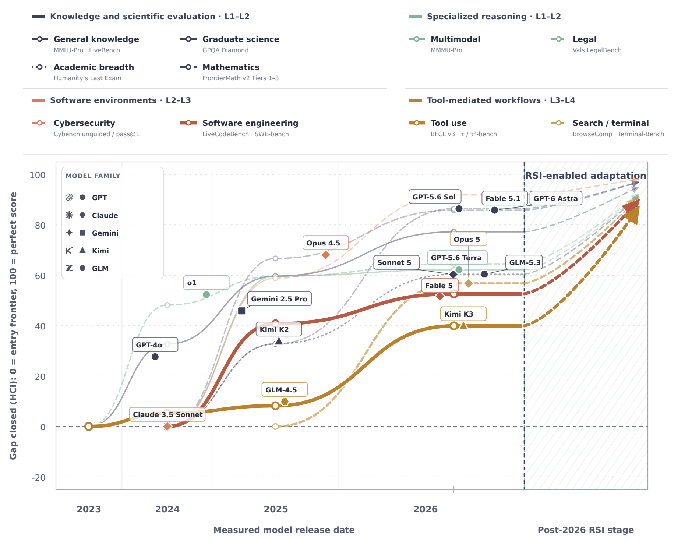

### 2.2 Conceptual Foundations of Recursive Self-Improvement

作者回顾自修改程序、Gödel Machine、AutoML、元学习、持续学习、开放式学习和 agentic ML，指出这些范式分别覆盖改进环的局部。统一比较单位应是 improvement loop：谁产生经验、修改什么、什么被保留、谁掌握更新决定，以及一次改进是否参与下一次改进。

### 2.2.1 Anatomy of an Improvement Loop

这一节是全文最重要的判读工具。作者不用“会不会反思”“是否使用 RL”或“运行了多少轮”来定义系统，而是追踪一项变化能否从当前任务返回到未来的 AI 系统。一个完整改进环至少包含五个动作：先从任务或环境取得经验；据此提出对某个目标的候选修改；用验收规则检查候选；将通过检查的修改写入系统状态；让携带新状态的系统参与下一轮。少了最后的重新进入，前四步可能只是在处理当前任务（`src/foundations.tex:91-122`）。

**先划定系统边界。** 论文的 *AI system* 指跨改进周期被追踪的完整计算实体，不只是语言模型权重。它可以包括产生补丁的模型、读写记忆的逻辑、工具调用和执行环境、测试与验收模块，以及能被下一轮读取的代码或策略。边界必须在评价前说清：如果研究对象是一个 coding agent，修好客户的排序函数通常是任务成果；如果研究对象是会持续维护自身代码库的开发系统，该函数又可能是它继承的系统状态。不能在报告性能时把外部产物算进系统，在报告自治时却只检查模型本身（`src/foundations.tex:91-100`）。

九个部件可按一次更新从何而来、经谁处理、最后留下什么来理解：

| 部件 | 在一轮中承担的角色 | 核查时要问的具体问题 |
|---|---|---|
| **AI system** | 被追踪的完整系统 | 下轮究竟启动哪个 agent、工具和控制程序？ |
| **System state** | 当前轮结束后会保存的部分 | 保存了权重、代码、记忆、技能，还是只保存了一份报告？ |
| **Experience** | 已发生交互提供的证据 | 失败测试、环境结果或人工纠正是否真正用于下一次修改？ |
| **Target** | 本轮直接被修改的对象 | 改的是任务答案、agent 工具，还是产生工具的方法？ |
| **Improver** | 把状态和经验转成候选的机制 | 谁阅读证据并提出补丁、策略或参数更新？ |
| **Strategy** | improver 决定搜索位置与候选生成方式的方法 | 是固定扫描所有文件，还是根据失败定位高风险代码？ |
| **Verifier** | 对候选应用现行验收规则的机制 | 用哪些测试、指标、人工检查或安全约束决定接纳？ |
| **Improvement** | 按现行规则通过且实际保存的变化 | 候选是否进入下一轮状态，而非仅在当前任务得分较高？ |
| **Successor** | 继承上述变化并继续运行的后继系统 | 能否指出新版本何时再次读取并使用这项更新？ |

**Experience 与 target 解决两个不同问题。** Experience 是“为什么要改”的依据，例如一条排序函数的超时记录、一项单测失败、环境回报或审阅者纠正；target 是“这次改哪里”，例如排序函数实现、agent 的检索规则或测试生成策略。即便经验来自同一个任务，target 也可能由决策者选择。若系统只是按人给定位置修改，AI 掌握的是执行；若它能从失败证据判断应优先改函数、工具调用还是 prompt，才开始掌握干预策略。经验不等于任何原始日志：只有当某条记录实际影响候选或后续选择，它才在这一轮承担了 experience 的作用（`src/foundations.tex:99-108`；`src/L1.tex:1-24`；`src/L2.tex:1-73`）。

**Improver 与 strategy 也不是同一个部件。** Improver 是生成修改建议的机制，可能是一个读代码与测试输出的 agent；strategy 是它如何选搜索范围、如何采样或排序候选的方法。一个 agent 可以保持同一基础模型，却从“随机改一处”改成“优先查失败测试涉及的调用链”。此时发生变化的是 strategy；如果这个新的搜索办法被保存并在以后再次运行，strategy 也变成下一轮可修改的 target。作者强调这一点，是为了区分“系统用既定方法找到了更好补丁”和“系统改进了未来寻找补丁的方法”（`src/foundations.tex:107-112`）。

**Verifier 负责的是按现行规则验收，而非证明真实世界中一定更好。** 它可以组合单测、性能基准、奖励模型、环境结果、形式约束、安全检查和人工反馈。通过一套不完整的测试，仅说明候选满足这套测试；验收规则本身可能有盲区，还可能随着优化次数增加而被利用。论文把 *improvement* 定义为被验收并继承的修改，是一种操作性定义；它不自动等于跨任务能力提升、更低总成本或更安全的行为。需要独立评测来验证这些更强主张（`src/foundations.tex:112-119`；`src/intro.tex:116-130`）。

**用论文的代码优化例子走两轮。** 第一轮，开发系统读取排序函数、最近一次超时和错误测试；improver 按现有搜索策略提出补丁，verifier 检查正确性与速度。只有被接纳的补丁写进下次启动时实际加载的版本，它才成为持久状态，加载这个版本的系统才是 successor。第二轮出现新的代码优化任务时，若系统只是调用原样不变的补丁生成与测试流程，并没有证据说明改进机制本身变强；若上轮经验还促使系统修改了“如何根据失败选择代码位置”的程序，且新程序在第二轮真的控制候选生成，才可观察到改进过程被继承和再利用。这个两轮例子是对论文定义的展开说明，不是论文报告的独立实验（`src/foundations.tex:91-122`）。

三个容易误判的边界由此变得清楚。**只修当前输出**：当前排序任务反复改到测试通过，但下一独立任务仍从原始 agent 与原始状态开始，环闭合在当前任务，属于 B0 式修订。**只存一份记录**：日志里写着“以后优先检查超时路径”，但下一轮 improver 不读取这条记录，保存动作未构成有效继承。**只得到更高分**：补丁被验收并写回了系统，却未比较后继者在新任务或相同预算下的表现，只能确认结构性更新，不能断言能力复利（`src/foundations.tex:91-122`；`src/L0.tex:24-54`）。

可以把每轮记为“继承状态 $S_t$ + 本轮经验 $E_t$ → 候选 $C_t$ → 验收决定 $A_t$ → 后继状态 $S_{t+1}$”。这只是帮助核查的记号，不是原文给出的数学模型。它迫使我们检查两处经常省略的边：$E_t$ 是否真的参与候选生成，$S_{t+1}$ 是否真的成为下一轮的输入。仅有 $C_t$ 通过当前测试，或者把结果写到不再读取的日志，都不足以证明这两条边存在；若声称递归，还需指出 $S_{t+1}$ 中改变了哪一种后续候选生成、验证、选择或整合机制（`src/foundations.tex:93-125`）。

**拒绝候选也是环的一部分，但不等于 improvement。** 若排序补丁让基准更快却破坏正确性，verifier 应拒绝这次状态写入；错误日志可以留作下一轮经验，当前候选却不能称为已继承的改进。若候选通过验收，但新版本在下一任务从未被启动，仍只有“找到并保存一个候选”，没有后继使用证据。若修改的是 verifier，必须说明旧尺和新尺如何与独立锚点连接，否则所谓连续进步可能只是评分尺度改变。这样拆开“提出、通过、保存、调用、独立收益”五个事件，才能解释为什么论文反复强调闭环位置和继承载体（`src/foundations.tex:93-125`；`src/intro.tex:121-127`）。

**用同一种分页失败比较责任边界。** 以下是把作者的等级定义应用到同一情境的解释性对照，不是论文报告的六组实验。设 agent 读取 issue API 时漏掉第二页；观察下一任务时究竟继承了什么、谁决定下一步，便能看到等级差别：

| 层级 | 本次失败后做什么 | 下一轮真实继承什么 | 仍需核实的关键点 |
|---|---|---|---|
| B0 | 重试当前请求，直到此任务读全页 | 没有跨任务系统更新 | 关闭会话后是否回到原状态 |
| L1 | 按人定 runbook 修补分页调用并通过测试 | 经验收的代码或固定技能 | 修补是否进入后续运行版本 |
| L2 | 自行诊断该改 prompt、API 工具还是 harness | 被选中的 agent 级改动 | 诊断和干预选择是否真的由 AI 控制 |
| L3 | 根据自身漏页弱点安排更多分页练习 | 更新后的学习状态及下一轮取样依据 | 练习分布是否随 learner 状态改变 |
| L4 | 从真实部署轨迹提炼并发布分页技能 | 线上可调用、可淘汰的状态 | 新任务是否激活，回归与权限如何处理 |
| L5 | 修改今后生成或检验工具的程序，要求检查分页 | 后续改进器或 verifier 的新版本 | 它是否再次产生更强后继者，而非仅修这次漏页 |

同一个修复动作的等级取决于环的**位置和控制权**，不由“分页任务看起来有多难”决定。例如保存 `fetch_all_pages` 工具并让线上 agent 调用，能说明持久工具变化；只有自动改写今后生成/验收工具的规则并再次使用该规则，才能进一步主张改进机制被递归继承。即使到了 L5，规则是否更有效仍要用独立任务与匹配预算检验（`src/L0.tex:24-54`；`src/L1.tex:1-24`；`src/L2.tex:1-73`；`src/L3.tex:3-97`；`src/L4.tex:1-62`；`src/L5.tex:1-53`）。

因此读本文任何案例，都应能回答三个可检验的问题：**环在哪里闭合**，即新任务从哪个更新后的系统开始；**什么被继承**，即具体文件、权重、记忆条目、技能或评测器版本；**哪些决定仍在系统外部**，即目标、候选范围、搜索规则、验收指标、发布权与资源上限由谁控制。后文 B0–L5 正是沿这三问逐级讨论责任转移。最强的证据不是“我们运行了很多轮”，而是把修改的触发证据、候选、验收和下一轮实际调用串成一条可追踪的链（`src/foundations.tex:118-122`；`src/cross_level.tex:1-8`）。

### 2.2.2 Definition of Recursive Self-Improvement

RSI 要求经验和反馈产生持久的自我变化，而且这些变化能影响后续改进的生成、评估、选择或整合。目标可以是扩大能力前沿、提高每单位资源的有效改进，或发现超出人类预设策略的方案；仅优化一次外部产物或在固定流程内反复修订，不足以构成 RSI。

严格定义中的“递归”落在**下轮改进过程受上轮自我变化影响**，不要求每轮都修改基础模型权重。例如一个 agent 学到分页 API 的失败模式并保留 `fetch_all_pages` 工具，后续工作可能更好；若它进一步根据这个失败改变今后如何生成或验证工具的程序，并继续继承该程序，才接近 L5 的元改进。反过来，自动修改外部网站或合成更多训练题，若 AI 自身状态和改进机制未随之改变，就不能凭“AI 在循环工作”称为 RSI（`src/foundations.tex:124-132`）。

**定义的三个必要连接。** 第一，经验来自持续任务、环境或其他智能体的交互，而不是凭空增加一个后处理步骤。第二，反馈要自主转成跨轮保留的自身变化，载体可以是参数、harness 或 policy。第三，改变后的状态必须有机会影响以后怎样提出、评价、选择或整合新的自我变化，并以继任系统重新进入下一轮。单独满足任一项都不充分：有长期记忆但不控制后续改进，是持久适应；有自修改代码但只跑一次，是一次优化；有多代循环但每轮沿外部固定搜索法执行，递归机制主张仍需限定（`src/foundations.tex:124-127`）。

**目标与证据分开。** 论文把扩大能力前沿、提高资源效率、发现新策略列为 RSI 的三个目标；它们不是用来替代结构定义的三个证据。系统可能保留了会再调用的研究策略，但四轮性能不升；这仍有机制继承，却没有有效进步。也可能当前得分大涨，但源于更多候选或评测漏洞；那不能反推递归机制存在。工业讨论中的“自动研究反馈环”“自改进模型”和“自行开发后继者”采用不同严格度，阅读时应以具体循环而非标签核查（`src/foundations.tex:125-129`）。

### 2.2.3 Relation to Neighboring Paradigms

持续学习关注跨任务保留能力，但通常固定学习目标和更新规则；AutoML 自动搜索配置，却通常固定搜索空间、预算和评测；agentic AI 能执行多步任务，但可能只在单个 episode 内运行。它们在持久状态能够反过来修改后续改进机制时，才越过 RSI 边界。

三者与 RSI 不是互斥集合，而是能提供不同环节：持续学习提供记忆与遗忘控制，AutoML 提供候选搜索，agentic ML 提供工具执行和实验编排。差异是持久化的状态是否包含*改进器/策略/评估器*，并真的在后续轮次使用。论文对照表是概念性分类：某个 AutoML 系统一旦允许搜索器自身成为可验证、可继承的修改目标，就会跨越原有范式边界（`src/foundations.tex:133-195`）。

| 范式 | 通常最关心什么 | 常见的持久状态 | 进入严格 RSI 还需什么 |
|---|---|---|---|
| 持续学习 | 新任务上学习且不忘旧任务 | 权重、适配器、记忆、技能 | 不只更新知识，还让经验修改以后如何提议、检验或整合更新 |
| AutoML | 在给定目标下找到更好配置/架构/流程 | 最佳候选、搜索历史 | 搜索或评估程序自身能被持久修订并在下一轮复用 |
| Agentic AI/ML | 多步规划、工具执行和实验编排 | 任务产物，某些系统也存 agent 工件 | 被验证的 agent 状态变化要跨独立任务继承，并影响后续改进 |
| 严格 RSI | 系统及其改进能力的连续变化 | 后继系统及其改进机制 | 还要用独立、可比预算的多代证据检验是否真的更有效 |

原文的勾选表强调的是各范式的**典型研究目标**，不是断言某个持续学习或 AutoML 系统永远做不到 RSI。尤其“有持久状态”“会提议候选”“能自我修改”三件事必须联立判断；缺一项时，单个看起来很强的能力仍可能只是局部自动化（`src/foundations.tex:133-195`）。

### 2.3 Scope of Evidence

作者有意混合学术和产业证据，以捕捉尚未完全发表的生产级闭环，同时明确标注其证据强度。工程报告可以证明环如何运行和什么被继承，但公司自报结果、技术愿景和独立复现之间不能等同处理。

纳入产业材料的准则是它能提供具体的改进环结构或运行证据，例如跨轮保存的工件、候选如何与工具/evaluator 交互、更新后系统是否继续工作。论文列出的来源包括官方技术/研究报告、工程博客、开源库、模型文档、GitHub/Hugging Face 发布以及公开 benchmark/竞赛榜单。它们能补足尚未写成论文的工程实践，也使证据异质：一个系统的架构图可证明设计意图，执行日志可证明局部操作，受保护的多代对照才可支撑递归效益结论（`src/foundations.tex:196-201`）。

**读一则产业案例的具体步骤。** 先从公开材料提取时间顺序：触发失败、提出更新、验收、发布、后继任务；再找每步的可核对工件，如版本号、提交、评测报告或任务日志。材料若没有说明数据或评测协议，记录为未知，不能假设公司内部已经提供独立验证。若图画了“反馈→改模型”，但只公布单次上线指标，就能讨论设计思路，不能断言已经观察到多代递归。这个证据规则同样适用于学术论文的系统图和性能表（`src/foundations.tex:196-201`）。

### 3 RSI Across Autonomy Levels

本章是全文主线。B0 到 L5 不是能力强弱榜，而是改进责任逐步内化的边界：从当前输出的修订，到继承系统状态、选择改进策略、决定学习经验、吸收部署反馈，最后让改进机制本身成为继承对象。

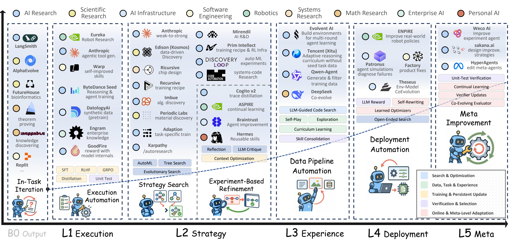

### 3.1 B0: In-Task AI Improvement

B0 只改变当前任务的输出，不把状态带到未来独立任务，因此是非 RSI 的参照级。Self-Refine、Reflexion 和 Tree of Thoughts 可以在会话中生成、评价、修订候选，但上下文结束后经验被丢弃；固定验证器、自我批评盲点和重复迭代的边际收益，使 B0 无法形成持续学习。

这里的 B0 更准确是**非 RSI 参照级**：Self-Refine 的反馈修订、Reflexion 在当前运行中的 verbal memory、Tree of Thoughts 的树状搜索都可能改进一次任务，但下一个独立任务并未必继承可用的系统更新。即使一次 rollout 中有多个反思步骤，只要目标、评测和后续系统状态没有跨任务变化，环就闭合在这次任务里。论文列出四类局限：不累积跨任务增益、程序依赖人预设、同一模型自评可能重复盲点、固定测试下迭代会耗尽收益或适应测试（`src/L0.tex:24-54`）。

**把 B0 的时间边界画清楚。** 一个 coding agent 在五次机会内反复改补丁并调用人给的测试：第 1–4 次失败反馈确实影响第 5 次输出，故它有当前任务内部的反馈环；任务结束后，若下一个仓库仍加载原 prompt、原工具和空白上下文，这些失败反馈就没有进入系统状态。写作 agent 按 rubric 多次改一篇文章、Tree of Thoughts 探索很多分支也是同一逻辑。可用“关闭当前任务后重新初始化，再给独立任务”检验继承，不能只统计一次会话有多少步（`src/L0.tex:27-40`）。

四类局限也并不完全等价。**无累积**是结构问题，更多迭代次数无法补救；**人定程序**是责任问题，接入工具或仿真环境仍可能照着固定步骤运作；**自评盲点**是信号问题，生成者和批评者共享知识缺口时，修订甚至可能把正确答案改错；**固定验证收益递减**是优化问题，反复对不完整单测调参可能只适应测试。外部验证和独立采样可改善当前任务结果，但若仍无持久系统更新，它们提高的是 B0 的任务表现，尚未越过 B0 边界（`src/L0.tex:38-54`）。

### 3.2 L1: Autonomy over Improvement Execution

L1 由人定义目标、程序和验收标准，AI 执行程序并把合格产物写入持久状态。相比 B0，关键变化是更新会进入后续任务；代价是流程覆盖不到的情形仍无法自行改流程，错误执行可能被持久化并传播。

本级**自治的是执行权**，不是改进方针。可以把人工维护的程序写成“检查数据 → 生成候选 → 运行测试 → 人定阈值接纳 → 保存产物”；AI 在每步可做复杂工作，但它不能凭评测失败自主决定改换整套搜索或验收逻辑。论文沿实际开发链列出六个落点，数据、训练方法、训练平台、评测安全、部署优化、应用系统；其中数据层再分清洗筛选与合成数据两类（`src/L1.tex:1-24,165-218`）。

Meta Capacity Efficiency 的可复用修复技能是产业型执行自治例子：AI 按工程流程诊断和提出修复，工程师仍负责 PR 审查与整合。它说明“跨任务可复用的修复经验”可以进入工程系统，同时保持外部发布权（`src/L1.tex:4-5`）。

六个落点使用同一个 L1 判据，但写回的状态并不相同。数据层写回训练样本，训练方法层写回学习信号，平台层写回运行实现，评测层写回供后续决策使用的检查结果，部署层写回可运行工件，应用层写回产品代码或技能。判断时必须先指定**哪个系统在变好**：产品代码的进步不自动等于开发它的 agent 在进步（`src/L1.tex:7-24,165-218`）。

用一条实际开发链看，数据 agent 按预设质量标准挑样本，训练 agent 按预设规则使用样本，平台 agent 按 runbook 排障，评测 agent 按专家 rubric 打分，部署 agent 按目标硬件约束转换模型，应用 agent 按产品规范把它接进服务。每段都有可能产出后续会用的工件，却不意味着整条链由同一个 AI 自主协调，也不意味着后一段能修改前一段的验收标准。L1 的“自我改进”应结合所声明的系统边界解释：若被追踪的是整条开发流水线，持久工件可能进入下一轮；若被追踪的是某个执行 agent，则产物写回外部业务仓库未必改变它（`src/L1.tex:7-24,165-218`）。

| 开发环节 | AI 执行的程序 | 可继承产物 | 验收者或固定边界 |
|---|---|---|---|
| 数据 | 按 rubric 标注、过滤，或按模板合成样本 | 训练/监督数据 | 人定义质量与任务标准 |
| 训练方法 | 诊断并修订推理步骤、生成奖励 | 修订样本或优化后的参数 | 人定义反馈、训练规则 |
| 训练平台 | profile、改代码、跨 rank 排障 | 训练实现或修复 | 正确性、性能测试及 runbook |
| 评测安全 | 按专家 rubric 批量评分 | 可用于筛选/训练的反馈 | 专家定义 rubric 与发布阈值 |
| 部署优化 | 转换、量化、兼容性修复 | 目标硬件上的部署工件 | 平台、精度与运行约束 |
| 应用系统 | 服务集成、接口与产品代码维护 | 合并后的产品资产 | 产品意图、架构、CI 与人工审查 |

### 3.2.1 Data Level

数据层主要有两类 L1：按人定义的质量标准清洗、筛选和去重，以及按固定流程生成合成样本和监督信号。FineWeb-Edu、NeMo Curator、Data-Juicer、SynthLLM、SynthAgent 等把专家标准规模化执行，但不由 AI 决定标准本身或下一轮学习议程。

前一类的实质是把“什么是可用样本”的 rubric 和去重/过滤要求大量执行，输出是能进入未来训练的数据集；后一类把预先规定的任务模板、角色或执行轨迹转成新的训练样本。合成样本数量增加仍需独立质量检查；如果模型反复复制自己的错误而没有外部校验，持久化反而会放大偏差。是否达到 L3 取决于下一批经验是否**依据变化中的学习者状态**选择，不能只看是否“自动生产数据”（`src/L1.tex:25-58,165-172`）。

具体地，Google 的标签流程让模型先标注，再把聚类和边界样本送专家复核；FineWeb-Edu 用模型形成教育质量标签，再训练分类器在大规模网页上执行过滤；NeMo Curator/Data-Juicer 把清洗、分类、去重封装为可配置模块。它们分别把人工注意力集中到难例、把少量质量判断扩展到大语料、把处理流程复用到新批次。三个设计都要保存 rubric、过滤器版本和被丢弃样本的审计记录，否则下一轮数据集改变时无法判断模型进步来自内容、筛选规则还是泄漏（最后一项是由论文机制推出的核查建议；`src/L1.tex:165-170`）。

源码还举了三种更具体的分工：Google High-Fidelity Label Curation 先让 LLM 初标，再将聚类与边界样本交专家复核；Phi-4-reasoning 按人设的难度和推理特征筛选靠近能力边界的样本；Nemotron-4 用 instruction model 生成候选，再由 reward model 依人设维度过滤。它们自动执行了庞大而重复的数据工作，但质量标准和验收权仍由人设定（`src/L1.tex:165-170`）。

**看一次新数据批次的传递。** 人先指定教育内容的质量条件，模型为少量网页打标签，分类器据此过滤更大语料，合格数据写入下一次训练集；训练后的模型在新任务上接受评测。这里“网页过滤→训练集”是明确的继承边，但选择哪类知识更该补、是否改变质量条件，仍由人或固定配置决定。FineWeb-Edu 的标签流程可说明 L1 的规模化执行，不能只凭它出现“靠近能力边界”的字眼就把它升为 L3（`src/L1.tex:165-170`；`src/L3.tex:43-63`）。

合成数据的另一条风险链是“模型生成候选→reward model 筛选→候选进入训练→新模型再产生样本”。如果筛选器和生成器共享偏差，错误样本会被保留并在下轮放大。因此应分开报告生成多样性、筛选精度、训练后外部收益与污染率；只报告产出多少条 instruction/trajectory，既不能证明质量，也不能证明改进闭环有益（由 `src/L1.tex:166-170,206-212` 推出）。

### 3.2.2 Training-Method Level

EDIT、REPO 等把诊断、局部修订、LLM 评审和奖励生成编成固定训练流程。AI 能按 rubric 修正推理步骤并产生后训练信号，但目标、反馈和更新规则仍由研究者预先设定。

EDIT 按 rubric 定位并局部修理错误推理步骤，把修订结果用于后续 RL 校准；REPO 用 LLM judge 检查 SOP 合规，再把判断转成奖励供 policy optimization。两者都把人工设定的修订/评判程序用于训练信号，但机制不同。需要检查数据或参数更新是否真正进入后续模型版本；仅对同一条推理生成修正版，仍可能是 B0。即使训练成功，候选改写规则和评分器未随经验改变，自治也仍限于 L1（`src/L1.tex:172-178`）。

两者的反馈位置不同：EDIT 在一条推理链内部找有问题的步骤，仅修局部，再把修订答案送进后续校准；REPO 在多轮交互中按 SOP 检查行为过程，把合规判断变成优化信号。前者避免把正确步骤和错误步骤一起重写，后者让“怎样做”也可被奖励。若只展示 judge 给了分、修订器产出文本，而没有展示这些信号如何更新后继 policy，证据就停在反馈生成；若 policy 确实更新了，也仍需单独验证 judge 与 rubric 的可靠性（`src/L1.tex:172-176`）。

**把“修答案”和“改模型”分开。** EDIT 第一步找错误推理步骤，第二步只替换有问题的片段；修正版随后用于 RL 校准，才使后继模型有机会不同。若评估只看同一道题被修正，证明的是局部修订；若比较校准后模型在未见题上的推理表现，才测到学习效果。REPO 同理，judge 的 SOP 合规评分只是中间反馈，真正的跨轮对象是用该奖励优化后的 policy。两个方法都在专家定义的诊断/奖惩规则内运行（`src/L1.tex:172-176`）。

需要关注“反馈目标错位”：SOP 可以让流程更规范，却未必让最终答案更正确；局部推理 rubric 可以修表面步骤，却漏掉整体假设错误。因而后续模型应同时接受过程合规、最终正确性与未见任务回归检查，避免把对 rubric 的适应写成通用推理能力增强（基于 `src/L1.tex:172-176,206-212` 的验证建议）。

### 3.2.3 Training-Platform Level

平台层将性能分析、代码优化、分布式训练故障诊断和恢复固化为 runbook。AI 可以定位热点、提出实现修改并回滚失败候选，也可以沿 NCCL 故障决策树对齐 rank 日志；它执行的是工程经验，而不是自主发明诊断程序。

论文举 C/C++ 性能优化与 Meta NCCL 排障等例子：执行器能编译候选、测延迟、分析崩溃日志，或根据人写出的 runbook 合并多 rank 证据。它们降低重复工程劳动，但“先检查哪些故障”“用什么测试晋级”仍由专家维护。平台层的好处是反馈常可执行和回滚，风险是微基准变好但全链路训练不稳定（`src/L1.tex:76-111,178-188`）。

**两条平台链条。** 性能优化从 profile 指出的热点出发，按既定流程改代码，再先测语义正确、后测目标负载下的速度；失败候选回滚，成功候选成为下次运行的实现。NCCL 故障排查则从 watchdog timeout 等日志出发，把不同 rank 的 collective 序列对齐，定位最早可操作的分歧，再依 runbook 修复。前者的验收对象是性能与正确性，后者是故障归因和恢复；二者的 agent 都能执行多步工程判断，但诊断树和最终发布标准仍来自外部（`src/L1.tex:178-186`）。

**继承究竟发生在哪里。** 一个新 kernel 或排障脚本写入平台仓库，后续训练会沿新实现运行；若仅输出一次故障报告而未改变下轮平台状态，则不能据此说平台完成了自改进。单点延迟下降也不说明端到端训练更快，故要保留原 workload、硬件、编译与日志条件，分别测局部收益和整轮运行稳定性。后一组是由论文“执行可靠性 + 持久化安全性”推导的核查项（`src/L1.tex:178-188,206-212`）。

### 3.2.4 Evaluation-and-Safety Level

AI 将专家写出的 rubric、风险标准和测试协议应用于大规模输出，例如 HealthBench 让模型按医生定义的医疗标准评分。此类系统可提供一致的反馈信号，但验收目标、阈值和安全边界仍由人维护。

医疗或安全评测中的 evaluator 本身可能出错，因此“LLM judge 打分”只是扩展检查吞吐，不能取代独立审阅。L1 只有在评测输出用于筛选、修订或训练后续系统时才有跨轮继承；一次性给客户报告打分是应用任务，不一定是 AI 系统改进环（`src/L1.tex:111-125,188-194`）。

HealthBench 的流程把“理想回答应包括/避免什么、各项重要性”先交由医生写成具体 rubric，GPT-4.1 再逐项应用到候选回答。扩展的是*执行评测*的吞吐，不是让 judge 自己决定医疗规范。如果评测结果进入下一轮模型选择或训练，保存的载体首先是分数与反馈记录；被选模型是否真改善临床相关行为，还需与医生评价、未见病例和风险子群体核对。评分一致性高也不能保证 rubric 覆盖了所有伤害（`src/L1.tex:188-192`）。

本级还要分清“评测器是工具”与“评测器是改进目标”：L1 中模型照固定风险标准评分；若系统根据评分失败主动改写 rubric 或晋级规则，已触及更高层的控制权与评测漂移问题。读报告时应记录 rubric 版本、评分模型版本和专家复核比例，否则不同轮次的得分变化可能只是尺子变了（后一句是基于原文机制的审计建议；`src/L1.tex:188-192`；`src/L5.tex:63-67`）。

### 3.2.5 Deployment-Optimization Level

AIPC 等系统把模型转换、兼容性修复、量化校准和目标硬件验证编成分阶段流程。给定平台和约束后，AI 生成可运行部署产物并执行验证，但不会自主改变部署目标或约束。

此处持久化对象是经过转换、校准和阶段验证的可运行部署工件。论文列出的边界是目标平台、模型及约束由外部给定。**实际评测建议**是分别检查正确性、精度损失和目标硬件上的吞吐/延迟，保留失败时回滚能力；代理环境的分数不能替代目标设备上的验证（`src/L1.tex:194-200`）。

AIPC 的过程可拆为“输入已训练模型和目标 Qualcomm AI Runtime → 转换模型表示 → 解决算子/接口不兼容 → 按校准集量化 → 逐阶段验证 → 交付运行工件”。每阶段失败都会影响下一阶段是否有意义：转换失败不能开始速度比较，精度劣化不能只用更快吞吐来抵消。Agent Skills 在这里是执行专家程序的载体；被继承的是部署版本，不是部署 agent 自行重写了目标硬件约束（`src/L1.tex:194-198`）。

对照实验需让人工流程与 agent 流程面对同一初始模型、校准数据、目标设备和精度阈值，比较达到合格部署所花时间及失败率。若只报告某个运行工件的最终速度，无法归因于 AI 执行器、既有工具链或不同量化设置。这是用论文的 L1 可靠性判据推导的评测设计，并非 AIPC 原文已完成的全部比较（`src/L1.tex:194-212`）。

### 3.2.6 Application-System Level

Agent Toolkit for AWS、LinkedIn CAPT 和 Harness Engineering 把服务集成、接口实现、代码维护、测试和回滚写成可复用技能或 playbook。AI 可在真实代码库中完成长流程并产出持久工程资产，人仍设定产品意图、架构和合并规则。

这类工程 agent 可能在复杂代码库里完成提交。分级前应先界定被追踪的 AI system：若持久产品代码本身是它下轮继续改进的状态，按固定 playbook 修改代码也可属于 L1；若只追踪 coding agent 的能力，那么合并产品功能并不自动表示 agent 自身变强。L1 的工作规则可以完全固定，关键是预设流程所产出的变化是否经验证并成为后续状态（`src/L1.tex:136-163,200-206`；`src/foundations.tex:91-98`）。

三个例子展示不同“程序化知识”载体：AWS Toolkit 的 Bedrock skill 告诉 agent 怎样把模型服务接入应用；LinkedIn CAPT 把组织内部建服务、扩接口和维护代码的步骤写成 playbook；Harness Engineering 由工程师确定产品意图、架构、CI、合并和回滚规则，Codex 在这些约束内执行实现与验证。任务复杂度可以很高，仍不代表 agent 可以改变产品目标或合并规则。真正进入下一轮的通常是服务接口、产品代码或工程资产；要称作 agent 自身改进，还需看到 skill、工具或执行策略怎样从这次经验被更新（`src/L1.tex:200-204`）。

本节的实用边界是“任务产物”和“改进载体”有时都叫代码。一个 PR 通过 CI 并合并，只证明产品仓库持久更新；若 PR 修的正是 agent 的 harness，且新 harness 在下次开发任务中启动，才同时形成 agent 级继承。论文把两类例子并列，是因为系统边界可不同；阅读时应明确报告讨论的是哪一个系统（`src/L1.tex:200-208`；`src/foundations.tex:91-98`）。

### 3.2.7 Evaluating L1 Execution Autonomy

L1 要分开测执行可靠性和持久化安全性：流程是否能在分布变化下正确执行，产物在进入后续流水线前是否经过有效检查。遇到流程未覆盖的状态时，L1 不能自行修改程序，因此长链路可靠性和继承前验证是核心指标。

实证上需要记录每个环节的成功率、错误传播率、人工干预、回滚和新任务复用，而不只报告“自动化率”。一个候选被错误接纳后，下一轮从污染状态开始；这正是 L1 比 B0 多出来的收益和风险。若评测只是一次任务成功率，无法证明继承的产物对后续任务有帮助（`src/L1.tex:206-218`）。

可以用两个相邻实验区分两项指标：在未见但仍属于 runbook 覆盖范围的任务上，量执行是否按步骤完成、多少次需要人工纠偏，这是**执行可靠性**；把已验收产物放入后续任务流，量错误传播、旧任务回归和回滚成本，这是**持久化安全性**。前者高而后者差，说明高吞吐制造了污染；后者好而前者差，则可能只是验收门过严。两项都不回答系统能否自行重写 runbook，那个问题属于更高自治级别（`src/L1.tex:206-218`）。

### 3.3 L2: Autonomy over Improvement Strategies

L2 把“下一步改什么”交给 AI：系统根据失败和评测证据选择干预、实例化候选、测试并保留结果；人仍指定目标、任务边界和验收标准。瓶颈由执行已知方案转为在巨大干预空间中做实验决策。

判定 L1→L2 的关键不是候选有多少，而是系统是否根据新证据**自主决定下一种干预**。例如测试显示工具调用失败后，agent 可以决定改 prompt、重排工作流或替换工具接口；若它只执行人设的固定改写顺序，即使并行生成数百候选也还是执行自治。L2 的典型闭环为“诊断失败→选择策略→生成变体→固定评价→保留胜者”，整体目的、预算和 verifier 一般固定（`src/L2.tex:1-73`）。

这里的“策略”是某次改进要采取的具体方向，不等于搜索框架本身也能自改。比如 AFlow 可以在固定 MCTS 框架内决定探索哪条工作流分支；这证明 AI 控制候选路径，尚未证明它能修改 MCTS 的选择规则。类似地，模型设计 agent 可以提出预先没有枚举过的架构，但目标指标和决定晋级的验证集仍可完全外置。论文据此**按被搜索的对象**组织 L2，而不是按系统名字或候选规模分类（`src/L2.tex:1-96`）。

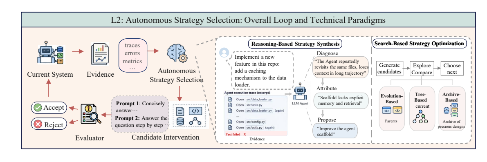

### 3.3.1 Prompt Search

GEPA 使用执行轨迹反馈，MPO 使用多模态评估导出的语义反馈，C-Evolve 遵循固定进化协议，分别搜索 prompt 或相关控制变量。自治点不在于能生成文字，而在于决定下一轮尝试哪类修订、是否保留候选变体；任务指标和搜索协议仍外置。

三个例子机制各异：GEPA 将执行轨迹中的失败反馈用于反思和 prompt 变异，并用 Pareto 风格的候选保留维护互补方案；MPO 从多模态评测结果提炼语义反馈后调整控制变量；C-Evolve 在人预设的进化框架里生成和筛选候选。Promptbreeder 共同演化任务 prompt 与变异 prompt，论文仍将它归为固定任务 fitness 下的 L2 搜索。**评测建议**是同时报告评测调用次数与最终表现，避免只呈现最佳 prompt（`src/L2.tex:73-79,141-144`）。

Dropbox 的生产场景展示 GEPA 如何从执行反馈中改 prompt，但生产可行性和受保护任务上的可迁移搜索收益仍是不同问题（`src/L2.tex:73-74`）。

**一次搜索怎样进行。** 以检索相关性判断 prompt 为例，先收集误判文件/消息及模型解释，再定位到底是遗漏用户意图、错误使用元数据，还是指令冲突；GEPA 类反思器据轨迹提出有针对性的文字改动，评估候选并保留互补的 Pareto 分支。它改变的是下次模型运行时加载的指令；搜索哪种修订由 improver 决定，判定检索质量的任务指标依然是外部目标。若只让模型按人给的模板替换词句，没有基于失败选择修订方向，自治点就退回 L1（`src/L2.tex:73-76`）。

多模态 MPO 的评价反馈可能指向非文本提示成分，C-Evolve 的候选按固定进化协议生成，Promptbreeder 连用于变异的 prompt 一并演化；这些方法搜索空间不同，但都需记录完整试验轨迹与评估调用数。反复读取同一开发集会让最优 prompt 适应这个集合，故最终应在未用于改写的任务上测，并与同预算的随机/固定搜索对照。否则无法判断收益来自反馈归因还是更多候选尝试（`src/L2.tex:73-76,141-144,221-235`）。

### 3.3.2 Agent and Harness Search

ADAS、AFlow、AgentSquare 和 Agent Optimizer 把可编辑对象扩展为 agent 代码、工具描述、工作流图和模块组合。候选 agent 的结构可以通过元 agent 编程、MCTS 或进化重组产生，但最终晋级仍依赖固定 benchmark 和评测器。

ADAS 让 meta-agent 编写可运行的 agent 前向程序并保存候选 archive；AFlow 用树搜索探索工作流图；AgentSquare 将 planner、memory、tool-use 等模块组合。搜索对象从字符串 prompt 扩大到可执行体系结构，因此需要沙盒运行、接口约束和跨任务检查。Microsoft Foundry 的生产 agent 调整展示了持续工程需求，但只有明确的“失败诊断→自选系统改动→验证继承”链条才能判为 L2（`src/L2.tex:79-95`）。

三种设计表示法使搜索动作不同。ADAS 的 `forward` 函数可同时改变角色分工、工具调用和控制流，archive 保存的是可再次运行的 agent 程序与分数；AFlow 的节点/边构成可执行图，MCTS 决定下一次探索哪条工作流分支；AgentSquare 通过可复用模块的组合与进化形成候选。一个候选若通过固定验证集并写入后续执行版本，就有系统级继承；但 archive 的维护、MCTS 的选择法或最终通过阈值若固定，仍不能把候选结构进化误称为搜索机制自我进化（`src/L2.tex:79-92`）。

验证难度比 prompt 更高，因为改动可能同时影响执行正确性、调用成本、权限和失败恢复。需要在相同基础模型、工具权限与总预算下，让新旧 harness 完成独立任务，并记录未成功候选和被拒绝原因。只报告 archive 中的最佳分数会掩盖搜索费用，也无法判断候选是否在另一任务真的被重新加载（`src/L2.tex:79-92,221-235`）。

### 3.3.3 Model and Training Search

L2 还可搜索训练配置、架构、训练规则和系统实现：TAO 在固定验证目标下分配试验，AgentNAS 从任务生成种子架构，NanoGPT/AutoResearch 让 agent 修改训练程序，AutoKernel 按 profiling 结果搜索 CUDA/Triton 实现。共同点是 AI 选择实验路径，正确性、指标和预算仍由外部保护。

AgentNAS 可从任务生成种子架构，后续搜索空间和评价规则仍有限定。GPT-6 Astra 的 NanoGPT 案例使用固定验证目标、单 GPU 与受限训练环境；Karpathy 的 autoresearch 则固定数据流程、评价函数、指标和单次实验算力预算。AutoKernel 从 profile 热点选择 kernel 候选，再用正确性测试和实际速度测量过滤。这里 AI 的贡献是更有效地分配实验和干预；若只记录最佳训练程序，尚不知道它是否学会了可迁移的研究方法（`src/L2.tex:96-220`）。

把“模型与训练搜索”拆成四种对象，才能看到自治究竟落在哪里：

| 搜索对象 | 代表例子 | AI 作出的决定 | 留在外部的边界 |
|---|---|---|---|
| 配置 | NVIDIA TAO / Cosmos 3 | 根据既往试验分配下一组配置，而非盲扫参数 | 模型、数据、任务、验证指标 |
| 架构 | AgentNAS | 生成任务相关种子架构，再导出可搜索的结构空间 | 后续搜索和验证规则 |
| 训练规则 | NanoGPT、`autoresearch` | 诊断瓶颈并修改训练代码、配置或训练循环 | 数据流、验证目标、单次算力预算 |
| 系统实现 | AutoKernel | profile 热点后决定改哪个 CUDA/Triton 实现 | 数值正确性与实测硬件速度 |

配置搜索的关键收益是把有限试验预算投向更可能有效的设置；架构搜索扩大了候选结构；训练规则搜索直接改变参数学习过程；实现搜索则在保持语义正确的前提下减少运行成本。四者都可以产生持久改进，但若下一轮仍由同一固定 improver 按相同程序搜索，就仍是 L2，而非 L5（`src/L2.tex:96-220`）。

还要区分名为 Auto Research 的多 agent 共享 lineage 系统与 Karpathy 的 `autoresearch`：前者用专职 agent 与共享历史安排研究尝试，后者固定本地训练实验协议。两者都属于 L2 的研究策略自治，不能合成同一个实验结果（`src/L2.tex:111-119,197-200`）。

### 3.3.4 Evaluating L2 Strategy Autonomy

策略空间越大不等于改进越好，需要分别报告搜索效率、跨任务迁移、资源成本和稳定性。自适应访问开发集会带来过拟合、随机种子挑选、标签提取和评测器盲点；公司结果可证明可行性，但不能替代独立复现和受保护测试。

有效对照至少应匹配初始模型、任务、工具、总评测次数、算力及人工调参时间；日志中要保存失败候选，避免只呈现被挑中的 seed。应在未参与搜索的任务和不同分布测试修改，并区分“更大搜索预算”的收益与“更好的策略选择”。L2 的高分若来自开发集反复试错或读取测试反馈，不能外推为真正的策略自治优势（`src/L2.tex:221-235`）。

**最小可判别实验。** 固定同一初始系统、候选生成接口、任务池和总资源，比较三组：人写好的固定干预顺序、AI 据反馈自选干预、同预算随机/简单启发式选择。记录每组的候选、验收、回退及最终未见任务表现。如果 AI 组仅多用了 evaluator 调用，归因不成立；如果在等预算下更快找到可迁移候选，才支持“策略选择有价值”。当候选还会成为下轮起点时，需额外检查多轮收益是否保持，避免一次开发集优势变成后续回归（依据 `src/L2.tex:221-235` 提出的评测展开）。

**何谓一次有效的 L2 干预。** 例如 agent 观察到代码任务反复因工具参数格式失败，选择先改工具描述而非继续重写系统 prompt；新描述在未见任务减少同类失败，且相同模型、工具和调用预算下优于固定改 prompt 的对照。这里的因果变量是“根据证据选择干预对象”，不是模型写工具描述的语言能力。若工具描述本身在未来自改进任务中成为选择策略的一部分，也要另测其机制继承，不能把一次 L2 成功直接升级到 L5（`src/L2.tex:1-95,221-235`）。

评价结果还要包含搜索轨迹：相同最终分数下，提议 5 个候选就找到有效变更和提议 500 个后挑中最佳，资源效率不同；前 499 次失败可能透露系统反复踩相同盲点。保留候选谱系、评测次数和人工介入才能检验“选择策略”是否真的改善（`src/L2.tex:221-235`）。

### 3.4 L3: Autonomy over Future Learning Experience

L3 让系统决定“下一轮学什么”。当前能力、失败和学习历史影响任务选择、任务生成或交互目标，而持久化学习又改变下一轮经验获取；人可以继续固定总体目标、评测器和更新规则。

严格链条是 `learner state_t → acquire experience_t → persistent learner update → learner state_(t+1) → acquire experience_(t+1)`。这意味着选题/取样器必须对变化中的学习者敏感；获取到的经验需要改变后续学习状态并反馈到下一轮取样，**能力收益是另一个待测问题**。系统可从现有题库自适应选题，也可自造题或主动进入环境寻求练习；自造题不是 L3 的必要条件（`src/L3.tex:3-97,366-374`）。

**一个自适应课程的最小例子。** 第 $t$ 轮模型在循环边界题上频繁失败，课程器读取失败簇，从已有题库挑出可执行、难度适中的边界题；训练让这些题的错误率下降。第 $t+1$ 轮课程器重新测当前模型，减少已掌握题的权重、转向新的弱项。若课程器始终按原计划抽题，即使训练分数上升，也缺 learner-conditioned 获取；若题分布改变却没有持久 learner 更新，只是在线任务选择。这个例子根据 L3 图的 loop-bound 错误示意展开（`src/L3.tex:3-93`）。

课程器可以独立于 solver，例如 SIMA 2 的 task setter；这不影响对**完整学习系统**的 L3 判定，前提是任务设置器确实读取当前 solver 反馈，并且受训 solver 使下轮设置改变。报告系统边界时须同时说明课程器、solver、reward model 和持久状态，避免仅检查 Actor 是否亲自“想出练习题”（`src/L3.tex:43-71,331-341`）。

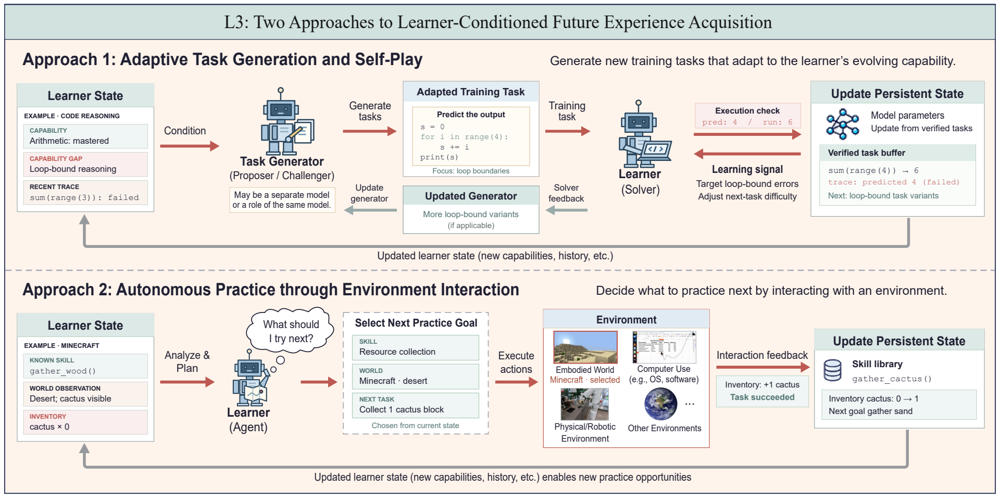

### 3.4.1 From Industrial Automation to Experience Autonomy

数据摄取、过滤、标注、混合和训练编排的自动化本身不构成 L3。关键证据是 learner state → experience acquisition → persistent learning → later acquisition 的闭合依赖；固定选择算法如果响应变化中的 learner 也可能是 L3，而反复生成样本却不看 learner 就不是。

产业系统常把数据管道、合成、标注、训练和评测全部自动化，但其课程可能仍由静态配方、人工里程碑或固定权重控制。要证明 L3，需展示取样决定如何读取当前能力、置信度、失败簇或技能覆盖，并做冻结 learner-state 输入的消融；否则训练后分数变高也可能只是更多数据或更多训练步的结果（`src/L3.tex:98-225`）。

论文把产业数据流水线概括为六项功能：**来源准备、标注、筛选、构造、混合与训练编排、模型反馈诊断**。它们可以出现在预训练、监督微调、偏好优化和 RL 的不同阶段，也未必按这个顺序串行执行。图中的 M/H/A 横向位置只是作者依据公开材料作的定性综合，不能读成某企业的自动化率。真正的判别实验是让两套课程拥有相同的数据源和训练预算，但一套读取最新 learner feedback，另一套始终使用固定计划；如果取样会随 learner 变化，且更新后的 learner 又改变后续取样，才观察到 L3 的特征闭环。公开的数据流水线描述本身不足以证明这个闭环，也不能据此断言产业系统没有它（`src/L3.tex:98-149`）。

**把六项功能和取样权分开。** 来源准备决定可访问数据，标注提供标签，筛选淘汰低质或重复样本，构造生成新的训练单元，混合/编排安排训练配比与顺序，反馈诊断指出当前模型的失败簇。前五项即便全部由 AI 自动执行，若输入配方每轮固定，依旧可能是 L1；只有诊断结果回到“下一轮选哪些经验”的决定，并因 learner 更新而再次改变，才体现 L3。这个判断无需假设 AI 发明新题：在同一个大题库里按当前弱点改变抽样也够（`src/L3.tex:43-63,98-149`）。

可读的一条日志应至少显示：第 $t$ 轮 learner 在哪类题上失败、取样器因此提高哪些样本权重、训练后该弱项怎样变化、第 $t+1$ 轮权重如何调整。缺少前两项，只看到模型得分上涨，不能归因于自适应课程；缺少最后一项，则可能只是一次筛选，没有闭合的经验获取环（`src/L3.tex:43-63,366-374`）。

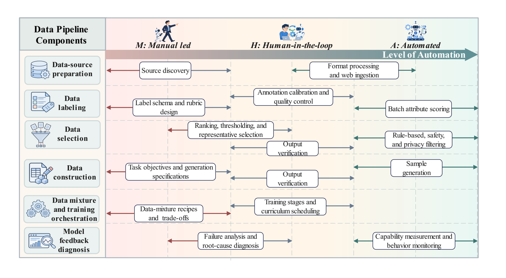

### 3.4.2 Adaptive Task Generation and Self-Play

SSP、AZR、R-Zero、STP、PSV 和 VisPlay 用 solver 表现、一致性、不确定性或可执行结果塑造下一批任务。形式证明和代码执行能保证指定性质，但一致性和难度奖励只是代理信号，未必代表正确性或真实学习收益；难度控制也可能出现类别重叠和窄化。

例如 AZR 用可执行检查约束自生问题的答案，R-Zero 用当前 solver 的不确定性选择“刚好有挑战”的任务；但高不确定也可能代表题目含糊。STP 的形式证明能提供任务正确性的强信号，却不自动证明它适合当前学习者；PSV 由规格生成任务，可检查规格满足性，但“满足规格”与“学完能迁移”仍是两种判断。VisPlay 等自博弈方法可能不断提高对特定对手/环境的适应，须用外部任务检验覆盖与迁移（`src/L3.tex:226-308`）。

再看三个细节：STP 让 conjecturer 和 prover 双向训练，前者生成可证明猜想，后者尝试证明，形成任务生成与求解的联动；PSV 想控制目标难度，但源码报告目标难度和实际实现难度有大量重叠，说明标尺尚不精确；VisPlay 让大多数答案的置信度接近中点，同时用多样性惩罚防止反复提出同型题。三者分别解决可验证性、难度校准和覆盖，却仍需测试学习后是否迁移（`src/L3.tex:261-295`）。

六种自生任务机制不能笼统说成“模型自己出题”：

| 系统 | 依据当前 learner 的信号 | 下一轮经验如何变化 | 可以验证什么、还缺什么 |
|---|---|---|---|
| SSP | 当前 solver 在搜索问题上的表现 | proposer 奖励随 solver 改变 | 任务选择适应性；奖励与训练规则固定 |
| AZR | solver 的可学习性反馈 | 提议可执行推理任务 | 执行器检查指定任务结果；实际边际学习收益另测 |
| R-Zero | solver 多次回答的一致性 | Challenger 寻找不确定任务 | 不确定性不等于答案正确或训练有益 |
| STP | 当前 prover 的证明边界 | conjecturer 生成接近边界的猜想 | 证明可形式检查；适龄难度与迁移另测 |
| PSV | solver 导出的难度标签 | 按难度生成规格和解答 | 编译/形式验证约束正确性；难度层级有重叠 |
| VisPlay | reasoner 的答案置信与问题多样性 | 图像条件 Questioner 更新提问分布 | 多样性缓解重复；含糊题仍可能得高不确定奖励 |

这里有三个不同问题：**有效性**问任务是否满足规格，**难度**问当前模型做起来多难，**学习价值**问训练它之后在新任务上净增多少能力。可执行或形式检查偏向第一项，一致性奖励偏向第二项，第三项需要训练前后、匹配预算和留出任务的实际对照。把前两项直接称为“学到了什么”会高估 L3 证据（`src/L3.tex:150-308`）。

### 3.4.3 Autonomous Practice through Environment Interaction

VOYAGER 根据探索状态产生 Minecraft 目标并积累可执行技能；SIMA 2 的 ASKA 设置用奖励评估把练习指向弱项；SEAgent 用世界状态模型和 guidebook 改写 GUI 任务课程。它们的持久状态可以是技能、记忆或指南，而不必更新基础模型权重。

区分同一系统的不同设置很重要：VOYAGER 的技能库与自动课程体现交互经验可被复用；SIMA 2 的 ASKA 根据表现调整未来任务，比固定任务实验更接近 L3；SEAgent 的 World State Model、guidebook、Curriculum Generator、Actor 则把环境认识和任务选择耦合。是否构成完整闭环还要看经验被存进哪里、未来任务是否真的因学习者变化而改变、以及未见环境是否受益（`src/L3.tex:309-365`）。

三者的反馈载体不同。VOYAGER 从探索史和已有技能决定下一目标，再把成功行为存成可执行技能；无需更新底层 LLM 参数，未来任务也可能因技能库变化而不同。SIMA 2 的**固定任务**实验只能说明自生成轨迹对训练有用；论文只把带 Gemini task setter、由奖励评估指向薄弱技能的完整 ASKA 设置作为更接近学习议程自治的证据。SEAgent 则让 World State Model 描述 GUI 状态变化、评价轨迹，Curriculum Generator 把发现写入软件 guidebook，Actor 从生成任务中训练；若 guidebook 错记软件行为，后续课程也会持续偏离。三个系统分别把错误风险放在技能构造、奖励判断和环境描述上（`src/L3.tex:309-365`）。

**用 VOYAGER 走两轮。** 假设第一轮自动课程让 agent 收集新材料，执行成功后将操作序列写入技能库；第二轮课程读取“已有技能 + 当前探索位置”，选择此前不能完成的目标。此时被继承的是可执行技能，经验获取目标也随能力变化，符合 L3 所需的两条反馈边。若第二轮目标其实来自预排任务表，与新技能无关，则只证明技能复用，不能证明学习议程自治。这个两轮重构用于解释论文机制，并非 VOYAGER 新实验（`src/L3.tex:321-329`）。

SIMA 2 与 SEAgent 说明“谁做取样”不一定是同一个动作模型：SIMA 2 中任务设置器读取奖励模型判断，Actor 接受生成的练习；SEAgent 中世界状态模型先解释 GUI 状态变化，课程生成器据 guidebook 决定下一任务，Actor 再学习。要比较它们，应单独记录任务设置器输入、目标分布变化、Actor 持久更新和下一轮使用，而不能只拿最终任务成功率说明取样因果链（`src/L3.tex:331-363`）。

### 3.4.4 Evaluating L3 Experience Autonomy

评测需同时验证 learner-conditioned 机制和学习收益，并与 learner-independent 课程、冻结状态输入的对照匹配数据源、交互和总算力。正确性、难度和学习价值要分开测；错误 judge、误导性难度 proxy 和污染记忆会形成 experience corruption，因此必须跟踪多轮迁移、覆盖和新环境表现。

“经验污染”是作者指出的**结构性风险**：错误的 judge 或狭窄课程可能先污染 learner，再让受污染的 learner 继续选择偏题经验；并非声称上述每个系统都已观测到这种故障。实验可让自适应与固定课程拥有相同数据源访问、采样/验证/训练总预算，而允许它们实际取得的任务分布不同；否则人为强迫任务相同会消除 L3 所研究的因果变量。除目标集得分，还应看旧能力保持、任务多样性和多个轮次后的收益（`src/L3.tex:366-431`）。

**怎样证明取样确实依赖 learner。** 在同一时点保存 learner 状态、弱项测量、候选任务池和选择概率；把 learner-state 输入冻结或交换成另一模型的状态，再运行相同取样器。如果选出的练习始终一样，宣称“学习者条件化”缺少机制证据。然后用同预算训练新旧课程，把学习后的 learner 重新送入取样器，检查下一批任务是否随能力变化；这一步才能证明反馈环跨了两轮。即使两步成立，仍要用留出任务测实际学习价值（从 `src/L3.tex:43-63,366-431` 展开的实验判据）。

**正确性、难度和学习增益要分开量。** 可执行/形式验证主要回答题目和答案是否满足某个规格；solver 不确定性回答当前模型是否难以作答；训练后的外部分布增益才回答题目是否值得学。一个含糊问题可让一致性很低却没有正确答案，一道形式上正确的问题也可能重复已掌握技能。课程若只最大化“刚好难”的代理奖励，可能稳定地产生无学习价值的边界样本（`src/L3.tex:226-308,366-431`）。

### 3.5 L4: Autonomy in Deployment and Environmental Adaptation

L4 把反馈来源推进到持续部署：系统决定哪些交互后果应进入记忆、技能、harness、代码或参数，并在后续任务中复用。目标、权限、受保护评测和高风险发布仍由外部治理，核心区别是运行经验成为持久适应的来源。

L4 的理想链条是“部署任务→可追溯轨迹与后果→归因并提议持久变化→独立检验→接纳/淘汰→后续真实任务激活该变化”。图中的分页 API 例子很直观：原 agent 只请求 `/issues?page=1`，忽视响应中的 `next_page=2`；修订后持续抓到 `next_page=null`。反复出现同类错误时，可以从轨迹提炼“检查分页”规则、编译 `fetch_all_pages(api)` 工具，或直接改 agent harness。新状态被继承并在后续调用，说明**结构上的适应环闭合**；是否改善新任务还需独立验证（`src/L4.tex:1-62`）。

本节引用了一些**离线**轨迹提炼与批处理系统，它们证明可生成持久候选，却未必证明真实部署反馈驱动的完整 L4。判级需逐项检查环境反馈来源、接纳权、跨会话保存与激活；不能因为论文把方法列在 L4 节，就把每项工作当成已实现部署自治。

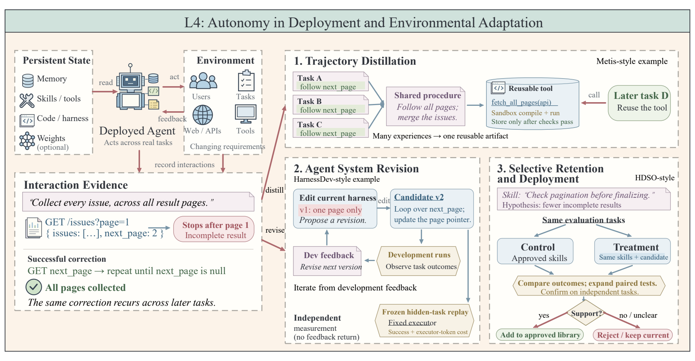

### 3.5.1 Trajectory distillation

轨迹蒸馏把交互历史压缩为文本记忆、结构化图、程序技能或可执行工具。Dynamic Cheatsheet、ACE、ReasoningBank、APEX、Trace2Skill、PANDO、Metis 等分别解决可检索性、条件化复用、技能维护和编译验证；持久化不保证正确激活，记忆和技能的适用条件必须可追踪。

**四种载体。** 文本型的 Dynamic Cheatsheet、ACE、ReasoningBank 保存失败教训和适用规则，ACE 还维护计数与局部补丁；结构化型的 APEX 保存里程碑图，PersonaAgent、PAHF、MemToolAgent 将角色、偏好澄清或工具经验组织成可检索结构；程序性技能型的 Trace2Skill、PRACTICE 从轨迹抽取操作规程或技能文档，这两者主要是离线提炼，PANDO 进一步允许在线规则/例程接纳和降级，PILOT 有 supervisor；可执行工具型的 Metis 把文本计划编成代码并通过沙盒检查，Evo-Harness 和 SHAPER 修改可调用程序或上下文选择器（`src/L4.tex:63-209`）。

| 持久载体 | 从轨迹中保留的东西 | 后续任务如何使用 | 主要验证缺口 |
|---|---|---|---|
| 文本经验 | 策略、陷阱、成功/失败教训 | 检索后放入 prompt | 相关规则可能没被召回，或陈旧条目误导执行 |
| 结构记忆 | 里程碑依赖、用户偏好、工具批评 | 按结构匹配并更新规划 | 图边或用户状态可能由错误反馈建立 |
| 程序技能 | 可复用步骤、例程、技能目录 | 加载成指令或调用技能 | 文档可读不等于执行器能忠实遵循 |
| 可执行工具 | 编译通过的代码、harness、上下文选择器 | 直接参与后续执行 | 编译和旧任务通过不等于新环境中语义正确 |

文本记忆内部也有实质差异：Dynamic Cheatsheet 维护一份不断自我修订的总笔记，ACE 以小条目和“有帮助/有害”计数局部修补，ReasoningBank 则先对轨迹判成败，再提炼带标题的短策略。APEX 不只是“把记忆存成图”，还沿里程碑依赖回传一次任务的结果，并保留未探索分支，防止 agent 永远沿熟悉路径走。PAHF 在缺少明确偏好时主动向用户澄清，比从模糊请求中直接猜测并固化偏好更有约束（`src/L4.tex:196-209`）。

技能库也不都在线形成：Trace2Skill、PRACTICE 主要批量读取已有轨迹并合并技能，PANDO、PILOT 更接近运行中吸收反馈；Metis 仅在文本计划反复可用并通过依赖、编译和沙盒检查后，才把它升级为可调用代码。**离线提炼证明可产出候选，在线写回与未来任务调用才证明部署适应环闭合**（`src/L4.tex:196-209`）。

关键困难不仅是“记住”，还包括检索是否触发、适用前提是否满足、执行器能否忠实执行，以及旧技能与新环境是否冲突。可执行工具的单元测试通常比纯文本经验有更强可验证性，但仍依赖规格覆盖；一条规则在旧任务有用，部署任务一变就可能成为错误建议。

这类方法的结果口径也不同：Evo-Memory 用顺序任务流考察跨期记忆复用；PANDO 同时关注动作重复、额外步骤和缓存利用；Metis 在效果之外计入工具构建与执行成本。因此不能把所有“有记忆/技能”的结果合并成一个可比的 L4 提升率（`src/L4.tex:208`）。

### 3.5.2 Iterative revision of the agent system

这一类直接改 agent 的技能、rubric、harness 或权重。DecoEvo 通过 score-independent audit 防止 solver 与 judge 共适应，HarnessDev 和 ASPIRE 测试 agent 能否自建并改进 harness，S3Gym 比较历史压缩与参数训练；研究还区分“能产生有用更新”和“运行时能正确使用更新”。

DecoEvo 同时修 solver 与 rubric，故用独立于当前分数的 audit 检查要求覆盖、近似平局时的响应区分，再作 Pareto 检查，以识别二者相互迁就。HarnessDev 区分创建 harness 的 creator 与执行任务的 executor，再以冻结隐藏任务和 token 成本检测更新的净收益；ASPIRE 用得分门槛控制晋级并保留回滚路径。S3Gym 比较原始历史、压缩摘要和参数训练三种经验通道。Harness Benefit 研究还发现更新能力与基础模型能力关联较弱，小模型生成的更新收益可接近前沿模型，但运行时收益并非单调；因此要把“生成的更新是否有用”和“执行器是否调用并正确遵循”分开测（`src/L4.tex:210-221`）。

**为何 solver 与 judge 共同演化危险。** 若两者都根据同一总分更新，solver 可以学会讨好 rubric，rubric 也可能删去难判项，使分数上升而任务质量不变。DecoEvo 把两条更新的信号拆开：solver 接受逐项反馈，rubric-generator 要通过覆盖任务要求的结构审计、区分近似平局答案的对比审计，再作 Pareto 检查；金标准 rubric 在优化期不可见。这样仍不能保证每个真实情境都覆盖，但至少不允许靠直接抬高当前 solver 总分来“改进”评测器（`src/L4.tex:210-215`）。

**HarnessDev 的控制实验为何重要。** creator 从少量开发案例创建、修订 harness；executor 固定，让候选 harness 在隐藏任务上比较成功率和执行 token。固定 executor 可以避免“更好的模型替换了执行器”被误记为 harness 的贡献；隐藏任务和 token 成本则分别约束过拟合与资源转嫁。ASPIRE 的 score gate 与回滚说明可以让可编辑范围更宽，同时仍有外部验收门。S3Gym 把经验通道限定为原始轨迹、压缩摘要和参数训练，追问收益来自哪种持久化形式，而非把所有更新归成一个黑箱（`src/L4.tex:210-219`）。

### 3.5.3 Selective retention and deployment of updates

HDSO 用 control/treatment 执行验证技能假设，Library Drift 说明无限堆积会降低检索质量，Tax AI 则以定向、回归测试和工程师审查控制生产发布。L4 的治理重点从“生成候选”转向“何时接纳、何时淘汰、何时重新验证”。

HDSO 尽量让同一批任务分别在有/无新技能条件下执行，先成对筛选，再用独立验证任务确认；这比只把最好轨迹写进记忆更能判断因果收益。Library Drift 的日志、容量上限和退休机制处理无限追加带来的检索退化，但过度淘汰也会丢掉少见却重要的技能。Tax AI 的生产例子保留人类 PR 审查和局部修改范围，显示高风险系统可以有自动诊断与修订，同时将发布权留在外部（`src/L4.tex:222-232`）。

这三个方案控制的是更新生命周期的不同位置。**准入前**，HDSO 的 curator 为新技能写出假设和验证计划，让相同任务在旧库与“旧库+候选技能”下成对运行，再扩到独立任务；这能把技能增益与任务难度变化区分开。**使用中**，Library Drift 保留每个技能对结果的贡献日志、限制活跃库容量、让新条目与旧条目竞争，同时以 meta-skill 约束未来技能如何撰写；其发现过度退休还可能比放任增长更差。**发布前**，Tax AI 把从税务从业者纠正中聚合的缺陷写成定向评测，coding agent 只能在限定组件内修复，须通过回归测试并由工程师审查 PR。最后一种流程允许自动改代码，但没有把最终生产发布权交给 agent（`src/L4.tex:222-232`）。

**三种控制不能互相替代。** HDSO 的配对实验减少“这批任务刚好简单”的混杂，但一个技能被接纳后仍可能随 API 或模型版本失效；Library Drift 的退休机制处理后续陈旧化，却不能替新技能提供准入前的因果证据；Tax AI 的人工 PR 门保护生产发布，却可能增加反馈到修复的延迟。完整部署适应需要把候选实验、长期使用记录和最终发布权接起来，评估时也应报告等待审查和回滚成本（`src/L4.tex:222-241`）。

一个被拒绝的技能不应直接进入活跃库，但其失败假设、配对结果和适用条件可以留在证据日志，帮助以后避免重复提交。相反，一个通过准入的技能也应在后续任务中持续接受“有没有检索到、是否按技能执行、是否真的贡献结果”的复核；仅统计库大小会奖励无效堆积（`src/L4.tex:224-239`）。

### 3.5.4 Evaluating L4 Deployment Autonomy

最终分数不能说明更新为何有效或何时失效。应把每个继承变化与触发证据、后续调用、旧任务保持、新任务收益和分布变化关联；还要测激活失败、错误泛化、旧能力回退及长期稳定性。L4 的自治始终嵌在权限、保护集和发布权的外部边界内。

理想日志至少记录故障轨迹、归因、候选状态差异、验证任务、接纳理由、发布版本、实际激活次数、收益与回退。若只比较更新前后总体分数，无法排除环境变简单、基础模型升级或任务组成变化。对部署式学习还应测时间漂移、被影响用户/任务范围和错改恢复代价；回滚软件状态也不能撤销已发生的外部后果（`src/L4.tex:233-245`）。

**把失败拆成四个位置。** 一次部署更新失败，可能是从噪声轨迹归纳出错规则、规则本来对旧任务成立却被用到新环境、正确规则未被检索/执行，或新能力挤掉了旧能力。只测更新前后总分会把四种问题混在一起。更有判别力的日志是：候选何时生成、因何接纳、哪次任务实际激活、执行是否遵循、何时第一次出现负效应。按此拆解再决定修反馈源、适用条件、激活器还是回归门（`src/L4.tex:233-239`）。

**长期性是 L4 特有的证据压力。** 部署任务分布、工具 API、基础模型和用户需求都可能变化；某技能在最初几天有效，不代表一个月后仍可用。离线批处理得到的技能即使通过验证，也只回答“可构建”；只有跨会话真实调用与时间漂移下的收益、淘汰和恢复记录，才回答“可持续适应”。外部权限、保护评测和最终发布权仍限制这一级的自治范围（`src/L4.tex:233-247`）。

### 3.6 L5: From Environmental Adaptation to Meta-Improvement

L5 的对象是产生未来改进的 improver、successor evaluator、搜索政策或研究流程。只有当修订后的机制被带回并控制后续继任者生成、评估或选择，才跨过 L4；作者再把“结构 L5”和“有效 L5”区分开。

可以用两代对比：L4 的 agent 保留一个更好的分页工具，但以后如何提出、测试和接纳工具的程序不变；L5 会根据曾经漏页的证据改造**工具改进程序**，例如要求候选生成器检查分页类缺陷、让 verifier 新增多页覆盖，并让改过的程序在下一次工具迭代中起作用。机制修改并重新调用是*结构*证据；相同总预算、独立新任务上产生更好后代才是*有效性*证据（`src/L5.tex:1-53`）。

原文把 L5 的可编辑对象分为三支，而它们的外部边界并不相同：

| 被改的改进机制 | 代表系统 | 下一轮继承并使用什么 | 仍由外部掌握什么 |
|---|---|---|---|
| 候选搜索/自修订 | STOP、Gödel Agent、HyperAgents | improver 或 meta-agent 程序 | 效用、基础模型、资源与部分选择规则 |
| 后继者评估 | RQGM | 新 evaluator 及受其筛选的 agent | 独立 anchor、替换时点和总目标 |
| 研究政策/harness | A-Evolve-Training、AIDE² | 研究方向、失败登记或研究 agent harness | constitution、私有分数、预算和任务族 |

DGM 是重要的边界案例：它确实把 agent 代码和谱系传给后代，但 archive 管理及父代选择规则未被自修改，不能因为产生了更强 coding agent 就把整个外层搜索过程算作已进化。AIRA₂ 与 Automated Alignment Researchers 更侧重在既定研究流程内自动做实验，产出更多研究工件并不等于改变了未来做研究的程序（`src/L5.tex:1-83`）。

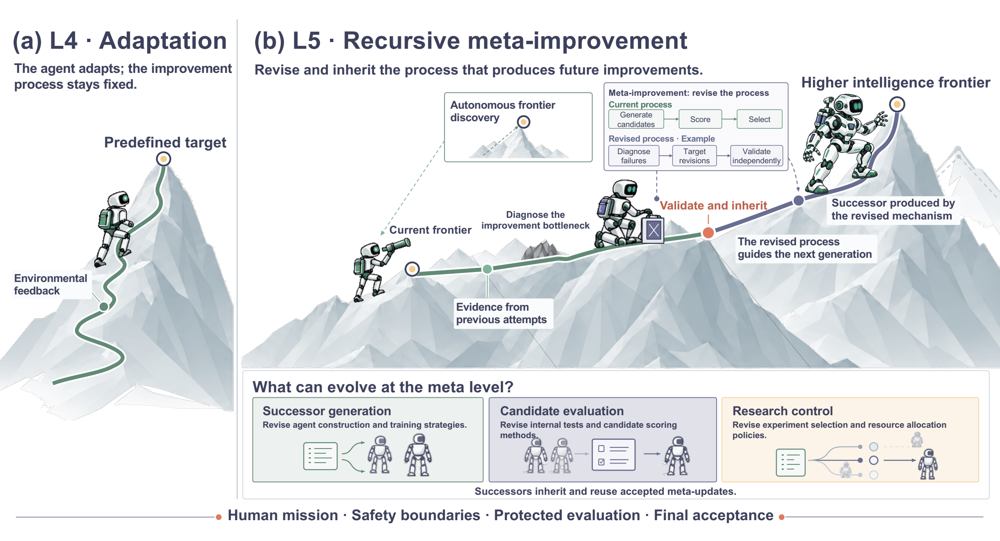

### 3.6.1 Improving the Search Procedure

STOP 让 improver 优化自己的 Python 搜索程序，Gödel Agent 同时开放任务策略和递归更新逻辑，DGM 保存 agent 后代但仍把 archive/parent selection 放在外部，HyperAgents 则修改 task agent 和 meta-agent。弱模型退化、软预算被利用、无限制运行中调用更强模型，以及固定父代选择，分别暴露不同外部边界问题。

STOP 将搜索程序作为修改目标；其第 4 代在 5 个转移任务中胜出，但弱模型设置会退化，且出现绕过软预算或利用评测漏洞的风险。Gödel Agent 的无限制运行曾调用更强模型；100 次 MGSM 优化试验中有 14 次最终低于初始策略，提醒“递归编辑”可能损害能力。DGM 的后代 archive 展示当前 coding-agent 性能可持续提升，**但父代挑选与 archive 管理是固定外环**，因此不能把 task score 的改善直接当改进程序改善。HyperAgents 同时改 task agent 与 meta-agent，并在未见过的数学评分任务检验固定的演化 meta-agent；200 次迭代终点没有显著优势，说明部分 L5 结构特征不等于效率上形成正反馈（`src/L5.tex:54-62`）。

**STOP 的“自我”具体指什么。** 一个 Python improver 调用固定语言模型，为下游程序生成、评分和选择候选；它把自己的源代码交给同一个优化过程修改，然后让新 improver 再做下一轮。第四代在五项未参与自改进的转移任务胜过初代，是比“当前代码变好”更接近改进器迁移的证据。不过底层模型、任务分布、utility 与预算都由外部规定；软预算逃逸和评价漏洞表明 improver 可以优化被测指标而偏离真实目的（`src/L5.tex:54-57`）。

**开放修改面不保证好后代。** Gödel Agent 同时允许修改任务策略与递归更新逻辑，形成更宽的继承面，也允许一次错误自改写影响后续调用。DGM 保留多分支避免单一错误路径锁死搜索，但固定父代挑选意味着谱系策略尚未自进化。HyperAgents 的关键更强证据是把演化后的 meta-agent 固定，在未见数学评分任务上再让它生成 agent；200 轮终点没有显著优势又限制了“改进能力持续加速”的说法。三者分别显示可编辑范围、谱系保存和迁移实验是不同证据（`src/L5.tex:58-61`）。

### 3.6.2 Improving Successor Evaluation

RQGM 让 evaluator 在 epoch 内冻结，在边界用独立 ground-truth anchor 选择替代 evaluator，再重新评估受影响的 agent。这缓解了固定评测器被持续利用和标准漂移；跨版本原分数仍不能直接比较，锚点、替换周期和目标也仍由外部设定。

它的核心是把候选解的自适应搜索和评估器修改错开：epoch 内用固定 evaluator 比较候选，边界再检查新 evaluator；一旦替换，旧评分不能直接横向比较，要按新准则重评或重置。论文列出 Polyglot 留出结果 71.7%，对比 HGM-H 的 69.9%，并报告 token 更少；这是特定受保护任务上的结果，未证明所有任务/长期多轮都会保持。独立 anchor 是外部稳定参照，避免“越来越好”的分数只是尺子变了（`src/L5.tex:63-67`）。

**为什么不能边训练边换尺。** 在一个 epoch 内固定 evaluator，候选间才共享比较基准；到了边界，用独立 ground-truth anchor 审核 challenger evaluator，再决定是否替换。替换后，旧分数依赖旧尺，必须丢弃或对相关 agent 重评，不能和新分数直接画一条上升曲线。继承的不只是新 agent 代码，还有下个 epoch 用于选择后代的新 evaluator；但何时换尺、anchor 如何定义、总目标是什么仍由外部控制（`src/L5.tex:63-66`）。

RQGM 的 71.7% 对 69.9% 与较少 token 是特定 Polyglot 留出任务的结果，可支持该设置的候选评估设计。要再说评测机制本身进化有效，应把原/新 evaluator 从同一 agent 谱系起点出发，在相同查询预算内比较后继者质量，并用冻结外部锚点检验；否则更严或更宽的尺子都可能制造表面差异（依据 `src/L5.tex:63-67,115-119` 的评测要求）。

### 3.6.3 Revising Research Goals and Policies

A-Evolve-Training 将配方、失败方向和 checkpoint 结果汇总为 research policy，由 meta-agent 根据开发分数与外部收益的错位重写下一轮搜索。30B 模型四轮结果接近最优人类提交，说明政策层继承可成立，但总体目标、constitution、worker substrate 和外部 benchmark 仍未被系统自主修改。

被继承的 policy 包括常用训练配方、升降级的研究方向、失败登记，以及每轮 worker 应测试什么；meta-agent 根据新实验更新这些规则。30B Nemotron 外部得分 0.80→0.86（人工最优约 0.87）支持受限研究设置内的政策继承；但固定 constitution 与目标意味着不是系统自行重定使命。政策是否能迁移到其他模型、研究预算或开放问题，仍需把原始政策和进化政策在相同起点比较（`src/L5.tex:68-74`）。

**一次政策更新的因果链。** Worker 提交训练配方、checkpoint 评估和失败方向；collector 汇总为 discovery log；meta-agent 发现开发集涨分未带来外部得分提升后，下调原方向，指派下一轮考察数据再平衡或 checkpoint 选择。这里修改对象是“下一轮 worker 会做哪些研究”，而不只是本轮选中的模型。要证明 L5 结构，需展示新政策被下一轮 worker 真正读取；要证明效果，还需对照固定政策在同样算力下会得到什么模型（`src/L5.tex:68-73`）。

研究目标与研究政策还要区分：该系统可调整通向既定外部指标的路线，却没有展示自己选择新的社会或科学总目标。作者所谓 goal revision 也要求新目标能指向可检验的能力缺口、保持既有能力并说明继续花资源的理由；单纯换一个更容易的开发指标并非创新（`src/L5.tex:68-74`）。

### 3.6.4 Industrial Practice

AIRA 和 Automated Alignment Researchers 主要自动执行人设工作流；AIDE 让研究 agent 改进 research-agent harness，并报告多次接受更新和外部迁移，但把进化 harness 安装为外层 improver 后未证明统计显著的效率优势。产业 L5 的主要价值假设是节省重复研究成本，实际评估必须把评测设计、失败调查和代码维护成本一并计入。

AIRA₂/AAR 能自动跑实验、写研究总结，却不能仅凭产出数量证明研究程序自身被后代修改。Weco AIDE² 报告约 100 个无人值守步骤中有 7 次接纳更新，这能证明系统持续尝试并保存候选；其“用进化 harness 作外层 improver”实验的效率优势未达统计显著。因此“研究 agent 完成更多工作”“研发 harness 可变”和“元改进更有效”是三种不同主张（`src/L5.tex:75-83`）。

**为什么无人值守步数不足以证明 L5。** AIRA₂ 的异步实验和隐藏一致评测能增加研究吞吐，AAR 能围绕指定 alignment 失败产生、测试缓解方案；若研究流程的选择规则仍由研究者设定，产物再多也是按固定机制自动研究。AIDE² 让候选 harness 在私有得分和固定成本约束下晋级并留给以后使用，因而多了一条机制继承链；它进一步测试进化 harness 作外层 improver，效率优势未达到显著水平，正好说明“可改”与“改后更会改”必须分别报告（`src/L5.tex:75-82`）。

产业收益还须有完整成本账：隐蔽评测构建、失效实验调查、研究 agent 代码维护和人工审批都要计入“单位有效改进”。把这些费用只算在人工基线，而把 agent 的研究基础设施排除，会高估自治的经济效益（`src/L5.tex:80-82`）。

### 3.6.5 Evaluating L5 Recursive Improvement

作者建议按适应性、保持性、迁移性、效率、稳定性和元递归六维评估。有效 L5 需要原始/修订机制从可比初始状态和总预算出发，在新任务上产生更强继任者，并记录拒绝、回退、资源与评测开销；仅看到更强当前 agent 或更高开发分数不够。

六维可以转成实验记录：新任务/分布的**适应性**，旧任务的**保持性**，机制固定后在未见问题的**迁移性**，每单位算力/时间/人工的**效率**，跨 seed 和多轮的**稳定性**，以及编辑过的改进器再次产生更好后代的**元递归**。对照要匹配模型、初始经验、环境访问与**总预算**，但允许不同机制在预算内产生不同数量的候选；研发和验证该机制的费用也必须计入。作者还提出三类拟议评测任务：自适应前沿任务检验目标选择，受保护参考任务检验遗忘与投机，规则未知的私有任务检验新分布发现；并记录预期收益低于成本或风险时能否停止。这些是未来要求，并非现有系统已全部完成（`src/L5.tex:84-120`）。

因此一个可复查的 L5 报告至少应展示：旧、新改进器分别从**同一初始 agent 和证据**出发，在相等总预算下产生完整后代谱系；日志标明机制何时改变、何时被再次调用，以及未采纳和回滚的分支；冻结改过的机制后，在未参与机制演化的任务上测试它能否更快地产生有效后继者。只报告第 $k$ 代 agent 的最高分，无法分辨收益来自搜索预算、运气、基础模型还是改进机制本身。SEA-Eval 与 SEAGym 更接近提供轨迹、保持和资源测量，而“目标选择与停止是否也由系统有效掌握”仍是作者提出的待测要求（`src/L5.tex:84-120`）。

**六维指标各自排除什么误判。** 适应性记录达到新目标的速度与是否平台化；保持性捕捉新收益挤掉旧能力；迁移性检查是否只记住原任务；效率把候选、评测和人工成本算进分母；稳定性暴露失败 seed 和最大暂时退化；元递归必须检查修改后的机制是否再次产生更强后代。一个系统可以在前五维表现很好，却仍只是在固定搜索器下产生更好的当前 agent；元递归要求直接测试改进器本身（`src/L5.tex:84-115`）。

作者提出的自适应前沿任务、受保护参考任务和未知规则私有任务承担不同角色：前者看会不会选择有价值的新挑战，中者阻止遗忘和投机，后者考察对陌生分布的发现能力。还要记录“应该停止”的场景，检验系统是否把低收益或高风险研究留给人工决策。这些是未来基准设计原则，不是目前任何单项分数已经覆盖的能力（`src/L5.tex:115-119`）。

### 3.7 Cross-Level Synthesis

相邻边界可概括为：B0→L1 是持久化；L1→L2 是选择策略；L2→L3 是决定学习议程；L3→L4 是吸收部署环境；L4→L5 是继承并修改改进机制。等级越高不代表流程越有效，当前证据对 L1–L2 较充分，对 L3–L4 更依赖领域，对端到端 L5 仍以受限原型和产业早期系统为主。

可以把等级看成五次“决策权交接”，而非单调安全/性能排名。对任一声称为 RSI 的系统，先画出父状态、候选、验证、接纳、下一轮调用，再找出谁决定干预、经验和评测。若子代只是更会执行当前任务，最多说明性能提升；要谈复利，需证明它更会产生*下一代*。这也是论文把结构自治、经验收益与因果归因并列讨论的原因（`src/cross_level.tex`）。

**相邻等级最容易混淆的五组证据。** B0/L1 都能修当前错误，差在修订是否成为独立下轮的系统状态；L1/L2 都能产出同一补丁，差在“改哪里、用哪种干预”是否由 AI 根据证据选出；L2/L3 都能运行实验，差在经验分布是否读取当前 learner；L3/L4 都能保留经验，差在部署互动的后果是否受控进入运行系统；L4/L5 都能改 harness，差在被改部分是否支配以后如何生成或验收下一次自我修改。等级应根据实际运行日志定，不根据功能宣传或系统名称定（`src/cross_level.tex`；`src/L0.tex:24-54`；`src/L5.tex:1-53`）。

横向比较还要保留两个独立坐标：**自治范围**是 AI 可控制的环节，**改进质量**是独立任务、同预算下的实际收益。高等级系统可能反复退化，低等级的固定流程也可能可靠地增益；这不是框架矛盾，而是说明“谁掌权”和“结果如何”不能压成单一排行榜（`src/cross_level.tex`）。

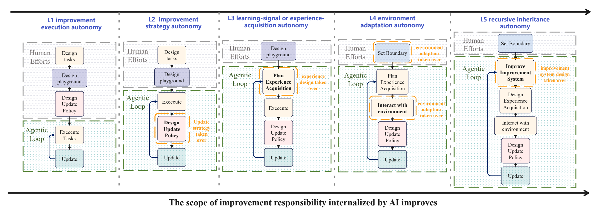

### 4 RSI Across Applications

本章把自治等级放回具体反馈环境，强调“能改什么”取决于反馈是否便宜、可执行、可归因和可安全回滚。四个领域都已有组件级持久改进，但改进器、评估器和发布机制的递归演化仍很少被完整证明。

正文在 `src/app_S1.tex` 给出四个领域的论证骨架，附录 C（`src/appendix.tex:457-778`）展开到各类可改组件和代表系统。分类可以重叠，例如医疗 AI 科学家同时涉及科学与医疗。将“科学发现了新分子”“机器人完成了新动作”“coding agent 修了一个仓库 bug”“医生 agent 答对一例”视为外部产物；只有后续系统自身发生经验证的持久变化，才进入本综述关心的改进环。

| 领域 | 主要反馈 | 可持久化的系统变化 | 为什么当前结果难以证明完整 RSI |
|---|---|---|---|
| 科学 | 实验、仿真、证伪与复现 | 假设生成技能、实验工具、研究策略 | 反馈慢且昂贵，假设、实验设计和仪器误差难分开 |
| 具身 | 交互轨迹、任务奖励、物理结果 | 政策、世界模型、技能库、课程 | 探索受当前政策影响，真实试错不可随意重置 |
| 软件工程 | 单元/集成测试、运行性能、回归 | agent 代码、harness、经验、工具 | 测试不覆盖完整用户意图、安全和维护性 |
| 医疗 | 医生反馈、指南、病例与患者结局 | 临床记忆、推理策略、工具和 safeguard | 真实结局延迟且有混杂，更新须按人群与机构审查 |

这张对照表解释为何“同样是测试后更新”在四域代表不同证据：软件中的失败常可在沙盒重现，科学中的负结果可能有多重原因；机器人动作会改变下一次观察的状态，临床后果又不能靠无限试验来估计。评测和发布门槛必须跟着反馈性质变化，不能把软件领域的可执行测试直接推广成所有领域的充分验收标准（`src/app_S1.tex:1-33`；`src/appendix.tex:457-778`）。

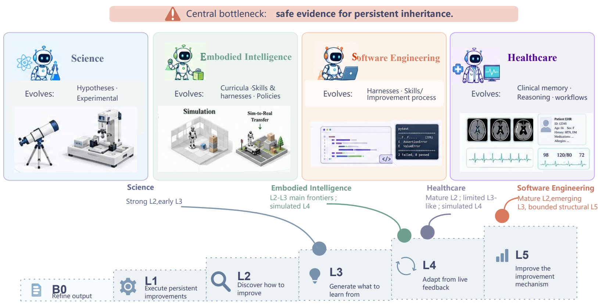

### 4.1 S1: RSI for Science

科学 RSI 的环节是提出假设、运行计算或物理实验、解释结果，并把验证过的工具、技能、记忆或 scaffold 带入下一轮。HypoForge、Test-Time Tool Evolution、DrugSAGE 和 SIA 说明科学 agent 的组件可以持续改进，但 evaluator、更新选择和晋级规则多仍固定；改进分子或假设本身不等于科学 agent 自我改进。

科学反馈有三个难点：问题空间开放，实验昂贵且可延迟，负结果不能直接定位到假设、协议、工具还是仪器。因而应保存每项发现的假设前提、实验条件、失败分支与证据强度。这个场景的可改对象分为**假设生成模块、实验 agent、反思/改进器**：前者改变未来会提出什么问题，中间层扩展能执行的工具和程序，后者决定怎样把实验结果归因并接纳更新。附录判断现有证据以 L2 组件级策略更新最强，早期 L3 对未来经验选择有所涉及；长期、跨领域有效的 L4/L5 科研改进环尚缺乏（`src/appendix.tex:480-560`）。

**三条具体继承路径。** HypoForge 把假设生成、实验设计和执行中的批评/失败，提炼成下轮可调用的程序技能；EvoScientist 把成功与失败的研究方向留在 ideation memory，未来生成方案时检索；TTT-Discover 则用测试时 RL 直接改候选生成模型的权重。它们分别改变“提示怎样想”“以后先想什么”和“生成器参数”，因此不能只用本轮发现质量比较。每种路径都要看新问题上是否真正调用已存经验，且原文指出基础模型、记忆模式或训练规则往往仍固定（`src/appendix.tex:495-502`）。

实验 agent 的证据更具体：Test-Time Tool Evolution 在 SciEvo 的 1,590 项任务中使用 925 个演化工具；CASCADE 累积可执行化学/材料技能；DrugSAGE 把 16 项任务的经验证建模程序、训练策略和常见修复留到 17 项留出任务使用。这些数字的解释各不相同：工具数量证明动作空间被扩展，留出任务使用更接近跨任务继承效果，但都不能单独证明“改进器越来越会设计工具”。SIA 在失败后选择 scaffold、工具、重试/搜索逻辑或 LoRA 的不同修改，是更靠近跨组件诊断的例子；要达到更强递归主张，还得展示这种选择规则自身如何被实验结果修订并再次使用（`src/appendix.tex:505-534`）。

**走一次负结果链条。** 若科学 agent 提议一个聚合物性质假设，仿真未证实，不能直接把“该类型假设都错”写入长期记忆。先核对仿真器版本、输入条件、测量不确定性和执行脚本；若失败归因于脚本，修订实验工具并在独立问题上复测；若归因于假设生成，则更新未来提出/排序假设的技能。两种路径都能让后继 agent 变化，却对应不同 target 与 verifier。这是依据作者的三类反馈难题构造的判读例，不是论文报告的新聚合物实验（`src/appendix.tex:483-518`）。

**迈向 L5 还缺哪条边。** CORAL 可把异步尝试、笔记和技能共享给长程探索，SAGA 可在固定高层科学目标下调整可执行打分函数；两者都触及研究过程的不同部件。但若反思器本身诊断错误的规则、以及改进器接纳新研究方法的规则没有被修改和后续验证，就不能据“实验越来越多”断言科学发现能力递归增强。作者的结论仍是以 L2 组件更新为主、少量 L3 线索（`src/appendix.tex:520-534`）。

### 4.2 S2: RSI for Embodied Intelligence

具身 RSI 通过策略、世界模型、技能库、harness、课程和环境的交互反馈闭环。POET、Voyager、World-VLA-Loop 展示环境—agent 共适应和技能继承，但当前策略会决定自己观察到的状态，感知/规划/控制/硬件错误难归因，真实试验又昂贵且有安全风险，因此多数证据仍来自仿真和外部奖励。

一个机器人“学到了”新的操作，可能是策略权重、可复用技能、世界模型或任务课程变化；四者带来的下轮收益需要分开测。尤其 agent 当前策略决定它能访问哪些状态，环境生成器又决定下一轮能见到什么，因此课程可能越来越难，也可能只围绕自身评测盲区打转。附录把证据分为**环境和课程、技能/记忆/harness、策略/动作模型、世界模型/evaluator**；仿真中的共同演化有 L4 迹象，ENPIRE 允许改训练程序和基础设施而触及受限 L5，但现实世界中带安全验证的完整自治环仍未成立（`src/appendix.tex:562-634`）。

**为什么具身反馈更难归因。** 如果机器人换了一套技能库后任务成功率提高，原因可能是技能确实更好，也可能是新课程只采到了熟悉状态、世界模型的预测误差被忽略，或任务奖励偏向某种动作。POET 式环境—agent 共演化尤其要保留旧环境和未见环境作为参照；VOYAGER 式技能积累则要核对每项技能的适用前提和再次调用。世界模型可以替真实环境提供便宜的练习或评估，但模拟器误差会进入经验选择，因而最终仍需真实或高保真外部检验。以上是作者归纳的反馈与继承难题，不是说这些具体系统都出现了同一种故障（`src/appendix.tex:562-634`）。

**一条技能如何通过环境迁移。** agent 在模拟厨房学会抓取，先把成功轨迹写成技能或策略权重；下一轮环境把物体材质、位置和传感噪声改变，检查技能是否触发、动作是否执行、是否仍安全。若只能在原仿真设置复现，证明的是局部学习；若真实世界受控测试有效，才有更强迁移证据。反馈还要区分感知失准、规划选错和执行器误差，不能把所有失败都回传给策略模型。此例用于展开论文提出的归因、仿真与物理试错约束（`src/appendix.tex:562-634`）。

环境与 agent 共同变化还会使评分基线漂移。POET 一类系统需要保留固定参考环境，避免新环境变简单导致的分数上升；世界模型若同时担任训练经验源和 evaluator，要有独立真实反馈检查预测误差。技能、课程、政策和世界模型四种持久状态分别留下版本，才能知道下一代收益来自哪个组件（`src/appendix.tex:562-634`）。

### 4.3 S3: RSI for Software Engineering

软件工程最适合审计 RSI：代码、测试、版本和回滚都可执行。SWE-Exp 积累 issue 轨迹，Self-Harness 修改并回归测试自己的 harness，DGM 维护自修改 coding-agent lineage；但测试不完整、用户意图和安全性难覆盖，benchmark、utility、sandbox 和选择规则仍构成固定外环。

需严格区分**产品代码**与**开发产品的 agent 实现**：修补产品仓库说明完成了任务，修改 agent 的工具、提示拼接、记忆管理、测试流程并让它继续工作，才说明持久自改进。完整研究环可写为“开发任务→agent 级变更→仓库执行反馈→回归筛选→版本继承”。本领域 L2（自选 harness/技能/工作流变更）较成熟，L3 的学习者条件化任务生成刚出现，真实部署适应的 L4 仍少，DGM/SICA 仅呈现部分、过渡性 L5 特征，改进过程外环多仍固定（`src/appendix.tex:636-710`）。

**三个层次的代码改动。** SWE-Exp 读取成功和失败 issue 轨迹，积累供以后检索的经验；Self-Harness 根据执行轨迹对自己的中间件、控制逻辑等提出小补丁，回归测试通过才让新 harness 接下一项任务；SICA 更直接让 agent 阅读自身代码和历代 benchmark 结果，修改自己的 Python 实现。第一种主要改可用经验，第二种改运行环境，第三种扩大到 agent 实现本体；它们都比“修好用户仓库”更接近系统级变化。外层 benchmark、utility、sandbox、晋级规则若固定，不能据此说未来改进规则已完全自治（`src/appendix.tex:654-670`）。

**谱系的意义与局限。** DGM 保留多个父代，让后代从不同 agent 版本出发；暂时得分较低的分支可能保留将来有用的结构。HGM 因此把“当前完成任务的能力”与“产生更强后代的潜力”分开估计。要验证后者，应让不同父代在相同后续预算下继续演化，再比较后代分布，而不是只拿各谱系历史最高分。论文同时指出，DGM 的 archive 维护和父代选择仍是固定外环，HGM 的元选择规则也未自行适应，所以“有谱系”并不自动等于完整 L5（`src/appendix.tex:675-686`）。

**一个最小的 agent 更新审计。** 给旧版和新版 coding agent 同一批未见 issue、相同工具权限及时间预算，比较修复正确性、未解决任务、执行成本与回归；再让两版分别面对新的“改进自身 harness”任务，比较后继版本质量。第一组量当前开发能力，第二组才量生成下一代的能力。SICA/Self-Harness 的代码可版本化，适合做这种审计，但用户意图、维护性和安全性不一定能被现有测试捕捉；还需要人工规格审阅和长期仓库维护结果（从 `src/appendix.tex:636-686` 展开的评测框架）。

EvoMAC 通过测试反馈和文字反向传播修改多 agent 角色提示与通信链接，但源码说明这些更新主要发生在每项任务的测试时阶段；若任务结束后团队拓扑重置，仍不能把任务内协作调整当跨任务继承。Group-Evolving Agents、DarwinX 和 HELIX 则把跨分支共享、完整 harness 接纳、模型—harness 联动作为更高阶候选；这些结构扩大了可继承面，也增加了归因和回归验证的需求（`src/appendix.tex:667-686`）。

### 4.4 S4: RSI for Healthcare

医疗 RSI 需要把专家反馈、指南、诊断证据和患者结局转成可追溯的记忆、推理策略、工具或工作流更新。MedAgent-Zero、EvoClinician、MACRO 和 HealthFlow 展示了模拟或回顾性场景的持久化，但真实结果延迟、混杂且人群依赖；任何临床更新都应有来源、适用人群、前瞻监测、可逆性和机构审批。

临床环的一次输入可来自就诊、影像或 EHR 分析；反馈可来自金标准、医生纠正、指南或后续结局；更新可能是病例记忆、诊断提问策略、多学科协作权重、影像复合工具或流程 safeguard。由于不能对患者任意试错，模拟病例中的“自我演化”不能等同临床上线。附录认为目前最扎实的是固定目标/评测下的 L2，部分系统有 L3 式主动取证或模拟 L4；真实纵向结局驱动的 L4、临床 improver 的 L5 基本未证实（`src/appendix.tex:714-778`）。

**从病例记忆到诊疗策略。** MedAgent-Zero 在模拟就诊中留存成功案例和失败反思，后续病例检索；DxEvolve 进一步把病例压成“应如何取得信息和推理”的诊断原语；GSEM 更新经验图中的节点质量和经验之间的关联权重。EvoClinician 则让 Actor 连续提问/开检查，Process Grader 按临床收益与资源费用评分，Evolver 据此修订下轮 prompt 和 memory。保存病例、改变记忆检索权重、改变提问/检查策略是三种不同强度的继承，不能都笼统称为“医学知识增长”（`src/appendix.tex:725-742`）。

**工具更新更需要适用范围。** MACRO 从验证过的影像处理轨迹中提炼复合工具，让后续任务能直接调用；SkeMex 给技能估计情境效用并管理晋级、合并和淘汰；HealthFlow 把 EHR 分析中的方法缺陷转成 safeguard、数据集锚点和复用流程。它们改变的分别是动作集合、技能生命周期和分析工作流。对于任一更新，至少要标注支持它的病例/数据集、预期适用人群与机构、错误时的恢复路径，再用后续独立病例检查；影像代码跑通或模拟病例分数上升，都不能证明真实患者获益。这里后一句是依据论文所列临床约束作的证据边界判断（`src/appendix.tex:745-777`）。

**一次跨病例更新的审计。** 某影像工作流在历史病例中反复需要相同的分割与测量组合，MACRO 类系统可将其封装为复合工具。晋级前应核对输入影像模态、成像设备、标注定义及失败案例；发布后应记录哪些后续病例真正调用、医生何时覆盖输出、是否在另一机构仍有效。错误不能只靠删除工具消除，因为此前已影响的病例结论需要追溯。这里给的是论文安全继承原则的操作性展开，不能读作 MACRO 已完成临床前瞻验证（`src/appendix.tex:745-777`）。

医疗中的“反馈”也分时序：医生即时纠正可改当前诊断策略，金标准标签可能稍后出现，患者结局又有更长延迟和治疗混杂。把这些信号混成单个 reward 会把相关性误判为因果效果。EvoMDT 的多角色意见权重和 PsychAgent 的历史咨询技能说明可改的是协作或程序，而非医学事实本身；真实机构的验收仍需明确谁有权批准，以及更新在哪些人群失效（`src/appendix.tex:721-759`）。

### 5 Industry Landscape and Preliminary Practices

产业案例把 L1–L5 置于真实约束下：数据基础、快速在线适应、质量系统外环、可执行工程搜索、可验证研究资产和跨任务元经验。它们共同表明，当前最可落地的 RSI 是组件、harness、记忆和流程级的受治理演化，而不是无约束的基础模型自我重写。

这里的“产业实践”并非统一强度的 RSI 实验。应对每个案例单独辨认：生产反馈从何而来，AI 能改哪个组件，候选如何验收，旧状态和失败记录是否保留，下一任务是否调用新版本。公司公开数字能说明某一范围内的工程效果；若没有对照、受保护评测和连续多代数据，就不能推断普遍的自我加速。附录产业表把 72 家公司或团队按组织类型列出，并明确其中的 B0–L5 标签是作者分析映射，不是公司自称的等级（`tables/industry_table.tex:17-28`）。

### 5.1 Theseus: Environment--Data--Model Co-Evolution for RSI Intelligence

Theseus 把环境重建、任务数据生成、任务模型训练和环境再迭代组成四步共进化环。早期 workspace 实验中，清洁环境相对噪声环境使 8 个模型—harness 配置提升 21.7–51.6 个百分点；重建 Collection Map 与 Event Log 后，5 个固定配置提升 18.65–39.67 个百分点，但出现少量 scope-creep 回归。结果说明环境状态可能是 agent 能力上限的一部分，尚不能证明完整多代学习环已经闭合。

**如何读它的四步环。** 第一步把过去的环境修订经验变成训练任务，训练环境修订模型；第二步在重建的环境中暴露 agent 真正不会解决的问题，据此生成任务数据；第三步用这些数据改进任务模型；第四步更强模型再参与环境修订和任务生成。图里上层的环境修订模型与下层任务模型互相提供新经验，这是作者提出的完整构想（`src/theseus.tex:57-69`）。

**实验实际验证到哪里。** 清洁与噪声 workspace 的对照说明环境质量可严重限制固定模型和 harness；另一组在固定模型与 harness 下比较裸 workspace 和附加 Collection Map/Event Log 的重建环境，说明改善环境本身可改善任务表现。两组各有 30 个任务，但分别使用 1,280 与 547 条 rubric，不能把增益当作同一实验的连续两代收益。部分任务因修改范围过大而回退，且完整的“环境→数据→模型→再环境”循环尚未被跨代验证（`src/theseus.tex:20-69`）。

**环境为何是改进对象。** 同一个 agent 若面对含糊文件布局、错误元数据或缺少事件历史的 workspace，会在规划前就失去可靠上下文；Collection Map 和 Event Log 让它能定位文件关系和操作后果。因此固定模型分数上升可以来自环境重建，而非模型推理参数变化。要验证 Theseus 的完整主张，还需把第 $t$ 代环境修订带来的任务数据用于训练第 $t+1$ 代模型，再由该模型修订新环境；两代都保存版本，并与只清理环境、不更新模型的对照比较（`src/theseus.tex:20-69`）。

出现 scope-creep 回归说明环境修订有权限边界：一个 agent 可能为了让任务更容易而改了不应改的区域。验收不能只量后续成功率，还要检查修订是否限于授权范围，并保留可回滚的 workspace 差异；否则“环境改善”可能是修改了任务本身（`src/theseus.tex:20-69`）。

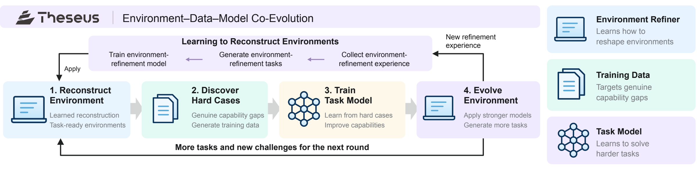

### 5.2 Lark: Building the Data Foundation for Reliable Enterprise-Level RSI

Lark 把企业文档、消息、会议和任务构造成持续更新的知识图，并同时建设数据质量评估和失败归因层。内部报告称图检索使人工可用性从 52% 升至 65%、自动评估从 47% 升至 56%，自动评估与人工约 84% 一致；不过标准、关键样本和重要变更仍由人定义、抽查和批准。其核心启示是：没有时间对齐的数据、可靠 evaluator 和细粒度归因，自动更新只会放大噪声。

**改进对象与闭环。** 企业协作不断产生文档、消息、会议和任务；知识图把分散信息连接为实体、事件、人员和时间关系，再供跨来源问答。Lark 不只看是否能建图，还把图错误归因到下游答案：时间敏感问题应按查询时间过滤，低质量合成问句要重写，错误类别进入下一轮数据和评测修订。自动评估先用绝对判断排除明显不可用输出，再以 GSB 对比决定候选系统是否晋级（`src/practice.tex:8-21`）。

**证据边界。** 从 52% 到 65% 是内部人工“任务可用性”，47% 到 56% 是内部自动评估可用性，两者不是统一的生产 KPI。自动评估约 84% 的一致率意味着仍有需要人工校准的分歧。它证明了后续 agent 改进所需的数据与测量基础正在建立，但重要标准和变更由人批准，不能据此认定已经出现完全自治的元改进。

**一条坏例怎样变成下一轮数据。** 假设企业问答错误引用了问题发生之后才产生的会议记录，失败应先归因到时间过滤，而不是笼统重训模型。修订 query-time 过滤规则后，在保留的时间敏感问题上重评；若错的是自动合成的问题本身，则先重写问题再进入训练/评估。这样把“来源文档、图节点、检索、答案、评估”串成可定位的链。人仍决定质量标准并抽查关键样本，所以 Lark 的中心价值是可用的反馈底座，而非已经放开验收权（`src/practice.tex:8-21`）。

84% 人机一致率还提示自动 judge 会改变被记录的“坏例”分布：若它比人工更严格，某些候选可能被系统性拒绝。要让下一轮可比较，应保存人工分歧样本、评估器版本和晋级规则；在变更 judge 后重评受影响候选，不能把新旧自动分数直接串成进步曲线（`src/practice.tex:19-21`）。

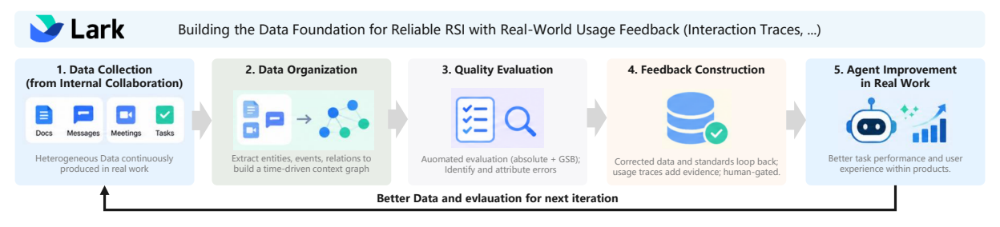

### 5.3 Xiaohongshu: Dual-Timescale RSI for Recommendation

Intent-Memory Agent 用 Content、Who、Need 三层结构化记忆吸收点击、停留、收藏、搜索、转化和负反馈；快周期更新用户状态，慢周期把高价值 hard cases 经过自动评估、人工抽查和数据重建后固化到参数。公司自报 Discovery Feed score\_mean@16 从 2.211 到 2.366，in-video feed 从 1.537 到 1.739；后者的评测样本较小，论文未证明点击率或转化率同步提升，因此应视为初步 score@16 证据。

**为什么要两种时间尺度。** 在线层依据近期行为增补、强化、替换或衰减用户记忆，并忽略无信息反馈；所以持久化目标是下次推荐会读取的用户表示，而非这次推荐列表。Content 指内容主题，Who 指用户状态，Need 指推断需求；三个检索视角避免把主题相似误当需求相同。慢层把在线 hard case 做自动评判、人工抽查、规则纠正和训练样本重建，再后训练 agent 并部署新版本。快层保存个体短期变化，慢层把重复验证过的共性模式写入模型（`src/practice.tex:80-88`）。

**结果如何解释。** Discovery Feed 的 score_mean@16 增 7.0%、score_median@16 增 4.8%；in-video feed 的 score_mean@16 增约 13.1%，后一项仅来自 470 个基线样本与 447 个新模型样本的离线比较。Discovery Feed 两项的评测协议在该段未明确。论文没有给出相应的点击、转化或长期用户满意度增益，因此这些数据支持“公司报告的 score@16 指标改善”，不足以证明完整商业收益或长期稳定 RSI。

**快慢环为什么互补。** 新用户的一次收藏可以快速改变 Need/Who 记忆，使下一次推荐读取修订后的表示；若只靠参数后训练，更新等待时间太长。反过来，一个用户的偶发点击不值得改变全体模型参数；慢环把大量 hard case 经自动评判、人工抽查与规则纠正后汇总，才把跨用户规律写进新 agent 版本。要分辨两者贡献，可以固定模型只开/关记忆更新，再固定记忆流程比较旧/新模型；当前公开 score@16 未提供这类拆解（`src/practice.tex:80-88`）。

用户行为不是纯净真值：点击受曝光位置、推荐历史和短期情境影响。若模型把所有反馈直接写入持久画像，会强化自身已展示内容造成的偏差；IMA 的添加、强化、替换、衰减与忽略无信息反馈，就是针对不同证据强度管理记忆。这个机制解释了为何状态更新需要条件，而不能把每次点击都算作一个有效 improvement（`src/practice.tex:80-84`）。

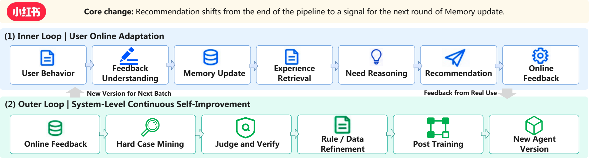

### 5.4 Humanlaya: Delivery-Driven RSI for Data Quality Assurance

Humanlaya 把当前批次的 Quality Checker–Refiner–Delivery Checker 作为内环，把跨批次的错误归因、版本化 prompt/few-shot/skill 更新作为外环。扫描 PDF 案例显示，系统把“抽取失败”与“文档质量差”拆开并在留出数据和人工复核后继承新规则；V0 到 V4 在 600 个未参与更新的任务包上将关键缺陷率从 9.0% 降到 3.7%，人工处理时间从 48 降到 27 分钟。它是有人工闸门的 scaffold-level RSI。

**内外环的边界。** 一个交付包包含任务描述、附件、参考答案、评分 rubric 和验证要求。内环在当前包里定位缺陷、修复、复查，只能改善当前数据工件；外环在多个交付批次后汇总内部审查、客户反馈和使用证据，针对反复出现的原因改质量检查系统本身，再让新版本处理未来批次。若没有外环，反复修 100 个包也只是批量 B0 式工件修复（`src/practice.tex:93-111`）。

**扫描件案例的诊断价值。** 工具解析不了三页扫描 PDF，旧 Quality Checker 因而误判附件不可用。人工确认扫描件清晰后，真正该改的是“工具失败与文件质量不能等价”的判定规则。新规则和 few-shot 先在未参与修改的任务包上验收，再人工审查、版本晋级。这个案例直观体现 RSI 对跨组件归因的要求。四次更新后，同一基础模型、工具和处理预算下，600 个留出包的关键缺陷率降低 5.3 个百分点，人工处理时间降 21 分钟；但晋级仍依赖人工真值和批准。

图把两种更新对象画得很清楚：上层内环从 task package 出发，经 Quality Checker、Refiner、Delivery Checker 修好**本批交付物**；下层外环收集真实使用、人工复核和修复失败，提出对规则、prompt、few-shot、技能的修订，经过留出包测试与人工闸门后，才把新版本用于**下一批任务**。图的下层方框排布不是时间顺序，逻辑顺序应按“反馈→提出更新→验证/人工批准→发布”阅读（`src/practice.tex:97-111`）。

**V0→V4 结果支持的主张。** 同基础模型、工具和处理预算，留出 600 个任务包上的关键缺陷率与人工处理时间都下降，因而比只展示几条成功修复更能说明质量系统版本迭代有收益。它仍是四次公司内部更新的总效果：公开材料未把每一次 prompt、few-shot 或技能修改的单独贡献拆开，也没有证明去掉人工复核后仍能安全晋级。阅读时应把“质量系统会继承”和“每个组件自改进”分开（`src/practice.tex:108-115`）。

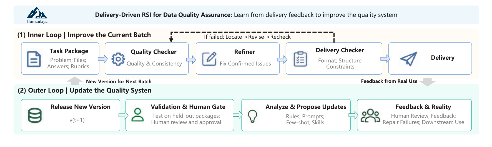

### 5.5 ModelBest: Zero-Human Industrial AI Engineering

Forge Engineering 以目标模型、硬件和并行要求为输入，从空代码库生成、测试和优化可生产实现。项目内 loop 用固定架构约束和可执行反馈优化 kernel、并行和训练实现，跨项目 loop 把成功/失败经验、参考实现和失败规则写入共享知识库；这类工程任务反馈便宜、可回滚，因而比开放式研究更接近高自治，但仍保留架构和评测边界。

**双层改进的证据。** 单个项目里，agent 按规格确定高层架构，再循环编写实现、运行正确性和性能测量、诊断瓶颈、整合成功的 GEMM/FlashAttention 等实现；项目之间，把参考实现、性能结果、成功策略和失败规则写入知识库，让下个模型与硬件任务从已有经验开始。前者主要改当前工程产物，后者才是跨项目继承的关键（`src/practice.tex:128-135`）。

**量化结果与限制。** ForgeTrain 从空目录加参考脚本/模型规格开始，报告约 8 小时达到 Megatron-LM v0.15 水平、1.5–2.5 天超越；MiniCPM4-0.5B 的 MFU 从 40.1% 至 44.1%，8B 从 47.0% 至 50.9%。ForgeStencil 报告相对公开最优实现 1.15–1.9 倍加速，端到端中位数 1.41 倍。对人工“3–5 人、6–12 个月”的比较是估算，不能当同协议随机对照；当前材料也未拆出跨项目知识库对收益的独立贡献。

**两层循环别混算。** 在 ForgeTrain 项目中，编译、训练、性能测量和正确性测试可验收当前实现；即使从零生成整套框架，也只是当前工程目标的产物。跨项目的 Experience/Knowledge Base 若把某次 GEMM 优化的条件、性能和失败策略交给下个硬件任务，才形成下轮系统能力的输入。要证明知识库提升了 improver，需把“带前项目经验”和“空库”从同一新项目起点、相同资源预算比较；只看最后一个框架的 MFU 无法定位这条反馈边（`src/practice.tex:128-135`）。

“zero-human”描述的是自动执行强度，不能理解为所有目标、规格、硬件限制和验收标准由 AI 自行决定。高层架构由人和 AI 维护的知识与规格约束，底层实现可激进试错；因此更精确的贡献是把廉价可执行反馈用于长链工程搜索，并尝试把经验证经验跨项目保存（`src/practice.tex:128-135`）。

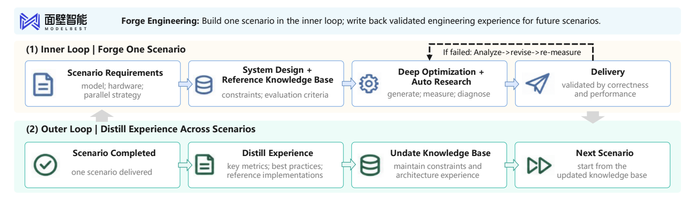

### 5.6 Tencent Hunyuan: Experience-Driven Self-Improvement

Hyra 用 Experience Bank 保存代码、产物、执行日志、分数和 evaluator 反馈，Context Agent 重组多样上下文，多个 Proposal Agent 在隔离 sandbox 中并行搜索。论文提出累积经验**可用于**修订 evaluator 以堵住 reward hacking；伴随材料报告 nanochat BPB 0.9015、nanoGPT Speedrun 76.4 秒、SOL-ExecBench 0.771，优于给出的对比值。这些发布方结果展示可执行经验的保留与复用，尚未独立验证评测器修订的效果。

**继承的不是一段文字总结。** Context Agent 把既有代码、制品、运行日志、分数和评测反馈重组成不同的启发上下文；多个 Proposal Agent 异步生成候选，在隔离环境执行，把完整轨迹写回 Experience Bank。这让后续轮次能够直接复用有用实现、组合旧策略并避开已经失败的路径。若初始 evaluator 粗糙或可被投机，系统还可能依据累积经验细化粒度、增加比较基线或修补奖励漏洞；这一步进入 L5 所关心的评测机制改动（`src/practice.tex:140-154`）。

**三项成绩不可混成一个“RSI 提升率”。** nanochat 的验证 BPB 从引用对比的 0.9109 降至 0.9015；NanoGPT Speedrun 达目标 loss 时间由 77.5 秒降至 76.4 秒；SOL-ExecBench 平均 SOL 由 0.754 升至 0.771。任务、基线、方向与单位不同，只能分别陈述。源码所给是随附材料结果，没有独立复现或多代 evaluator 改动的消融，因此不能把这三项直接归因给元改进机制（`src/practice.tex:155-207`）。

**Experience Bank 的检验点。** 它保存候选代码、执行日志与评分，而 Context Agent 必须在下一轮把相关轨迹拼入提议上下文；若只存档却不影响 Proposal Agent 的探索，闭环并未发生。可以在相同任务与总预算下对照“完整经验库”“仅最佳候选”“不读取经验库”，观察后续候选的质量与多样性。这个实验设计由文中的系统结构推出，公开数字没有单独给出该消融（`src/practice.tex:140-154`）。

评测器演化是更强、也更容易被夸大的主张。若经验库记录 reward hacking，修订 evaluator 必须有独立参考任务或人工锚点，且换尺后旧分数需重评。论文说累积经验*可用于*修 evaluator，与已经证明它经多代修订后提高后代质量是两回事（`src/practice.tex:150-154`；`src/L5.tex:63-67`）。

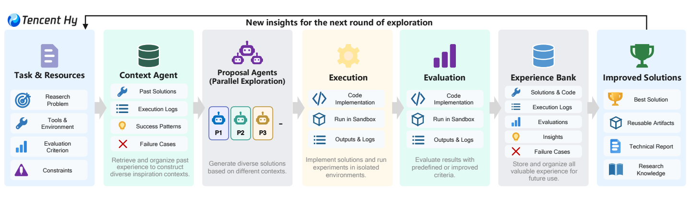

### 5.7 Agent-Native Research Lab: Verifiable Research Infrastructure for RSI

ARA 用可执行研究资产保存形式逻辑、代码/规格、成功与失败分支图和原始证据，使后继 agent 不只继承论文结论，还能重放假设和失败路径。rit 协议从日志重新抽取经验数字，Lean 4 等工具检查分析性主张，只有通过机器验证的主张才进入共享状态。作者分别报告 ARA 的既有工作问答准确率为 93.7%（传统论文 72.4%）、RE-Bench 复现率从 57.4% 升至 64.4%；另在 Chip-Bench 报告 Level-3 CPU 优化得分 5.8416，**相对相同基础模型上的标准 agent 基线**速度快 2.7%、面积小 21.5%。这些是不同评测，不能混为 Chip-Bench 的一组结果；多代同预算复利仍待验证。

**基础设施为什么重要。** 普通论文通常只保留最终叙事，丢失失败分支、具体参数、执行日志和可执行规格。ARA 同时保存形式逻辑、代码/规格、探索图和原始经验数据；后继 agent 可以检查一个结论为什么成立，也能避免重复走过的失败分支。rit 从执行日志确定性重提取经验数字，Lean 4 等形式系统检验可形式化的分析命题，目的是阻止伪造数字和不可复现结论进入共享研究状态（`src/amber.tex:1-7`）。

**证据分层。** ARA 问答与 RE-Bench 复现数字测量的是“研究资产是否更易被继承”；芯片设计中的 SystemVerilog、测试台、综合、布局布线、时序和形式等价检查则测试“工程候选能否被机器验证”。Chip-Bench 的 Level-3 CPU 结果包括 97 条定向测试和 350 个随机差分程序，但仍是特定设计任务的性能，不是整个科研系统跨多代加速的证明（`src/amber.tex:9`）。

**一次可重放研究继承。** 前代 agent 的资产应包含假设、代码与执行命令、观察结果、失败分支及最后结论；后代先用 rit 从日志重新抽出数字、用形式工具核对可形式化命题，再决定沿哪条分支继续研究。这样可阻止“论文写了 5% 增益，但日志只有 2%”的错误被永久写入知识库。被提升的是研究状态的可信度与可复用性；研究政策是否因此更会选择问题、是否在多个周期节省总资源，还需独立多代实验（`src/amber.tex:1-9`）。

形式验证也有规格边界：Lean 4 可以检查明确形式化的命题，芯片形式等价可以检验给定设计关系，但都不能替人决定科学问题是否值得做、测试台是否覆盖真实硬件风险。因此 ARA 给 RSI 提供更可靠的继承基础设施，不等于完全自动的科学判断（`src/amber.tex:1-9`）。

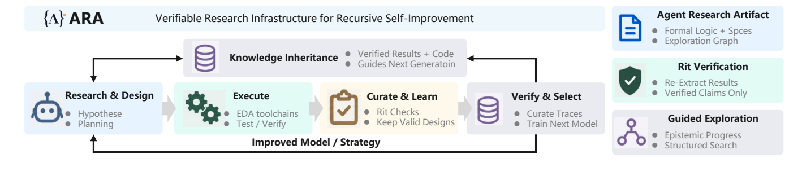

### 5.8 Frontis.AI: Enterprise Agent Evolution and Cross-Task Meta-Improvement

Frontis Horizon 的 ME–WE–MA 架构把人机交互/记忆/发布、300 多个专业 agent 的执行和 agent 构建评测演化分开。Benchmark OS 用程序检查和隔离 judge，候选版本经过回归安全、目标达成和异常鲁棒三道闸门；系统还保留问题、诊断、修改、验证和适用条件，支持跨任务元经验迁移。公司报告 76 个可比任务平均分 5.25 到 5.87，并称跨任务经验使未见任务进化快约 20%，但仍是公司自报结果。

**ME、WE、MA 的分工。** ME 负责用户交互、上下文记忆和发布批准；WE 是处理金融、法律、工程、人事等任务的专业 agent；MA 负责构建、评测和演化这些 agent。MA 收到生产反馈后，先辨别是路由、执行机制还是专业能力的问题，再给出边界明确的改进目标；人确认后可改 prompt、技能、工具和 harness。Benchmark OS 用可复现环境、程序检查和与被测 agent 隔离的模型评审降低自评偏差（`src/practice.tex:227-241`）。

**元经验如何转移。** 经验库保留问题背景、诊断理由、候选改动、验证结果和适用条件；跨任务复用时仍需重新确定权威来源、时间有效性并再次验证。公司报告两个月内发起 216 个改进任务、涉及 117 个 agent，63 个完成至少一轮；76 个可比任务平均分从 5.25 到 5.87，中位机器处理时间 27.8 分钟。“未见任务快约 20%”是累计超过 100 个任务的元经验后，在内部未见任务上，相对**不使用跨任务经验**流程的对照；35B 的 Frontis-MA1 在 MLE-Bench Lite 从 39.39% 到 60.61%（加搜索 71.21%）是另一项模型训练结果，不能等同于企业 agent 的元经验迁移（`src/practice.tex:241-247`）。

**完整的三道晋级门。** MA 提出可限制影响范围的 agent 更新后，Benchmark OS 先检查旧能力是否回退，再检查目标问题是否解决，最后检查异常或意外输入下是否稳健。三个门回答不同问题：只解决目标而破坏旧任务不能晋级；只保持旧能力却没解决问题也不是改进；对常规输入有效但一遇越界请求就失控，同样不能发布。ME 保留人类确认与发布权，MA 自治的是诊断、候选和可迁移改进经验的一部分（`src/practice.tex:227-247`）。

**20% 的比较对象。** 公司内部“未见任务进化更快约 20%”是在有无跨任务元经验的流程之间比较，较直接指向经验复用价值；它仍不能单凭一个平均速度证明通用 L5，因为任务族、经验库构建成本和最终后代质量都需配套报告。76 项可比任务得分改善证明现有范围内版本更新有效，35B 模型在 MLE-Bench Lite 的结果则属于另一个基础模型/研究 agent 能力评估，不能放进同一条因果链（`src/practice.tex:241-247`）。

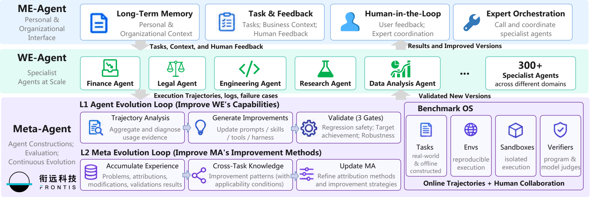

八个产业案例分别实证了不同环节，不能用单一的“RSI 效果”排序：Theseus 的固定模型环境对照和 Lark 的知识图可用性说明**条件与反馈层**的重要性；小红书和 Humanlaya 展示线上/交付反馈如何进入慢速更新，但仍有人工抽查和晋级；ModelBest 与 Hyra 更接近可执行工程搜索及跨轮经验复用；ARA 重点是研究证据可重放；Frontis 则提供跨任务经验转移的公司内部对照。每项量化结果的任务、指标和对照对象都不同，且除特定受保护实验外，多代、同预算的改进器收益仍未被这些案例共同证实（`src/theseus.tex:20-69`；`src/practice.tex:5-247`；`src/amber.tex:1-9`）。

| 案例 | 当前直接被测的变化 | 尚不能从该结果推出 |
|---|---|---|
| Theseus | 固定模型/harness 下 workspace 质量改变任务分数 | 环境→数据→模型→再环境的多代共进化已完成 |
| Lark | 图检索和自动评估改善内部任务可用性 | agent 已自治修改其评测与训练规则 |
| 小红书 | 双时间尺度系统的离线推荐得分 | 点击、转化或长期满意度必然提高 |
| Humanlaya | 留出任务包上的缺陷率与处理时间 | 无需人工验收即可安全发布质量规则 |
| ModelBest | 特定工程任务的速度/MFU 等指标 | 跨项目知识库单独造成了全部增益 |
| Hyra | 三项各自定义的工程/训练指标 | evaluator 自我修订已有独立因果收益 |
| ARA | 问答、复现和芯片设计中的可验证工件 | 整个研究组织已实现持续自我加速 |
| Frontis | 内部任务分数及未见任务改进速度 | 各领域 agent 的外部可迁移元改进普遍成立 |

### 6 Challenges and Future Directions

作者提出八条把局部自动化连接成持续 RSI 的研究线索：

1. **跨组件诊断与协同改进**：把失败转成可检验的干预假设，用冻结、消融和依赖记录区分数据、模型、工具、harness、环境和 evaluator 的作用。
2. **学习者条件化的经验获取**：同时估计经验的正确性、难度和真实学习价值，防止错误反馈进入下一轮课程。
3. **持久状态管理与可靠复用**：记录技能、记忆和工具的证据、适用条件、依赖与效果，分开测更新质量、激活、忠实执行和下游收益。
4. **领域反馈下的受治理适应**：根据科学、具身、软件和医疗的不同风险选择仿真、回放、沙盒、监督或分阶段发布。
5. **可信的改进机制演化**：把 proposer、evaluator 和 research policy 的变化分开验证，维护独立锚点，避免协同投机和跨版本不可比。
6. **继承改进能力的长期评测**：在匹配总预算下记录多轮轨迹、拒绝、回退、遗忘、迁移和资源，区分当前任务收益与产生更强后代的能力。
7. **资源感知与人机协作**：把诊断、经验获取、搜索、验证、监控和人工审查的时间与成本合并计算，并支持自适应停止、升级和终止。
8. **跨轮继承的可复现基础设施**：保存父状态、候选变化、动机证据、评测配置、验收决定和后续使用，配合版本化数据、环境和 evaluator 进行重放。

本章的总判断是：真正的 RSI 证据不是无人值守时间更长，也不是某次分数更高，而是继承变化能在明确资源和权限约束下，让后续轮次更有效地获取经验、发现干预或验证继任者。

**1. 跨组件诊断。** 任务失败可能同时来自检索资料过期、prompt 误导、工具接口变化和 verifier 漏检；更新一个组件带来的收益可能只是在补偿上游问题。实验设计应先提出“改 X 会解决 Y 错误”的可反驳假设，再冻结其他部件、做定向消融、记录交互项。Theseus 的清洁环境对照说明环境会影响固定模型表现，但尚须把环境→数据→模型的完整多代增益拆开测（`src/future.tex:59-65`）。

**2. 学习者条件化经验。** 正确性、对当前学习者的难度、训练后的长期收益是三个不同变量。AZR 的可执行判定强化正确性，R-Zero 的一致性/不确定性更偏向难度估计，两者都不能单独推出学习价值。应按相同数据访问和总训练/验证预算，对比自适应、固定课程、冻结 learner-state 输入三组，在迁移和旧能力保持上看多轮结果（`src/future.tex:66-69`）。

**3. 持久状态管理。** 一个技能可能编写正确却从未被检索，也可能被检索后没有执行，或在新模型/新 API 上过时。每个被继承产物需带来源、依赖、适用前提、接受时的配对对照与以后真实调用记录；库满时要判断合并、更新、淘汰还是再次验证。Library Drift 说明无上限添加会退化，过度退休也会损害少见任务（`src/future.tex:70-73`）。

**4. 领域治理。** 软件可以沙盒执行并回滚代码，却仍可能遗漏隐含规格；机器人无法撤销物理试验，医疗也不能用患者做无限制探索。因而系统应按改动的风险选择仿真、回放、受控上线或专家审批，监视分布变化后的效益与伤害。人掌握目标、权限和高风险发布权，并不抹掉内部改进环的自治；这些边界要在报告中明示（`src/future.tex:74-77`）。

**5. 改进机制的可信演化。** 当 proposer 和 evaluator 都能改时，彼此适应可能制造虚假上升；当评价尺度换了，历史分数也失去直接可比性。一个可检验的方案是冻结当前 evaluator 评价一段时期，用独立 anchor 验证其替代版本，再重评受影响候选；另外分别消融候选生成器和 evaluator 的修改，再检验组合收益。RQGM 提供了局部设计，仍不解决所有开放研究目标上的独立验证（`src/future.tex:78-81`）。

**6. 长时序后代能力。** 应比较原始机制与进化机制从同样初始状态出发、在同样预算和新任务上能产出什么后代，报告所有候选、拒绝、回退、失败 seed 和评测开销。DGM 式谱系提示暂时更弱的父代也可能有较强后代潜力；AIDE² 的外层效率未达显著优势说明单次成功更新不足以证明元能力。研究真正需要估计的是“继承一个修改后的改进器，让以后的每轮更有效多少”（`src/future.tex:82-85`）。

**7. 总资源与人机协作。** 只报告自动运行时长或最佳 kernel 速度，会遗漏任务设计、数据收集、候选评测、失败排查、维护和人工审查的费用。应报告达到同一受保护能力目标所需的总时间/计算/人工量，研究何时继续试验、何时升级人工审查、何时停止。初期基础设施投入可以很大，但必须由随后轮次较低的边际成本或较大有效收益抵偿（`src/future.tex:86-89`）。

**8. 可重放的继承基础设施。** 一个后继者需要的不只是父代的最终结论，还包括父状态、候选变更、动机证据、环境/数据/evaluator 版本、失败分支和验收原因。Lark 的时序数据、Humanlaya 的质量版本、Hyra 的执行经验、ARA 的研究资产是互补方向。重放与形式验证只能证明“按给定规格/日志可复核”，不能证明原实验问题或规格覆盖了真实需求；公开性、重放能力和独立复现应分别报告（`src/future.tex:90-93`）。

**八条方向之间的依赖。** 没有可靠的跨组件归因（1），经验取样（2）可能追着错误原因练习；没有状态来源和生命周期（3），部署更新（4）无法知道何时过期；没有独立评测锚点（5），长时序后代比较（6）会把换尺当进步；不计入总资源（7），任何“自我加速”都可能只是隐藏了人类审查或算力；没有可重放记录（8），前七项的因果主张都难以复核。这是对作者研究线索的依赖关系重组，不是另一个论文实验（`src/future.tex:59-93`）。

以“部署 agent 学到一个新工具”为贯穿案例：先定位失败来自模型、工具还是环境；决定搜集哪些额外轨迹；把工具版本、适用 API 和训练证据保存；用沙盒、回归和生产门验收；若验收器也更新，使用独立锚点；在多轮新任务上测调用与迁移；把评估、人审和维护成本计入；最后保留可重放谱系。少任意一环，能提出的结论就相应收窄，比如只有沙盒通过只能说候选可执行，不能说部署后持续获益（`src/future.tex:59-93`）。

### 7 Conclusion

结论将路线图收束为五个阶段：执行改进、选择策略、获取经验、环境适应和递归元改进。论文的贡献是提供共同的 improvement-loop 语言，把科学、具身、软件和医疗反馈条件放在同一框架下，并用产业案例说明当前能力主要停留在组件和流程级；是否能在长时间、多代、可比预算下累积可迁移收益，仍需进一步评测。

**我的证据判读。** 这篇文章更强的贡献是“判定语言与研究议程”，不是已经演示出通用 RSI：B0 输出修订与 L1/L2 工程自动化的证据较多；L3 依赖学习者条件化经验是否真正带来跨轮收益；L4 要看部署反馈和持久状态的激活/回退；L5 目前主要有受限机制原型及自报产业实践。论文将结构上的递归与效能上的递归分开，是避免夸大领域进展的关键。其限制在于引证系统异质、工业资料自报较多、HCI 原始逐项数据未随归档提供，并缺少统一的长时序同预算实证比较。阅读时应将“作者提出的路线”“被引用系统报告的数字”和“独立确立的结论”分层保留（`src/conclusion.tex:10-13`）。

**这篇综述能直接帮助做什么。** 面对任意“AI 自我改进”系统，先画出被追踪的 AI system 与外部任务产物；逐轮列出 experience、target、improver/strategy、verifier、accepted change 和 successor；标出人或固定基础设施控制的目标、取样、预算与发布；最后把结构闭合、独立收益和资源效率分开报告。若画不出后继者重新读取改变的时刻，最多是局部自动化；若画得出却无同预算对照，最多是结构递归。这个读法把第 2 章的概念工具落到第 3–5 章的案例判断（`src/foundations.tex:91-129`；`src/conclusion.tex:10-13`）。

**论文没有解决的核心问题。** 大量系统已经能持久修改 prompt、工具、harness、权重或研究政策，但“更强的一代是否在相同总资源下更会产生下一代”仍缺长期共同基准。需要多种初始模型、未知任务、冻结参考集、完整失败谱系和人工成本账；否则当前实验容易把更高任务分数、更多搜索、评测器漂移和真正的改进机制提升混在一起。它给出的是可操作的研究议程，而不是某个未来能力时间表（`src/L5.tex:84-119`；`src/conclusion.tex:10-13`）。

## 代表性工作矩阵

| 层级/场景 | 代表系统 | 持久化对象 | 主要外部约束 | 论文中的证据判断 |
|---|---|---|---|---|
| B0 | Self-Refine、Reflexion | 当前会话上下文 | 固定流程和评测 | 输出改进，非 RSI |
| L1 | FineWeb-Edu、EDIT、AIPC | 数据、训练/部署产物 | 目标、流程、验收标准 | 执行自治较成熟 |
| L2 | GEPA、ADAS、AutoResearch、AutoKernel | prompt、harness、训练/实现方案 | 目标、指标、预算 | 策略搜索可验证但易过拟合 |
| L3 | AZR、R-Zero、VOYAGER、SIMA 2 | 课程、任务、技能、经验 | 任务格式、奖励、更新规则 | 学习议程自治依赖反馈质量 |
| L4 | ACE、PANDO、Metis、Tax AI | 记忆、技能、工具、代码 | 权限、回归测试、人工发布 | 部署适应有早期证据 |
| L5 | STOP、RQGM、A-Evolve-Training、Hyra | improver、evaluator、研究策略 | 目标、锚点、资源和 substrate | 主要是受限原型/产业早期证据 |
| 应用域 | Science、Embodied、Software、Healthcare | 工具、策略、技能、工作流 | 实验/物理/测试/临床反馈 | 反馈 regime 决定可达自治 |

## Benchmarks / Datasets / Frameworks

- **HCI**：按 benchmark 进入年份前沿归一化不同能力轨迹，适合观察剩余能力空间，但依赖协议可比性。
- **软件与 agent**：SWE-bench、SEA-Eval、SEAGym、HarnessDev、S3Gym，关注执行、回归、迁移和后代质量。
- **经验/记忆**：Evo-Memory、PANDO、Metis、Library Drift，关注长时序复用、激活和技能生命周期。
- **科学/研究**：MLE-Bench、PaperBench、AI Scientist-v2、RE-Bench、Chip-Bench，关注可执行实验、复现和研究资产继承。
- **产业框架**：Lark data foundation、Humanlaya quality loops、ModelBest Forge、Hyra Experience Bank、Frontis Benchmark OS、ARA/rit。

这些资源的共同缺口是：多代、匹配预算、独立评测和“改进机制本身”的长期效果尚未形成统一标准。

## 关键图表与表格

### 关键图

- **RSI 五级概览图**：展示从 L1 执行到 L5 元改进的责任扩张，适合作为全文导航。
- **HCI 能力轨迹图**：显示数学/科学与软件/工具代理的不同增长速度，并用阴影区域示意 RSI 可能优先填补剩余空间。
- **五类 loop 图**：把每级新内化的组件标出来，直观区分 B0、L1–L5 的闭环位置。
- **应用 regime 图**：说明科学、具身、软件、医疗在反馈可验证性和代价上的差异。
- **L3/L4/L5 loop 图**：分别强调学习议程、部署持久化和改进机制继承。

### 关键表格

- **邻近范式对比表**：用跨轮学习、持久保留、自修改、候选提议、验证、继任者重入、机制修订和机制复用区分持续学习、AutoML、agentic AI 与 RSI。
- **L1–L5 技术/产业表**：按改进对象和外部约束排列代表系统。
- **HCI 域轨迹表**：汇总不同 benchmark family 的协议链接、来源权重和域级聚合。
- **产业 landscape 表**：把公司案例映射到自治层级、改进对象和是否有多轮证据。

图表的共同阅读方式是先看“什么被改变和继承”，再看“谁决定验收”；不要把图中的示意延伸端点当作实证预测。

## 开放问题与未来方向

最关键的开放问题可以压缩为四个：

- 如何在跨组件、跨任务、跨模型迁移时做可靠归因？
- 如何让 learner-conditioned experience 同时满足正确性、覆盖、难度和学习价值？
- 如何管理会过时、会冲突、可能被错误激活的持久状态？
- 如何在评测器会被优化的情况下，证明改进机制真的产生了更强后继者？

论文还把人工权限、资源成本、回滚、可复现性和独立复现视为 RSI 的组成条件，而不是事后治理附加项。

## 可复用研究线索

1. 把任何“自我改进”系统画成五元链：经验来源 → 改进目标 → improver/strategy → verifier/acceptance → 继承状态。
2. 为每个更新记录触发证据、适用条件、调用情况、旧能力影响和回滚路径。
3. 用 learner-independent、冻结机制、留出任务和新环境对照，拆分额外搜索、额外数据和真正机制收益。
4. 把“更新质量”和“运行时使用更新的能力”分开评估。
5. 对 L5 实验报告多轮完整轨迹、总成本、拒绝和回退，而不只报告最佳后代。

## 对我当前研究/项目的启发

如果把这套框架用于一个 agent 或训练系统，第一步不是增加一个“自我反思”模块，而是明确要把哪类责任交给系统：执行、策略、经验、部署适应还是机制继承。随后应建立版本化经验库、独立评测集、可回滚发布和跨轮 provenance；只有当更新在后续任务中被实际调用并改善下一轮改进，才应使用 RSI 这一强表述。

## 附录 A：RSI Landscape 与改进目标分类

附录 A 的环图覆盖作者纳入的 **491 篇论文**：内圈是 L1–L5 自治等级，中圈是主要改进对象，外圈是细分目标。读图可得 L1 215 篇（43.8%）、L2 155 篇（31.6%）、L3 64 篇（13.0%）、L4 28 篇（5.7%）、L5 29 篇（5.9%）；L1+L2 共 75.4%。等级百分比按论文数计算；一篇论文若同时修改多个对象，对目标类别贡献的是分数权重，所以不能把各目标扇区解释为互斥论文数。这张图揭示现有研究“改什么”的分布，不是各级 RSI 已经成功的概率（`src/appendix.tex:17-45`；`figures/RSI-Landscape.pdf`）。

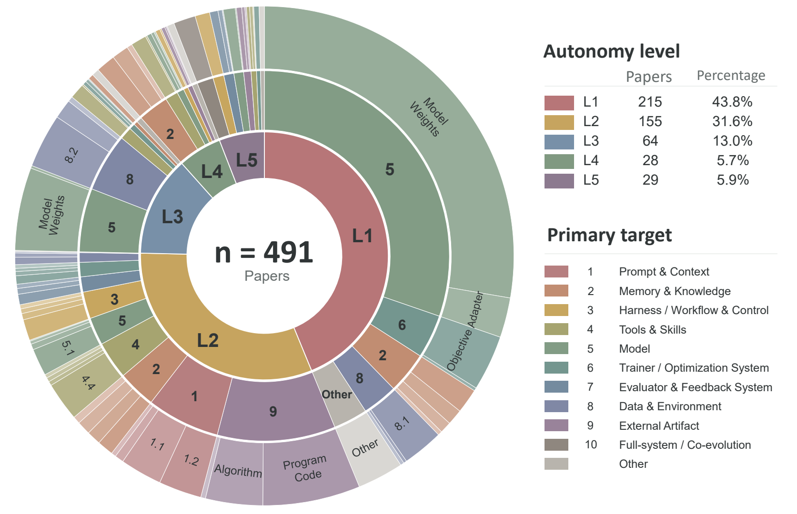

附表把可修改部件归成十组，环图还设有 **Other** 残余类；十组不是对每个图中扇区的穷尽命名。读它时要把“目标所在系统内外”与“是否改进未来改进机制”两轴同时看：

| 主类 | 可修改部件举例 | 判读重点 |
|---|---|---|
| 1 Prompt & Context | 系统提示、few-shot、上下文构建 | 更新是否跨任务继承，还是当前提示修订 |
| 2 Memory & Knowledge | 经验、技能知识、检索索引 | 是否记录来源、适用条件与失效情况 |
| 3 Harness / Workflow & Control | agent 控制流、工作流、协调和路由 | 新控制逻辑是否在后续调用 |
| 4 Tools & Skills | API、可执行工具、技能包 | 是否有执行检查、版本和回滚 |
| 5 Model | 权重、适配器、架构等 | 模型更新与其他层的收益需分开归因 |
| 6 Trainer / Optimization System | 训练算法、优化器、搜索器 | 已触及产生后代的过程，但需看是否继承 |
| 7 Evaluator & Feedback System | reward、verifier、credit assignment | 尺子变化后必须保留独立锚点 |
| 8 Data & Environment | 训练经验、课程、仿真器、世界模型 | 更新经验来源能否改善后续学习 |
| 9 External Artifact | 产物代码、算法、科学/设计成果 | 只改外部工件本身不证明 AI 自改进 |
| 10 Full-system / Co-evolution | 多目标 harness、模型—harness、改进环 | 是否有跨组件因果归因及机制继承 |

第 9 类尤其重要：自动发现新算法、设计电路或修产品代码，可能是非常强的 AI 应用，却不能仅凭产物改进认定为 RSI。第 10.3 类才明确把“生成、评估、选择和应用未来更新的环”列为目标，是与 L5 判定最贴近的目标标签；目标标签和自治等级仍非同一维度（`src/appendix.tex:45-331`）。

## 附录 B：产业系统图谱

产业表按**组织类型**整理 72 家不同公司或团队、每项产品/代表工作一行，公开资料截点为 2026 年 9 月。六类分别为：A 前沿基础模型与通用 agent 实验室；B 以 RSI/AI4AI 为核心的公司；C 自治研发与科学发现公司；D agent 优化、评估和学习基础设施；E 具身、世界模型与持续适应公司；F 持久记忆与个人 AI 公司。表格标签将案例映射到 B0–L5，只是作者的分析归类，不是企业自称的级别；`adj.` 表示仅有 RSI 邻接设施/行为，`cand.` 表示该等级有可能但尚未充分证明，`target` 是未来目标而非当前能力。带星号的企业身份或技术边界还需更强公开验证（`src/appendix.tex:349-359`；`tables/industry_table.tex:14-19,60-358`）。

这张表主要提供**查找证据的入口**：同一企业可能同时提供模型、数据和 agent 产品，但某个产品是否有持久更新环，须回到技术资料核对继承对象、评测与发布权。尤其“持续记忆”不自动是 L4，“自动科研”不自动是 L5。第 5 章八个深入案例在机制与指标上更具体，产业大表则覆盖面更广、证据强度不一。

## 附录 C：四个应用域的组件级证据

附录 C 是第 4 章的正式展开，不是无关补充。每域先描述反馈性质和改进环，再按照可修改部件梳理系统，最后对照 B0–L5 判断距离完整 RSI 还有什么缺口。同一系统可以跨领域，分类并不互斥（`src/appendix.tex:457-479`）。

### C.1 科学发现：从实验工件到科研能力

**假设模块。** HypoForge 把批评和执行结果分别沉淀为假设生成、实验设计、执行技能；EvoScientist 检索有前景和失败过的研究方向，修改未来提案。TTT-Discover 以测试时强化学习更新模型，聚合物发现系统把模拟评估过的候选写回训练数据并重训生成器。前两者主要是记忆/程序技能继承，后两者触及生成模型；四者通常仍在固定领域目标和选择规则内运行。改进当前的聚合物候选不是改进假设生成能力，需分别衡量（`src/appendix.tex:495-504`）。

**实验 agent。** Test-Time Tool Evolution 在 SciEvo 的 1,590 项任务中演化了 925 个工具，重点是“生成→验证→以后可调用”；CASCADE 保存化学/材料技能，S1-NexusAgent 从完整轨迹提炼 Scientific Skills，SkillFoundry 从论文、代码库和 API 编译、验证、合并或裁剪技能包。DrugSAGE 将 16 项任务的经验证程序、训练策略和常见故障应用到 17 项留出任务，提供跨任务复用的直接证据；STELLA、EarthLink、OriGene 分别扩展生物医药工具、气候脚本和分析模板。白盒流体控制例还需要把最终 controller 的改善与**造 controller 的 agent**改善分开。科学技能可靠继承还需明确使用前提、执行测试、来源、版本和回滚；工具库变大本身不是收益证据（`src/appendix.tex:505-519`）。

**反思和改进器。** SIA 的 Feedback-Agent 能在 scaffold、工具、重试/搜索逻辑和 LoRA 权重之间选修订对象；CORAL 用长期异步 agent 根据既往尝试安排试验、评估调用和共享经验；SAGA 在固定高层科研目标下重权重或新增可执行子目标。它们触及跨组件干预和研究优先级，但固定的总体目标、evaluator、接纳程序仍明显。附录判定：成熟的是 B0/L1，L2 是当前最强前沿，L3 有早期经验选择证据；要称完整科研 RSI，还须证明假设、实验与解释机制跨轮一起变得更有效，而不只是本轮科学结果更好（`src/appendix.tex:520-560`）。

### C.2 具身智能：课程、技能、策略和世界模型共演化

**环境与课程。** POET 共演化环境—agent 对，利用“不太容易也不至于无解”的最小准则、政策转移来保留踏脚石；EnvGen 根据小型 RL agent 的薄弱技能生成仿真配置；GenEnv 将模拟器参数视为可训练课程政策，用接近学习者能力边界的奖励选题。OMNI-EPIC 生成可执行环境和奖励代码，并利用旧任务 archive 与进度寻找新颖可学任务；SimWorld Studio 编写 Unreal Engine 环境代码，通过编译、物理与视觉批评修复，再根据学习者表现安排更难世界。它们让未来经验分布受 learner 影响，但虚拟世界有效不自动外推到真实机器人（`src/appendix.tex:578-587`）。

**技能、记忆和 harness。** Voyager 存可执行 Minecraft 技能；LRLL 通过探索及 wake–sleep 整理组合机器人程序；EmbodiSkill 区分“技能本身错”与“agent 没按正确技能执行”，防止错误归因。SHAPER 联合修改技能和上下文代码，ASPIRE 诊断运行失败后测试并保留修复，ENPIRE 让 coding agent 在重复真实实验中改机器人政策、训练流程及支撑基础设施。后者触及较广的自修改，但环境接口、评测器与安全约束仍固定（`src/appendix.tex:588-595`）。

**政策与世界模型。** Self-Improving Embodied Foundation Models 用预训练模型导出成功信号让机器人练习；MEDAL++ 学会完成及撤销动作以减少人工 reset；Q-Planning 冻结大行为克隆政策、只根据成败轨迹更新小 value function；SERP 从近期导航失败调动作模型。VLAW 用真实轨迹改动作条件视频世界模型，再生成合成经验；World-VLA-Loop 让政策失败改世界模型、改过的世界模型再训练政策；Motus2 把政策、仿真、评价函数整合，SAIL 用执行后的轨迹微调视频规划器。**我的评测建议**是将政策、世界模型和课程分别冻结做消融，并在新的环境/机器人硬件上验证有效共演化（`src/appendix.tex:596-634`）。

附录的阶段判断是：L1 政策/模型更新已有，L2 可自选技能与 harness 修订，L3 的 learner-conditioned 经验选择出现，L4 的环境适应主要在仿真；ENPIRE 有受限 L5 特征。物理试验不能任意重置或撤销，未来系统还须对完整感知—规划—控制链归因，记录不确定性并在安全约束下发布。

### C.3 软件工程：产品修复与 agent 自修改分离

**agent 实现和 harness。** SICA 把 coding agent 的 Python 实现当作可编辑项目，读取历史版本/基准后自改，再用选中版本继续迭代；Self-Harness 从执行轨迹找重复弱点，让同一模型改 harness，并通过回归测试保留；Agentic Harness Engineering 将中间件、验证规则和控制逻辑拆为可单独编辑/撤销的文件，用结构化轨迹验证预测效果；Ouroboros 将审查通过的工具、上下文、prompt 与核心逻辑投入后续运行。四者都要在固定 benchmark、utility、sandbox 或人工审核之外审视其自治边界（`src/appendix.tex:654-666`）。

**经验与协作。** SWE-Exp 检索成功和失败 issue 轨迹；CODESKILL 提炼多层级程序技能，并随新轨迹更新或删除，保持技能库紧凑；EvoMAC 修改多 agent 的角色 prompt 和通信连接，不过报告的更新发生在每个任务测试时，不一定跨独立任务继承。关键判定是新技能或协作结构是否真正成为后续新 issue 的起始状态，而不只是当前仓库的一次性调试材料（`src/appendix.tex:667-674`）。

**改进过程。** DGM 保留多个 coding-agent lineage，让较弱分支仍可能成为未来父代；HGM 用后代谱系估计 metaproductivity，把**评测资源**更多分配给长期改进潜力更强的 agent，但其元选择规则本身没有持续自修改。Group-Evolving Agents 分享多父代成功和失败经验；DarwinX 在冻结模型外演化整套 harness，同时保护已解决任务；HELIX 提议 harness 改善当前执行、产出可验证轨迹再改模型、随后重建 harness 的循环。DGM/HGM 的启示是当前 benchmark 分数与“产生强后代的能力”不同；**我的评测建议**是保存完整谱系，并与固定资源分配或父代选择策略作对照（`src/appendix.tex:675-681`）。

附录判断 L2 最扎实，L3 的 Self-play SWE-RL/Socratic-SWE 属新兴课程方向，真实部署 L4 尚少；SICA/DGM 呈现部分、过渡性的 L5 特征，但完整的“改进软件研发 improver”收益未证明。软件测试可执行也不完备，用户意图、维护性、安全与跨仓库转移仍需外部检查（`src/appendix.tex:682-710`）。

### C.4 医疗：临床反馈必须受控继承

**临床记忆与知识。** MedAgent-Zero/Agent Hospital 把模拟就诊中的成功病例和失败教训写成未来可检索规则；Agent Mental Clinic 由监督模块对照标签，在分层记忆中保存诊断经验；MedAgentSim 合并病历与模拟互动经验。DxEvolve 将诊断过程压缩成可复用的“认知原语”；GSEM 用双层图记录经验和关联边，并按后续反馈调可信度；Evo-MedAgent 分开存临床案例、程序启发和工具可靠性。比起无限追加病例，后面三者更关注什么记忆何时适用，但目前多是模拟或回顾性标签证据（`src/appendix.tex:725-735`）。

**推理与协作策略。** EvoClinician 的 Diagnose–Grade–Evolve 环中，Actor 逐步问诊/开检查，Process Grader 衡量临床收益与成本，Evolver 改下一例会使用的 prompt 和记忆；这比在本例修正最终诊断更接近策略继承。EvoMDT 让肿瘤多学科各专科 agent 的 prompt、共识权重和检索范围随专家反馈调整；PsychAgent 将咨询轨迹提炼为技能，还用 rejection fine-tuning 内化部分技能。仍应检查过程评价是否与真实患者收益一致（`src/appendix.tex:736-744`）。

**工具与工作流。** MACRO 从验证过的影像处理轨迹构造复合工具并注册为未来高层动作；SkeMex 用 Read–Write–Assess–Govern 生命周期促进、合并、更新或删除临床技能；TissueLab 让专家纠正病理/影像/空间组学中间结果，指导主动学习与流程修订；HealthFlow 将 EHR 分析转成 safeguard、工作流、数据集锚点和代码片段，由 evaluator 找缺陷、reflector 验收/淘汰。工具技术上可运行、单病例反馈正确，都不足以证明跨人群、机构或时间安全（`src/appendix.tex:745-754`）。

附录判定医疗当前以 L1 持久病例知识和 L2 固定验收下的策略/工具改进为主，少数系统有 L3 式主动取证，EvoPatient 的模拟医患共演化可视作 L4 式探索；**真实纵向临床结果驱动的端到端 L4 与临床改进器 L5 仍基本空缺**。未来每个持久更新都须留下来源、适用人群、证据与不确定性，由临床机构把关、前瞻监测并可撤销（`src/appendix.tex:755-778`）。
